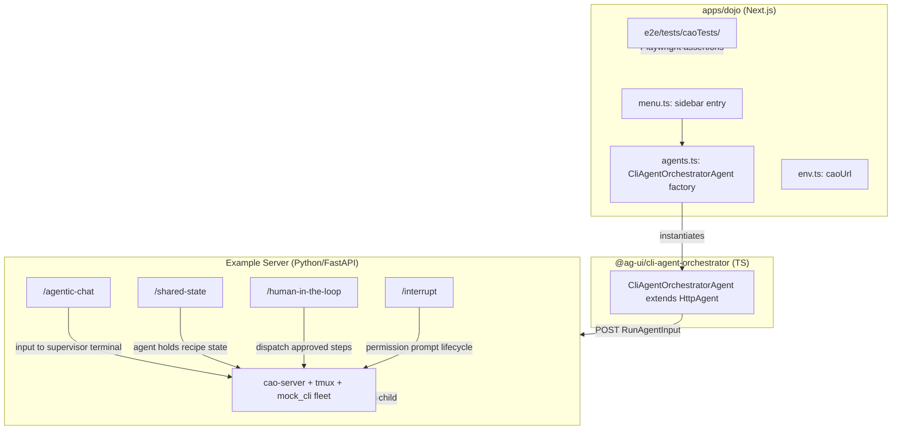

# Design Document: Upstream AG-UI Dojo Integration

> Tracking issue: awslabs/cli-agent-orchestrator **#458** (Phase-3 item: AG-UI
> ecosystem / Dojo listing). Builds on the **L2 construct library** spec
> (`.kiro/specs/agui-l2-constructs/`). This design operationalizes the partnership
> framing from issue **#386**.
>
> **Grounding:** every upstream mechanical claim was verified against **ag-ui main @
> `b646b46`** (CONTRIBUTING.md, `apps/dojo/*`, `integrations/*`, `render.yaml`,
> `.github/workflows/dojo-e2e.yml`) on 2026-07-17. CAO-side capabilities reference
> **cli-agent-orchestrator main @ `1b00753`** (merged L1 from PR #436) and the Phase-2
> spec.

---

## Overview

CLI Agent Orchestrator is a fundamentally different kind of AG-UI integration source:
an **orchestrator of real CLI coding-agent processes** (Kiro CLI, Claude Code, Codex,
and seven more providers running in tmux terminals) that normalizes a heterogeneous
fleet into one event vocabulary and streams it over AG-UI. The Dojo integration makes
it render something no current integration can show: **live OS processes as agents** --
a multi-agent fleet with real handoffs, shared fleet state convergent by RFC 6902
deltas, and -- the flagship -- **real provider permission prompts surfaced through
AG-UI's shipped interrupt lifecycle**, approved or denied from the browser and resumed
into a live terminal.

### Goals

- Land `cli-agent-orchestrator` in the AG-UI Dojo with four feature pages (agentic
  chat, shared state, human-in-the-loop, interrupt).
- Ship a required TypeScript thin-client + a Python example server that boots a real
  fleet underneath the dojo demos.
- Pass all e2e tests deterministically using `mock_cli` (keyless, no external APIs).
- Demonstrate the interrupt lifecycle against a real process permission gate (first
  integration to do so).
- Follow all upstream contribution rules (issue first, e2e gate, structure rules).

### Non-Goals

- Hosted dojo service provisioning on Render (maintainer-side follow-up).
- Net-new feature pages (`multi_agent_fleet`, `agentic_generative_ui`,
  `tool_based_generative_ui`) -- stretch items for follow-up PRs.
- `docs.copilotkit.ai` per-integration page (lives outside the ag-ui repo).
- npm publishing / release-scope changes (maintainer-side).
- Changes to CAO core for dojo-specific concerns.

---

## Grounding Notes (Source-of-Truth Pins)

Facts this design depends on, verified 2026-07-17:

**ag-ui main @ `b646b46`:**
- CONTRIBUTING.md: issue first; you maintain it; required structure
  (`integrations/<name>/{python,typescript}`); server env contract (`HOST`/`PORT`);
  e2e tests are a hard gate; no CLA/DCO.
- `apps/dojo/src/menu.ts`: 26 existing integrations, each single-framework; the
  menu is the single source of truth for sidebar entries; `IntegrationId` derives
  from it.
- `apps/dojo/src/agents.ts`: integration → agent factory mapping; pattern
  `mapAgents((path) => new XAgent({url: ...}), featureMap)`.
- `apps/dojo/src/env.ts`: `envVars` object with per-integration URL keys +
  `process.env.*` defaults.
- Port allocations: 8000-8023 claimed; 8024 is the verified next free port.
- `apps/dojo/e2e/`: Playwright specs under `tests/<integration>Tests/`; feature
  pages under `featurePages/`; shared helpers.
- `.github/workflows/dojo-e2e.yml`: matrix-based with `suite`, `test_path`,
  `services`, `wait_on` keys.
- `apps/dojo/scripts/prep-dojo-everything.js`: `ALL_TARGETS` map for dependency
  install per integration; `run-dojo-everything.js`: `ALL_SERVICES` map for
  starting each integration + env injection into the dojo service.
- `apps/dojo/scripts/generate-content-json.ts`: `agentFilesMapper` populates the
  code viewer; output committed as `src/files.json`.
- `integrations/adk-middleware/typescript/`: reference TS-client shape (`tsdown`,
  `vitest`, `publint --strict && attw --pack`, `publishConfig.access: "public"`).
- `integrations/server-starter-all-features/python/examples/`: reference example
  server with the exact contract for each feature scenario.
- Interrupt feature: only Mastra ships the interrupt page today; native structured
  outcome emitters are Mastra and AWS Strands TS (both suspend on mock/SDK tools).
- `render.yaml`: 22 web services (dojo + 21 integration backends).

**CAO main @ `1b00753`:**
- `mock_cli` provider: keyless, deterministic; scripted-prompt mode being added in
  Phase-2 (Task 12) for `WAITING_USER_ANSWER` simulation.
- Run plane: `POST /agui/v1/run` (Phase-2 Task 13) speaks the stock AG-UI wire
  dialect with interrupt lifecycle support.
- `cli-agent-orchestrator[agui]` extra: official `ag-ui-protocol` SDK dependency for
  the run plane.
- CI demo-recording pattern: `examples/agui-eventsource-viewer/tools/record-demo.mjs`
  -- reusable for PR evidence.

---

## Architecture

### Two-Repo Split

```
ag-ui repo (upstream PR):
  integrations/cli-agent-orchestrator/
  ├── python/
  │   ├── examples/                    # the dojo example server
  │   │   ├── pyproject.toml           # uv-managed; dep: cli-agent-orchestrator[agui]
  │   │   └── server/__init__.py       # FastAPI app: one endpoint per feature
  │   └── README.md
  └── typescript/                      # required thin client
      ├── package.json                 # @ag-ui/cli-agent-orchestrator
      └── src/index.ts                 # export class CliAgentOrchestratorAgent extends HttpAgent

  apps/dojo/
  ├── src/menu.ts                      # + sidebar entry
  ├── src/agents.ts                    # + agent factory
  ├── src/env.ts                       # + caoUrl
  ├── package.json                     # + workspace:* dep
  ├── scripts/generate-content-json.ts # + file mapper entry
  ├── scripts/prep-dojo-everything.js  # + target
  ├── scripts/run-dojo-everything.js   # + service + env injection
  └── e2e/tests/caoTests/              # 4 Playwright specs

  .github/workflows/dojo-e2e.yml       # + matrix entry
  docs/introduction.mdx                # + row
  docs/integrations.mdx                # + bullet

CAO repo (awslabs -- prerequisites):
  Phase-2 run plane, interrupt lifecycle, mock_cli scripted prompts (already spec'd)
  PyPI publish of cli-agent-orchestrator[agui]
```

### Integration Constants

| Thing | Value |
|---|---|
| Menu/integration id | `cli-agent-orchestrator` |
| Display name | `CLI Agent Orchestrator (awslabs)` |
| npm package (TS client) | `@ag-ui/cli-agent-orchestrator` |
| Env var / `envVars` key | `CAO_URL` / `caoUrl` |
| Dev/CI port | **8024** |
| e2e suite | `suite: cli-agent-orchestrator` |
| e2e test_path | `tests/caoTests` |
| e2e services | `["dojo", "cli-agent-orchestrator"]` |
| e2e wait_on | `http://localhost:9999,tcp:localhost:8024` |

### Component Interaction



---

## Components and Interfaces

### TypeScript Client (`@ag-ui/cli-agent-orchestrator`)

```typescript
// src/index.ts
import { HttpAgent } from "@ag-ui/client";

export class CliAgentOrchestratorAgent extends HttpAgent {
  constructor({ url }: { url: string }) {
    super({ url });
  }
}
```

Shape follows `integrations/adk-middleware/typescript/`:
- `package.json`: name `@ag-ui/cli-agent-orchestrator`, `tsdown` build, `vitest`
  test, `publint --strict && attw --pack` export validation, `publishConfig:
  {access: "public"}`.
- Minimal: re-exports `HttpAgent` bound to the CAO example server URL; no
  CAO-specific wire logic.

### Example Server

A thin FastAPI application (`uv run dev`) that:

1. Boots `cao-server` + tmux + `mock_cli` fleet as a child process on startup.
2. Binds `0.0.0.0` (or `HOST`) on `PORT` (default 8024).
3. Exposes four endpoints, each implementing the dojo's standardized scenario
   contract (verified against
   `integrations/server-starter-all-features/python/examples/`).

#### Endpoint Contracts

| Path | Dojo scenario | CAO implementation |
|---|---|---|
| `/agentic-chat` | User sends message, agent replies with streamed text | Route input to supervisor terminal; stream `TEXT_MESSAGE_*` events from mock_cli output |
| `/shared-state` | Recipe editor: agent manages title/ingredients/instructions | Agent holds recipe state; emits `STATE_SNAPSHOT` + RFC-6902 `STATE_DELTA` as recipe updates |
| `/human-in-the-loop` | `generate_task_steps` then execute approved steps | Generate steps, present for approval; on resume, dispatch approved steps as handoffs to worker terminals |
| `/interrupt` | Provider permission prompt, approve/deny from browser | Drive a (scripted/real) permission prompt; emit `RUN_FINISHED outcome=interrupt`; on `resume[]` deliver keystrokes to the live terminal |

#### Design Decisions

- **Dojo-agnostic CAO core**: the example server lives entirely in the ag-ui repo;
  CAO core gets no dojo-specific code. The server depends on the published
  `cli-agent-orchestrator[agui]` PyPI package.
- **Same scenarios, real processes**: the dojo feature pages have standardized demo
  contracts (recipe editor, step planner, etc.). CAO implements the *same
  scenarios* but executed by real orchestrated processes -- which is the
  demo-worthy difference.
- **Keyless CI**: `mock_cli` scripted mode requires no credentials. The dojo CI
  routes LLM traffic to aimock (`:5555`) for most suites, but CAO needs neither
  aimock nor real keys.

### Dojo Wiring

#### `menu.ts` entry

```typescript
{
  id: "cli-agent-orchestrator",
  name: "CLI Agent Orchestrator (awslabs)",
  features: ["agentic_chat", "shared_state", "human_in_the_loop", "interrupt"]
}
```

#### `agents.ts` factory

```typescript
"cli-agent-orchestrator": async () => ({
  ...mapAgents(
    (path) => new CliAgentOrchestratorAgent({ url: `${envVars.caoUrl}/${path}` }),
    {
      agentic_chat: "agentic-chat",
      shared_state: "shared-state",
      human_in_the_loop: "human-in-the-loop",
      interrupt: "interrupt"
    }
  ),
}),
```

#### `env.ts` addition

```typescript
caoUrl: process.env.CAO_URL || "http://localhost:8024"
```

#### Scripts integration

`prep-dojo-everything.js`:
```javascript
ALL_TARGETS["cli-agent-orchestrator"] = {
  command: "uv sync",
  cwd: "integrations/cli-agent-orchestrator/python/examples"
};
```

`run-dojo-everything.js`:
```javascript
// In ALL_SERVICES:
"cli-agent-orchestrator": {
  command: "uv run dev",
  cwd: "integrations/cli-agent-orchestrator/python/examples",
  env: { PORT: "8024" }
}
// In dojo and dojo-dev env:
CAO_URL: "http://localhost:8024"
```

---

## Upstream File-Touch Checklist

Verified against `aws-strands`/`watsonx` contribution traces:

| # | File/Directory | Change |
|---|---|---|
| 1 | `integrations/cli-agent-orchestrator/{python,typescript}` | Package + example server (see Components) |
| 2 | `apps/dojo/src/agents.ts` | Import + agent factory |
| 3 | `apps/dojo/src/menu.ts` | Sidebar entry |
| 4 | `apps/dojo/src/env.ts` | `caoUrl` key + default |
| 5 | `apps/dojo/package.json` | `"@ag-ui/cli-agent-orchestrator": "workspace:*"` |
| 6 | `apps/dojo/scripts/generate-content-json.ts` | `agentFilesMapper` entry; regenerate + commit `src/files.json` |
| 7 | `apps/dojo/scripts/prep-dojo-everything.js` | `ALL_TARGETS` entry |
| 8 | `apps/dojo/scripts/run-dojo-everything.js` | `ALL_SERVICES` + env injection into dojo/dojo-dev |
| 9 | `apps/dojo/e2e/tests/caoTests/` | 4 Playwright specs |
| 10 | `.github/workflows/dojo-e2e.yml` | Matrix entry |
| 11 | `docs/introduction.mdx` | Supported-Integrations row |
| 12 | `docs/integrations.mdx` | Bullet entry |
| 13 | `.github/CODEOWNERS` (optional) | `integrations/cli-agent-orchestrator @ag-ui-protocol/copilotkit @plauzy` |

**Explicitly NOT in the contributor PR** (maintainer-side, request in the issue):
- `prepare-release.yml` scope + npm trusted-publisher record
- `render.yaml` service + `CAO_URL` env on the hosted dojo
- `docs.copilotkit.ai` integration page

---

## Feature Set

### MVP (4 features, 4 e2e specs)

| Feature id | Dojo scenario | CAO wow factor |
|---|---|---|
| `agentic_chat` | Chat with an agent | Table stakes; real supervisor terminal underneath |
| `shared_state` | Recipe editor | Same contract, real process updating state via fleet snapshot/deltas |
| `human_in_the_loop` | Generate then execute steps | First HITL demo whose approved plan executes on real agents |
| `interrupt` | Permission prompt approve/deny | **Flagship.** First integration whose interrupt is a real process permission gate |

### Stretch (follow-up PRs, discuss in Phase 0 issue)

- `agentic_generative_ui` / `tool_based_generative_ui`: fleet task as step state +
  `emit_ui`-style intents.
- `multi_agent_fleet` (net-new feature page): session-to-terminal hierarchy, handoff
  timeline, approval cards -- needs a new `Feature` union entry + page component
  upstream; lives or dies by maintainer appetite.

---

## Interrupt Feature Deep-Dive (Flagship)

### Why it is distinctive

The dojo interrupt page's existing implementations (Mastra only today) suspend on
mock/SDK tool invocations. CAO drives the interrupt lifecycle from **real OS-process
permission prompts**: claude_code asks "Allow tool X?", that status transition
becomes an AG-UI interrupt event, the browser renders an approve/deny card, the
decision becomes keystrokes in the live terminal.

### Event sequence

```
1. mock_cli (scripted) enters WAITING_USER_ANSWER state
2. ApprovalBridge captures prompt, opens Interrupt
3. Example server emits: STATE_SNAPSHOT, then RUN_FINISHED outcome=interrupt
4. Dojo page renders the interrupt card (reason: "claude-code:permission_request")
5. User clicks Approve/Deny
6. Dojo sends new POST /interrupt with resume: [{interruptId, status, payload}]
7. Example server resolves interrupt -> keystrokes to terminal
8. New run streams continued activity
```

### CI determinism

In CI: `mock_cli` scripted-prompt mode provides a deterministic
`WAITING_USER_ANSWER` transition -- no real provider needed.

Locally: documented procedure to use a real provider (e.g. claude_code with
`permissionMode` at provider default) for genuine permission prompts.

---

## End-to-End Testing Strategy

### Test Structure

```
apps/dojo/e2e/tests/caoTests/
├── agentic-chat.spec.ts
├── shared-state.spec.ts
├── human-in-the-loop.spec.ts
└── interrupt.spec.ts
```

### Feature Page Reuse

| Feature | Reusable page helper |
|---|---|
| `agentic_chat` | `featurePages/AgenticChatPage` |
| `shared_state` | `featurePages/SharedStatePage` |
| `human_in_the_loop` | `featurePages/HumanInTheLoopPage` |
| `interrupt` | Follow Mastra interrupt test pattern (custom assertions) |

### CI Matrix Entry

```yaml
- suite: cli-agent-orchestrator
  test_path: tests/caoTests
  services: ["dojo", "cli-agent-orchestrator"]
  wait_on: http://localhost:9999,tcp:localhost:8024
```

### External-PR CI Quirk

e2e does not run on external PRs. Maintainers re-open an internal PR to trigger CI,
then merge the contributor PR. The PR description notes this expectation.

---

## Hosted Dojo Considerations

Production dojo is Render (`render.yaml`): 22 web services. For CAO, the hosted
service additionally needs **tmux present in the runtime image**.

**Mitigation ladder:**
1. `mock_cli` fleet only on the hosted instance (keyless, deterministic).
2. Docker-type Render service with tmux in the image.
3. If Docker-on-Render is unpalatable: ship **local-first** (fully functional
   `run-dojo-everything` story + e2e) and add hosted as a follow-up.
4. Long-term: always-on demo fleet with scripted activity loops so the page is
   alive without user input.

---

## Uniqueness Case (evidence for the upstream issue)

| # | Claim | Upstream evidence (no integration does this) | CAO capability |
|---|---|---|---|
| 1 | First real-process agent runtime | Zero `tmux`/`pty` hits in `integrations/` + `apps/dojo` | tmux-backed lifecycle |
| 2 | First heterogeneous multi-provider source | All 26 integrations bind one framework each | 10 provider ids, one normalized vocabulary |
| 3 | First fleet semantics | No fleet/session-dashboard concept anywhere | Session-to-terminal hierarchy + rolling deltas |
| 4 | Permission prompts as standard interrupts | Only Mastra ships the interrupt page; emitters suspend on mock tools | Real OS-process permission gates |
| 5 | Protocol triad in one runtime | AG-UI "front for" handshakes exist as middleware | MCP + A2A-style handoffs + AG-UI, all real |

**Roadmap hooks** (from `docs/introduction.mdx:42-192` building blocks):
- Interrupts/HITL (shipped) -- CAO is the highest-volume real workload
- Sub-agents and composition (upcoming) -- CAO's handoff/delegation is a shipping system
- Shared state read-write (upcoming) -- Fleet snapshot + delta channel

**Positioning to quote:**
- Middleware quickstart: "when you don't have direct control over the agent framework"
  -- the CLI-subprocess case, literally
- Agentic protocols: AG-UI as the "kitchen sink" protocol -- CAO supplies the
  bottom-up workload the roadmap items describe
- AWS precedent: introduction.mdx already lists AWS Strands + Bedrock AgentCore

---

## Risks and Mitigations

| Risk | Mitigation |
|---|---|
| Dojo demos are standardized scenarios; naive ports could look like "mock theater" | Make real-process substrate visible (terminal ids, provider names); flagship is interrupt where realness is the point |
| Hosted dojo needs tmux in the image | Mitigation ladder (see above); local-first fallback |
| e2e determinism with real processes | `mock_cli` scripted mode everywhere in CI |
| `interrupt` page currently consumes legacy CUSTOM event via CopilotKit | Emit structured outcome AND ride existing page contract initially (Mastra emits both -- proven pattern) |
| Maintainer bandwidth / partnership uncertainty | Issue-first per CONTRIBUTING; scope MVP small (4 features); stretch items pre-flagged |
| CAO Phase-2 timing (run plane not yet merged) | Phases 0 and 2 (scaffold + TS client) can start now; Phase 3 gates on Phase-2 Tasks 12/13 |
| External-PR CI quirk | Note in PR description; iterate with maintainers on internal-PR trigger |

---

## Security Considerations

- **No credentials on the wire**: `mock_cli` fleet is keyless; real provider
  credentials are local-only, never committed or exposed in CI.
- **Privacy boundary preserved**: the example server streams metadata-only frames
  (inheriting L1's privacy boundary); interrupt cards carry category + redacted
  summary, never raw command bodies.
- **Port binding**: server binds `0.0.0.0` only because the CONTRIBUTING.md server
  env contract requires it; in production the server runs in a container with
  network isolation.

## Dependencies

- **Upstream (ag-ui)**: CONTRIBUTING.md rules, dojo app structure, CI workflow, e2e
  framework, existing feature page helpers, `@ag-ui/client` HttpAgent.
- **CAO Phase-2**: run plane (`POST /agui/v1/run`), interrupt lifecycle mapping,
  `mock_cli` scripted-prompt mode, `cli-agent-orchestrator[agui]` PyPI publish.
- **Tooling**: `uv` (Python package manager), `pnpm` (monorepo), `tsdown` (TS build),
  `vitest` (TS test), `publint`/`attw` (export checks), Playwright (e2e).

