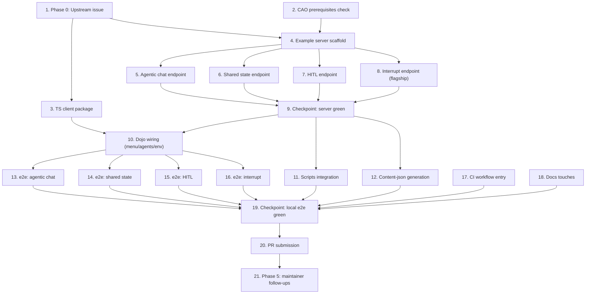

# Implementation Plan: Upstream AG-UI Dojo Integration

## Overview

This plan implements the upstream Dojo integration PR (awslabs/cli-agent-orchestrator
#458 Phase-3 item): landing `cli-agent-orchestrator` as a first-class integration in
[ag-ui-protocol/ag-ui](https://github.com/ag-ui-protocol/ag-ui), rendered at
[dojo.ag-ui.com](https://dojo.ag-ui.com/).

Sequencing follows the upstream contribution flow: socialize first (Phase 0), ensure
CAO prerequisites (Phase 1), scaffold the integration in a fork (Phase 2), wire the
dojo and write e2e tests (Phase 3), then submit the PR (Phase 4). Phase 5 tracks
maintainer-side follow-ups that are not in the contributor PR.

Two repos are touched: the **ag-ui fork** (the upstream PR target) and the **awslabs
CAO repo** (prerequisites). The implementation gates on Phase-2 of the L2 construct
spec (`.kiro/specs/agui-l2-constructs/tasks.md` Tasks 12/13).

### Prerequisites (from the L2 construct spec)

- Task 12: `mock_cli` scripted-prompt mode (CI enabler)
- Task 13: Run plane `POST /agui/v1/run` (stock-client-compatible endpoint)
- PyPI publish of `cli-agent-orchestrator[agui]`

## Task Dependency Graph

## Tasks

- [ ] 1. Phase 0: File upstream issue and get assigned
  - [ ] 1.1 File issue on `ag-ui-protocol/ag-ui` with: pitch (uniqueness case from design), MVP feature set (4 features), hosted-demo question (tmux/Docker on Render), `multi_agent_fleet` feature-page question, maintenance commitment, CODEOWNERS offer
    - _Requirements: 1.1, 1.2, 1.3_
  - [ ] 1.2 Tag a CODEOWNER from `.github/CODEOWNERS`; post in Discord `#-contributing` / Discussions; reference awslabs #386's partnership framing
    - _Requirements: 1.1, 1.2_
  - [ ] 1.3 Wait for assignment; agree tiering (community vs 1st-party) and interrupt-feature scope with maintainers
    - _Requirements: 1.4_

- [ ] 2. Verify CAO-side prerequisites are met
  - [ ] 2.1 Confirm Phase-2 L2 spec Tasks 12/13 are merged (run plane + interrupt lifecycle + `mock_cli` scripted-prompt mode)
    - _Requirements: 14.1_
  - [ ] 2.2 Confirm `cli-agent-orchestrator[agui]` is published to PyPI at a pinnable version
    - _Requirements: 14.2_
  - [ ] 2.3 Decide example-server endpoint home: inside the ag-ui repo example server (default, keeping CAO core dojo-agnostic)
    - _Requirements: 14.3_

- [ ] 3. Implement the TypeScript thin-client package
  - [ ] 3.1 Create `integrations/cli-agent-orchestrator/typescript/package.json` following `adk-middleware/typescript` shape: name `@ag-ui/cli-agent-orchestrator`, `tsdown` build, `vitest` test, `publint --strict && attw --pack` checks, `publishConfig: {access: "public"}`
    - _Requirements: 2.1, 2.3_
  - [ ] 3.2 Create `src/index.ts`: export `CliAgentOrchestratorAgent` extending `HttpAgent` from `@ag-ui/client` with a `url` constructor parameter
    - _Requirements: 2.2_
  - [ ] 3.3 Verify: `pnpm build` produces ESM/CJS bundle; `publint --strict && attw --pack` pass
    - _Requirements: 2.4_
  - [ ] 3.4 Create `integrations/cli-agent-orchestrator/python/README.md` describing the integration
    - _Requirements: 2.3_

- [ ] 4. Scaffold the Python example server
  - [ ] 4.1 Create `integrations/cli-agent-orchestrator/python/examples/pyproject.toml`: uv-managed, dep on `cli-agent-orchestrator[agui]` (pinned), dep on `fastapi`, `uvicorn`
    - _Requirements: 3.1_
  - [ ] 4.2 Create `server/__init__.py` (or `server/main.py`): FastAPI app, bind `HOST`/`PORT` (default 8024), health check endpoint
    - _Requirements: 3.2_
  - [ ] 4.3 Implement child-process management: on startup boot `cao-server` + tmux + `mock_cli` fleet; on shutdown kill child; readiness check (accept connections within 30s)
    - _Requirements: 3.3, 3.6_
  - [ ] 4.4 Add `dev` script in pyproject.toml for `uv run dev` to start with uvicorn
    - _Requirements: 3.6_

- [ ] 5. Implement the agentic_chat endpoint
  - [ ] 5.1 Create `/agentic-chat` POST endpoint: parse `RunAgentInput`, route message as input to supervisor terminal, stream `TEXT_MESSAGE_START` / `TEXT_MESSAGE_CONTENT` / `TEXT_MESSAGE_END` via the official `ag-ui-protocol` encoder
    - _Requirements: 9.1, 9.2_
  - [ ] 5.2 Verify stream passes stock client verifier lifecycle rules (RUN_STARTED first, proper bracketing, RUN_FINISHED last)
    - _Requirements: 9.3_

- [ ] 6. Implement the shared_state endpoint
  - [ ] 6.1 Create `/shared-state` POST endpoint: implement the standard recipe scenario (title, ingredients, instructions); agent manages state via the fleet's snapshot/delta channel
    - _Requirements: 10.1, 10.2_
  - [ ] 6.2 Emit `STATE_SNAPSHOT` followed by `STATE_DELTA` (RFC 6902 ops) as the recipe is modified by the mock_cli agent
    - _Requirements: 10.2, 10.3_
  - [ ] 6.3 Verify against the reference contract in `server-starter-all-features`
    - _Requirements: 10.1_

- [ ] 7. Implement the human_in_the_loop endpoint
  - [ ] 7.1 Create `/human-in-the-loop` POST endpoint: implement the standard `generate_task_steps` contract; generate steps and present for approval
    - _Requirements: 11.1_
  - [ ] 7.2 On resume (approved steps), dispatch steps as handoffs to worker terminals in the mock_cli fleet
    - _Requirements: 11.2, 11.3_
  - [ ] 7.3 Verify steps execute as real process operations (not mocked at protocol level)
    - _Requirements: 11.3_

- [ ] 8. Implement the interrupt endpoint (flagship)
  - [ ] 8.1 Create `/interrupt` POST endpoint: drive `mock_cli` scripted permission prompt -> `WAITING_USER_ANSWER` -> emit `STATE_SNAPSHOT` then `RUN_FINISHED outcome={type:"interrupt", interrupts:[...]}`
    - _Requirements: 12.1, 12.3_
  - [ ] 8.2 On resume: map `resume[]` payloads to approve/deny decisions, deliver keystrokes to the live terminal, stream continued activity
    - _Requirements: 12.2_
  - [ ] 8.3 Verify: reason follows `<framework>:<name>` convention; `STATE_SNAPSHOT` precedes interrupting `RUN_FINISHED`; `resume[]` covers all open interrupts
    - _Requirements: 12.3_
  - [ ] 8.4 Document the local real-provider procedure (claude_code with `permissionMode` at default)
    - _Requirements: 12.4_

- [ ] 9. Checkpoint: example server green
  - All four endpoints respond correctly to manual `curl` / client verification. `uv run dev` starts within 30s. `mock_cli` fleet boots keylessly.

- [ ] 10. Wire the dojo app (menu, agents, env, package.json)
  - [ ] 10.1 Add sidebar entry to `apps/dojo/src/menu.ts`: `{ id: "cli-agent-orchestrator", name: "CLI Agent Orchestrator (awslabs)", features: ["agentic_chat", "shared_state", "human_in_the_loop", "interrupt"] }`
    - _Requirements: 4.1_
  - [ ] 10.2 Add agent factory to `apps/dojo/src/agents.ts`: import `CliAgentOrchestratorAgent`, map features to URL paths under `envVars.caoUrl`
    - _Requirements: 4.2_
  - [ ] 10.3 Add `caoUrl` to `apps/dojo/src/env.ts` with default `process.env.CAO_URL || "http://localhost:8024"`
    - _Requirements: 4.3_
  - [ ] 10.4 Add `"@ag-ui/cli-agent-orchestrator": "workspace:*"` to `apps/dojo/package.json` dependencies
    - _Requirements: 4.4_

- [ ] 11. Integrate with dojo scripts
  - [ ] 11.1 Add `ALL_TARGETS["cli-agent-orchestrator"]` to `prep-dojo-everything.js`: `{ command: "uv sync", cwd: "integrations/cli-agent-orchestrator/python/examples" }`
    - _Requirements: 5.1_
  - [ ] 11.2 Add `ALL_SERVICES["cli-agent-orchestrator"]` to `run-dojo-everything.js`: `{ command: "uv run dev", env: { PORT: "8024" } }`
    - _Requirements: 5.2_
  - [ ] 11.3 Inject `CAO_URL: "http://localhost:8024"` into the `dojo` and `dojo-dev` service entries
    - _Requirements: 5.3_
  - [ ] 11.4 Verify: `./scripts/prep-dojo-everything.js --only dojo,cli-agent-orchestrator` + run succeeds
    - _Requirements: 5.4_

- [ ] 12. Generate content-json
  - [ ] 12.1 Add `agentFilesMapper` entry in `apps/dojo/scripts/generate-content-json.ts` mapping each feature to example-server source files
    - _Requirements: 4.5_
  - [ ] 12.2 Run `pnpm generate-content-json` and commit the updated `apps/dojo/src/files.json`
    - _Requirements: 4.5_

- [ ] 13. Write e2e spec: agentic chat
  - [ ] 13.1 Create `apps/dojo/e2e/tests/caoTests/agentic-chat.spec.ts`: navigate to the feature page, send a message, assert streamed reply appears
    - _Requirements: 6.1, 6.2_
  - [ ] 13.2 Reuse `featurePages/AgenticChatPage` helper
    - _Requirements: 6.2_

- [ ] 14. Write e2e spec: shared state
  - [ ] 14.1 Create `apps/dojo/e2e/tests/caoTests/shared-state.spec.ts`: navigate, trigger state update, assert recipe content renders
    - _Requirements: 6.1, 6.2_
  - [ ] 14.2 Reuse `featurePages/SharedStatePage` helper
    - _Requirements: 6.2_

- [ ] 15. Write e2e spec: human-in-the-loop
  - [ ] 15.1 Create `apps/dojo/e2e/tests/caoTests/human-in-the-loop.spec.ts`: navigate, generate steps, approve, assert execution
    - _Requirements: 6.1, 6.2_
  - [ ] 15.2 Reuse `featurePages/HumanInTheLoopPage` helper
    - _Requirements: 6.2_

- [ ] 16. Write e2e spec: interrupt (flagship)
  - [ ] 16.1 Create `apps/dojo/e2e/tests/caoTests/interrupt.spec.ts`: navigate, trigger interrupt, approve, assert terminal advances; test deny path separately
    - _Requirements: 6.1, 6.3_
  - [ ] 16.2 Follow the Mastra interrupt test pattern for assertion structure
    - _Requirements: 6.3_
  - [ ] 16.3 Ensure spec waits for service (`wait_on: tcp:localhost:8024`)
    - _Requirements: 6.4_

- [ ] 17. Add CI workflow matrix entry
  - [ ] 17.1 Add matrix entry to `.github/workflows/dojo-e2e.yml`: `suite: cli-agent-orchestrator`, `test_path: tests/caoTests`, `services: ["dojo", "cli-agent-orchestrator"]`, `wait_on: http://localhost:9999,tcp:localhost:8024`
    - _Requirements: 7.1, 7.2_
  - [ ] 17.2 Verify no external API keys required (mock_cli fleet is keyless)
    - _Requirements: 7.2_

- [ ] 18. Documentation touches
  - [ ] 18.1 Add row to `docs/introduction.mdx` Supported-Integrations table (proposed: 1st-party beside AWS Strands, subject to maintainer tiering)
    - _Requirements: 8.1_
  - [ ] 18.2 Add bullet to `docs/integrations.mdx` with link to integration directory
    - _Requirements: 8.2_
  - [ ] 18.3 Add optional `.github/CODEOWNERS` line: `integrations/cli-agent-orchestrator @ag-ui-protocol/copilotkit @plauzy`
    - _Requirements: 13.3_

- [ ] 19. Checkpoint: local e2e green
  - Run `./scripts/prep-dojo-everything.js --only dojo,cli-agent-orchestrator` then `pnpm test tests/caoTests/` from `apps/dojo/e2e`. All four specs pass. The `check-generated-files` validation passes.

- [ ] 20. Submit the PR
  - [ ] 20.1 Prepare PR description: `Fixes #<issue>`, demo recording (GIF of interrupt feature), feature summary, note about external-PR CI dance
    - _Requirements: 13.1, 13.4, 8.3_
  - [ ] 20.2 Record demo GIF using CAO's CI-generated-recording pattern (`examples/agui-eventsource-viewer/tools/record-demo.mjs`)
    - _Requirements: 13.1_
  - [ ] 20.3 Verify PR does NOT include: `prepare-release.yml` changes, npm trusted-publisher records, `render.yaml` service, `docs.copilotkit.ai` content
    - _Requirements: 13.2_
  - [ ] 20.4 Submit PR; note external-PR CI quirk; iterate with maintainers
    - _Requirements: 13.4, 7.3_

- [ ] 21. Phase 5: Track maintainer-side follow-ups (not in the PR)
  - [ ] 21.1 Request in the issue: release scope + npm trusted publishing for `@ag-ui/cli-agent-orchestrator`
    - _Requirements: 15.1_
  - [ ] 21.2 Request: `render.yaml` Docker service with tmux + `CAO_URL` on hosted dojo
    - _Requirements: 15.1, 15.2, 15.3_
  - [ ] 21.3 Request: `docs.copilotkit.ai` integration page; `introduction.mdx` tier placement confirmation
    - _Requirements: 8.1_
  - [ ] 21.4 Stretch follow-up PR: `multi_agent_fleet` feature page, `agentic_generative_ui`, `tool_based_generative_ui`
    - _Requirements: (stretch, no requirement)_

## Notes

- Phases 0 and 2 (issue + TS client scaffold) can proceed in parallel with Phase-2
  L2 construct work. Phase 3 (dojo wiring + e2e) gates on the run plane and
  mock_cli scripted-prompt mode being merged.
- Tasks 1 and 2 are prerequisites/coordination; no code produced.
- The example server is the main implementation effort (Tasks 4-8). Everything else
  is wiring/configuration following established patterns.
- Each e2e spec follows the same pattern as existing integration tests -- the work
  is adapting the page-helper interactions to CAO's response timing.
- Task 21 is tracking only (no code in our PR); items are raised in the issue.
- All claims cite the grounding commits: ag-ui main @ `b646b46`, CAO main @ `1b00753`.

