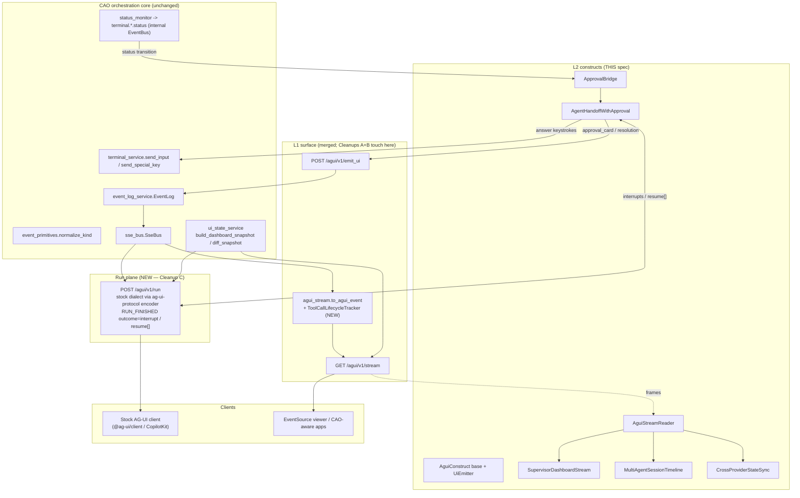
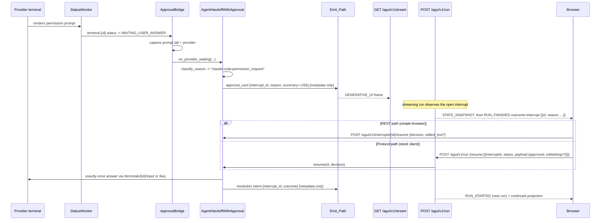

# Design Document: AG-UI L2 Construct Library (Phase 2)

> Tracking issue: awslabs/cli-agent-orchestrator **#458** (AG-UI Phase 2 — L2 constructs).
> Builds on the already-merged **L1 adapter** (PR #436). This revision supersedes the
> initial draft after a grounding audit against **ag-ui main @ `b646b46`** and
> **cli-agent-orchestrator main @ `1b00753`** — see `audit.md` for the
> finding-by-finding evidence trail. Every protocol claim below cites the source of
> truth it was verified against. Re-audited 2026-07-18 against ag-ui `3a7433e` /
> CAO `41c8ce7`: no cited surface changed (see the audit.md addendum).

## Overview

CAO's merged **L1 AG-UI adapter** maps the fleet's normalized event primitives onto
AG-UI-typed frames over a default-off SSE surface (`GET /agui/v1/stream` +
`POST /agui/v1/emit_ui`), with a metadata-only privacy boundary, a
`STATE_SNAPSHOT`/`STATE_DELTA` shared-state channel, a closed generative-UI
allow-list, and reconnect/overflow resilience.

**Phase 2 (this spec)** adds:

1. A library of **named, subclassable L2 constructs** over that surface —
   `SupervisorDashboardStream`, `MultiAgentSessionTimeline`,
   `AgentHandoffWithApproval`, `CrossProviderStateSync` — each with docs and a
   runnable example.
2. The **L1 cleanups** from #458: a completed `TOOL_CALL_*` lifecycle (Cleanup A)
   and a documented, hardened replay contract (Cleanup B).
3. The piece the audit showed both AC3 and AC5 actually require: a
   **protocol-faithful run plane** (`POST /agui/v1/run`, Cleanup C) that speaks the
   stock AG-UI wire dialect — including the **interrupt lifecycle that is now
   first-class on ag-ui main** (`RUN_FINISHED.outcome` + `RunAgentInput.resume`).

### The two-plane model (the audit's central correction)

The initial draft assumed a stock AG-UI client could consume `GET /agui/v1/stream`.
It cannot, for three verified reasons: the stock SSE parser reads **only `data:`
lines** and ignores `event:`/`id:` (`ag-ui client/src/transform/sse.ts:5-12,66-89`);
stock payloads must be **camelCase with a `type` field** (Python encoder
`ag_ui/encoder/encoder.py:9-32`; zod `EventSchemas.parse` on receive), while CAO
emits snake_case with the type only in the SSE `event:` line; and `HttpAgent` is
**POST-only** with a `RunAgentInput` body (`client/src/agent/http.ts:14-84`). The
stream is also not lifecycle-legal for the stock verifier
(`client/src/verify/verify.ts`): bare `TEXT_MESSAGE_CONTENT`, unclosed
`TOOL_CALL_START`, events outside a run, and the non-spec `GENERATIVE_UI` type.

So L2 works across **two explicit planes**:

| Plane | Endpoint | Dialect | Consumers |
|---|---|---|---|
| **Ambient** (existing, unchanged wire apart from Cleanup A) | `GET /agui/v1/stream` | CAO's AG-UI dialect: named SSE events, `id:` cursors, snake_case data, `GENERATIVE_UI`, `?since=`/`Last-Event-ID` replay (a CAO extension — no stock SDK implements resumption) | CAO-aware clients; the L2 folding constructs via `AguiStreamReader` |
| **Run** (new, Cleanup C) | `POST /agui/v1/run` | Stock wire dialect: `data:`-only camelCase frames via the official `ag-ui-protocol` encoder, lifecycle-legal ordering, interrupts via `RUN_FINISHED.outcome` / `resume[]` | Unmodified `@ag-ui/client` / CopilotKit / Dojo |

Constructs fold the ambient plane. The run plane is a *projection* of the same
event source rendered in the stock dialect, and the carrier of the protocol-true
interrupt lifecycle.

### Goals

- Ship four subclassable constructs composing purely over the L2 seams (no bespoke
  SSE plumbing in application code; one sanctioned `AguiStreamReader` in the library).
- Preserve L1's invariants through L2: privacy (no message bodies), default-off
  enablement, totality, reconnect losslessness via Seen_Set_Dedup.
- Make human-in-the-loop approval work against a **real** provider prompt,
  resumable from a browser via the thin REST route **and** via the protocol's own
  interrupt lifecycle on the run plane.
- Prove cross-provider shared-state convergence across `kiro_cli`, `claude_code`,
  `codex`.

### Non-Goals

- Phase 3 / L3 (reference dashboard app, authenticated team mode, Dojo ecosystem
  listing). L2 provides what an L3 dashboard would consume.
- A2A / Agent Card / ACP modules (different protocol surface). The *internal*
  `a2a_delegation` event kind is in scope only as a forward-provisioned mapping —
  ground truth: it currently has **no producer** (`services/event_primitives.py:40-72`).
- Re-designing L1 beyond the named cleanups.

---

## Grounding notes (source-of-truth pins)

Facts this design depends on, verified 2026-07-17 and re-verified unchanged
2026-07-18 @ ag-ui `3a7433e` / CAO `41c8ce7`:

**ag-ui main @ `b646b46`:**
- EventType enum has 33 values, identical across TS and Python SDKs
  (`sdks/typescript/packages/core/src/events.ts:12-61`,
  `sdks/python/ag_ui/core/events.py:42-78`). `GENERATIVE_UI` is not among them.
- Interrupts: `RunFinishedEvent.outcome = {type:"success"} | {type:"interrupt",
  interrupts: Interrupt[]}`; `Interrupt = {id, reason, message?, toolCallId?,
  responseSchema?, expiresAt?, metadata?}`; resumption via `RunAgentInput.resume:
  [{interruptId, status:"resolved"|"cancelled", payload?}]`
  (`core/src/events.ts:233-262`, `core/src/types.ts:193-219`). Contract rules in
  `docs/concepts/interrupts.mdx`: resume must cover ALL open interrupts; replays
  idempotent; expiry → `RUN_ERROR`; emit `STATE_SNAPSHOT`/`MESSAGES_SNAPSHOT`
  **before** the interrupting `RUN_FINISHED`; custom reasons are
  `<framework>:<name>`-namespaced, `core:` reserved; approve-with-edits payload is
  `{approved: boolean, editedArgs?}`.
- Stock client: POST-only `HttpAgent`; SSE parsing is `data:`-line-only; event
  ordering enforced by `verify.ts` (RUN_STARTED first, no events after finish,
  START/END bracketing by id, no finish with open messages/tool-calls/steps).
- State deltas: RFC 6902 via `fast-json-patch`, atomic `applyPatch(...,
  validate=true, mutate=false)`; on failure the delta is **dropped with a warning**
  and the run continues (`client/src/apply/default.ts:537-568`).

**CAO main @ `1b00753`:**
- Adapter mapping and constants: `services/agui_stream.py` (`_from_primitive`
  :125-211; `GENERATIVE_UI_COMPONENTS` = {approval_card, choice_prompt,
  diff_summary, progress, metric, agent_card} :89-98; 8192-byte props cap :102).
- Stream endpoint: `api/main.py:860-1053` — register-before-replay, `?since=`
  (ISO-8601, exclusive) precedence over `Last-Event-ID` (uuid cursor,
  over-delivers when evicted/unknown), replayed frames carry `id:`, state frames
  do not; snapshot emitted after replay, then per-event deltas
  (`build_dashboard_snapshot`/`diff_snapshot`, `services/ui_state_service.py`).
- Event records: `{id: uuid4, kind, terminal_id, session_name, timestamp, detail}`;
  ring `RING_CAPACITY=500`, TTL 24h (`services/event_log_service.py`).
- Orchestration ground truth: `handoff`/`assign`/`send_message` all normalize to
  kind `handoff` discriminated by `detail.orchestration_type`; `a2a_delegation` and
  `file_mod` have no producers (`services/event_primitives.py`, grep-verified).
- Status/answer paths: `TerminalStatus.WAITING_USER_ANSWER`
  (`models/terminal.py:13-21`); transitions publish only to the internal EventBus
  topic `terminal.{id}.status` (`services/status_monitor.py:222`) — **never** to
  the fleet EventLog; answers travel via `POST /terminals/{id}/input`
  (`api/main.py:1659`) and `POST /terminals/{id}/key` (:1693); providers launch in
  auto-approve mode by default (claude_code `--dangerously-skip-permissions` unless
  the profile sets `permissionMode`, kiro `--trust-all-tools`, codex `--yolo`).
- Scopes `cao:read|write|admin` (`security/auth.py`); `emit_ui` floor is
  write/admin; surface gate `agui_surface_enabled()` (`services/agui_enablement.py`).
- `hypothesis>=6.0` already in dev dependencies; `requests` already a runtime
  dependency; **no** JSON-Patch library is present (constructs ship a small strict
  apply helper — `diff_snapshot` emits only `add`/`remove`/`replace` ops).

---

## Architecture

### Layering



**The L2 contract:** a construct either folds frames (`handle_frame`) or writes
through the emit path (`emit`) — never both wire directions itself, never raw SSE.
The **only** L2 component that touches the wire is `AguiStreamReader` (read) and
`UiEmitter` (write), both owned by the library, so application authors compose
`reader → construct → emitter` without protocol knowledge.

### Where L2 code lives

```
src/cli_agent_orchestrator/services/agui/
├── __init__.py               # re-exports constructs, base, reader, emitters
├── base.py                   # AguiConstruct + UiEmitter(s) + assert_no_body + strict JSON-Patch apply
├── stream_reader.py          # AguiStreamReader (requests-based SSE reader, since/Last-Event-ID)
├── supervisor_dashboard.py   # SupervisorDashboardStream
├── session_timeline.py       # MultiAgentSessionTimeline
├── handoff_approval.py       # classify_reason + Interrupt + AgentHandoffWithApproval
├── approval_bridge.py        # ApprovalBridge (internal-EventBus subscriber, lifespan-owned)
└── run_plane.py              # run-plane event projection (used by the /agui/v1/run route)
```

L1 cleanups touch existing files: `services/agui_stream.py` (Cleanup A mapping +
`ToolCallLifecycleTracker`), `api/main.py` (`?since=` 400, resume route, run route,
lifespan wiring for the bridge), `docs/agui.md`, and the bundled EventSource viewer
(updated for the corrected handoff mapping). Examples live under `examples/agui-*/`
with `run.sh` / `showcase.sh`. Tests under `test/services/agui/` and `test/api/`.

### Sequence: approval, both resume paths



---

## Components and Interfaces

### Base construct: `AguiConstruct`

```python
class AguiConstruct(ABC):
    """Base class for L2 constructs composed over the L1 AG-UI surface.

    Frames arrive through ``handle_frame`` (total: unknown types are ignored);
    output leaves ONLY through ``emit`` (validated against the same allow-list,
    serializability, and 8192-byte guards as POST /agui/v1/emit_ui). Constructs
    never parse SSE, open sockets, or add routes.
    """

    def __init__(self, *, emitter: "UiEmitter | None" = None) -> None: ...

    @abstractmethod
    def handle_frame(self, agui_type: str, data: dict, event_id: str | None = None) -> None: ...

    @abstractmethod
    def projection(self) -> dict: ...

    def emit(self, component: str, props: dict,
             terminal_id: str | None = None,
             session_name: str | None = None) -> None: ...

    @staticmethod
    def assert_no_body(data: dict) -> None: ...
```

- `handle_frame` takes the optional `event_id` third argument so constructs can
  apply **Seen_Set_Dedup** (ids are uuid4 — membership checks, never ordering).
- Base provides `apply_json_patch_strict(doc, ops) -> dict | None`: pure,
  non-mutating RFC 6902 apply for `add`/`remove`/`replace` (all `diff_snapshot`
  emits); returns `None` on any failure so callers drop the delta — the same
  observable behavior as the stock client's `fast-json-patch` validate-then-drop
  (`apply/default.ts:537-568`).

**`UiEmitter`** — one validation core, three transports:
- `InProcessUiEmitter`: same path as the route — `event_log.append("other",
  detail={"event_type":"agent_ui","ui":{component,props}})` + bus publish; refuses
  (raises) when `agui_surface_enabled()` is false (server-resident constructs).
- `HttpUiEmitter`: `requests.post(f"{base}/agui/v1/emit_ui", ...)`, mapping HTTP
  400 to `ValueError` (out-of-process constructs / examples).
- `RecordingUiEmitter`: records intents, publishes nothing (tests).

Validation (allow-list membership, JSON-serializability, ≤ 8192 UTF-8 bytes,
props never mutated) runs in the base **before** any transport, importing
`GENERATIVE_UI_COMPONENTS` and the size constant from `services/agui_stream` —
no duplicated component set.

### `AguiStreamReader` (the one sanctioned wire reader)

```python
class AguiStreamReader:
    """Reads GET /agui/v1/stream and yields (event_id, agui_type, data).

    - Parses named SSE frames (id:/event:/data:) — the CAO dialect.
    - Sends ?since= (ISO-8601) or Last-Event-ID on connect; tracks last_event_id.
    - reconnect() resumes with Last-Event-ID = last seen id; callers fold with
      Seen_Set_Dedup so the overlap is harmless.
    - Uses `requests` (already a CAO dependency); no new runtime deps.
    """
    def __init__(self, base_url: str, *, since: str | None = None,
                 access_token: str | None = None, timeout: float = 30.0) -> None: ...
    def frames(self) -> Iterator[tuple[str | None, str, dict]]: ...
    @property
    def last_event_id(self) -> str | None: ...
```

Examples compose: `for event_id, t, d in reader.frames(): construct.handle_frame(t, d, event_id)`.

### Construct 1: `SupervisorDashboardStream`

Folds `STATE_SNAPSHOT` (deep-copy replace) and `STATE_DELTA` (strict
apply-else-drop) into the fleet projection, and id-bearing `STEP_*`/`RUN_*`/
`TOOL_CALL_*` frames into rollup counters with Seen_Set_Dedup.

```python
class SupervisorDashboardStream(AguiConstruct):
    def hierarchy(self) -> dict:
        """{session_name: {"status": str, "terminal_ids": [...], "terminal_count": int}}"""
    def supervisor_snapshot(self) -> dict:
        """{"active_sessions": int, "counts": {...}, "by_provider": {provider: int},
            "waiting_terminals": [terminal_id, ...],
            "last_activity": {"timestamp": str | None, "event_id": str | None}}"""
```

Grounded in the real snapshot shape (`ui_state_service.py:51-105`):
`sessions[] = {id, name, status}`, `terminals[] = {id, session_name, provider,
agent_profile, window, status, last_active}`, `counts`, `scopes`. `by_provider`
counts **every** provider observed (10 provider ids exist); Supported_Providers
matter only to the validation suite. No fetching of its own — folded frames are
the sole input.

### Construct 2: `MultiAgentSessionTimeline`

```python
@dataclass(frozen=True)
class TimelineEntry:
    id: str                                  # tool_call_id (delegation) or event_id (message)
    kind: Literal["delegation", "message"]
    orchestration_type: str | None           # "handoff" | "assign" | "send_message" | "a2a_delegation"
    sender: str | None
    receiver: str | None
    tool_call_name: str | None
    started_at: str
    ended_at: str | None
    status: Literal["open", "completed", "failed"]

class MultiAgentSessionTimeline(AguiConstruct):
    def entries(self) -> list[TimelineEntry]: ...
```

Folding rules (post-Cleanup A wire):
- `TOOL_CALL_START` → open delegation entry keyed by `tool_call_id` (duplicate
  START for a known id: no-op).
- `TOOL_CALL_END` / `TOOL_CALL_RESULT` with a known open id → `completed` (or
  `failed` on a failure disposition) + `ended_at`; unknown id → no-op.
- `TEXT_MESSAGE_CONTENT` with sender/receiver metadata → `message` entry;
  `delta` never stored (it is empty on the wire by L1 construction, and the
  construct must not store it regardless).
- Entries append in arrival order; exposed ordering `(started_at, id)` is a
  deterministic tiebreak only. Retention cap: constructor arg, default 1,000
  (the construct's own bound — the L1 ring is 500 and is *not* the cap's source).

### Construct 3: `AgentHandoffWithApproval` (+ `ApprovalBridge`)

```python
class ApprovalDecision(str, Enum):
    APPROVE = "approve"; DENY = "deny"; EDIT = "edit"

@dataclass
class Interrupt:
    """Aligned to ag-ui core's Interrupt shape (types.ts:193-201)."""
    id: str                      # fresh uuid4 (originating event id lives in metadata)
    reason: str                  # "<namespace>:<local_name>"
    message: str                 # redacted summary, <= 256 chars
    metadata: dict               # {provider, terminal_id, session_name, source_event_id?}
    options: list[str]           # decisions the provider prompt supports
    created_at: str
    expires_at: str | None = None
    resolved: bool = False
    outcome: str | None = None   # "approve" | "deny" | "edit" | "expired"

class AgentHandoffWithApproval(AguiConstruct):
    def on_provider_waiting(self, terminal_id: str, provider: str, raw_prompt: str,
                            session_name: str | None = None) -> Interrupt: ...
    def resume(self, interrupt_id: str, decision: ApprovalDecision,
               edited_text: str | None = None) -> Interrupt: ...
    def expire(self, terminal_id: str) -> Interrupt | None: ...
    def pending(self) -> list[Interrupt]: ...
```

**`ApprovalBridge`** is the trigger the audit found missing (F6): status
transitions never reach the fleet stream, so the bridge subscribes to the internal
EventBus (`terminal.*.status`, the same topic `InboxService` consumes,
`services/inbox_service.py:34-175` is the wiring precedent), and:

- on `→ WAITING_USER_ANSWER`: captures the prompt tail (rendered output via the
  existing `terminal_service.get_output(mode=last)` path), resolves the provider
  id from the terminal record, calls `on_provider_waiting`;
- on leaving `WAITING_USER_ANSWER` with the interrupt still open: calls
  `expire(terminal_id)` — which delivers **zero** keystrokes (audit F15) and emits
  the expiration resolution intent;
- runs only when `agui_surface_enabled()`; registered/stopped in the FastAPI
  lifespan next to the other consumers (`api/main.py:509-513` precedent). The
  approval registry is an app-scoped singleton shared by the bridge, the REST
  resume route, and the run plane.

**Decision → answer translation** reuses the existing, tested answer paths
(`answer_user_prompt` → `POST /terminals/{id}/input`; `POST /terminals/{id}/key`
for pickers) with a per-provider table validated against the providers' own
detection patterns:

| Provider / prompt | approve | deny | edit |
|---|---|---|---|
| claude_code picker (`↑/↓ to navigate`) | `Enter` (first option) | `Escape` | unsupported → validation error |
| kiro_cli `[y/n/t]` & TUI permission | `y` | `n` | unsupported → validation error |
| codex approval gate (`y/n`) | `y` | `n` | unsupported → validation error |
| free-text prompts (provider accepts input) | n/a | n/a | edited_text (≤ 4,000 chars — the `answer_user_prompt` cap) via `/input` |

Exactly-once delivery: the interrupt resolves under a lock before any keystroke is
sent; a second `resume` (either path) returns the recorded outcome without
re-sending. Expiry never sends. Registry bounds: resolved/expired evicted within
300 s; max 1,000 entries, oldest resolved/expired first.

**Reason classifier** (total, deterministic, never raises):

| Provider | reason | Detected from (existing pattern) |
|---|---|---|
| `claude_code` | `claude-code:permission_request` | `WAITING_USER_ANSWER_PATTERN` (`↑/↓ to navigate`, `claude_code.py:79-81`) + permission phrasing |
| `claude_code` | `claude-code:trust_prompt` | `TRUST_PROMPT_PATTERN` (`Yes, I trust this folder`, :82) |
| `kiro_cli` | `kiro:permission_request` | legacy `Allow this action? [y/n/t]` (:183) or `TUI_PERMISSION_PATTERN` (:123-126) |
| `kiro_cli` | `kiro:trust_prompt` | trust wording |
| `codex` | `codex:approval_request` | `WAITING_PROMPT_PATTERN` (`^(?:Approve|Allow)…(y/n|yes/no)`, `codex.py:60`) |
| `codex` | `codex:trust_prompt` | `allow Codex to work in this folder` (:80) |
| *(any)* | `{ns}:unknown_prompt` | safe default |

Namespace mapping `kiro_cli→kiro`, `claude_code→claude-code`, `codex→codex`,
kebab-case otherwise; never `core:` (reserved by ag-ui, `interrupts.mdx:159-183`).

### Construct 4: `CrossProviderStateSync`

```python
class CrossProviderStateSync(AguiConstruct):
    def shared_state(self) -> dict: ...
    def providers_seen(self) -> set[str]: ...   # from snapshot terminals[].provider
    def converges_with(self, authoritative_snapshot: dict) -> bool: ...
```

Snapshot → deep-copy replace; delta → strict apply-else-drop; Seen_Set_Dedup on
id-bearing frames. The convergence claim is the **ordered-fold** property (audit
F8): folding the per-connection stream (snapshot, then deltas diffed against the
previous snapshot) — including any reconnect overlap — yields a state deep-equal
to `build_dashboard_snapshot` of the same fleet. `providers_seen()` reads the
`provider` field each snapshot terminal entry already carries
(`ui_state_service.py:81-95`), so ≥3-provider coverage is assertable with no wire
change.

### Run plane: `POST /agui/v1/run` (Cleanup C)

A thin route + `services/agui/run_plane.py` projection:

- **Input**: `RunAgentInput` (camelCase; parsed with the official `ag-ui-protocol`
  pydantic models). `threadId`/`runId` echoed into `RUN_STARTED`.
- **Output framing**: official `EventEncoder` (`data:`-only, camelCase,
  `exclude_none`) — byte-compatible with the stock parser.
- **Projection** (lifecycle-legal per `verify.ts`): `RUN_STARTED` →
  `STATE_SNAPSHOT` → live translation of fleet records: `STATE_DELTA`,
  `STEP_STARTED/FINISHED`, complete `TOOL_CALL_START→END` (from the Cleanup A
  tracker), `CUSTOM {name:"cao.generative_ui", value:{component,props}}` for
  generative-UI intents, `CUSTOM {name:"cao.message_delivery", value: metadata}`
  for message deliveries (bare `TEXT_MESSAGE_CONTENT` is not lifecycle-legal on
  this plane), `CUSTOM {name:"cao.raw", ...}` for RAW-dialect frames.
- **Interrupts**: when the approval registry has (or gains) open interrupts, the
  run emits `STATE_SNAPSHOT` then `RUN_FINISHED outcome={type:"interrupt",
  interrupts:[...]}` (state-before-finish rule, `interrupts.mdx:135-145`) and the
  stream closes. A new POST with `resume[]` resolves through the same idempotent
  registry path (payload mapping: `{approved:true}`→approve, `{approved:false}` or
  status `cancelled`→deny, `{approved:true, editedArgs}`→edit), then streams a new
  run. Uncovered open interrupts or an expired reference → `RUN_ERROR` (contract
  rules, `interrupts.mdx:112-133`).
- **Gating/auth**: same 404 gate as the stream; `cao:read` floor; `cao:write`/
  `cao:admin` required when `resume[]` is non-empty (a resume authorizes a tool
  action — same floor as `emit_ui`).
- **Dependency**: `ag-ui-protocol` as a **version-pinned optional extra**
  (`pip install cli-agent-orchestrator[agui]`); absent → 501 with an install hint;
  the ambient plane never depends on it.

### Resume endpoint (REST path)

`POST /agui/v1/interrupts/{id}/resume` `{decision: "approve"|"deny"|"edit",
edited_text?: str}` → same registry `resume`. Guards in order: surface gate (404),
scope (`cao:write`/`cao:admin`), decision validation (422), unknown id (404),
idempotent replay (200 with recorded outcome). Flat `@app.post` in `api/main.py`
per repo convention (no routers exist).

---

## Data Models

### Supervisor projection

```python
SupervisorProjection = {
    "fleet": DashboardSnapshot,          # as folded: {sessions, terminals, counts, scopes}
    "rollup": {
        "active_sessions": int,
        "by_provider": {str: int},       # every observed provider
        "waiting_terminals": [str, ...],
        "last_activity": {"timestamp": str | None, "event_id": str | None},
    },
}
```

### Interrupt (wire shape on the run plane)

Serialized exactly as ag-ui's `Interrupt` (camelCase): `{id, reason, message,
expiresAt?, metadata: {provider, terminalId, sessionName}}` — `responseSchema` set
to the approve-with-edits object schema (`{approved: boolean, editedArgs?:
{text: string}}`) so generic clients can render a decision form.

**Validation rules**
- `reason` matches `^[a-z0-9-]+:[a-z0-9_]+$`; namespace never `core`.
- `resolved == True ⟺ outcome != None`; resolved interrupts are immutable.
- `message` ≤ 256 chars, redacted (category + trimmed prompt tail; never full
  command lines unless the provider pattern marks them safe).

### Timeline entry

See `TimelineEntry` above; `ended_at`/`status` transitions only via matching
`tool_call_id`; count(`completed|failed`) ≤ count(opened) is an invariant.

---

## L1 Cleanups (owned by this spec)

### Cleanup A — Complete the `TOOL_CALL_*` lifecycle

**Verified current state:** `TOOL_CALL_START` is emitted only for kind
`a2a_delegation` (`agui_stream.py:170-180`) — which no producer emits; every real
dispatch arrives as kind `handoff` and maps to a bare `TEXT_MESSAGE_CONTENT`
(:155-168). `TOOL_CALL_END`/`TOOL_CALL_RESULT` appear nowhere. Meanwhile
`docs/agui.md:33-41` already documents "handoff / delegation →
`TOOL_CALL_START` / `TOOL_CALL_END`" and "message delivery →
`TEXT_MESSAGE_CONTENT`". **The change aligns code with the published table:**

1. `_from_primitive`: kind `handoff` with `orchestration_type ∈ {handoff, assign}`
   → `TOOL_CALL_START` (`tool_call_id` = record id, `tool_call_name` =
   orchestration type, metadata sender/receiver); `send_message`/absent →
   `TEXT_MESSAGE_CONTENT` unchanged; kind `a2a_delegation` unchanged.
2. New `ToolCallLifecycleTracker` (stateful, per stream generator instance, also
   reusable by constructs): registers `receiver → (tool_call_id, kind)` on START;
   on a completion record for that receiver terminal (or session end) synthesizes
   exactly one `TOOL_CALL_END` (+ one metadata-only `TOOL_CALL_RESULT` for
   `a2a_delegation` opens) after the mapped frame; bounded map (cap + oldest-first
   eviction); no orphan closers. Deterministic: replaying the same records
   synthesizes the same frames, so `?since=` folds stay consistent.
3. Same-change updates: `docs/agui.md` table footnotes the disposition metadata;
   the EventSource viewer's known-names/rendering updated; mapping tests extended.

### Cleanup B — Replay contract: document what exists, harden one edge

**Verified current state:** register-before-replay, `?since=` (ISO-8601 exclusive)
precedence over `Last-Event-ID`, `id:` cursors on replayed frames, server-side
overlap dedup, over-delivery on evicted/unknown id, snapshot-after-replay —
all already implemented and tested (`api/main.py:972-1049`;
`test_agui_stream_reconnect.py`, `test_agui_stream_overflow.py`).

**Changes:** (1) validate `?since=` before streaming — malformed → HTTP 400
(today it is swallowed by the failure-isolated replay block); (2) document the
full contract in `docs/agui.md` incl. Seen_Set_Dedup (uuid ids — membership, not
ordering) and its status as a CAO extension (no stock SDK resumes streams;
protocol-plane recovery is snapshot re-sync per `state.mdx:47-56`); (3) regression
tests pinning snapshot-before-delta on reconnect and `since` precedence for the
AG-UI path.

### Cleanup C — Run plane + stock-client zero-adapter live demo (AC3)

Covered in Components. The demo (`examples/agui-stock-client-live/`): `run.sh`
boots `cao-server` with `CAO_AGUI_ENABLED=1` and a `mock_cli`-driven fleet
(credentials-free, `examples/agui-dashboard/` precedent), waits ≤ 30 s for
readiness, then runs a pinned stock client (`@ag-ui/client` `HttpAgent` /
minimal CopilotKit page — upstream packages only, zero CAO wire code) against
`POST /agui/v1/run` and asserts at least one frame rendered that the server
produced **after** the client connected. Non-zero exit + process cleanup on any
failure. CI smoke reuses the repo's existing example-recording harness pattern.

---

## Low-Level Design

### `apply_json_patch_strict(doc, ops) -> dict | None`

**Preconditions:** `doc` is a JSON-shaped dict; `ops` a list of RFC 6902 ops.
**Postconditions:** returns a **new** dict with all ops applied in order, or
`None` if any op is malformed / targets a missing path (`add` on object members
allowed per RFC 6902 §4.1); `doc` is never mutated.
**Invariant:** partial application is impossible (copy-then-apply, discard on error).

### `foldStream` (Supervisor / CrossProviderStateSync)

```pascal
ALGORITHM foldStream(frames)          // frames: (event_id | NULL, type, data) in arrival order
state ← NULL; seen ← ∅
FOR each (id, type, data) IN frames DO
    IF id ≠ NULL AND id ∈ seen THEN CONTINUE          // Seen_Set_Dedup (uuid membership)
    IF type = STATE_SNAPSHOT THEN state ← deepCopy(data.snapshot)
    ELSE IF type = STATE_DELTA THEN
        IF state ≠ NULL THEN
            next ← apply_json_patch_strict(state, data.delta)
            IF next ≠ NULL THEN state ← next          // else: drop (client parity)
    ELSE updateRollups(type, data)                    // metadata only
    IF id ≠ NULL THEN seen ← seen ∪ {id}
RETURN projection(state, rollups)
```

**Postcondition (convergence):** for the per-connection stream the server emits
(snapshot, then deltas each diffed from the previously-emitted snapshot),
`foldStream(frames ++ overlappingReplay)` = `build_dashboard_snapshot(fleet_now)`
— replay overlap is inert under `seen`; state frames are per-connection and
arrive exactly once per connection.

### `ToolCallLifecycleTracker.feed(record, mapped_frame) -> [frames]`

**Postconditions:** yields `mapped_frame` plus zero or more synthesized closers;
every synthesized `TOOL_CALL_END`/`TOOL_CALL_RESULT` carries a `tool_call_id`
previously seen as START in this tracker; a receiver correlates to at most one
open call (newest wins; older evicted entries close with disposition
`superseded`); map size ≤ cap.
**Invariant:** closers(ids) ⊆ starts(ids); at most one END per id.

### `AgentHandoffWithApproval.resume`

```pascal
ALGORITHM resume(intr_id, decision, edited_text)
intr ← registry.get(intr_id);  IF intr = NULL THEN ERROR not_found
WITH intr.lock:
    IF intr.resolved THEN RETURN intr                      // idempotent, no re-send
    IF decision = EDIT AND NOT valid(edited_text, ≤4000) THEN ERROR validation (stay open)
    IF decision ∉ intr.options THEN ERROR unsupported_decision (stay open)
    intr.resolved ← true; intr.outcome ← decision          // resolve BEFORE sending
answer ← translate(intr.provider_category, decision, edited_text)
TRY deliver(answer)                                        // /input or /key, exactly once
CATCH e: log; intr.metadata.delivery_error ← summary(e)    // resolution stands
emit(approval_card, {interrupt_id, reason, resolved: true, outcome})
RETURN intr
```

`expire(terminal_id)`: same lock; resolve with `outcome=expired`; **no deliver**.

### Example usage

```python
reader = AguiStreamReader("http://127.0.0.1:9889")
sup, tl, sync = SupervisorDashboardStream(), MultiAgentSessionTimeline(), CrossProviderStateSync()
for event_id, agui_type, data in reader.frames():
    for c in (sup, tl, sync):
        c.handle_frame(agui_type, data, event_id)
```

---

## Correctness Properties

Property-based (Hypothesis, already a dev dependency) unless noted:

1. **Interrupt round-trip / idempotent resume.** ∀ provider, prompt, decision:
   open→resume yields `resolved ∧ outcome == decision`; a second resume (either
   path) changes nothing and delivers nothing.
2. **Reason totality.** ∀ provider, raw_prompt (arbitrary strings): result matches
   `^[a-z0-9-]+:[a-z0-9_]+$`, is deterministic, never raises, never `core:`.
3. **Ordered-fold convergence.** ∀ fleets and mutation sequences (provider mix
   over kiro_cli/claude_code/codex): folding the emitted snapshot+delta stream
   deep-equals `build_dashboard_snapshot` of the final fleet.
4. **Reconnect dedup idempotency.** ∀ frame sequences, ∀ overlap replays of
   id-bearing frames: fold(frames) == fold(frames ++ replayed overlap).
5. **Privacy through L2.** ∀ folded/emitted values: no message-body field
   (`assert_no_body`); `TEXT_MESSAGE_CONTENT.delta` never stored.
6. **Tool-call lifecycle well-formedness.** ∀ record sequences: synthesized
   closers ⊆ opens (by id), ≤ 1 END per id, no orphans; timeline
   `completed+failed ≤ opened`.
7. **Emit refusal parity.** ∀ component, props: L2 `emit` publishes iff the L1
   guard would accept (allow-list ∧ serializable ∧ ≤ 8192 bytes); props unmutated.
8. **Substitutability / totality.** ∀ subclass, ∀ frames (fuzzed types/shapes):
   `handle_frame` never raises; `projection()` is JSON-serializable.
9. **Run-plane lifecycle legality** (integration): every emitted run stream passes
   the stock verifier rules (RUN_STARTED first; no frames after FINISHED/ERROR;
   START/END bracketing; snapshot precedes interrupting FINISHED).

---

## Error Handling

| # | Condition | Response |
|---|---|---|
| 1 | Unknown/malformed frame reaches a construct | No-op (totality); projection unchanged |
| 2 | Off-list / oversized / non-serializable emit | `ValueError` before any transport; nothing published (parity with HTTP 400) |
| 3 | `STATE_DELTA` fails strict apply or precedes a snapshot | Delta dropped, no raise — parity with stock client warn-and-drop |
| 4 | Resume on unknown id | REST 404; run-plane `RUN_ERROR` per contract |
| 5 | Resume on resolved interrupt | Recorded outcome returned; zero keystrokes (idempotent) |
| 6 | `edit` without valid text / unsupported decision for the prompt | Validation error; interrupt stays open; zero keystrokes |
| 7 | Prompt vanishes before decision | `expired` resolution; **zero keystrokes**; expiration intent emitted; late resume gets the record |
| 8 | Keystroke delivery fails after resolution | Resolution stands; delivery error recorded in metadata; no exception to the stream |
| 9 | Malformed `?since=` | HTTP 400 before streaming (new) |
| 10 | Evicted/unknown `Last-Event-ID` | Over-delivery + Seen_Set_Dedup (documented) |
| 11 | `run` with uncovered/expired open interrupts | `RUN_ERROR` (interrupt contract) |
| 12 | `ag-ui-protocol` extra missing | Run plane 501 + hint; ambient plane unaffected |
| 13 | Subscriber queue overflow on ambient stream | Existing behavior: stream closes (gap signal); reader reconnects with cursor; constructs dedup |

---

## Testing Strategy

- **Unit** (`test/services/agui/`): folding tables per construct; emit parity incl.
  the exact 8192-byte boundary and props-unmutated; `assert_no_body`; classifier
  fixtures per provider (reuse the providers' pattern fixtures); keystroke
  translation tables; registry TTL/caps; tracker correlation incl. eviction,
  session-end closure, orphan suppression, `a2a_delegation` RESULT
  (forward-provisioned, synthetic records).
- **Property** (Hypothesis): Properties 1–8 above; generators for fleet mutation
  sequences with provider mixes, overlap replays with uuid ids, arbitrary
  `(provider, prompt)` strings, interleaved resume/expiry races.
- **API integration** (`test/api/`): resume-route guard matrix (gate 404 / scope /
  422 / unknown 404 / idempotent 200); `?since=` 400; snapshot-before-delta
  reconnect regression; run-plane: RunAgentInput parse, gating/scope incl.
  `resume[]` write-floor, interrupt outcome emission, resume coverage RUN_ERROR,
  lifecycle-legality assertions against recorded streams.
- **End-to-end approval (CI, credentials-free):** extend `mock_cli` with a
  scripted-prompt mode (env-triggered marker → `WAITING_USER_ANSWER`, an answer
  clears it — today mock_cli never returns that status, `mock_cli.py:79-96`);
  drive prompt → interrupt → approve/deny via **both** resume paths → assert
  exactly-once delivery and terminal advance.
- **Live real-provider procedure (manual, documented + recorded):** approval-mode
  claude_code profile (`permissionMode` at provider default) → real permission
  prompt → browser approve/deny → terminal advances. This is the AC5 evidence for
  a *real* prompt; CI keeps the automated equivalent.
- **AC3 smoke:** stock client against the run plane per Cleanup C.

## Performance Considerations

- L2 folding is O(patch size) per delta — constructs apply the deltas L1 already
  computes; no second fleet recompute (the known per-event recompute on the server
  side stays a documented L1 follow-up).
- Bounded memory everywhere: timeline cap (default 1,000), tracker map cap,
  interrupt registry (1,000 / 300 s TTL), reader buffers one frame at a time.
- Run plane shares the existing bus subscription machinery (per-subscriber queue
  256, overflow-close) — one extra subscriber per connected stock client.

## Security Considerations

- **Privacy boundary inherited and re-asserted**: constructs fold metadata-only
  frames; `assert_no_body` + emit validation are defense-in-depth; approval cards
  and interrupts carry category + ≤ 256-char redacted summary, never raw command
  bodies; run-plane CUSTOM values carry the same metadata-only payloads.
- **Approval is privileged**: REST resume and run-plane `resume[]` both require
  the `cao:write` floor (an approval authorizes a tool action — same floor as
  `emit_ui`); everything is default-off behind the existing surface gate; server
  stays loopback-bound by default.
- **Answer injection safety**: decisions translate only to closed per-provider
  answer sets (`y`/`n`/`Enter`/`Escape`/validated text ≤ 4,000 chars) through the
  existing `/input`/`/key` routes (which already whitelist key names); expiry never
  types into a live terminal.
- **Namespaced reasons prevent spoofing ambiguity**: clients switch on
  `{provider}:{kind}` with `unknown_prompt` fallback; `core:` never emitted.

## Dependencies

- **Existing L1/CAO surface** (unchanged unless named): `services/agui_stream.py`,
  `services/event_log_service.py`, `services/sse_bus.py`,
  `services/ui_state_service.py`, `services/event_bus.py` (status topic),
  `services/terminal_service.py` (`send_input`/`send_special_key`),
  `api/main.py`, `security/auth.py`, `docs/agui.md`.
- **Providers**: existing detection patterns in
  `providers/{claude_code,kiro_cli,codex}.py`; `mock_cli` gains the scripted-prompt
  mode (test-only behavior, env-gated).
- **New optional extra `[agui]`**: `ag-ui-protocol` (official Python SDK — models +
  `EventEncoder`), version-pinned at implementation time to a release carrying the
  interrupt lifecycle (`RunFinishedEvent.outcome` / `RunAgentInput.resume`);
  run plane only. No new required runtime dependencies (`requests` already
  present; JSON-Patch apply is in-repo).
- **Testing**: pytest + `hypothesis>=6.0` (already present).
- **AC3 demo**: pinned upstream `@ag-ui/client` / CopilotKit packages inside the
  example's own tooling — never CAO runtime dependencies.
