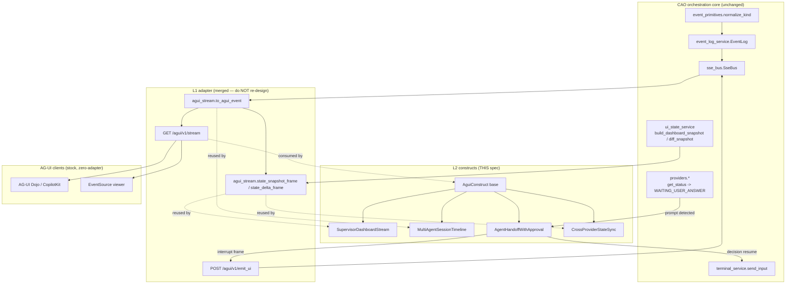
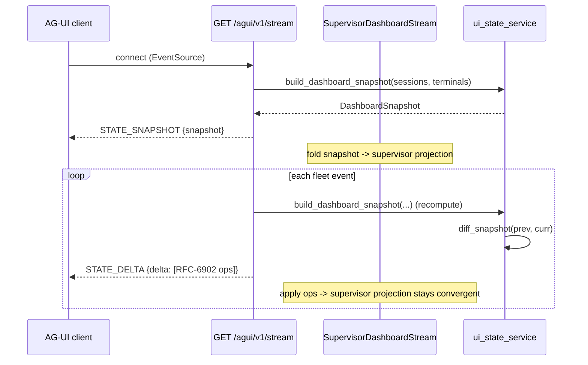
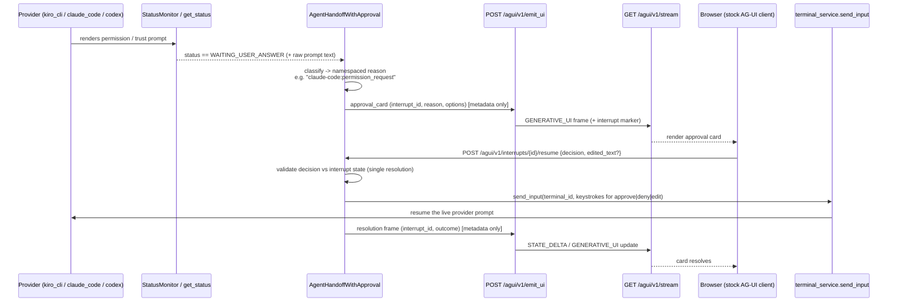

# Design Document: AG-UI L2 Construct Library (Phase 2)

> Tracking issue: awslabs/cli-agent-orchestrator **#458** (AG-UI Phase 2 — L2 constructs).
> Builds on the already-merged **L1 adapter** (issue #386 acceptance criteria). This
> document does **not** re-design L1; it composes purely over the existing L1 stream
> and emit path.

## Overview

CAO's merged **L1 AG-UI adapter** turns the fleet's six normalized event primitives
into AG-UI typed events on a single default-off SSE surface (`GET /agui/v1/stream` +
`POST /agui/v1/emit_ui`), with a metadata-only privacy boundary, a shared-state
`STATE_SNAPSHOT`/`STATE_DELTA` channel, a closed generative-UI allow-list, and
reconnect/overflow resilience. L1 is deliberately *primitive*: it is a stateless,
total mapping from one event record to one `(type, data)` pair plus two pure
snapshot-framing helpers.

**Phase 2 (this spec)** adds a small library of **named, subclassable L2 constructs**
layered *over* that L1 surface. Each construct is a plain Python class that consumes
the L1 stream (or the pure `to_agui_event` / snapshot helpers) and, where it produces
output, does so exclusively through the existing `emit_ui` / event-bus path. There is
**no bespoke SSE wiring in the app layer**: constructs never open sockets, never touch
`SseBus` framing, and never widen the privacy boundary. They are composed abstractions
that encode *recurring multi-agent UX patterns* (a supervisor dashboard, a handoff
timeline, human-in-the-loop approvals, cross-provider shared state) so that an
application author gets them by subclassing rather than by re-deriving the wire
protocol.

Four constructs are in scope, each shipping with documentation and a runnable example:

1. **`SupervisorDashboardStream`** — a session/terminal hierarchy plus a supervisor
   snapshot kept current with rolling `STATE_DELTA`s.
2. **`MultiAgentSessionTimeline`** — a first-class, ordered handoff/delegation timeline
   derived from `TOOL_CALL_*` and `TEXT_MESSAGE_CONTENT` frames.
3. **`AgentHandoffWithApproval`** — bidirectional human-in-the-loop: it maps a real
   provider permission/trust prompt onto AG-UI's interrupt lifecycle with
   **provider-namespaced reasons** and resumes the live provider from a browser
   decision (approve / deny / edit).
4. **`CrossProviderStateSync`** — shared fleet state validated to converge across
   **≥3 providers** (`kiro_cli`, `claude_code`, `codex`).

Two of these depend on **L1 cleanups** that this spec also owns (a completed
`TOOL_CALL_*` lifecycle, an explicit `?since=` + client-dedup replay contract on the
stream, and a stock-client zero-adapter live demo). Those cleanups are scoped narrowly
to what the L2 constructs require and are called out explicitly below.

### Goals

- Ship four subclassable constructs that compose purely over L1 (no new SSE plumbing).
- Preserve L1's invariants *through* L2: privacy (no message bodies on the wire),
  default-off enablement, totality of the mapping, and reconnect losslessness.
- Make human-in-the-loop approval work against a **real** provider prompt, resumable
  from a stock browser client.
- Prove cross-provider shared-state convergence across at least three heterogeneous
  providers.

### Non-Goals (explicitly out of scope for this spec)

- **Phase 3 / L3**: the reference dashboard application, authenticated *team* mode, and
  the AG-UI Dojo ecosystem listing. L2 provides the constructs an L3 dashboard would
  consume; it does not build that dashboard.
- **A2A / Agent Card / ACP modules**: a different protocol surface, not part of the
  #386/#458 acceptance criteria. (Note: the *existing* `a2a_delegation` CAO primitive
  is in scope only insofar as it drives `TOOL_CALL_*` frames — this is about CAO's
  internal delegation semantics, not the external A2A protocol.)
- Re-designing anything in L1 beyond the three named cleanups below.

---

## Architecture

### Layering



**Key architectural rule (the L2 contract):** every L2 construct is a pure composition
over L1 — it either (a) *reads* AG-UI frames off `/agui/v1/stream` and folds them into a
projection, or (b) *writes* through `emit_ui` / the event bus, or both. No construct
adds a route, opens an SSE connection of its own inside the app, or serializes SSE
framing. This keeps the privacy boundary and totality guarantees inherited from L1
intact by construction.

### Where L2 code lives

```
src/cli_agent_orchestrator/services/agui/
├── __init__.py               # re-exports the four constructs + base
├── base.py                   # AguiConstruct (base class) + shared projection helpers
├── supervisor_dashboard.py   # SupervisorDashboardStream
├── session_timeline.py       # MultiAgentSessionTimeline
├── handoff_approval.py       # AgentHandoffWithApproval + provider-namespaced reasons
└── cross_provider_sync.py    # CrossProviderStateSync
```

L1 cleanups touch the *existing* files only: `services/agui_stream.py` (TOOL_CALL
lifecycle), `api/main.py` (`?since=` contract), and `docs/agui.md` (documentation).
Approval resume reuses `services/terminal_service.send_input`. Examples live under
`examples/agui-*/` following the existing `run.sh` / `showcase.sh` convention.

### Sequence: SupervisorDashboardStream hydrate + rolling deltas



### Sequence: AgentHandoffWithApproval (bidirectional HITL)



---

## Components and Interfaces

### Base construct: `AguiConstruct`

**Purpose**: the subclassable foundation shared by all four constructs. It owns the
*composition seam* to L1 — how a construct receives AG-UI frames and how it emits — so
subclasses only implement domain folding, never wire mechanics.

**Interface**:

```python
class AguiConstruct(ABC):
    """Base class for L2 constructs composed purely over the L1 AG-UI surface.

    A construct is fed AG-UI (type, data) frames via ``handle_frame`` and folds
    them into an internal projection. Constructs that produce output do so ONLY
    through ``emit`` (which routes to POST /agui/v1/emit_ui / the event bus) —
    never by writing SSE bytes directly. This keeps the L1 privacy boundary and
    the totality of the mapping intact for every subclass.
    """

    def __init__(self, *, emitter: "UiEmitter | None" = None) -> None: ...

    @abstractmethod
    def handle_frame(self, agui_type: str, data: dict) -> None:
        """Fold one AG-UI frame into this construct's projection. Total: an
        unrecognized type is ignored, never raised on."""

    @abstractmethod
    def projection(self) -> dict:
        """Return the current JSON-serializable projection (metadata only)."""

    def emit(self, component: str, props: dict,
             terminal_id: str | None = None,
             session_name: str | None = None) -> None:
        """Publish an allow-listed generative-UI intent via the L1 emit path.
        Refuses off-list components and non-serializable/oversized props BEFORE
        the bus (mirrors emit_ui server-side validation)."""

    @staticmethod
    def assert_no_body(data: dict) -> None:
        """Defense-in-depth: assert a frame carries no message-body field."""
```

**Responsibilities**:
- Provide the single read seam (`handle_frame`) and write seam (`emit`).
- Enforce the metadata-only contract at the L2 boundary (`assert_no_body`, emit
  validation) so a subclass cannot accidentally widen it.
- Remain framework-agnostic: no FastAPI, no `SseBus` imports in `base.py` beyond the
  thin emitter indirection.

**`UiEmitter`** is a tiny indirection so constructs are unit-testable without a running
server: the production emitter calls the same validation + `event_log.append` +
`bus.publish` path that `POST /agui/v1/emit_ui` uses; a test emitter records intents.

### Construct 1: `SupervisorDashboardStream`

**Purpose**: maintain a supervisor-oriented projection of the fleet — the
session→terminal hierarchy plus a rolling supervisor snapshot — kept current from the
L1 `STATE_SNAPSHOT` on connect and each subsequent `STATE_DELTA`.

**Interface**:

```python
class SupervisorDashboardStream(AguiConstruct):
    def handle_frame(self, agui_type: str, data: dict) -> None:
        """STATE_SNAPSHOT -> replace projection; STATE_DELTA -> apply RFC-6902
        ops; RUN_*/STEP_* -> update per-session/per-terminal supervisor rollup."""

    def hierarchy(self) -> dict:
        """{session_name: {terminals: [...], status, counts}} view."""

    def supervisor_snapshot(self) -> dict:
        """Aggregate rollup: active sessions, per-provider terminal counts,
        last activity — all derived from folded frames, metadata only."""
```

**Responsibilities**:
- Reuse `ui_state_service.build_dashboard_snapshot` / `diff_snapshot` semantics by
  *applying* the deltas L1 already emits (no re-diffing on the client side).
- Never recompute from a data source of its own; the L1 stream is the sole input.

### Construct 2: `MultiAgentSessionTimeline`

**Purpose**: turn the flat AG-UI event stream into a first-class, causally-ordered
timeline of handoffs and delegations between agents.

**Interface**:

```python
@dataclass(frozen=True)
class TimelineEntry:
    id: str
    kind: Literal["handoff", "delegation"]
    sender: str | None
    receiver: str | None
    tool_call_id: str | None      # set for delegation (TOOL_CALL_* correlation)
    started_at: str
    ended_at: str | None          # set when TOOL_CALL_END/RESULT arrives
    status: Literal["open", "completed", "errored"]

class MultiAgentSessionTimeline(AguiConstruct):
    def handle_frame(self, agui_type: str, data: dict) -> None:
        """TEXT_MESSAGE_CONTENT (handoff) -> append entry;
        TOOL_CALL_START (a2a_delegation) -> open entry keyed by tool_call_id;
        TOOL_CALL_END/TOOL_CALL_RESULT -> close the matching open entry."""

    def entries(self) -> list[TimelineEntry]: ...
```

**Responsibilities**:
- Correlate `TOOL_CALL_START` → `TOOL_CALL_END`/`TOOL_CALL_RESULT` by `tool_call_id`
  (this is why the L1 TOOL_CALL lifecycle cleanup is a dependency — see below).
- Preserve ordering by event id / timestamp; tolerate out-of-order or missing closers
  (entry stays `open`), never raising.

### Construct 3: `AgentHandoffWithApproval`

**Purpose**: bidirectional human-in-the-loop. Map a **real** provider permission/trust
prompt onto AG-UI's interrupt lifecycle and resume the live provider from a browser
decision.

**Interface**:

```python
class ApprovalDecision(str, Enum):
    APPROVE = "approve"
    DENY = "deny"
    EDIT = "edit"        # approve-with-modification (edited command / answer text)

@dataclass
class Interrupt:
    id: str
    terminal_id: str
    session_name: str | None
    provider: str
    reason: str                    # PROVIDER-NAMESPACED, e.g. "kiro:trust_prompt"
    options: list[str]             # decisions the client may offer
    created_at: str
    resolved: bool = False
    outcome: ApprovalDecision | None = None

class AgentHandoffWithApproval(AguiConstruct):
    def on_provider_waiting(self, terminal_id: str, provider: str,
                            raw_prompt: str,
                            session_name: str | None = None) -> Interrupt:
        """Called when a provider transitions to WAITING_USER_ANSWER. Classifies
        the prompt into a namespaced reason, opens an Interrupt, and emits an
        approval_card GENERATIVE_UI frame (metadata only — the prompt CATEGORY
        and a redacted summary, never raw sensitive command text unless the
        provider marks it safe)."""

    def resume(self, interrupt_id: str, decision: ApprovalDecision,
               edited_text: str | None = None) -> Interrupt:
        """Resolve an open interrupt exactly once: validate state, translate the
        decision into provider keystrokes, send_input() to the live terminal,
        emit a resolution frame. Idempotent on an already-resolved interrupt
        (returns the recorded outcome; never double-sends keystrokes)."""

    def pending(self) -> list[Interrupt]: ...
```

**Responsibilities**:
- Classify a provider prompt into a **provider-namespaced reason** (see scheme below).
- Own the interrupt lifecycle: `open → (approve|deny|edit) → resolved`, with exactly one
  resolution per interrupt.
- Translate a decision into provider-appropriate keystrokes and resume via
  `terminal_service.send_input` (the existing, tested input path).
- A new thin route `POST /agui/v1/interrupts/{id}/resume` wires the browser to `resume`;
  it reuses the same auth (`cao:write`) and default-off gating as `emit_ui`.

### Construct 4: `CrossProviderStateSync`

**Purpose**: maintain one shared fleet-state projection fed by events originating from
multiple heterogeneous providers, and validate that it **converges** to the same value
regardless of provider mix or event interleaving — proven across `kiro_cli`,
`claude_code`, and `codex`.

**Interface**:

```python
class CrossProviderStateSync(AguiConstruct):
    def handle_frame(self, agui_type: str, data: dict) -> None:
        """STATE_SNAPSHOT -> set baseline; STATE_DELTA -> apply RFC-6902 ops.
        Provider-agnostic: the ops are already normalized by L1, so a kiro_cli,
        claude_code, or codex origin folds identically."""

    def shared_state(self) -> dict: ...

    def converges_with(self, authoritative_snapshot: dict) -> bool:
        """True iff the folded shared_state is deep-equal to an authoritative
        build_dashboard_snapshot of the same fleet (the convergence property)."""
```

**Responsibilities**:
- Apply RFC-6902 ops deterministically so that, for any ordering consistent with per-key
  causal order, the folded state equals `build_dashboard_snapshot` of the same inputs.
- Carry a `provider` tag on per-terminal entries so the validation can assert coverage of
  ≥3 providers, without changing the wire shape.

---

## Data Models

### Supervisor projection (folded from L1 STATE_SNAPSHOT/DELTA)

```python
SupervisorProjection = {
    "sessions": [ {"name": str, "status": str, "terminal_ids": [str, ...]} ],
    "by_provider": { "kiro_cli": int, "claude_code": int, "codex": int, ... },
    "counts": {"sessions": int, "terminals": int},
    "last_event_id": str | None,     # cursor for reconnect dedup
}
```

**Validation rules**:
- Every field is derived only from folded frames (no external fetch).
- No message body, no terminal stdout — metadata only.

### Interrupt (approval lifecycle)

```python
Interrupt = {
    "id": str,                 # opaque interrupt id (== originating event id)
    "terminal_id": str,
    "session_name": str | None,
    "provider": str,           # "kiro_cli" | "claude_code" | "codex" | ...
    "reason": str,             # PROVIDER-NAMESPACED (see scheme)
    "options": [str, ...],     # e.g. ["approve", "deny", "edit"]
    "created_at": str,         # ISO-8601 UTC
    "resolved": bool,
    "outcome": str | None,     # "approve" | "deny" | "edit"
}
```

**Validation rules**:
- `reason` MUST match `^[a-z0-9-]+:[a-z0-9_]+$` (namespace `:` local-name).
- `resolved == True` ⟺ `outcome is not None`.
- Once `resolved`, the interrupt is immutable (idempotent resume).

### Provider-namespaced reason scheme

The `reason` string is `"{provider-namespace}:{prompt-kind}"`. The namespace is the
provider identity (kebab-cased); the local name is a stable, closed prompt category. The
scheme is **extensible per provider** but each provider contributes a *closed* set so a
client can switch on it exhaustively with a safe default.

| Provider | `reason` value | Detected from (existing signal) |
|---|---|---|
| `claude_code` | `claude-code:permission_request` | `WAITING_USER_ANSWER` + tool-permission prompt |
| `claude_code` | `claude-code:trust_prompt` | trust-this-folder prompt |
| `kiro_cli` | `kiro:trust_prompt` | trust/permission confirmation (`WAITING_USER_ANSWER`) |
| `kiro_cli` | `kiro:permission_request` | per-tool permission confirmation |
| `codex` | `codex:approval_request` | approval prompt at the idle/approval gate |
| *(any)* | `{ns}:unknown_prompt` | `WAITING_USER_ANSWER` with no matched pattern (safe default) |

Classification is a **total** function: any `(provider, raw_prompt)` maps to exactly one
reason, defaulting to `{ns}:unknown_prompt`, so a new or unrecognized prompt shape never
raises and never silently drops the interrupt. Detection reuses each provider's existing
`get_status`/pattern surface (e.g. Kiro's `WAITING_USER_ANSWER`, Claude's
`WAITING_PROMPT_PATTERN`); L2 classifies, it does not re-parse terminals from scratch.

---

## L1 Cleanups (owned by this spec, scoped to L2 dependencies)

### Cleanup A — Complete the `TOOL_CALL_*` lifecycle

**Current state (verified in `services/agui_stream.py`):** the adapter maps
`a2a_delegation` → `TOOL_CALL_START` and `handoff` → `TEXT_MESSAGE_CONTENT`, but there is
**no** emission of the matching `TOOL_CALL_END` / `TOOL_CALL_RESULT`. A delegation
therefore appears to start and never finish on the wire. `docs/agui.md` already advertises
`TOOL_CALL_END` in the mapping table, so the docs and adapter currently disagree.

**Change:** when a delegation/handoff *completes* (the corresponding completion primitive
arrives, correlated by the originating event/tool-call id), emit `TOOL_CALL_END` and,
where a result payload exists, `TOOL_CALL_RESULT` — carrying the same `tool_call_id` as
the `START`, metadata only. This is a localized addition to the primitive mapping plus a
correlation key; it does not change existing START/START-less paths.

**Why L2 needs it:** `MultiAgentSessionTimeline` closes timeline entries on END/RESULT;
without it, every delegation entry is stuck `open`.

### Cleanup B — `?since=` replay contract on the stream itself + client-side dedup

**Current state (verified in `api/main.py`):** `/agui/v1/stream` already accepts `?since=`
and `Last-Event-ID`, registers the live subscription before replaying, re-emits buffered
records as AG-UI frames, and de-duplicates the replay/live overlap **server-side** by
event id. The generic `/events/history` also provides replay.

**Change (contract hardening, not new plumbing):**
1. Make the **client-side dedup by event id** an explicit, documented contract: every
   replayed frame carries its `id:` cursor, and a client resuming across a *fresh*
   connection with `?since=` must dedup by that id. Document it in `docs/agui.md`.
2. Guarantee **STATE_SNAPSHOT idempotency on replay**: a reconnect must not leave the
   client with a torn projection — the snapshot-then-deltas ordering after replay is
   pinned by property tests (see Correctness Properties).
3. Ensure `?since=` and `Last-Event-ID` precedence (since wins) is covered for the AG-UI
   frame path, not only the raw event path.

**Why L2 needs it:** `SupervisorDashboardStream` and `CrossProviderStateSync` must
survive a reconnect without a gap or a double-applied delta, or their projections diverge.

### Cleanup C — AC3 live-server zero-adapter demo

**Current state:** `examples/agui-eventsource-viewer/` renders the live stream with a
dependency-free viewer; `examples/agui-dashboard/` drives generative UI via `showcase.sh`.

**Change:** add a **stock AG-UI client (AG-UI Dojo / CopilotKit)** rendering a *live* run
that is **driving the live server** (not a recorded replay) — a credentials-free
`run.sh` that starts `cao-server` with the surface enabled and points the stock client at
`/agui/v1/stream`, proving zero CAO-specific adapter code is required end-to-end.

---

## Low-Level Design

Language: **Python** (the constructs are Python classes in the existing codebase). Code
below is illustrative of the contracts; formal specs (preconditions/postconditions/loop
invariants) accompany each key function.

### Core interfaces / types

```python
from abc import ABC, abstractmethod
from dataclasses import dataclass
from enum import Enum
from typing import Callable, Literal

AguiFrame = tuple[str, dict]        # (AGUI_TYPE, data) — exactly what to_agui_event returns
RfcOp = dict                         # RFC-6902 op: {"op","path", "value"?}

class UiEmitter:
    """Production emitter: validate -> event_log.append("other", ...) -> bus.publish.
    Mirrors POST /agui/v1/emit_ui exactly so constructs share one validation path."""
    def emit(self, component: str, props: dict,
             terminal_id: str | None, session_name: str | None) -> str: ...
```

### Key functions with formal specifications

#### `AguiConstruct.emit(component, props, terminal_id, session_name)`

```python
def emit(self, component, props, terminal_id=None, session_name=None) -> None
```

**Preconditions:**
- `component` is a non-empty string.
- `props` is a mapping.

**Postconditions:**
- If `component ∈ GENERATIVE_UI_COMPONENTS` and `props` is JSON-serializable and
  `len(json(props)) ≤ 8 KiB`: exactly one intent is published via the L1 emit path and it
  contains no message-body field.
- Otherwise: nothing is published and the call raises `ValueError` (client-side refusal),
  matching `emit_ui`'s 400 semantics — a bad intent never reaches the bus.
- No side effects on `props` (not mutated).

**Loop invariants:** N/A.

#### `MultiAgentSessionTimeline.handle_frame(agui_type, data)`

```python
def handle_frame(self, agui_type, data) -> None
```

**Preconditions:**
- `(agui_type, data)` is a well-formed AG-UI frame from `to_agui_event`.

**Postconditions:**
- `TOOL_CALL_START` → a new entry with `status == "open"`, keyed by `data["tool_call_id"]`.
- `TOOL_CALL_END`/`TOOL_CALL_RESULT` with a known `tool_call_id` → that entry becomes
  `status == "completed"` with `ended_at` set; unknown id → no-op (tolerated).
- `TEXT_MESSAGE_CONTENT` → a `handoff` entry appended, `delta` never stored (privacy).
- Any other type → projection unchanged (totality).
- The number of `open` entries is non-increasing under close frames.

**Loop invariants (over the folded event sequence):**
- Every `completed` entry was previously `open` (no entry closes without opening).
- Entries remain ordered by `(timestamp, id)`.

#### `AgentHandoffWithApproval.resume(interrupt_id, decision, edited_text=None)`

```python
def resume(self, interrupt_id, decision, edited_text=None) -> Interrupt
```

**Preconditions:**
- `interrupt_id` identifies a known interrupt.
- `decision ∈ {APPROVE, DENY, EDIT}`; if `decision == EDIT`, `edited_text` is non-empty.

**Postconditions:**
- If the interrupt was already `resolved`: returns the recorded interrupt unchanged; **no**
  keystrokes are sent (idempotent).
- Else: the interrupt becomes `resolved` with `outcome == decision`, provider keystrokes
  are sent to the live terminal **exactly once** via `send_input`, and exactly one
  resolution frame is emitted.
- No raw sensitive command body is placed on the wire beyond what the provider marked safe.

**Loop invariants:** N/A (single-shot resolution).

#### `classify_reason(provider, raw_prompt)`

```python
def classify_reason(provider: str, raw_prompt: str) -> str
```

**Preconditions:** `provider` and `raw_prompt` are strings (any value, including empty).

**Postconditions:**
- Returns exactly one string matching `^[a-z0-9-]+:[a-z0-9_]+$`.
- Total: never raises; an unmatched prompt returns `f"{namespace(provider)}:unknown_prompt"`.
- Deterministic: same inputs → same reason.

**Loop invariants:** N/A.

### Algorithmic pseudocode

#### STATE_DELTA convergence fold (Supervisor / CrossProviderStateSync)

```pascal
ALGORITHM foldStream(frames)
INPUT: frames — ordered AG-UI frames beginning with a STATE_SNAPSHOT
OUTPUT: state — the folded shared-state projection

BEGIN
  state ← {}
  seen  ← empty set        // event ids already applied (reconnect dedup)

  FOR each (type, data, event_id) IN frames DO
    ASSERT stateConsistent(state)              // loop invariant

    IF event_id ≠ NULL AND event_id IN seen THEN
      CONTINUE                                 // dedup: never apply twice
    END IF

    IF type = "STATE_SNAPSHOT" THEN
      state ← deepCopy(data.snapshot)          // baseline (idempotent on replay)
    ELSE IF type = "STATE_DELTA" THEN
      state ← applyRfc6902(state, data.delta)  // minimal patch
    ELSE
      // RUN_*/STEP_*/TOOL_CALL_* update rollups only; never a body
      state ← updateRollup(state, type, data)
    END IF

    IF event_id ≠ NULL THEN seen.add(event_id) END IF
  END FOR

  ASSERT stateConsistent(state)
  RETURN state
END
```

**Preconditions:** the first STATE-bearing frame is a `STATE_SNAPSHOT`; every `STATE_DELTA`
is a valid RFC-6902 patch against the running state.

**Postconditions:** `foldStream(frames)` is deep-equal to
`build_dashboard_snapshot(sessions, terminals)` of the same underlying fleet, for any
frame ordering consistent with per-key causal order (convergence).

**Loop invariants:** `state` is always a valid DashboardSnapshot shape; `seen` contains
exactly the event ids already applied, so no delta is applied twice across a reconnect.

#### Interrupt lifecycle

```pascal
ALGORITHM handleApproval(provider, terminal_id, raw_prompt)
BEGIN
  reason ← classify_reason(provider, raw_prompt)     // total, namespaced
  intr   ← Interrupt(id=newId(), provider=provider,
                     terminal_id=terminal_id, reason=reason,
                     options=["approve","deny","edit"], resolved=false)
  registry[intr.id] ← intr
  emit("approval_card", { reason, options: intr.options,
                          summary: redact(raw_prompt) })   // metadata only
  RETURN intr
END

ALGORITHM resume(intr_id, decision, edited_text)
BEGIN
  intr ← registry[intr_id]
  ASSERT intr ≠ NULL

  IF intr.resolved THEN
    RETURN intr                                  // idempotent, no re-send
  END IF

  keystrokes ← translate(intr.provider, decision, edited_text)
  send_input(intr.terminal_id, keystrokes)       // resume the LIVE provider
  intr.resolved ← true
  intr.outcome  ← decision
  emit("approval_card", { reason: intr.reason, resolved: true,
                          outcome: decision })    // resolution, metadata only
  RETURN intr
END
```

**Postconditions:** every opened interrupt reaches `resolved` at most once; `send_input`
is invoked exactly once per resolved interrupt; a duplicate `resume` is a no-op.

### Example usage

```python
# --- SupervisorDashboardStream: fold the live stream into a supervisor view ---
sup = SupervisorDashboardStream()
for agui_type, data in client_frames():          # frames off /agui/v1/stream
    sup.handle_frame(agui_type, data)
print(sup.hierarchy(), sup.supervisor_snapshot())

# --- MultiAgentSessionTimeline: causal handoff/delegation timeline ---
tl = MultiAgentSessionTimeline()
for agui_type, data in client_frames():
    tl.handle_frame(agui_type, data)
open_delegations = [e for e in tl.entries() if e.status == "open"]

# --- AgentHandoffWithApproval: real provider prompt -> browser -> resume ---
appr = AgentHandoffWithApproval(emitter=production_emitter)
intr = appr.on_provider_waiting(
    terminal_id="dev-abcd", provider="claude_code",
    raw_prompt="Do you want to allow Write to /etc/hosts? (y/n)")
assert intr.reason == "claude-code:permission_request"
# ... browser POSTs the decision ...
appr.resume(intr.id, ApprovalDecision.DENY)       # resumes the live terminal

# --- CrossProviderStateSync: converge across kiro_cli + claude_code + codex ---
sync = CrossProviderStateSync()
for agui_type, data in mixed_provider_frames():
    sync.handle_frame(agui_type, data)
assert sync.converges_with(build_dashboard_snapshot(sessions, terminals))
```

---

## Correctness Properties

These are the universally-quantified properties targeted by property-based tests
(library: **Hypothesis**, matching the Python codebase). Each is stated as
`∀ inputs. property`.

1. **Interrupt lifecycle round-trip.**
   `∀ provider, prompt, decision`: opening an interrupt then resuming it once yields
   `resolved == True ∧ outcome == decision`, and a *second* `resume` leaves state
   unchanged and sends no further keystrokes.
   → *exactly one resolution; idempotent resume.*

2. **Reason is total and well-formed.**
   `∀ provider, raw_prompt` (any strings): `classify_reason` returns a string matching
   `^[a-z0-9-]+:[a-z0-9_]+$` and never raises.

3. **State-delta convergence across providers.**
   `∀ fleet, ∀ ordering consistent with per-key causal order` mixing events from
   `kiro_cli`, `claude_code`, `codex`: `foldStream(frames)` is deep-equal to
   `build_dashboard_snapshot(sessions, terminals)`.
   → *the shared state converges regardless of provider mix or interleaving.*

4. **Reconnect dedup idempotency.**
   `∀ frames, ∀ split point`: folding `frames` equals folding
   `frames[:k] ++ replay(frames[j:])` for `j ≤ k` (an overlapping `?since=` replay),
   because event-id dedup drops the overlap — no gap, no double-applied delta.

5. **Privacy boundary preserved through L2.**
   `∀ frame handled or emitted by any construct`: the resulting projection and every
   emitted intent contain no message-body field (`assert_no_body` holds), and
   `TEXT_MESSAGE_CONTENT` folding never stores `delta`.

6. **TOOL_CALL lifecycle well-formedness.**
   `∀ delegation event sequence`: every emitted `TOOL_CALL_END`/`TOOL_CALL_RESULT` carries
   a `tool_call_id` matching a prior `TOOL_CALL_START`; in the timeline, the count of
   `completed` entries ≤ count of opened entries, and no entry is completed without being
   opened first.

7. **Emit refusal parity.**
   `∀ component, props`: `AguiConstruct.emit` publishes iff `component` is on the L1
   allow-list and `props` is JSON-serializable and ≤ 8 KiB — identical to the `emit_ui`
   server-side guard (no L2 bypass of L1 safety).

8. **Subclass substitutability.**
   `∀ construct subclass, ∀ frame`: `handle_frame` is total (an unrecognized `agui_type`
   leaves the projection unchanged and does not raise) and `projection()` is
   JSON-serializable.

---

## Error Handling

### Scenario 1: Unknown / malformed AG-UI frame
**Condition**: a frame with an unrecognized `agui_type` or missing expected fields reaches
a construct.
**Response**: `handle_frame` treats it as a no-op (totality); the projection is unchanged.
**Recovery**: none needed — the next well-formed frame folds normally.

### Scenario 2: Off-list / oversized generative-UI intent from a construct
**Condition**: a subclass calls `emit` with an off-list component or non-serializable /
> 8 KiB props.
**Response**: refuse client-side with `ValueError` before the bus (mirrors `emit_ui` 400).
**Recovery**: the construct catches and degrades (e.g. emits a smaller `metric`), or logs;
the stream is never corrupted.

### Scenario 3: Resume on an already-resolved or unknown interrupt
**Condition**: a duplicate or stale browser POST hits `resume`.
**Response**: unknown id → 404 at the route; already-resolved → idempotent no-op returning
the recorded outcome, no second `send_input`.
**Recovery**: the client reconciles from the resolution frame it will receive on the stream.

### Scenario 4: Provider prompt disappears before resume (timeout / agent gave up)
**Condition**: the terminal leaves `WAITING_USER_ANSWER` before a decision arrives.
**Response**: `resume` still records the outcome but the keystroke send is best-effort;
`send_input` failure is caught and the interrupt is marked `resolved` with an
`expired`-flavored resolution frame.
**Recovery**: the client shows the card as expired; no exception propagates to the stream.

### Scenario 5: Reconnect with `?since=`
**Condition**: the client drops and reconnects.
**Response**: server replays buffered frames after the cursor; the construct's event-id
dedup drops the overlap (Property 4).
**Recovery**: automatic — projection stays convergent with neither gap nor duplicate.

---

## Testing Strategy

### Unit testing
- Each construct: frame-folding tables (snapshot/delta/run/step/tool_call/text), emit
  validation parity with `emit_ui`, and `assert_no_body` on every emitted intent.
- `classify_reason`: a table per provider mapping representative real prompt fixtures
  (reuse existing provider fixtures, e.g. Kiro/Claude/Codex prompt captures) to expected
  namespaced reasons, plus the `unknown_prompt` default.
- `resume`: approve/deny/edit keystroke translation per provider, idempotency, and the
  expired path.

### Property-based testing (Hypothesis)
Covers Correctness Properties 1–8. Notable generators:
- Random RFC-6902-consistent fleet mutation sequences tagged with random provider origins
  (Property 3) and random reconnect split points (Property 4).
- Arbitrary `(provider, prompt)` strings for reason totality (Property 2).
- Arbitrary interrupt/decision sequences for lifecycle round-trip and idempotency
  (Property 1).

**Property Test Library**: Hypothesis (Python), consistent with the existing test suite
under `test/services` and `test/api`.

### Integration testing
- **Cross-provider convergence (≥3 providers)**: spin up `kiro_cli`, `claude_code`, and
  `codex` terminals (mock/fixture-backed where a real CLI is unavailable in CI), drive
  handoffs/delegations, and assert `CrossProviderStateSync.converges_with(...)` against the
  authoritative snapshot.
- **HITL against a real prompt**: drive a provider into `WAITING_USER_ANSWER`, assert the
  interrupt/reason, POST a decision to `/agui/v1/interrupts/{id}/resume`, and assert the
  live terminal advances (via `send_input` observation).
- **Reconnect losslessness**: connect, kill the connection mid-stream, reconnect with
  `?since=`, assert the folded projection equals the uninterrupted fold.
- **AC3 zero-adapter demo**: a CI smoke test that boots `cao-server` with the surface
  enabled and asserts the stock AG-UI client renders live frames from `/agui/v1/stream`.

---

## Performance Considerations

- **Delta recompute cadence**: the L1 stream currently recomputes the fleet snapshot on
  every event (documented as an acceptable follow-up for the opt-in dashboard surface). L2
  constructs must **not** add a second recompute — they *apply* the deltas L1 already
  emits, so per-event L2 work is O(size of the RFC-6902 patch), not O(fleet size).
- **Timeline growth**: `MultiAgentSessionTimeline` is bounded by the L1 ring buffer window
  it consumes; it should cap retained entries (mirror `RING_CAPACITY`) so a long-running
  session cannot grow the projection without bound.
- **Interrupt registry**: bounded and TTL-swept (resolved/expired interrupts evicted) so a
  flapping provider prompt cannot leak memory.

## Security Considerations

- **Privacy boundary is inherited, not re-implemented**: constructs fold metadata-only
  frames and emit only allow-listed components; `assert_no_body` and emit validation are
  defense-in-depth. No construct reads terminal stdout onto the wire.
- **Approval is a privileged action**: `POST /agui/v1/interrupts/{id}/resume` requires
  `cao:write` (same as `emit_ui`) and is default-off with the AG-UI surface. Resuming a
  provider prompt is effectively authorizing a tool action, so the auth floor must not be
  lower than `emit_ui`.
- **Redaction on the approval card**: the raw prompt may contain sensitive command text;
  the card carries a redacted category/summary by default, surfacing full detail only when
  the provider marks it safe.
- **Namespaced reasons prevent spoofing ambiguity**: a client switches on
  `{provider}:{kind}` and MUST fall back safely on `unknown_prompt`, so a novel prompt
  never renders as a more-trusted category.

## Dependencies

- **Existing L1 surface** (merged): `services/agui_stream.py`, `services/ui_state_service.py`,
  `services/event_primitives.py`, `services/event_log_service.py`, `services/sse_bus.py`,
  `api/main.py` (`/agui/v1/stream`, `/agui/v1/emit_ui`), `docs/agui.md`.
- **Provider surface**: `providers/base.py` + `providers/{kiro_cli,claude_code,codex}.py`
  for `WAITING_USER_ANSWER` detection and prompt patterns; `services/terminal_service.send_input`
  for resume.
- **Testing**: Hypothesis (property-based), pytest (existing).
- **Demo (AC3)**: a stock AG-UI client (AG-UI Dojo / CopilotKit) — pinned in the example's
  own tooling, not added to the CAO runtime dependencies.
- **No new runtime services**: constructs are in-process Python composed over L1; the only
  new HTTP route is the thin `interrupts/{id}/resume` resume endpoint reusing existing auth.
```
