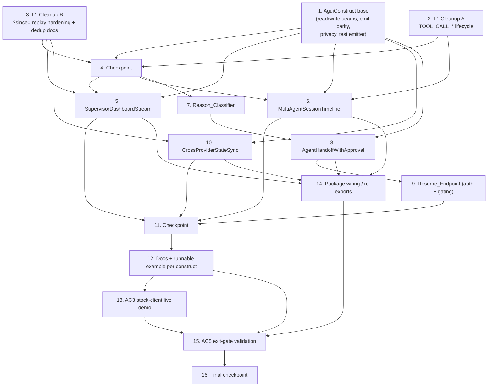

# Implementation Plan: AG-UI L2 Construct Library (Phase 2)

## Overview

This plan implements AG-UI Phase 2 (awslabs/cli-agent-orchestrator #458): a small library
of subclassable **L2 constructs** composed purely over the already-merged **L1 adapter**.
All implementation is **Python** (matching the existing codebase), with property-based
tests written in **Hypothesis** and unit/integration tests in **pytest**.

The plan is sequenced test-first and incremental. It front-loads the **base construct**
and the two **L1 cleanups** (`TOOL_CALL_*` lifecycle completion; `?since=` replay
hardening + client-side dedup docs) because `MultiAgentSessionTimeline` depends on the
completed `TOOL_CALL` lifecycle and `SupervisorDashboardStream` / `CrossProviderStateSync`
depend on the hardened replay contract. Each construct is then built over the base,
followed by docs + a runnable example per construct, the AC3 stock-client live demo, final
wiring, and the AC5 exit-gate validation.

New L2 code lives under `src/cli_agent_orchestrator/services/agui/`. L1 cleanups touch only
the existing `services/agui_stream.py`, `api/main.py`, and `docs/agui.md`. Examples follow
the existing `examples/agui-*/` `run.sh` / `showcase.sh` convention. Tests live under
`test/services/agui/` and `test/api/`.

### Correctness properties covered (from design)

- **P1** Interrupt lifecycle round-trip / idempotent resume
- **P2** Reason totality and well-formedness
- **P3** State-delta convergence across providers
- **P4** Reconnect dedup idempotency
- **P5** Privacy boundary preserved through L2
- **P6** TOOL_CALL lifecycle well-formedness
- **P7** Emit refusal parity with `emit_ui`
- **P8** Subclass substitutability (total `handle_frame`, serializable `projection()`)

## Task Dependency Graph

## Tasks

- [ ] 1. Establish the subclassable `AguiConstruct` base with read/write seams, emit parity, and privacy boundary
  - [ ] 1.1 Create the `services/agui/` package and `base.py` with the `AguiConstruct` ABC
    - Create `src/cli_agent_orchestrator/services/agui/__init__.py` and `base.py`
    - Define `AguiConstruct(ABC)` with abstract `handle_frame(agui_type, data)` and `projection()`; a concrete `emit(component, props, terminal_id=None, session_name=None)` write seam; and a static `assert_no_body(data)` helper
    - Ensure `handle_frame` contract is total (unrecognized `agui_type` leaves projection unchanged, no raise) and `projection()` returns a JSON-serializable value without raising
    - Ensure no FastAPI / `SseBus` framing imports leak into `base.py`; the class must not open sockets, add routes, or serialize SSE
    - _Requirements: 1.1, 1.2, 1.3, 1.4, 1.5, 1.6, 1.7_

  - [ ] 1.2 Implement `emit` validation parity and the metadata-only boundary
    - In `emit`, refuse off-allow-list `component`, non-JSON-serializable `props`, and `props` whose UTF-8 JSON serialization exceeds 8192 bytes by raising `ValueError` before any publish (mirrors `emit_ui` 400 semantics); publish exactly one intent otherwise
    - Reuse the existing L1 allow-list source (`services/agui_stream.py` / `emit_ui` validation) rather than duplicating the component set
    - Guarantee `props` is never mutated on either the publish or refuse path
    - Implement `assert_no_body` to raise when a frame carries a message-body field (delta text, terminal stdout, assistant content), leaving projection unchanged and publishing nothing
    - _Requirements: 2.1, 2.2, 2.3, 2.4, 2.5, 3.1, 3.2, 3.4, 3.5_

  - [ ] 1.3 Implement the `UiEmitter` indirection with production and test emitters
    - Add production `UiEmitter` that routes through the same validation + `event_log.append` + bus publish path used by `POST /agui/v1/emit_ui`
    - Add a test emitter that records each intent (`component`, `props`, `terminal_id`, `session_name`) and publishes nothing through the Emit_Path
    - Wire `AguiConstruct.__init__(*, emitter=None)` to default to the production emitter and accept a test emitter for unit testing
    - _Requirements: 1.8_

  - [ ]* 1.4 Write property test for emit refusal parity
    - **Property 7: Emit refusal parity** — `∀ component, props`: `emit` publishes iff `component` is on the L1 allow-list AND `props` is JSON-serializable AND ≤ 8192 bytes; identical to `emit_ui` guard; `props` never mutated
    - **Validates: Requirements 2.1, 2.2, 2.3, 2.4, 2.5**

  - [ ]* 1.5 Write property test for subclass substitutability
    - **Property 8: Subclass substitutability** — `∀ frame`: a minimal test subclass's `handle_frame` is total (unknown `agui_type` leaves projection unchanged, never raises) and `projection()` is JSON-serializable
    - **Validates: Requirements 1.5, 1.6, 1.7**

  - [ ]* 1.6 Write property test for the privacy boundary at the base seam
    - **Property 5: Privacy boundary preserved through L2** — `∀ frame handled or emitted`: `assert_no_body` holds for every emitted intent and no message-body field survives into any projection
    - **Validates: Requirements 3.1, 3.2, 3.4, 3.5**

  - [ ]* 1.7 Write unit tests for base emit and test emitter
    - Cover allow-list boundary examples, exact 8192-byte size boundary, non-serializable props, `props`-unmutated assertion, and test-emitter intent recording
    - _Requirements: 1.8, 2.1, 2.4, 2.5_

- [ ] 2. L1 Cleanup A — complete the `TOOL_CALL_*` lifecycle in the adapter
  - [ ] 2.1 Emit correlated `TOOL_CALL_END` / `TOOL_CALL_RESULT` frames
    - In `services/agui_stream.py`, when a delegation completion primitive correlated by `tool_call_id` to a prior `TOOL_CALL_START` arrives, emit exactly one `TOOL_CALL_END` carrying the same `tool_call_id`; where a result payload exists, additionally emit exactly one `TOOL_CALL_RESULT` with the same `tool_call_id`
    - Emit a metadata-only failure indication on `TOOL_CALL_END` when a correlated delegation terminates in failure (no exact message text)
    - Do not emit orphan `TOOL_CALL_END`/`TOOL_CALL_RESULT` when there is no matching prior `TOOL_CALL_START`; leave all non-delegation primitive mappings byte-for-byte unchanged
    - Ensure every emitted `TOOL_CALL_END`/`TOOL_CALL_RESULT` is metadata only
    - _Requirements: 6.1, 6.2, 6.3, 6.4, 6.5, 6.6_

  - [ ]* 2.2 Write property test for TOOL_CALL lifecycle well-formedness
    - **Property 6: TOOL_CALL lifecycle well-formedness** — `∀ delegation event sequence`: every emitted `TOOL_CALL_END`/`TOOL_CALL_RESULT` carries a `tool_call_id` matching a prior `TOOL_CALL_START`, and no completion frame is orphaned
    - **Validates: Requirements 6.1, 6.2, 6.3**

  - [ ]* 2.3 Write unit tests for orphan, failure, and no-regression cases
    - Cover the failure-termination `TOOL_CALL_END`, orphan-completion suppression, metadata-only assertion, and unchanged output for non-delegation primitives
    - _Requirements: 6.4, 6.5, 6.6_

- [ ] 3. L1 Cleanup B — harden the `?since=` replay contract and document client-side dedup
  - [ ] 3.1 Harden the AG-UI frame replay path in `api/main.py`
    - Ensure every replayed frame on the `?since=` path carries a monotonically-ordered `id` cursor
    - Guarantee exactly one `STATE_SNAPSHOT` is delivered before any subsequent `STATE_DELTA` on reconnect (no torn projection)
    - Make `?since=` take precedence over `Last-Event-ID` for the AG-UI frame path (ignore `Last-Event-ID` when both present)
    - Deliver a full `STATE_SNAPSHOT` baseline when a `?since=` cursor references evicted frames; reject a malformed/non-existent cursor with an invalid-cursor error and perform no replay
    - _Requirements: 7.1, 7.3, 7.4, 7.5, 7.6_

  - [ ] 3.2 Document the client-side dedup-by-event-id contract in `docs/agui.md`
    - Document that each replayed frame carries its `id:` cursor and that a client resuming across a fresh connection with `?since=` must skip frames whose `id` is ≤ the highest `id` already applied
    - Reconcile the mapping table with the now-complete `TOOL_CALL_END`/`TOOL_CALL_RESULT` emission from Task 2
    - _Requirements: 7.2, 7.7_

  - [ ]* 3.3 Write property test for reconnect dedup idempotency
    - **Property 4: Reconnect dedup idempotency** — `∀ frames, ∀ split point k, ∀ j ≤ k`: folding `frames` equals folding `frames[:k] ++ replay(frames[j:])` because event-id dedup drops the overlap (no gap, no double-applied delta)
    - **Validates: Requirements 7.1, 7.2, 7.3**

  - [ ]* 3.4 Write unit tests for cursor edge cases
    - Cover evicted-cursor snapshot fallback, malformed/non-existent cursor rejection, and `?since=` vs `Last-Event-ID` precedence
    - _Requirements: 7.4, 7.5, 7.6_

- [ ] 4. Checkpoint — base + L1 cleanups
  - Ensure all tests pass, ask the user if questions arise.

- [ ] 5. Implement `SupervisorDashboardStream`
  - [ ] 5.1 Implement the supervisor projection fold
    - Create `src/cli_agent_orchestrator/services/agui/supervisor_dashboard.py` subclassing `AguiConstruct`
    - `handle_frame`: `STATE_SNAPSHOT` replaces the projection; `STATE_DELTA` applies RFC-6902 ops in order; a `STATE_DELTA` before any baseline or referencing an absent path leaves the projection unchanged and does not raise
    - Deduplicate replayed frames by event id (reuse the dedup contract from Task 3) so no frame is applied twice
    - Expose `hierarchy()` (per-session terminal-id list, folded status, terminal count) and `supervisor_snapshot()` (active-session count, per-provider terminal counts scoped to Supported_Providers, last-activity = most-recent folded event id); derive every field only from folded frames
    - _Requirements: 4.1, 4.2, 4.3, 4.4, 4.5, 4.6, 4.7_

  - [ ]* 5.2 Write property tests for supervisor convergence, dedup, and privacy
    - **Property 3: State-delta convergence** (supervisor projection) — folded state stays consistent under delta application ordering
    - **Property 4: Reconnect dedup idempotency** — folding with an overlapping `?since=` replay equals the uninterrupted fold
    - **Property 5: Privacy boundary** — no message-body field appears in `hierarchy()` or `supervisor_snapshot()`
    - **Validates: Requirements 4.2, 4.4, 3.1**

  - [ ]* 5.3 Write unit tests for hierarchy, snapshot, and malformed-delta handling
    - Cover delta-before-snapshot no-op, absent-path no-op, active-session counting, and per-provider count scoping
    - _Requirements: 4.3, 4.5, 4.6, 4.7_

- [ ] 6. Implement `MultiAgentSessionTimeline` (depends on Task 2)
  - [ ] 6.1 Implement the handoff/delegation timeline fold
    - Create `src/cli_agent_orchestrator/services/agui/session_timeline.py` with the frozen `TimelineEntry` dataclass and `MultiAgentSessionTimeline(AguiConstruct)`
    - `handle_frame`: `TOOL_CALL_START` (unmatched id) opens a delegation entry keyed by `tool_call_id` with `started_at` from the frame; `TOOL_CALL_END`/`TOOL_CALL_RESULT` matching an open entry sets `completed` + `ended_at`; `TEXT_MESSAGE_CONTENT` appends a handoff entry without storing `delta`
    - Tolerate unknown-id closers (no-op) and duplicate `TOOL_CALL_START` for an open id (no duplicate); keep entries ordered by `(timestamp, id)`
    - Enforce the invariant that `completed` count never exceeds opened count and no entry completes without opening; evict oldest entries by `(timestamp, id)` when retained count would exceed 1,000
    - Expose `entries()`
    - _Requirements: 5.1, 5.2, 5.3, 5.4, 5.5, 5.6, 5.7, 5.8_

  - [ ]* 6.2 Write property test for timeline well-formedness and privacy
    - **Property 6: TOOL_CALL lifecycle well-formedness** (timeline view) — count of `completed` entries ≤ count of opened entries and no entry is completed without being opened first
    - **Property 5: Privacy boundary** — no `TEXT_MESSAGE_CONTENT` `delta` is ever stored in any entry
    - **Validates: Requirements 5.7, 5.3, 3.3**

  - [ ]* 6.3 Write unit tests for ordering, eviction, and tolerance cases
    - Cover ordering by `(timestamp, id)`, unknown-id closer no-op, duplicate-start no-op, and the 1,000-entry eviction boundary
    - _Requirements: 5.1, 5.4, 5.5, 5.6, 5.8_

- [ ] 7. Implement the `Reason_Classifier`
  - [ ] 7.1 Implement `classify_reason(provider, raw_prompt)`
    - In `src/cli_agent_orchestrator/services/agui/handoff_approval.py`, implement a total `classify_reason` returning exactly one string of the form `<namespace>:<local_name>` (namespace `^[a-z0-9-]+$`, local name `^[a-z0-9_]+$`)
    - Fix the namespace mapping for Supported_Providers (`kiro_cli`→`kiro`, `claude_code`→`claude-code`, `codex`→`codex`) and kebab-case any unsupported provider; restrict each Supported_Provider to a closed local-name set with `unknown_prompt` as the safe default
    - Map the documented per-provider prompt patterns: `claude-code:permission_request`, `kiro:trust_prompt`, `codex:approval_request`; reuse each provider's existing `WAITING_USER_ANSWER`/prompt-pattern signals rather than re-parsing terminals
    - Guarantee determinism and never raise (including empty-string inputs)
    - _Requirements: 8.1, 8.2, 8.3, 8.4, 8.5, 8.6, 8.7, 8.8, 8.9_

  - [ ]* 7.2 Write property test for reason totality and well-formedness
    - **Property 2: Reason is total and well-formed** — `∀ provider, raw_prompt` (any strings, incl. empty): `classify_reason` returns a string matching `^[a-z0-9-]+:[a-z0-9_]+$`, is deterministic, and never raises
    - **Validates: Requirements 8.1, 8.3, 8.9**

  - [ ]* 7.3 Write unit tests mapping real provider prompt fixtures to reasons
    - Use existing Kiro/Claude/Codex prompt fixtures to assert `kiro:trust_prompt`, `claude-code:permission_request`, `codex:approval_request`, and the `{ns}:unknown_prompt` default; verify the closed-set restriction and namespace derivation
    - _Requirements: 8.2, 8.4, 8.5, 8.6, 8.7, 8.8_

- [ ] 8. Implement `AgentHandoffWithApproval` (depends on Tasks 1 and 7)
  - [ ] 8.1 Implement the interrupt lifecycle and resume
    - In `handoff_approval.py`, add `ApprovalDecision` enum, `Interrupt` model, and `AgentHandoffWithApproval(AguiConstruct)`
    - `on_provider_waiting`: classify the reason, open an `Interrupt` (`reason` matching `^[a-z0-9-]+:[a-z0-9_]+$`), and emit exactly one `approval_card` intent carrying only the category and a redacted summary of at most 256 characters (no raw sensitive text unless provider-marked safe)
    - `resume`: resolve an open interrupt exactly once, translate the decision into provider keystrokes, call `send_input` exactly once via `terminal_service`, and emit exactly one resolution frame; on `edit` require non-empty `edited_text` (≤ 8 KiB serialized) else raise a validation error and leave it `open`; a resume on an already-resolved interrupt returns the recorded interrupt unchanged with no further keystrokes
    - Handle the expired path: on leaving `WAITING_USER_ANSWER` before a decision, set `outcome == expired`, call `send_input` at most once, catch any `send_input` failure without propagating, and emit exactly one expiration resolution frame
    - Enforce registry bounds: evict each interrupt within 300 seconds of becoming resolved/expired and cap the registry at 1,000, evicting oldest resolved/expired first; expose `pending()`
    - _Requirements: 9.1, 9.2, 9.3, 9.4, 9.5, 9.7, 9.8_

  - [ ]* 8.2 Write property test for interrupt round-trip and idempotent resume
    - **Property 1: Interrupt lifecycle round-trip** — `∀ provider, prompt, decision`: opening then resuming once yields `resolved == True ∧ outcome == decision`; a second `resume` leaves state unchanged and sends no further keystrokes
    - **Validates: Requirements 9.3, 9.5**

  - [ ]* 8.3 Write unit tests for decisions, edit validation, and expiration
    - Cover approve/deny/edit keystroke translation per provider, `edit` missing/empty `edited_text` rejection, the 256-char redacted summary, and the expired best-effort `send_input` path
    - _Requirements: 9.1, 9.2, 9.4, 9.7_

- [ ] 9. Implement the `Resume_Endpoint` with authorization and default-off gating (depends on Task 8)
  - [ ] 9.1 Add `POST /agui/v1/interrupts/{id}/resume`
    - In `api/main.py`, add the thin resume route requiring the `cao:write` scope and reusing the same default-off AG-UI surface gating as `emit_ui`
    - On a well-formed authorized request with the surface enabled, route the decision and any `edited_text` to `AgentHandoffWithApproval.resume` exactly once
    - Return 404 for an unknown interrupt id; reject missing scope with an authorization failure; reject a decision not in `{approve, deny, edit}` with a validation failure; while the surface is disabled reject with surface-not-available — in every rejection case do not invoke `resume` and leave the interrupt unchanged
    - _Requirements: 9.6, 10.1, 10.2, 10.3, 10.4, 10.5_

  - [ ]* 9.2 Write integration tests for the resume route contract
    - Cover authorized success routing exactly once, missing-scope rejection, surface-disabled rejection, invalid-decision rejection, and unknown-id 404 — asserting the interrupt is unchanged on every rejection
    - _Requirements: 9.6, 10.1, 10.2, 10.3, 10.4, 10.5_

- [ ] 10. Implement `CrossProviderStateSync` (depends on Tasks 1 and 3)
  - [ ] 10.1 Implement the convergent shared-state fold
    - Create `src/cli_agent_orchestrator/services/agui/cross_provider_sync.py` subclassing `AguiConstruct`
    - `handle_frame`: `STATE_SNAPSHOT` replaces shared state with a deep copy; `STATE_DELTA` with a valid RFC-6902 patch applies its ops; a delta before any snapshot or with invalid ops leaves state unchanged and does not raise
    - Deduplicate replayed frames by `id` cursor on reconnect; carry a `provider` tag (exactly one of `kiro_cli`/`claude_code`/`codex`) on each per-terminal entry without changing the wire shape
    - Expose `shared_state()` and `converges_with(authoritative_snapshot)` returning true iff the folded state is deep-equal to the supplied authoritative snapshot
    - _Requirements: 11.1, 11.2, 11.3, 11.4, 11.6, 11.7_

  - [ ]* 10.2 Write property test for cross-provider convergence
    - **Property 3: State-delta convergence across providers** — `∀ fleet, ∀ ordering consistent with per-key causal order` mixing `kiro_cli`/`claude_code`/`codex`: `foldStream(frames)` is deep-equal to `build_dashboard_snapshot(sessions, terminals)`
    - **Property 4: Reconnect dedup idempotency** — overlapping `?since=` replay does not double-apply deltas
    - **Validates: Requirements 11.4, 11.5, 11.6**

  - [ ]* 10.3 Write integration test for ≥3-provider convergence
    - Drive fixture-backed `kiro_cli`, `claude_code`, and `codex` terminals through handoffs/delegations and assert `converges_with(build_dashboard_snapshot(...))` is true with the `provider` tag covering all three
    - _Requirements: 11.5, 11.7_

- [ ] 11. Checkpoint — all four constructs
  - Ensure all tests pass, ask the user if questions arise.

- [ ] 12. Author documentation and one runnable example per construct
  - [ ] 12.1 SupervisorDashboardStream docs + example
    - Add construct documentation (frame types folded, projection accessors, a subclass-over-L1 code example that does not depict sockets/routes/SSE framing) and a `examples/agui-supervisor-dashboard/` with `run.sh`/`showcase.sh` that runs credentials-free to a success exit and exits non-zero with an error (no orphaned `cao-server`) when the surface is disabled or `cao-server` is unreachable
    - _Requirements: 13.1, 13.2, 13.3, 13.4, 13.5_

  - [ ] 12.2 MultiAgentSessionTimeline docs + example
    - Add construct documentation and `examples/agui-session-timeline/` following the same convention and precondition-failure behavior
    - _Requirements: 13.1, 13.2, 13.3, 13.4, 13.5_

  - [ ] 12.3 AgentHandoffWithApproval docs + example
    - Add construct documentation and `examples/agui-handoff-approval/` following the same convention and precondition-failure behavior
    - _Requirements: 13.1, 13.2, 13.3, 13.4, 13.5_

  - [ ] 12.4 CrossProviderStateSync docs + example
    - Add construct documentation and `examples/agui-cross-provider-sync/` following the same convention and precondition-failure behavior
    - _Requirements: 13.1, 13.2, 13.3, 13.4, 13.5_

- [ ] 13. Implement the AC3 stock-client zero-adapter live demo
  - [ ] 13.1 Add the live stock-client example
    - Create `examples/agui-stock-client-live/` with a `run.sh` that, given no credentials/secrets/API keys, starts `cao-server` with the AG-UI surface enabled and points an unmodified upstream AG-UI client (AG-UI Dojo / CopilotKit) at `/agui/v1/stream`
    - Treat the surface as ready only after `/agui/v1/stream` accepts a connection within 30 seconds, and ensure at least one rendered frame originates from `cao-server` activity occurring after the client connects (demonstrably live, not a replay)
    - On readiness-window failure, exit non-zero with an error identifying the startup failure and leave no orphaned `cao-server`; ensure the client contains zero CAO-specific adapter/translation/wire-decoding source
    - _Requirements: 12.1, 12.2, 12.3, 12.4, 12.5_

  - [ ]* 13.2 Write CI smoke test for the live demo
    - Boot `cao-server` with the surface enabled, assert the stock client renders live frames from `/agui/v1/stream`, and assert the readiness-timeout failure path exits non-zero with no orphaned process
    - _Requirements: 12.1, 12.3, 12.5_

- [ ] 14. Wire the constructs together via package re-exports
  - Update `src/cli_agent_orchestrator/services/agui/__init__.py` to re-export `AguiConstruct`, `SupervisorDashboardStream`, `MultiAgentSessionTimeline`, `AgentHandoffWithApproval`, `CrossProviderStateSync`, `ApprovalDecision`, `Interrupt`, `TimelineEntry`, and `classify_reason`, so there is no orphaned/unintegrated construct code
  - _Requirements: 1.1, 1.2_

- [ ] 15. Validate the AC5 exit gate
  - [ ] 15.1 Implement the exit-gate validation test
    - Add an automated test asserting: all four constructs ship with docs and a `run.sh`/`showcase.sh` example; `AgentHandoffWithApproval` performs an approve/deny on a real Supported_Provider prompt submitted through the Resume_Endpoint with the live terminal advancing via exactly-once `send_input`; and `CrossProviderStateSync.converges_with(...)` returns true across all three named providers
    - Report Phase 2 complete only when all gate conditions hold; report not-complete and indicate the failing condition otherwise
    - _Requirements: 14.1, 14.2, 14.3, 14.4, 14.5, 14.6_

- [ ] 16. Final checkpoint
  - Ensure all tests pass, ask the user if questions arise.

## Notes

- Tasks marked with `*` are optional test sub-tasks and can be skipped for a faster MVP; core implementation sub-tasks are never marked optional.
- Every task references the specific requirement clauses it satisfies; property-test sub-tasks additionally name the design correctness property (P1–P8) they validate.
- L1 cleanups (Tasks 2 and 3) are sequenced before the constructs that depend on them: `MultiAgentSessionTimeline` (Task 6) requires the completed `TOOL_CALL_*` lifecycle, and `SupervisorDashboardStream` / `CrossProviderStateSync` (Tasks 5 and 10) require the hardened `?since=` replay contract.
- All work is code-only (implementation, tests, docs, runnable examples); no deployment, user-testing, or manual end-to-end steps are included.
