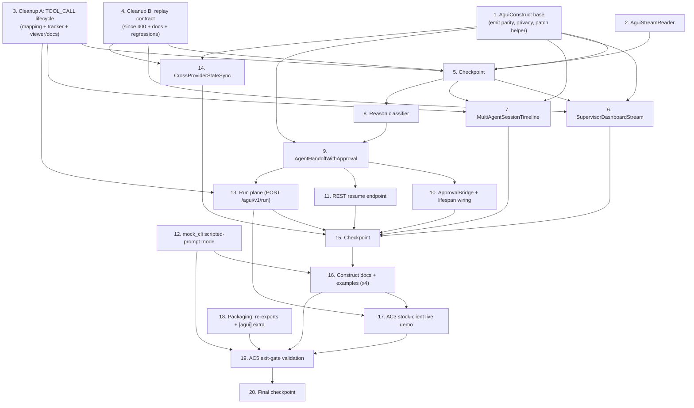

# Implementation Plan: AG-UI L2 Construct Library (Phase 2)

## Overview

This plan implements AG-UI Phase 2 (awslabs/cli-agent-orchestrator #458) as revised by
the grounding audit (`audit.md`): four subclassable **L2 constructs** over the merged
L1 surface, the **L1 cleanups** (completed `TOOL_CALL_*` lifecycle; replay-contract
hardening/documentation), and the **protocol-faithful run plane** that the stock-client
demo (AC3) and the ag-ui interrupt lifecycle (AC5) both require. All implementation is
Python (matching the codebase); property tests use Hypothesis (already a dev
dependency); unit/integration tests use pytest.

Sequencing is test-first and dependency-ordered: the base seams and both L1 cleanups
come first (`MultiAgentSessionTimeline` needs the completed tool-call lifecycle;
`SupervisorDashboardStream`/`CrossProviderStateSync` need the pinned replay contract),
then the constructs, then the approval stack (classifier → construct → bridge → REST
route → run plane), then examples, the AC3 demo, and the AC5 exit gate.

New L2 code: `src/cli_agent_orchestrator/services/agui/`. L1 cleanups touch only
`services/agui_stream.py`, `api/main.py`, `docs/agui.md`, and the bundled EventSource
viewer. Examples follow `examples/agui-*/` `run.sh`/`showcase.sh`. Tests:
`test/services/agui/` and `test/api/`.

### Correctness properties covered (from design)

- **P1** Interrupt round-trip / idempotent resume
- **P2** Reason totality and well-formedness
- **P3** Ordered-fold state convergence across providers
- **P4** Reconnect dedup idempotency (Seen_Set_Dedup)
- **P5** Privacy boundary preserved through L2
- **P6** Tool-call lifecycle well-formedness
- **P7** Emit refusal parity with `emit_ui`
- **P8** Subclass substitutability / totality
- **P9** Run-plane lifecycle legality (stock verifier rules)

## Task Dependency Graph

## Tasks

- [ ] 1. Establish the `AguiConstruct` base with read/write seams, emit parity, and privacy boundary
  - [ ] 1.1 Create `services/agui/` with `base.py`: `AguiConstruct(ABC)` (`handle_frame(agui_type, data, event_id=None)`, `projection()`, concrete `emit(...)`, static `assert_no_body`), total `handle_frame` contract (unknown type → unchanged projection, no raise), JSON-serializable `projection()`; no FastAPI/SseBus imports; plus `apply_json_patch_strict(doc, ops)` (pure, copy-then-apply, `None` on any failure; supports add/remove/replace)
    - _Requirements: 1.1, 1.2, 1.3, 1.4, 1.5_
  - [ ] 1.2 Implement emit validation parity: refuse off-allow-list / non-serializable / >8192-byte props with `ValueError` before any transport, sourcing `GENERATIVE_UI_COMPONENTS` and the size cap from `services/agui_stream` (no duplicated set); `props` never mutated; `assert_no_body` raises on message-body fields
    - _Requirements: 2.1, 2.2, 2.3, 2.4, 2.5, 2.6, 3.1, 3.2, 3.4, 3.5_
  - [ ] 1.3 Implement the emitter family: `InProcessUiEmitter` (event-log append + bus publish, refuses while `agui_surface_enabled()` is false), `HttpUiEmitter` (POST `/agui/v1/emit_ui`, HTTP 400 → `ValueError`), `RecordingUiEmitter` (records intents, publishes nothing); `AguiConstruct.__init__(*, emitter=None)` defaults sensibly
    - _Requirements: 1.7, 1.8, 1.9_
  - [ ]* 1.4 Property tests: emit refusal parity incl. exact 8192-byte boundary and props-unmutated (**P7**; validates 2.1–2.5); subclass totality/serializability with fuzzed frames (**P8**; validates 1.3, 1.4); privacy at the base seam (**P5**; validates 3.1, 3.2, 3.4, 3.5)
  - [ ]* 1.5 Unit tests: allow-list boundary examples, emitter selection, recording emitter capture, surface-disabled refusal
    - _Requirements: 1.7, 1.9, 2.1_

- [ ] 2. Implement `AguiStreamReader` (the one sanctioned wire reader)
  - [ ] 2.1 `services/agui/stream_reader.py`: `requests`-based SSE reader for the ambient stream parsing `id:`/`event:`/`data:` frames into `(event_id, agui_type, data)`; constructor `since=`/`access_token=`; sends `Last-Event-ID` on `reconnect()`; exposes `last_event_id`; bounded line buffering; no new runtime dependencies
    - _Requirements: 1.5, 1.6_
  - [ ]* 2.2 Unit tests over a fake SSE transport: frame parsing, id-less state frames, cursor propagation, reconnect resume, malformed-line tolerance
    - _Requirements: 1.6_

- [ ] 3. L1 Cleanup A — complete the `TOOL_CALL_*` lifecycle (aligns code with the published `docs/agui.md` table)
  - [ ] 3.1 In `services/agui_stream.py`: map kind `handoff` with `orchestration_type ∈ {handoff, assign}` → `TOOL_CALL_START` (`tool_call_id` = record id, `tool_call_name` = orchestration type, metadata-only sender/receiver); keep `send_message`/absent → `TEXT_MESSAGE_CONTENT` byte-identical; keep `a2a_delegation` → `TOOL_CALL_START` (forward-provisioned)
    - _Requirements: 6.1, 6.2, 6.7_
  - [ ] 3.2 Add `ToolCallLifecycleTracker`: receiver→open-call correlation; synthesize exactly one `TOOL_CALL_END` on the receiver's completion record or session end (metadata-only disposition incl. failure indication where derivable); one metadata-only `TOOL_CALL_RESULT` for `a2a_delegation` opens; no orphan closers; bounded map with oldest-first eviction; deterministic under replay; thread it through the `/agui/v1/stream` generator
    - _Requirements: 6.3, 6.4, 6.5, 6.6_
  - [ ] 3.3 Update `docs/agui.md` mapping table and the EventSource viewer example for the corrected handoff mapping in the same change
    - _Requirements: 6.7_
  - [ ]* 3.4 Property test: lifecycle well-formedness over generated record sequences — closers ⊆ opens, ≤1 END per id, replay determinism (**P6**; validates 6.3, 6.5, 6.6)
  - [ ]* 3.5 Unit tests: orchestration-type discrimination, session-end closure, orphan suppression, eviction disposition, metadata-only assertions, byte-identical non-orchestration mappings
    - _Requirements: 6.1, 6.2, 6.5, 6.7_

- [ ] 4. L1 Cleanup B — replay-contract hardening and documentation
  - [ ] 4.1 In `api/main.py`: validate `?since=` as ISO-8601 **before** streaming (malformed → HTTP 400); leave replay/live behavior otherwise unchanged
    - _Requirements: 7.2_
  - [ ] 4.2 Document the contract in `docs/agui.md`: `?since=` (ISO-8601 exclusive) vs `Last-Event-ID` (uuid cursor) semantics and precedence, over-delivery on evicted/unknown cursor, Seen_Set_Dedup (uuid membership — never ordering), `id:` on event frames only, state channel per-connection (snapshot-then-deltas, no dedup needed), and CAO-extension status (no stock SDK implements stream resumption)
    - _Requirements: 7.1, 7.3, 7.4, 7.6_
  - [ ]* 4.3 Regression/unit tests: malformed-`since` 400; `since` precedence on the AG-UI path; snapshot-before-delta on reconnect; evicted-cursor over-delivery folded clean by a Seen_Set consumer (**P4**; validates 7.2, 7.3, 7.4, 7.5)

- [ ] 5. Checkpoint — base, reader, and both L1 cleanups
  - Ensure all tests pass, ask the user if questions arise.

- [ ] 6. Implement `SupervisorDashboardStream`
  - [ ] 6.1 `services/agui/supervisor_dashboard.py`: snapshot deep-copy replace; strict delta apply-else-drop (pre-baseline or failed apply → unchanged, no raise); Seen_Set_Dedup on id-bearing frames; `hierarchy()` and `supervisor_snapshot()` (active sessions, counts, `by_provider` over **all** observed providers, `waiting_terminals`, `last_activity {timestamp, event_id}`) derived solely from folded frames
    - _Requirements: 4.1, 4.2, 4.3, 4.4, 4.5, 4.6, 4.7_
  - [ ]* 6.2 Property tests: ordered-fold convergence on the supervisor projection (**P3**), overlap-replay idempotency (**P4**), privacy of both accessors (**P5**) — validates 4.2, 4.4, 3.1
  - [ ]* 6.3 Unit tests: delta-before-snapshot no-op, failed-patch drop, provider rollup over mixed fleets, waiting-terminal surfacing
    - _Requirements: 4.3, 4.5, 4.6_

- [ ] 7. Implement `MultiAgentSessionTimeline` (depends on Task 3)
  - [ ] 7.1 `services/agui/session_timeline.py`: frozen `TimelineEntry`; fold `TOOL_CALL_START` (open, keyed by `tool_call_id`; duplicate id → no-op), `TOOL_CALL_END`/`TOOL_CALL_RESULT` (close matching open entry → completed/failed; unknown id → no-op), `TEXT_MESSAGE_CONTENT` with routing metadata (message entry; `delta` never stored); arrival-order append with `(started_at, id)` display tiebreak; Seen_Set_Dedup; retention cap (default 1,000, constructor-configurable) evicting oldest
    - _Requirements: 5.1, 5.2, 5.3, 5.4, 5.5, 5.6, 5.7, 5.8_
  - [ ]* 7.2 Property tests: timeline well-formedness — `completed+failed ≤ opened`, no close-before-open (**P6**); no delta storage (**P5**) — validates 5.3, 5.7
  - [ ]* 7.3 Unit tests: ordering tiebreak, unknown-closer/duplicate-start no-ops, failure disposition, cap eviction boundary
    - _Requirements: 5.4, 5.5, 5.6, 5.8_

- [ ] 8. Implement the reason classifier
  - [ ] 8.1 In `services/agui/handoff_approval.py`: total, deterministic `classify_reason(provider, raw_prompt)` → `<namespace>:<local_name>`; namespace map `kiro_cli→kiro`, `claude_code→claude-code`, `codex→codex`, kebab-case fallback, never `core:`; closed per-provider local-name sets (`claude-code:{permission_request,trust_prompt}`, `kiro:{permission_request,trust_prompt}`, `codex:{approval_request,trust_prompt}`) derived from the providers' existing detection patterns; `{ns}:unknown_prompt` default; never raises
    - _Requirements: 8.1, 8.2, 8.3, 8.4, 8.5, 8.6, 8.7, 8.8_
  - [ ]* 8.2 Property test: totality/shape/determinism over arbitrary strings incl. empty (**P2**; validates 8.1, 8.3)
  - [ ]* 8.3 Unit tests: real prompt fixtures per provider → expected reasons; closed-set enforcement; kebab-case namespaces for other providers
    - _Requirements: 8.2, 8.4, 8.5, 8.6, 8.7, 8.8_

- [ ] 9. Implement `AgentHandoffWithApproval` (depends on Tasks 1, 8)
  - [ ] 9.1 In `handoff_approval.py`: `ApprovalDecision`, `Interrupt` (aligned to ag-ui's shape: fresh uuid id, reason, ≤256-char redacted `message`, `metadata {provider, terminal_id, session_name, source_event_id}`, `options`, `expires_at?`), and the construct: `on_provider_waiting` (classify → open interrupt → exactly one `approval_card` intent), `resume` (lock-guarded single resolution; per-provider answer translation over the existing `/terminals/{id}/input` + `/key` paths; `edit` requires non-empty text ≤4,000 chars; unsupported decision for the prompt category → validation error, stays open; already-resolved → recorded outcome, zero re-sends; delivery failure after resolution recorded, never raised to the stream), `expire(terminal_id)` (outcome `expired`, **zero keystrokes**, one expiration intent), `pending()`; registry bounds (evict resolved/expired ≤300 s; cap 1,000 oldest-resolved-first)
    - _Requirements: 9.2, 9.3, 9.4, 9.5, 9.6, 9.7, 9.8, 9.9_
  - [ ]* 9.2 Property test: interrupt round-trip + idempotent resume incl. resume/expiry races (**P1**; validates 9.4, 9.7, 9.8)
  - [ ]* 9.3 Unit tests: per-provider keystroke translation tables, edit validation (missing/empty/4,001 chars), unsupported-decision rejection, 256-char redaction, registry TTL/cap eviction
    - _Requirements: 9.3, 9.5, 9.6, 9.9_

- [ ] 10. Implement `ApprovalBridge` and lifespan wiring (depends on Task 9)
  - [ ] 10.1 `services/agui/approval_bridge.py`: internal-EventBus subscriber on `terminal.*.status` (InboxService consumer precedent); on `→ WAITING_USER_ANSWER` capture prompt tail + provider from the terminal record and call `on_provider_waiting`; on leaving the status with the interrupt open call `expire`; runs only while `agui_surface_enabled()`; register/stop in the FastAPI lifespan beside the existing consumers; app-scoped registry shared with the routes
    - _Requirements: 9.1, 9.8_
  - [ ]* 10.2 Integration tests with synthetic status transitions: open-on-waiting, expire-on-leave, no-op while surface disabled, restart safety
    - _Requirements: 9.1, 9.8_

- [ ] 11. Add the REST resume endpoint (depends on Task 9)
  - [ ] 11.1 `POST /agui/v1/interrupts/{id}/resume` in `api/main.py` (flat `@app.post`, repo convention): surface gate 404 → scope `cao:write`/`cao:admin` → decision validation 422 → unknown id 404 → route to `resume` exactly once; idempotent replay returns the recorded outcome
    - _Requirements: 10.1, 10.2, 10.3, 10.4, 10.5_
  - [ ]* 11.2 Integration tests: full guard matrix, exactly-once routing, interrupt unchanged on every rejection
    - _Requirements: 10.1, 10.2, 10.3, 10.4, 10.5_

- [ ] 12. Extend `mock_cli` with a scripted-prompt mode (CI enabler)
  - [ ] 12.1 Env-gated behavior in `providers/mock_cli.py`: a scripted marker drives `get_status` → `WAITING_USER_ANSWER` with a deterministic prompt text; a delivered answer clears it; default behavior unchanged (today mock_cli never returns that status)
    - _Requirements: 15.2, 14.2_
  - [ ]* 12.2 Unit tests: status transition round-trip, default-off unchanged
    - _Requirements: 15.2_

- [ ] 13. Implement the run plane `POST /agui/v1/run` (depends on Tasks 3, 9)
  - [ ] 13.1 Add the `[agui]` optional extra (`ag-ui-protocol`, version-pinned to a release carrying `RunFinishedEvent.outcome`/`RunAgentInput.resume`) and `services/agui/run_plane.py`: parse `RunAgentInput` (camelCase), stream via the official `EventEncoder` (`data:`-only frames); projection `RUN_STARTED` (echo threadId/runId) → `STATE_SNAPSHOT` → lifecycle-legal live translation (`STATE_DELTA`, `STEP_*`, complete `TOOL_CALL_*` from the tracker, `CUSTOM cao.generative_ui` / `cao.message_delivery` / `cao.raw`); 501 + install hint when the extra is missing
    - _Requirements: 12.1, 12.3, 12.7_
  - [ ] 13.2 Interrupt integration: on open interrupts emit `STATE_SNAPSHOT` then `RUN_FINISHED outcome={type:"interrupt", interrupts:[...]}` (camelCase Interrupt shape incl. `responseSchema` for approve-with-edits) and close; on `resume[]` map payloads (`{approved:true}`→approve, `{approved:false}`/`cancelled`→deny, `editedArgs`→edit) through the same idempotent registry; uncovered/expired open interrupts → `RUN_ERROR`; gating/auth: same 404 gate, `cao:read` floor, `cao:write` when `resume[]` non-empty
    - _Requirements: 12.2, 12.4, 12.5, 12.6_
  - [ ]* 13.3 Integration tests: RunAgentInput parsing, encoder framing (data:-only camelCase with `type`), lifecycle-legality assertions over recorded streams (**P9**), interrupt outcome + resume round-trip via the run plane, coverage/expiry `RUN_ERROR`, scope floor for `resume[]`, 501-without-extra
    - _Requirements: 12.1–12.7_

- [ ] 14. Implement `CrossProviderStateSync` (depends on Tasks 1, 4)
  - [ ] 14.1 `services/agui/cross_provider_sync.py`: snapshot deep-copy replace; strict apply-else-drop deltas; Seen_Set_Dedup; `shared_state()`, `providers_seen()` (from snapshot terminals' `provider`), `converges_with(authoritative_snapshot)` (deep-equal)
    - _Requirements: 11.1, 11.2, 11.3, 11.4, 11.6, 11.7_
  - [ ]* 14.2 Property tests: ordered-fold convergence vs `build_dashboard_snapshot` over generated fleets/mutations with provider mixes (**P3**) + overlap-replay idempotency (**P4**) — validates 11.4, 11.5
  - [ ]* 14.3 Integration test: fixture fleet spanning `kiro_cli`, `claude_code`, `codex` → `converges_with(...)` true with all three in `providers_seen()`
    - _Requirements: 11.5, 11.7_

- [ ] 15. Checkpoint — all four constructs + approval stack + run plane
  - Ensure all tests pass, ask the user if questions arise.

- [ ] 16. Author documentation and one runnable example per construct (depends on Tasks 12, 15)
  - [ ] 16.1 `examples/agui-supervisor-dashboard/` + docs (frames folded, accessors, reader→construct→emitter composition; credentials-free via `mock_cli`; non-zero exit + no orphaned server on unmet preconditions)
    - _Requirements: 14.1, 14.2, 14.3, 14.5_
  - [ ] 16.2 `examples/agui-session-timeline/` + docs (same conventions)
    - _Requirements: 14.1, 14.2, 14.3, 14.5_
  - [ ] 16.3 `examples/agui-handoff-approval/` + docs: CI-path demo over `mock_cli` scripted prompts (browser-equivalent client → REST resume), **plus** the documented live real-provider procedure (approval-mode claude_code profile with provider-default `permissionMode` so a genuine permission prompt occurs)
    - _Requirements: 14.1, 14.2, 14.3, 14.4, 14.5_
  - [ ] 16.4 `examples/agui-cross-provider-sync/` + docs (same conventions)
    - _Requirements: 14.1, 14.2, 14.3, 14.5_
  - [ ] 16.5 Update `docs/agui.md` with the two-plane model (ambient dialect vs stock run plane) and links to construct docs
    - _Requirements: 14.1_

- [ ] 17. AC3 stock-client zero-adapter live demo (depends on Tasks 13, 16)
  - [ ] 17.1 `examples/agui-stock-client-live/`: `run.sh` boots `cao-server` (`CAO_AGUI_ENABLED=1`, `mock_cli` fleet driver), waits ≤30 s for readiness, runs a pinned upstream stock client (`@ag-ui/client` HttpAgent / minimal CopilotKit page — zero CAO wire code) against `POST /agui/v1/run`, asserts ≥1 frame rendered from post-connect server activity; non-zero exit + cleanup on failure
    - _Requirements: 13.1, 13.2, 13.3, 13.4_
  - [ ]* 17.2 CI smoke test following the existing example-recorder harness pattern
    - _Requirements: 13.1, 13.3_

- [ ] 18. Packaging: re-exports and the `[agui]` extra
  - Update `services/agui/__init__.py` to re-export `AguiConstruct`, `AguiStreamReader`, the emitters, all four constructs, `ApprovalDecision`, `Interrupt`, `TimelineEntry`, `classify_reason`; finalize the pinned `[agui]` extra in `pyproject.toml`; no orphaned construct code
    - _Requirements: 1.1, 1.2, 12.7_

- [ ] 19. Validate the AC5 exit gate (depends on Tasks 12, 16, 17, 18)
  - [ ] 19.1 Automated gate test asserting: four constructs each have docs + a runnable example; approve **and** deny land exactly once on a live `mock_cli` scripted prompt via **both** the REST resume route and the run-plane `resume[]`; `converges_with(...)` true across `kiro_cli`/`claude_code`/`codex`; the AC3 run-plane stream passes stock verification; report the failing condition on any miss
    - _Requirements: 15.1, 15.2, 15.4, 15.5, 15.6_
  - [ ] 19.2 Record the live real-provider evidence (approval-mode profile procedure run once, documented with capture) and link it from the approval example docs
    - _Requirements: 15.3_

- [ ] 20. Final checkpoint
  - Ensure all tests pass, ask the user if questions arise.

## Notes

- Tasks marked `*` are test sub-tasks that can be deferred for a faster MVP; core
  implementation sub-tasks are never optional.
- Every task cites the requirement clauses it satisfies; property sub-tasks name the
  design property (P1–P9) they validate.
- Sequencing rationale: Cleanup A precedes the timeline (it consumes the completed
  lifecycle); Cleanup B precedes the state-folding constructs (they rely on the pinned
  replay contract); the classifier precedes the approval construct; the approval
  construct precedes the bridge, the REST route, and the run plane (all three share
  its registry); `mock_cli`'s scripted-prompt mode precedes the examples and the exit
  gate (credentials-free CI evidence).
- All work is code-only (implementation, tests, docs, runnable examples); the single
  manual step is the recorded live real-provider approval (Task 19.2), which is
  AC5 evidence, not CI.
