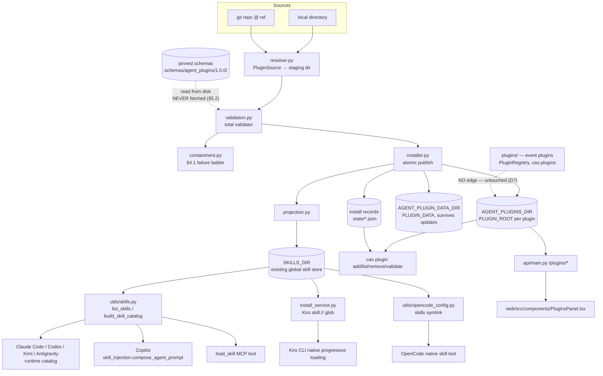
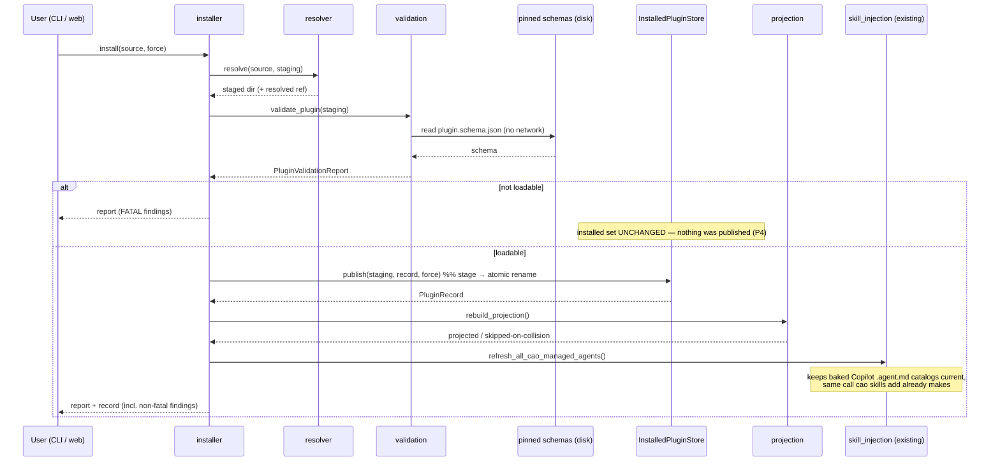
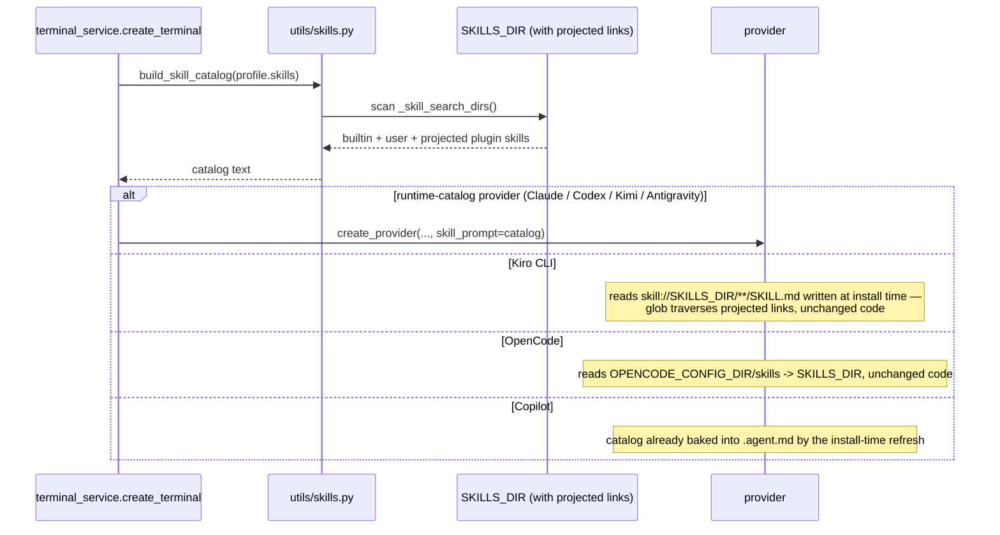
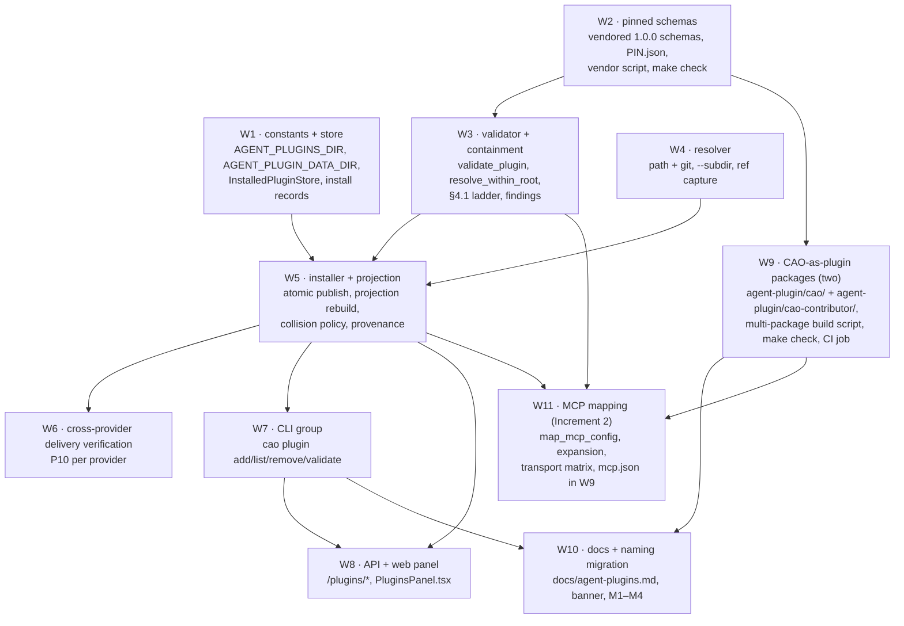

# Design Document: cao-agent-plugins

> **Provenance and re-check anchor.**
> **Issue of record:** [awslabs/cli-agent-orchestrator#573](https://github.com/awslabs/cli-agent-orchestrator/issues/573) — "[Feat] Agent Plugins 1.0 support — package the CAO ecosystem as portable plugins + a plugin install/marketplace surface" (labels `enhancement`, `feature`).
> **Audited against:** issue state `open`, `updated_at` `2026-08-07T22:43:28Z`, comment count `1`, latest comment id `5222928849` (author `plauzy`).
> **Re-check requirement:** the issue body **and all comments** must be re-read before each iteration of this spec. Maintainer input has been requested from @haofeif and @fanhongy on **M1**–**M4**; their replies may change those decisions or the alignment items below, and this design must be re-diffed against the issue rather than assumed current. Compare against the anchor above to determine cheaply whether anything moved.

## Overview

This feature makes CAO (CLI Agent Orchestrator) a participant in the [Agent Plugins 1.0.0](https://agent-plugins.org/specification) open specification on **both sides of the contract**.

**Author side.** CAO packages *itself* as conformant Agent Plugins — a `plugin.json` manifest, a `skills/` tree carrying the CAO orchestration skills, and (Increment 2) an `mcp.json` entry for the **ops** MCP server (`cao-ops-mcp-server`). Any Agent-Plugins-compatible client (Kiro powers, VS Code, Cursor, Copilot, Codex) can install that package and drive a real CAO session without CAO-specific integration code. A **second, contributor-facing package** carries the skills for extending CAO itself.

**Client side.** CAO *consumes* Agent Plugins through a deliberately thin **resolve → validate → install → deliver** pipeline. Plugin-provided skills are delivered to every CAO provider through the skill-delivery machinery CAO already has (`utils/skills.py`, `utils/skill_injection.py`, `services/install_service.py`), surfaced through a `cao plugin` CLI group and a web-UI installed-plugins panel.

The two sides share exactly one asset: the pinned canonical schemas used to validate manifests. Everything else is independent, which is what lets the work split across parallel workstreams.

## Goals

1. CAO is a **conformant client** under [§11.1](https://agent-plugins.org/specification) — loads a plugin from a directory, validates the closed `plugin.json` against a locally pinned schema, discovers components at fixed locations, and supports at least one component type.
2. CAO ships **conformant packages** of itself — an operator-facing one a foreign client can install to drive a CAO session, and a contributor-facing one for extending CAO — that validate and install through the same pipeline.
3. Plugin-provided skills reach **every** CAO provider through the delivery mechanism each provider already uses — no new per-provider skill pathway.
4. An invalid plugin, or an invalid component inside an otherwise valid plugin, is **skipped with a report** and never degrades a running session or another plugin.

## Non-Goals

These are deliberate deferrals, not oversights.

| Non-goal | Rationale |
|---|---|
| Trust model, signing, provenance verification, permission declarations | Deferred by the spec itself in [`FUTURE_CONSIDERATIONS.md`](https://github.com/agentplugins/agent-plugins-spec/blob/main/FUTURE_CONSIDERATIONS.md). **CAO inherits that deferral rather than inventing its own.** |
| A plugin registry, marketplace index, or search/discovery service | Same deferral. The surface is resolve → validate → install and nothing more (decision **D2**). |
| Dependency resolution between plugins | Deferred by the spec. No `dependencies` field exists in v1. |
| Secret injection for plugin MCP servers | The spec forbids secrets in `env`/`headers` and defines no portable credential mechanism. CAO's existing `services/secret_gate.py` and `cao env` remain the only path. |
| Enterprise allow/block policy, audit-event schema for plugin lifecycle | Deferred by the spec. CAO's `services/audit_log.py` may record installs, but no new portable schema is defined. |
| Changing, wrapping, or deprecating CAO's existing **event-plugin** system | Explicitly out of scope (decision **D7**). See [Naming and Namespacing](#naming-and-namespacing). |
| Component types beyond skills and MCP servers (hooks, agents, commands, LSP) | Outside the v1 format ([§7](https://agent-plugins.org/specification)). CAO must ignore them, not interpret them. |

Because CAO has no trust model here, the security posture is stated plainly in [Security Considerations](#security-considerations): **installing an Agent Plugin is equivalent to running untrusted code from that source.**

## Naming and Namespacing

> **This section gates every public surface in the feature.** Four items need a maintainer decision before any user-visible name lands. They are marked **M1**–**M4**.

CAO already ships an unrelated **event-plugin** system. It must be left untouched:

| Existing artifact | Path / identifier | Status |
|---|---|---|
| Event-plugin base + registry | `src/cli_agent_orchestrator/plugins/{base,events,registry}.py`, class `PluginRegistry` | **Untouched** |
| Event dispatch | `src/cli_agent_orchestrator/services/plugin_dispatch.py` | **Untouched** |
| Entry-point group | `cao.plugins` | **Untouched** |
| Built-in event plugins | `src/cli_agent_orchestrator/plugins/builtin/` | **Untouched** |
| Example event plugin | `examples/plugins/cao-discord/` | **Untouched** |
| Docs | `docs/plugins.md` | Disambiguation banner only |
| Authoring skill | `skills/cao-plugin/` (+ mirror in `src/cli_agent_orchestrator/skills/cao-plugin/`) | See **M4** |

### Module placement (decided)

New code lives in a **sibling** package, not under the existing one:

```
src/cli_agent_orchestrator/agent_plugins/
├── __init__.py          # public surface: load/validate/install/list/remove
├── models.py            # PluginManifest, McpConfig, PluginRecord, findings
├── validation.py        # total validator over a directory
├── containment.py       # plugin-root path containment (§4.1 failure ladder)
├── resolver.py          # PluginSource -> staged local directory
├── installer.py         # stage -> validate -> atomic publish -> project
├── store.py             # installed-set state, install records
├── projection.py        # skill delivery bridge into SKILLS_DIR
├── provenance.py        # skill name -> owning plugin (read-only lookup)
└── mcp_mapping.py       # Increment 2: mcp.json -> CAO mcpServers + expansion
```

`agent_plugins/` is **not** nested under `plugins/`. Nesting would make `from cli_agent_orchestrator.plugins import ...` ambiguous at the import site — the single highest-value disambiguation available — and would imply the new system is subordinate to the event-plugin system, which it is not.

**Type names must not collide.** `PluginRegistry` is taken by the event-plugin system and is reused as a *parameter type* across `services/terminal_service.py` and `api/main.py`. New types therefore avoid the bare word "Registry": `InstalledPluginStore`, `PluginManifest`, `PluginValidationReport`, `PluginRecord`, `PluginSource`.

### CLI verb collision (**M1** — blocking)

`cao plugin` is unoccupied today (`cli/main.py` registers `skills`, `profile`, `session`, …, no `plugin`). But `docs/plugins.md` **publicly promises** `cao plugin list / info / enable / disable / reload` as a future surface for *event* plugins. Taking `cao plugin` for agent plugins retracts that promise.

| Option | Agent plugins | Event plugins | Assessment |
|---|---|---|---|
| **A (recommended)** | `cao plugin add\|list\|remove\|validate` | `cao event-plugin …` (future), docs promise rewritten | The open-spec noun is what users arrive with from other clients; the ergonomic name should go to the portable concept. Cost: edits a documented future surface. |
| B | `cao agent-plugin …` | `cao plugin …` (future) | Zero retraction, but every doc/tutorial for the portable feature carries a nine-character prefix, and users coming from other clients guess wrong first. |
| C | `cao plugin add\|list\|remove` + `cao plugin runtime …` for event plugins | nested | One noun, two meanings — worst outcome for comprehension. Rejected. |

**Recommendation: A.** Requires maintainer sign-off because it changes a documented roadmap surface.

### Extension namespace (**M2** — blocking)

[§8](https://agent-plugins.org/specification) requires client-specific manifest data under a reverse-domain namespace and client-specific files under a top-level directory of exactly that name. The moment a third-party plugin ships `extensions: { "<cao-namespace>": {...} }`, that string is **permanent public API** — §8 says a client "SHOULD keep the namespace stable."

Candidates: `com.amazonaws.cao`, `io.github.awslabs.cli-agent-orchestrator`, `io.github.awslabs.cao`.

Increment 1 **implements no extension namespace at all** — CAO reads no `extensions` member and no extension directory, and per §8.1 ignores every namespace without validating its contents. That is fully conformant and defers M2 without blocking delivery. M2 must be resolved before CAO reads or documents *any* extension data.

### Docs vocabulary (**M3**)

- `docs/plugins.md` keeps its path (inbound links, `scripts/validate_markdown_links.py`) and gains an H1 change to **"Event Plugins"** plus a banner distinguishing it from agent plugins. Renaming the file is rejected: it breaks external links for no comprehension gain a banner cannot provide.
- New `docs/agent-plugins.md` covers the portable feature. It must state, in addition to the untrusted-content warning: the **`uv`** prerequisite, the **`cao-server` on `http://127.0.0.1:9889`** prerequisite, the **localhost-only** posture, and the two-package split (which package an operator wants vs. which a contributor wants). See [Package prerequisites](#package-prerequisites-stated-in-the-manifest-and-the-docs).
- `docs/skills.md` gains a section on plugin-provided skills and points at the projection behavior.
- Repo-wide vocabulary rule, enforced by review: **"event plugin"** and **"agent plugin"** are always qualified; bare "plugin" is only acceptable inside a document whose title already scopes it.

### The `cao-plugin` skill (**M4**)

`skills/cao-plugin/SKILL.md` describes authoring an *event* plugin, and its `description` — "add a plugin that reacts to CAO lifecycle or messaging events" — will now compete for activation against agent-plugin requests. Two changes are needed:

1. Rename to `cao-event-plugin`, updating the `SHIPPED_SKILLS` allowlist in `scripts/sync_skills.py` and the package mirror.
2. **Renaming a shipped skill is not currently migratable.** `seed_default_skills()` in `cli/commands/init.py` skips a destination that already exists and never removes one, so an upgraded installation would keep a stale `cao-plugin/` folder alongside the new `cao-event-plugin/` — two skills with near-identical descriptions in every agent's catalog. A rename therefore requires a one-shot retirement step in seeding (remove-if-unmodified, or a recorded rename map).

A new `cao-agent-plugin` authoring skill is **out of scope** here; the ecosystem's `migrate-agent-plugin` skill already covers authoring, and CAO dogfoods it (**D4**).

## Increment Boundary

[§11.2](https://agent-plugins.org/specification) establishes that a skills-only client is conformant. Decision **D3** takes that literally, and the boundary is a hard line, not a preference:

```mermaid
graph LR
    subgraph I1["Increment 1 — skills only (conformant on its own)"]
        A1[constants + store layout]
        A2[pinned schemas + CI drift guard]
        A3[validator]
        A4[resolver]
        A5[installer + projection]
        A6[cao plugin CLI]
        A7[API + web panel]
        A8[CAO-as-plugin package]
    end
    subgraph I2["Increment 2 — MCP servers"]
        B1[mcp.json schema validation]
        B2[PLUGIN_ROOT / PLUGIN_DATA expansion]
        B3[per-provider MCP mapping]
        B4[transport capability matrix]
        B5[mcp.json in CAO's own package]
    end
    I1 --> I2
```



**Increment 1 must be shippable and conformant with `mcp.json` support entirely absent.** Concretely, the following are Increment 2 only and must not appear in Increment 1 code: `mcp_mapping.py`, any reference to `${PLUGIN_ROOT}`/`${PLUGIN_DATA}`, any subprocess launch on behalf of a plugin, and the `mcp.schema.json` validation path. Increment 1 detects `mcp.json`, records `mcp_present: true` with an "MCP not supported in this CAO version" finding, and moves on — which is exactly what [§11.3](https://agent-plugins.org/specification) rule 1 and §7.2.2 rule 4 prescribe for an unsupported component type.

The observable test of the boundary: **the Increment 1 test suite contains no test that launches a plugin subprocess**, and CAO's own package ships no `mcp.json` until Increment 2.

The boundary has a consequence worth stating where it cannot be missed: **Increment 1 is conformant and shippable, but it does not close #573.** Because CAO's package ships no `mcp.json` in Increment 1, the acceptance criterion requiring `cao-ops` tools to be callable in ≥2 clients cannot be satisfied there — see [AC2 in the coverage map](#coverage-of-573s-acceptance-criteria). Holding the boundary and closing the issue are separate things.

## Architecture



The single most consequential architectural choice is the dashed-to-solid path on the right: **plugin skills are projected into the existing `SKILLS_DIR` rather than given a new delivery pathway.** That choice is justified in [Skill Delivery](#7-skill-delivery-the-critical-seam).

## Components and Interfaces

### 1. Store and paths

**Purpose**: own the on-disk layout, including the `PLUGIN_DATA` guarantee from [§9.1](https://agent-plugins.org/specification).

New constants in `src/cli_agent_orchestrator/constants.py`, following the existing `CAO_HOME_DIR` derivation and `0o700` convention used for `TERMINAL_LOG_DIR` / `FIFO_DIR`:

```python
# Installed Agent Plugins. Each child directory is one plugin's PLUGIN_ROOT.
AGENT_PLUGINS_DIR = CAO_HOME_DIR / "agent-plugins"

# Per-plugin PLUGIN_DATA (§9.1). Deliberately OUTSIDE AGENT_PLUGINS_DIR so an
# update that replaces package bytes cannot destroy persistent plugin state —
# §9.1 requires contents be preserved across plugin updates.
AGENT_PLUGIN_DATA_DIR = CAO_HOME_DIR / "agent-plugin-data"
```

Layout:

```text
~/.aws/cli-agent-orchestrator/
├── agent-plugins/
│   ├── <plugin-name>/              # PLUGIN_ROOT — exact package bytes, never mutated by CAO
│   └── .state/<plugin-name>.json   # install record (CAO-owned, never inside a PLUGIN_ROOT)
├── agent-plugin-data/<plugin-name>/ # PLUGIN_DATA — created before any subprocess, survives updates
└── skills/                          # existing SKILLS_DIR — projection target
```

`.state/` is a dot-prefixed sibling so it is never mistaken for a plugin: `list_installed()` skips names beginning with `.`, matching the existing convention in `seed_default_skills()` which stages under `.<name>.` temp dirs inside `SKILLS_DIR`.

**Interface**:

```python
class InstalledPluginStore:
    def list_installed(self) -> list[PluginRecord]: ...
    def get(self, name: str) -> PluginRecord | None: ...
    def plugin_root(self, name: str) -> Path: ...
    def plugin_data_dir(self, name: str, *, create: bool = False) -> Path: ...
    def publish(self, staged: Path, record: PluginRecord, *, force: bool) -> PluginRecord: ...
    def unpublish(self, name: str, *, purge_data: bool) -> None: ...
```

`publish()` uses the **stage-then-rename** pattern already proven in `seed_default_skills()` (`TemporaryDirectory(prefix=".<name>.", dir=...)` + `Path.rename`), and reuses its `errno.EEXIST/ENOTEMPTY` handling. This is what makes install atomic and is the mechanism behind correctness property **P4** (isolation).

`unpublish(purge_data=False)` is the default: §9.1 says the client *MAY* delete `PLUGIN_DATA` on uninstall. Retaining it by default makes `remove` non-destructive; `cao plugin remove --purge-data` opts in. This makes the idempotence property (**P5**) precise rather than ambiguous.

### 2. Validator

**Purpose**: decide, for an arbitrary directory, whether it is a loadable plugin and what its components are — **without ever raising**.

```python
def validate_plugin(root: Path) -> PluginValidationReport: ...
```

**Responsibilities**:

- Select validation rules from the declared `$schema` value. A recognized canonical identifier selects locally pinned rules; an unrecognized one **rejects the plugin** and reports the unsupported version ([§5.2](https://agent-plugins.org/specification)). **No network I/O, ever** — §5.2 forbids retrieving a schema while loading.
- Enforce the **closed** manifest with exactly two non-fatal exceptions (§5.2, §8.1): an unknown top-level field, and a non-object `extensions`. Both are reported and ignored; the plugin still loads. Everything else is fatal.
- Enforce the §5.5 name constraints (length 1–64, `[a-z0-9.-]`, alphanumeric first/last, no `--` or `..`).
- Discover components at fixed locations only (§6.1): `skills/` and `mcp.json`. A missing location is not an error (§6.2); a present location of the wrong filesystem kind invalidates **that component type only**.
- Discover skills as **immediate children** of `skills/` containing a regular `SKILL.md` — no recursive descent (§7.1). Validate each skill independently; an invalid skill is skipped and reported.
- Apply the §4.1 containment ladder via `containment.py`.

**Why the report is a value, not an exception**: the CLI, the API, the web panel, the installer, and CI all need the *same* structured answer, and three of those five must render partial success. A total function returning a report is the only shape that serves all five. This is correctness property **P1**.

Validation uses `jsonschema` (already a runtime dependency, `jsonschema>=4.25`) against **vendored** schema files.

### 3. Schema pinning

**Purpose**: satisfy §5.2's "MUST NOT retrieve a schema while loading" with a verifiable pin.

CAO already has the exact pattern for this in `scripts/vendor_ext_apps_skills.py`: committed `PINNED_REF`/`PINNED_SHA` constants, a refresh mode, a `--check` drift mode that exits non-zero, and `make` targets wired into CI/pre-commit. The new component mirrors it:

```text
src/cli_agent_orchestrator/schemas/agent_plugins/1.0.0/
├── plugin.schema.json     # byte-identical to the canonical published schema
├── mcp.schema.json        # Increment 2 (committed in Increment 1, unused)
└── PIN.json               # source URL, ref, sha256 of each file
scripts/vendor_agent_plugins_schemas.py     # refresh + --check
Makefile: refresh-agent-plugins-schemas / check-agent-plugins-schemas
```

Placing them under the existing `src/cli_agent_orchestrator/schemas/` package (which already holds `agent_profile.schema.json`) means they ship in the wheel via the existing `[tool.hatch.build.targets.wheel] packages` entry with no packaging change.

The validator resolves schemas with `importlib.resources`, mirroring how `seed_default_skills()` reads packaged skills. **A `jsonschema` registry/resolver configured to refuse all remote retrieval is mandatory**, so an unexpected `$ref` cannot silently become a network call — this is asserted directly by correctness property **P11**.

### 4. Resolver

**Purpose**: turn a user-supplied source into a staging directory, and nothing else.

```python
@dataclass(frozen=True)
class PluginSource:
    kind: Literal["path", "git"]
    location: str
    ref: str | None = None          # git only

def resolve(source: PluginSource, dest: Path) -> ResolvedSource: ...
```

Two source kinds, both thin (**D2**):

- `path` — a local directory, **copied** into staging. Copying (not referencing in place) is what makes validation-before-publish meaningful and keeps a live plugin from changing under a running session.
- `git` — `git clone --depth 1 [--branch <ref>]` into staging, recording the resolved commit SHA in the install record. A subdirectory within the repo is addressable, because real-world plugins live in monorepo subdirectories (CAO's own package will).

No name resolution against an index, no version solving, no signature check, no update-checking service. `version` from the manifest is recorded for display and staleness comparison only — the one use [§10.2](https://agent-plugins.org/specification) sanctions.

### 5. Containment

**Purpose**: implement §4.1 exactly, including its **narrowest-applicable-failure-boundary** ladder — which is a correctness requirement, not an implementation detail, because it determines whether one bad path kills the plugin or one component.

```python
def resolve_within_root(root: Path, candidate: Path | str) -> Path | None:
    """Realpath-canonicalize *candidate* and return it only if contained in *root*."""
```

CAO already has `utils/path_validation.py::safe_join_under_base`, which realpath-canonicalizes and applies an explicit containment guard. That helper validates *path components*, which is the wrong shape for §4.1's cases (a `./`-rooted config value, and a symlinked `SKILL.md` discovered by traversal). `containment.py` therefore adds `resolve_within_root` as a sibling using the same realpath-then-guard technique, so the CodeQL taint model and the security review posture carry over unchanged.

Ladder, per §4.1:

| Failing path | Boundary |
|---|---|
| `plugin.json` outside root | reject the plugin |
| fixed component location outside root | that component **type** invalid (§6.2) |
| discovered `SKILL.md` outside root | that **skill** skipped (§7.1) |
| MCP `command` / `cwd` fails containment | that **server entry** invalid (§7.2.2) — Increment 2 |
| any other package path | deny access to that path |

§4.1 explicitly permits symlinks whose targets resolve *within* the root and requires rejecting those that escape — so resolution must be realpath-based, not lexical. This is correctness property **P3**.

### 6. Installer

**Purpose**: sequence resolve → validate → publish → project so that a failure at any step leaves the installed set untouched.

```python
def install(source: PluginSource, *, force: bool = False,
            dry_run: bool = False) -> InstallOutcome: ...
def uninstall(name: str, *, purge_data: bool = False) -> UninstallOutcome: ...
```

Ordering is load-bearing:

1. Resolve into staging.
2. Validate **the staging copy**. If not loadable → return the report, publish nothing.
3. Reject on name collision unless `force` (mirrors `_install_skill_folder`'s `FileExistsError` + `--force` semantics in `cli/commands/skills.py`).
4. Publish atomically (stage → rename).
5. Rebuild the projection (see below).
6. Refresh baked provider artifacts by calling the **existing** `utils/skill_injection.refresh_all_cao_managed_agents()`, exactly as `cli/commands/skills.py::_refresh_installed_agents()` already does after `cao skills add/remove`. Skipping this would leave Copilot `.agent.md` catalogs stale — the one delivery path that is baked at install time rather than read at launch.
7. Write the install record.

`dry_run` performs 1–2 and returns the report. This is what CI and the author-side dogfooding use, and it is also `cao plugin validate`.

#### Removal while a session is live

Removal is not symmetric with install, because **two providers read `SKILL.md` from disk mid-session**: Kiro CLI resolves the `skill://{SKILLS_DIR}/**/SKILL.md` glob written by `services/install_service.py`, and OpenCode reads through the `OPENCODE_CONFIG_DIR/skills` symlink from `utils/opencode_config.py::ensure_skills_symlink`. Neither snapshots content at launch. So unpublishing a plugin root and sweeping its projection can pull a skill out from under an agent that is *currently* mid-task and about to load it — the agent sees a broken reference rather than a clean "that skill is gone."

Two requirements follow:

1. **`cao plugin remove` warns when a live session's profile references a skill this plugin projects.** The check reads the running terminals' profiles (the same session/terminal state `cao session` and `api/main.py` already expose) and intersects their referenced skill names with the plugin's `projected_skill_names` from the install record. On a non-empty intersection the command reports which sessions and which skills are affected and requires confirmation (`--yes` to skip, for scripted use). It **warns**; it does not refuse — the operator may legitimately want the plugin gone, and blocking removal on any live session would make the store un-cleanable while a long session runs.
2. **The dangling-link sweep must be launch-safe.** Sweeping runs on the next projection rebuild and on `cao plugin list`, both of which can be concurrent with `terminal_service.create_terminal`. A dangling projected link must therefore never raise into terminal creation: the sweep unlinks best-effort and logs, and the read paths already tolerate it — `utils/skills.py::list_skills` gates on `item.is_dir()` and `(item / "SKILL.md").is_file()`, and both are `False` (not an exception) for a symlink whose target is gone, so a broken link is simply not enumerated. The requirement is that the sweep itself uses the same never-raise discipline the delivery paths do, including on a link it cannot remove (permissions, Windows copy-mode directory).

Kiro and OpenCode still see one *transient* effect no design can remove: an agent holding a stale glob result may attempt a load that now fails. That is a warning-level, reported outcome, not a correctness violation, and it is exactly what the confirmation prompt in (1) exists to make the operator aware of.

### 7. Skill Delivery (the critical seam)

**This is the highest-risk design decision in the feature; it is stated with its alternatives because it is the one most likely to be revisited.**

CAO delivers skills through **three** independent mechanisms, and only one of them goes through `list_skills()`:

| Mechanism | Code | Providers | Reads from |
|---|---|---|---|
| Runtime catalog | `utils/skills.py::build_skill_catalog`, called at `services/terminal_service.py:378` for `RUNTIME_SKILL_PROMPT_PROVIDERS` | Claude Code, Codex, Kimi, Antigravity | `list_skills()` → `_skill_search_dirs()` |
| Baked catalog | `utils/skill_injection.py::compose_agent_prompt` at install time | Copilot | `list_skills()` |
| Native, filesystem-direct | `services/install_service.py:357` `skill://{SKILLS_DIR}/**/SKILL.md`; `utils/opencode_config.py::ensure_skills_symlink` | Kiro CLI, OpenCode | **`SKILLS_DIR` path literally** |
| On-demand fetch | `mcp_server/server.py::load_skill` → `load_skill_content` | all catalog-based providers | `_resolve_skill()` |

The obvious approach — appending plugin skill roots to `_skill_search_dirs()` alongside `get_extra_skill_dirs()` — covers rows 1, 2 and 4 with a one-function change, but **cannot** cover row 3. Kiro receives exactly one `skill://` glob rooted at `SKILLS_DIR`, and OpenCode's `skills` entry is a single symlink to `SKILLS_DIR`. Plugin skills stored elsewhere are invisible to both.

**Chosen design — projection.** `projection.py` materializes each valid plugin skill as a **managed symlink inside `SKILLS_DIR`**:

```text
SKILLS_DIR/<skill-name>  ->  AGENT_PLUGINS_DIR/<plugin-name>/skills/<skill-name>
```

Consequences:

- **Zero provider changes.** Kiro's existing glob, OpenCode's existing symlink, `list_skills()`, `build_skill_catalog()`, `compose_agent_prompt()`, and `load_skill` all work unmodified. Every already-tested delivery path is inherited, including Kiro's native progressive loading and OpenCode's native skill tool.
- **Name equality is preserved.** `utils/skills.py::_load_skill_folder` raises when the folder name differs from the frontmatter `name`, and the Agent Skills specification requires the same. The link is therefore named with the *unprefixed* skill name — no namespacing prefix is possible without rewriting plugin bytes, which §4.1's "CAO never mutates a PLUGIN_ROOT" posture forbids.
- **`Path.is_dir()` follows symlinks**, so `list_skills()`'s `item.is_dir()` and `(item / "SKILL.md").is_file()` checks succeed through the link with no change.
- **Collisions are refused, never resolved silently.** If `SKILLS_DIR/<skill-name>` already exists as a builtin or user-added skill, projection is skipped and a finding is emitted. The pre-existing skill continues to resolve. This matches both `_install_skill_folder`'s refuse-unless-`--force` behavior and `ensure_skills_symlink`'s explicit posture of never repairing user-owned state at a path it does not own. This is correctness property **P8**.
- **Plugin-vs-plugin collisions need a deterministic winner, and it is not "whoever got there first."** Pre-existing-wins settles plugin-vs-*non-plugin*. When two installed **plugins** each provide a skill named `<name>`, neither is pre-existing from the other's point of view, and projection is derived state rebuilt from scratch — so without an explicit rule the winner would fall out of whatever order the store happened to be iterated in, and could flip between two rebuilds of an unchanged installed set. The rule:

  > Among plugins providing the same skill name, the winner is the one with the **lexicographically smallest plugin name** (byte-wise on the manifest `name`, which §5.5 constrains to `[a-z0-9.-]`). Every loser is skipped with a `SKIPPED` finding naming the winning plugin.

  Plugin `name` is unique across the installed set (install refuses a name collision unless `--force`, which replaces rather than coexists) and is persisted in the install record at `.state/<name>.json`, so the rule is a total order over persisted state — never over directory iteration order, `os.scandir` results, or `mtime`.

  **`installed_at` is deliberately not the key**, even though it is also persisted: it encodes install *order*, so installing A-then-B and B-then-A would elect different winners from the same final installed set, and same-second installs would tie on a timestamp and fall back to iteration order anyway. Ordering on `name` makes the projection a pure function of *which* plugins are installed, independent of *how* they got there.

  **Accepted consequence:** installing a lexicographically-earlier plugin can reassign an existing projection away from a later-named plugin on the next rebuild. That is visible (a finding on each side, and `cao plugin list` shows provenance) and deterministic, which is strictly better than a winner that depends on invisible history. This is asserted by **P8**.
- **Projection is derived state**, rebuilt idempotently from the installed set on every add/remove/update, and swept for dangling links. It is never a source of truth.

Accepted costs, stated honestly:

- Symlink creation on Windows requires Developer Mode or elevation. A **copy-mode fallback** (`skills.projection_mode: "symlink" | "copy"` in `settings.json`, alongside the existing `skills.extra_dirs`) covers that; copy mode re-copies on every projection rebuild, so it is correct but not free.
- Provenance is not visible in the skill folder name. `provenance.py` recovers it by reading install records (`owning_plugin(skill_name) -> str | None`), used by `cao plugin list`, the web panel, and the annotation in `cao skills list`. `SkillMetadata` is **not** extended — it models `SKILL.md` frontmatter and projection is not frontmatter.

Alternatives rejected: **multi-root** (emit one `skill://` glob per plugin for Kiro, restructure OpenCode's `skills` symlink into a directory of symlinks) — requires editing two provider paths and converting a user-owned symlink into a CAO-managed directory, which `ensure_skills_symlink()` deliberately refuses to do. **Extra-dirs registration alone** — leaves Kiro and OpenCode, including CAO's default provider, without plugin skills.

### 8. CLI

New group in `src/cli_agent_orchestrator/cli/commands/agent_plugin.py`, registered in `cli/main.py`, structured as a direct sibling of `cli/commands/skills.py` (same `click.group()` shape, same `raise click.ClickException(str(exc))` error convention, same post-mutation refresh call):

```text
cao plugin add <source> [--ref REF] [--subdir PATH] [--force] [--dry-run]
cao plugin list [--json]
cao plugin remove <name> [--purge-data]
cao plugin validate <path>          # report only, installs nothing
```

`--json` on `list` and `validate` exists because the fleet's `check-goal.sh` predicate and CI need a machine-readable report; human output is a table matching `cao skills list`'s two-column style.

### 9. HTTP API and web panel

`api/main.py` is flat (no routers package), so endpoints are added inline next to the existing `/skills/{name}` and `/settings/skill-dirs` handlers:

| Method | Path | Purpose |
|---|---|---|
| `GET` | `/plugins` | installed set + per-plugin findings + owned skill names |
| `POST` | `/plugins` | install from a source |
| `POST` | `/plugins/validate` | validate without installing |
| `DELETE` | `/plugins/{name}` | uninstall |

Web: `web/src/components/PluginsPanel.tsx` plus an `api.ts` addition and a new tab in `App.tsx`. The tab is **appended last** in the tab array — `App.tsx` carries an explicit comment that Memory was appended last "so Alt+N numbering of existing tabs never shifts," and that constraint is inherited. The panel renders the installed set, each plugin's findings (including non-fatal ones), and the skills each plugin contributes.

### 10. MCP mapping — Increment 2 only

**Purpose**: map `mcp.json` to CAO's internal MCP shape so every existing per-provider translation applies unchanged.

CAO's lingua franca for MCP is the agent-profile `mcpServers` dict (Claude/Q CLI format), from which `install_service.py` and `utils/opencode_config.py::translate_mcp_server_config` already derive every provider's native form, and `_inject_kiro_mcp_timeout` adjusts Kiro's. The mapping therefore targets *that* shape, not each provider:

```python
def map_mcp_config(root: Path, data_dir: Path, cfg: McpConfig) -> MappedMcpResult:
    """Agent Plugins mcp.json -> CAO mcpServers entries + per-entry findings."""
```

Conformance points that must be pinned here:

- **`command` is one token** (§7.2.1): a bare executable name or a `./`-rooted plugin-relative path. Never shell-split, never placeholder-expanded.
- **Expansion is single-pass and non-recursive** (§9.2): only `${PLUGIN_ROOT}` and `${PLUGIN_DATA}`, only in `args` elements, `env` *values*, and `cwd`. Not `env` keys, not `command`, not `url`, not header names or values. Text introduced by a replacement is not rescanned. Unrecognized `${...}` stays literal. This is correctness property **P9**.
- **A collision with CAO's own interpolation must be neutralized.** `services/install_service.py` scans profile content for `\$\{(\w+)\}` and resolves CAO-level variables. A plugin's literal `${FOO}` would be captured by that pass, violating §9.2's "clients MUST NOT perform any other placeholder or environment-variable expansion." Mapped entries must be marked pre-expanded and excluded from profile-level interpolation.
- **`env` must not contain `PLUGIN_ROOT`/`PLUGIN_DATA`** (§9.2) — such an entry invalidates that server. CAO supplies both itself, after applying configured `env`, per §9.1's ordering.
- **`cwd` defaults to the plugin root** when omitted, and otherwise must be `./`-rooted, `${PLUGIN_ROOT}`-rooted, or `${PLUGIN_DATA}`-rooted, with post-expansion containment checked against the corresponding root.
- **Transport capability matrix.** §7.2.1 requires at least one of `stdio`/`streamable-http`; CAO's providers vary. Per §7.2.2 rule 4, a server whose declared transport is unsupported by the target provider is **skipped with a report**, not failed over — §7.2.1 explicitly leaves fallback outside the format.
- **Secrets.** §7.2.1/§9.2 forbid credentials in `env` and `headers`. The spec does not require clients to reject them, so CAO emits a **warning-level finding** when a value looks credential-shaped, and does not block. `services/secret_gate.py` remains the sanctioned path for real secrets.

## Data Models

```python
@dataclass(frozen=True)
class PluginManifest:
    """Validated view of plugin.json. Closed per §5.2."""
    schema_id: str                  # required (§5.3)
    name: str                       # required, §5.5 constraints
    version: str | None = None
    description: str | None = None
    author: Author | None = None    # only name/email/url (§5.4)
    homepage: str | None = None
    repository: str | None = None
    license: str | None = None
    keywords: tuple[str, ...] = ()
    # extensions is intentionally NOT modelled in Increment 1: CAO implements no
    # namespace, and §8.1 requires ignoring unimplemented ones WITHOUT validating
    # their contents. Modelling it would invite validating it.


class Severity(str, Enum):     # str-mixin, not StrEnum: requires-python is >=3.10
    FATAL = "fatal"        # plugin rejected (§11.3 rule 2)
    SKIPPED = "skipped"    # one component type / entry / skill dropped
    WARNING = "warning"    # reported, nothing dropped
    INFO = "info"


@dataclass(frozen=True)
class Finding:
    severity: Severity
    code: str               # stable, machine-readable, e.g. "manifest.unknown_field"
    spec_ref: str           # e.g. "§5.2" — every finding cites the clause it enforces
    message: str
    path: str | None = None # plugin-root-relative


@dataclass(frozen=True)
class DiscoveredSkill:
    name: str
    directory: Path         # absolute, contained in plugin root
    projected_as: Path | None = None


@dataclass(frozen=True)
class PluginValidationReport:
    root: Path
    loadable: bool                       # False iff any FATAL finding
    manifest: PluginManifest | None
    skills: tuple[DiscoveredSkill, ...]
    mcp_present: bool
    mcp_servers: tuple[MappedServer, ...]   # empty in Increment 1
    findings: tuple[Finding, ...]


@dataclass(frozen=True)
class PluginRecord:
    """Install record persisted at AGENT_PLUGINS_DIR/.state/<name>.json."""
    name: str
    version: str | None
    source: PluginSource
    resolved_ref: str | None            # git commit SHA when applicable
    installed_at: datetime
    schema_id: str
    skill_names: tuple[str, ...]
    projected_skill_names: tuple[str, ...]   # subset actually projected
    findings: tuple[Finding, ...]
```

**Validation rules worth naming explicitly:**

- Every `Finding` carries a `spec_ref`. This is not decoration: it is what keeps the implementation auditable against the specification during review, and it is what the conformance test suite asserts against.
- `loadable` is derived (`not any(f.severity is FATAL ...)`), never set independently — otherwise the two can disagree.
- `projected_skill_names ⊆ skill_names`, with the difference explained by a `SKIPPED` finding — the collision case.

## Sequence Diagrams

### Install



### Delivery at terminal launch (no new pathway)



## Failure Isolation and Reporting

Failure isolation is a **first-class, observable** behavior, not a best-effort property. Every boundary below is asserted by a named correctness property.

| Scenario | Behavior | Spec | Observable |
|---|---|---|---|
| `plugin.json` missing / invalid JSON / bad required field / unrecognized `$schema` | plugin rejected; nothing published | §5.3, §5.2, §11.3.2 | `loadable=false`, installed set byte-identical |
| Unknown top-level manifest field | **non-fatal**; reported and ignored; plugin loads | §5.2 | `loadable=true` + `WARNING` finding |
| `extensions` not an object | **non-fatal**; reported and ignored | §8.1 | `loadable=true` + `WARNING` finding |
| `extensions` namespace CAO does not implement | ignored **without validating contents** | §8.1 | no finding at all |
| `skills` exists but is not a directory | skills type invalid; other types still load | §6.2 | `SKIPPED` finding, MCP unaffected |
| One skill invalid among N | that skill skipped; other N−1 delivered | §7.1 | **P7** |
| `SKILL.md` symlink escaping plugin root | that skill skipped | §4.1, §7.1 | **P3** |
| `mcp.json` present, Increment 1 | reported as unsupported; skills still deliver | §11.3.1 | **P6** |
| `mcp.json` invalid or version-mismatched with `plugin.json` | MCP disabled for that plugin; skills still deliver | §7.2.2.2, §10.1 | skills count unchanged |
| One MCP server entry invalid / unsupported transport | that entry skipped; siblings load | §7.2.2.3–4 | per-entry findings |
| MCP server fails to start / connect / authenticate | other servers and components keep loading | §7.2.2.5 | terminal still launches |
| Projected skill name collides with a builtin / user-added skill | projection skipped; pre-existing skill wins | CAO policy | **P8** |
| Two plugins claim the same skill name | lexicographically smallest plugin name wins; losers skipped with a finding; stable across rebuilds and install orders | CAO policy | **P8** |
| Projected skill removed while a session is live | removal warns and requires confirmation; the sweep never raises into terminal creation | CAO policy | W5 / W7 acceptance |
| Install fails at any step | installed set and projection unchanged | §11.3.3 | **P4** |

**No plugin failure path may raise into a session.** The delivery-side entry points (`build_skill_catalog`, `_skill_search_dirs`, `list_skills`) already skip invalid skill folders with a `logger.warning` rather than propagating; projected plugin skills inherit that behavior, and dangling projections are swept rather than raised. Reporting goes to the logs, the install record, `cao plugin list`, and the web panel.

## Correctness Properties

These properties are exercised with `hypothesis`, **already a dev dependency** (`pyproject.toml` `[dependency-groups] dev`) and already in use under `test/services/agui/test_*_property.py` — so the existing property-test conventions are followed rather than introduced. Each property below names the spec clause it defends.

### Property 1: Validation totality (P1)

For any generated directory tree (arbitrary bytes as `plugin.json`, arbitrary nesting, symlink loops, unreadable modes, zero-byte files, non-UTF-8):

```python
report = validate_plugin(root)          # never raises, always terminates
assert isinstance(report, PluginValidationReport)
assert report.loadable == (not any(f.severity is Severity.FATAL for f in report.findings))
```

### Property 2: Fatality classification (P2)

Spec: §5.2, §8.1, §11.3.2. For a manifest that is otherwise valid, injecting an unknown top-level field, or replacing `extensions` with a non-object, yields `loadable is True` with a reported finding. Any *other* schema violation yields `loadable is False` and zero discovered components.

### Property 3: Containment (P3)

Spec: §4.1. For every `DiscoveredSkill.directory`, every resolved MCP `command` path, and every resolved `cwd`:

```python
assert os.path.realpath(p).startswith(os.path.realpath(root) + os.sep) or \
       os.path.realpath(p) == os.path.realpath(root)
```
Generators must include `../` escapes, absolute paths, and symlinks pointing both inside and outside the root — §4.1 permits the inside ones and requires rejecting the outside ones.

### Property 4: Isolation (P4)

Spec: §11.3.3. For any invalid plugin `P` and any pre-existing installed set `S`:

```python
before = snapshot(AGENT_PLUGINS_DIR, SKILLS_DIR)
outcome = install(P)
assert not outcome.installed
assert snapshot(AGENT_PLUGINS_DIR, SKILLS_DIR) == before
```

### Property 5: Idempotence (P5)

`add(X)` then `add(X, force=True)` yields the same store state as a single `add(X)`. `add(X)` then `remove(X)` restores the pre-`add` state exactly, except `AGENT_PLUGIN_DATA_DIR/X` which persists unless `--purge-data` (§9.1 permits either; CAO's rule is explicit so the property is decidable).

### Property 6: Skills-only conformance (P6)

Spec: §6.2, §11.2. For any plugin with a valid manifest, ≥1 valid skill, and **no** `mcp.json`: `loadable is True`, every skill is discovered and projected, `mcp_present is False`, and no finding has severity `FATAL`.

### Property 7: Sibling independence (P7)

Spec: §7.1. For a plugin with N skill directories of which k are invalid: exactly N−k are discovered, exactly k produce `SKIPPED` findings, and the discovered set is independent of directory iteration order.

### Property 8: Projection non-shadowing and deterministic collision winner (P8)

**Non-shadowing.** For any pre-existing `SKILLS_DIR/<name>` (builtin or user-added) and any plugin providing a skill named `<name>`: after install, `load_skill_content(<name>)` returns the **pre-existing** skill's content, and a `SKIPPED` finding names the collision.

**Deterministic winner among plugins.** For any set of plugins `{P₁ … Pₙ}` of which k ≥ 2 provide a skill named `<name>` and with no pre-existing `SKILLS_DIR/<name>`:

```python
winner = min(claimants, key=lambda p: p.name)      # lexicographic on manifest name
assert provenance.owning_plugin(name) == winner.name
assert sum(1 for f in findings if f.code == "projection.plugin_collision") == k - 1
```

**Stability.** The winner is invariant under both re-derivation and history:

```python
# (a) repeated rebuilds of an unchanged installed set
first = rebuild_projection(); again = rebuild_projection()
assert first == again                       # idempotent, no flip

# (b) any permutation of install order
for order in permutations(plugins):
    fresh_store(); [install(p) for p in order]
    assert owning_plugin(name) == expected_winner
```

Generators must produce plugin-name sets that are adversarial for iteration order (names differing only in the final character, names whose creation order is the reverse of their sort order) so a rule accidentally keyed on `installed_at` or `scandir` order fails the permutation clause rather than passing by luck.

### Property 9: Expansion soundness (P9) — Increment 2

Spec: §9.2. For arbitrary strings containing `${PLUGIN_ROOT}`, `${PLUGIN_DATA}`, and arbitrary other `${...}`: expansion replaces only the two recognized placeholders, is single-pass (text introduced by a replacement is not rescanned — verified by seeding `PLUGIN_DATA` with a literal `${PLUGIN_ROOT}`), leaves unrecognized placeholders literal, and never alters `env` keys or `command`.

### Property 10: Cross-provider delivery equivalence (P10)

For every provider, the set of skill names reachable by an agent equals `builtin ∪ extra_dirs ∪ projected(valid plugin skills)`, asserted against each provider's real artifact: the runtime catalog text, the Kiro agent JSON `resources` glob expansion, the OpenCode symlink traversal, and the Copilot `.agent.md` body.

### Property 11: Schema pin integrity and offline validation (P11)

The vendored schema bytes hash to the values in `PIN.json`; and with all socket operations blocked at the test fixture level, `validate_plugin` still succeeds — proving §5.2's no-retrieval requirement.

## Error Handling

| Condition | Response | Recovery |
|---|---|---|
| Source unreachable (bad path, git failure) | `ClickException` / HTTP 400 with the underlying message | user corrects the source; nothing was staged |
| Plugin not loadable | full report rendered, exit non-zero, nothing published | user fixes the plugin; `cao plugin validate` re-checks without installing |
| Name collision with an installed plugin | refuse, suggest `--force` | mirrors `cao skills add` |
| Projection collision with a builtin or user-added skill | install succeeds, projection for that skill skipped with a finding; pre-existing skill keeps resolving | user renames the plugin's skill or removes the conflicting one |
| Projection collision between two **plugins** | lexicographically smallest plugin name wins deterministically; each loser gets a `projection.plugin_collision` finding naming the winner | `cao plugin list` shows provenance; remove the unwanted plugin |
| `cao plugin remove` while a live session's profile references a projected skill | affected sessions and skill names are reported and confirmation is required (`--yes` to bypass); removal then proceeds | operator finishes or shuts down the session first, or accepts the transient stale-reference risk |
| Symlink creation unsupported (Windows) | fall back to copy mode with a warning | `skills.projection_mode: "copy"` in settings |
| Dangling projection (store mutated out of band, or removal raced a launch) | swept best-effort on the next projection rebuild; a warning is logged; **never raises into `create_terminal`** — `list_skills` gates on `is_dir()`/`SKILL.md is_file()`, both `False` for a broken link | `cao plugin list` triggers a sweep |
| Sweep cannot unlink (permissions, copy-mode directory) | logged at warning level, sweep continues with the remaining links | operator removes the path manually; nothing is blocked |
| Invalid skill inside a valid plugin | skill skipped, `logger.warning`, finding recorded | plugin still usable |
| Store partially written (crash mid-install) | staging dirs are dot-prefixed and ignored by `list_installed()` | swept on next install |

## Testing Strategy

**Unit.** Per component, mirroring the existing layout under `test/` (`test/utils/test_skills.py`, `test/services/test_install_service.py` are the models): `test/agent_plugins/test_validation.py`, `test_containment.py`, `test_resolver.py`, `test_installer.py`, `test_projection.py`, `test_provenance.py`, and `test_mcp_mapping.py` (Increment 2).

**Conformance corpus.** A fixture tree of plugin directories — one per row of the [failure-isolation table](#failure-isolation-and-reporting), each asserting the exact finding codes and `spec_ref` values. This is the artifact that makes conformance reviewable rather than asserted. The upstream `agent-plugins-example` package is included as a known-good positive fixture.

**Property-based.** `hypothesis`, properties P1–P11 above. P1 and P3 need custom directory-tree strategies (nested dirs, symlinks in and out, arbitrary manifest bytes).

**Provider integration.** For each of Kiro, Claude Code, Codex, Kimi, Antigravity, Copilot, OpenCode: install a fixture plugin, then assert the provider's real delivery artifact contains the projected skill (P10). Existing tests show the shape — `test/services/test_install_service.py` already asserts the Kiro `skill://` resource glob, and `test/services/test_terminal_service_full.py` already asserts which providers do and do not receive a runtime catalog.

**Regression guard for D7.** A test asserting the event-plugin surface is unchanged: `cao.plugins` entry-point discovery still works, `PluginRegistry` imports from `cli_agent_orchestrator.plugins` unchanged, and no symbol in `agent_plugins/` shadows one in `plugins/`.

**CI.** #573 requires that schemas validate in CI **on every PR**, so this is named concretely rather than left at `make` targets. Steps are added to the existing **`.github/workflows/ci.yml`** `Unit Tests` job, which already runs on pull requests and already carries repo-hygiene steps of exactly this shape (`uv run python scripts/validate_markdown_links.py`):

| Step | Command | Fails when |
|---|---|---|
| Schema pin drift | `make check-agent-plugins-schemas` | vendored schema bytes no longer hash to `PIN.json` |
| Package drift + conformance | `make check-agent-plugin` | either package's generated tree drifts from its allowlist/source, or either package fails `validate_plugin` with a fatal finding |

Both `make` targets remain the local entry points, so the CI job and a developer's pre-push check run the identical code. They join the existing `check-ext-apps-skills` and `sync_skills.py --check` guards in the same job. Because the packages are committed, the package-drift step also functions as the on-every-PR validation of CAO's own manifests against the pinned schemas.

## Author Side: CAO as Agent Plugins

Per decision **D4**, the ecosystem's `migrate-agent-plugin` skill is the documented path, and its additive-migration workflow is followed rather than reimplemented.

### The existing proto-manifest is non-conformant

`skills/plugin.json` already exists in the repo:

```json
{ "name": "cao-skills", "description": "CAO development skills — ...", "version": "1.0.0", "author": { "name": "awslabs" } }
```

It fails v1 on three counts: no `$schema` (required, §5.3); it sits **at** `skills/` rather than at a plugin root whose *child* is `skills/` (§4.2, §6.1); and it is not reachable as a plugin root.

**It is also inert — nothing in the repository or in any known client reads it.** Three independent confirmations:

- `scripts/sync_skills.py` mirrors an explicit `SHIPPED_SKILLS` allowlist of skill *directory names* (`skills/<name>/` → `src/cli_agent_orchestrator/skills/<name>/`). A root-level file at `skills/plugin.json` is not a directory in that list and is therefore invisible to the mirror — it is neither read, validated, nor shipped in the wheel.
- CAO's own skill loaders discover **`SKILL.md` folders** (`utils/skills.py::list_skills` requires `item.is_dir()` and `(item / "SKILL.md").is_file()`); a sibling JSON file participates in no discovery path.
- It is **not** at `.claude-plugin/plugin.json` — that directory does not exist in the repo — so a Claude Code-style client, which reads the manifest from that location, would not find it either.

Its field shape (`name` / `description` / `version` / `author`, with no `$schema`) matches the earlier **client-specific marketplace-manifest** formats rather than the Agent Plugins 1.0.0 standard. So it is best read as an abandoned attempt at a different ecosystem's format, inert under every interpretation.

Migration is **additive**: the conformant packages are built alongside it, and its useful metadata (`description`, `author`) is folded into the conformant manifests. **Retirement happens in the packaging PR** — the file is *not* deleted until maintainers sign off, because "nothing in this repo reads it" does not prove nothing downstream does.

### Two packages, not one

#573's acceptance criteria call for **two** packages, split by audience:

| Package | Audience | User story |
|---|---|---|
| `cao` | **Operator** — someone driving CAO from a foreign client | "install profiles, launch sessions, and message a running fleet" |
| `cao-contributor` | **Contributor** — someone extending CAO itself | authoring a new provider (`cao-provider`), authoring an event plugin (`cao-plugin`, subject to **M4**), and contributing to the repo (`cao-contributing`, conditional — see below) |

The split is not cosmetic. The operator package's value proposition is "drive a fleet"; shipping repo-development skills inside it enlarges the prompt surface of every foreign agent that installs it with instructions it will never act on. Keeping them separate means each package's skills all serve one story.

**`cao-contributing` is conditional, not present.** PR [#448](https://github.com/awslabs/cli-agent-orchestrator/pull/448) ("feat(skills): add cao-contributing skill") is **open and still a draft** as of this revision, so the skill does not exist in the tree and this design **does not claim it**. The contributor package's allowlist is therefore a plain list in the build script's per-package configuration, so adding `cao-contributing` when #448 lands is a one-line allowlist edit plus a build run — no restructuring, no new package, no schema or CI change.

**M4 interaction.** The contributor package's *contents* and possibly its *name* depend on **M4** (`cao-plugin` → `cao-event-plugin`). If the rename proceeds, the allowlist entry changes and the packaged skill directory name changes with it (skill folder name must equal frontmatter `name`). If maintainers also decide the package should be scoped to *event-plugin* authoring specifically, the package name itself is in play. **`cao-contributor` is therefore provisional pending M4.**

### Package layout

A committed, generated **multi-package** tree, following the canonical-source + generated-mirror + `--check` pattern already used by `scripts/sync_skills.py`:

```text
agent-plugin/                        # parent directory — holds N packages, is not itself a plugin root
├── cao/
│   ├── plugin.json                  # $schema pinned to 1.0.0, name "cao"
│   ├── skills/                      # allowlisted copies of repo-root skills/<name>/
│   ├── mcp.json                     # Increment 2 ONLY
│   ├── LICENSE
│   └── CHANGELOG.md
└── cao-contributor/                 # provisional name pending M4
    ├── plugin.json                  # $schema pinned to 1.0.0, name "cao-contributor"
    ├── skills/                      # contributor-facing allowlist (no mcp.json — see below)
    ├── LICENSE
    └── CHANGELOG.md
scripts/build_agent_plugin.py        # builds ALL packages; --check drift guard covers ALL packages
Makefile: agent-plugin / check-agent-plugin
```

`agent-plugin/` itself carries **no `plugin.json`** — it is a container, and the plugin roots are its children. Each child is addressable independently by the `git` resolver's `--subdir`.

The build script takes a **per-package configuration**: package name, manifest fields, and its own skill allowlist. One pass builds both; `--check` diffs both and exits non-zero on drift in either. A single guard covering both is what prevents the contributor package from quietly rotting while the operator package stays current.

Committed rather than build-time-only, for two concrete reasons: `cao plugin add ./agent-plugin/cao` works from a clone with no build step, and a foreign client can point at the subdirectory of the GitHub repo directly — which is how the `git` resolver's `--subdir` support gets exercised by CAO's own packages.

#### Directory-name divergence from #573 (deliberate)

#573 proposes a top-level `plugin/` directory, or alternatively `plugins/cao/`. **This design uses `agent-plugin/` instead, and the divergence is intentional:**

- **`plugins/` collides head-on with the untouched event-plugin system** (decision **D7**). `plugins/` is already the meaning-bearing name for `src/cli_agent_orchestrator/plugins/**` and `examples/plugins/**`; introducing a top-level `plugins/` that means *agent* plugins reintroduces at the repo root exactly the ambiguity the whole [Naming and Namespacing](#naming-and-namespacing) section works to remove.
- **A parent directory is required anyway.** With two packages (above), `plugin/` as a single plugin root cannot hold both. Something must nest them.
- **`agent-plugin/` matches the module-placement decision.** New code lives in `agent_plugins/`, deliberately *not* nested under `plugins/`; the package tree uses the same qualified word for the same reason.

Recorded here explicitly so maintainers reviewing #573 can see this was a considered deviation rather than a drafting slip.

#### `plugin.json` — operator package

```json
{
  "$schema": "https://agent-plugins.org/schemas/1.0.0/plugin.schema.json",
  "name": "cao",
  "version": "<synced from package metadata>",
  "description": "Drive CLI Agent Orchestrator multi-agent sessions from any Agent-Plugins-compatible client. Prerequisites: the `uv` toolchain must be on PATH (the MCP server is launched via `uvx`), and a CAO API server must be running locally at http://127.0.0.1:9889 (`cao-server`). All communication is localhost-only.",
  "repository": "https://github.com/awslabs/cli-agent-orchestrator",
  "license": "Apache-2.0",
  "keywords": ["orchestration", "multi-agent", "cao", "tmux"]
}
```

`name: "cao"` satisfies §5.5. `version` is synced from package metadata by the build script, so `scripts/bump_version.py` and the plugin cannot drift.

#### `plugin.json` — contributor package

```json
{
  "$schema": "https://agent-plugins.org/schemas/1.0.0/plugin.schema.json",
  "name": "cao-contributor",
  "version": "<synced from package metadata>",
  "description": "Skills for extending CLI Agent Orchestrator: authoring providers and event plugins. Development-facing; install the `cao` plugin instead to drive sessions.",
  "repository": "https://github.com/awslabs/cli-agent-orchestrator",
  "license": "Apache-2.0",
  "keywords": ["cao", "development", "provider", "extension"]
}
```

`name: "cao-contributor"` satisfies §5.5 (lowercase, single hyphen, alphanumeric ends). It ships **no `mcp.json`** in either increment: authoring skills read and write repo files through the host agent's own tools and need no CAO runtime, so the `uv`/`cao-server` prerequisites do not apply to this package at all.

### Package prerequisites (stated in the manifest and the docs)

#573 requires the prerequisites be surfaced, not implied. Both are verifiable facts about the operator package:

| Prerequisite | Why | Verified in |
|---|---|---|
| `uv` on `PATH` | `mcp.json` invokes `uvx` as its single `command` token (§7.2.1 forbids anything richer), and the package cannot bundle a launcher | see [`mcp.json`](#mcpjson--increment-2) below |
| A CAO API server on `http://127.0.0.1:9889` | every ops tool is an HTTP call to that server; the ops server's own `FastMCP` instructions state "Requires the CAO API server running at localhost:9889" | `constants.py` line 349 `SERVER_PORT = int(os.environ.get("CAO_API_PORT", "9889"))`, line 353 `API_BASE_URL = f"http://{SERVER_HOST}:{SERVER_PORT}"`; `ops_mcp_server/server.py` module docstring/instructions |

Both go in the operator package's manifest `description` (above) **and** in `docs/agent-plugins.md`, which is also where the **localhost-only posture** is restated per #573's last acceptance criterion: `SERVER_HOST` defaults to `127.0.0.1`, the plugin never reaches a remote endpoint, and nothing in the package opens a listening socket. A user who overrides `CAO_API_HOST`/`CAO_API_PORT` has left the posture the package documents, and that is called out as their decision.

### Skill allowlists

Two allowlists, one per package, each mirroring the shape of `SHIPPED_SKILLS` in `scripts/sync_skills.py`. Both are enforced by the build script's `--check` mode.

**Operator package (`cao`):**

| Skill | Included | Why |
|---|---|---|
| `cao-session-management` | yes | The core capability: launch a session, check status, send instructions, unblock, shut down. Without it the package does nothing. |
| `cao-agent-routing` | yes | Choosing the right profile before delegating; required for a foreign client to delegate sensibly. |
| `cao-supervisor-protocols` | yes (**maintainer-tunable**) | See [the open question below](#open-question-do-the-protocol-skills-belong-in-a-portable-package). |
| `cao-worker-protocols` | yes (**maintainer-tunable**) | Same question. |
| `cao-provider` | **no — moved** | Its rationale (extending CAO with a new provider is a first-class agent task) still holds, but it serves the *contributor* story, not the operator one. It moves to `cao-contributor` rather than being dropped, per #573's split. |
| `cao-plugin` / `cao-event-plugin` | **no — moved** | Same: contributor-facing, so it moves to `cao-contributor`. Its name remains unsettled (**M4**). |
| `cao-memory`, `cao-learning`, `cao-workflow` | no (revisit) | Useful but expand the surface before the delivery path is proven. Maintainer-tunable. |
| `skills/vendor/ext-apps/*` | **no** | Apache-2.0 vendored content with its own `NOTICE` attribution obligations; redistributing inside a second package multiplies the attribution surface for no benefit. |
| `agui-author`, `cao-mcp-apps`, `mcp-apps-builder` | no | Adjacent features with their own consumers. |

**Contributor package (`cao-contributor`):**

| Skill | Included | Why |
|---|---|---|
| `cao-provider` | yes | Authoring a new provider is a first-class thing a contributor's agent is asked to do; the skill encodes the provider contract that is otherwise only discoverable by reading `providers/`. |
| `cao-plugin` / `cao-event-plugin` | yes, **name pending M4** | Authoring an *event* plugin. Packaged under whichever name **M4** settles on, since the packaged folder name must equal the frontmatter `name`. |
| `cao-contributing` | **conditional — not present** | Lands only when [#448](https://github.com/awslabs/cli-agent-orchestrator/pull/448) merges (open, draft). Adding it is an allowlist edit; the package is shaped so nothing else changes. |
| everything else | no | Operator skills belong in `cao`; adjacent-feature and vendored skills are excluded for the same reasons as above. |

Skills are **copied** into each package, not symlinked: §4.1 permits symlinks resolving inside the plugin root, but a symlink into `../../skills/` escapes it and must be rejected — so a copy plus a `--check` drift guard is the only conformant option. `cao-provider` and `cao-plugin` are also still mirrored into the wheel by `scripts/sync_skills.py`; the package copy is a third copy, and the drift guard is what keeps all three consistent.

#### Open question: do the protocol skills belong in a portable package?

#573 asks explicitly whether `cao-supervisor-protocols` and `cao-worker-protocols` are portable-package content or **runtime-internal**. The design does not settle this silently. Both sides:

- **For inclusion (current default).** The operator story is "message a running fleet." A foreign client that launches a supervisor and then sends it work is *acting as* a supervisor's peer: it needs the `assign` / `handoff` / idle-inbox semantics to phrase instructions the fleet will act on correctly, and callback/completion rules to know when a worker is actually done. Without them the operator can start a session but cannot reason about its lifecycle.
- **Against inclusion.** These protocols are injected into CAO-managed terminals by CAO itself at launch (via the runtime catalog and profile prompts), so the *agents inside* the session already have them. Shipping them again to the outside client duplicates content, and — more importantly — couples the portable package to CAO's internal orchestration contract, which can change without a plugin version bump.

**Status: maintainer-tunable, defaulting to inclusion.** The build script's per-package allowlist makes this a one-line reversal, and no other part of the design depends on the answer. Flagged here so the decision is visible to whoever reviews #573.

### `mcp.json` — Increment 2

Ships in the **operator package only**.

```json
{
  "$schema": "https://agent-plugins.org/schemas/1.0.0/mcp.schema.json",
  "mcpServers": {
    "cao-ops": {
      "type": "stdio",
      "command": "uvx",
      "args": ["--from", "cli-agent-orchestrator==<synced version>", "cao-ops-mcp-server"]
    }
  }
}
```

#### Why the *ops* server, not `cao-mcp-server`

This is the packaged surface because it is the only one that **can** work from outside a session, and because #573's acceptance criteria require `cao-ops` tools to be callable.

`cao-mcp-server` is the **in-session** server. `src/cli_agent_orchestrator/mcp_server/server.py` derives its identity from the environment: `_current_terminal_id()` reads `CAO_TERMINAL_ID` (line 64) and validates it against `_TERMINAL_ID_PATTERN` — an 8-character lowercase hex ID (line 69). On the orchestration paths, an unset value is **fatal**, not degraded:

- line 531 — `raise ValueError("CAO_TERMINAL_ID not set - cannot identify the supervisor terminal ...")`
- line 669 — `raise ValueError("CAO_TERMINAL_ID not set - cannot determine sender")`
- line 765 — handoff fast-fails before any terminal is created when `provider == "codex" and not _current_terminal_id()`

A foreign client installing a plugin has **no terminal identity** — it was not launched by CAO into a CAO-managed terminal — so those tools cannot function there. Packaging `cao-mcp-server` would ship a manifest whose tools fail on first call.

`src/cli_agent_orchestrator/ops_mcp_server/server.py` is the outside-a-session surface, and its tool set is precisely #573's operator story ("install profiles, launch sessions, and message a running fleet"): `list_profiles`, `get_profile_details`, `install_profile`, `launch_session`, `send_session_message`, `read_session_output`, `get_terminal_status`, `get_terminal_output`, `list_sessions`, `get_session_info`, `shutdown_session`.

**Console-script name.** `pyproject.toml` line 94 declares `"cao-ops-mcp-server" = "cli_agent_orchestrator.ops_mcp_server.server:main"`. The invoked entry point is therefore `cao-ops-mcp-server` — **not** `cao-ops-mcp`, which is only the `FastMCP` instance's display name inside the module. The manifest's server *key* is `cao-ops`; the invoked script is `cao-ops-mcp-server`. Both must be exactly these strings.

**"No new server-side work" still holds — for a different reason than before.** The claim is not that the in-session tool surface happens to be reachable; it is that **the ops server already exists, already speaks stdio via `FastMCP`, and already has a console script**, so packaging is genuinely the only work. Separately: **whether `cao-mcp-server` is usable at all without a terminal ID is an open question that must be settled before it is ever packaged.** Today the answer looks like "no," and this design deliberately does not attempt to make it so.

#### Version pinning

`args` pins an exact PyPI version rather than resolving latest:

- **`--from cli-agent-orchestrator` (unpinned) is rejected.** `uvx` resolves the latest PyPI release at first run, so the plugin's declared `version` and the server it actually launches can skew — the installed plugin says one thing and the running tools are another.
- **A pin is viable today.** `pyproject.toml` declares `name = "cli-agent-orchestrator"` and `version = "2.4.1"`, and PyPI's latest release is also `2.4.1` (published releases include 2.1.1, 2.3.0, 2.4.0, 2.4.1) — the repo version is a real, resolvable PyPI version, not an unreleased one.
- **The pin is written by the same build-script pass that syncs `version` from package metadata**, so the manifest version and the resolved server can never diverge: one source of truth, one write, and `--check` fails if they drift.
- **#573's proposed `--from git+https://github.com/awslabs/cli-agent-orchestrator.git@main` is rejected.** `@main` is a moving target with the *same* skew problem an unpinned PyPI name has, and it additionally requires `git` on the installing machine — a second prerequisite for no benefit over a version pin.

The build script must verify that the pinned version is actually published before writing it; pinning a version PyPI does not yet have produces a package that fails on first launch with a resolution error.

#### Other conformance notes

- `command` is the **single token** `uvx` with everything else in `args` (§7.2.1). CAO's own `utils/mcp_resolution.py::resolve_cao_mcp_command` produces either a console-script path or `<python> -m ...`; neither is portable across foreign clients, and neither can be bundled in the package without shipping CAO itself.
- Bare-name resolution uses platform executable search, which §7.2.1 allows — but it explicitly warns that whether a *configured* `PATH` participates is client-defined and that plugins "MUST NOT depend on that behavior." Since the package cannot bundle a `./bin/` launcher, `uvx` on `PATH` is a **documented prerequisite** (stated in `description` and `docs/agent-plugins.md`) rather than something the manifest can guarantee.
- No `env`, no `headers`, no credentials (§7.2.1, §9.2).
- `$schema` version must equal `plugin.json`'s, or §7.2.2.2 makes the MCP configuration invalid — enforced by the build script and its `--check` mode.

#### Resolved: behavior when `cao-server` is not running

#573 leaves open whether an absent CAO API server should produce a clear error or trigger a self-start. **It is already a clear error, and no new work is required.**

`ops_mcp_server/server.py::_request_json` wraps every API call in `try / except requests.RequestException` and **returns** `(None, f"{operation} failed: {exc}")` rather than raising. Connection-refused is a `requests.RequestException`, so it is caught there and surfaces to the calling agent as a structured tool-level error string naming the operation and the underlying cause — not a traceback, not a hang, not a silent empty result. Every `@mcp.tool()` in that module routes through this helper.

**Self-start is rejected**, not merely unimplemented. Having a plugin-launched subprocess spawn a long-lived HTTP server on a fixed local port would contradict the localhost-only, **user-controlled-server** posture the package documents: the operator decides when CAO is listening, and an install-time or first-call-time daemon launch takes that decision away. The correct remedy is the error message plus the documented `cao-server` prerequisite.

## Buildable Units and Dependency Edges

Each unit is independently buildable and independently testable, with an explicit acceptance signal. Edges are hard dependencies.



| Unit | Primary files | Acceptance signal |
|---|---|---|
| W1 | `constants.py`, `agent_plugins/store.py`, `models.py` | store round-trips records; `0o700`; `PLUGIN_DATA` survives a simulated update |
| W2 | `schemas/agent_plugins/1.0.0/*`, `scripts/vendor_agent_plugins_schemas.py`, `Makefile` | `--check` exits 0 in sync, 1 on drift; **P11** |
| W3 | `agent_plugins/validation.py`, `containment.py` | conformance corpus green; **P1, P2, P3, P7** |
| W4 | `agent_plugins/resolver.py` | local + git + `--subdir` staging, ref recorded |
| W5 | `agent_plugins/installer.py`, `projection.py`, `provenance.py` | **P4, P5, P6, P8** (including the deterministic plugin-vs-plugin winner and its stability clauses); the dangling-link sweep is proven launch-safe — a test that breaks a projected link concurrently with `create_terminal` and asserts the terminal still launches |
| W6 | `test/agent_plugins/test_delivery_*.py` | **P10** for all seven providers |
| W7 | `cli/commands/agent_plugin.py`, `cli/main.py` | CLI parity with `cao skills`; `--json` machine-readable; `remove` warns and requires confirmation when a live session's profile references a projected skill, and `--yes` bypasses it |
| W8 | `api/main.py`, `web/src/api.ts`, `PluginsPanel.tsx`, `App.tsx` | panel lists plugins + findings; add-from-URL affordance installs from a GitHub URL; tab appended last |
| W9 | `agent-plugin/cao/**`, `agent-plugin/cao-contributor/**`, `scripts/build_agent_plugin.py`, `Makefile`, `.github/workflows/ci.yml` | `cao plugin validate` reports loadable with zero fatals for **both** packages; the multi-package drift guard is green and fails on drift in **either**; each package's skill allowlist is enforced independently; the `cao` manifest carries both prerequisites in `description`; `cao-contributor` builds with no `cao-contributing` entry and gains one by a single allowlist line |
| W10 | `docs/agent-plugins.md`, `docs/plugins.md`, `docs/skills.md`, `scripts/sync_skills.py` | link validator green; M1–M4 resolved and recorded; `docs/agent-plugins.md` states the `uv` and `cao-server`-on-`127.0.0.1:9889` prerequisites and the localhost-only posture |
| W11 | `agent_plugins/mcp_mapping.py`, `agent-plugin/cao/mcp.json` | **P9**; per-entry skip findings; transport matrix; the packaged server key is `cao-ops` invoking `cao-ops-mcp-server` at a pinned version, and `cao-ops` tools are callable from a foreign client |

W2, W4, and W9's schema-independent scaffolding can start immediately and in parallel. W6 is the integration gate for Increment 1. W11 must not begin before W5 is merged, or the Increment boundary erodes.

## Coverage of #573's Acceptance Criteria

Every acceptance criterion in [#573](https://github.com/awslabs/cli-agent-orchestrator/issues/573), where this design satisfies it, and **in which increment it closes**. Two criteria span both increments; those are called out first because they are the easy ones to mistake for Increment 1 work.

| # | Acceptance criterion (#573) | Satisfied by | Unit | Closes in |
|---|---|---|---|---|
| **AC1** | `plugin.json` + `mcp.json` for the published `cao` plugin validate against the canonical 1.0.0 schemas **in CI on every PR** | [Schema pinning](#3-schema-pinning) (vendored 1.0.0 schemas + `PIN.json`); [CI](#testing-strategy) — `make check-agent-plugins-schemas` and `make check-agent-plugin` as steps in the existing `.github/workflows/ci.yml` `Unit Tests` job, which already runs on pull requests | W2, W9 | **Spans both.** The `plugin.json` half closes in Increment 1. The `mcp.json` half cannot close earlier than Increment 2, because CAO's package ships no `mcp.json` until then — the file whose validation is being asserted does not yet exist. |
| **AC2** | The `cao` plugin installs and works end-to-end in **≥2 compatible clients** (Kiro powers + one of VS Code/Cursor/Copilot/Codex): **`cao-ops` tools callable**, **`cao-session-management` skill discovered** | Skill half: the [operator package](#skill-allowlists) ships `cao-session-management`, delivered by [projection](#7-skill-delivery-the-critical-seam) and verified per provider by **P10**. Tools half: [`mcp.json`](#mcpjson--increment-2) with server key `cao-ops` invoking `cao-ops-mcp-server` at a pinned version | W9, W6 / W11 | ⚠️ **Spans both increments — Increment 1 alone does NOT close this AC.** "`cao-session-management` skill discovered" closes in **Increment 1**. "`cao-ops` tools callable" **requires Increment 2**: Increment 1 ships no `mcp.json` at all and its detection path records `mcp_present` with an "MCP not supported" finding, so no tool is callable from the package by construction. Reporting AC2 as met at the end of Increment 1 would be wrong. |
| **AC3** | Contributor plugin (`cao-provider` + `cao-plugin`, plus `cao-contributing` from #448 when it lands) validates and installs the same way | [Two packages, not one](#two-packages-not-one) — `agent-plugin/cao-contributor/` with its own allowlist, built and drift-checked by the same multi-package script and the same CI step, installed by the same `cao plugin add` | W9 | **Increment 1.** The contributor package is skills-only and ships no `mcp.json` in either increment. `cao-contributing` is **conditional on #448**, which is open and still a draft — the package is shaped so that skill joins by a one-line allowlist edit, and this design does not claim it as present. The packaged name for `cao-plugin` depends on **M4**. |
| **AC4** | `cao plugin add` installs the canonical example plugin: its skill is delivered to a provider; an intentionally-invalid sibling skill is skipped with a report (§7.1); missing `skills/` tolerated (§6.2); a fatal `plugin.json` violation rejects the plugin before any component loads (§5.2) | [Validator](#2-validator) + the [failure-isolation table](#failure-isolation-and-reporting); **P7** (sibling independence), **P6** (skills-only / missing locations), **P2** (fatality classification), **P4** (nothing published on rejection). The upstream `agent-plugins-example` package is a named positive fixture in the [conformance corpus](#testing-strategy) | W3, W5, W6 | **Increment 1.** |
| **AC5** | Installed plugins listed/removed via **CLI and Web UI**; **install from a GitHub URL works** | [CLI](#8-cli) (`cao plugin add/list/remove/validate`) and [API + web panel](#9-http-api-and-web-panel). GitHub-URL install is the [resolver](#4-resolver)'s `git` kind — `git clone --depth 1 [--branch <ref>]` with `--subdir` addressing and the resolved commit SHA recorded — surfaced in the CLI as `cao plugin add <git-url> [--ref] [--subdir]` and in the panel as the **add-from-URL** affordance (`POST /plugins` with a `git` source). `--subdir` is exercised by CAO's own packages, which live at `agent-plugin/<name>/` inside this repo, so the GitHub-URL path is dogfooded rather than only tested | W4, W7, W8 | **Increment 1.** |
| **AC6** | Naming decision — existing CAO event plugins vs. Agent Plugins — recorded and applied to docs **before any public surface ships** | [Naming and Namespacing](#naming-and-namespacing) records the decision space as **M1**–**M4** with recommendations; W10 applies it to `docs/plugins.md` (retitle + banner), `docs/agent-plugins.md`, and `docs/skills.md` | W10 | **Increment 1**, and it **gates** W7/W8 — the "before any public surface ships" clause means M1 must be resolved before the CLI group or the web tab merges, not merely before Increment 1 ends. |
| **AC7** | Default posture unchanged: **localhost-only `cao-server`**, **no credentials in package data**, **containment (`./`-rooted paths) enforced on install** | Localhost-only: `SERVER_HOST` defaults to `127.0.0.1` (`constants.py` line 348) and the [prerequisites section](#package-prerequisites-stated-in-the-manifest-and-the-docs) restates the posture in `description` and `docs/agent-plugins.md`; no self-start ([resolved question](#resolved-behavior-when-cao-server-is-not-running)). No credentials: §7.2.1/§9.2 warning-level finding, `services/secret_gate.py` remains the only path ([Security Considerations](#security-considerations)). Containment: [`containment.py`](#5-containment) and the §4.1 ladder, asserted by **P3** | W3, W9, W10 / W11 | **Increment 1** for containment, the localhost-only statement, and the no-credentials posture in package data. The `env`/`headers` credential-shape warning is Increment 2, since Increment 1 reads no `mcp.json` fields. |

Two things this table is meant to make unmissable:

1. **Increment 1 is conformant and shippable, but it does not close #573.** AC1 (partially) and AC2 (materially) remain open until Increment 2. The increment boundary is a delivery boundary, not an issue-closing boundary.
2. **AC3 cannot be fully closed by this repo alone**, because `cao-contributing` depends on a third-party PR (#448) landing. The design's obligation is to make that arrival a non-event, which is why the contributor package's allowlist is data rather than structure.

## Security Considerations

- **No trust model — say so.** CAO inherits the spec's deferral (**D2**), so installing an Agent Plugin is equivalent to running untrusted content from that source. A plugin's skills become instructions injected into agents' prompts, and (Increment 2) its MCP servers become subprocesses. `cao plugin add` must warn on install and `docs/agent-plugins.md` must state this in the first screenful. This is the single most important security statement in the feature.
- **Prompt-injection surface.** Plugin skill content flows into `build_skill_catalog()` and thence into every agent's system prompt. This is not new — `extra_skill_dirs` already admits third-party skill content — but plugin install makes it one command instead of a deliberate settings edit. Projection provenance (`cao plugin list`, panel annotations) is the mitigation: the operator can always see which plugin contributed a skill.
- **Path containment** is enforced by realpath resolution, not lexical checks, per §4.1, including symlinks, junctions, and reparse points (**P3**).
- **No secrets in package data.** §7.2.1/§9.2 forbid credentials in `env` and `headers`; CAO warns and points at `services/secret_gate.py` / `cao env`.
- **No schema fetch at load time** (§5.2) — pinned bytes plus a resolver that refuses remote retrieval (**P11**). This also removes a supply-chain vector: a compromised schema host cannot change validation semantics.
- **Store permissions**: `AGENT_PLUGINS_DIR` and `AGENT_PLUGIN_DATA_DIR` are created `0o700`, matching `CAO_HOME_DIR`'s posture, which the existing comment justifies for relocations outside `~/.aws`.
- **Increment 2 subprocesses** inherit CAO's existing MCP launch posture; §9.1 lets the client choose and sanitize the base environment, and CAO should sanitize rather than blanket-inherit.

## Performance Considerations

- Validation is bounded by the plugin's own file count; skill discovery is explicitly non-recursive (§7.1), so it cannot walk a deep tree.
- Projection means the **launch path is unchanged**. `build_skill_catalog()` already scans `_skill_search_dirs()` on every terminal creation; projected links add entries to a directory it already scans, not a new scan.
- No install-time or launch-time network I/O except the `git` resolver's clone, which is explicit and user-initiated.
- Install records are small per-plugin JSON files, read only by `list`/panel/provenance paths — never on the terminal-creation hot path.

## Dependencies

**Runtime** — no new runtime dependencies. `jsonschema>=4.25` (validation) and `python-frontmatter` (skill parsing) are already declared in `pyproject.toml`; `git` is invoked as an external binary only for the `git` source kind.

**Development** — no new dev dependencies. `hypothesis>=6.0` is already declared and already used for property tests under `test/services/agui/`.

**External specifications** — [Agent Plugins 1.0.0](https://agent-plugins.org/specification) (normative); [Agent Skills](https://agentskills.io/specification) (normative for `SKILL.md`, via §7.1); [Model Context Protocol](https://modelcontextprotocol.io/specification) (wire behavior, Increment 2). The `migrate-agent-plugin` skill from the `agent-plugins-example` package is the documented migration procedure for the author side (**D4**).

**Internal seams touched** — `constants.py` (new paths; `SERVER_HOST`/`SERVER_PORT`/`API_BASE_URL` are read, not modified); `utils/skills.py` (unchanged in the chosen design; the fallback design would extend `_skill_search_dirs()`); `utils/skill_injection.py` (called, not modified); `services/install_service.py` (unchanged in Increment 1; MCP mapping target in Increment 2); `ops_mcp_server/**` (**packaged, not modified** — the existing `cao-ops-mcp-server` console script and its `_request_json` error contract are used as-is); `cli/main.py` (one `add_command`); `api/main.py` (four endpoints); `web/src/App.tsx` (one tab, appended last); `scripts/sync_skills.py` (allowlist, if **M4** proceeds); `Makefile` (two new check targets); `.github/workflows/ci.yml` (two steps in the existing `Unit Tests` job).

**Explicitly untouched** — `src/cli_agent_orchestrator/plugins/**`, `services/plugin_dispatch.py`, the `cao.plugins` entry-point group, `examples/plugins/**` (**D7**); and `src/cli_agent_orchestrator/mcp_server/**`, which is neither modified nor packaged — its terminal-identity requirement is documented, not worked around.

---

## Open Decisions Requiring Maintainer Sign-Off

| ID | Decision | Blocks | Recommendation |
|---|---|---|---|
| **M1** | CLI verb: `cao plugin` for agent plugins (retracting the event-plugin roadmap promise in `docs/plugins.md`) vs. `cao agent-plugin` | W7, W8, W10 — every user-visible surface | Option A (`cao plugin` for agent plugins) |
| **M2** | Reverse-domain extension namespace for CAO | Nothing in Increment 1 (no namespace is implemented); blocks any future extension data | Defer; resolve before reading or documenting any `extensions` member |
| **M3** | `docs/plugins.md` keeps its path with an "Event Plugins" retitle + banner | W10 | Retitle, do not rename the file |
| **M4** | Rename skill `cao-plugin` → `cao-event-plugin`, **plus** a retirement step in `seed_default_skills()` so upgrades do not keep both | W10, **and now W9** — the contributor package's packaged skill directory name must equal the frontmatter `name`, and the package's own name (`cao-contributor`) is provisional pending this decision | Rename, and add the retirement step in the same change |

Two further items are recorded as **maintainer-tunable rather than blocking**, because nothing in the design depends on their answer and each is a one-line reversal in the build script's per-package allowlist:

| Item | Question | Current default | Reversal cost |
|---|---|---|---|
| Protocol-skill portability | Do `cao-supervisor-protocols` / `cao-worker-protocols` belong in the portable operator package, or stay runtime-internal? (#573 open question) | **Included**, with the argument and the counter-argument both recorded in [the open question](#open-question-do-the-protocol-skills-belong-in-a-portable-package) | one allowlist line + a build run |
| Optional operator skills | Should `cao-memory`, `cao-learning`, `cao-workflow` join the operator package? | **Excluded** until the delivery path is proven | same |

#573's remaining open questions are **resolved** in this design rather than left open: in-repo vs. dedicated repo (in-repo, at `agent-plugin/` — see [the divergence note](#directory-name-divergence-from-573-deliberate)), and `cao-server`-not-running behavior (already a clear error; self-start rejected — see [the resolution](#resolved-behavior-when-cao-server-is-not-running)).
