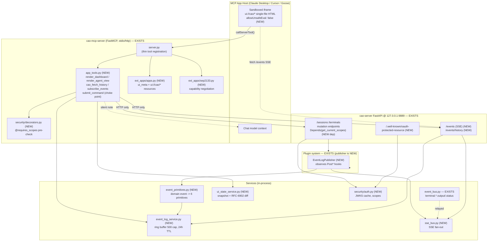
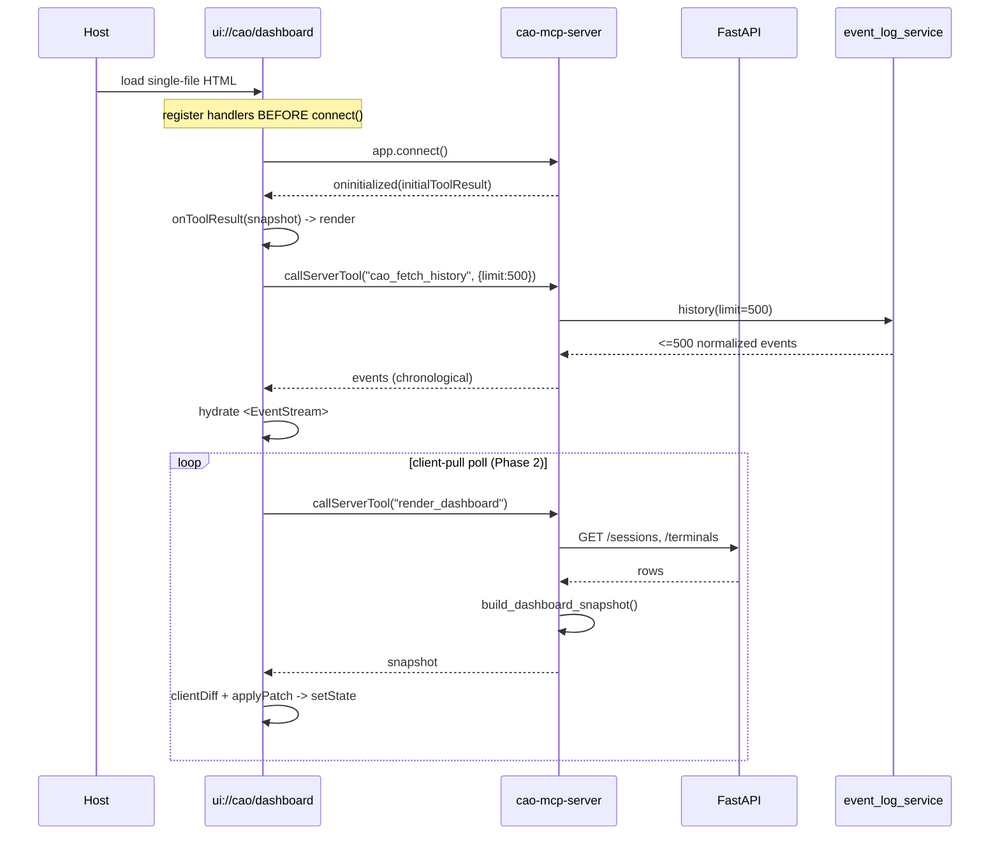
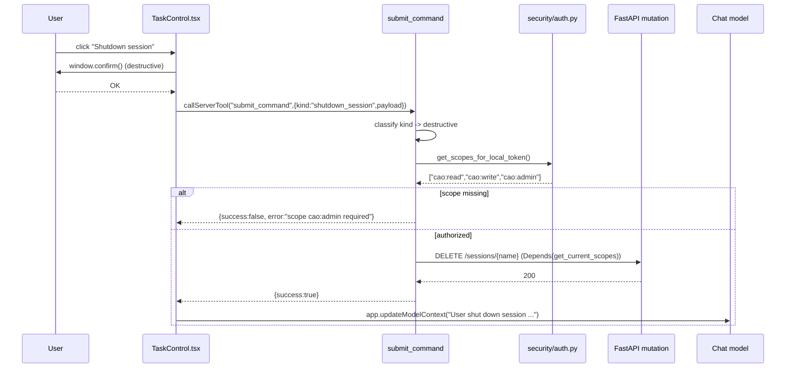
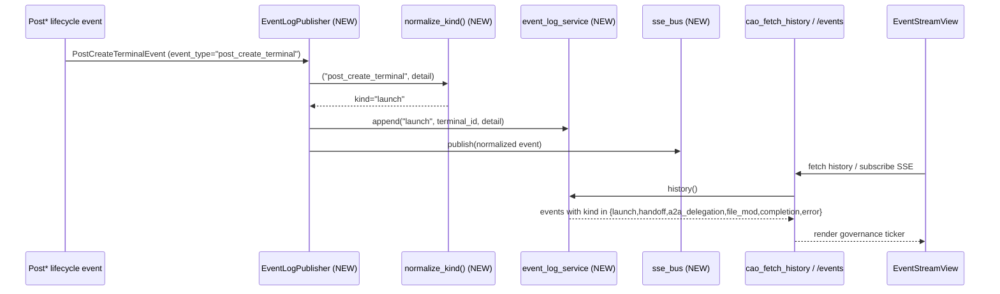

# Design Document: CAO Base MCP App

## Overview

The **CAO Base MCP App** is a sandboxed, host-rendered UI surface (SEP-1865 "MCP Apps")
that lets an operator observe and steer a CLI Agent Orchestrator (CAO) fleet from inside
any MCP App-capable host (Claude Desktop, Cursor, Goose, VS Code Insiders). It ships three
single-file HTML resources — `ui://cao/dashboard`, `ui://cao/agent`, `ui://cao/event-stream` —
driven by a small set of MCP tools and backed by an in-process event ring buffer.

This feature is grounded against **cli-agent-orchestrator v2.2.0**. An audit of *this* fork
(see the table below) shows that the **backplane primitives exist** — the FastAPI server on
`127.0.0.1:9889` with a strictly HTTP-only MCP boundary (`mcp_server/server.py` reaches state
only via `requests` against `API_BASE_URL` with `MCP_REQUEST_TIMEOUT`), the SQLite single
source of truth, an in-process `event_bus.py` (thread-safe pub/sub, topics
`terminal.{id}.output` / `terminal.{id}.status`, bounded `asyncio.Queue` per subscriber,
`EVENT_BUS_MAX_QUEUE_SIZE=1024`, wildcard matching), an append-only forensic `audit_log.py`
(memory events only), the `ProviderManager`/providers, `clients/tmux`, `clients/database`,
the entry-point plugin system (`cao.plugins`, `CaoPlugin` + `@hook`, typed lifecycle events
in `plugins/events.py`, `plugin_dispatch.py`), and a standard React + Vite + Tailwind SPA
under `web/`.

But the **MCP App feature itself is a greenfield build on top of those primitives.** None of
the event-history, fan-out, snapshot, tool, resource, frontend, auth, or gate layers this
design specifies exist yet. The work is therefore a **net-new vertical** that plugs into two
existing integration points:

1. **`event_bus.py`** — the in-process pub/sub the new `EventLogPublisher` and `SseBus`
   observe/relay (it is *not* itself a history buffer and is *not* externally subscribable as
   a replayable log).
2. **the plugin system** (`CaoPlugin`, `@hook`, `PostCreate*`/`PostKill*`/`PostSendMessage`
   events) — the lifecycle surface the new `EventLogPublisher` plugin reacts to.

The five build phases this design covers:

1. **Event history + normalization (services).** Build `event_log_service.py` (500-event ring
   buffer, 24 h TTL), `event_primitives.py` (normalize domain lifecycle events to the 6
   semantic primitives), `sse_bus.py` (SSE fan-out), and an `EventLogPublisher` plugin that
   observes lifecycle hooks and appends normalized events. None exist today.
2. **Snapshot + tool layer.** Build `ui_state_service.py` (dashboard snapshot + RFC-6902
   diff), `mcp_server/app_tools.py` (the 5 MCP App tools), and the FastAPI `/events` (SSE) and
   `/events/history` endpoints. Register tools via a thin `register_app_tools(mcp)` line in
   `server.py`.
3. **MCP App resources.** Build the `ext_apps/` package: `ui://cao/*` resource registration,
   `ui_meta` (CSP + `requiredScopes`), and SEP-2133 capability negotiation.
4. **Frontend view layer.** Build a new single-file React/Vite tree (`cao_mcp_apps/`):
   `vite-plugin-singlefile` build with `allowUnsafeEval:false`, the shared layer
   (`mcpApp.ts`, `patch.ts`, `TaskControl.tsx`, `EventStream.tsx`, `AgentStatus.tsx`,
   `types.ts`), three view entry points, and CSS container queries (350 px / 1280 px).
5. **Auth + shift-left gates (research-gated).** Build the `security/` package
   (OAuth 2.1 scope extraction, PRM endpoint, `@requires_scopes`), default-off; and the gate
   scaffolding (husky/lint-staged, coverage ratchet, JIT-free scan, bundle budget, HTTP-only
   guard test, ESLint/happy-dom/Playwright, CI job, timing gates).

The auth layer (Phase 5) is **research-gated**: verify the upstream
`@modelcontextprotocol/ext-apps` version + `allowUnsafeEval` API and the Auth0-for-MCP / PRM /
OBO (RFC 8693 / 8707) claims **before** relying on them. The feature is **default-off**
(`AUTH0_DOMAIN` unset ⇒ full scope set ⇒ behavior byte-for-byte identical to today's
localhost-only posture), and **generic OAuth 2.1 is the fallback** if external claims fail
verification. No `authlib` dependency exists today; generic JWT/JWKS handling is part of the
build.

---

## Audit Summary: Current State vs. Target

| Capability | Actual status in this fork (v2.2.0) | Gap this design closes |
|---|---|---|
| FastAPI backplane @ 9889, HTTP-only MCP boundary | **EXISTS** (`api/main.py`; `mcp_server/server.py` calls API over HTTP via `requests` w/ `MCP_REQUEST_TIMEOUT`; never imports `clients.tmux`/`clients.database`) | Add an HTTP-only **guard test** to lock the invariant |
| Config constants (`SERVER_HOST`/`SERVER_PORT`/`API_BASE_URL`/`MCP_REQUEST_TIMEOUT`) | **EXISTS** (`constants.py`) | none (reuse) |
| SQLite single source of truth | **EXISTS** | none (reuse) |
| In-process pub/sub `event_bus.py` | **EXISTS** (topics `terminal.{id}.output`/`.status`, bounded `asyncio.Queue`, `EVENT_BUS_MAX_QUEUE_SIZE=1024`, wildcard) — *not* a history buffer | Integration point for `SseBus`/publisher; not modified |
| `audit_log.py` forensic markdown log | **EXISTS** (memory events only; append-only daily) — *not* a fleet event stream | none (left as-is; not the event source) |
| Entry-point plugin system (`cao.plugins`, `CaoPlugin`, `@hook`, `plugins/events.py`) | **EXISTS** (`PostCreateSessionEvent`, `PostCreateTerminalEvent`, `PostKillSessionEvent`, `PostKillTerminalEvent`, `PostSendMessageEvent` w/ `orchestration_type`) | Integration point — `EventLogPublisher` plugs in here |
| 500-event ring buffer (`services/event_log_service.py`) | **MISSING** | **BUILD** (cap 500, 24 h TTL, thread-safe, `history()` w/ `limit`/`since`/`kinds`) |
| 6 semantic primitives (`services/event_primitives.py`) | **MISSING** | **BUILD** (`normalize_kind` total map: launch/handoff/a2a_delegation/file_mod/completion/error) |
| SSE fan-out bus (`services/sse_bus.py`) | **MISSING** | **BUILD** (per-subscriber bounded queue; drop-on-slow) |
| Snapshot + RFC-6902 diff (`services/ui_state_service.py`) | **MISSING** | **BUILD** (`build_dashboard_snapshot`, `build_agent_detail_snapshot`, `diff_snapshot`) |
| `EventLogPublisher` plugin | **MISSING** (plugin *system* exists; this publisher does not) | **BUILD** (observer-only; lifecycle hooks → normalize → append) |
| `render_dashboard`/`render_agent_view`/`cao_fetch_history`/`subscribe_events`/`submit_command` tools | **MISSING** (`mcp_server/` has only `server.py`, `models.py`, `utils.py`) | **BUILD** `mcp_server/app_tools.py` + thin `register_app_tools(mcp)` in `server.py` |
| FastAPI `/events` (SSE) + `/events/history` | **MISSING** | **BUILD** (stream from `SseBus`; replay normalized from ring buffer) |
| `ui://cao/*` resources + `_meta.ui` annotations | **MISSING** (no `ext_apps/`) | **BUILD** `ext_apps/` (`ui_meta()` w/ CSP + `requiredScopes`) |
| SEP-2133 capability negotiation | **MISSING** | **BUILD** (gated on `CAO_MCP_APPS_ENABLED`) |
| Single-file bundle (`vite-plugin-singlefile`, `allowUnsafeEval:false`) | **MISSING** (no `cao_mcp_apps/`; `web/` is a standard multi-file SPA; no `vite-plugin-singlefile`) | **BUILD** new frontend tree + single-file build |
| RFC-6902 delta-sync client (`shared/patch.ts`) | **MISSING** | **BUILD** (`applyPatch` + `clientDiff`) |
| Shared frontend layer (`mcpApp.ts`, `TaskControl.tsx`, `EventStream.tsx`, `AgentStatus.tsx`, `types.ts`) | **MISSING** | **BUILD** |
| CSS container queries (350 px / 1280 px) | **MISSING** | **BUILD** |
| `updateModelContext()` / gesture→primitive / `submit_command` choke point | **MISSING** (no client, no server tool) | **BUILD** both client mapping and server choke point |
| Auth: `security/auth.py`, PRM, `@requires_scopes`, JWKS, RBAC | **MISSING** (no `security/` package; no `authlib`) | **BUILD** (default-off; generic OAuth 2.1 fallback; research-gated) |
| Test infra (pytest markers, pytest-cov, pytest-asyncio, black/isort/mypy) | **EXISTS** (`pyproject.toml`; `--cov=src` in `addopts`; markers `integration`/`e2e`/`slow`) | Reuse; extend with new test tiers |
| Git hooks (husky/lint-staged) | **MISSING** | **BUILD** |
| Coverage ratchet (`.coverage-baseline.json`) | **MISSING** | **BUILD** |
| JIT-free deny-list scan + bundle-size budget | **MISSING** | **BUILD** (scan `eval(`/`new Function(`/`Function("`; gz budgets) |
| ESLint / happy-dom / Playwright | **MISSING** | **BUILD** |
| CI job for the MCP-app frontend | **MISSING** (CI builds `web/` only) | **BUILD** (`cao_mcp_apps` job + timing gates) |

**Takeaway:** unlike a heavily-modified fork where the backplane "already exists," this fork
provides only the *primitives* (HTTP boundary, `event_bus`, plugin system, SQLite, providers).
Every layer of the MCP App — history buffer, normalization, fan-out, snapshots, tools,
resources, frontend, auth, gates — is **net-new** and must be built. The load-bearing first
build is the services tier (`event_log_service` + `event_primitives` + `EventLogPublisher`),
since the tools and views have nothing to read until the ring buffer is populated.

---

## Architecture

The feature adds three new planes (services-history, tool, frontend) on top of CAO's existing
backplane, connected by the new tool layer. The MCP boundary remains **HTTP-only**:
`mcp_server/` never imports `clients.tmux` or `clients.database` — it calls the FastAPI
surface over `127.0.0.1:9889`. Components drawn with a dashed/`NEW` marker do not exist yet.



### Layering rules (invariants preserved)

- **HTTP-only MCP boundary.** Tools in `app_tools.py` reach state only through the FastAPI
  REST/SSE surface or through process-local read-only services (`event_log_service`,
  `ui_state_service`). They must not import `clients.tmux` or `clients.database`. A new guard
  test enforces this (the boundary itself already holds in `server.py`).
- **Single mutation choke point.** Every state-changing UI gesture flows through one tool,
  `submit_command`, which classifies the command kind, applies a scope pre-check, then routes
  to the corresponding FastAPI mutation endpoint. No other app tool mutates state.
- **Observer-only event emission.** Events are appended by the `EventLogPublisher` plugin
  reacting to `Post*` lifecycle hooks; the tool layer reads the buffer but never writes domain
  events into it (it may append `submit_command` audit breadcrumbs through the same
  normalization path).
- **Default-off auth.** With `AUTH0_DOMAIN` unset, `get_current_scopes` / the local-token
  helper return the full scope set, preserving today's localhost-only behavior byte-for-byte.

---

## Sequence Diagrams

### Mount / hydrate (re-mount safe)



### Mutation through the `submit_command` choke point



### Event flow: lifecycle hook -> 6 primitives -> iframe



---

## Components and Interfaces

### Component 1: Event history foundation (BUILD)

**Purpose:** Maintain a rolling, time-windowed buffer of fleet events expressed in a stable
6-primitive vocabulary so the iframe can re-hydrate its governance ticker after any re-mount.

**Integration points (exist):** the entry-point **plugin system** (`CaoPlugin`, `@hook`,
typed events in `plugins/events.py`) and the in-process **`event_bus.py`** (relayed onto the
new SSE bus). Neither is a history/replay buffer today — that is what this component adds.

**New piece — ring buffer.** `services/event_log_service.py`: a bounded
`deque(maxlen=500)` with a 24 h TTL, thread-safe append, and `history()` with
`limit` / `since` / `kinds` filters.

```python
# services/event_log_service.py  (NEW)
import threading, uuid
from collections import deque
from datetime import datetime, timedelta, timezone
from typing import List, Optional

RING_CAPACITY = 500
TTL = timedelta(hours=24)

class EventLog:
    """Thread-safe, bounded, time-windowed fleet event buffer (single source for replay)."""
    def __init__(self) -> None:
        self._buf: "deque[dict]" = deque(maxlen=RING_CAPACITY)
        self._lock = threading.Lock()

    def append(self, kind: str, terminal_id: Optional[str],
               session_name: Optional[str], detail: dict) -> dict:
        ev = {
            "id": str(uuid.uuid4()),
            "kind": kind,
            "terminal_id": terminal_id,
            "session_name": session_name,
            "timestamp": datetime.now(timezone.utc).isoformat(),
            "detail": detail,           # metadata only — never message bodies
        }
        with self._lock:
            self._buf.append(ev)
        return ev

    def history(self, limit: int = RING_CAPACITY,
                since: Optional[str] = None,
                kinds: Optional[List[str]] = None) -> List[dict]:
        cutoff = datetime.now(timezone.utc) - TTL
        with self._lock:
            items = list(self._buf)
        out = [e for e in items
               if datetime.fromisoformat(e["timestamp"]) >= cutoff
               and (kinds is None or e["kind"] in kinds)
               and (since is None or e["timestamp"] > since)]
        return out[-limit:] if limit < len(out) else out

_log: Optional[EventLog] = None
def get_event_log() -> EventLog:
    global _log
    if _log is None:
        _log = EventLog()
    return _log
```

**New piece — semantic normalization.** `services/event_primitives.py` converts CAO's
lifecycle `event_type` strings into the 6 primitives the frontend expects. It lives next to
the publisher so both the plugin and `cao_fetch_history` apply it consistently.

```python
# services/event_primitives.py  (NEW)
from typing import Dict, Optional

# Closed vocabulary the MCP App renders (mirrors cao_mcp_apps/src/shared/types.ts CaoEvent.kind).
PRIMITIVES = ("launch", "handoff", "a2a_delegation", "file_mod", "completion", "error")

# Map CAO lifecycle event_type -> semantic primitive. Unknown kinds pass through as "other"
# so the buffer never silently drops an event; the iframe groups unknowns under "other".
_DOMAIN_TO_PRIMITIVE: Dict[str, str] = {
    "post_create_terminal": "launch",
    "post_create_session": "launch",
    "post_send_message": "handoff",     # refined below by orchestration_type
    "post_kill_terminal": "completion",
    "post_kill_session": "completion",
}

def normalize_kind(event_type: str, detail: Optional[dict] = None) -> str:
    """Total map: every CAO lifecycle event_type -> exactly one primitive (or "other").

    `post_send_message` is disambiguated by orchestration_type:
      - assign / handoff / send_message -> "handoff"
      - a2a                             -> "a2a_delegation"
    `file_mod`, `completion`, and `error` primitives are also emitted directly by the
    dispatch/interrupt paths rather than only mapped from a lifecycle event_type.
    """
    detail = detail or {}
    if event_type == "post_send_message":
        otype = str(detail.get("orchestration_type", "")).lower()
        return "a2a_delegation" if "a2a" in otype else "handoff"
    return _DOMAIN_TO_PRIMITIVE.get(event_type, "other")
```

**New piece — `EventLogPublisher` plugin.** An observer-only `CaoPlugin` whose `@hook`
methods react to the `Post*` events and append normalized rows (and relay to the SSE bus).

```python
# plugins/builtin/event_log_publisher.py  (NEW) — registered via cao.plugins entry point
from cli_agent_orchestrator.plugins import (
    PostCreateTerminalEvent, PostCreateSessionEvent,
    PostKillTerminalEvent, PostKillSessionEvent, PostSendMessageEvent, hook,
)
from cli_agent_orchestrator.plugins.base import CaoPlugin
from cli_agent_orchestrator.services.event_log_service import get_event_log
from cli_agent_orchestrator.services.event_primitives import normalize_kind
from cli_agent_orchestrator.services.sse_bus import get_bus

class EventLogPublisher(CaoPlugin):
    """Observer-only: mirror lifecycle hooks into the ring buffer as 6-primitive events."""

    def _emit(self, event_type, terminal_id, session_name, detail) -> None:
        kind = normalize_kind(event_type, detail)
        ev = get_event_log().append(kind, terminal_id, session_name, detail)
        get_bus().publish(ev)  # best-effort live fan-out

    @hook
    async def on_post_create_terminal(self, e: PostCreateTerminalEvent) -> None:
        self._emit(e.event_type, e.terminal_id, None,
                   {"provider": e.provider, "agent_name": e.agent_name})

    @hook
    async def on_post_send_message(self, e: PostSendMessageEvent) -> None:
        # privacy boundary: store metadata only, never e.message body
        self._emit(e.event_type, e.receiver, None,
                   {"sender": e.sender, "receiver": e.receiver,
                    "orchestration_type": e.orchestration_type})
    # ... on_post_create_session / on_post_kill_terminal / on_post_kill_session
```

**Responsibilities:**
- Be the single source for historical replay (no new DB table; in-memory ring).
- Express every replayed event in the 6-primitive vocabulary (or `"other"` for unmapped).
- Preserve the privacy boundary: message *bodies* are never persisted (only metadata).

### Component 2: SSE fan-out bus (BUILD)

**Purpose:** Relay live normalized events to connected iframes without blocking producers.

```python
# services/sse_bus.py  (NEW)
import asyncio
from typing import List, Optional

SSE_MAX_QUEUE_SIZE = 256

class SseBus:
    """Per-subscriber bounded queue; drop-on-slow so a stalled iframe never blocks producers."""
    def __init__(self) -> None:
        self._subs: List[asyncio.Queue] = []
        self._lock = asyncio.Lock()

    def publish(self, event: dict) -> None:
        for q in list(self._subs):
            try:
                q.put_nowait(event)
            except asyncio.QueueFull:
                pass  # drop + (single) warning; history backfills via cao_fetch_history

    async def subscribe(self):
        q: asyncio.Queue = asyncio.Queue(maxsize=SSE_MAX_QUEUE_SIZE)
        async with self._lock:
            self._subs.append(q)
        try:
            while True:
                yield await q.get()
        finally:
            async with self._lock:
                self._subs.remove(q)

_bus: Optional[SseBus] = None
def get_bus() -> SseBus:
    global _bus
    if _bus is None:
        _bus = SseBus()
    return _bus
```

**Responsibilities:** stream best-effort live events; drop on slow subscriber (bounded queue);
never block the producer; the durable record is always the ring buffer.

### Component 3: MCP App Tools (`mcp_server/app_tools.py`) — the central new module (BUILD)

**Purpose:** Expose the five tools the frontend calls. Registered via a thin
`register_app_tools(mcp)` line in `server.py` (mirrors the existing tool registration style),
gated on `CAO_MCP_APPS_ENABLED`. All tools carry `_meta.ui` annotations from `ext_apps.ui_meta`.

```python
# mcp_server/app_tools.py  (NEW) — interface sketch
import requests
from typing import Any, Dict, List, Optional
from cli_agent_orchestrator.constants import API_BASE_URL, MCP_REQUEST_TIMEOUT
from cli_agent_orchestrator.ext_apps import (
    DASHBOARD_RESOURCE_URI, AGENT_RESOURCE_URI, EVENT_STREAM_RESOURCE_URI, ui_meta,
)
from cli_agent_orchestrator.services.event_log_service import get_event_log
from cli_agent_orchestrator.services.event_primitives import normalize_kind
from cli_agent_orchestrator.services.ui_state_service import (
    build_dashboard_snapshot, build_agent_detail_snapshot,
)
from cli_agent_orchestrator.security import get_scopes_for_local_token, SCOPE_WRITE, SCOPE_ADMIN

# Command-kind taxonomy for the choke point (mirrors SubmitCommandKind in types.ts).
STANDARD_KINDS    = {"send_message", "assign", "create_session"}
LIFECYCLE_KINDS   = {"interrupt", "pause", "resume"}
DESTRUCTIVE_KINDS = {"shutdown_session"}

def register_app_tools(mcp: Any) -> bool:
    """Register the 5 MCP App tools. Best-effort; returns False if disabled/unavailable."""
    ...

# --- read tools (visibility: ["model","app"]) ---
def _render_dashboard_impl() -> Dict[str, Any]:
    """Build the dashboard snapshot from the live FastAPI surface (HTTP-only)."""
    sessions  = requests.get(f"{API_BASE_URL}/sessions", timeout=MCP_REQUEST_TIMEOUT).json()
    terminals = requests.get(f"{API_BASE_URL}/terminals", timeout=MCP_REQUEST_TIMEOUT).json()
    return build_dashboard_snapshot(
        sessions=sessions, terminals=terminals,
        scopes=get_scopes_for_local_token(),
    )

def _render_agent_view_impl(terminal_id: str) -> Dict[str, Any]:
    """Per-agent detail snapshot for ui://cao/agent."""
    ...

# --- history / subscribe (visibility: ["app"]) ---
def _cao_fetch_history_impl(limit: int = 500, kinds: Optional[List[str]] = None) -> Dict[str, Any]:
    """Replay the ring buffer, normalized to the 6 primitives, newest-last."""
    raw = get_event_log().history(limit=limit, kinds=kinds)
    return {"events": [
        {**e, "kind": normalize_kind(e.get("detail", {}).get("event_type", e["kind"]), e.get("detail"))}
        if "event_type" in e.get("detail", {}) else e
        for e in raw
    ]}

def _subscribe_events_impl() -> Dict[str, Any]:
    """Return the SSE endpoint descriptor the iframe should connect to for live events.
    (The live stream is delivered over the FastAPI /events SSE route, not the tool channel.)"""
    return {"sse_url": "/events", "history_tool": "cao_fetch_history", "ring_capacity": 500}

# --- the single mutation choke point (visibility: ["app"]) ---
def _submit_command_impl(kind: str, payload: Dict[str, Any]) -> Dict[str, Any]:
    """Classify -> scope pre-check -> route to FastAPI mutation endpoint."""
    if kind in DESTRUCTIVE_KINDS:
        required = SCOPE_ADMIN
    elif kind in STANDARD_KINDS or kind in LIFECYCLE_KINDS:
        required = SCOPE_WRITE
    else:
        return {"success": False, "error": f"unknown command kind: {kind}"}

    scopes = get_scopes_for_local_token()
    # Empty list (auth on, no token) blocks; full set (auth off) passes.
    if scopes and required not in scopes:
        return {"success": False, "error": f"scope {required} required"}

    return _route_command(kind, payload)   # maps kind -> POST/DELETE on API_BASE_URL
```

**Tool / resource / scope matrix:**

| Tool | `visibility` | Resource (`_meta.ui`) | Scope pre-check |
|---|---|---|---|
| `render_dashboard` | `["model","app"]` | `ui://cao/dashboard` | none (read) |
| `render_agent_view` | `["model","app"]` | `ui://cao/agent` | none (read) |
| `cao_fetch_history` | `["app"]` | `ui://cao/event-stream` | none (read) |
| `subscribe_events` | `["app"]` | `ui://cao/event-stream` | none (read) |
| `submit_command` | `["app"]` | (none — action tool) | `cao:write` / `cao:admin` by kind |

**Server.py change (thin):** add `from ...app_tools import register_app_tools` and a single
`register_app_tools(mcp)` call alongside the existing tool registration — keeping `server.py`
contention low for parallel work.

### Component 4: FastAPI event endpoints (BUILD)

**Purpose:** Give the iframe an HTTP path to live events (the SSE bus) and a non-tool history
fallback, so a host that sandboxes tool calls but allows `connect-src` localhost can stream
directly.

```python
# api/main.py additions (sketch) — NEW routes
import json
from fastapi.responses import StreamingResponse
from cli_agent_orchestrator.services.sse_bus import get_bus
from cli_agent_orchestrator.services.event_log_service import get_event_log

@app.get("/events")                      # text/event-stream
async def events_stream():
    async def gen():
        async for ev in get_bus().subscribe():
            yield f"data: {json.dumps(ev)}\n\n"
    return StreamingResponse(gen(), media_type="text/event-stream")

@app.get("/events/history")              # JSON replay (already normalized at append time)
async def events_history(limit: int = 500):
    return {"events": get_event_log().history(limit=limit)}
```

**Responsibilities:** stream best-effort live events; drop on slow subscriber (bounded queue
in `SseBus`); never block the producer.

### Component 5: View layer (single-file React) (BUILD)

**Purpose:** Three iframe entry points rendering snapshots and the event ticker, built into
single-file HTML via `vite-plugin-singlefile` with `allowUnsafeEval:false` honored. This is a
**new** frontend tree (e.g. `cao_mcp_apps/`), separate from the existing standard `web/` SPA.

**Shared layer (new):** `shared/mcpApp.ts` (lifecycle, `submitCommand`, `fetchHistory`,
`startPolling`, `silentlyNoteToModel`/`updateModelContext`), `shared/patch.ts`
(`applyPatch`, `clientDiff` — RFC-6902), `shared/TaskControl.tsx`, `shared/EventStream.tsx`,
`shared/AgentStatus.tsx`, `shared/HeaderBar.tsx`, `shared/types.ts`.

**Entry components + container queries (new):**

```typescript
// src/dashboard/Dashboard.tsx (interface)
export function Dashboard(): JSX.Element;     // mounts app, polls render_dashboard, applies deltas
// src/agent/AgentView.tsx
export function AgentView(): JSX.Element;      // render_agent_view + xterm output tail
// src/event-stream/EventStreamView.tsx
export function EventStreamView(): JSX.Element; // cao_fetch_history + SSE subscribe
```

```css
/* shared/styles.css — container-query layout (NEW) */
.cao-root { container-type: inline-size; }
@container (max-width: 350px)  { .cao-grid { grid-template-columns: 1fr; } }
@container (min-width: 1280px) { .cao-grid { grid-template-columns: 280px 1fr; } }
```

**Build outputs:** `apps_static/{dashboard,agent,event-stream}.html`, shipped in the wheel via
a `force-include`/artifacts rule in `pyproject.toml` (the existing `[tool.hatch.build]`
artifacts entry currently covers `web_ui/**` and will be extended for the app bundles).

**Responsibilities:** register handlers before `connect()`; hydrate from initial tool result;
re-fetch history on re-mount; no `eval`/`new Function`; no `localStorage`/cookies; respond to
the iframe's container width, not host viewport.

### Component 6: MCP App resources (`ext_apps/`) (BUILD)

**Purpose:** Register the `ui://cao/*` resources and attach `_meta.ui` annotations (CSP +
`requiredScopes`), plus SEP-2133 capability negotiation gated on `CAO_MCP_APPS_ENABLED`.

```python
# ext_apps/apps.py  (NEW) — interface sketch
DASHBOARD_RESOURCE_URI     = "ui://cao/dashboard"
AGENT_RESOURCE_URI         = "ui://cao/agent"
EVENT_STREAM_RESOURCE_URI  = "ui://cao/event-stream"

def ui_meta(*, csp: str, required_scopes: list[str]) -> dict:
    """Build the _meta.ui annotation block (CSP + requiredScopes) for a tool/resource."""
    return {"ui": {"csp": csp, "requiredScopes": required_scopes}}

def register_apps(mcp) -> bool:
    """Register ui://cao/* single-file resources from apps_static/. Best-effort."""
    ...
```

```python
# ext_apps/sep2133.py  (NEW)
def negotiate_capabilities(client_caps: dict) -> dict:
    """SEP-2133 capability handshake; no-op unless CAO_MCP_APPS_ENABLED is set."""
    ...
```

**Responsibilities:** serve the built HTML bodies; degrade gracefully when an older FastMCP
lacks `@mcp.resource` (return `False`, log info, fall back to a `/widgets`-style route).

### Component 7: AI-native context loop (BUILD)

**Purpose:** Keep the chat model aware of UI-initiated actions without a fresh inference cycle,
and funnel all mutation through one auditable choke point.

- **Gesture -> primitive mapping (client):** each `TaskControl` button maps to one
  `SubmitCommandKind`; the union is `STANDARD ∪ LIFECYCLE ∪ DESTRUCTIVE` (see Component 3).
- **`submit_command` choke point (server):** the only mutation tool; classifies kind, applies
  scope pre-check, routes to FastAPI, returns a structured result. The FastAPI endpoint
  enforces scopes again — the pre-check is UX, the endpoint is the security boundary.
- **`updateModelContext()` (client):** after each material action, `silentlyNoteToModel()`
  pushes a one-line note ("User shut down session X") so the model reasons about consequences
  on its next turn. Used sparingly (once per action), best-effort, never blocks the UI.

### Component 8: Auth layer (research-gated) (BUILD)

**Purpose:** Optional enterprise auth that is off by default and degrades to generic OAuth 2.1.
No `security/` package or `authlib` dependency exists today — this entire component is built.

**New (`security/auth.py`):** `get_current_scopes` (FastAPI dependency),
`extract_scopes_from_token` (RS256 + JWKS + audience validation), `get_scopes_for_local_token`
(MCP-side pre-check via `CAO_AUTH_TOKEN`), a JWKS cache with 1 h TTL
(`CAO_AUTH_JWKS_CACHE_TTL`), the scope taxonomy `cao:read/write/admin`, and a generic-IdP
fallback (`CAO_AUTH_JWKS_URI` override honoring `scope` / `permissions` / `scp` claim
variants). A Protected Resource Metadata endpoint at `/.well-known/oauth-protected-resource`
(returns 404 when auth disabled).

**New (`security/decorators.py`):** an `@requires_scopes(*scopes)` decorator for the MCP tool
layer that wraps a tool impl with the same pre-check `submit_command` performs, so future
scoped tools share one enforcement primitive.

```python
# security/decorators.py (NEW)
def requires_scopes(*needed: str):
    """Decorator pre-checking local-token scopes before a tool impl runs.
    Default-off (AUTH0_DOMAIN unset) -> full scope set -> always passes."""
    ...
```

**Research gate:** confirm the upstream `@modelcontextprotocol/ext-apps` version +
`allowUnsafeEval` API and the Auth0-for-MCP PRM / OBO (RFC 8693 / 8707) claims **before**
relying on them. If verification fails, generic OAuth 2.1 (also built here) is the fallback.

---

## Data Models

### Event (ring buffer row / `CaoEvent`)

```python
{
  "id": "uuid4",
  "kind": "launch|handoff|a2a_delegation|file_mod|completion|error|other",
  "terminal_id": "str | None",
  "session_name": "str | None",
  "timestamp": "ISO-8601 UTC",
  "detail": { "...": "metadata only — never message bodies" }
}
```
**Validation rules:** `kind` after normalization is one of the 6 primitives or `"other"`;
`timestamp` ISO-8601 with explicit offset; buffer length never exceeds 500; events older than
the TTL are filtered out of `history()`.

### DashboardSnapshot (mirrors `ui_state_service.build_dashboard_snapshot`)

```typescript
interface DashboardSnapshot {
  cao_version: string;
  sessions: { name: string; terminal_count: number; active_terminal_count: number }[];
  terminals: TerminalSummary[];        // id, session_name, provider, agent_profile, status,
                                       // execution_mode, parent_terminal_id, last_activity
  providers: { name: string; binary: string; installed: boolean }[];
  cognitive_load: { active_sub_agent_count: number; token_rate_per_minute: number | null };
  scopes: string[];                    // granted scopes; [] when auth on + no token
}
```
**Validation rules:** snapshot is a pure projection (no side effects); RFC-6902 diff between
two snapshots uses whole-key replace for `terminals`/`sessions`, per-key replace for scalars;
the iframe reducer (`applyPatch`) accepts the full op set.

### SubmitCommand

```typescript
type SubmitCommandKind =
  | "shutdown_session"            // destructive  -> cao:admin
  | "send_message" | "assign" | "create_session"  // standard -> cao:write
  | "interrupt" | "pause" | "resume";             // lifecycle -> cao:write
interface SubmitCommandResult { success: boolean; error?: string; [k: string]: unknown }
```

### Scope taxonomy

`cao:read` (view), `cao:write` (standard + lifecycle mutations), `cao:admin` (destructive).
Default-off mode grants all three.

---

## Correctness Properties

1. **Ring-buffer bound.** For all event sequences, `len(EventLog) <= 500` and `cao_fetch_history`
   returns at most `min(limit, 500)` events.
2. **History order.** `cao_fetch_history` returns events in non-decreasing timestamp order
   (chronological, newest-last).
3. **Primitive closure.** For every event returned by the history tools,
   `kind ∈ {launch, handoff, a2a_delegation, file_mod, completion, error, other}`.
4. **Normalization totality.** `normalize_kind` is total: every input `event_type` maps to
   exactly one output (never raises, never returns `None`).
5. **RFC-6902 round-trip.** For all snapshots `prev`, `curr`:
   `applyPatch(prev, clientDiff(prev, curr))` deep-equals `curr`.
6. **Single choke point.** Every state mutation initiated by the iframe passes through
   `submit_command`; no other app tool mutates server state.
7. **Scope monotonicity.** A `submit_command` whose kind requires scope `S` succeeds the
   pre-check only if `S ∈ scopes` or auth is disabled (scopes == full set).
8. **Default-off equivalence.** With `AUTH0_DOMAIN` unset, every auth path returns the full
   scope set, so behavior is identical to the pre-auth release.
9. **HTTP-only boundary.** No module under `mcp_server/` imports `clients.tmux` or
   `clients.database` (statically verifiable).
10. **JIT-free bundle.** No built artifact under `apps_static/` contains `eval(`,
    `new Function(`, `Function("`, or WASM-JIT calls.
11. **Privacy boundary.** No event row's `detail` contains a message body.
12. **Re-mount idempotence.** Mounting, unmounting, and re-mounting an iframe yields the same
    rendered history (modulo TTL/eviction) because hydration is driven by `cao_fetch_history`.

---

## Error Handling

| Scenario | Condition | Response | Recovery |
|---|---|---|---|
| Server unreachable | FastAPI down / timeout | tool returns `{success:false,error:"..."}`; iframe shows banner | poll retries on next tick |
| Missing artifact | `apps_static/*.html` absent (dev tree) | `get_resource_body` raises `KeyError`/`FileNotFoundError`; `register_apps` logs + skips | run Vite build |
| Old FastMCP build | `@mcp.resource` absent | `register_apps`/`register_app_tools` return `False`, log info | served via `/widgets`/`/events` fallback |
| SSE subscriber slow | bounded queue full | `SseBus.publish` drops event + single warning | next event delivered; history backfills |
| Insufficient scope | kind needs scope not granted | `submit_command` returns `{success:false,error:"scope X required"}`; FastAPI 403 | operator obtains token/scope |
| Invalid/expired token | JWKS/aud/exp fail | `extract_scopes_from_token` raises 401 | re-auth; JWKS refetched on TTL expiry |
| JWKS unreachable | IdP down | `_fetch_jwks` raises 503 | cached key reused until TTL; retry |
| Unknown command kind | kind not in taxonomy | `{success:false,error:"unknown command kind"}` | client validated against `SubmitCommandKind` |
| Strict-CSP host | iframe cannot reach localhost | `fetch` fails silently (e.g. profile datalist) | host-mediated tool calls still work |

---

## Testing Strategy

### Shift-left gates (front-loaded, run before feature work) — all BUILD

- **Git hooks (`husky` + `lint-staged`)** in `cao_mcp_apps/`: pre-commit = fast lint + changed
  unit tests; pre-push = full local sweep, target < 15 s for staged changes.
- **Coverage ratchet:** `.coverage-baseline.json` at repo root; a script reads `pytest --cov`
  (already `--cov=src` in `addopts`) and `vitest --coverage` and fails on regression below the
  floor.
- **JIT-free scan:** a `scripts/scan-jit.mjs` (deny-list `eval(`, `new Function(`,
  `Function("`, WASM-JIT) wired into CI as a required check on the `apps_static/` path.
- **Bundle-size budget:** a `scripts/check-bundle-size.mjs` (dashboard ≤ 250 KB gz,
  agent ≤ 250 KB gz, event-stream ≤ 150 KB gz).
- **HTTP-only guard test:** asserts no `mcp_server/` module imports `clients.tmux` /
  `clients.database` (AST or import scan) — locks the invariant the fork already satisfies.
- **ESLint** + **happy-dom** + **Playwright** deps added; CI timing gates
  Unit < 5 s / Component < 8 s / Integration < 15 s / E2E < 60 s.
- **CI wiring:** add a `cao_mcp_apps` job to `.github/workflows/ci.yml` (today only `web/` is
  built) running `tsc`, `vitest run`, `npm run scan:jit`, `check-bundle-size`, `build:all`.

### 16-point test matrix (4 tiers x 4 areas)

| Tier (tool, gate) | EventLog/primitives | App tools / choke point | View layer | Auth |
|---|---|---|---|---|
| **Unit** (Vitest/pytest, < 5 s) | `normalize_kind` totality; ring bound | `submit_command` kind classification + scope pre-check | `applyPatch`/`clientDiff` round-trip | `extract_scopes_from_token`, JWKS cache TTL |
| **Component** (happy-dom, < 8 s) | event-stream render from history | TaskControl gesture -> primitive; disabled-by-scope | container-query snapshots @ 350 px / 1280 px | scope-gated button rendering |
| **Integration** (Mock Host, < 15 s) | `/events` SSE + `/events/history` | tool over HTTP -> FastAPI mutation routes | `oninitialized` replay; re-mount hydration | PRM schema; `@requires_scopes` RBAC matrix |
| **E2E** (Playwright, < 60 s) | live ticker updates on real fleet events | end-to-end shutdown/assign through UI | full dashboard load in sandbox iframe | enabled-auth 401/403 flow |

### Property-based testing

- **Library:** `fast-check` (TS) for `applyPatch∘clientDiff == identity` and pointer escaping;
  Hypothesis (Python) for `normalize_kind` totality and `history()` bound/order invariants.

---

## Performance Considerations

- Ring buffer is O(1) append (`deque(maxlen)`) and O(n≤500) filtered read — negligible.
- Snapshot building is a pure projection over already-fetched REST rows; no extra DB hits
  beyond the two `GET`s per poll tick.
- Client-pull polling (Phase 2) is the default; server-push via `notifications/tool-input` is
  deferred until the typed `ToolInputNotification` API stabilizes — `applyPatch` accepts the
  same delta shape, so no client change is needed when it lands.
- Bundle budgets keep first-resource-read wire cost bounded (gzip-measured).

## Security Considerations

- **Sandbox:** iframes run with `allowUnsafeEval:false`; single-file bundling avoids
  host-CSP friction; no `eval`/`new Function`/WASM-JIT (enforced by scan).
- **No client persistence:** no `localStorage`/`sessionStorage`/cookies; state is server-side.
- **Default-off auth:** localhost-only posture unchanged unless `AUTH0_DOMAIN` set.
- **Two-layer enforcement:** `submit_command` pre-check (UX) + FastAPI `Depends(get_current_scopes)`
  (security boundary). Destructive kinds require `cao:admin` and a client-side `confirm()`.
- **Privacy:** message bodies are never written to the event buffer or SSE bus.
- **Token handling:** JWKS validated RS256, audience-checked, TTL-cached.

## Dependencies

**Existing (reused):** `fastapi`, `fastmcp>=2.14`, `mcp>=1.23`, `pydantic`, `uvicorn`,
`websockets`, `libtmux`, `requests`, `pyte`; pytest (+ `pytest-asyncio`, `pytest-cov`,
`pytest-mock`, `pytest-xdist`), `black`, `isort`, `mypy`; the `web/` SPA's React + Vite +
Tailwind + vitest toolchain.

**New (Python, build):** no `authlib` exists today — generic JWT/JWKS verification is added
for the `security/` package (e.g. `pyjwt[crypto]` or equivalent, pending the research gate).

**New (frontend, build):** a `cao_mcp_apps/` tree with `react@18`, `vite`,
`vite-plugin-singlefile`, `vitest`, `@xterm/xterm` (+ addon-fit), `vitest-axe`, and the gate
deps `husky`, `lint-staged`, `eslint`, `happy-dom`, `@playwright/test`, `fast-check`; a
repo-root `.coverage-baseline.json`; a CI job for `cao_mcp_apps`.

**Research-gated (verify before relying on):** the `@modelcontextprotocol/ext-apps` version +
`allowUnsafeEval` API surface and the Auth0-for-MCP PRM/OBO (RFC 8693 / 8707) claims — generic
OAuth 2.1 is the fallback if verification fails.
