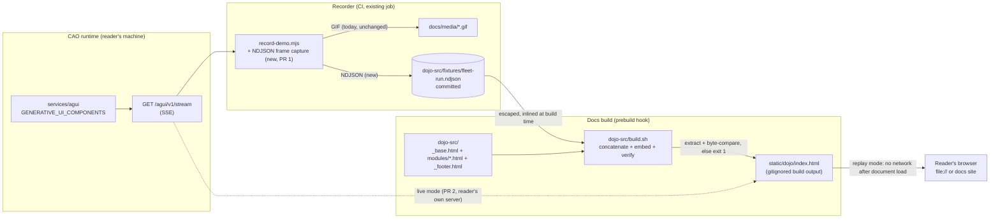

# Design: a CAO Dojo on the docs site

**Requirements:** `./requirements.md`
**Status:** Specified, not implemented.
**Provenance:** ported from `docs/issues/docsite-dojo/design.md` (removed; preserved at
commit `b18eff6`). That version's mermaid diagram, file layout, alternatives, and risks
survive; three of its decisions do not, and the corrections are called out explicitly below
rather than silently applied.

---

## Overview

Assemble a static, zero-dependency interactive page at `docusaurus/static/dojo/index.html`
that renders the AG-UI event stream in two modes: **replay** from a trace fixture embedded
at build time (the default, no setup) and **live** from the reader's own `cao-server` at
`http://localhost:9889/agui/v1/stream`.

The Renderer is the existing `examples/ag-ui/ag-ui-eventsource-viewer/index.html` (499
lines, zero dependencies), refactored into `docusaurus/dojo-src/` parts so the same logic
is not maintained twice. The build is `course-src/build.sh` applied to a second target,
with two deliberate divergences (see *Divergences from `course-src`*).

The Dojo is a **pure consumer** of the stream contract. It imports no CAO Python, adds no
route, and cannot alter what the surface emits. The only new Python in this feature is test
code. `src/cli_agent_orchestrator/services/agui/` is untouched: `GENERATIVE_UI_COMPONENTS`
(`services/agui_stream.py:91`, enforced at `services/agui/base.py:339`) and `_BODY_FIELDS`
(`services/agui/base.py:28`) are read as ground truth, never modified.

**PR 1 is replay mode + the static page + the CI gate.** It depends on no unmerged pull
request (FR-9). Live mode ships separately and depends on
https://github.com/awslabs/cli-agent-orchestrator/pull/584. Every section below marks which
increment it belongs to.

## Architecture

### Position in the system



The fixture flows into the **build**, not into a runtime fetch. That single arrow is the
most important correction to the ported design.

### Corrections to the ported design

Four things in `docs/issues/docsite-dojo/design.md` (removed; preserved at commit `b18eff6`)
were wrong or underspecified. Two were found by grounding it against the code; two were
found by the requirements refinement.

#### 1. Replay cannot `fetch()` the fixture

The ported design declared `openReplay(fixtureUrl, onFrame, opts)` — *"fetch + paced
replay"*. Browsers block `fetch` and XHR against `file://` origins, so the page could never
satisfy its own headline acceptance criterion ("opens from `file://`, renders the fixture,
no server"). FR-3 now requires `build.sh` to **embed** the fixture. `fixtureUrl` is deleted
from the seam; `Replay_Transport` reads a DOM node that is already in the document.

#### 2. The Renderer as it exists today violates FR-6

The ported design described `RENDERERS` + `GENERIC_RENDERER` as though it were a port. It
is not. The viewer's current dispatch is a **name-list gate**:

```js
// examples/ag-ui/ag-ui-eventsource-viewer/index.html:137,341
var ALLOWED_COMPONENTS = Object.freeze({ approval_card: true, /* …6 names… */ });
var node = Object.prototype.hasOwnProperty.call(ALLOWED_COMPONENTS, component)
  ? renderComponent(component, props)
  : renderInertPlaceholder(component);   // "refused component", renders zero props
```

That is a client-side mirror of the server allow-list, and it fails FR-6 twice: an
off-list name renders a *structurally different* view (criterion 3) and renders **no props
fields at all** (criterion 1). Removing this gate is real behavioural work in PR 1, not a
copy-paste. What the mirror was protecting against — executing untrusted markup — is
preserved by the text-not-markup rule (FR-6.6), which is the correct control; a name list
was never what made the page safe.

#### 3. FR-6's verification was a grep for hardcoded component names

Retired. The ported design's own `RENDERERS` map is *keyed by component name*, so the grep
forbade the mechanism the design required. FR-6 is now behavioural: **no name list may gate
rendering**; refinements keyed by name are permitted and affect appearance only. The
verification table below asserts the observable outcome (one view per delivered frame,
identical structure for on-list and off-list names) and contains no lexical search of the
built page.

#### 4. "Embed the viewer" is still the wrong verb

Unchanged from the ported design, and worth restating because it drives the file layout:
iframing the viewer would leave two copies of the Renderer to drift. `dojo-src/` becomes
the single source, and the standalone example is *generated from the same parts*.

### Divergences from `course-src`

FR-1 says mirror `course-src/build.sh`. The Dojo mirrors its **assembly idiom** and
diverges in two named ways, both forced by NFR-1. A reviewer will ask why the Dojo does not
reuse the shared-assets mechanism, so the answer is here rather than in a PR thread.

**The course pages are not `file://`-openable.** `course-src/build.sh` copies
`shared/styles.css` and `shared/main.js` once into `static/course-assets/`, and both courses
reference them *externally*:

```html
<!-- course-src/fundamentals/_base.html:8-12,89 -->
<link rel="preconnect" href="https://fonts.googleapis.com">
<link href="https://fonts.googleapis.com/css2?family=Bricolage+Grotesque…" rel="stylesheet">
<link rel="stylesheet" href="../course-assets/styles.css">
<script src="../course-assets/main.js" defer></script>
```

NFR-1.2 forbids the Dojo referencing any external script, stylesheet, font, or CDN asset,
and criterion 1 of the release gates requires it to open from `file://`. So:

1. **All CSS and JS are inlined into the single output file.** No `dojo-assets/` directory,
   no relative asset paths, no webfonts — system font stacks only.
2. **The output is one file**, `static/dojo/index.html`, with no siblings.

This is not a regression against the courses; it is a different requirement. The existing
viewer already satisfies it — its only `http` occurrence is the default endpoint *value*
(`index.html:103`), not an asset reference — which is why it is a valid starting point and
the courses are not.

Everything else follows `course-src` exactly: `bash` + `cat`, `_base.html` + globbed
`modules/*.html` + `_footer.html`, invoked from the same npm hooks, output gitignored.

### File layout

```
docusaurus/
  .gitignore                   # add /static/dojo/ beside lines 13-15
  package.json                 # build-dojo script; prestart/prebuild call it
  dojo-src/
    build.sh                   # concatenate, embed fixture, verify byte-fidelity
    _base.html                 # doctype, <head>, inline <style>, shell, fixture slot
    modules/
      10-transport.html        # frame callback seam: replay player | EventSource
      20-state.html            # STATE_SNAPSHOT + RFC-6902 STATE_DELTA application
      30-render.html           # RENDERERS refinements + GENERIC_RENDERER fallback
      40-controls.html         # mode toggle, endpoint field, scrubber, labels
      90-seam.html             # window.__dojo test seam (see below)
    fixtures/
      fleet-run.ndjson         # Trace_Fixture — captured, never hand-written (FR-4)
      placeholder.ndjson       # Placeholder_Trace, _meta.placeholder=true, local only
  static/dojo/index.html       # BUILD OUTPUT — gitignored, never committed
  docs/features/dojo.md        # reference page (FR-8), registered in sidebars.ts
  blog/YYYY-MM-DD-*/index.md   # narrative (separate PR, FR-9/FR-10)

examples/ag-ui/ag-ui-eventsource-viewer/
  index.html                   # regenerated from the same dojo-src parts
  tools/
    record-demo.mjs            # + persist SSE frames as NDJSON (FR-4)
    dojo.spec.mjs              # FR-5 render gate + CP-1/CP-2/CP-3 (new)
    package.json               # existing private pkg, @playwright/test 1.56.1

test/examples/
  test_dojo_fixture_is_metadata_only.py   # CP-5, FR-7 (hypothesis)
  test_dojo_fixture_prefix_validity.py    # CP-4 (hypothesis)
  test_dojo_fixture_provenance.py         # FR-4 _meta validation
```

**Modules are `.html`, not `.js`** — consistently, everywhere. `course-src/build.sh` globs
`"$SRC/$name"/modules/*.html`, so each module is an HTML fragment carrying its own
`<script>` block. The ported design said `.html` in the layout and `10-transport.js` in the
interfaces section; that inconsistency is resolved in favour of `.html`. A `.js` variant
would make `dojo-src/build.sh` and its sibling diverge for no gain.

**Build output is gitignored, and the pattern is established.** `docusaurus/.gitignore:13-15`
lists `/static/course/`, `/static/course-advanced/`, `/static/course-assets/`. Adding
`/static/dojo/` in that same block is required by FR-1.5 — without it every contributor who
runs `npm start` gets a dirty working tree.

**No test framework is added to `docusaurus/`.** Its devDependencies are exactly
`@docusaurus/module-type-aliases`, `@docusaurus/tsconfig`, `@docusaurus/types`,
`@types/react`, `typescript`, and its only non-standard script is `build-courses`. There is
no Playwright, no vitest, no runner there, and this design does not introduce one. The
browser assertions live in the tools package that already has Playwright.

---

## Components and Interfaces

### The transport seam (PR 1 defines it; PR 2 adds the second implementation)

One contract, two implementations, and — load-bearing for CP-1 — **no mode flag reachable
from the Renderer**:

```js
// modules/10-transport.html
// Both return { stop() }. onFrame(frame) receives parsed AG-UI events in arrival order.
function openReplay(records, onFrame, opts)   // opts: { intervalMs, startIndex }
function openLive(endpoint, onFrame, onError) // PR 2
```

`fixtureUrl` is gone: `openReplay` takes an already-parsed record array, obtained from the
embedded data block by the page shell.

**Why the Renderer must not know its transport.** CP-1 says replay and live must produce
identical final rendered state for any frame sequence. If the Renderer can branch on mode,
CP-1 fails by construction and replay stops being evidence about live mode — the page
reduces to a mock-up. The consequence is concrete: the "recorded run" label required by
FR-3.7 (`_meta.captured_at`, `_meta.cao_version`, truncation notice) is rendered by the
**page shell**, which owns mode, not by the Renderer. The Renderer receives frames and
nothing else — no mode argument, no `isReplay`, no transport handle.

### Fixture embedding (PR 1)

FR-3.2 requires **exactly one** inline, non-executing data block. The container:

```html
<!-- _base.html: the slot build.sh fills. Non-executing: unknown type is never run. -->
<script id="dojo-fixture" type="application/x-ndjson">@@DOJO_FIXTURE@@</script>
```

`type="application/x-ndjson"` makes the element a data block — the browser does not execute
an unrecognised script type, and its content is available as `textContent` with no parsing
of HTML entities. The page reads it once at load:

```js
var raw = document.getElementById("dojo-fixture").textContent;
var records = raw.split("\n").filter(function (l) { return l.length > 0; }).map(JSON.parse);
```

**Escaping.** Inside a `<script>` element the only sequence that can terminate the element
is `</script`; `<script` and `<!--`/`-->` matter because of the legacy script-data
double-escaped states in the HTML tokeniser, and U+2028/U+2029 matter because they are line
terminators to a JS parser. `build.sh` rewrites each occurrence to a JSON string escape that
is byte-identical after `JSON.parse`:

| In fixture | Embedded as | Recovered by `JSON.parse` |
|---|---|---|
| `</script` | `<\/script` | `</script` |
| `<script` | `\u003cscript` | `<script` |
| `<!--` | `\u003c!--` | `<!--` |
| `-->` | `--\u003e` | `-->` |
| U+2028 | `\u2028` | U+2028 |
| U+2029 | `\u2029` | U+2029 |

Every substitution is legal inside a JSON string literal, so the transform is safe
line-by-line and the recovered *field values* are byte-identical to the committed record
(FR-3.3). It is not a byte-identical transform of the *file*, which is why verification
compares post-`JSON.parse` values, not raw text.

**Verification (FR-3.6).** After writing the output, `build.sh` extracts the block back
out, reverses the escaping, and compares against `fixtures/fleet-run.ndjson`. Mismatch →
non-zero exit, named error, output removed so nothing is published. This is also the check
that enforces "exactly one embedded copy" (FR-3.5): the extractor fails if it finds zero or
more than one `id="dojo-fixture"` element.

### NFR-3 adjudication: does escaping + extraction + comparison stay inside "concatenation and copying only"?

**Yes, with one named tool, and here is the reasoning rather than a reviewer's guess.**

NFR-3.1 forbids "a compiler, bundler, or package installation". It does not forbid text
substitution — `cat` itself is copying, and the intent of the requirement is that the docs
build must not grow a toolchain or a `node_modules` install on the critical path of every
`npm start`.

The implementation is:

- **Escaping:** `sed` with six fixed substitutions. `sed` is coreutils-adjacent, already
  assumed present by any `bash` build, and is a pure stream edit — no compilation, no
  dependency resolution.
- **Extraction:** `sed -n` range-print between the slot's delimiters.
- **Comparison:** `cmp -s` between the unescaped extraction and the committed fixture.

`sed` and `cmp` are the only additions beyond `cat`/`cp`/`mkdir` used by
`course-src/build.sh`. Both are in coreutils/POSIX and present in every CI image the repo
already uses. No `node`, no `python`, no `npm install`, no network. Cost is O(fixture size)
— NFR-2 bounds that to a diff-reviewable file, so it is milliseconds.

This stays inside NFR-3. If a future maintainer finds `sed` insufficient — for example if
the fixture must be canonicalised rather than escaped — that is the point to reopen NFR-3
explicitly, not to quietly add a Node script.

### Generic component dispatch (PR 1)

```
on GENERATIVE_UI frame:
    name     = normaliseForDisplay(frame.component)   # display only
    refine   = RENDERERS[frame.component]             # may be undefined
    view     = GENERIC_RENDERER(name, frame.props)    # always produces a view
    if refine: refine(view, frame.props)              # appearance only
    mount(view)                                       # exactly one view, always
```

The invariant, stated as behaviour rather than as a forbidden code shape: **`RENDERERS` is
consulted, never consulted-as-a-condition.** `GENERIC_RENDERER` runs for every frame and
produces the view; a refinement decorates a view that already exists. There is no branch in
which a frame produces zero views, which rules out all the spellings of the same defect at
once — a name list, a known-prefix test, a props-shape precondition, a `switch` without a
`default`, and a `try`/`catch` that drops on error.

`GENERIC_RENDERER` displays the component name as text plus one labelled field per
top-level props key. Zero keys → the named view with zero fields, not no view (FR-6.1).
Because the generic path always runs, an off-list name and an on-list-without-refinement
name produce structurally identical views (FR-6.3) for free rather than by a second code
path someone must keep in sync.

**Degenerate names** (FR-6.5) are handled in `normaliseForDisplay`, which affects the label
only and never reaches dispatch:

| `frame.component` | Displayed label | Props |
|---|---|---|
| `""` or whitespace-only | fixed placeholder, `(unnamed component)` | rendered unchanged |
| length > 512 | first 512 chars + `…`, `title` carries nothing extra | rendered unchanged |
| any other string | as-is, as text | rendered unchanged |
| non-string (number, `null`, object) | `String(value)`, as text | rendered unchanged |

**Text, never markup (FR-6.6) — this is an XSS control on a public docs site, and it is
treated as one.** Every component name, props key, and scalar value enters the DOM through
`document.createTextNode` / `node.textContent` only. The page contains no `innerHTML`, no
`outerHTML`, no `insertAdjacentHTML`, no `document.write`, no `eval`, no `new Function`, and
no attribute whose value is derived from frame content (so no `href`, `src`, `style`, or
`on*` sink). The existing viewer already holds this line (`el()` at `index.html:216` sets
`textContent`); the refactor must not relax it. A name, key, or value containing HTML
metacharacters is therefore displayed literally and originates no element, no attribute, and
no script execution. Note that removing the `ALLOWED_COMPONENTS` gate does **not** weaken
this: the gate never prevented injection, `textContent` does.

### State application (PR 1)

`STATE_SNAPSHOT` replaces the fleet projection wholesale. `STATE_DELTA` carries an RFC-6902
patch array, applied by a small inline applier supporting `add`, `remove`, `replace`, `move`,
`copy`, and `test`.

**Atomicity is a change from the existing viewer.** Today `applyPatch(doc, ops)`
(`index.html:178`) mutates `doc` in place and `return`s mid-loop on a bad path, leaving the
document partially patched. CP-3 forbids that. The applier becomes:

```
applyDelta(state, ops):
    draft = structuredClone(state)      # or JSON round-trip fallback
    for op in ops:
        if not applicable(draft, op): return { ok: false, state: state }   # unchanged
        apply(op, draft)
    return { ok: true, state: draft }
```

A malformed or non-applicable patch — invalid path, missing `op`, type-mismatched value, a
failing `test` — leaves prior state intact and renders a rejected-patch notice in the event
log. No partially-mutated view is ever rendered. Order is preserved by construction:
operations apply sequentially to one draft, never merged, so reordering non-commuting
operations changes the result (CP-3, order-dependence).

### Replay pacing and the scrubber (PR 1)

Frames carry no wall-clock deltas — `run_plane_stream` calls `snapshot_fn` once per run, so
the fixture has one step per turn — and the Dojo does not invent any. Fabricated timings
would be a claim about performance the recording cannot support.

```js
// modules/10-transport.html — the single definition FR-3.9 requires.
var REPLAY_INTERVAL_MS = 400;   // documented in docs/features/dojo.md
```

One definition, one place, referenced by the player and by the reference page. The scrubber
positions playback at any index in `[0, recordCount - 1]` (FR-3.10) by resetting state to
the empty projection and re-applying records `0..i` — a fold from the start, not a reverse
patch, because RFC-6902 operations are not generally invertible.

### The test seam: `window.__dojo` (PR 1)

**This is a design decision, not an implementation detail, so it is argued rather than
assumed.**

CP-1, CP-2, and CP-3 are properties of JavaScript behaviour *inside the page*. FR-1 and
NFR-1 require the page to be inline HTML fragments with no build step and no module system,
so there is nothing for Node to `import`. Playwright can load the built page (which FR-5.3
requires anyway — assert against build output, not `dojo-src/`), but `page.evaluate()` can
only reach what the page exposes.

The resolution: the page exposes one namespaced global, defined in `modules/90-seam.html`:

```js
window.__dojo = {
  openReplay: openReplay,          // CP-1: drive the seam with generated frames
  openLive: openLive,              // CP-1 (PR 2)
  dispatch: dispatchGenerativeUi,  // CP-2: totality over names and props
  applyDelta: applyDelta,          // CP-3: determinism, order, atomicity
  reset: resetForTest,             // deterministic starting state per case
  REPLAY_INTERVAL_MS: REPLAY_INTERVAL_MS,
};
```

Honest accounting of the cost: it is a global, and globals are surface. In mitigation it is
a single namespaced object, it holds references to functions that already exist rather than
test-only logic, it is inert unless called, it adds no external dependency, and it does not
give the Renderer knowledge of its transport — `openReplay` and `openLive` are exposed side
by side precisely so a test can prove the Renderer cannot tell them apart.

**The alternative was worse.** Extracting the transport/dispatch/state logic into a parallel
Node-importable copy reintroduces exactly the two-copies-drift problem that the
single-Renderer decision exists to prevent, and it would test a copy rather than the shipped
artifact — failing FR-5.3's "assert against build output". A second alternative, testing
only through the DOM, cannot express CP-1 at all: "identical final rendered state" needs
both transports driven over the same generated sequence within one page, which is a seam
operation, not a UI interaction.

If a reviewer prefers `data-*`-gated exposure (seam attached only when the page is loaded
with a query flag), that is a compatible refinement and the only genuinely open point in
this section. It is not adopted here because a flag the test must set is a mode the page can
observe, and that is the shape CP-1 exists to forbid.

**Generated inputs on the JS side:** a small seeded generator (`mulberry32` + shape
builders, ~40 lines) lives inside `tools/dojo.spec.mjs`. Chosen over `fast-check` because
the generator domains CP-1..CP-3 need are narrow and structural (three frame shapes, six
RFC-6902 ops, degenerate names), a seed printed on failure gives reproducibility without a
shrinker, and it keeps the tools package at exactly one devDependency. Adding `fast-check`
as a devDependency of `tools/` would *not* violate NFR-1 — that requirement constrains the
page, not the CI tooling — so this is a preference for a smaller diff, and switching later
costs one `npm i -D`.

### Live-mode failure states (PR 2)

```
openLive(endpoint, onFrame, onError):
    frames = 0
    es = new EventSource(endpoint)
    es.onmessage → frames++ ; onFrame(parse(ev.data))
    es.onerror   → frames === 0
                     ? onError({ kind: "never-connected", endpoint })
                     : onError({ kind: "disconnected", frames })
```

The shell renders `never-connected` as "no CAO server was reachable at `<endpoint>`" plus
start instructions (`cao-server` with `CAO_AGUI_ENABLED`), and `disconnected` as
"disconnected after N frames" plus a retry control. Distinguishing them matters: the first
is a setup problem with a documented fix, the second is not. An empty view that resembles a
working fleet with no activity is prohibited (FR-2.3, FR-2.4).

All live-mode I/O is browser-side `EventSource` subject to CORS. No server-side fetch is
introduced (FR-2.5), which is also what keeps the editable endpoint field from becoming an
SSRF primitive.

---

## Data Models

### Trace_Fixture — NDJSON, one AG-UI event per line, arrival order

```json
{"_meta":{"captured_at":"2026-02-11T09:14:02Z","cao_version":"0.9.3","run_ids":["r-4f1a"],"truncated":false,"placeholder":false}}
{"type":"STATE_SNAPSHOT","snapshot":{"terminals":[{"id":"t-1","agent":"supervisor","status":"idle"}]}}
{"type":"STATE_DELTA","delta":[{"op":"replace","path":"/terminals/0/status","value":"processing"}]}
{"type":"GENERATIVE_UI","component":"approval_card","props":{"title":"Deploy to prod","risk":"high"}}
```

NDJSON rather than a JSON array so capture is append-only and a truncated recording is a
valid prefix — the property CP-4 makes verified rather than merely argued, and what makes
NFR-2's truncate-at-a-run-boundary allowance safe.

### `_meta` header (line 1)

| Field | Type | Gate |
|---|---|---|
| `captured_at` | UTC timestamp string | CI fails if absent, unparseable, or in the future (FR-4.6) |
| `cao_version` | parseable version string | CI fails if absent or unparseable (FR-4.8); **drift from the repo is displayed to the reader, not failed** (FR-4.7) |
| `run_ids` | non-empty array of strings | CI fails on empty, or on any mismatch in either direction against run ids in frames (FR-4.9) |
| `truncated` | boolean | `true` → page displays the truncation notice (NFR-2.2, FR-3.7) |
| `placeholder` | boolean | must be `false` on Trace_Fixture and on the embedded copy; `true` marks a Placeholder_Trace, which CI refuses to let reach the artifact (FR-4.11, FR-4.12) |

`_meta.placeholder` is the machine-detectable marker that lets the build refuse a
hand-authored trace. `Placeholder_Trace` lives at a distinct filename
(`fixtures/placeholder.ndjson`) and is a local development convenience only.

### Internal fleet projection

Whatever `STATE_SNAPSHOT` sends — the Dojo holds it as an opaque JSON document and renders
it structurally. It declares no schema of its own, because a schema here would be a second
source of truth about the stream contract.

### Frame handling by type

| `type` | Handling |
|---|---|
| `STATE_SNAPSHOT` | replace projection |
| `STATE_DELTA` | `applyDelta` (atomic; reject → prior state + log notice) |
| `GENERATIVE_UI` | dispatch → exactly one view |
| `RUN_STARTED`, `RUN_FINISHED`, `STEP_STARTED`, `STEP_FINISHED` | event log only |
| any other / unknown | event log only, never dropped silently |


---

## Correctness Properties

*A property is a characteristic or behavior that should hold true across all valid
executions of a system — essentially, a formal statement about what the system should do.
Properties serve as the bridge between human-readable specifications and machine-verifiable
correctness guarantees.*

Properties 1, 2, 5, 8, and 9 carry forward the five correctness properties stated in the
requirements, CP-1 through CP-5. **The correspondence is not positional** — Property 5 carries
CP-3, Property 8 carries CP-4, and Property 9 carries CP-5 — so a `CP-n` identifier must never
be read as a synonym for `Property n`. The requirements define exactly five correctness
properties; no sixth or later CP exists.

Properties 3, 4, 6, and 7 are **added by this design**: acceptance criteria demand them and no
CP covers them. Property 3 is demanded by FR-6.4; Property 4 by FR-6.6; Property 6 by FR-3.2,
FR-3.3, and FR-3.5; and Property 7 by FR-4.5, FR-4.6, FR-4.7, FR-4.8, FR-4.9, and FR-4.12.

| Design property | Name | Carries |
|---|---|---|
| Property 1 | Transport-seam indistinguishability | CP-1 |
| Property 2 | Dispatch totality and view fidelity | CP-2 |
| Property 3 | Refinement invariance | design-added |
| Property 4 | Frame content is text, never markup | design-added |
| Property 5 | State application soundness | CP-3 |
| Property 6 | Fixture embedding round trip | design-added |
| Property 7 | Provenance validation completeness | design-added |
| Property 8 | Fixture prefix validity | CP-4 |
| Property 9 | Metadata-only invariance | CP-5 |

### Property 1: Transport-seam indistinguishability

*For any* sequence of AG-UI frames drawn from `STATE_SNAPSHOT`, `STATE_DELTA`, and
`GENERATIVE_UI` shapes — including the empty sequence, single-frame sequences, and sequences
with repeated frames — driving the Renderer through `Replay_Transport` and driving it through
`Live_Transport` produce identical final rendered state and identical delivery order.

**Validates: Requirements FR-3.4, CP-1**

### Property 2: Dispatch totality and view fidelity

*For any* component name and *any* JSON-serialisable props object, dispatch produces exactly
one visible view, never throws, and never drops the frame; the view displays the name as text
and one labelled field per top-level props key; and the view produced for a name absent from
`GENERATIVE_UI_COMPONENTS` is structurally identical to the view produced for a name present
in it with the same props and no registered refinement.

Generator domain: every member of `GENERATIVE_UI_COMPONENTS`; names absent from it; `""`;
whitespace-only; 511-, 512-, and 513-character names; names containing punctuation, non-ASCII
characters, and HTML metacharacters; non-string values. Props: `{}`, flat scalar maps,
arrays, and objects nested to arbitrary depth.

**Validates: Requirements FR-6.1, FR-6.2, FR-6.3, FR-6.5, CP-2**

### Property 3: Refinement invariance

*For any* component name with a registered refinement and *any* props object, the set of
props values rendered is the same whether the refinement is registered or `RENDERERS` is
empty — a refinement changes appearance and never which props are shown.

**Validates: Requirements FR-6.4**

### Property 4: Frame content is text, never markup

*For any* string used as a component name, a props key, or a scalar props value, the string
appears in the rendered view verbatim, the view's element count is unchanged relative to a
benign control of the same shape, no attribute originates from the string, and no script
executes.

Generator domain: nested tags, unterminated tags, attribute-escape attempts, `javascript:`
values, entity-encoded and percent-encoded variants, and the six sequences FR-3.2 escapes.

**Validates: Requirements FR-6.6**

### Property 5: State application soundness

*For any* snapshot object and *any* sequence of RFC-6902 operations (`add`, `remove`,
`replace`, `move`, `copy`, `test`) over paths both present and absent in the snapshot:
application is deterministic across evaluations; state is a function of operation order, so
reordering non-commuting operations changes the result; a malformed or non-applicable patch
— invalid path, missing `op`, type-mismatched value, failing `test` — leaves prior state
exactly intact and renders no partially-mutated view; and *for any* record index `i`, seeking
the scrubber to `i` yields the same state as a fresh fold over records `0..i`.

**Validates: Requirements FR-3.10, CP-3**

### Property 6: Fixture embedding round trip

*For any* NDJSON fixture whose string values contain arbitrary interleavings of `</script`,
`<script`, `<!--`, `-->`, U+2028, and U+2029, extracting the single embedded data block from
the built page and reversing the escaping yields the committed fixture byte for byte, and
every record delivered to the Renderer has field values byte-identical to the committed
record.

**Validates: Requirements FR-3.2, FR-3.3, FR-3.5**

### Property 7: Provenance validation completeness

*For any* `_meta` header and *any* accompanying frame set, the validator accepts exactly the
headers satisfying FR-4's rules and rejects every other, naming the offending field: it
rejects a missing or non-`_meta` first record, an unparseable or future `captured_at`, an
absent or unparseable `cao_version`, an empty `run_ids`, a run id present in a frame but
absent from `run_ids`, a value in `run_ids` present in no frame, and a `placeholder` that is
absent, `true`, or not a boolean — and it applies the same rule to both the committed fixture
and the copy extracted from the built page. A `cao_version` differing from the repository
version is accepted and surfaced to the reader rather than rejected.

**Validates: Requirements FR-4.5, FR-4.6, FR-4.7, FR-4.8, FR-4.9, FR-4.12**

### Property 8: Fixture prefix validity

*For any* valid `Trace_Fixture` and *any* line-boundary truncation point — including
truncation to the `_meta` header alone and truncation to zero lines — the resulting prefix is
itself a valid `Trace_Fixture`.

**Validates: Requirements NFR-2.1, CP-4**

### Property 9: Metadata-only invariance

*For any* frame of `Trace_Fixture`, traversed recursively through objects and arrays to
arbitrary depth, no key named `delta`, `content`, `message_body`, or `stdout` occurs; and
*for any* fixture with a body-field key injected at a randomly chosen path and depth, the
checker detects it and reports the injection site's frame index and JSON path exactly.

**Validates: Requirements FR-7.1, FR-7.2, FR-7.3, CP-5**

---

## Error Handling

| Condition | Handling | Requirement |
|---|---|---|
| Fixture extraction mismatch at build time | `build.sh` exits non-zero naming the mismatch; output removed, nothing published | FR-3.6 |
| Zero, or more than one, embedded fixture block | `build.sh` exits non-zero | FR-3.5 |
| `_meta` invalid (missing, unparseable, future, empty `run_ids`, id mismatch, `placeholder` not `false`) | CI fails naming the offending field | FR-4.6, FR-4.8, FR-4.9, FR-4.12 |
| `_meta.cao_version` differs from repo version | **Not an error.** Displayed beside the recorded-run label | FR-4.7 |
| Body field found at any depth | CI fails naming frame index and JSON path | FR-7.3 |
| Fixture has `_meta` but zero event records | Page shows "no recorded events are available"; mode selector stays operable | FR-3.8 |
| Unparseable NDJSON line at page load | Line skipped, logged in the event log with its index; remaining records still delivered | FR-3.4 |
| Malformed or non-applicable `STATE_DELTA` | Patch rejected atomically, prior state intact, rejection logged | CP-3 |
| Unknown component name | Rendered via `GENERIC_RENDERER` — not an error condition at all | FR-6.1 |
| Unknown event type | Logged, never dropped silently, never fatal | FR-6.2 |
| Live: error with zero frames received | "No CAO server reachable at `<endpoint>`" + start instructions | FR-2.3 |
| Live: error after N frames | "Disconnected after N frames" + retry control | FR-2.4 |
| Recorder frame capture fails | Report the failure, still produce the GIF, exit with the status the recorder would return without capture | FR-4.3 |

---

## Testing Strategy

Three homes, and **no new test infrastructure anywhere**:

1. **Python + `hypothesis`, under `test/examples/`.** `hypothesis>=6.0` is already a CAO dev
   dependency (`pyproject.toml:369`), and `test/` already contains `examples/`, `services/`,
   `scripts/`, `api/`. Properties about *files* live here: Property 8 (prefix validity),
   Property 9 (metadata-only), Property 7 (provenance). Nothing here imports
   `src/cli_agent_orchestrator/services/agui/` beyond reading `_BODY_FIELDS` and
   `GENERATIVE_UI_COMPONENTS` as constants.
2. **Playwright, in `examples/ag-ui/ag-ui-eventsource-viewer/tools/`.** That private package
   already carries `@playwright/test` 1.56.1 with `record` and `playwright:install` scripts,
   and its own description states it is dev/CI-only tooling for a zero-dependency viewer.
   Properties about *JavaScript behaviour in the page* live here — Properties 1-6 — driven
   through `window.__dojo` on the **built** `static/dojo/index.html` over `file://`. A new
   `test` script runs `dojo.spec.mjs`.
3. **`npm run build` itself.** For FR-1, FR-8, and FR-10 the build failing *is* the test:
   `onInlineAuthors: 'throw'` / `onInlineTags: 'throw'` and a bad sidebar entry already red
   the build.

**Property test configuration.** Every property runs a minimum of 100 iterations —
`@settings(max_examples=100)` on the `hypothesis` side, an explicit 100-draw loop with a
printed seed on the JS side. Each property test carries a comment tagged
`Feature: cao-docsite-dojo, Property {n}: {property text}` and is implemented as a **single**
property-based test.

**Unit and integration tests** stay deliberately thin: the examples, edge cases, and smoke
checks named in the table, and nothing more. The properties cover the input space; duplicating
them as example tests would only add maintenance.

### Verification strategy

**Convention: one acceptance criterion per row.** Each row names exactly one criterion — never
a range — because this table is intended to be machine-checkable against `requirements.md`, and
range notation hides interior criteria from a coverage audit.

| Requirement | Verified by | Where |
|---|---|---|
| FR-1.1, FR-1.2 | Build smoke: artifact exists, non-empty, part markers in order | CI `npm run build` + assertion step |
| FR-1.3 | `npm run build` alone produces `static/dojo/index.html` | CI |
| FR-1.4, NFR-3.1 | `build.sh` invokes only `cat`/`cp`/`mkdir`/`sed`/`cmp`; build step runs with no `node`/`python` on PATH | CI |
| FR-1.5 | `.gitignore` entry present; `git status --porcelain` clean after build | CI |
| FR-2.1, FR-2.2 | Example: default endpoint value; edited value used on reconnect | Playwright, `tools/` (PR 2) |
| FR-2.3, FR-2.4 | Examples: closed port → never-connected; k frames then close → "disconnected after k" + retry | Playwright, `tools/` (PR 2) |
| FR-2.5 | Request interception: only the `EventSource` connection, no fetch/XHR | Playwright, `tools/` (PR 2) |
| FR-3.1, FR-3.7, FR-3.8 | Examples: default mode; label with `captured_at`/`cao_version`; truncation notice; `_meta`-only fixture message with selector operable | Playwright, `tools/` |
| FR-3.2, FR-3.3, FR-3.5 | **Property 6** — embedding round trip over generated hostile fixtures | Playwright + `build.sh`, `tools/` |
| FR-3.4 | **Property 1** (delivery/order) + smoke: zero network requests after load over `file://` | Playwright, `tools/` |
| FR-3.6 | Example: corrupt the embedded block, assert non-zero exit and nothing published | CI shell test |
| FR-3.9 | Example: `window.__dojo.REPLAY_INTERVAL_MS` matches the value documented in `docs/features/dojo.md`; single definition site | Playwright, `tools/` |
| FR-3.10 | **Property 5** (scrubber fold equality) | Playwright, `tools/` |
| FR-4.1, FR-4.2, FR-4.4, FR-4.13 | Integration: existing `AG-UI demo (shift-left recording)` job produces the GIF unconditionally and the NDJSON when capture succeeds; staleness diff emitted as a warning | CI `ag-ui-demo` job (`.github/workflows/ci.yml:259`) |
| FR-4.3 | Example: unwritable capture path → GIF still produced, exit status unchanged | CI `ag-ui-demo` job |
| FR-4.5 | **Property 7** — provenance validation over generated headers: the first record is a `_meta` header carrying all five of `captured_at`, `cao_version`, `run_ids`, `truncated`, `placeholder` | Python + `hypothesis`, `test/examples/test_dojo_fixture_provenance.py` |
| FR-4.6 | **Property 7** — a missing first record, a non-`_meta` first record, or a `captured_at` that is absent, unparseable, or later than validation time fails the build and names the offending field | Python + `hypothesis`, `test/examples/test_dojo_fixture_provenance.py` |
| FR-4.7 | **Property 7** — `_meta.cao_version` is a parseable version string and is *displayed* alongside the recorded-run label; drift from the repository version is surfaced to the reader, never build-gated | Python + `hypothesis`, `test/examples/test_dojo_fixture_provenance.py` |
| FR-4.8 | **Property 7** — an absent or unparseable `_meta.cao_version` fails the build and names the offending field | Python + `hypothesis`, `test/examples/test_dojo_fixture_provenance.py` |
| FR-4.9 | **Property 7** — `_meta.run_ids` is non-empty and consistent with the frames in *both* directions: no frame run id missing from `run_ids`, no `run_ids` value absent from every frame; a mismatch fails the build and names the identifier | Python + `hypothesis`, `test/examples/test_dojo_fixture_provenance.py` |
| FR-4.12 | **Property 7** — `_meta.placeholder` must be `false`, asserted on the committed fixture *and* on the copy extracted from the built page | Python + `hypothesis`, `test/examples/test_dojo_fixture_provenance.py` |
| FR-4.10, FR-4.11 | Smoke: recorder references the committed demo scenario; placeholder filename distinct with `placeholder: true` | Python, `test/examples/` |
| FR-5.1, FR-5.3 | Smoke: spec navigates to the `file://` URL of `static/dojo/index.html`; a `build.sh`-only regression must be able to fail it | Playwright, `tools/` |
| FR-5.2 | Example: one view per `GENERATIVE_UI` record in the embedded fixture | Playwright, `tools/` |
| FR-6.1, FR-6.2, FR-6.3, FR-6.5 | **Property 2** — dispatch totality and view fidelity | Playwright, `tools/` |
| FR-6.4 | **Property 3** — refinement invariance | Playwright, `tools/` |
| FR-6.6 | **Property 4** — text-never-markup over hostile strings | Playwright, `tools/` |
| FR-6.7 | Positive half is Properties 2-4 with the required frame set in the generator domain; negative half is a smoke check that **no CI step performs a lexical search of the built page for component names**. The retired grep is not reintroduced anywhere in this table | Playwright, `tools/` + CI review |
| FR-7.1, FR-7.2, FR-7.3 | **Property 9** — metadata-only invariance with poisoned-fixture path reporting | Python + `hypothesis`, `test/examples/test_dojo_fixture_is_metadata_only.py` |
| FR-8.1 | Smoke: a reference page for the Dojo exists under `docusaurus/docs/` and is registered in `sidebars.ts`; the docs build fails on a bad sidebar entry | CI docs build |
| FR-8.2 | Smoke: the blog post contains a link to the reference page rather than restating its content. Gates PR 4, not PR 1 | CI docs build (PR 4) |
| FR-8.3 | Smoke: assert the `docusaurus.config.ts` navbar entry exposing Dojo_Page is present | CI docs build |
| FR-8.4 | Smoke: `scripts/validate_markdown_links.py` passes over the new documentation | CI docs build |
| FR-9.1 | Mechanised — CI diff check: the replay-mode increment's diff introduces no `openLive` and no `EventSource` under `dojo-src/` | CI diff check |
| FR-9.2 | **Review gate, not mechanised.** That live mode ships as a pull request separate from the replay increment is a cross-pull-request property and cannot be asserted from inside a single pull request | Review |
| FR-9.3 | Review gate, partly checkable: confirm the branch's merge base is the default branch and that no cited dependency is an open pull request | CI diff check + review |
| FR-10.1 | `onInlineAuthors: 'throw'` fails the docs build until every author referenced by the post is registered in `blog/authors.yml`; the build failing *is* the test | CI docs build |
| FR-10.2 | `onInlineTags: 'throw'` fails the docs build on any tag absent from `blog/tags.yml`; the build failing *is* the test | CI docs build |
| FR-10.3 | Split: where a new tag is introduced, the `tags.yml` addition in the same pull request is checkable in the diff; **the justification in the pull-request description is a review gate, not an automated check** | CI diff check + review |
| FR-10.4 | Smoke: `npm run build` succeeds in `docusaurus/`, demonstrating author and tag registration are complete | CI docs build |
| NFR-1.1 | Smoke: zero network requests after document load over `file://` | Playwright, `tools/` |
| NFR-1.2 | Example: built page has no `src`/`href` pointing outside itself, no `@import`, no webfont; the only `http` occurrence is the default endpoint *value* | CI assertion on build output |
| NFR-2.1 | **Property 8** — prefix validity over every line-boundary truncation | Python + `hypothesis`, `test/examples/test_dojo_fixture_prefix_validity.py` |
| NFR-2.2 | Example: built page with `truncated: true` shows the notice | Playwright, `tools/` |
| CP-1 | **Property 1** | Playwright, `tools/` (full form completes in PR 2, when `openLive` exists) |
| CP-2 | **Property 2** | Playwright, `tools/` |
| CP-3 | **Property 5** | Playwright, `tools/` |
| CP-4 | **Property 8** | Python + `hypothesis` |
| CP-5 | **Property 9** | Python + `hypothesis` |

**CP-1 and the PR boundary.** In PR 1 only `openReplay` exists, so Property 1 is asserted in
its structural half: the Renderer receives no transport identity, and `openReplay` delivers
the input sequence in order. The full two-transport equivalence lands with PR 2 alongside
`openLive`. This is a real, named limitation of shipping replay first, and it is the price of
FR-9 — worth paying, because the seam is designed for it from the start rather than retrofitted.

---

## Alternatives considered

**Iframe the existing example.** Rejected: two copies of the Renderer, guaranteed drift, and
the endpoint stays hardcoded.

**Host a live demo fleet.** Rejected on the static constraint, and it would put a public
unauthenticated `cao-server` on the internet — `cao-server` is an unauthenticated
command-execution surface, so this is a non-starter regardless of cost.

**A React/MDX component in the docs.** Rejected: the docs site has exactly one `.tsx` file
(`src/pages/index.tsx`), and `course-src` establishes standalone HTML as the house pattern
for interactive content. Following the existing pattern costs less and matches what reviewers
expect.

**Ship replay only.** Tempting, and it is what PR 1 does. Rejected as the end state: live
mode against the reader's own fleet is the differentiator. Watching your *own* agents is a
stronger claim than watching a hosted demo, and it is the thing the AG-UI Dojo structurally
cannot offer.

**Reuse the `course-assets/` shared-asset mechanism.** Rejected: it makes the page depend on
sibling files and on Google Fonts, breaking `file://` and NFR-1.2. Inlining is the divergence
NFR-1 forces, and it is named rather than accidental.

**Fetch the fixture at runtime** (the ported design's `openReplay(fixtureUrl, …)`). Rejected:
browsers block `fetch`/XHR on `file://` origins, so the headline acceptance criterion could
never pass. Build-time embedding replaces it.

**Extract the transport/dispatch/state logic into a Node-importable module for property
testing.** Rejected: it creates a second copy of the Renderer logic — the exact drift the
single-Renderer decision exists to prevent — and it tests the copy rather than the shipped
artifact, failing FR-5.3. The `window.__dojo` seam tests the built page instead.

**Test the JS properties through the DOM only, with no seam.** Rejected: CP-1 requires
driving both transports over the same generated sequence inside one page and comparing final
state. That is a seam operation; no sequence of UI interactions expresses it.

**`fast-check` as a devDependency of `tools/`.** Not rejected on principle — it would not
violate NFR-1, which constrains the page and not the CI tooling — but not adopted: the
generator domains are narrow and structural, a printed seed gives reproducibility without a
shrinker, and the tools package stays at one devDependency. Switching later costs one
`npm i -D`.

**Add a test runner to `docusaurus/`.** Rejected: its devDependencies are exactly five
Docusaurus/TypeScript packages and its only non-standard script is `build-courses`. Adding
Playwright or vitest there would duplicate infrastructure that already exists, correctly
scoped, in `examples/ag-ui/ag-ui-eventsource-viewer/tools/`.

**Gate the docs build on `_meta.cao_version` matching the repository.** Rejected by FR-4.7:
it would red the docs build on every minor release until someone re-records. Drift is
displayed to the reader instead.

---

## Risks

| Risk | Mitigation |
|---|---|
| Fixture leaks agent output | Property 9 (recursive, with generated poisoned fixtures); capture from a committed synthetic demo run, never real work |
| Fixture goes stale as the stream evolves | Recorder job reports unseen event types and component names as a warning (FR-4.13); regenerated before release, not gated per-commit |
| Reviewer sees this as docs bloat | Ship replay-only first (PR 1) so the value is visible before live mode adds surface |
| Endpoint field enables SSRF-ish misuse | Client-side `EventSource` only, subject to CORS; no server-side fetch introduced |
| Duplicating the viewer during refactor | Generate both outputs from `dojo-src/` in the same PR; never leave two hand-maintained copies |
| **Regenerating `examples/ag-ui/ag-ui-eventsource-viewer/index.html` from shared parts touches a file the currently-green `AG-UI demo (shift-left recording)` job depends on** (`.github/workflows/ci.yml:259`; `record-demo.mjs` navigates to that page and screenshots it) | The regeneration commit must run the recorder job before merge and diff the produced GIF; the DOM ids and class names the recorder relies on are treated as a contract and asserted by the same Playwright spec that carries the FR-5 gate. If the job goes red, the regeneration lands as its own commit and is reverted independently |
| Removing `ALLOWED_COMPONENTS` reads as weakening a security control | The gate never prevented injection; `textContent`-only insertion does, and Property 4 asserts it over hostile generated strings. Stated in the docs and in the PR description, not left implicit |
| `window.__dojo` becomes an ambient API someone builds on | Single namespaced object, holds only references to existing internals, documented in `docs/features/dojo.md` as test-only and unstable |
| Escaping transform grows past `sed` | NFR-3 is adjudicated explicitly above; if canonicalisation is ever needed, NFR-3 is reopened rather than a Node script quietly added |
| `_meta`-only or empty fixture reaches the artifact from a failed recording | FR-3.8 renders an honest empty state; Property 7 rejects `placeholder: true` at both the source and the extracted copy |
| CP-1 only half-asserted in PR 1 | Named limitation, not a silent gap: the seam is transport-agnostic by construction from PR 1 and the full equivalence property lands with `openLive` in PR 2 |
