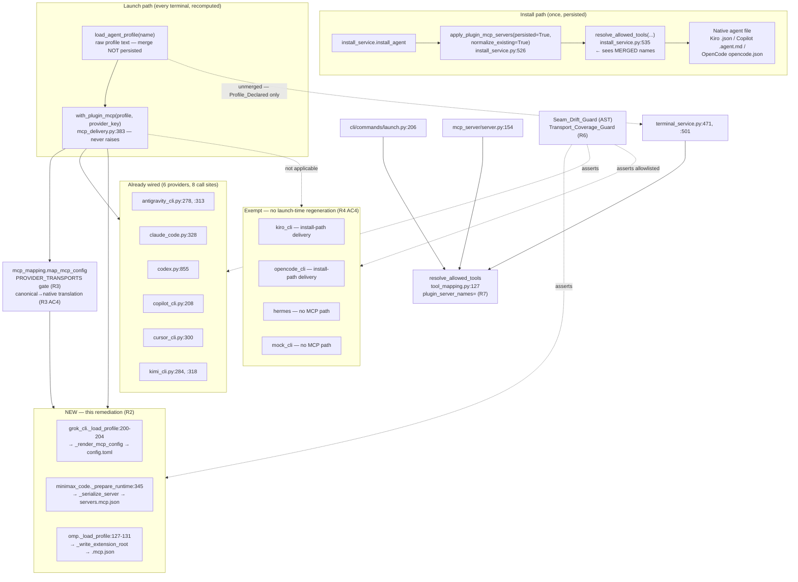
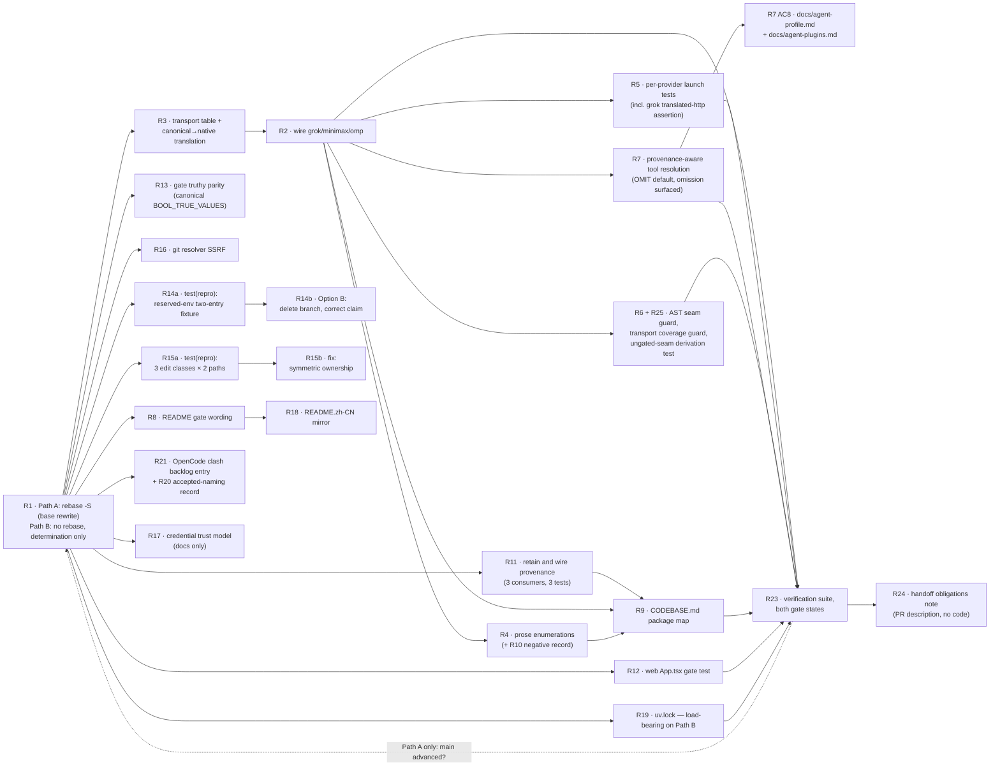
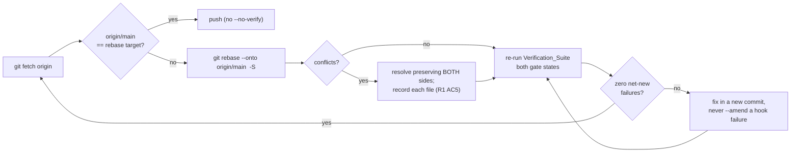
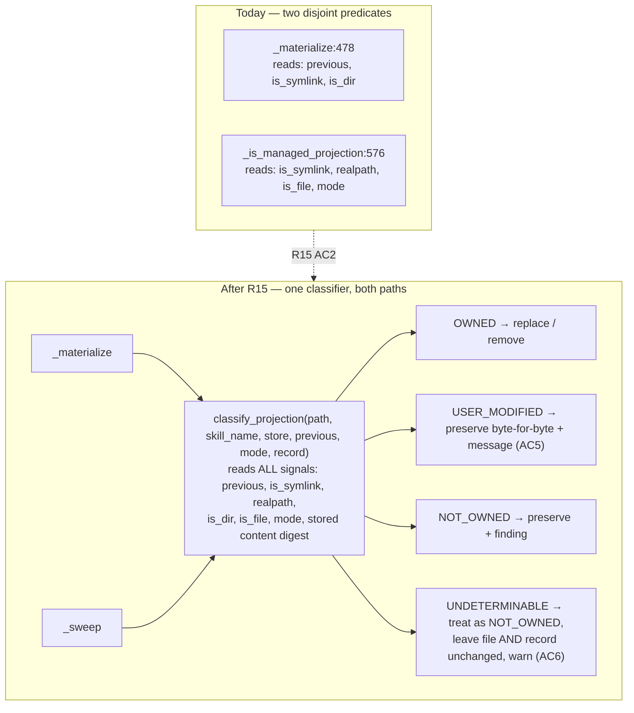

# Design Document

## Overview

This design turns the 25 requirements of `requirements.md` into an ordered, dependency-aware
implementation plan against the real code on branch `feat/agent-plugins-573-upstream` at head
`282839c1a189112db7dde5b9754a6e7102ef4068`.

The remediation is not one feature. It is **22 implementable work items** (Requirements 1–21 and 25,
with 22–24 as constraints and out-of-scope records) landing as focused Conventional Commits on top of
the base commit — rebased where the SSH signing key is available, and left as-is where it is not
(§2.3). The design's job is therefore three things:

1. **Sequence** the work so no commit is blocked by an undecided question, and so the rebase — where
   it happens at all — happens once (or repeatably) rather than being fought at every step.
2. **Name the exact edit sites** — file, symbol, current call shape, wrapped call shape — so the
   implementing agent never has to guess and never silently changes an adjacent behaviour.
3. **Implement the seven settled decisions** as primary, and keep the *exact* delta for each
   alternative as a marked reversal note, so a maintainer flip costs an edit, not a redesign.

**All seven decisions are settled.** The Rev 2 addendum to `HANDOFF-PR584-review-5074181308.md`
(plauzy/cli-agent-orchestrator PR #43, commit `b1be41b`, 2026-09-06) records D1–D7 and corrections
C1–C6. Nothing in this design is decision-gated any longer; §5 is a decision *record*, not a decision
*queue*. Where this design's earlier draft called a branch "recommended", the settled branch is now
stated as settled and the alternative is retained only as a reversal delta.

### Verification performed while writing this design

Every claim below was re-checked against the branch. Several requirement premises turned out to be
more specific, or different, than the requirements text assumes. Those are recorded here because the
design depends on the corrected facts, and because they change scope.

| # | Claim under test | Verified result | Effect on design |
|---|---|---|---|
| V1 | Branch is 1 ahead / 3 behind `main` | Confirmed. `main` = `5963ded`; the three commits ahead are `5963ded` (#712 status self-heal), `1483a3f` (#702 MCP workflow args), `7fed05b` (#693 EKS) | R1 is live. §2.3 |
| V2 | Rebase conflict surface | Merge-base `fb4cc817`. PR584 touches 194 files, `main` touches 81, **intersection is 8 files**: `README.md`, `api/main.py`, `constants.py`, `providers/claude_code.py`, `providers/copilot_cli.py`, `services/install_service.py`, `services/settings_service.py`, `uv.lock` | §2.3 conflict table |
| V3 | Rebase actually conflicts | **No.** A probe (`git rebase --onto main fb4cc817` in a throwaway worktree) completed with **zero conflicts**; all 8 files auto-merged under the default `ort` strategy | R1 AC4 is contingent, not certain. §2.3 |
| V4 | The base commit is signed | **Yes, SSH-signed** — `git cat-file commit 282839c1` carries `gpgsig -----BEGIN SSH SIGNATURE-----` (ed25519). The probe rebase **dropped the header entirely** | R1 must rebase with `-S`. §2.3.4 |
| V5 | `grok_cli`/`minimax_code`/`omp` read `profile.mcpServers` with no seam | Confirmed at `grok_cli.py:420`, `minimax_code.py:360-361`, `omp.py:176-177` | §3.1 |
| V6 | Six providers wired | Confirmed: `antigravity_cli` (×2 sites), `claude_code`, `codex`, `copilot_cli`, `cursor_cli`, `kimi_cli` (×2 sites) | §3.1 |
| V7 | `PROVIDER_TRANSPORTS` omits the three | Confirmed. 10 keys at `mcp_mapping.py:100-114`; `grok_cli`, `minimax_code`, `omp` absent; docstring at `:97` claims exhaustiveness | §3.2 |
| V8 | The three serializers carry URL transports | Confirmed. grok `_render_mcp_config` (`grok_cli.py:281`) accepts `type ∈ {"http","sse"}` and raises `ProviderError` otherwise; minimax `_serialize_server` (`minimax_code.py:255`) defaults `type` to `"http"`, maps `"http"`→`"streamable-http"`, accepts `{"streamable-http","sse"}`; omp `_write_extension_root` (`omp.py:182`) passes any entry through unchanged | §3.2 |
| V9 | `resolve_allowed_tools` has three merge-site callers | **Four callers, and only one is a merge site.** `install_service.py:535` is the only call whose profile has been through `apply_plugin_mcp_servers` (at `:526`). `terminal_service.py:471` and `:501`, `cli/commands/launch.py:206`, and a **fourth caller the requirements do not name** — `mcp_server/server.py:154` (`_resolve_child_allowed_tools`) — all read a raw `load_agent_profile()` | Materially simplifies §3.4 and changes its backward-compatibility story |
| V10 | R14: the `_map_stdio` reserved-env branch is unreachable | **Confirmed empirically.** `mcp.schema.json` encodes `env.propertyNames.not.enum: ["PLUGIN_ROOT","PLUGIN_DATA"]`; `map_mcp_config` calls `_schema_errors(cfg)` at `mcp_mapping.py:280` and **returns early for the whole document**. A two-server fixture (one reserved key, one valid) produced `valid=False`, `servers=[]`, `findings=["mcp.invalid"]` — zero entries mapped, no `mcp.env_reserved_key` emitted | R14 outcome **(b)**. §3.7, §6.1 |
| V11 | R10: repo prose claims "exactly two permanent exemptions" | **No occurrence exists.** A repo-wide search for `exactly two` / `two permanent exemption` / `two vocabulary` returns only unrelated hits (`docs/configuration.md:155`, `validation.py:451`, `step_result.py:104`, `terminal_service.py:1568`, three `tui/src/*.rs` lines, `docs/issues/*/design.md`). `_VOCABULARY_BACKLOG_DOCS` (`test_naming_migration.py:106-110`) has three entries | R10 AC3 branch fires. §3.13 |
| V12 | R11: `provenance.py` has no importer | Confirmed for `src/`, `web/`, `tui/`. **But it has 14 test assertion sites** across `test/agent_plugins/test_projection.py` (9) and `test_installer_property.py` (5), where `owning_plugin()` is the *oracle* for the collision rule — not tests that "only exercise" it. Two `projection.py` docstrings (`:235`, `:721`) and `docs/issues/573-agent-plugins/design.md` also reference it | Removal is **not** the smaller diff the handoff assumed. §3.9 |
| V13 | R19: the lock churn is pure churn | Confirmed and stronger: **`pyproject.toml` is byte-identical between `fb4cc817` and `282839c1`** — the branch adds no Python dependency. The 51-line churn is resolution-marker reordering plus marker *dropping* (e.g. `{ name = "zipp", marker = "python_full_version < '3.13'" }` → `{ name = "zipp" }`), i.e. a different `uv`/Python resolution. R19 AC2 therefore binds: the diff must be **empty** | §3.11 |
| V14 | R21: a Backlog_Doc exists | **It does not.** No `docs/*.md` carries a known-issues or backlog section. The repo's established pattern is an inline deferral note — `docs/agent-plugins.md:222` ("Pruning it outright needs provenance CAO does not yet record and is tracked as a follow-up") | §3.14 proposes the location |
| V15 | The delivery seam is gated | **It is not.** `agent_plugins_surface_enabled()` is consumed only by `api/main.py:2891` and `cli/commands/agent_plugin.py:126`. `with_plugin_mcp` → `apply_plugin_mcp_servers` → `merge_plugin_mcp_servers` → `collect_plugin_mcp_servers` never reads the gate | Load-bearing for R2 AC6, R5 AC4, Property 2. §3.1.4 |
| V16 | An AST-based structural guard has precedent | Yes — `test/agent_plugins/test_delivery_providers.py::test_agent_plugins_imports_nothing_from_the_event_plugin_package` uses `ast.parse`/`ast.walk` and states "Parsed rather than grepped: the package docstrings discuss the event-plugin import path by name, and a substring match would flag the prose" | §3.3 adopts and cites this precedent |
| V17 | R20 rename surface | `agent-plugin/` holds **23 files** in 2 packages. The literal string `agent-plugin/` occurs **60 times across 11 files**; plus 2 Makefile target names (`agent-plugin`, `check-agent-plugin`, both also in `.PHONY` at `Makefile:8-9`) and 2 CI `run:` lines (`ci.yml:57,63`) | §3.12 estimate |

**Rev 2 additions.** The rows below were added after the plan author's independent re-verification,
recorded in the Rev 2 addendum at PR #43 `b1be41b`. Each of the addendum's six corrections was checked
against the row of this table it bears on; all six **concur**, so no earlier row is retracted.

| # | Claim under test | Verified result | Effect on design |
|---|---|---|---|
| V18 | Addendum corrections C1–C6 agree with V9–V13 | **All six concur, none contradicts.** C1 ≡ V10 (schema `env.propertyNames.not.enum` rejects the whole document; `map_mcp_config` early-returns at `mcp_mapping.py:280`; the `_map_stdio` branch is dead and the per-entry-isolation claim is false). C2 ≡ V9 (only `install_service.py:526→535` feeds a merged map; `mcp_server/server.py:154` is the fourth caller the requirements did not name). C3 ≡ V11 ("exactly two permanent exemptions" appears nowhere in the repo; 10 unrelated hits; the claim lives only in the PR body). C4 ≡ V8 + §11.1 (grok `_render_mcp_config` at `grok_cli.py:281` raises `ProviderError` outside `{"http","sse"}`, so transports + translation land **before** the wiring). C5 names the SSRF sibling to mirror as `install_service.py:139-215` ≡ §3.6. C6 ≡ V13 (`pyproject.toml` byte-identical `fb4cc817`→`282839c1`, so the `uv.lock` diff must be empty, with `uv lock --check` as the drift guard) | No design fact changes. The design's premises are now doubly verified, which is why §5 can state settled branches rather than recommendations |
| V19 | The `owning_plugin` oracle assertion count | **14**, as V12 measured, and the addendum's D1 independently states **14** — the two counts agree. The distribution is 9 in `test/agent_plugins/test_projection.py` and 5 in `test_installer_property.py`. *No 14→16 discrepancy exists:* the addendum does not say 16, so the design's earlier figure of 14 stands unchanged and is used throughout §3.9, §5.2, and §11.8 | R11's retention branch is now primary (D1). §3.9 inverts |
| V20 | All seven decisions are settled | Confirmed. D1 retain-and-wire provenance; D2 R14 Option B; D3 `OMIT` default + `pluginMcp` opt-in + fail-closed, with two riders; D4 warn-only, no code change, named and dated; D5 canonical `BOOL_TRUE_VALUES` including `"on"`; D6 skip the rename, record accepted naming; D7 the seam stays ungated by design | §5 becomes a decision record. Every "blocked by **Dn**" cell in §2.2.3 clears |
| V21 | The rebase is optional, not required | Confirmed by V3 (zero-conflict probe) plus the addendum's rebase/signature constraint: the branch is **MERGEABLE** against `main` with zero conflicts, so the rebase is a nicety. Therefore, where the signing key is absent, *not rebasing at all* removes "unsigned rewrite of a signed commit" as a failure mode outright, rather than routing that failure mode to a human to catch | §2.3 splits into Path A (key present) and Path B (key absent, the default assumption). V4's signature risk is **eliminated** on Path B rather than mitigated |
| V22 | R25 (seam stays ungated) is a deliverable, not just a record | Confirmed: it carries a Docs_Set statement (R25 AC4) and a derivation test asserted at the artifact level (R25 AC3), and it forbids a guard clause in `with_plugin_mcp` (R25 AC1). It is therefore a work item, not a pure constraint | §2.2.3 folds it into C4 (the guard commit) — see the commit table's R25 row |

### The one premise correction that changes a requirement's shape

**V9 is the important one.** Requirement 7 was originally written as though three call sites each hand a
plugin-merged `mcpServers` map to `resolve_allowed_tools`. In fact:

- `install_service.py:526` merges, then `:535` resolves. **This is the whole widening vector.** The
  `allowed_tools` it computes is persisted into the provider's agent file (Kiro `<name>.json`,
  Copilot `<name>.agent.md`, OpenCode `opencode.json`), so a plugin install permanently widens the
  restricted profile's *stored* allowlist.
- `terminal_service.py:471`/`:501`, `launch.py:206`, and `mcp_server/server.py:154` each call
  `load_agent_profile()` directly and pass `list(profile.mcpServers.keys())`. Because
  `install_service._write_context_file` persists the **original raw profile text** (the merge is
  in-memory only — see the `with_plugin_mcp` docstring at `mcp_delivery.py:390-395`), those three
  sites see **Profile_Declared_Servers only, today and after R2 lands**.

Consequence: R7's plumbing is a *one-site* change plus a *three-site* signature-compatibility
guarantee, not a four-site refactor. The design keeps the signature backward-compatible so the three
unmerged sites need no edit at all, and adds a guard test that pins the asymmetry so a future merge
inserted upstream of them cannot silently reintroduce the widening.

### Non-goals

- No behaviour change to the six already-wired providers (R22 AC6 spirit; the seam call shape is
  reused verbatim).
- No change to `src/cli_agent_orchestrator/plugins/` — the Event_Plugin_Subsystem (R22 AC6).
- No weakening of `CAO_AGENT_PLUGINS_ENABLED`'s default-off posture (R22 AC1).
- No commit claiming to resolve `pullrequestreview-5074181308` (R24 AC3).
- No implementation of the four human process items (R24 AC1).

---

## Architecture

### 2.1 The launch-time profile → seam → serializer flow

The defect class is structural: a provider that re-reads the profile at launch and regenerates
native MCP config is a *second* consumer of `mcpServers`, and each such consumer must independently
pass through the seam. The diagram shows the flow after this remediation, with the three new wirings
marked.



Two facts the diagram is drawn to make unmissable:

- **`SEAM` is reached once per provider module, and only from the load that feeds MCP generation.**
  grok and omp each have a *second* loader (`grok_cli._try_load_profile:192`, used by
  `initialize:487` for the init timeout only) that must stay unwrapped — wrapping it would run the
  store read twice per launch for no delivery benefit. The seam-drift guard's allowlist therefore
  keys on *module*, not on *every* `mcpServers` read.
- **`RES` is downstream of the *unmerged* profile on three of its four callers.** That is why R7 is
  a one-site plumbing change.

### 2.2 Execution sequencing and commit plan

#### 2.2.1 Ordering principles

1. **R1 is first, and whether it produces a commit depends on the path.** On **Path A** (signing key
   present) it rewrites the base commit, so every later commit is authored against the rebased tree
   and doing any work item first means redoing it. On **Path B** (signing key absent) there is no
   rebase and no base rewrite: the work items land directly on `282839c1`, and R1's only artifact is
   the recorded determination plus the PR-description note (R1 AC1, AC10). §2.3 specifies both.
2. **No item is decision-gated any longer.** All seven decisions are settled (V20), so every commit's
   content is known before the batch starts. §5 records each settled branch and the delta that would
   reverse it; a reversal is a follow-up commit, never a blocker on this plan.
3. **Reproduction-first items (R14, R15) split into two commits**: `test(...)` capturing the
   reproduction, then `fix(...)` remediating what the reproduction showed. This satisfies R14 AC4 /
   R15 AC3 ("retain the fixture as a regression test") under *every* outcome branch, including the
   branch where no code change is needed.
4. **R22 AC5 is honoured inside each commit**, not in a docs sweep: the commit that changes a module
   also updates `CODEBASE.md` and the affected `docs/*.md`. The one exception is R9, which *is* the
   `CODEBASE.md` work item (§10.1 explains how the two interact).

#### 2.2.2 Commit dependency graph

Every decision node is gone: all seven are settled (V20), so the graph is pure work-item dependency.
R1 is now a *conditional* root — a base rewrite on Path A, a no-op determination on Path B.



Three structural changes from the pre-decision graph, all consequences of the settled branches:

- **The five decision diamonds (D1–D5) are deleted.** Nothing waits on a maintainer.
- **R11 is now a root**, not a child of a decision. Retention-and-wiring is the work, and its edge to
  R9 is now *unconditional*: R9 AC3's `provenance` row fires because the module is retained (§5.2).
- **R6 and R25 share a node.** R25's deliverable is a docs statement plus one derivation test, and the
  test belongs beside R6's guards because both are structural invariants of the seam (V22).
- **The re-rebase back-edge is Path-A-only.** On Path B there is no rebase to repeat; if `main`
  advances, the branch simply stays mergeable.

#### 2.2.3 The commit table

One row = one Conventional Commit (R22 AC4). "Blocked by" is a hard prerequisite; everything with
the same blocker set is parallelisable.

Every "**Dn**" blocker from the pre-decision draft is gone. The table has **24 rows** — 22 commit rows
(C0–C21, of which C0 is a commit only on Path A) plus the verification pass and the PR-description row
— and each row corresponds to exactly one node of §2.2.2's graph.

| # | Commit subject | Reqs | Blocked by | Touches |
|---|---|---|---|---|
| C0 | **Path A:** *(rebase — amends the base commit, no new commit)*. **Path B:** *(no commit — record the signing-key determination in the PR description; the work items land directly on `282839c1`)* | R1 | — | Path A: 8 auto-merged files, `uv.lock` per §2.3.5. Path B: **nothing on disk** |
| C1 | `feat(agent-plugins): record grok/minimax/omp MCP transports and translate canonical names` | R3 | C0 | `mcp_mapping.py` (docstring `:78-98`, `PROVIDER_TRANSPORTS` `:100`, new `_to_native_transport`), `test_mcp_mapping.py`, `docs/agent-plugins.md` |
| C2 | `fix(agent-plugins): deliver plugin MCP servers on grok/minimax/omp launch paths` | R2 | C1 | `grok_cli.py`, `minimax_code.py`, `omp.py`, `CODEBASE.md`, `docs/grok-cli.md`, `docs/minimax-code.md`, `docs/omp-cli.md` |
| C3 | `test(agent-plugins): assert plugin MCP delivery in grok/minimax/omp launch artifacts` | R5 | C2 | `test/agent_plugins/test_mcp_launch_delivery.py` |
| C4 | `test(agent-plugins): fail when a provider regenerates MCP config without the delivery seam` | R6, **R25** | C2 | new `test/agent_plugins/test_seam_drift_guard.py`; the R25 derivation test (gate off ⇒ empty store ⇒ no delivery, asserted at the artifact level) in the same file; `docs/agent-plugins.md`'s release-gate-not-a-data-path-switch statement (R25 AC4) |
| C5 | `docs(agent-plugins): name all nine wired providers in the delivery-seam prose` | R4, R10 | C2 | `mcp_delivery.py` docstrings (`:328`, `:383`), `docs/agent-plugins.md`, `test/test_agent_plugins_docs.py` |
| C6 | `fix(agent-plugins): align the ship gate's truthy spellings with the canonical set` | R13 | C0 | `constants.py` (promote `BOOL_TRUE_VALUES` incl. `"on"`), `gate.py`, `settings_service.py`, `test_ship_gate.py`, `docs/agent-plugins.md` |
| C7 | `fix(agent-plugins): harden the git plugin source resolver against SSRF` | R16 | C0 | `resolver.py`, `test_resolver.py`, `docs/agent-plugins.md` |
| C8 | `docs: state that every agent-plugins surface is default-off` | R8 | C0 | `README.md`, `test/test_agent_plugins_docs.py` |
| C9 | `docs(i18n): add the agent-plugins entry to the Chinese README` | R18 | C8 | `README.zh-CN.md`, `test/test_agent_plugins_docs.py` |
| C10 | `test(web): enforce the plugins-tab gate at the App level` | R12 | C0 | `web/src/test/app-plugins-gate.test.tsx` |
| C11 | `build(deps): restore the upstream uv.lock` | R19, **R1 AC8 on Path B** | C0 | `uv.lock`, `test/test_lockfile_drift.py`. **Path A:** near-no-op — the rebase already took `main`'s lock (§2.3.5), so the commit's content is the drift guard. **Path B:** *load-bearing* — this commit is the **only** thing that corrects the lock, because no rebase touched it. `uv lock --check` must exit 0 here (R1 AC8) |
| C12 | `test(agent-plugins): reproduce reserved-env handling across two stdio entries` | R14 AC3–AC5 | C0 | `test/agent_plugins/test_mcp_mapping.py` |
| C13 | `fix(agent-plugins): delete the dead reserved-env branch and correct the isolation claim` | R14 AC1–AC2, AC5–AC6 | C12 | `mcp_mapping.py` (delete `_map_stdio:452-468`; correct the `_map_stdio` docstring and the module-docstring bullet at `:28-30`), `docs/agent-plugins.md` (`:246-248` and `:264-268`), `test/agent_plugins/test_mcp_mapping.py`. Settled as **Option B** (D2) — §3.7 |
| C14 | `test(agent-plugins): reproduce projection ownership across materialize and sweep` | R15 AC1, AC3 | C0 | `test/agent_plugins/test_projection_ownership.py` |
| C15 | `fix(agent-plugins): make materialize and sweep agree on projection ownership` | R15 AC2, AC5–6 | C14 | `projection.py`, `models.py`, `docs/skills.md` |
| C16 | `feat(agent-plugins): surface skill provenance in plugin list, skills list, and the web panel` | R11 | C0 | `cli/commands/agent_plugin.py`, the skills CLI listing, `api/main.py`'s `/plugins` payload, `web/src/components/PluginsPanel.tsx`, three new tests, `projection.py` docstrings (`:235`, `:721`) left as-is. **`provenance.py` and all 14 oracle assertions untouched.** Settled as retain-and-wire (D1) — §3.9 |
| C17 | `docs: add the agent_plugins package to the codebase map` | R9 | C2, C5, C16 | `CODEBASE.md` |
| C18 | `fix(security): stop plugin MCP servers from widening restricted allowlists` | R7 AC1–AC7, AC9–AC15 | C2 | `tool_mapping.py`, `install_service.py`, `cli/commands/agent_plugin.py`, `models/agent_profile.py`, `test_tool_mapping.py`, new `test/utils/test_tool_mapping_provenance.py`. Includes the two D3 riders: the sub-WARNING omission log record (AC13) and the plugin-list omission surfacing (AC14) |
| C19 | `docs: document the plugin-MCP opt-in setting` | R7 AC8 | C18 | `docs/agent-profile.md`, `docs/agent-plugins.md` |
| C20 | `docs(agent-plugins): record the credential-shaped env value trust model` | R17 | C0 | `docs/agent-plugins.md` only. **No code change** — settled warn-only (D4). The decision is named and dated (`Rev 2 addendum D4, 2026-09-06`, PR #43 `b1be41b`) per R17 AC3 |
| C21 | `docs(agent-plugins): track the OpenCode shared-file profile-name clash and record the accepted package name` | R21, **R20** | C0 | `docs/agent-plugins.md`, `docs/opencode-cli.md`, `test/test_agent_plugins_docs.py`. Carries R20's recorded-acceptance line: the Package_Dir stays `agent-plugin/`, with the measured cost (60 occurrences, 11 files, 23 moves, `Makefile` + CI targets) and the reason the rename was declined (D6) |
| C23 | *(no commit)* verification pass | R23 | all above | — |
| C24 | *(PR description only)* | R24 | C23 | — |

**R20 no longer has a code commit.** The pre-decision draft carried `C22 refactor: rename agent-plugin
to agent-plugins` as the last code commit. D6 settles the rename as *declined*, so that row is deleted
and R20's entire deliverable is the recorded-acceptance line folded into **C21** (R20 AC1–AC3) plus the
"leave these files unchanged" non-action (R20 AC4–AC5), which needs no commit of its own. §5.5 keeps the
rename's full delta as the reversal note.

**R25 has no commit of its own either** — it is folded into **C4**, as the third row of that commit's
content: the derivation test beside R6's two structural guards, and the `docs/agent-plugins.md`
statement that the Ship_Gate is a management-surface release gate rather than a data-path switch. R25's
other two criteria are non-actions (AC1: add no guard clause to `with_plugin_mcp`; AC5: a future
reversal is a separate ~15-line change), and a non-action does not earn a commit row.

#### 2.2.4 Explicit dependency rationales

- **R3 before R2.** Wiring grok before its transport entry exists sends a `streamable-http` plugin
  entry into `_render_mcp_config`, whose `transport not in {"http","sse"}` branch raises
  `ProviderError` (`grok_cli.py:296-300`) and **aborts the launch**. The transport table plus the
  canonical→native translation must exist first so that the entry is either translated (`"http"`) or
  reported as a skip. This is the single most important ordering constraint in the plan; §11.1
  treats it as the top risk.
- **R11 before R9 — and the reason has changed.** In the pre-decision draft this edge existed because
  R9 AC3 was *conditional* on R11's outcome: the `CODEBASE.md` module list would include `provenance`
  only if the module survived. With D1 settled as retain-and-wire, **R9 AC3 now fires
  unconditionally** — the `provenance` row is going into the package map either way, so the edge is no
  longer about avoiding a rework of a conditional row. It survives for a different and weaker reason:
  R9 AC3 requires the `provenance` line to *name the three consumers that read it*, and those three
  consumers do not exist until C16 lands. Writing C17 first would leave the row naming consumers that
  are not yet wired. The ordering is therefore still correct, but a violation now costs an inaccurate
  sentence rather than a deleted row.
- **R2 before R4.** R4 AC1/AC2 must state the *current* wired count and name the *nine* providers;
  the count is only nine after R2 lands.
- **R2 before R7.** R7's `plugin_server_names` derivation reads `McpDeliveryResult.accepted`, whose
  provider-scoped content depends on the transport table and on which providers deliver.
- **R2, R5, R6 before R23 AC5/AC6/AC10.** Those three spot-checks are literally assertions about
  the R2/R3/R6 artifacts.
- **R8 before R18.** R18 AC2 requires the Chinese text to mirror "the corrected English text of
  Requirement 8" — the corrected text must exist to be mirrored.
- **R20 has no ordering constraint any more.** The pre-decision draft placed the rename last, because a
  60-occurrence path rename is a textual landmine for every other commit's diff. D6 declines the
  rename, so there is nothing to order: R20's deliverable is a record inside C21, which is
  order-independent.
- **R25 with R6.** Both are structural invariants of the seam, and R25's derivation test reads the same
  artifacts R6's guards walk. Landing them together keeps "the seam is ungated, and here is why that is
  safe" as one reviewable unit (V22).
- **R19 interacts with R1, and the strength of that interaction is path-dependent.** See §2.3.5. On
  **Path A** the rebase already takes `main`'s lock, so C11 is a near-no-op whose content is the drift
  guard. On **Path B** there is no rebase, so C11 is the *only* correction of the lock and is fully
  load-bearing — R1 AC8 binds directly on it.

#### 2.2.5 Parallelisable batches

Given C0 — which on Path B is a determination rather than a commit, so the batches can start
immediately — these batches have no inter-batch ordering:

- **Batch A (seam):** C1 → C2 → {C3, C4, C5}. C4 now also carries R25's derivation test and docs
  statement.
- **Batch B (independent fixes):** C7, C8→C9, C10, C11, C21 — five commits, no shared files with
  Batch A. On Path B, **C11 is promoted from housekeeping to a required correction** and should not be
  deferred to the end of the batch.
- **Batch C (reproduction-first):** C12→C13, C14→C15. C13 is now the single Option B commit.
- **Batch D (formerly "decision-gated", now simply the remaining settled work):** C6, C16, C18→C19,
  C20. **C22 is gone** — the rename is declined (D6) and its record rides in C21, which is in Batch B.

The batch count is unchanged at four, but Batch D loses one commit (C22) and gains no dependency, and
**no batch waits on an answer** — the pre-decision draft's Batch D could not start until D1–D5 arrived.
Only C17 (`CODEBASE.md`) and C23 (verification) join the batches back together.

#### 2.2.6 The re-rebase loop

**Path A only.** R1 AC12 requires repeating the rebase if `main` advances before the push *and* the
signing key is available. On Path B there is no rebase to repeat: if `main` advances, the branch simply
remains mergeable, and the only re-run obligation is R1 AC11's Verification_Suite pass. The loop below
therefore applies to Path A. The loop:



The loop's exit condition is `git rev-list --count origin/main..HEAD` unchanged *and*
`git rev-list --count HEAD..origin/main == 0` (R1 AC4). Because the work-item commits sit **on top
of** the rebased base, the second and subsequent rebases replay `1 + n` commits, and the new commits
touch files (`grok_cli.py`, `minimax_code.py`, `omp.py`, `mcp_mapping.py`, `resolver.py`,
`projection.py`, `tool_mapping.py`, `gate.py`) of which only `grok_cli.py` is in the observed `main`
churn set — see §2.3.3.

### 2.3 Rebase strategy (R1)

#### 2.3.1 The shape of the problem, and the two paths

One commit, `282839c1`: 194 files, +27556/−124, SSH-signed, parent `fb4cc817`. `main` is at
`5963ded`, three commits ahead of that parent.

Two facts, taken together, restructure this section:

- **V4:** `282839c1` carries an SSH `gpgsig`, and the probe rebase **dropped the header entirely**. An
  unsigned rewrite of a signed commit must never be pushed.
- **V3 / V21:** the branch is **MERGEABLE against `main` with zero conflicts**. The rebase buys
  reviewers a current base — a nicety — and buys correctness nothing.

The pre-decision draft resolved this by making the rebase mandatory and routing the no-key case to a
human as a handoff item. **The settled decision reverses that.** If the signing key is unavailable, do
not rebase *at all*: land the work as ordered commits on top of the existing signed head. This removes
"unsigned rewrite of a signed commit" as a failure mode outright, instead of creating it and then asking
a person to catch it. Recorded in the Rev 2 addendum's rebase/signature constraint at PR #43 `b1be41b`.

So R1 has two paths, keyed on one environment probe:

| | **Path A — signing key present** | **Path B — signing key absent (the default assumption)** |
|---|---|---|
| Selected when | The SSH key that signed `282839c1` is available to the executing session, *confirmed* — not assumed | Anything else: key missing, unknown, or unverified |
| Rebase | `rebase -S` onto `origin/main` (§2.3.4) | **None.** `282839c1` is untouched |
| Base commit | `282839c1'` — same content, new parent, re-signed | `282839c1` — byte-identical, signature intact |
| Work items | Commits 2..n on the rebased base | Commits 2..n on `282839c1` |
| `uv.lock` | Corrected inside the rebase (§2.3.5); C11 is the drift guard | Corrected in **C11**, a normal work-item commit (R1 AC8); `uv lock --check` binds there |
| Signing of new commits | The session signs as it commits | Left to the author's push (R1 AC9) |
| R1 criteria in play | AC1–AC6, AC11–AC13 | AC1, AC7–AC11, AC13 |
| PR description records | The rebase target, resolved files, the `^gpgsig` result | That the branch was **not** rebased, that it is mergeable with zero conflicts, and that the base signature is intact (R1 AC10) |
| Signature risk | Mitigated (§2.3.4's three post-conditions) | **Eliminated** — there is no rewrite to sign |

**Default to Path B unless the key is confirmed present.** R1 AC1 makes the determination an explicit,
recorded step before the first work-item commit, precisely so that "we assumed the key was there" cannot
become "we pushed an unsigned rewrite". If the Path A `^gpgsig` check fails after a rebase, R1 AC6
requires discarding the rewritten history, pushing nothing, and falling back to Path B.

Either path satisfies "one focused commit per work item" (R1 AC13) — §2.3.2 shows why, for both.

#### 2.3.2 How "one commit per work item" coexists with a single-commit history

R1 AC13 and R22 AC4 are satisfied **structurally, not by rewriting the base commit** — on either path.

**Path A** (rebase, base rewritten in place, work items on top):

```
fb4cc817 (old merge-base)
   └── 282839c1  feat(agent-plugins): Agent Plugins 1.0.0 support     ← the PR's single commit

                          ↓ rebase --onto main fb4cc817 -S

5963ded (main)
   └── 282839c1'  feat(agent-plugins): Agent Plugins 1.0.0 support    ← same content, new parent, re-signed
        ├── C1  feat(agent-plugins): record grok/minimax/omp MCP transports …
        ├── C2  fix(agent-plugins): deliver plugin MCP servers on grok/minimax/omp …
        ├── C3  test(agent-plugins): …
        └── …   (one commit per work item, C4…C21)
```

The rebase **preserves** the base commit as commit 1 of the branch; the work items become commits
2..n on top. Nothing is squashed into the base. This is what makes the post-rebase history reviewable
per work item (R1 AC13) *and* keeps R1 AC4's "retain every change of `282839c1`" trivially true.

**Path B** (no rebase — the base keeps its original parent *and* its original signature):

```
fb4cc817 (old merge-base)                    5963ded (main)  ← advances independently;
   └── 282839c1  feat(agent-plugins): …           branch stays MERGEABLE, zero conflicts
        │         ← UNTOUCHED: same SHA, gpgsig intact, reviewers' line anchors intact
        ├── C1  feat(agent-plugins): record grok/minimax/omp MCP transports …
        ├── C2  fix(agent-plugins): deliver plugin MCP servers on grok/minimax/omp …
        ├── C3  test(agent-plugins): …
        ├── C11 build(deps): restore the upstream uv.lock   ← load-bearing here (R1 AC8)
        └── …   (one commit per work item, C4…C21)
```

The shapes are the same above the base; they differ only in whether the base was rewritten. Path B is
strictly *less* invasive: the branch is still one signed commit plus n focused work-item commits, and
`282839c1`'s SHA — which every existing review comment anchors to — does not move at all. What Path B
gives up is a current base, and V3 shows that costs nothing mechanically: the merge is clean either way.

Explicitly rejected alternatives (both paths):

- **Interactive-rebase splitting of `282839c1` into per-subsystem commits.** Not requested, destroys
  the reviewers' existing line anchors, and re-signing 20 synthetic commits multiplies V4's risk.
- **Merging `main` into the branch instead of rebasing.** Violates R1 AC4's spirit — `0 behind` would be
  true, but the branch would carry a merge commit the upstream repo's linear history does not want — and
  makes `git diff main...HEAD -- uv.lock` (R23 AC9) read a three-way base. Note this is *not* what Path B
  does: Path B adds no merge commit and makes no claim to be up to date. It simply leaves the base where
  it is and reports that fact in the PR description (R1 AC10).
- **Rebasing unsigned "just to get a current base".** This is the option the settled decision exists to
  forbid. A visible signature regression is a worse review outcome than a three-commit-stale base.

#### 2.3.3 Conflict surface and expected resolutions (Path A)

**Path A only.** On Path B nothing is replayed, so there is no conflict surface at all — that is the
point of choosing it. The table remains relevant to Path B in exactly one indirect way: it is the
evidence that the branch *is* mergeable, which is what R1 AC10 requires be recorded in the PR
description.

The intersection of PR584's 194 files and `main`'s 81 files is **8 files** (V2). The probe (V3)
auto-merged all eight, so the table below is a *contingency* map for the re-rebase case, ordered by
risk.

| File | PR584 Δ | `main` Δ (commit) | Region overlap | Resolution rule |
|---|---|---|---|---|
| `services/install_service.py` | +246 −18 | +27 −0 (`7fed05b`) | PR584 adds the plugin merge at `:526` and the `_download_agent` SSRF block is untouched; `main` adds elastic-worker fields | Keep both. PR584's hunk is in `install_agent`; `main`'s is elsewhere in the module. |
| `api/main.py` | +230 −0 | +188 −3 (`7fed05b`, `5963ded`) | PR584 appends the four `/plugins*` routes at end of file; `main` edits earlier handlers | Keep both. If the tail hunk conflicts, PR584's routes go **after** `main`'s additions. |
| `providers/claude_code.py` | +2 −1 | +129 −13 (`7fed05b`) | PR584's Δ is the two-line seam wiring (`:19` import, `:328` wrap); `main` rewrites init/timeout logic | Keep both; re-verify the wrap still sits inside the profile-loading helper `main` may have moved. **The one file where a semantic re-check is mandatory.** |
| `services/settings_service.py` | +37 −0 | +45 −0 (`7fed05b`) | Both append new getters | Keep both; then re-check `_BOOL_TRUE_VALUES` (`:24`) is still the canonical set R13 mirrors. |
| `providers/copilot_cli.py` | +30 −0 | +10 −2 (`5963ded`) | PR584 adds `_build_runtime_mcp_config` seam use at `:208`; `main` edits the init `get_status` docstring/await | Keep both. |
| `constants.py` | +16 −0 | +22 −0 (`7fed05b`) | Both append constants | Keep both. R13 adds `BOOL_TRUE_VALUES` here later — re-check for a name clash with `main`'s new constants. |
| `README.md` | +5 −1 | +2 −0 (`7fed05b`) | PR584 edits the "Configure and integrate" list (`:148-152`); `main` adds an EKS example link | Keep both. R8 then rewrites PR584's side. |
| `uv.lock` | +23 −28 | +0 −5 (`7fed05b`) | Whole-file marker churn vs a 5-line removal | **Special-cased — see §2.3.5.** |

Beyond the base commit, the *work-item* commits introduce a second, smaller conflict surface for
re-rebases: `providers/grok_cli.py` is the only file both this remediation and `main` (`5963ded`,
+5 −3 at `:531` in `_wait_for_startup_ready`) touch. C2's edit is at `:200-204` in `_load_profile`,
~330 lines away — a textual conflict is not expected, and a resolution keeping both is trivially
correct.

#### 2.3.4 Preserving the signature — Path A (V4)

**This subsection is the Path A design, unchanged from the pre-decision draft.** It applies only when
the signing key is confirmed available. Path B's answer to the same problem is §2.3.4b: do not create
the problem.

The probe rebase produced a commit whose raw object has **no `gpgsig` header**. `git rebase` does not
re-sign by default. The rebase MUST therefore be:

```bash
git -c commit.gpgsign=true \
    -c gpg.format=ssh \
    -c user.signingkey="<the author's ed25519 public key or path>" \
    rebase -S --onto origin/main fb4cc81790e4c6c416ad2288134a708b5cdca982
```

Post-conditions to assert before pushing (all three, because `%G?` alone is misleading in an
environment without `gpg.ssh.allowedSignersFile`):

1. `git cat-file commit HEAD~n | grep -q '^gpgsig'` for the rebased base commit — the header exists.
2. `git log --format='%H %G?' origin/main..HEAD` — every commit reports `G` or `U`, never `N`,
   *once* `gpg.ssh.allowedSignersFile` is configured. Where it is not configured, fall back to (1)
   for every commit.
3. `git log -1 --format='%aN <%aE>' <base>` is unchanged from `282839c1`'s author
   (`plauzy <4451274+plauzy@users.noreply.github.com>`) — the rebase preserves author identity but
   rewrites the committer; that is expected and acceptable.

If post-condition (1) does not match, R1 AC6 applies: **discard the rewritten history, push nothing,
and switch to Path B.** Do not attempt to repair the signature on a pushed branch.

#### 2.3.4b Path B — there is no signature to preserve

The pre-decision draft ended §2.3.4 by making the no-key case a **human handoff item**: leave the rebase
undone, add it to the R24 list, and let a person with the key perform it later. The settled decision
replaces that with something stronger — *the rebase is simply not done, by anyone, and nothing is owed.*

The reasoning:

1. **The rebase is a nicety.** V3/V21: the branch merges into `main` with zero conflicts. A stale base
   costs reviewers a small amount of context and costs the merge nothing.
2. **A handoff item is a deferred failure mode, not a mitigation.** "A human must remember to rebase
   with signing" is a step that can be skipped, forgotten, or done wrong under time pressure — and doing
   it wrong means pushing an unsigned rewrite of a signed commit, which is precisely the outcome the
   constraint exists to prevent. Removing the step removes the failure mode.
3. **`282839c1` keeps its SHA.** Every line anchor in the standing review comments still resolves. On
   Path A those anchors survive only because the *content* is identical; on Path B they survive because
   nothing moved.

Path B's obligations are therefore all recording obligations, not git operations:

- Record the signing-key determination before the first work-item commit (R1 AC1).
- Make no change to `282839c1` itself (R1 AC9).
- Correct `uv.lock` in C11 as a normal work-item commit, verified with `uv lock --check` (R1 AC8, §2.3.5).
- Leave signing of the new commits to the author's push (R1 AC9). The session commits unsigned *new*
  commits, which is not a rewrite of anything signed and is what the author's push resolves.
- Record in the PR description that the branch was not rebased, that it is mergeable against
  Upstream_Main with zero conflicts, and that the base commit's signature is intact (R1 AC10).

There is deliberately **no** R24 handoff item for the rebase. It is not deferred work; it is declined
work, and the PR description says so.

#### 2.3.5 `uv.lock` during the rebase, and its interaction with R19

Because `pyproject.toml` is byte-identical between `fb4cc817` and `282839c1` (V13, confirmed by the
addendum's C6), the branch's `uv.lock` delta is *entirely* unnecessary. Both paths end with the branch
carrying `main`'s lock verbatim; they differ in **which commit does it**.

**Path A.** Resolve the `uv.lock` conflict (or, if it auto-merges, follow up immediately in the same
rebase) by taking `main`'s copy verbatim:

```bash
git checkout origin/main -- uv.lock
uv lock --check          # must exit 0: proves main's lock satisfies this branch's pyproject
```

Record `uv.lock` in the rebase note per R1 AC5. R19 AC2 is then satisfied by construction, and C11's
content becomes purely the **drift guard** (§3.11) that keeps it empty — which is what makes Property 12
testable.

**Path B — C11 is the only correction, and it is load-bearing.** There is no rebase, so nothing takes
`main`'s lock implicitly. C11 does the whole job as a normal work-item commit (R1 AC8):

```bash
git checkout origin/main -- uv.lock
uv lock --check          # R1 AC8 binds this check to THIS commit
git commit -m "build(deps): restore the upstream uv.lock"
```

R19 AC2 remains binding on that commit. The commit body records `uv --version` and the Python version,
per the failure branch below.

##### R23 AC9's spot-check needs a two-dot form on Path B — verified

R23 AC9 states the spot-check as `git diff main...HEAD -- uv.lock`. **Three dots is correct on Path A and
wrong on Path B**, and this was checked against the real objects rather than reasoned about:

| Ref | `uv.lock` blob |
|---|---|
| `fb4cc817` (merge-base) | `55a6b13c` |
| `282839c1` (branch head) | `e100ca48` |
| `origin/main` | `79a7587e` |

`git merge-base origin/main 282839c1` is **`fb4cc817`**, and `git diff --stat fb4cc817 origin/main --
uv.lock` is **`1 file changed, 5 deletions(-)`** — `main`'s own lock change from `7fed05b` (V2).

Three-dot `A...B` diffs `merge-base(A,B)` against `B`, so:

- **Path A.** The rebase moves the branch onto `main`, so `merge-base(main, HEAD) == main`. Three-dot and
  two-dot are then **identical**, and `git diff main...HEAD -- uv.lock` is empty exactly when the lock
  matches `main`. R23 AC9 works as written.
- **Path B.** The base is not moved, so `merge-base(main, HEAD)` stays `fb4cc817`. The three-dot form
  therefore diffs `fb4cc817` against `HEAD` — and once C11 has set the lock to `main`'s copy, that diff
  reports **`main`'s own 5-line deletion** as though it were the branch's change. The check would report a
  5-line diff on a branch whose lock is byte-identical to `main`: **a false failure.**

**Adjustment (Path B only).** Use the two-dot form, which compares the two tips' content directly:

```bash
git diff origin/main HEAD -- uv.lock     # must be empty (R19 AC2)
git diff --quiet origin/main HEAD -- uv.lock && echo "lock matches main"
```

Equivalently `git diff origin/main -- uv.lock` on a clean worktree. This is empty **iff** `HEAD`'s lock
blob equals `main`'s (`79a7587e`), which is what R19 AC2 actually asks for — "the `uv.lock` diff against
Upstream_Main SHALL be empty" is a statement about the two tips, not about the merge base. The drift
guard of §3.11 must select the same form for the path in play, and C11's body records which form was used
and why. Note the two-dot form is *also* correct on Path A (where it coincides with the three-dot form),
so an implementation that simply always uses two dots is correct on both paths — that is the recommended
simplification, and R23 AC9's three-dot wording should be read as satisfied by it.

If `uv lock --check` **fails** against `main`'s copy, then `pyproject.toml` and the lock genuinely
disagree on `main` — an upstream problem, not this branch's. In that case R19 AC3 applies: regenerate
with `uv lock`, and record in C11's body the `uv --version` and Python version used, because V13
shows the observed churn is exactly tool-version-dependent. This applies identically on both paths.

#### 2.3.6 Verification after the selected path (R1 AC11)

R1 AC11 requires the Verification_Suite to "run in full and report zero net-new failures compared to the
Upstream_Main tip" on **whichever path was selected**. That is a *differential* claim and needs a
baseline. The baseline ref differs slightly by path: on Path A it is the rebase target; on Path B it is
`origin/main` at the time of verification, which is the tip the branch will merge into.

```bash
# baseline, in a pristine worktree at the rebase target (Path A) or origin/main (Path B)
git worktree add /tmp/base-main origin/main
(cd /tmp/base-main && uv run pytest -q 2>&1 | tail -40) > /tmp/baseline.txt
# candidate
uv run pytest -q 2>&1 | tail -40 > /tmp/candidate.txt
diff <(grep -oE '^[A-Za-z0-9_/.]+::[A-Za-z0-9_:]+' /tmp/baseline.txt | sort) \
     <(grep -oE '^[A-Za-z0-9_/.]+::[A-Za-z0-9_:]+' /tmp/candidate.txt | sort)
```

On Path A the baseline must be captured **once per rebase target** and re-captured whenever the target
moves (R1 AC12). On Path B there is no rebase target to track, so the baseline is captured once against
`origin/main` and re-captured only if `main` advances before the push. The review record notes numpy
build failures on old GCC blocked the author's local run; where the baseline cannot be produced locally,
R1 AC11's evidence is the CI run on the branch compared against CI on `main` at the same SHA — record
which was used.


---

## Components and Interfaces

### 3.1 The delivery seam (R2, R4)

#### 3.1.1 Why wrapping, not replacing

`with_plugin_mcp`'s own docstring (`mcp_delivery.py:405-410`) states the constraint:

> Deliberately shaped as `f(profile) -> profile` wrapping the provider's existing
> `load_agent_profile` call rather than replacing that call with a combined loader: the providers'
> own tests patch `load_agent_profile` in each provider module, and a replacement would have
> silently escaped every one of those patches.

This is verifiable, not stylistic. `test/agent_plugins/test_mcp_launch_delivery.py:110` does
`monkeypatch.setattr(mod, "load_agent_profile", lambda _name: _profile_stub())`. A combined loader
(`load_profile_with_plugins(name)`) would be a *different module attribute*, so the patch would land
on a now-unused symbol, the real loader would run, and the test would read the developer's real
profile store. Every wiring below therefore keeps `load_agent_profile(...)` as the inner call.

The canonical shape is `kimi_cli.py:284`:

```python
return _with_plugin_mcp(load_agent_profile(self._agent_profile), "kimi_cli")
```

#### 3.1.2 Exact edit sites

**Site 1 — `providers/grok_cli.py`.** Two loaders exist. Only `_load_profile` feeds MCP generation.

Import, after the existing `load_agent_profile` import at `:39`:

```python
# line 39 today:
from cli_agent_orchestrator.utils.agent_profiles import load_agent_profile
# add:
from cli_agent_orchestrator.agent_plugins.mcp_delivery import with_plugin_mcp as _with_plugin_mcp
```

`_load_profile` (`:200-210`) today:

```python
    def _load_profile(self):
        if self._agent_profile is None:
            return None
        try:
            return load_agent_profile(self._agent_profile)          # ← :204
        except FileNotFoundError:
            raise
        except Exception as exc:
            raise ProviderError(
                f"Failed to load agent profile '{self._agent_profile}': {exc}"
            ) from exc
```

wrapped:

```python
    def _load_profile(self):
        if self._agent_profile is None:
            return None
        try:
            # The MCP-feeding load: `_build_grok_command` hands this profile's
            # `mcpServers` to `_prepare_grok_home` -> `_render_mcp_config`, so the
            # Agent-Plugins merge must happen here or a plugin's server never
            # reaches config.toml. `_try_load_profile` is deliberately NOT wrapped:
            # `initialize` uses it only for the init timeout.
            return _with_plugin_mcp(load_agent_profile(self._agent_profile), "grok_cli")
        except FileNotFoundError:
            raise
        except Exception as exc:
            raise ProviderError(
                f"Failed to load agent profile '{self._agent_profile}': {exc}"
            ) from exc
```

Consumer chain confirmed: `_build_grok_command:419` → `profile.mcpServers` `:420` →
`_prepare_grok_home:393` → `_render_mcp_config:281` → `config.toml` write at `:406`.

**Site 2 — `providers/minimax_code.py`.** The load is inline in `_prepare_runtime`, not in a helper.
`_try_load_profile:398` (used by status/init) stays unwrapped.

Import after `:22`; then `_prepare_runtime` (`:341-349`) today:

```python
    def _prepare_runtime(self) -> tuple[Path, str]:
        profile = None
        if self._agent_profile is not None:
            try:
                profile = load_agent_profile(self._agent_profile)        # ← :345
            except Exception as exc:
                raise ProviderError(
                    f"Failed to load agent profile {self._agent_profile!r}: {exc}"
                ) from exc
```

wrapped:

```python
                # `_write_plugin(data_dir, profile.mcpServers)` below regenerates
                # servers.mcp.json from this profile, so the merge belongs on this
                # read. `_try_load_profile` is not wrapped: it feeds status only.
                profile = _with_plugin_mcp(
                    load_agent_profile(self._agent_profile), "minimax_code"
                )
```

Consumer chain confirmed: `_prepare_runtime:360-361` → `_write_plugin:308` → `_serialize_server:255`
→ `plugins/<name>/servers.mcp.json` write at `:335-337`.

**Site 3 — `providers/omp.py`.** One loader, used only by the command build.

Import after `:24`; `_load_profile` (`:127-135`) today:

```python
    def _load_profile(self):
        if self._agent_profile is None:
            return None
        try:
            return load_agent_profile(self._agent_profile)          # ← :131
        except Exception as exc:
            raise ProviderError(
                f"Failed to load agent profile '{self._agent_profile}': {exc}"
            ) from exc
```

wrapped:

```python
            # `_build_omp_command` passes this profile's `mcpServers` to
            # `_write_extension_root`, which writes the extension root's .mcp.json.
            return _with_plugin_mcp(load_agent_profile(self._agent_profile), "omp")
```

Consumer chain confirmed: `_build_omp_command:157` → `:176-177` → `_write_extension_root:182` →
`<artifact_root>/.mcp.json` write at `:201-204`.

#### 3.1.3 R2 AC5 — the "second unwrapped read" guarantee

R2 AC5 asks that every load feeding MCP generation be wrapped, and the handoff adds "make sure a
second unwrapped read cannot be reintroduced". The three modules each end up with exactly one
MCP-feeding loader, and the guarantee that it stays that way is **structural, not editorial**: the
Seam_Drift_Guard (§3.3) fails if any provider module contains an `mcpServers` attribute read whose
enclosing module does not also contain a `with_plugin_mcp` call. Reintroducing an unwrapped read in a
*new* helper inside an already-wired module would not be caught by a module-level guard, so §3.3.4
adds a second, function-scoped assertion for exactly that case.

#### 3.1.4 The nine wired providers and the four exemptions (R4)

| Provider key | Seam call site(s) | Native MCP artifact | Transport support (R3) |
|---|---|---|---|
| `antigravity_cli` | `antigravity_cli.py:278`, `:313` | `mcp_config.json` via `_register_mcp_servers` | stdio only — always writes `{command,args,env}` |
| `claude_code` | `claude_code.py:328` | `--mcp-config <path>` JSON | stdio + streamable-http + sse — entry passed through |
| `codex` | `codex.py:855` | `-c mcp_servers.<name>.*` TOML overrides | stdio only — no `url` branch |
| `copilot_cli` | `copilot_cli.py:208` | runtime `mcpServers` JSON | stdio + streamable-http + sse |
| `cursor_cli` | `cursor_cli.py:300` | plugin dir manifest `{"mcpServers": …}` | stdio + streamable-http + sse |
| `kimi_cli` | `kimi_cli.py:284`, `:318` | `--mcp-config <json>` | stdio + streamable-http + sse |
| **`grok_cli`** | **NEW** `grok_cli.py:204` | `config.toml` `[mcp_servers.<name>]` | **stdio + streamable-http + sse** (translated, §3.2) |
| **`minimax_code`** | **NEW** `minimax_code.py:345` | `plugins/<name>/servers.mcp.json` | **stdio + streamable-http + sse** |
| **`omp`** | **NEW** `omp.py:131` | extension root `.mcp.json` | **stdio + streamable-http + sse** (pass-through) |

| Exempt provider | Why no Delivery_Seam is needed | Evidence |
|---|---|---|
| `kiro_cli` | No launch-time MCP regeneration. MCP arrives on the **install path**: `install_service` writes `<name>.json` with resolved `mcpServers`, and Kiro reads that file. | `grep -n mcpServers providers/kiro_cli.py` → no match. `PROVIDER_TRANSPORTS["kiro_cli"] = _ALL_TRANSPORTS` already exists. |
| `opencode_cli` | Same: MCP arrives on the install path through `utils/opencode_config.translate_mcp_server_config` editing the shared `opencode.json`. | `grep -n mcpServers providers/opencode_cli.py` → no match. |
| `hermes` | No MCP delivery path at all. | `grep -n mcpServers providers/hermes.py` → no match; already listed in `PROVIDER_TRANSPORTS` with the comment "No MCP delivery path at all; listed so the table is exhaustive." |
| `mock_cli` | Test double; no MCP path. | Same. |

R4 AC4 requires this rationale live in code or a test. It lives in **both**: as the commented
`_SEAM_EXEMPT_MODULES` allowlist in the guard (§3.3.3, satisfying R6 AC3 simultaneously) and as this
table in `docs/agent-plugins.md` (§10.4).

R4 AC1/AC2 edits: `apply_plugin_mcp_servers`' docstring at `mcp_delivery.py:337` says
"the five providers that call `load_agent_profile()` again at launch" → "the nine providers".
`with_plugin_mcp`'s docstring at `:390-393` says "Claude Code, Codex, Kimi, Antigravity and Cursor
all call `load_agent_profile()` again … Copilot never consulted the profile for MCP at all" → rewritten
to name all nine and to keep the historical note about what review #584 found, because that history
is why the seam exists. To stop it drifting again, both docstrings state the count **and** a test in
`test/test_agent_plugins_docs.py` asserts the docstring count equals
`len(grep with_plugin_mcp providers/*.py)` module-wise — turning R4 into a guard rather than prose
(§9.4.3).

#### 3.1.5 The never-raises contract path (R2 AC7)

R2 AC7 requires that a seam exception leave the launch running on the unmerged profile. This is
**already guaranteed by `with_plugin_mcp` itself** and needs no per-provider `try` block:

```python
    if profile is None:
        return profile
    try:
        delivery = apply_plugin_mcp_servers(
            profile, provider=provider, persisted=False, normalize_existing=False
        )
    except Exception as exc:
        logger.warning("Could not merge agent-plugin MCP servers for %s: %s", provider, exc)
        return profile          # ← the unmerged profile, unmutated
```

Two consequences the wiring must not break:

1. **Do not add a provider-local `try/except` around the seam call.** It would be dead code, and a
   bare `except` there would swallow the `ProviderError` the surrounding `_load_profile` is *supposed*
   to raise for a genuinely broken profile.
2. **`apply_plugin_mcp_servers` mutates `profile.mcpServers` in place** before it can raise
   (`mcp_delivery.py:377`, `profile.mcpServers = merged`), and the assignment is the last statement —
   so an exception raised earlier leaves the attribute untouched. The contract is genuinely
   "unmerged", not "partially merged". §9.3 pins this with a fault-injection test rather than trusting
   the reading.

The three new sites sit *inside* existing `try` blocks whose `except` re-raises as `ProviderError`.
Because the seam cannot raise, that outer handler continues to mean exactly what it meant before:
"the profile itself is unloadable".

#### 3.1.6 The gate-off contract (R2 AC6, R5 AC4, Property 2) — and why it needs care

V15 established that **the delivery seam is ungated**. The gate closes the CLI group and the four
HTTP routes; it does not close `collect_plugin_mcp_servers`. So:

- **In production, R2 AC6 and Property 2 hold *derivatively*.** With the gate off, `cao plugin add`
  refuses (`agent_plugin.py:126`) and `POST /plugins` 404s (`api/main.py:2891`), so
  `InstalledPluginStore.list_installed()` is empty, `merge_plugin_mcp_servers` returns the profile's
  own servers unchanged (`mcp_delivery.py:231-232`, the `if not delivery.servers` early return), and
  the generated artifact is byte-identical to the pre-change artifact. This is the correct and
  intended reading, and it is the one the design adopts.
- **In tests, a literal reading of R5 AC4 is unsatisfiable without care.** `test_mcp_launch_delivery.py`
  installs via `installer.install()` directly, bypassing the CLI gate, and
  `test/agent_plugins/conftest.py:39` sets `CAO_AGENT_PLUGINS_ENABLED=1` for the whole package
  anyway. A naive "delenv and assert no delivery" test would **fail**, because the store still has
  the plugin in it.

**Design decision.** R5 AC4 is implemented as *two* assertions that together mean what it says,
without adding a gate check inside the seam:

1. **`test_gate_off_blocks_the_only_install_path`** — with `CAO_AGENT_PLUGINS_ENABLED` deleted,
   `cao plugin add <src>` exits non-zero and `POST /plugins` returns 404, so no plugin can enter the
   store. (Already covered by `test_ship_gate.py`; the new test asserts the *consequence* — the store
   is empty — which is the link R5 AC4 actually needs.)
2. **`test_empty_store_yields_byte_identical_artifacts`** — for each of the three providers, build the
   launch artifact with an empty store and with the store patched away entirely, and assert the two
   byte strings are equal. This is Property 2 as a direct executable statement and it is
   gate-independent, which makes it robust to the conftest's blanket opt-in.

**Explicitly rejected: adding `if not agent_plugins_surface_enabled(): return profile` to
`with_plugin_mcp`.** It would change the behaviour of the six already-wired providers (out of
remediation scope), it would break `test_mcp_launch_delivery.py`'s existing four provider cases and
`test_delivery_equivalence.py`, and it would contradict `gate.py`'s own docstring — the gate is a
*management-surface* release gate, not a data-path switch. If a maintainer wants the stronger
posture, the delta is documented in §5.7 as the reversal of settled decision 7 (R25, addendum D7) — which
also records that the change yields no security gain over the derivation above.

### 3.2 Transport table and canonical→native translation (R3)

#### 3.2.1 Evidence-derived transport sets

R3 AC2 requires each set be read out of the serializer. Verified:

| Provider | Serializer | Accepted transports, verbatim | Behaviour on unsupported |
|---|---|---|---|
| `grok_cli` | `_render_mcp_config` (`grok_cli.py:281`) | `config["type"] not in {"http", "sse"}` → raise; `url` with **no** `type` is accepted (Grok defaults untyped URL to HTTP, per the in-code comment at `:299-301`) | `raise ProviderError(f"MCP server '{name}' has unsupported URL transport {transport!r}; Grok supports 'http' and 'sse'")` — **crashes the launch** |
| `minimax_code` | `_serialize_server` (`minimax_code.py:255`) | `transport = config.get("type", "http")`; `if transport == "http": transport = "streamable-http"`; then `not in {"streamable-http","sse"}` → raise | `raise ProviderError(f"MCP server {name!r} has unsupported URL transport {transport!r}")` |
| `omp` | `_write_extension_root` (`omp.py:182`) | Any entry: `config = resolve_mcp_server_config(config, persisted=False)`, then `servers[name] = config` — **no transport inspection at all** | none; writes whatever it is handed |

So the honest sets are:

```python
PROVIDER_TRANSPORTS: Dict[str, frozenset] = {
    # … existing 10 entries unchanged …

    # Grok's config.toml writes `type = "http" | "sse"` beside `url`
    # (_render_mcp_config, grok_cli.py:281). It carries both URL transports, but
    # names streamable HTTP `"http"` — see _to_native_transport below, which is
    # what keeps a canonical "streamable-http" entry from hitting Grok's
    # unsupported-transport raise.
    "grok_cli": _ALL_TRANSPORTS,
    # MiniMax's servers.mcp.json takes {"type": "streamable-http"|"sse"|"stdio"}
    # and already normalises an incoming "http" to "streamable-http" itself
    # (_serialize_server, minimax_code.py:265-267), so the canonical vocabulary
    # needs no translation for this provider.
    "minimax_code": _ALL_TRANSPORTS,
    # OMP's extension-root .mcp.json is a straight pass-through
    # (_write_extension_root, omp.py:182): whatever entry it is handed is
    # written verbatim, so any transport CAO can express, OMP can carry.
    "omp": _ALL_TRANSPORTS,
}
```

R3 AC7: `DEFAULT_TRANSPORTS = _STDIO_ONLY` is retained unchanged; with all thirteen shipped providers
now explicit, it becomes what its comment already claims — "a safety net for future code rather than a
description of anything current". R3 AC6 (the exhaustiveness claim becomes true) follows.

R3 AC5 adds one docstring bullet per provider to the `#:` block at `mcp_mapping.py:78-98`, in the
existing evidence-citing style, quoting the serializer symbol and the accepted set — the three
comments above are that text.

#### 3.2.2 Where the canonical→native translation belongs, and why

Grok is the only provider whose native vocabulary differs from CAO's canonical vocabulary
(`{"stdio","streamable-http","sse"}`, fixed by `mcp.schema.json`'s three `$defs`). A canonical
`streamable-http` entry reaching `_render_mcp_config` hits the raise at `grok_cli.py:296`.

There are three candidate homes. The design places it in **the mapper's per-entry construction**, at
`_map_entry` in `mcp_mapping.py`, immediately after the transport-allowlist check:

| Candidate | Verdict | Reason |
|---|---|---|
| **A. `_map_entry` in `mcp_mapping.py` (chosen)** | ✅ | The mapper is already provider-aware (`provider=` parameter, `PROVIDER_TRANSPORTS` lookup at `:288`) and already the sole owner of "what shape does this provider need". It is the only layer that knows both the canonical name *and* the target provider. The translated value flows through the existing `config: Dict[str, Any] = {"type": transport}` construction at `:379` with no new plumbing. Reversible and testable as a pure function. |
| B. `grok_cli._render_mcp_config` (accept `streamable-http` as an alias) | ❌ | Puts CAO-plugin vocabulary knowledge inside a provider serializer that is also used for **profile-declared** servers. A user who wrote `type: streamable-http` in their own profile today gets a clear `ProviderError`; silently aliasing it changes documented provider behaviour outside this remediation's scope. It also spreads the mapping across N serializers as more providers diverge. |
| C. `mcp_delivery.apply_plugin_mcp_servers` (post-merge rewrite) | ❌ | Runs *after* the mapper has already decided the entry is deliverable, so a provider whose native name is unsupported would be reported as delivered and then rewritten — exactly the "silent claim of delivery" the transport table exists to prevent. It would also have to re-derive the provider→vocabulary map the mapper already owns. |

The implementation:

```python
#: Canonical CAO transport -> the name a provider's own serializer expects.
#: Only entries that genuinely differ appear here; everything else is identity.
#:
#: `grok_cli` writes `type = "http"` beside a url in config.toml and raises a
#: ProviderError for anything outside {"http","sse"} (grok_cli.py:296-300), so a
#: canonical `streamable-http` entry must be renamed before the serializer sees
#: it. Reported as a *skip* if a future provider's vocabulary has no counterpart
#: at all — never failed over to a different transport (§7.2.1).
_NATIVE_TRANSPORT_NAMES: Dict[str, Dict[str, str]] = {
    "grok_cli": {"streamable-http": "http"},
}


def _to_native_transport(provider: Optional[str], transport: str) -> str:
    """Return the name ``provider``'s serializer expects for ``transport``."""
    if not provider:
        return transport
    return _NATIVE_TRANSPORT_NAMES.get(provider, {}).get(transport, transport)
```

`_map_entry` gains the provider key as a parameter and uses it at exactly one place — the `config`
seed, so both the stdio and the URL branch inherit it:

```python
    transport = entry.get("type")
    if transport not in allowed_transports:
        return None, [Finding(..., code="mcp.transport_unsupported", ...)]   # unchanged

    # Canonical -> native, AFTER the allowlist check. The allowlist speaks
    # canonical CAO vocabulary (it is what mcp.schema.json pins); the serializer
    # speaks its own. Translating before the check would make the check
    # provider-vocabulary-dependent for no benefit.
    config: Dict[str, Any] = {"type": _to_native_transport(provider, transport)}
```

Note the ordering: **allowlist check first, translation second.** `PROVIDER_TRANSPORTS` is keyed by
canonical names, so checking a translated value would silently miss.

#### 3.2.3 What happens to a genuinely unsupported transport

R3 AC4 and the mapper docstring's "Transport mismatch is a skip with a report, never a failover"
(`mcp_mapping.py:35`) are preserved unchanged. The existing `_map_entry` path already produces:

```
Finding(severity=SKIPPED, code="mcp.transport_unsupported", spec_ref="§7.2.2",
        message="Server 'x' declares transport 'sse', which the target provider does not "
                "support; entry skipped (supported: stdio)", path="mcp.json#x")
```

which `log_delivery_findings` (`mcp_delivery.py:301-306`) routes to `logger.debug` — `mcp.transport_unsupported`
is **not** in `_LOUD_CODES` (`:309-317`). That is a deliberate pre-existing choice and this design does
not change it; a per-entry transport skip on one provider is normal for a portable plugin. The
*visible* surface for the operator is `cao plugin list`'s findings column, which already renders the
record's stored findings.

No provider ever receives a transport its serializer raises on, because the mapper never emits one:
either the transport is in the provider's allowlist and is translated to the native name, or the entry
is dropped with a finding before construction. That is the crash-to-skip conversion R3 AC4 asks for.

### 3.3 Structural drift guards (R6)

#### 3.3.1 Why AST, not regex

The repo already made this argument and won it. `test/agent_plugins/test_delivery_providers.py`'s
`test_agent_plugins_imports_nothing_from_the_event_plugin_package` says:

> Parsed rather than grepped: the package docstrings discuss the event-plugin import path by name,
> and a substring match would flag the prose that exists precisely to keep the two systems distinct.

The same failure mode is worse here. A regex/grep for `mcpServers` over
`src/cli_agent_orchestrator/providers/*.py` matches **35 lines across 8 modules today** (verified),
of which the overwhelming majority are not launch-time profile reads:

| False-positive class | Real examples |
|---|---|
| Module and function docstrings discussing the key | `antigravity_cli.py:28`, `:357`; `cursor_cli.py:25`, `:280`, `:425`, `:477`, `:487`, `:521` |
| Writing a *native config file's* `mcpServers` key (a sink, not a profile read) | `antigravity_cli.py:399`, `:407`; `claude_code.py:474`; `copilot_cli.py:229`; `cursor_cli.py:526`; `minimax_code.py:331`, `:336`; `omp.py:203` |
| Reading a *foreign* config's `mcpServers` back to merge into it | `antigravity_cli.py:472` |
| Comparing against a *string literal* in validation | `codex.py:978`, `:996` (`source="mcpServers name"`) |

A regex that excluded all four classes would be a small parser written badly. The AST version is
short and exact.

#### 3.3.2 The detection mechanism

The guard's question is: *does this module read the `mcpServers` **attribute** off a value, i.e. is
there an `ast.Attribute(attr="mcpServers")` node in it?* That single node type distinguishes
`profile.mcpServers` from every false-positive class above — docstrings are `ast.Constant`, native-file
keys are `ast.Constant` subscripts or dict keys, and the codex validation strings are `ast.Constant`.

```python
# test/agent_plugins/test_seam_drift_guard.py

PROVIDERS_DIR = REPO_ROOT / "src" / "cli_agent_orchestrator" / "providers"
SEAM_NAMES = {"with_plugin_mcp", "_with_plugin_mcp"}
PROFILE_MCP_ATTR = "mcpServers"


@dataclass(frozen=True)
class AttrRead:
    module: str
    lineno: int
    function: str            # enclosing def, for the failure message


def _profile_mcp_reads(tree: ast.Module) -> list[AttrRead]:
    """Every `<expr>.mcpServers` attribute *read* in the module.

    `ast.Attribute` in `Load` context only. A `Store` context would be an
    assignment (`profile.mcpServers = merged`), which is what the seam itself
    does and is not a launch-time read.
    """


def _calls_the_seam(tree: ast.Module) -> bool:
    """Whether the module calls with_plugin_mcp under any alias.

    Resolves the alias from the module's own import statements rather than
    trusting the `_with_plugin_mcp` convention, so a provider importing it under
    a third name still passes and a provider importing it and never calling it
    still fails.
    """
```

Failure message shape (R6 AC2 — "SHALL name the offending module and line"):

```
providers/grok_cli.py:420 (in _build_grok_command) reads `.mcpServers` from a loaded
profile, but grok_cli.py never calls with_plugin_mcp. Installed agent plugins' MCP
servers will be silently dropped for this provider.

Fix: wrap the load that feeds MCP generation —
    profile = _with_plugin_mcp(load_agent_profile(self._agent_profile), "grok_cli")
(see providers/kimi_cli.py:284, and the design note at mcp_delivery.py:405-410)

Or, if this provider genuinely regenerates nothing: add it to
_SEAM_EXEMPT_MODULES in this file WITH a comment stating why.
```

Naming the *enclosing function* costs nothing (walk `FunctionDef` bodies rather than the whole module)
and turns the message from "somewhere in a 1100-line file" into an exact pointer.

#### 3.3.3 The exemption allowlist data structure (R6 AC3)

R6 AC3 requires a per-entry rationale comment. A bare `frozenset` of strings cannot carry one that
survives a reformat, so the allowlist is a **dict from module filename to the rationale string**, and
a companion test asserts every rationale is non-empty and mentions the evidence. That makes the
comment a *value*, not a comment — it can be asserted, and it appears in the failure message when a
module is wrongly exempt.

```python
#: Provider modules that read `.mcpServers` but need no Delivery_Seam.
#:
#: The rationale is a value, not a comment, for two reasons: R6 AC3 requires one
#: per entry, and a value can be asserted (see
#: TestTheAllowlistIsItselfDisciplined) and printed in a failure message. A
#: comment would drift silently the way `mcp_mapping`'s "every provider is
#: entered explicitly" claim did — which is the review finding that produced
#: this file.
_SEAM_EXEMPT_MODULES: dict[str, str] = {
    "base.py": (
        "Abstract provider base. Any `.mcpServers` reference here is in the "
        "shared contract, not a launch-time regeneration: the base builds no "
        "native MCP artifact."
    ),
    "kiro_cli.py": (
        "MCP configuration reaches Kiro on the INSTALL path — install_service "
        "writes the resolved `mcpServers` into <name>.json, which Kiro reads. "
        "The provider performs no launch-time regeneration, so there is no "
        "second read for the seam to cover."
    ),
    "opencode_cli.py": (
        "Same as kiro_cli: delivery is install-path, through "
        "utils/opencode_config.translate_mcp_server_config editing the shared "
        "opencode.json. No launch-time regeneration."
    ),
    "hermes.py": (
        "No MCP delivery path at all — consistent with its _STDIO_ONLY "
        "placeholder entry in mcp_mapping.PROVIDER_TRANSPORTS."
    ),
    "mock_cli.py": (
        "Test double. No native MCP artifact, and giving it one would make the "
        "double diverge from every provider it stands in for."
    ),
}
```

Note that **none of the five currently contains an `ast.Attribute(attr="mcpServers")` read at all**
(verified). The allowlist is therefore *empty in effect* today, and `TestTheAllowlistIsItselfDisciplined`
asserts exactly that:

```python
def test_no_exemption_is_currently_load_bearing(self):
    """Every allowlisted module would pass the guard anyway, today.

    Recorded because it is the strongest form of R4 AC4: the four "no seam
    needed" providers do not merely have a *reason* not to call the seam, they
    have no `.mcpServers` read to cover. If one of them grows a launch-time
    read, this test fails FIRST and forces a re-justification, instead of the
    allowlist silently absorbing a real regression.
    """
```

That inverts the usual allowlist risk: the danger with an allowlist is that it grows to hide bugs, and
this test makes any *use* of it a visible, deliberate act.

#### 3.3.4 The function-scoped companion (R2 AC5's second half)

A module-level guard cannot catch a *new* unwrapped read added to an *already-wired* module. The
companion assertion is per-function:

```python
def test_no_wired_module_grew_a_second_unwrapped_mcp_read(self):
    """For each wired provider, every function that reads `.mcpServers` is
    reachable from a function that wraps its profile load.

    Approximated conservatively and deliberately: the assertion is that any
    function containing a `.mcpServers` read either (a) contains the seam call
    itself, or (b) reads it off a parameter or an attribute set by a function
    that does. A full call-graph analysis is not warranted; the shape this
    guards against is a copy-pasted `load_agent_profile(...)` + `.mcpServers`
    pair in a new helper, which (a) and (b) both catch.
    """
```

The limitation is stated in the docstring rather than hidden: this is a shape guard, not a dataflow
analysis. It fails closed — a function reading `.mcpServers` off something the guard cannot trace is a
failure, and the fix is either to wire it or to pass the already-merged map in as a parameter (which is
what all six wired providers already do).

#### 3.3.5 The Transport_Coverage_Guard (R6 AC5)

Trivial and total (Property 6):

```python
def test_every_seam_calling_provider_has_an_explicit_transport_entry(self):
    """R6 AC5 / Property 6 — no first-party provider resolves through
    DEFAULT_TRANSPORTS.

    The provider keys are read from the seam call sites' string literals rather
    than from a hand-maintained list, so a newly wired provider is covered the
    moment it is wired — which is the drift this guard exists to stop.
    """
    wired = _seam_provider_keys_from_ast()      # {"grok_cli", "claude_code", ...}
    missing = sorted(wired - set(PROVIDER_TRANSPORTS))
    assert not missing, (
        f"wired but absent from PROVIDER_TRANSPORTS: {missing}. "
        f"These resolve through DEFAULT_TRANSPORTS ({sorted(DEFAULT_TRANSPORTS)}), so a "
        f"url-based plugin server is reported as skipped for them even though their "
        f"serializer can carry it. Add an explicit entry with an evidence bullet."
    )
```

Reading the provider keys **from the AST of the call sites** rather than from a literal list is the
point: it is what makes the guard self-maintaining, and it is why `_seam_provider_keys_from_ast` is
shared with the drift guard.

#### 3.3.6 Mutation verification (R6 AC4)

R6 AC4 requires confirming the guard fails when a wiring is removed. That is a *procedure*, recorded
in C4's commit body, not an automated test (a test that patches a source file to prove another test
fails is fragile and slow). The procedure, for each of the nine:

```bash
for m in grok_cli minimax_code omp claude_code codex kimi_cli cursor_cli copilot_cli antigravity_cli; do
  git stash list >/dev/null
  sed -i.bak -E 's/_with_plugin_mcp\((load_agent_profile\([^)]*\))[^)]*\)/\1/' \
      "src/cli_agent_orchestrator/providers/$m.py"
  uv run pytest test/agent_plugins/test_seam_drift_guard.py -q && echo "GUARD DID NOT FIRE FOR $m" 
  mv "src/cli_agent_orchestrator/providers/$m.py.bak" "src/cli_agent_orchestrator/providers/$m.py"
done
git diff --quiet   # must be clean afterwards
```

The commit body records the nine results. The `git diff --quiet` at the end is the safety net against
leaving a reverted wiring in the tree — the exact failure the review is about.


### 3.4 Provenance-aware tool resolution (R7)

#### 3.4.1 The plumbing, given V9

The widening happens at **one** place. `install_service.py`:

```python
        plugin_mcp = apply_plugin_mcp_servers(                       # :526  ← merges
            profile, provider=provider, persisted=True, normalize_existing=True
        )
        log_delivery_findings(plugin_mcp, agent_name=profile.name)
        ...
        mcp_server_names = list(profile.mcpServers.keys()) if profile.mcpServers else None   # :534
        allowed_tools = resolve_allowed_tools(profile.allowedTools, profile.role, mcp_server_names)  # :535
```

`plugin_mcp` is an `McpDeliveryResult` and **already carries exactly the set R7 AC2 asks for**. From
`merge_plugin_mcp_servers` (`mcp_delivery.py:236, :255`): `accepted[server_name] = delivery.owners[server_name]`
is populated only for names that were *not* already in `existing`, i.e. precisely the
Plugin_Delivered_Servers after the profile-wins collision rule has been applied. So R7 AC10's "treat a
name that is both Profile_Declared and Plugin_Delivered as Profile_Declared" is **already true by
construction** — a colliding plugin entry never enters `accepted`; it gets a
`mcp_delivery.profile_collision` finding instead. The design asserts this rather than reimplementing it.

The edit at `:534-535`:

```python
        mcp_server_names = list(profile.mcpServers.keys()) if profile.mcpServers else None
        # Provenance matters to tool resolution: a plugin-delivered server must not
        # silently widen a deliberately restricted role (review #584, P2). The
        # delivery result is the authoritative source — `accepted` holds exactly the
        # names the merge ADDED, after the profile-wins collision rule, so a name the
        # profile also declares is correctly absent from it.
        allowed_tools = resolve_allowed_tools(
            profile.allowedTools,
            profile.role,
            mcp_server_names,
            plugin_server_names=sorted(plugin_mcp.accepted),
            plugin_mcp_opt_in=_plugin_mcp_opt_in(profile),
            profile_name=profile.name,
        )
```

#### 3.4.2 The signature change and backward compatibility

```python
def resolve_allowed_tools(
    profile_allowed_tools: List[str] | None,
    role: str | None,
    mcp_server_names: List[str] | None = None,
    *,
    plugin_server_names: Iterable[str] | None = None,
    plugin_mcp_opt_in: object = None,
    profile_name: str | None = None,
) -> List[str]:
```

Three keyword-only additions, all defaulting to `None`. Consequences:

- **The three unmerged callers need no edit.** `terminal_service.py:471`/`:501`, `launch.py:206`, and
  `mcp_server/server.py:154` continue to call the 3-positional form. Their `mcp_server_names` are
  Profile_Declared (V9), so omitting `plugin_server_names` is *correct*, not merely tolerated.
- **The five test call sites in `test/utils/test_tool_mapping.py` need no edit** (`:18, 23, 27, 34, 41,
  49, 55, 60`), and the five `@patch("…resolve_allowed_tools")` sites in
  `test/mcp_server/test_resolve_child_allowed_tools.py` and `test/services/test_terminal_service_full.py`
  are unaffected because the patch target name is unchanged.
- **Keyword-only, not positional**, so a future caller cannot accidentally pass a merged list into
  `plugin_server_names`' slot by position.

But "needs no edit" must not mean "cannot regress". R7's real exposure is that someone later inserts a
plugin merge upstream of `terminal_service`. The guard:

```python
def test_the_launch_time_resolvers_still_see_an_unmerged_profile(self):
    """The three non-install callers pass Profile_Declared names only.

    This is not a style assertion. `resolve_allowed_tools`' default
    (plugin_server_names=None => every name is Profile_Declared) is only SAFE
    because the profile these callers load has not been through the plugin merge:
    install_service._write_context_file persists the ORIGINAL raw text
    (see with_plugin_mcp's docstring, mcp_delivery.py:390-395). If a merge is ever
    inserted upstream of them, this test fails and the caller must start passing
    plugin_server_names — otherwise a plugin install silently widens every
    restricted role again, which is the finding this whole item is about.
    """
    # Install a plugin, then assert the three callers' resolved allowlist contains
    # no @<plugin-server> grant for a restricted profile.
```

That test is the backward-compatibility contract made executable, and it is the reason the design does
**not** add a `plugin_server_names` argument to the three callers "for symmetry": passing an empty list
where the semantics are "there is nothing to pass" would make the guard vacuous.

#### 3.4.3 The resolution logic

Inserted in place of the current block at `tool_mapping.py:161-165`:

```python
    # Append MCP server tools if not already present.
    #
    # `"*"` short-circuits before any of this (R7 AC5): an unrestricted profile
    # gains no @<server> entry for EITHER provenance, unchanged from the original
    # implementation. Appending to `["*"]` would be meaningless and would change
    # what get_disallowed_tools computes.
    if not mcp_server_names or "*" in allowed:
        return allowed

    plugin_names = set(plugin_server_names or ())
    opt_in, opt_in_error = _parse_plugin_mcp_opt_in(plugin_mcp_opt_in)

    if opt_in_error is not None:
        # R7 AC11: a malformed setting omits every plugin grant and warns once.
        # Fail CLOSED, because the alternative — treating "unparseable" as
        # "allow" — is how a typo becomes a privilege grant.
        logger.warning(
            "Profile '%s': plugin-MCP opt-in setting %r is neither \"*\" nor a list of "
            "server names; every plugin-delivered MCP server grant is omitted. %s",
            profile_name or "<unnamed>", plugin_mcp_opt_in, opt_in_error,
        )
        opt_in = frozenset()

    for server_name in mcp_server_names:
        tool_ref = f"@{server_name}"
        if tool_ref in allowed:
            continue
        if server_name not in plugin_names:
            # Profile_Declared: unchanged behaviour (R7 AC10). Exactly one grant
            # per declared server, appended in `mcp_server_names` order, and the
            # non-MCP entries of `allowed` are untouched in count and order.
            allowed.append(tool_ref)
            continue
        # Plugin_Delivered.
        if opt_in is _OPT_IN_ALL or server_name in opt_in:
            allowed.append(tool_ref)
            # R7 AC6: exactly one WARNING per GRANTED server per call, and none
            # for omitted ones. Omission is the default and the safe state, so
            # logging it would be noise that trains operators to ignore the line
            # that matters.
            logger.warning(
                "Profile '%s' is restricted, and an installed agent plugin's MCP server "
                "'%s' has been granted to it by an explicit plugin-MCP opt-in. The plugin's "
                "server can now be called by this agent.",
                profile_name or "<unnamed>", server_name,
            )
        # else: omitted. Silent by design (R7 AC6), surfaced by the CLI instead
        # (R7 AC7) where the operator is actually looking.

    return allowed
```

Design points worth stating:

- **The loop is single-pass over `mcp_server_names`,** preserving the existing append order. R7 AC10's
  "leave the non-MCP entries unchanged in count and order" holds because nothing is ever removed or
  reordered — only appended.
- **`_OPT_IN_ALL` is a sentinel, not `{"*"}`.** A plugin could legitimately name a server `*`… it
  cannot, actually — but the sentinel makes the `"*"`-means-all semantics unambiguous in the code and
  in the test, rather than depending on a magic string never colliding.
- **R7 AC12 (undeterminable provenance ⇒ Plugin_Delivered) is the *default path*, not a branch.** If
  the caller supplies no `plugin_server_names`, `plugin_names` is empty and every name is treated as
  Profile_Declared — which is the *opposite* of AC12. This is the one place the design must be careful,
  and §3.4.4 handles it.

#### 3.4.4 R7 AC12 — fail-closed on undeterminable provenance

AC12 has three triggers. Two are about a *merged* map arriving with no provenance, and one is the
`x-cao-pre-expanded` marker. The resolution:

```python
#: Provenance is undeterminable when a merged map arrives with no provenance
#: source. Detected structurally rather than by asking the caller to promise:
#: `mcp_mapping.PRE_EXPANDED_KEY` is written onto every mapped plugin entry
#: (mcp_mapping.py:398) and stripped only in apply_plugin_mcp_servers
#: (mcp_delivery.py:367). An entry still carrying it therefore came from the
#: plugin mapper and reached tool resolution without going through the delivery
#: path that would have told us so.
def _undeterminable_plugin_names(
    mcp_servers: Mapping[str, Any] | None,
) -> frozenset[str]:
```

and the call becomes:

```python
    plugin_names = set(plugin_server_names or ())
    # R7 AC12: fail closed. An entry carrying the pre-expanded marker is
    # plugin-mapped by construction, so it is classified Plugin_Delivered even
    # when the caller supplied no provenance — treating it as Profile_Declared
    # would grant it, which is the exact widening this item removes.
    plugin_names |= _undeterminable_plugin_names(mcp_servers)
```

This requires the *map*, not just the names, so `resolve_allowed_tools` gains an optional
`mcp_servers: Mapping[str, Any] | None = None` keyword alongside `mcp_server_names`. The three
unmerged callers already have the map in hand (`profile.mcpServers`) and passing it is **free and
harmless**: their entries never carry the marker, so `_undeterminable_plugin_names` returns empty. The
design therefore *does* pass it from all four callers — unlike `plugin_server_names`, this one is not a
promise, it is evidence.

The remaining AC12 case — "neither an `McpDeliveryResult` nor a pre-merge `mcp_server_names` list is
supplied" — is structurally unrepresentable for the three unmerged callers (their list *is* the
pre-merge list) and is covered for `install_service` by the delivery result always being available at
`:526`. It becomes reachable only for a **new** caller. The guard for that is a test asserting the
three current callers pass an unmerged map, plus the AC9 test case
`test_a_merged_map_with_no_provenance_grants_nothing`, which calls the function directly with a
marker-bearing map and no `plugin_server_names` and asserts zero grants.

#### 3.4.5 The opt-in setting: schema location and shape

Two candidate homes, and the requirement (R7 AC4) demands *both* a profile-level and a role-level form
with profile taking precedence.

| Location | Shape | Chosen? |
|---|---|---|
| **Profile field** `pluginMcp` in `models/agent_profile.py`, validated by `schemas/agent-profile*.json` | `"*"` or `["server-a", "server-b"]`; absent ⇒ omit all | ✅ primary |
| **Role setting** `settings.json` → `agents.roles.<role>.pluginMcp`, read through `settings_service` alongside the existing `_get_role_defaults` custom-role lookup (`tool_mapping.py:100-123`) | same | ✅ secondary |

```python
def _plugin_mcp_opt_in(profile: AgentProfile) -> object:
    """Profile-level setting in preference to the role-level one (R7 AC4).

    Returns the RAW value, not a parsed set, so `resolve_allowed_tools` can
    distinguish "absent" (None => omit everything, the default) from
    "present but malformed" (=> omit everything AND warn, R7 AC11). Parsing here
    would collapse those two into one and lose the warning.
    """
    if getattr(profile, "pluginMcp", None) is not None:
        return profile.pluginMcp
    if profile.role:
        return _role_plugin_mcp_opt_in(profile.role)
    return None
```

`pluginMcp` on `AgentProfile` is typed `Union[Literal["*"], List[str], None]` **at the Pydantic layer**
so a schema-valid profile cannot carry a malformed value — but `resolve_allowed_tools` still handles the
malformed case (R7 AC11), because the *role* path reads untyped `settings.json` JSON, and because a
caller may build an `AgentProfile` programmatically.

Naming: `pluginMcp` matches the file's existing camelCase provider-configuration fields
(`mcpServers`, `allowedTools`, `toolsSettings`, `grokNativeWorkflows`) rather than introducing a
`plugin_mcp` snake_case outlier. Placed in `docs/agent-profile.md`'s **"Provider configuration"**
subsection (`:52`), immediately after `mcpServers` (`:54`), because that is the field it modifies.

#### 3.4.5b The two D3 riders — the omission must be observable

D3 settles the posture as `OMIT` by default, with an explicit `pluginMcp` opt-in and fail-closed
classification. It attaches **two riders**, and both are load-bearing for operability rather than for
security. They exist because a silent omission and a silent grant are the same class of defect — the
review's original finding was about invisibility, not about direction.

The failure mode the riders prevent: an operator installs a plugin that ships an MCP server, launches a
reviewer profile, finds the server missing, and has *nothing* to look at. R7 AC6 forbids a WARNING for
omitted servers — correctly, because omission is the designed default and a WARNING per omitted server
per resolution call would be noise on every launch of every restricted profile. But "no WARNING" must not
degrade into "no record".

**Rider 1 — the omission log record, below WARNING (R7 AC13).**

```python
#: Omission is the designed default, so it is NOT a warning (R7 AC6 forbids that).
#: But it must still be diagnosable: an operator reporting "my plugin's MCP server
#: is not available" has to be able to find the reason without reading this source.
#: DEBUG is the right level -- present when someone goes looking, absent from
#: normal operation.
logger.debug(
    "plugin-delivered MCP server %r omitted from profile %r: no pluginMcp opt-in "
    "names it (set pluginMcp on the profile, or on the role, to grant it)",
    server_name, profile_name,
)
```

Three things the record must name, because each answers a distinct operator question:

| Named | Answers |
|---|---|
| The server | "which one was dropped?" |
| The profile | "dropped for *which* agent?" — the same server is granted for `developer` and omitted for `reviewer` |
| The setting that would grant it | "what do I do about it?" — without this the record diagnoses but does not resolve |

**Level discipline.** The record is emitted at `DEBUG`, strictly below `WARNING`, so R7 AC6's "SHALL emit
no WARNING record for omitted servers" stays literally true and Property 3's warning-count postcondition
(exactly one WARNING per *granted* plugin server, zero otherwise) is unaffected. A test asserts both
halves against the same resolution call: `caplog` at `DEBUG` contains one omission record per omitted
server, and `caplog` filtered to `>= WARNING` contains **zero** records mentioning an omitted server. That
pairing is what stops a future refactor from "improving" the omission record into a warning.

**Rider 2 — the plugin-list omission surfacing (R7 AC14).** The log is for the operator who already
suspects a problem. The management surface is for the operator who has not yet noticed. §3.4.6's table is
where that lands, and it is why the table below prints `OMITTED` rows at all rather than only grants —
this is the rider, not incidental formatting. Each omitted row carries the same triple as the log record:
server, profile, and the setting that would grant it.

**Neither rider changes the posture.** They make the settled `OMIT` default *visible*. The one-constant
reversal of §3.4.7 remains exactly one constant, and both riders keep working under `GRANT` — the log
record simply stops firing because nothing is omitted, and the table's rows all read `granted`.

#### 3.4.6 R7 AC7 and AC14 — the CLI surfacing

`cao plugin add` and `cao plugin list` must report, per Plugin_Delivered_Server affecting a
Restricted_Profile, the profile name and granted/omitted — and, per R7 AC14, an omitted server must name
the opt-in setting that would grant it. The output goes where the operator is already looking — the
existing table at `cli/commands/agent_plugin.py:204-212`:

```
Name                             Version      Skills
----------------------------------------------------------------------------------------------------
demo                             1.0.0        alpha, beta
                                              MCP servers: plugin-tools
                                              plugin-tools -> reviewer: OMITTED (restricted profile, no pluginMcp opt-in)
                                              plugin-tools -> supervisor: OMITTED (restricted profile, no pluginMcp opt-in)
                                              plugin-tools -> developer: granted (pluginMcp: ["plugin-tools"])
                                              plugin-tools -> orchestrator: n/a (unrestricted profile)
```

Implementation: a pure helper `plugin_mcp_grant_report(records, profiles) -> list[GrantRow]` in
`tool_mapping.py` (not in the CLI module), so the same rows can be asserted in a unit test without a
`CliRunner`, and so `--json` output (`agent_plugin.py:197`) can carry them as structured data. The CLI
layer only formats.

`GrantRow` carries the omission triple explicitly, so R7 AC14 is satisfied by the data structure rather
than by the formatting string:

```python
class GrantRow(NamedTuple):
    server: str            # the Plugin_Delivered_Server
    profile: str           # the profile it was evaluated against
    granted: bool | None   # True granted, False omitted, None not applicable (unrestricted)
    reason: str            # for omissions, names pluginMcp as the setting that would grant it
```

**Omitted rows are not filtered out.** A report that listed only grants would satisfy R7 AC7's letter
while defeating rider 2 — the operator would see an empty section and conclude nothing was delivered
rather than that something was withheld. The test for this asserts the negative directly: a restricted
profile with an installed plugin server produces a row with `granted is False` whose `reason` mentions
`pluginMcp`, and the row is present in **both** the table output and the `--json` payload.

Profiles enumerated via the existing profile discovery (`utils/agent_profiles`), and a profile that
fails to load is reported as `?` rather than aborting — the report is diagnostic output on an
install/list path that must not become a new failure mode.

#### 3.4.7 Reversing the settled posture is still a one-line change

D3 settles the posture as `OMIT`. The shape below is retained unchanged, because the *value* of designing
the posture as one predicate does not go away once the decision is taken — it is what keeps the maintainer
sign-off still owed under R7 AC15 from being a redesign:

```python
#: The default posture for a plugin-delivered MCP server reaching a restricted
#: profile. SETTLED as OMIT: Rev 2 addendum D3 (2026-09-06), PR #43 b1be41b.
#: An implemented default is not settled policy -- the posture remains on the
#: handoff section 4 maintainer sign-off list (R7 AC15).
#:
#:   OMIT  -- no grant unless an explicit pluginMcp opt-in names the server.
#:            The settled default: the install path PERSISTS the widened allowlist
#:            into native agent files, so a wrong default is durable rather than
#:            transient, and restricted roles exist precisely so that tools are
#:            not gained implicitly.
#:   GRANT -- grant, and emit the WARNING. Preserves the pre-remediation behaviour
#:            and makes it visible instead of silent. Reversal costs this constant.
_PLUGIN_MCP_DEFAULT_POSTURE = _Posture.OMIT
```

and the branch reads:

```python
        if opt_in is _OPT_IN_ALL or server_name in opt_in or _PLUGIN_MCP_DEFAULT_POSTURE is _Posture.GRANT:
```

Choosing `GRANT` therefore costs **one line** (the constant) plus test-expectation flips. §5.1 records
the full delta, and R7 AC15 requires that one-constant cost be stated in the PR description so a
maintainer weighing the sign-off knows the reversal price.

### 3.5 Ship-gate truthy parity (R13)

`gate.py:33` has `_TRUTHY = ("1", "true", "yes")`; `settings_service.py:24` has
`_BOOL_TRUE_VALUES = frozenset({"1", "true", "yes", "on"})`. R13 AC1 wants the gate to accept the
canonical set.

Two ways to satisfy "reuse/mirror the canonical set":

| Option | Delta | Verdict |
|---|---|---|
| **Promote to `constants.py` (chosen)** | Add `BOOL_TRUE_VALUES = frozenset({"1","true","yes","on"})` and `BOOL_FALSE_VALUES` to `constants.py`; `settings_service` re-binds `_BOOL_TRUE_VALUES = BOOL_TRUE_VALUES` (keeping its private name so its two internal uses at `:362`/`:364` are untouched); `gate.py` imports `BOOL_TRUE_VALUES`. | ✅ One definition, no cycle: `constants.py` imports only `os`, `pathlib`, `urllib.parse`, and `models.provider`. `gate.py` gains one cheap import and stays free of any service dependency. |
| Import `settings_service._BOOL_TRUE_VALUES` from `gate.py` | Two-line change | ❌ Reaches into a private name across a layer boundary, and drags `settings_service`'s module import (which touches `SETTINGS_FILE`, logging, and JSON) into the gate — a predicate deliberately documented as env-only and read-at-call-time. |
| Duplicate the literal in `gate.py` + a set-equality drift test | Two-line change plus a test | ⚠️ Acceptable fallback if a maintainer objects to touching `constants.py` during a remediation; the drift test makes it safe. Recorded as the alternative in §5.3. |

`gate.py` after:

```python
from cli_agent_orchestrator.constants import BOOL_TRUE_VALUES

...
    return os.environ.get(ENV_VAR, "").strip().lower() in BOOL_TRUE_VALUES
```

The docstring's parity claim (`gate.py:11-13`, "same truthy spelling as `CAO_AGUI_ENABLED` and
`CAO_EAGER_INBOX_DELIVERY`") becomes true and is rewritten to name the shared constant rather than
another env var, so a future divergence in *those* gates cannot make this docstring false again.

`test/agent_plugins/test_ship_gate.py` changes are two lines (`:48` and `:52`): move `"on"` out of the
"anything else stays disabled" parametrize list and into the truthy list, and add `" On "` to exercise
the strip+lower path. R13 AC2 (`unset` / empty / outside-the-set stays off) is already covered by
`test_absent_env_var_means_disabled`, `test_empty_env_var_means_disabled`, and the remaining falsey
parametrize (`"0","false","no","off","enabled"`) — note `"off"` stays falsey, which is correct: it is in
`BOOL_FALSE_VALUES`, not `BOOL_TRUE_VALUES`.

### 3.6 Git resolver SSRF hardening (R16)

The sibling to mirror is `install_service._download_agent` (`:169-215`), whose controls are: `https`-only
scheme check, host allowlist with a `CAO_PROFILE_ALLOWED_HOSTS` comma-separated override, rejection of
query/fragment/userinfo, a path regex, canonical-host rebuild, and redirect refusal. Of those, four
transfer to a git URL and three do not.

| Control | Transfers? | Design |
|---|---|---|
| Scheme allowlist | ✅ R16 AC1 | `_GIT_ALLOWED_SCHEMES = frozenset({"https"})`. **`ssh` is deliberately excluded** — see below. |
| Host allowlist | ✅ R16 AC3 | Reuse the *same default set* as the profile downloader (`github.com`, `raw.githubusercontent.com` — plus `gitlab.com`, since `_clone_at_commit`'s docstring already names GitLab as a supported host for fetch-by-id) with its own override var. |
| Userinfo rejection | ✅ R16 AC4 | `parsed.username or parsed.password` → reject. |
| Override env var | ✅ R16 AC5 | `CAO_PLUGIN_ALLOWED_HOSTS`, comma-separated, same parse shape as `_allowed_download_hosts`. |
| Query/fragment rejection | ➖ | Not meaningful for a clone URL and rejecting them adds no security; `git` would ignore them. Omitted, with a comment saying so. |
| Path regex | ➖ | The profile downloader's regex exists because the path becomes a filename. A clone path does not. Omitted. |
| Redirect refusal | ➖ | Not expressible: redirects happen inside `git`'s HTTP transport. Mitigated instead by `-c http.followRedirects=false`? **No** — that breaks legitimate `github.com/x/y` → `github.com/x/y.git` handling. Recorded as a residual in the docstring instead of pretending it is closed. |

A **separate** override var (not reusing `CAO_PROFILE_ALLOWED_HOSTS`) because the two trusts are
genuinely different: extending the profile-mirror allowlist grants "you may fetch a markdown file from
here", while extending the plugin allowlist grants "you may clone and then execute code from here". A
shared var would silently widen the second when an operator meant the first. R16 AC3's "consistent with
the Http_Resolver_Hardening host allowlist" is satisfied by sharing the *default* set and the *parse
shape*, which the design asserts with a test comparing the two defaults.

`ssh` is excluded from the scheme allowlist by default. R16 AC2 is then vacuous but the reasoning is
still documented (`docs/agent-plugins.md`): an `ssh://` clone authenticates with the operator's agent
key, so allowing it means a crafted plugin source can use the operator's credentials against an internal
host — a strictly larger grant than `https` to an allowlisted host. An operator who needs it can add
`ssh` to a *scheme* override; the design does **not** ship one, because two override knobs for one
decision invites the wrong combination. If a maintainer wants `ssh`, §5.6 records the delta.

Placement — this is the load-bearing detail for Property 11:

```python
def _resolve_git(source: PluginSource, dest: Path) -> tuple[Path, Optional[str]]:
    """Shallow-clone a repository into staging and record the resolved commit."""
    location = source.location.strip()
    if not location:
        raise ResolverError("Plugin source git URL is empty")

    # SSRF hardening, mirroring services/install_service._download_agent:139-215.
    # BEFORE `staged` is computed and before any git subprocess: a rejected URL
    # must cause no network connection and no filesystem write, which is
    # correctness property P11 and what makes the property testable at all.
    _reject_untrusted_git_url(location)

    staged = dest / _STAGE_DIRNAME
    ...
```

`_reject_untrusted_git_url` raises `ResolverError` — the module's existing error type, so
`installer.install`'s handling is unchanged and an install rejected for a bad host reports through the
same path as one rejected for a bad ref.

Also hardened for free: `_clone_at_commit` (`resolver.py:177`) takes `location` and adds it as a remote.
It is only ever reached from `_resolve_git` *after* the check, so it needs no duplicate validation — but
the design adds an `assert`-free comment saying so, because a future caller reaching it directly would
bypass the check.

R16 AC7: `--no-recurse-submodules` and `--no-tags` (`resolver.py:132-145`, with their existing
justifying comments) are untouched, and a test asserts both flags remain in the constructed argv — they
are stated non-behaviours and the hardening commit is exactly the sort of edit that would drop them.

### 3.7 Reserved-env handling in the mapper (R14)

V10 settled the reproduction: **outcome (b)**. Schema validation rejects the whole document before
`_map_stdio` runs, so the reserved-env branch at `mcp_mapping.py:452-468` is dead, and both
`_map_stdio`'s docstring claim and `docs/agent-plugins.md`'s "One bad server entry likewise invalidates
only that entry; its siblings load" are inaccurate for this specific rejection.

**Settled: Option B (D2).** The pre-decision draft presented two live options and recommended Option A
(restore per-entry isolation). That recommendation is **reversed**. The deciding rationale, recorded in
the Rev 2 addendum (C1 and D2) at PR #43 `b1be41b`:

- **Whole-document rejection is the vendored schema's contract**, not an accident of the implementation.
  `env.propertyNames.not.enum` plus `map_mcp_config`'s early return at `mcp_mapping.py:280` are two
  encodings of one intended rule.
- **Option A is a validation-semantics change, not a bug fix.** `_partition_schema_errors` would alter
  the outcome of *every* whole-document rejection, not merely the reserved-env case — an entry with a bad
  `cwd` or an empty `command` would become an isolated skip too. That is a change to what "invalid"
  means.
- **Its blast radius includes conformance-corpus drift risk.** `test_conformance_corpus.py` and
  `test_validation.py` may pin document-level outcomes that Option A would flip, and the corpus is the
  artifact that makes the vendored-schema claim credible.
- **It does not belong in a remediation PR.** A PR resolving a review's findings is the wrong vehicle for
  a specification-behaviour change on a subsystem already under `CHANGES_REQUESTED`.

So the work is: delete the dead branch, correct the per-entry isolation claim, and retain the two-entry
fixture as a regression test pinning the confirmed values. **§3.7.1 is the design.** Option A is retained
below §3.7.1 solely as the reversal delta, marked as such, because its analysis is the record of *why*
the settled branch was chosen and because a maintainer reversing D2 should not have to rediscover the
blast radius.

#### 3.7.1 Settled design — delete the branch and correct the claim (Option B)

Three mechanical parts, all in C13.

**1. Delete the dead branch.** Remove `_map_stdio:452-468`. It cannot execute: `map_mcp_config` returns on
`_schema_errors` at `:280` before `_map_stdio` is reached for any document containing a reserved env key,
which V10 confirmed empirically and the addendum's C1 confirmed independently. Deleting it is not a
behaviour change — it is the removal of code that has never run.

`_RESERVED_ENV_KEYS` (or its equivalent literal, if the constant exists only inside the deleted branch) is
**retained**, because the schema↔code agreement test of §6.1.3 reads it. That test is the most valuable
artifact of this work item and it survives Option B unchanged: it makes the vendored schema's reserved set
and the code's understanding of it a single fact, and it fails loudly if a future schema pin refresh
changes the set — drift that `make check-agent-plugins-schemas` cannot see, because that check verifies
only the bytes hash.

**2. Correct three texts** (R14 AC2). Each currently asserts per-entry isolation for a rejection that is
document-level:

| Text | Current claim | Corrected to |
|---|---|---|
| `_map_stdio`'s docstring | a reserved env key causes that entry to be skipped | a reserved env key is caught by the vendored schema and **invalidates the whole `mcp.json`**; this function is never reached for such a document |
| `mcp_mapping`'s module docstring bullet (`:28-30`) | "`env` must not declare `PLUGIN_ROOT`/`PLUGIN_DATA`… such an entry is **invalidated**" | state the whole-configuration effect, so "an entry is invalidated" cannot be read as "only that entry" |
| `docs/agent-plugins.md:264-268`, and critically `:246-248` | "One bad server entry likewise invalidates only that entry; its siblings load" | gains the reserved-key exception explicitly: a reserved env key is a document-level rejection and no server in that file loads |

The `:246-248` correction is the important one. The other two describe a function; that sentence is the
promise a plugin author reads, and leaving it uncorrected is what made this a review finding rather than a
dead-code nit.

**3. Retain the fixture as a regression test** (R14 AC3–AC4), pinning the three confirmed observations:
`valid=False`, `servers=[]` (the mapped server set is empty), and `findings=["mcp.invalid"]` exactly. §6.1
specifies it. Because the values are now confirmed fact rather than a branch to discover, the test asserts
them directly — it no longer parameterises an expectation on which option was selected.

**Honest limitation, recorded rather than hidden.** Option B leaves the diagnostic generic: `jsonschema`'s
`oneOf` composition yields `"{...} is not valid under any of the given schemas"`, which names neither the
reserved key nor the reason. A plugin author with one typo in one `env` map gets a message that does not
tell them which key is the problem, and every MCP server the plugin ships is disabled. That is a real cost
of the settled branch, and §6.1.3's second test asserts the limitation explicitly so nobody mistakes it for
a bug or "fixes" it accidentally. Improving the diagnostic *without* changing validation semantics — for
example, a reserved-key pre-check that emits a specific finding alongside the document-level rejection
rather than in place of it — is available as a future refinement and is not in scope here.

**What R14 AC6 forbids.** The vendored schema is unchanged and `map_mcp_config`'s whole-document rejection
semantics are unchanged. C13 touches no validation logic beyond deleting unreachable code.

**Per-entry leniency is a separate change with its own review** (R14 AC7). If a maintainer later wants it,
it is not a reopening of this work item: it alters validation semantics for every whole-document rejection
and requires a conformance-corpus assessment. The delta is §3.7.2, retained for that purpose only.

#### 3.7.2 Reversal delta only — Option A, restore per-entry isolation

> **Not the design.** This subsection is retained as the exact delta a maintainer would need if D2 were
> reversed, and as the record of the blast radius that decided against it (R14 AC7). Nothing in C13
> implements it. If it is ever taken up, it is a separate change carrying its own review.

The schema's `env.propertyNames.not.enum` is what causes the whole-document rejection. Removing it from
the vendored schema is **not available**: `scripts/vendor_agent_plugins_schemas.py --check` verifies the
vendored bytes hash to `PIN.json`, the schema is the upstream Agent Plugins 1.0.0 document, and §5.2
forbids fetching at load time. Editing it would break `make check-agent-plugins-schemas` and would fork
the specification.

So isolation is restored **in the validator's consumption**, not in the schema:

```python
def _schema_errors(cfg: Mapping[str, Any]) -> List[Finding]:
    """Validate the document against the pinned ``mcp.schema.json``.

    Returns only DOCUMENT-level errors. An error whose `absolute_path` starts
    with `["mcpServers", <name>]` is a single server's problem and is returned
    separately by `_per_entry_schema_errors`, so one malformed entry invalidates
    only itself — which is what §7.2.2 and docs/agent-plugins.md both promise,
    and what review #584 found was not happening: a reserved `env` key on one of
    two servers rejected BOTH, because `iter_errors` reports it as a document
    error and map_mcp_config returned early on any error at all.
    """
```

and `map_mcp_config`'s dispatch becomes:

```python
    document_errors, entry_errors = _partition_schema_errors(cfg)
    if document_errors:
        # A malformed `$schema`, a non-object `mcpServers`, an unknown top-level
        # key: nothing here is per-entry, so MCP is disabled for the plugin.
        return MappedMcpResult(findings=tuple(document_errors), present=True, valid=False)

    servers: List[MappedServer] = []
    findings: List[Finding] = list(entry_errors.get(_ALL, ()))
    for name in sorted(raw_servers):
        if name in entry_errors:
            # This entry failed the schema. Skip it, keep its siblings.
            findings.extend(entry_errors[name])
            continue
        mapped, entry_findings = _map_entry(name, raw_servers[name], ..., provider)
        ...
```

The finding for a schema-invalid entry needs a **useful code and message**. `jsonschema`'s `oneOf`
composition produces `"{...} is not valid under any of the given schemas"` (observed verbatim in the
reproduction) — which names neither the reserved key nor the reason. The design therefore keeps the
`mcp.env_reserved_key` code as the *specific* diagnostic by checking the reserved keys **before** the
generic per-entry schema report:

```python
#: Reserved env keys, checked ahead of the generic per-entry schema report.
#:
#: The schema encodes this rule (env.propertyNames.not.enum), but through a
#: `oneOf`, so jsonschema reports only "is not valid under any of the given
#: schemas" — which tells an author nothing. Naming the key is the whole value of
#: the mcp.env_reserved_key diagnostic, so the specific check runs first and the
#: generic one is the fallback.
_RESERVED_ENV_KEYS = frozenset({"PLUGIN_ROOT", "PLUGIN_DATA"})
```

The existing `_map_stdio` branch (`:452-468`) is then **retained and becomes reachable** — no longer
dead — for the case where an entry is otherwise schema-valid. The two checks agree because both read
`_RESERVED_ENV_KEYS`, and a test asserts the schema's `propertyNames.not.enum` set equals
`_RESERVED_ENV_KEYS` so the vendored schema and the code cannot diverge.

Under this reversal, per-entry isolation would hold: every non-offending entry maps, only offenders are
omitted, exactly one `mcp.env_reserved_key` per omitted entry naming it, remaining entries not rejected.

Blast radius: `_partition_schema_errors` changes behaviour for **every** per-entry schema violation, not
just reserved env keys — an entry with a bad `cwd` pattern or a `command` of `""` also becomes an
isolated skip. That is the documented promise (`docs/agent-plugins.md`: "One bad server entry likewise
invalidates only that entry"), which is the argument that made Option A look like a bug fix. **D2 rejected
that framing:** the vendored schema — not the prose — is the contract, so widening what loads is a
semantics change and the prose is what needs correcting. And it means the conformance corpus must be
re-checked: `test/agent_plugins/test_conformance_corpus.py` and `test_validation.py` may assert
whole-document rejection for cases that would become per-entry. Any commit implementing this reversal must
record which corpus rows changed and why, and if any row is a *specification* requirement for
whole-document rejection, **Option A must be narrowed to the reserved-key case only** and the general
partition dropped. That check would be that commit's first task. This corpus risk, which cannot be
discharged without doing the work, is the concrete reason D2 placed the change outside the remediation PR.

**Summary of the reversal delta.** C13's content would change from "delete the branch, correct three
texts" to: add `_partition_schema_errors`, rewrite `map_mcp_config`'s dispatch, **retain** the
`_map_stdio` branch (it becomes reachable), keep the three texts as written because they become true, and
re-run the conformance corpus recording which rows changed. The corpus check would be the *first* task,
and if any row requires whole-document rejection for a per-entry schema violation, Option A would have to
be narrowed to the reserved-key case only — which is the point at which its remaining value over Option B
is a better error message, at the price of a semantics change. That trade is what D2 declined.

**C12 lands first and is retained regardless** (R14 AC4) — see §6.1.

### 3.8 Projection ownership symmetry (R15)

#### 3.8.1 The measured asymmetry

The two paths read **disjoint** signal sets. Verified:

`_materialize` (`projection.py:478-484`):
```python
        claimed_before = (previous or {}).get(skill_name) is not None
        if link_path.exists() and not link_path.is_symlink() and link_path.is_dir() \
           and not claimed_before:
            → SKIPPED projection.target_not_ours; continue
        ok, used_fallback, error = _place(link_path, source, effective_mode)   # else: REPLACE
```
Signals: `previous` record map, `is_symlink()`, `is_dir()`. **Does not** read realpath containment.
**Does not** read `mode`.

`_is_managed_projection` (`projection.py:576-611`), used by `_sweep`:
```python
    if path.is_symlink():  return realpath(path) is inside store.plugins_dir
    if path.is_file():     return True
    return mode == PROJECTION_MODE_COPY
```
Signals: `is_symlink()`, realpath containment, `is_file()`, `mode`. **Does not** read `previous`.

The resulting divergence, in symlink mode (the default):

| On-disk state at the projected name | `_materialize` action | `_sweep` action | Agree? |
|---|---|---|---|
| symlink → **inside** the plugin store | replace (`_place` re-points it) | remove — managed | ✅ |
| symlink → **outside** the store (user's own link) | **replace — clobbers it silently** | **preserve** + `projection.sweep_skipped_unmanaged` finding | ❌ **diverges** |
| real dir, `claimed_before=True` | **replace** (`_place` → `_remove_quiet` → `copytree`) | **preserve** + finding (not a symlink, symlink mode) | ❌ **diverges** |
| real dir, `claimed_before=False` | preserve + `projection.target_not_ours` | preserve + finding | ✅ |
| real dir, copy mode, `claimed_before=True` | replace | remove — managed | ✅ |
| regular file | replace (`_place`'s `elif link_path.exists(): _remove_quiet`) | remove | ✅ |
| absent / deleted out of band | create | skip (`not is_symlink() and not exists()` → `continue`) | ✅ |
| **content modified, ownership metadata intact** (copy mode) | **replace — no signal exists** | **remove — no signal exists** | ✅ but **both wrong per AC5** |

So R15's premise is confirmed for two edit classes, and a third finding emerges that the requirement's
AC5 depends on:

**Neither path can detect content modification.** There is no stored digest. `PluginRecord`
(`models.py:271-306`) holds `skill_names` and `projected_skill_names` — names only. In symlink mode a
"content edit" writes through the link into `PLUGIN_ROOT` (which §4.1 says CAO never mutates, but a user
can); in copy mode it edits a CAO-placed copy and is invisible. R15 AC5 ("IF a projected skill is
classified user-modified, THEN preserve byte-for-byte in both paths") is therefore **not satisfiable
without a new signal**.

#### 3.8.2 The design: one classifier, one new signal



```python
class Ownership(str, Enum):
    """How a projected name's on-disk state relates to what projection placed.

    One enum read by BOTH `_materialize` and `_sweep`, which is R15 AC2's whole
    content: the two paths diverged because each had its own inline predicate
    reading a different subset of the available signals (materialize read the
    record map and ignored realpath containment; the sweep read realpath
    containment and ignored the record map).
    """

    OWNED = "owned"
    USER_MODIFIED = "user-modified"
    NOT_OWNED = "not-owned"
    UNDETERMINABLE = "undeterminable"
```

The classifier is a **pure function of explicit inputs** — no filesystem calls beyond the ones it is
given a path for, no store reads beyond `plugins_dir` — which is what makes Property 10 testable without
a full install.

The new signal, minimal and additive:

```python
    projected_skill_digests: Mapping[str, str] = field(default_factory=dict)
    """SHA-256 of each projected skill's content at projection time, for copy mode.

    Empty for a symlink-mode projection, where the link target IS the plugin's
    own bytes and a digest would restate `resolved_ref`. Added because R15 AC5
    requires a user-modified copy to be preserved byte-for-byte, and NEITHER
    `_materialize` NOR the sweep had any signal that could distinguish a
    CAO-placed copy from a copy the user then edited — so both replaced it.

    Absent from a record written by an older CAO: `from_dict` defaults it to `{}`,
    and a missing digest classifies UNDETERMINABLE (AC6) rather than OWNED, so an
    upgrade preserves rather than deletes.
    """
```

Backward compatibility is the load-bearing part: `PluginRecord.from_dict` (`models.py:313`) already
tolerates missing keys, and a missing digest must classify **UNDETERMINABLE → NOT_OWNED → preserve**.
The failure mode of getting this wrong is deleting a user's directory on the first `cao plugin list`
after an upgrade, so the test for it is named for the consequence, not the mechanism.

#### 3.8.3 The classification table (the design's contract)

| Signals | Classification | `_materialize` | `_sweep` |
|---|---|---|---|
| symlink, realpath inside `plugins_dir` | `OWNED` | replace/re-point | remove |
| symlink, realpath outside `plugins_dir` | `NOT_OWNED` | preserve + `projection.target_not_ours` | preserve + `projection.sweep_skipped_unmanaged` |
| symlink, broken (target gone) **and** inside `plugins_dir` | `OWNED` | replace | remove (existing dangling sweep, `:670-687`) |
| symlink, broken, target unreadable | `UNDETERMINABLE` | preserve + warn | preserve + warn |
| real dir, copy mode, digest matches | `OWNED` | replace | remove |
| real dir, copy mode, digest **differs** | `USER_MODIFIED` | **preserve byte-for-byte** + message | **preserve** + message |
| real dir, copy mode, **no** stored digest | `UNDETERMINABLE` | preserve + warn | preserve + warn |
| real dir, symlink mode | `NOT_OWNED` | preserve + finding | preserve + finding |
| regular file | `OWNED` | replace | remove |
| absent | n/a | create | skip |

The two rows that change behaviour versus today are the two `❌ diverges` rows of §3.8.1 plus the new
`USER_MODIFIED` rows. Both changes are in the **preserving** direction — `_materialize` stops clobbering
things the sweep already refused to touch — which is the safe direction for a data-loss class and means
the change cannot introduce a *new* deletion.

R15 AC6's "leave the file **and its stored projection record** unchanged" for `UNDETERMINABLE` needs one
extra care point: `_write_back` (`projection.py:714-740`) rewrites `projected_skill_names` to match
reality. An `UNDETERMINABLE` name must be **excluded from the write-back's removal set**, or the record
would drop the claim and the next rebuild would classify it `claimed_before=False`. That is the one place
where a "leave it alone" decision has to be actively propagated rather than achieved by doing nothing.

#### 3.8.4 What if the reproduction shows agreement?

R15 AC4 covers it: record the observed classification and action per edit class in C15's body, and still
land C14's reproduction as the regression test. Given §3.8.1, that branch is **not expected to fire** for
the symlink-outside-store and claimed-real-dir classes. It *is* expected to fire for edit class 1
(content modified, metadata intact) in **symlink mode**, where both paths agree — and agree on the wrong
answer per AC5, which is why AC5 is treated as a design obligation rather than a reproduction outcome.

### 3.9 Provenance module disposition (R11)

V12 changes the calculus the handoff assumed. `provenance.py` has no `src/` importer, but
`owning_plugin()` is the **oracle for the collision rule** in 14 assertions:

- `test/agent_plugins/test_projection.py:135, 157, 161, 178, 191, 366, 433, 436` — eight sites,
  including the property test at `:366` (`assert provenance.owning_plugin("shared", store) == expected, order`)
  which is the confluence property for install ordering.
- `test/agent_plugins/test_installer_property.py:106, 345, 364, 370, 397` — five sites, including
  `"owners": dict(provenance.projection_map(store))` as part of the property test's *world state*.

The original "removal is smaller and safer" call rested on a grep that **excluded `test/`**. Once `test/`
is included, none of those 14 sites *only* exercise the module — deleting them would delete the collision
rule's property coverage. Removal would therefore mean **rewriting 14 assertion sites** to read
`store.list_installed()` records directly, i.e. inlining `projection_map`'s three-line body into a test
helper: delete 25 lines of documented production code, add ~10 lines of undocumented test helper, and lose
the reviewer-cited prompt-injection mitigation ("an operator must always be able to see which plugin
contributed a given skill").

**Settled: RETAIN AND WIRE (D1).** The Rev 2 addendum at PR #43 `b1be41b` reverses the removal call. Three
deciding reasons:

1. **The grep that justified removal was wrong.** `owning_plugin` has 14 consumers; they are tests, but
   they are the *oracle* for the collision rule, including a confluence property test. "Unused" was never
   true.
2. **The module is the prompt-injection mitigation of record.** Plugin-contributed skill content enters
   system prompts. `owning_plugin` is the operator's only "which plugin put this in my system prompt"
   affordance. Deleting the affordance while keeping the exposure is the wrong direction.
3. **Wiring widens no shipped surface.** All three consumers sit behind the existing default-off Ship_Gate
   (R11 AC2), so the extent of what ships default-off is unchanged. This is what makes retention cheap:
   the reviewer's "remove or wire up" is satisfied on the "wire up" branch without touching the gate
   posture.

**§3.9.1 is the design.** Removal is demoted to §3.9.2 as the reversal delta, available under R11 AC8 if a
maintainer later directs it — and R11 AC8 now carries a precondition the pre-decision draft did not: the 14
oracle assertions must be replaced with an equivalent collision-rule oracle *first*.

#### 3.9.1 Settled design — retain and wire the three named consumers

The `provenance.py` docstring names three consumers. All three are wired, all three behind the Ship_Gate,
with one test each (R11 AC3). Total: **~40 lines** across the three surfaces plus three tests.

| Consumer | Site | Change | Gate placement (R11 AC2) | Test (R11 AC3) |
|---|---|---|---|---|
| `cao plugin list` | `cli/commands/agent_plugin.py:204-212` | The table already prints each record's `projected_skill_names`; add a reverse column `skill → owning plugin` sourced from `projection_map()`. This makes a **collision** visible — skill `shared` listed by plugin `zeta` but owned by `alpha` — the case the table currently cannot show | Already gated: the whole `plugin` command group is behind `agent_plugin.py:126` | Assert the owner column for a two-plugin collision |
| `cao skills list` | the skills CLI listing | Annotate each row with `(from plugin <name>)` where `owning_plugin(name)` is not `None` | **The one that needs care** — the skills command is *not* inside the gated plugin group, so the annotation itself must be gate-conditional: no plugins installed and gate off ⇒ byte-identical output (R11 AC5) | Assert the annotation appears for a projected skill and **not** for a built-in |
| web panel | `web/src/components/PluginsPanel.tsx` + a `/plugins` response field | Expose `projection_map()` in the `GET /plugins` payload and render the owner beside each projected skill | Already double-gated: the route is behind `api/main.py:2891` and the tab behind `PLUGINS_TAB_ENABLED` | `web/src/test/plugins-panel.test.tsx` — assert the owner renders beside a projected skill |

**Gate placement is the only real design question here**, and it has exactly one non-obvious answer: two of
the three consumers are already gated by construction, so R11 AC2 costs nothing for them. `cao skills list`
is the exception, because it is a general-purpose command that must behave identically for operators who
have never enabled agent plugins. The annotation is therefore conditional on the gate *and* on
`owning_plugin` returning a value — with the gate off the store is empty, so the second condition alone
would suffice, but relying on that would make R11 AC5 hold derivatively rather than explicitly. It is
asserted directly instead: with the gate off, `cao skills list` output is compared byte-for-byte against
its pre-change output.

**The 14 oracle assertions are untouched** (R11 AC4). No test file under `test/agent_plugins/` changes as
part of C16 except by addition. This is the single strongest reason retention is cheaper than removal, and
a reviewer should be able to confirm it from the diff alone: `test_projection.py` and
`test_installer_property.py` do not appear in C16's changed-file list.

**`projection.py`'s two docstring references stay as written** (`:235`, `:721`). They name
`provenance.owning_plugin` as the guarantee, and under retention that is accurate — the pre-decision draft's
plan to repoint them to `projected_skill_names` was a consequence of removal and is dropped.

**Docs (R11 AC6–AC7).** `docs/agent-plugins.md` states that the module is the prompt-injection mitigation of
record and names the three surfaces through which owning-plugin attribution is visible. `CODEBASE.md` gains
the `provenance` row in C17, and per R9 AC3 that row **names the three consumers** — which is why C16
precedes C17 (§2.2.4).

#### 3.9.2 Reversal delta only — removal (R11 AC8)

> **Not the design.** Retained as the exact delta if a maintainer later directs removal. R11 AC8 gates it on
> first replacing the 14 oracle assertions with an equivalent collision-rule oracle — so this is a larger
> change than the pre-decision draft treated it as, not a smaller one.

1. `git rm src/cli_agent_orchestrator/agent_plugins/provenance.py`.
2. Add `_owning_plugin(skill_name, store)` to `test/agent_plugins/conftest.py`, and repoint all 14 call
   sites. Its docstring records that it inlines the removed module so a future reader knows the
   production module's absence is deliberate.
3. Rewrite the two `projection.py` docstring references (`:235` "…what guarantees
   `provenance.owning_plugin` and the…", `:721` "Keeping the records truthful is what makes
   `provenance.owning_plugin` a…") to name `projected_skill_names` as the guarantee instead, since that
   is the actual invariant.
4. `docs/issues/573-agent-plugins/design.md:418` describes `provenance.py` as shipped. It is a historical
   design record — the design's position is **do not rewrite history docs**; the reversing commit adds a
   one-line note instead. (`docs/issues/` is not in the Docs_Set per the glossary, which lists `docs/`;
   treat the historical record as append-only.)
5. Un-wire the three consumers of §3.9.1 and delete their three tests — a step the pre-decision draft did
   not have to consider, because retention had not yet landed. Under retention this is the reversal's
   largest component after the oracle replacement.
6. Commit body states the removal is deliberate and the module may return with a consumer (R11 AC8).
7. R11 AC8 verification: `grep -rn "provenance" src/ web/ tui/src/` returns nothing referencing the
   agent-plugins symbol. Note `tui/src/catalog.rs` contains the *word* — check it is unrelated before
   claiming the grep is clean.
8. **Precondition, ordered first in practice (R11 AC8):** replace the 14 oracle assertions with an
   equivalent collision-rule oracle *before* deleting the module, so the confluence property's coverage is
   preserved rather than silently weakened. Step 2's mechanical repoint is the cheapest way to satisfy it,
   but it must be verified to preserve meaning, not merely to compile. This is what makes removal the
   larger change of the two.

### 3.10 Web plugins-tab gate at the App level (R12)

`web/src/App.tsx` gates twice: the tab list is filtered at `:71-75`
(`(t.key !== 'plugins' || PLUGINS_TAB_ENABLED)`) and the panel render is guarded at `:163`
(`{tab === 'plugins' && PLUGINS_TAB_ENABLED && <PluginsPanel />}`). The existing
`web/src/test/feature-flags.test.ts` asserts only the constant, and says so in its own docstring
("It asserts the flag module in isolation rather than mounting `App`"). R12 AC3 requires exercising
`App.tsx`.

Mounting `App` pulls in `./api`, `./store` (Zustand + WebSocket), and seven panels — one of which
transitively imports `sigma` (already stubbed in `web/src/test/setup.ts`). The test file is new
(`web/src/test/app-plugins-gate.test.tsx`) and mocks the three boundaries:

```ts
// The flag is a build-time constant, so the module must be mocked BEFORE App is
// imported. vi.mock is hoisted, and the factory returns a getter so each test
// can set the value — a plain literal would freeze it for the whole file.
let pluginsTabEnabled = false
vi.mock('../featureFlags', () => ({
  get PLUGINS_TAB_ENABLED() { return pluginsTabEnabled },
}))
vi.mock('../api', () => ({
  api: { getMemoryStatus: vi.fn().mockResolvedValue({ enabled: false }) },
}))
vi.mock('../store', () => ({
  useStore: () => ({ sessions: [], connected: false, fetchSessions: vi.fn(),
                     snackbar: null, hideSnackbar: vi.fn() }),
}))
```

Assertions:

- **AC1 (flag false):** `render(<App />)`; `expect(screen.queryByRole('tab', { name: /Plugins/ })).toBeNull()`.
  Plus the **route** half AC1 also asks for: the app has no router — `tab` is `useState`, so "route
  absent" means the panel is unreachable. Assert it structurally: `screen.queryByText(/Puzzle/)` is not
  enough, so the test instead asserts the visible tab count equals `TABS.length - 2` (memory disabled +
  plugins gated) **and** that firing `Alt+7` (the position `plugins` would occupy) selects nothing new —
  which is the real "route is absent" behaviour, given `visibleTabs[parseInt(e.key) - 1]` at `:90`.
- **AC2 (flag mocked true):** `pluginsTabEnabled = true`; the tab is present; clicking it renders
  `PluginsPanel` (asserted by its untrusted-content warning string, reusing the constant
  `plugins-panel.test.tsx:15` already exports).
- **AC4:** the shipped default stays `false`. Already asserted by `feature-flags.test.ts`, which is
  **kept** — the two files test different things and the old one's docstring already explains why it
  exists in isolation.

One trap worth naming: `TABS` also contains `memory`, gated on a *runtime* `api.getMemoryStatus()`
promise. The mock resolves `{enabled: false}`, so a `waitFor` is needed before counting tabs or the
count races the effect at `App.tsx:78-84`.

### 3.11 Lockfile minimisation (R19)

Given V13 (`pyproject.toml` unchanged) and §2.3.5 (the rebase takes `main`'s lock verbatim), R19 AC2
holds by construction. C11's content is the **guard** that keeps it holding:

```python
# test/test_lockfile_drift.py
def test_the_lockfile_matches_the_upstream_base():
    """R19 / Property 12 — this branch adds no dependency, so it must add no lock churn.

    Asserted against `uv lock --check` rather than a byte diff against `main`,
    because a byte diff needs a git remote and fails in a sdist checkout. The
    two together are what R19 wants: --check proves the lock SATISFIES this
    branch's pyproject, and the R23 AC9 spot-check
    (`git diff main...HEAD -- uv.lock`) proves it did not CHANGE.
    """
```

`uv lock --check` is the right assertion because it is deterministic and offline-safe; the byte-level
"empty diff against `main`" stays as the R23 AC9 spot-check rather than a test, since it needs the
remote. C11's body records both results and the `uv --version` used.

For Property 12, "byte-identical on regeneration" is **example-based, not property-based**: there is one
`pyproject.toml` and one starting lock, so there is no input space to quantify over. §9.5 records that
reasoning.

### 3.12 Package directory rename (R20)

R20 AC1 asks for an estimate. Measured (V17):

| Surface | Count |
|---|---|
| Files to `git mv` | 23, under `agent-plugin/cao/` and `agent-plugin/cao-contributor/` |
| Files containing the literal `agent-plugin/` | 11 (`agent-plugin/cao/README.md`, `agent-plugin/cao-contributor/README.md`, `docs/agent-plugins.md`, `docs/issues/573-agent-plugins/design.md`, `examples/agent-plugins/agent-plugins-dogfood/README.md`, `scripts/build_agent_plugin.py`, `src/cli_agent_orchestrator/agent_plugins/resolver.py`, `test/agent_plugins/test_cli.py`, `test/agent_plugins/test_packages.py`, `test/agent_plugins/test_resolver.py`, `test/test_agent_plugins_docs.py`) |
| Occurrences of that literal | 60 |
| Makefile targets to rename | 2 (`agent-plugin`, `check-agent-plugin`), plus `.PHONY` at `Makefile:8-9` |
| CI `run:` lines | 2 (`.github/workflows/ci.yml:57, 63`) |
| Script filename | `scripts/build_agent_plugin.py` — rename too, or leave? |

**Assessment: not cheap.** 60 textual occurrences plus 23 moves plus a Makefile-target rename plus two
CI lines, landing on an already 194-file PR, and the target renames are a *public interface* (anyone's
muscle memory or local script that runs `make check-agent-plugin` breaks). Add that `docs/issues/…` is a
historical record that should not be rewritten, so a naive sed would corrupt it.

**Settled (D6): skip the rename, record the singular name as accepted** (R20 AC2–AC3). The record goes in
the same place as the other deferral (§3.14) and in C21's body, together with the measured cost above and
the reason the rename was declined: churn introduced mid-review for a P3 nit. R20 AC4 leaves the `Makefile`
targets, the CI steps, `test_packages.py`, and `test_agent_plugins_docs.py` untouched, and R20 AC5 forbids
retro-editing the historical design record to a name that was never adopted.

**There is no code commit and no ordering constraint** — §2.2.3's `C22` row is deleted. §5.5 records the
delta if a maintainer later chooses the rename anyway, including the `scripts/build_agent_plugin.py`
sub-decision (leave it: the script builds *the packages*, and its name matching the directory is a
coincidence, not a contract).

### 3.13 The stale exemption count (R10)

V11 settled it: **no in-repository occurrence describes the vocabulary exemption count.** R10 AC2 does
not fire; R10 AC3 does.

R10 AC3 says "record that result in the work item's commit body". A commit with no change cannot exist,
so the record is folded into **C5** (`docs(agent-plugins): name all nine wired providers…`), the nearest
prose-accuracy work item, with the search evidence verbatim:

```
Refs R10: searched the repository for "exactly two", "two permanent exemptions",
and "two vocabulary" (excluding .venv/ and tui/target/). Ten matches, none about
the vocabulary exemption count:
  docs/configuration.md:155           workflow_journal_capture_output surfaces
  src/.../agent_plugins/validation.py:451   closed-manifest tolerances
  src/.../services/step_result.py:104       corrupt-data states
  src/.../services/terminal_service.py:1568 run_agent_step arity
  test/api/test_run_step_replay_branch.py:1084
  test/clients/test_tmux_lookup_error.py:120
  tui/src/renderer.rs:4356, :5384; tui/src/server.rs:3219
  docs/issues/{568,573}/design.md     historical design records
_VOCABULARY_BACKLOG_DOCS (test/agent_plugins/test_naming_migration.py:106-110)
has three entries: cursor-cli.md, opencode-cli.md, minimax-code.md.
The remaining "exactly two permanent exemptions" claim is in the PR BODY only —
a human edit, listed under R24 AC4.
```

R10 AC4: `test_naming_migration.py` behaviour is unchanged. To stop the claim reappearing, C5 adds one
assertion to `test/test_agent_plugins_docs.py` (not to `test_naming_migration.py`, preserving AC4):

```python
def test_no_doc_states_a_vocabulary_exemption_COUNT(self):
    """The count belongs in the list, not in prose that can go stale.

    Review #584 found the PR body claiming "exactly two permanent exemptions"
    while `_VOCABULARY_BACKLOG_DOCS` had three. No in-repo text made the claim
    (searched), and this keeps it that way: prose must point at the list rather
    than restate its length.
    """
```

### 3.14 The OpenCode clash record, and where the Backlog_Doc goes (R21)

V14: **no Backlog_Doc exists.** The repo's established pattern for an accepted deferral is an inline
note beside the thing deferred — `docs/agent-plugins.md:222`:

> Pruning it outright needs provenance CAO does not yet record and is tracked as a follow-up.

That note is about the *same* subsystem (OpenCode's shared `opencode.json`), which makes the location
choice easy.

**Proposal.** Add a `## Known limitations` section at the end of `docs/agent-plugins.md`, and move the
existing inline follow-up note into it (leaving a pointer). Rationale:

- `docs/agent-plugins.md` is already the canonical document for this subsystem and is already guarded by
  `test/test_agent_plugins_docs.py`, so an entry there is assertable.
- It is in `_SCOPED_DOCS` (`test_naming_migration.py:95`), so the section can discuss "plugins" without
  the Requirement 21.4 qualification rule fighting the prose.
- It sits next to the sibling deferral, so the two cannot drift into different places.

Cross-link from `docs/opencode-cli.md`, which is where a reader hitting the clash will look first.

The entry, satisfying R21 AC1–AC2 (and R21 AC3 — no code change to the OpenCode install path):

> **OpenCode: two profiles whose names collide share one MCP config.** OpenCode reads a single
> `opencode.json` that CAO edits in place, keyed by server name. Two installed agent profiles that
> resolve to the same server name therefore write to the same key, and the second install's entry
> replaces the first's without a report. This is a **pre-existing class**, independent of Agent Plugins —
> it is a property of the shared-file install path — and is **out of scope for PR #584**, which changes
> no OpenCode install behaviour. Tracked here so it is recorded rather than lost.

If a maintainer prefers a dedicated file, the delta is: create `docs/known-issues.md`, move both entries
there, add it to `_SCOPED_DOCS` **or** qualify every "plugin" occurrence in it (Requirement 21.4), add it
to `README.md`'s doc index, and add a `KNOWN_ISSUES_DOC` constant plus coverage assertion to
`test/test_agent_plugins_docs.py` and `test_naming_migration.py`'s `_ALL_LISTS` classification. That is
five extra touch points for one entry, which is why the inline section is recommended for now.


---

## Data Models

Only four data shapes change or are added. Everything else in this remediation is behavioural.

### 4.1 `AgentProfile.pluginMcp` (R7 AC4)

```python
# src/cli_agent_orchestrator/models/agent_profile.py
    pluginMcp: Optional[Union[Literal["*"], List[str]]] = None
    """Which agent-plugin-delivered MCP servers this profile grants tool access to.

    Absent (the default) means NONE: installing a plugin does not widen a
    restricted profile's allowlist. `"*"` grants every plugin-delivered server;
    a list grants exactly the named ones. Has no effect on a profile whose
    effective `allowedTools` contains `"*"` — an unrestricted profile gains no
    `@<server>` entry for any provenance.

    Review #584 P2: `resolve_allowed_tools` appended `@<server>` for every merged
    `mcpServers` key, so installing a plugin silently widened deliberately
    restricted reviewer/supervisor roles to include arbitrary plugin-supplied
    servers. This field is the opt-in that replaces that default.
    """
```

Also as `agents.roles.<role>.pluginMcp` in `settings.json` (untyped JSON, hence R7 AC11's
malformed-value path). Precedence: profile field, then role setting, then absent (R7 AC4).

Corresponding `schemas/` addition: `pluginMcp` with `oneOf: [{const: "*"}, {type: array, items: {type: string}}]`.
Profile schema validation therefore rejects a malformed *profile* value; the role path is where AC11
actually fires.

### 4.2 `resolve_allowed_tools` signature (R7 AC1–AC2)

```python
def resolve_allowed_tools(
    profile_allowed_tools: List[str] | None,
    role: str | None,
    mcp_server_names: List[str] | None = None,
    *,
    mcp_servers: Mapping[str, Any] | None = None,     # for AC12 marker detection
    plugin_server_names: Iterable[str] | None = None, # from McpDeliveryResult.accepted
    plugin_mcp_opt_in: object = None,                 # RAW, so AC11 can distinguish absent/malformed
    profile_name: str | None = None,                  # for the AC6 WARNING and AC7 report
) -> List[str]:
```

All additions keyword-only with `None` defaults. The three unmerged callers (§3.4.2) keep working
unchanged; they gain `mcp_servers=` only (evidence, not a promise).

### 4.3 `PluginRecord.projected_skill_digests` (R15 AC5)

```python
    projected_skill_digests: Mapping[str, str] = field(default_factory=dict)
```

with `to_dict` emitting it and `from_dict` defaulting to `{}`. Empty in symlink mode. A missing digest
for a copy-mode projection classifies `UNDETERMINABLE` → preserve, so an upgrade from a record written
before this field never deletes a user's directory.

`to_json` uses `sort_keys=True` (`models.py:310`), so the new key does not perturb existing records'
byte order beyond its own insertion — relevant because `test_store_transactional.py` may assert record
bytes.

### 4.4 `Ownership` enum and the classifier (R15 AC2)

```python
class Ownership(str, Enum):
    OWNED = "owned"
    USER_MODIFIED = "user-modified"
    NOT_OWNED = "not-owned"
    UNDETERMINABLE = "undeterminable"


def classify_projection(
    path: Path,
    skill_name: str,
    *,
    store: InstalledPluginStore,
    previous: Mapping[str, str],
    mode: str,
    record: Optional[PluginRecord] = None,
) -> Ownership:
    """The single ownership predicate both `_materialize` and `_sweep` read."""
```

`str, Enum` so the value serialises into a `Finding.message` and into `--json` output without a cast,
matching `Severity`'s existing shape (`models.py`).

### 4.5 Data shapes deliberately *not* changed

| Shape | Why not |
|---|---|
| `McpDeliveryResult` | Already carries `accepted: Dict[str, str]` (server → owning plugin), which is exactly the Plugin_Delivered set after the profile-wins rule. Nothing to add. |
| `MappedServer` / `Finding` | Unchanged. R14's settled Option B (D2) deletes a dead branch and corrects prose — it adds no code value and no field. The existing `mcp.invalid` document-level code is what the pinned fixture asserts. |
| `PROVIDER_TRANSPORTS` type | Stays `Dict[str, frozenset]`; three keys added. |
| `PluginSource` | R16 validates `location`, does not restructure it. |
| `mcp.schema.json` | Vendored, hash-pinned by `PIN.json`, and upstream-owned. §3.7 explicitly does not edit it. |

---

## Settled decisions and their reversal deltas

**All seven decisions are settled.** This section was the design's Open Decisions list; it is now a
decision *record*. Nothing here blocks any commit.

Every citation is to the Rev 2 addendum of `HANDOFF-PR584-review-5074181308.md` at
plauzy/cli-agent-orchestrator PR #43, commit `b1be41b` (2026-09-06). Where the addendum conflicts with an
earlier section of the handoff, the addendum wins.

Each subsection states the **settled branch as primary**, with the deciding rationale, and then keeps the
alternative's **exact delta** under a marked "if a maintainer later reverses" heading. The deltas are
deliberately not deleted: they are the reason a reversal costs an edit rather than a redesign, and in two
cases (§5.2, §5.4) the alternative's measured cost *is* the rationale for the settled branch.

| # | Decision | Settled as | Citation | Reversal cost |
|---|---|---|---|---|
| 5.1 | Cross-role auto-grant posture (R7) | `OMIT` default + `pluginMcp` opt-in + fail-closed, with two riders | D3 | One constant + test flips |
| 5.2 | Provenance module disposition (R11) | **RETAIN AND WIRE** | D1 | Larger than retention — oracle replacement first |
| 5.3 | Gate truthy set (R13) | Add `"on"` via canonical `BOOL_TRUE_VALUES` | D5 | One constant, no test edit |
| 5.4 | Credential-shaped env values (R17) | Warn-only, no code change, trust model documented | D4 | Corpus re-run + behaviour change |
| 5.5 | Package directory rename (R20) | **Skip**, record accepted naming | D6 | 60 occurrences, 23 moves |
| 5.6 | M1 / AC6 sign-off (R24) | Out of scope for implementation | §4 carry-over | n/a — maintainer obligation |
| 5.7 | Delivery-seam gating (R25) | **Seam stays ungated, by design** | D7 | ~15 lines across seam + 6 providers |

Two of the seven **reverse** the pre-decision draft's recommendation: §5.2 (provenance — removal was
primary, retention is now settled) and §5.7's companion §3.7 (R14 — Option A was recommended, Option B is
now settled). Those two subsections are the ones a reader of the earlier draft must re-read.

### 5.1 Decision 1 — cross-role auto-grant posture (R7) — **SETTLED: `OMIT` + opt-in**

**Settled (D3):** default `OMIT` — no auto-grant of plugin-delivered MCP servers — with an explicit
`pluginMcp` opt-in and **fail-closed classification**, so an entry whose provenance cannot be determined is
treated as plugin-delivered.

| | **Settled** | If reversed |
|---|---|---|
| Posture | **no-grant + opt-in** | grant + WARNING |
| Constant | `_PLUGIN_MCP_DEFAULT_POSTURE = _Posture.OMIT` | `= _Posture.GRANT` |

**Deciding rationale.** The install path **persists** the widened allowlist into native agent files
(`install_service.py:526→535`, then written to Kiro `<name>.json` / Copilot `<name>.agent.md` /
OpenCode `opencode.json`), so a wrong default is *durable*, not transient — an operator would have to
notice and unwind it. And restricted roles exist precisely so that tools are not gained implicitly;
a reviewer profile that silently acquires arbitrary plugin-supplied servers is the failure the role
was constructed to prevent. Fail-closed classification follows from the same argument: if provenance
is undeterminable, the safe reading is "plugin-delivered".

**Two riders, both settled with the decision** (§3.4.5b implements them):

1. **The omission must be surfaced** — a `DEBUG`-level log record (strictly below WARNING, so R7 AC6's
   "no WARNING for omitted servers" stays true) naming the server, the profile, and the `pluginMcp`
   setting that would grant it; plus the same triple on the `cao plugin list` management surface. An
   operator reporting "my plugin's MCP server is not available" must be able to diagnose it without
   reading source. Silent omission and silent grant are the same defect class.
2. **The posture stays on the handoff §4 maintainer sign-off list** (R7 AC15). An *implemented default is
   not settled policy*. The PR description records both that fact and the one-constant reversal cost, so a
   maintainer weighing the sign-off sees the price.

**Delta if a maintainer later reverses to grant-plus-warning:**

1. `tool_mapping.py`: one line — the constant. The branch condition already reads it (§3.4.7).
2. `tool_mapping.py`: the WARNING at the grant site now fires for *every* plugin server on a restricted
   profile, not only opted-in ones. R7 AC6's "exactly one per granted server per call" still holds
   unchanged.
3. Tests: `test/utils/test_tool_mapping_provenance.py` — three expectation flips
   (`test_restricted_profile_omits_a_plugin_server` → `…grants_with_a_warning`, and the two opt-in cases
   become "opt-in is redundant but harmless"). R7 AC9's five required cases all remain, with two
   inverted expectations.
4. Docs: `docs/agent-profile.md` and `docs/agent-plugins.md` — `pluginMcp`'s default changes from
   "grants nothing" to "grants everything; set to `[]` to opt out". **`pluginMcp: []` must therefore be
   meaningful in the alternative**, which it already is (empty list = grant nothing named). No model
   change.
5. **Unchanged either way:** the provenance plumbing (§3.4.1–3.4.4), the AC12 fail-closed classification,
   the CLI report (§3.4.6), and the `"*"`-profile short-circuit. That is the point of designing the
   plumbing separately from the posture. **Both riders also survive the reversal** — the omission log
   simply stops firing because nothing is omitted, and every `GrantRow` reads `granted`.

**Landed, not blocked:** C18 lands with `OMIT`. A later flip is a one-line commit
(`fix(security): grant plugin MCP servers to restricted profiles with a warning, per maintainer decision`).

### 5.2 Decision 2 — provenance module disposition (R11) — **SETTLED: RETAIN AND WIRE**

> **This reverses the pre-decision draft.** Removal was primary; retention is now settled. §3.9 is
> inverted to match.

**Settled (D1):** retain `provenance.py` and wire the three consumers its docstring names — `cao plugin
list`, the `cao skills list` annotation, and the `/plugins` payload plus the web panel — all behind the
existing default-off Ship_Gate.

| | **Settled: retain and wire** | If reversed: remove |
|---|---|---|
| Action | Wire the three named consumers | Delete the module |
| Cost | 3 small consumer changes (~40 lines) + 3 tests; **nothing existing is touched** | 25 production lines deleted, **14 oracle assertion sites replaced**, 3 consumers un-wired, 3 tests deleted, 2 docstrings rewritten, loses the prompt-injection mitigation |
| Shipped surface | Unchanged — all three consumers are gated (R11 AC2) | Unchanged |

**Deciding rationale.** Three findings, in the order that matters:

1. **The grep that justified removal excluded `test/`.** `provenance.owning_plugin` is the collision-rule
   oracle at **14 assertion sites** — 9 in `test/agent_plugins/test_projection.py`, 5 in
   `test_installer_property.py`, including the confluence property test for install ordering at
   `test_projection.py:366`. "Unused" was never true; it was an artifact of the search. (V19 confirms the
   count is 14 on both the design's own measurement and the addendum's independent one.)
2. **The module is the prompt-injection mitigation of record.** Plugin-contributed skill content enters
   system prompts, and `owning_plugin` is the operator's only "which plugin put this in my system prompt"
   affordance. Removing the affordance while retaining the exposure is the wrong trade.
3. **Wiring widens no shipped surface**, because all three consumers sit behind the gate that is already
   default-off. This is what makes the "wire up" branch of the reviewer's "remove or wire up" cheap: it
   satisfies the finding without touching the gate posture.

**Consequence for R9 (changed from the pre-decision draft):** R9 AC3 now fires **unconditionally** — the
`CODEBASE.md` module list gains a `provenance` row regardless, and that row must *name the three
consumers*. The C16→C17 edge therefore survives, but for a different reason: not "avoid reworking a
conditional row" but "the consumers must exist before the row can name them" (§2.2.4).

**Delta if a maintainer later reverses to removal (R11 AC8):**

1. **First**, replace the 14 oracle assertions with an equivalent collision-rule oracle — R11 AC8 makes
   this a precondition, not a follow-up, so the confluence property's coverage is not silently weakened.
2. Un-wire the three consumers and delete their three tests.
3. Then §3.9.2's steps 1–7: `git rm` the module, repoint to a `conftest` helper, rewrite the two
   `projection.py` docstrings to name `projected_skill_names`, append a note to the historical design
   record rather than editing it, state deliberateness in the commit body, and verify the grep.
4. `CODEBASE.md`'s `provenance` row is removed and R9's module list shrinks.
5. Commit subject becomes `refactor(agent-plugins): remove the provenance module and its consumers`.

The reversal is **strictly larger** than the settled branch. That asymmetry is the decision.

### 5.3 Decision 3 — gate truthy set (R13) — **SETTLED: add `"on"` via the canonical set**

**Settled (D5):** add `"on"` by reusing the canonical `BOOL_TRUE_VALUES` set, promoted to `constants.py`,
rather than by extending `gate.py`'s private `_TRUTHY` tuple.

| | **Settled** | If reversed |
|---|---|---|
| Set | **add `"on"`** — reuse `BOOL_TRUE_VALUES` from `constants.py` | keep `("1","true","yes")`, drop the parity claim |

**Deciding rationale.** Reusing the canonical set makes the docstring's parity claim **structurally** true
rather than coincidentally true: a later change to the canonical set cannot leave `gate.py`'s claim false,
because there is only one definition. Extending the private tuple would satisfy R13 AC1's letter while
recreating the exact drift the requirement exists to close. R13 AC4 follows directly — the docstring and
docs state the claim *in terms of* the canonical set rather than by enumerating spellings.

The narrow-set alternative was considered and not chosen; it is recorded for the review record and
generates no work item.

**Delta if a maintainer later keeps the narrow set:**

1. `gate.py`: revert to the literal tuple; **rewrite the docstring's parity sentence** (`:11-13`) to say
   the gate accepts a deliberately narrower set than `settings_service`'s canonical booleans, and say
   *why* (a release gate should be hard to switch on by accident).
2. `constants.py`: the `BOOL_TRUE_VALUES` promotion is **dropped** — do not land an unused constant.
3. `settings_service.py`: untouched.
4. `test_ship_gate.py`: `"on"` stays in the falsey parametrize (i.e. no test change at all).
5. `docs/agent-plugins.md`: state the narrow set explicitly, with the reason. Currently the doc does not
   enumerate spellings, so this is an **addition** in the reversal and a no-op in the settled branch.
6. **Correctness Property 8 changes shape**: `Canonical_Bool_Set` in the property statement becomes the
   gate's own narrow set. The hypothesis strategy (§9.2) is identical; only the reference set differs, so
   the property test is written against a module-level `_TRUTHY`/`BOOL_TRUE_VALUES` reference rather than
   an inlined literal — which makes it survive the flip with **no test edit**.

### 5.4 Decision 4 — credential-shaped env values (R17) — **SETTLED: warn-only, no code change**

**Settled (D4):** warn-only, **no code change**, with the trust model documented and the decision **named
and dated**.

`_CREDENTIAL_VALUE_RE` (`mcp_mapping.py:133-144`) and `_CREDENTIAL_NAME_HINTS` (`:118-131`) already produce
a warning finding via `_credential_findings`, called from both the stdio env path (`:470`) and the URL
headers path (`:394`). That behaviour is retained exactly (R17 AC1).

**Deciding rationale — both alternatives make things worse, in different ways:**

- **Refusal produces false positives.** `^[A-Za-z0-9+/]{40,}={0,2}$` matches any long opaque string,
  including a legitimate base64 configuration blob. Blocking an install on a heuristic breaks valid
  plugins, and `mcp_mapping`'s own docstring (`:31-34`) already records that §7.2.1/§9.2 forbid such values
  in `env`/`headers` but "do not require clients to reject them".
- **Redaction breaks authentication silently.** Replacing the value means the server cannot authenticate —
  CAO would break a working plugin to protect a value the plugin's own author placed there — converting a
  visible warning into an invisible runtime failure.

So the honest control is **documentation plus indirection**, not enforcement. The trust model documented in
`docs/agent-plugins.md` (R17 AC2) states three things explicitly:

1. A credential-shaped env value is written to provider configuration **in cleartext**.
2. The **warning is the only control** — CAO does not refuse and does not redact.
3. **Environment-variable indirection is the supported path** for a real secret: a `${VAR}` reference, or a
   value supplied through `cao env`.

**Named and dated** (R17 AC3): the doc records that the maintainers chose warning-only over refusing and
over redacting, citing **Rev 2 addendum D4, 2026-09-06**, PR #43 `b1be41b`. A trust model with no
attribution is indistinguishable from an oversight; the date is what makes it a decision.

**No test asserts refusal or redaction** (R17 AC4), because neither behaviour exists. C20 is docs-only.

| Option | Change | Cost | Risk |
|---|---|---|---|
| **Warn-only (settled)** | **No code change.** Document the trust model in `docs/agent-plugins.md`: cleartext write, warning as the only control, `${VAR}` / `cao env` indirection as the supported path for real secrets. | Docs only | None. Matches the reviewer's own position ("Reviewer accepts this as the inherent MCP trust model; a documented decision closes it") and the mapper docstring's existing rationale at `:31-34`. |
| Redact | Replace the value with a placeholder in the written config | The server then **cannot authenticate** — CAO would break a working plugin to protect a value the plugin's own author put there. Also needs a redaction marker vocabulary and a way for an operator to supply the real value. | High: turns a warning into a silent runtime failure. |
| Refuse | Skip the entry with a `SKIPPED` finding | Contradicts `mcp_mapping`'s stated rule at `:31-34` ("§7.2.1/§9.2 forbid them in `env` and `headers`, but do not require clients to reject them, and blocking an install on a heuristic would be worse than reporting it") and the heuristic has false positives — `^[A-Za-z0-9+/]{40,}={0,2}$` matches any long opaque string, including a legitimate base64 config blob. | High: heuristic false positives block valid plugins. |

**Delta if a maintainer later wants redact or refuse:** `_credential_findings` gains a return of the
sanitised/rejected entry, `_map_stdio:470` and `_map_entry:394` consume it, `Severity` for the finding
changes from `WARNING` to `SKIPPED` (refuse) or stays `WARNING` with a new `mcp.credential_redacted` code
(redact), `test_mcp_mapping.py` gains the changed-behaviour cases, and **the conformance corpus must be
re-run** because a refused entry changes `valid`/`servers` for any corpus row carrying a credential-shaped
value. Both alternatives are strictly larger than the settled branch and neither is required by the
specification.

### 5.5 Decision 5 — package directory rename (R20) — **SETTLED: skip, record accepted naming**

**Settled (D6):** skip the rename; record `agent-plugin/` as accepted naming.

Measured in §3.12: **not cheap** — 60 occurrences across 11 files, 23 file moves, 2 `Makefile` target names
(a public interface), 2 CI `run:` lines.

**Deciding rationale.** That is churn introduced *mid-review* for a **P3 nit**, on a PR already at 194 files
and already carrying a standing `CHANGES_REQUESTED`. It fails the churn test: the cost is certain and
non-trivial, the benefit is a naming preference, and the timing maximises the disruption to reviewers'
in-flight reading. Secondarily, the historical design record must **not** be retro-edited to a name that was
never adopted (R20 AC5) — a rename would create pressure to do exactly that.

**What R20 delivers instead** (all inside C21, per §2.2.3):

1. The measured change surface, recorded (R20 AC1).
2. The Package_Dir left named `agent-plugin/` (R20 AC2).
3. The singular name recorded as **accepted naming** in the PR body, with the measured cost and the reason
   the rename was declined (R20 AC3). The record also goes in `docs/agent-plugins.md`'s Known limitations
   section (§3.14) as a one-liner.
4. `Makefile` targets `check-agent-plugin` / `agent-plugin`, the CI steps, `test_packages.py`, and
   `test_agent_plugins_docs.py` all left unchanged (R20 AC4).
5. No retro-edit of the historical design record (R20 AC5).

**There is no code commit for R20**, and no ordering constraint — the pre-decision draft's "land the rename
last" requirement is void.

**Delta if a maintainer later wants the rename (R20 AC2's counterfactual):**

1. `git mv agent-plugin agent-plugins` (23 files, preserves history).
2. Rewrite the 60 literal occurrences in the 11 files — **excluding `docs/issues/573-agent-plugins/design.md`**,
   which is a historical design record and must not be retro-edited. Add a note there instead.
3. `Makefile`: rename targets `agent-plugin` → `agent-plugins` and `check-agent-plugin` →
   `check-agent-plugins`; update `.PHONY` at `:8-9`. **Keep the old names as aliases** for one release
   (`agent-plugin: agent-plugins`) so nobody's local script breaks — this is the difference between a
   rename and a breaking change.
4. `.github/workflows/ci.yml:57, 63`: update the `run:` lines.
5. `scripts/build_agent_plugin.py`: **do not rename.** It builds the packages; its name matching the
   directory was incidental. Renaming it adds a 12th file and a `Makefile` reference for no benefit.
6. Verify `make check-agent-plugins-schemas && make check-agent-plugin(s)` and the four referencing
   tests pass (R20 AC4).
7. `docs/agent-plugins.md` and both READMEs: path references.
8. **Land as the last code commit**, after everything else in this plan, so it does not collide with
   anything in flight. Note this would be a *new* commit appended to the plan — the pre-decision draft's
   C22 row has been deleted from §2.2.3 and is not reserved.

### 5.6 Decision 6 — M1 / AC6 sign-off (R24) — **SETTLED: out of scope for implementation**

**Settled (§4 carry-over):** out of scope for implementation (R24 AC1). This is the one entry the plan
author could not decide, because it is not a decision — it is a **maintainer obligation**. It stays on the
handoff §4 list alongside §5.1's policy sign-off, is recorded as a named human obligation under R24
criteria 1 and 2, and generates no work item.

The design's only obligation is to make sure nothing it produces prejudges it:

- `CAO_AGENT_PLUGINS_ENABLED` stays default-off (R22 AC1) — §3.1.6 explicitly rejects both weakening it
  and extending it into the data path.
- `PLUGINS_TAB_ENABLED` stays `false` (R12 AC4) — §3.10 keeps `feature-flags.test.ts`.
- No commit message claims to resolve the review (R24 AC3) — the commit table's subjects are all
  behavioural, none references `pullrequestreview-5074181308`.
- The R24 obligations are recorded in the PR description (R24 AC2), naming the person: re-review from
  @haofeif and @fanhongy; M1/AC6 and Decision-1-posture sign-off from a maintainer; the PR-body narrative
  edits (R24 AC4's five items); pre-push hook hygiene on the author's account.

### 5.7 Decision 7 — delivery-seam gating (R25) — **SETTLED: the seam stays ungated, by design**

> **Status change.** The pre-decision draft filed this as "an unrequested seventh decision, recorded
> because §3.1.6 surfaced it". It is now a **settled decision** with a requirement of its own (R25) and a
> deliverable in C4. A question the review never asked, answered on the record rather than left implicit.

**Settled (D7):** the Delivery_Seam does **not** consult the Ship_Gate, by design. Today it does not
(V15), and that is the intended posture rather than an oversight.

**Deciding rationale:**

- **The gate is a management-surface release gate**, not a data-path switch — `gate.py:1-23` documents it
  that way, and R25 AC4 requires the Docs_Set to say so. Putting a gate check in the data path would
  redefine what the gate *is*.
- **Gate-off protection already holds derivatively**, and the derivation is short enough to verify:
  gate off ⇒ no install path (`cao plugin add` refuses at `agent_plugin.py:126`, `POST /plugins` 404s at
  `api/main.py:2891`) ⇒ empty store ⇒ `merge_plugin_mcp_servers` returns early
  (`mcp_delivery.py:231-232`) ⇒ no delivery. There is no security gain from a redundant check.
- **The cost is real and lands on unrelated code.** A guard clause would change the behaviour of the six
  already-wired providers and break existing tests in `test_mcp_launch_delivery.py` and
  `test_delivery_equivalence.py` — roughly fifteen lines of churn across code this remediation otherwise
  does not touch, for no gain.

**Why a release gate must not become a data-path switch.** The two have different failure modes. A release
gate that fails open ships an unannounced surface; a data-path switch that fails open delivers data. Fusing
them means one predicate carries both consequences, and every future change to the gate's semantics becomes
a change to delivery semantics. Keeping them separate is what lets §3.1.6 assert Property 2 as the
*gate-independent* "empty store ⇒ identical bytes" statement, which is testable without env manipulation.

**How it is verified (R25 AC2–AC3):** through the **derivation**, asserted at the artifact level — gate off
⇒ empty store ⇒ no plugin server in the generated artifact — and explicitly **not** by asserting that the
seam reads the gate. Asserting the latter would be asserting the negation of this decision. §9.3's R25 row
specifies the test.

**Delta if a maintainer later wants the seam gated (R25 AC5):** one guard clause at the top of
`with_plugin_mcp` (`mcp_delivery.py:396`), `test/agent_plugins/conftest.py`'s blanket `setenv` becomes
load-bearing for every delivery test in the package (it already sets it, so those pass), and
`test_delivery_equivalence.py` plus `test_mcp_launch_delivery.py` gain an explicit gate-off case each.
~15 lines across the seam, the six original wired call sites, and their tests — and R25 AC5 requires
recording that it yields **no security gain** over the derivation.


---

## Reproduction harnesses (R14, R15)

Both items began as reviewer-reported and unverified, so both begin with a reproduction that becomes a
retained regression test (R14 AC4, R15 AC3/AC4). The harnesses are designed so the *evidence* is what the
test asserts — not the fix — which is what makes them survive the fix and keep meaning something.

**Status differs between the two.** R14's reproduction is **complete and its outcome is confirmed fact** —
measured as V10, re-confirmed independently by the addendum's correction C1, and settled as Option B by D2.
Its test therefore asserts constants rather than an option-dependent expectation. R15 remains genuinely
unverified: the work still begins with reproduction, and §6.2.4 covers the branch where the reproduction
shows the two paths already agree.

### 6.1 R14 — reserved-env reachability (reproduction complete; outcome confirmed)

#### 6.1.1 The fixture (R14 AC3)

Exactly two stdio entries: the first declares an env map with exactly one reserved key, the second is
schema-valid and declares none. Names chosen so `sorted(raw_servers)` (`mcp_mapping.py:290`) puts the
offender **first** — otherwise a per-entry implementation could accidentally pass by mapping the valid
entry before reaching the offender.

```python
RESERVED_ENV_FIXTURE = {
    "$schema": "https://agent-plugins.org/schemas/1.0.0/mcp.schema.json",
    "mcpServers": {
        # sorts FIRST, so a per-entry implementation must survive hitting the
        # offender before the valid entry — the ordering is load-bearing.
        "aaa-reserved": {
            "type": "stdio",
            "command": "demo-server",
            "env": {"PLUGIN_ROOT": "/tmp/attacker"},
        },
        "zzz-valid": {"type": "stdio", "command": "other-server", "args": ["--serve"]},
    },
}
```

#### 6.1.2 Evidence captured (R14 AC5)

Three observations, all three asserted (R14 AC4 requires the test to fail when *any* changes):

| Observation | Outcome (a) — branch reachable *(not observed)* | **Outcome (b) — whole-config rejection (confirmed; pinned)** |
|---|---|---|
| `{s.name for s in result.servers}` | `{"zzz-valid"}` | **`set()`** |
| `[f.code for f in result.findings]` | `["mcp.env_reserved_key"]` | **`["mcp.invalid"]`** |
| `len(result.findings)` | `1` | **`1`** |
| `result.valid` | `True` | **`False`** |

The bolded column is what R14 AC4 requires the test to assert, and to fail on if **any** of the three
observations changes. Outcome (a)'s column is retained only to show what was ruled out.

**Measured result (V10): outcome (b)** — and **confirmed independently** by the addendum's correction C1,
so this is settled fact rather than a reproduction still to be run. `valid=False`, `servers=[]`,
`findings=["mcp.invalid"]`, message
`"mcpServers.aaa_bad: {'type': 'stdio', 'command': 'x', 'env': {'PLUGIN_ROOT': '/tmp'}} is not valid under any of the given schemas"`.
The reproduction ran `map_mcp_config(root, data, cfg, provider="claude_code")` directly, plus an
independent `Draft202012Validator` check confirming the schema is the rejecting layer
(`env.propertyNames.not.enum` at `mcp.schema.json` `$defs.stdioServer`).

Because outcome (b) is confirmed rather than provisional, **the retained test asserts these three values
directly and no longer parameterises them on an option selection** (D2 settles Option B). The fixture's job
changes from "discover which outcome holds" to "pin the outcome that does" — which is what makes it a
regression test rather than a probe.

#### 6.1.3 The retained regression test (Option B, settled)

The pre-decision draft parameterised the expectations on which option C13 selected. With D2 settling Option
B, **the expectations are constants** — the confirmed values of §6.1.2's bolded column. This is what R14 AC4
asks for: the fixture keeps meaning something after the fix, and it means one definite thing.

```python
class TestReservedEnvKeyHandling:
    """R14 reproduction, retained as the regression test.

    Recorded outcome at the time of reproduction (282839c1): the schema rejects
    the WHOLE document before `_map_stdio`'s reserved-env branch executes, so the
    branch at mcp_mapping.py:452-468 was dead and both its docstring and
    docs/agent-plugins.md's "One bad server entry likewise invalidates only that
    entry" were inaccurate for this rejection. Evidence:
      valid=False, servers=[], findings=["mcp.invalid"],
      message="mcpServers.aaa-reserved: {...} is not valid under any of the given schemas"
    Independently confirmed against mcp.schema.json's
    $defs.stdioServer.properties.env.propertyNames.not.enum, and again by the
    Rev 2 addendum's correction C1 (PR #43 b1be41b).

    SETTLED as Option B (addendum D2): the dead branch is deleted and the
    per-entry isolation claim corrected. Whole-document rejection is the
    vendored schema's contract, so the expectations below are CONSTANTS, not
    option-dependent. This test fails if the mapped-name set, the finding codes,
    or the finding count changes -- which is the R14 AC4 contract -- and it is
    what would catch a future change that quietly restored per-entry leniency
    without the separate review R14 AC7 requires.
    """

    def test_the_observed_outcome_is_pinned(self, tmp_path):
        result = map_mcp_config(tmp_path / "root", tmp_path / "data",
                                RESERVED_ENV_FIXTURE, provider="claude_code")
        assert {s.name for s in result.servers} == EXPECTED_MAPPED_NAMES
        assert [f.code for f in result.findings] == EXPECTED_FINDING_CODES
        assert len(result.findings) == EXPECTED_FINDING_COUNT

    def test_the_diagnostic_does_not_name_the_reserved_key(self, tmp_path):
        """Option B's honest limitation, asserted rather than hidden.

        jsonschema's `oneOf` produces "is not valid under any of the given
        schemas", which tells a plugin author nothing about WHICH key is the
        problem. Option B (settled) leaves that generic message in place, so
        this test asserts the limitation EXPLICITLY -- both so nobody mistakes
        it for a bug, and so that anyone improving the diagnostic later has to
        update a test that says out loud what the current behaviour is.

        Improving the message WITHOUT changing validation semantics (a
        reserved-key pre-check emitting a specific finding ALONGSIDE the
        document-level rejection, not in place of it) would flip this
        assertion and is a legitimate follow-up. Restoring per-entry leniency
        is not: that is R14 AC7's separate change with its own review.
        """

    def test_the_schema_and_the_code_agree_on_the_reserved_set(self):
        """The vendored schema and `_RESERVED_ENV_KEYS` are two encodings of one rule."""
        schema = json.loads(MCP_SCHEMA_PATH.read_text())
        enum = schema["$defs"]["stdioServer"]["properties"]["env"]["propertyNames"]["not"]["enum"]
        assert set(enum) == _RESERVED_ENV_KEYS
```

The third test is the most valuable of the three and is unaffected by the decision: it makes the vendored
schema and the code a single fact. It also fails loudly if a future schema pin refresh changes the
reserved set — exactly the drift `make check-agent-plugins-schemas` cannot see, because that check only
verifies the bytes hash, not that the code agrees with them. **This is why `_RESERVED_ENV_KEYS` is retained
even though the branch that used it is deleted** (§3.7.1).

#### 6.1.4 The decision record

R14 AC5 requires the reproduction evidence be recorded in the work item's commit body: the schema construct
`env.propertyNames.not.enum` and the early return at `mcp_mapping.py:280`. The record is therefore C12's
commit body (the evidence) plus C13's commit body (Option B and its reason, citing addendum D2), plus the
test docstring above as the durable in-repo copy.

**No corpus check is needed.** The pre-decision draft made a conformance-corpus assessment C13's first task,
because Option A would have changed the outcome of every per-entry schema violation. Option B changes no
validation semantics at all (R14 AC6) — it deletes unreachable code and corrects prose — so there is no
corpus exposure and nothing to assess. That reduction in scope is one of the reasons D2 chose it.

Per R14 AC7, if per-entry leniency is ever restored it arrives as a **separate change with its own review**,
and the corpus assessment belongs to that change.

### 6.2 R15 — projection ownership asymmetry

#### 6.2.1 The harness shape (R15 AC1)

Three edit classes × two paths × two projection modes. For each cell the harness records **four** things
(the requirement asks for three; the fourth is what makes a divergence diagnosable):

1. which ownership signals the path read,
2. the classification derived,
3. the action taken (overwrite / preserve / remove / skip),
4. the resulting on-disk bytes (or absence).

```python
@dataclass(frozen=True)
class OwnershipObservation:
    edit_class: str          # "content-modified" | "metadata-removed" | "file-deleted"
    path_name: str           # "materialize" | "sweep"
    mode: str                # "symlink" | "copy"
    signals_read: tuple[str, ...]
    classification: str
    action: str
    content_after: Optional[bytes]
```

`signals_read` is captured by instrumentation rather than asserted from reading the code — the harness
wraps `Path.is_symlink`, `Path.is_dir`, `Path.is_file`, and `os.path.realpath` with recording proxies for
the duration of one call, plus a flag for whether `previous` was consulted. That is what turns "the two
paths read different signal sets" from a claim in this document into an *observation* the test makes,
which is the difference between R15 AC1 being satisfied and being asserted.

The three edit classes, applied between a first and a second install (R15 AC1):

| Class | Symlink mode | Copy mode |
|---|---|---|
| **content modified, ownership metadata intact** | edit through the link (mutates `PLUGIN_ROOT` — the class exists to show CAO cannot see it) | edit the copied `SKILL.md` in place |
| **ownership metadata removed or altered, content intact** | replace the symlink with a real directory holding identical bytes | drop the record's digest / rewrite `projected_skill_names` |
| **projected file deleted** | `unlink` the symlink | `rmtree` the copy |

#### 6.2.2 Expected observations, from §3.8.1

| Edit class | Mode | `_materialize` today | `_sweep` today | Diverges? |
|---|---|---|---|---|
| content modified | symlink | replace (re-points link) | remove | ✅ agree — but AC5 says both are wrong |
| content modified | copy | **replace — clobbers the edit** | **remove — deletes the edit** | agree, both violate AC5 |
| metadata removed (→ real dir, claimed before) | symlink | **replace** | **preserve + finding** | ❌ **diverges** |
| metadata removed (→ symlink outside store) | symlink | **replace — clobbers** | **preserve + finding** | ❌ **diverges** |
| metadata removed | copy | replace | remove | ✅ agree |
| deleted | either | create | skip | ✅ agree |

Two divergences and one shared AC5 violation. R15 AC2 therefore fires for the divergences and AC5 is a
design obligation (§3.8.2's new digest signal).

#### 6.2.3 The retained regression test (R15 AC3)

```python
@pytest.mark.parametrize("edit_class", ["content-modified", "metadata-removed", "file-deleted"])
@pytest.mark.parametrize("mode", ["symlink", "copy"])
def test_materialize_and_sweep_agree(edit_class, mode, ...):
    """R15 AC3 — the two paths must not diverge on any edit class.

    Asserts the CLASSIFICATION and the retained/replaced/removed OUTCOME of both
    paths, and fails if they differ. Written against the shared
    `classify_projection` so it also documents the classifier's contract; before
    R15's fix it fails for ("metadata-removed", "symlink") in both of that class's
    two on-disk shapes, which is the reproduction.
    """
    m = observe(materialize_path, edit_class, mode)
    s = observe(sweep_path, edit_class, mode)
    assert m.classification == s.classification, (
        f"{edit_class}/{mode}: materialize says {m.classification}, sweep says "
        f"{s.classification}. materialize read {m.signals_read}; sweep read "
        f"{s.signals_read}."
    )
    assert (m.action in _RETAINS) == (s.action in _RETAINS)


def test_a_user_modified_projection_is_preserved_byte_for_byte(...):
    """R15 AC5 — the strong form, on both paths.

    Not merely "not deleted": the exact bytes must survive, which is why the
    harness records content_after. Requires the digest signal (§3.8.2) — before
    it, copy mode has no way to tell a user's edit from a CAO-placed copy.
    """


def test_an_undeterminable_projection_leaves_both_file_and_record_alone(...):
    """R15 AC6 — including the record.

    `_write_back` rewrites `projected_skill_names` to match reality, so an
    UNDETERMINABLE name must be excluded from its removal set or the record drops
    the claim and the NEXT rebuild sees claimed_before=False. The record half is
    the part that is easy to miss and the part that turns a one-run preservation
    into a two-run deletion.
    """


def test_projection_is_idempotent(...):
    """Property 10's first half: materialize twice, no intervening change, same disk."""
```

#### 6.2.4 If the reproduction shows agreement (R15 AC4)

Per-cell. §6.2.2 predicts agreement for four of six cells, so R15 AC4's recording obligation applies to
those four regardless: C15's body records, per edit class and mode, the observed classification and
action. The two divergent cells drive the fix. The `content-modified` cells drive AC5's new signal even
though they agree — agreement on a wrong answer is not the AC4 exit.

---

## Correctness Properties

*A property is a characteristic or behavior that should hold true across all valid executions of a
system-essentially, a formal statement about what the system should do. Properties serve as the bridge
between human-readable specifications and machine-verifiable correctness guarantees.*

The twelve properties below are the twelve stated in `requirements.md`, restated here with the universal
quantifier made explicit and mapped to the design elements that make each one true. §9.2 gives the
testing approach for each, including which are better served by example-based tests and why.

**Derived from the acceptance-criteria prework.** All 25 requirements' criteria were classified before
these properties were written. The classification distribution, and the consolidations it forced:

| Classification | Count (approx.) | Where it lands |
|---|---|---|
| `PROPERTY` | 33 criteria | Fold into the twelve properties below — no criterion generated a thirteenth |
| `EXAMPLE` | 52 criteria | §9.3's example suites; mostly prose assertions and per-provider artifact reads |
| `EDGE_CASE` | 2 criteria (2.7, 5.4) | §9.3 — fault injection and the gate-off decomposition |
| `INTEGRATION` | 5 criteria (14.6, 23.2–23.4, 1.11) | §9.6's dual-gate-state matrix and the differential baseline |
| `SMOKE` | 53 criteria | Git/process checks and the verification script; not pytest |

**Amendment pass (settled decisions).** A second prework pass re-classified only the criteria the seven
settled decisions added or changed — R14's rewritten criteria, R7's two rider criteria plus the sign-off
criterion, R11's retention criteria, R25's five new criteria, R1's path-split criteria, R3 AC8 / R5 AC6's
grok translation assertion, and R17/R20's settled-record criteria. **The property count stayed at twelve.**
Three changes resulted, and each is a consolidation rather than an addition:

1. **Property 9 was retracted and replaced by its own negation** (see below). Deleting it outright would
   have left R14's criteria 1–4 with no property coverage; replacing it keeps the coverage *and* makes the
   statement true.
2. **R7 AC13 (the omission log record) did not become a thirteenth property.** It is a postcondition of
   Property 3's generator, because a separate test could pass the omission-count assertion while the level
   silently drifted up to WARNING. Asserting both against the same generated draw is what pins their
   agreement — the same consolidation the first pass applied to R7 AC6.
3. **R25 AC2–AC3 did not become a thirteenth property.** Property 2 already states the gate-independent
   "empty store ⇒ identical bytes" claim, which *is* R25's derivation. A separate property would restate it
   and the redundancy reflection would collapse the two, so Property 2's `Validates` line was extended
   instead.

Two candidates were considered as new properties and rejected: R11 AC3's three consumer tests (the
collision *rule* is already property-tested by the 14 retained oracle assertions, so a new property would
duplicate existing coverage one layer up — the consumers are renderings, which are examples), and R5 AC6's
grok translated-`http` assertion (its value is reading one real generated artifact for the one transport
that triggers grok's `ProviderError`, plus a negative assertion that the canonical spelling is absent;
since Property 7 already quantifies the mapper-level claim, the example complements it).

Six consolidations the prework's redundancy reflection produced, recorded because each removed a property
that looked distinct:

1. R2 AC1/AC2/AC3 are one property parameterised on provider, not three (→ Property 1). The three
   per-provider *examples* (R5 AC1–AC3) are kept anyway, because reading grok's real `config.toml`
   proves TOML well-formedness the parameterised property does not.
2. R2 AC4/AC5, R6 AC1/AC2/AC3/AC5, R4 AC4 all reduce to assertions about the AST guard (→ Properties 5
   and 6). R4 AC4's "no exemption is load-bearing" became a *clause* of Property 5, not its own property.
3. R2 AC6 and R5 AC4's second half are the same byte-identity statement (→ Property 2).
4. R7 AC3/AC5/AC12 are three clauses of one iff (→ Property 3). R7 AC6's warning-count invariant is kept
   as a **postcondition of the same generator** rather than a thirteenth property, so a test cannot pass
   the allowlist assertion while getting the log wrong.
5. R7 AC10's "a name that is both Profile_Declared and Plugin_Delivered counts as declared" needed no
   property: it is true by construction, because a colliding plugin entry never enters
   `McpDeliveryResult.accepted` (`mcp_delivery.py:238-253`). It became an assertion inside Property 4.
6. R22 AC6 (event-plugin subsystem untouched) is already covered by the repo's existing
   `TestEventPluginSystemUntouched` suite; restating it as a property would duplicate five working tests.

Two reclassifications against the requirements' own labelling:

- **Property 9 was retracted and restated as its own negation.** V10 measured the negation of the
  originally stated property, and the addendum's correction C1 confirmed it independently. With D2 settling
  Option B, the property is no longer decision-dependent: it now asserts the whole-document rejection that
  the vendored schema guarantees, which is **true and stable**. Its `Validates` line moved from
  Requirements 14.5, 14.6 to Requirements 14.1 through 14.4, because the criteria it originally cited
  described per-entry outcomes that are no longer obligations.
- **Property 12 is example-based, not property-based.** One `pyproject.toml`, one starting lock — there is
  no input space to quantify over, and V13 shows the observed non-determinism was `uv`-version variance,
  which no in-repo test can quantify over either. Writing it as a property test with a single generated
  input would be a degenerate property, which is worse than an honest example.

### Property 1: Delivered-set union

*For all* provider modules that generate native MCP configuration from a launch-time profile read, and
*for all* combinations of profile-declared server names and installed plugin server names, the generated
native artifact names exactly the union of the Profile_Declared_Servers and the gate-enabled
Plugin_Delivered_Servers whose transport the provider's Transport_Table entry permits.

**Validates: Requirements 2.1, 2.2, 2.3, 5.1, 5.2, 5.3**

Made true by: §3.1.2 (the three wirings), §3.2.1 (the transport entries, which are what make "whose
transport the entry permits" non-vacuous), and `merge_plugin_mcp_servers`' profile-wins rule
(`mcp_delivery.py:238-254`), which is what makes it a union rather than an overwrite.

### Property 2: Gate-off byte identity

*For all* profiles and *for all* installed plugin sets, when the Ship_Gate is off, each of the nine
providers' generated MCP artifact is byte-identical to the artifact generated from the same profile with
no plugins installed.

**Validates: Requirements 2.6, 5.4, 23.2, 25.2, 25.3**

Made true by: §3.1.6 — transitively, because the gate closes the only install path, so the store is
empty and `merge_plugin_mcp_servers` returns early (`mcp_delivery.py:231-232`). Tested as the
gate-independent "empty store ⇒ identical bytes" statement, for the reason §3.1.6 gives.

This property **is** R25's derivation (§5.7, addendum D7), stated as a testable proposition: it asserts the
gate-off outcome at the **artifact** level and never asserts that the seam reads the gate — which R25 AC3
forbids, because asserting the latter would assert the negation of the settled decision.

### Property 3: Allowlist widening is opt-in

*For all* profiles and *for all* installed plugin sets, the Tool_Resolver's output contains an
`@<server>` grant for a Plugin_Delivered_Server only when the profile's effective allowlist contains
`"*"`, or an explicit plugin-MCP opt-in setting names that server (or is `"*"`); and an entry whose
provenance cannot be determined is treated as a Plugin_Delivered_Server.

**Validates: Requirements 7.3, 7.4, 7.5, 7.6, 7.11, 7.12, 7.13**

Made true by: §3.4.3's single-pass loop and §3.4.4's fail-closed marker detection. The property is stated
over the **settled** `OMIT` posture (§5.1, addendum D3); a later posture flip is handled by writing the test
against `_PLUGIN_MCP_DEFAULT_POSTURE` rather than an inlined expectation, so the reversal needs no test
rewrite. The log-level postconditions — exactly one WARNING per *granted* plugin server (R7 AC6) and exactly
one sub-WARNING omission record per *omitted* server naming the server, profile, and opt-in setting
(R7 AC13, rider 1 of §3.4.5b) — are asserted against the same generated input as the allowlist assertion,
which is what pins their mutual agreement and stops the omission record from drifting up to WARNING.

### Property 4: Grant monotonicity for declared servers

*For all* profiles, the set of `@<server>` grants derived from Profile_Declared_Servers is unchanged by
installing or removing any plugin.

**Validates: Requirements 7.10, 7.5**

Made true by: §3.4.3's `if server_name not in plugin_names: allowed.append(tool_ref)` branch being
independent of the plugin set, plus the profile-wins rule keeping a colliding name out of `accepted` so
it stays Profile_Declared.

### Property 5: Seam-guard soundness

*For all* modules under `src/cli_agent_orchestrator/providers/`, the Seam_Drift_Guard passes if and only
if that module calls the Delivery_Seam or appears in the commented exemption allowlist.

**Validates: Requirements 6.1, 6.2, 6.3, 6.4**

Made true by: §3.3.2's AST predicate. The "if and only if" is the important half — a guard that only
fails for real violations is sound but useless if it also fails for a docstring. §3.3.1's four
false-positive classes are what the AST predicate is designed to exclude, and §9.2 tests the *iff* in
both directions.

### Property 6: Transport-table totality

*For all* Wired_Providers, the Transport_Table contains an explicit key, so no first-party provider
resolves through `DEFAULT_TRANSPORTS`.

**Validates: Requirements 3.1, 3.6, 6.5**

Made true by: §3.2.1's three new entries, and enforced by §3.3.5's guard, which derives the wired set
from the seam call sites' AST rather than from a list.

### Property 7: Transport round trip

*For all* MCP entries whose transport a provider's serializer accepts, mapping the entry to that
provider's native format and reading the transport back yields the transport the entry declared, modulo
the documented canonical-to-native name translation.

**Validates: Requirements 3.3, 3.4**

Made true by: §3.2.2's `_to_native_transport` being a total function on
`(provider, canonical_transport)` and injective per provider — the round trip is
`native → canonical → native` being the identity, which requires the per-provider map to have no two
canonical names mapping to one native name. Currently trivially satisfied (one entry), and §9.2's
property test asserts the injectivity so a second entry cannot break it silently.

### Property 8: Gate truthiness

*For all* strings, the Ship_Gate returns true if and only if the string's stripped, lowercased form is a
member of the Canonical_Bool_Set.

**Validates: Requirements 13.1, 13.2**

Made true by: §3.5's `os.environ.get(ENV_VAR, "").strip().lower() in BOOL_TRUE_VALUES`. Written against
the constant, so Decision 3's flip needs no test edit (§5.3 item 6).

### Property 9: Reserved env key invalidates the whole configuration

*For all* MCP configurations containing at least one entry whose `env` map declares a reserved key
(`PLUGIN_ROOT` or `PLUGIN_DATA`), mapping the configuration yields `valid=False`, an empty mapped-server
set, and the finding code `mcp.invalid` — regardless of how many other entries in the same configuration
are schema-valid.

**Validates: Requirements 14.1, 14.2, 14.3, 14.4**

**Retracted and negated.** As originally stated — "per-entry mapping isolation", that the mapper retains
every valid entry and skips only offenders — this property is **false and is not the vendored schema's
contract**. V10 measured `servers=[]` for exactly that input, and the addendum's correction C1 confirmed it
independently: `env.propertyNames.not.enum` rejects the document and `map_mcp_config` early-returns on
`_schema_errors` at `mcp_mapping.py:280`. D2 settles Option B, so the property is replaced by **its own
negation at the configuration level**, stated above, which is true and is the contract.

The requirements reference changes with the statement: the retracted form cited Requirements 14.5 and 14.6,
which described per-entry outcomes that no longer exist as obligations. The negated form validates R14's
criteria 1 through 4 — the dead branch's absence, the corrected claim, the two-entry fixture, and the three
pinned observations.

Made true by: the vendored schema plus `map_mcp_config`'s existing early return — both **unchanged** by this
remediation (R14 AC6). §3.7.1 deletes only the unreachable branch and corrects the prose that contradicted
this property. §6.1.3's fixture pins the outcome with constant expectations rather than option-dependent
ones.

Note this property is now *conservative*: it asserts the whole-document rejection that the schema
guarantees, so it cannot be invalidated by a future change that improves the diagnostic message. It **would**
be invalidated by a change restoring per-entry leniency — which R14 AC7 requires be a separate change with
its own review, and this property is the guard that forces that conversation.

### Property 10: Projection idempotence and symmetry

*For all* projected skill sets, running materialization twice with no intervening change produces the
same on-disk result as running it once; and *for all* out-of-band edits, materialization and sweep derive
the same ownership classification and take actions that agree on whether the projected file is retained,
replaced, or removed.

**Validates: Requirements 15.2, 15.3, 15.5, 15.6**

Made true by: §3.8.2's single `classify_projection` read by both paths, and by `_place`'s existing
already-correct short-circuit (`projection.py:546-547`, `if realpath(link) == realpath(source): return
True` — the idempotence half is already true in symlink mode and the property pins it).

### Property 11: Resolver rejection closure

*For all* URLs whose scheme is outside the scheme allowlist, whose host is outside the host allowlist, or
which carry userinfo, the Git_Resolver raises before any network connection or filesystem write occurs.

**Validates: Requirements 16.1, 16.3, 16.4**

Made true by: §3.6's placement of `_reject_untrusted_git_url` before `staged = dest / _STAGE_DIRNAME` and
before any `_run_git` call. The "before any" half is what makes the property stronger than "raises" and is
testable by asserting `dest` is empty and no subprocess was spawned.

### Property 12: Lockfile determinism

*For all* regenerations of `uv.lock` from the same `pyproject.toml` and the same starting lock, the result
is byte-identical.

**Validates: Requirements 19.1, 19.2, 19.3**

Made true by: §2.3.5 / §3.11 — taking `main`'s lock verbatim and verifying with `uv lock --check`.
Classified **example-based, not property-based** in §9.5: there is exactly one `pyproject.toml` and one
starting lock, so there is no input space to quantify over, and V13 shows the observed non-determinism was
tool-version variance, which no in-repo test can quantify over either.


---

## Error Handling

The remediation touches four paths with *existing, deliberate* error contracts. Each is preserved
explicitly rather than by accident, because each was itself the subject of an earlier review finding.

### 8.1 The seam's never-raises contract (R2 AC7)

Owned by `with_plugin_mcp` (§3.1.5), not by the three new call sites. Failure mode ladder:

| Failure | Handled where | Behaviour |
|---|---|---|
| `profile is None` | `with_plugin_mcp:396` | returns `None`; the providers' existing `if profile is not None` guards handle it |
| Store unreadable, plugin root missing, mapping raises | `with_plugin_mcp:398-403` | logs `WARNING "Could not merge agent-plugin MCP servers for %s: %s"`, returns the **unmutated** profile |
| One plugin's `mcp.json` unusable | `map_mcp_config` — never raises by contract (`mcp_mapping.py:216`) | `valid=False`, findings only; that plugin's MCP is disabled, others unaffected |
| One entry's transport unsupported | `_map_entry:362-377` | `SKIPPED` finding `mcp.transport_unsupported`, entry omitted |
| Plugin/profile name collision | `merge_plugin_mcp_servers:239-253` | `SKIPPED` finding, profile's entry wins |
| Profile genuinely unloadable | the provider's own `except` → `ProviderError` | unchanged — this is a real launch failure and must stay one |

**The constraint the wiring must not violate:** do not add a provider-local `try/except` around the seam
call. It would be unreachable, and a bare `except` there would swallow the `ProviderError` the enclosing
`_load_profile` exists to raise.

### 8.2 The transport crash-to-skip conversion (R3 AC4)

Before: a canonical `streamable-http` plugin entry reaching `grok_cli._render_mcp_config` raises
`ProviderError` at `:296-300` — inside `_prepare_grok_home` → `_build_grok_command` → `initialize`, whose
`except Exception` at `:511` calls `cleanup()` and re-raises. **Net effect: the terminal fails to
launch.** That is a strictly worse outcome than the silent drop the review is complaining about, and it
is why §2.2.4 makes R3 a hard prerequisite of R2.

After: the mapper never emits a transport the target serializer rejects. Two mutually exclusive paths,
both non-fatal:

- transport in the provider's `PROVIDER_TRANSPORTS` set → translated to the native name (§3.2.2) → the
  serializer accepts it;
- transport not in the set → `SKIPPED` finding, entry omitted before construction.

`ProviderError` remains reachable from `_render_mcp_config` only for a **profile-declared** entry with a
bad transport — i.e. for an operator's own typo, where a loud failure is correct. The design does not
soften that.

### 8.3 Tool resolution never raises (R7 AC11)

`resolve_allowed_tools` has no `raise` today and must not gain one. Three new failure modes, all
degrade-and-warn:

| Failure | Behaviour |
|---|---|
| `plugin_mcp_opt_in` is malformed (int, dict, nested list, `None` in a list, `bool`) | omit **every** plugin grant, one `WARNING` naming the profile and the rejected value, complete normally (R7 AC11) |
| Provenance undeterminable | classify as Plugin_Delivered → omit (R7 AC12). **Fail closed**, because the alternative is a privilege grant |
| Role's `settings.json` unreadable | `_get_role_defaults`' existing behaviour (`tool_mapping.py:108-123`) is unchanged; the opt-in lookup returns `None` → omit |

The failure direction is uniform: **every error path omits grants.** There is no error path that grants.
That is the property the AC9 test suite asserts as a *negative* invariant — for all malformed inputs, the
plugin-grant count is zero.

### 8.4 Projection never aborts the remaining skills (R15 AC6)

`_sweep`'s docstring already states the discipline ("a link it cannot remove is logged at warning level
and the sweep continues", `projection.py:632-641`). The new `classify_projection` must inherit it:

| Failure | Classification | Action |
|---|---|---|
| `OSError` on `realpath`/`is_dir`/`is_file` | `UNDETERMINABLE` | preserve file, preserve record, one `WARNING`, continue to the next skill |
| Stored digest present but the on-disk tree is unreadable | `UNDETERMINABLE` | same |
| Stored digest absent for a copy-mode projection | `UNDETERMINABLE` | same — **not** `OWNED`, so an upgrade from a pre-digest record preserves |
| Conflicting signals (symlink into the store *and* a differing digest) | `UNDETERMINABLE` | same |

`UNDETERMINABLE` maps to `NOT_OWNED`'s *action* (R15 AC6) but keeps its own *name* in the emitted message,
so an operator can tell "we know this isn't ours" from "we could not tell". Both `_materialize` and
`_sweep` route it through the existing `Finding(severity=WARNING, ...)` mechanism rather than raising, so
`installer.install`'s outcome shape is unchanged.

### 8.5 Resolver rejection raises early and cleanly (R16, Property 11)

`_reject_untrusted_git_url` raises `ResolverError` — the module's existing type — **before** `staged` is
computed and before any subprocess. Post-conditions on the failure path, all asserted by Property 11's
test:

1. No `git` subprocess was spawned (assert on a patched `_run_git`).
2. `dest` contains no `_STAGE_DIRNAME` entry.
3. The error message names the rejected host (R16 AC3) or scheme, and **does not echo any userinfo**
   — a credential-bearing URL must not be logged verbatim into an error string that reaches a terminal or
   a CI log. The message reconstructs a redacted form (`https://<redacted>@host/path`) rather than
   interpolating `location`.

Point 3 is not in the requirements and is added deliberately: rejecting a credential-bearing URL and then
printing the credential would trade one disclosure for another.

---

## Testing Strategy

### 9.1 The dual approach and where each half earns its place

- **Property tests** verify the twelve universal statements. They earn their place where the input space
  is large and cheap to explore in-process: server-name/transport combinations, allowlist contents,
  opt-in shapes, boolean-string spellings, URL shapes, file contents. All of these are pure or
  in-memory — no subprocess, no network, no AWS — so 100+ iterations cost milliseconds.
- **Example tests** verify specific artifacts and prose: grok's real `config.toml`, minimax's real
  `servers.mcp.json`, omp's real `.mcp.json`, README wording, CODEBASE.md rows, the 12-cell projection
  matrix, the opt-in precedence truth table.
- **Integration tests** verify the dual-gate-state suite runs and the differential baseline.
- **Smoke checks** verify git state, the verification-script ordering, and the mutation procedure. These
  are *not* pytest, and the design says so rather than pretending a shell fact is a unit test.

Library: **Hypothesis** for Python (already a dependency — `test/agent_plugins/test_installer_property.py`,
`test_delivery_property.py`, `test_validation_property.py`, and `test_schema_pin_property.py` all use it,
so this adds no dependency and follows the package's own precedent). **Vitest + @testing-library/react**
for the web test, matching `web/package.json`'s existing devDependencies. Nothing is implemented from
scratch.

Configuration, applied to every property test:

- **Minimum 100 iterations** — `@settings(max_examples=100)`, or the file-level profile if the package
  already registers one.
- **Tagged with its design property**, in the format the workflow requires:
  `# Feature: pr584-review-remediation, Property 3: For every profile and every installed plugin set, the Tool_Resolver output contains an @<server> grant for a Plugin_Delivered_Server only when …`
- **One property, one property-based test.** Not one test per clause — a property with three clauses
  asserts all three against the same generated input, which is what pins their mutual agreement.

### 9.2 Property → concrete testing approach

| P | Approach | Strategies / inputs | Notes |
|---|---|---|---|
| **1. Delivered-set union** | Hypothesis, parameterised over the nine wired providers | `profile_servers`: `dictionaries(server_names, mcp_entries, max_size=4)`; `plugin_servers`: same, drawn from an overlapping name pool so collisions occur ~30% of the time; `transports`: `sampled_from(["stdio","streamable-http","sse"])` | The union is *transport-filtered*: expected = profile names ∪ {plugin names whose transport ∈ `PROVIDER_TRANSPORTS[provider]`}. Building the expectation from the same table the code reads would be tautological, so the expectation is built from the **serializer's** accept/reject behaviour instead (§9.4.1). |
| **2. Gate-off byte identity** | Hypothesis over profiles | `profile_servers` including empty, one, many, unicode names, `None` | Asserts `build(profile, store=empty) == build(profile, store=absent)` **as bytes**. Byte-level, not parsed — a reordered dict or a changed indent is a real artifact change. |
| **3. Allowlist widening is opt-in** | Hypothesis, one test asserting four postconditions | `allowed`: `lists(sampled_from(CAO_TOOLS)) \| just(["*"])`; `profile_servers`, `plugin_servers` from an overlapping pool; `opt_in`: `none() \| just("*") \| lists(server_names)`; plus a `pre_expanded` boolean per entry for AC12 | Postconditions asserted together, against the **same** draw: (a) a plugin grant appears iff `"*" in allowed` short-circuits or opt-in names it; (b) exactly one WARNING per granted plugin server (R7 AC6); (c) non-`@` entries unchanged in count and order (R7 AC10); (d) marker-bearing entries with no `plugin_server_names` are treated as plugin (AC12); (e) **exactly one record per omitted server at a level below WARNING**, each naming server, profile, and `pluginMcp` (R7 AC13); (f) **zero records at `>= WARNING` mentioning an omitted server** (R7 AC6's negative half). Clauses (e) and (f) are the pair that pins the level bound — (e) alone would pass if the record drifted up to WARNING, and (f) alone would pass if the record vanished. |
| **3′. Malformed opt-in** | Hypothesis over a *disjoint* space | `opt_in`: `integers() \| dictionaries(...) \| lists(lists(text())) \| booleans() \| just("yes")` | Separate test, same postcondition family: zero plugin grants, exactly one WARNING, no exception. Split out because Property 3's generator would rarely produce these. |
| **4. Grant monotonicity** | Hypothesis, differential | Same generators as P3; the test resolves once with `plugin_server_names=()` and once with a non-empty set | Asserts the *declared-server* grant subset is identical across the two calls. Also asserts the both-provenance case: a name in both pools appears in the declared subset, never the plugin subset. |
| **5. Seam-guard soundness (iff)** | Hypothesis over **synthetic module source**, plus the real tree | A `strategies.builds`-composed Python source generator emitting: docstring-only `mcpServers` mentions, dict-literal `"mcpServers"` keys, `x.mcpServers` reads, seam calls under 0–3 alias names, and combinations | The **iff** is what needs a generator: a hand-written fixture set would encode the author's idea of the false-positive classes. The generator's source is `ast.parse`d, so a syntactically invalid draw fails loudly rather than passing vacuously. The real tree is additionally asserted to pass. |
| **6. Transport-table totality** | Example (single total assertion) | none | Not a property despite the "for all" phrasing: the wired set is finite, small, and AST-derived, so one assertion over it is total. Recorded as an example with the reasoning, rather than a 100-iteration loop over a 9-element set. |
| **7. Transport round trip** | Hypothesis over `(provider, transport)` | `sampled_from(sorted(PROVIDER_TRANSPORTS))` × `sampled_from(sorted(_ALL_TRANSPORTS))`, filtered to allowed pairs | Two assertions: (a) `native → canonical → native` is the identity; (b) `_NATIVE_TRANSPORT_NAMES[p]` is **injective** — `len(set(m.values())) == len(m)` — so a future second entry cannot collapse two canonical transports onto one native name silently. |
| **8. Gate truthiness (iff)** | Hypothesis over text, with a biased generator | `text()` \| a generator emitting case/whitespace mutations of each `BOOL_TRUE_VALUES` member (`" On "`, `"TRUE"`, `"yes\n"`) \| `sampled_from(BOOL_FALSE_VALUES)` | Asserts `enabled() is (s.strip().lower() in BOOL_TRUE_VALUES)` — the iff in one expression, written against the **constant** so Decision 3's flip needs no test edit (§5.3 item 6). Plus one example for the unset case, which no string can express. |
| **9. Reserved env key invalidates the whole configuration** | Hypothesis over mixed configurations | `k` schema-valid stdio entries and `m` reserved-env entries, `k ≥ 1`, `m ≥ 1`, with the reserved key drawn from `sampled_from(["PLUGIN_ROOT","PLUGIN_DATA"])` and names drawn so the offender sometimes sorts **first** and sometimes last | Asserts `valid is False`, `servers == []`, and `[f.code for f in findings] == ["mcp.invalid"]` — **for every `k` and `m`**, which is what makes it stronger than §6.1.3's two-entry fixture: the outcome must not depend on how many valid siblings exist or where the offender sorts. Sort position is load-bearing: an implementation that mapped valid entries before reaching the offender would pass a fixture where the offender sorts last. Settled under Option B (D2), so the expectations are constants, not option-dependent. |
| **10. Projection idempotence and symmetry** | Hypothesis for the content half; the 12-cell matrix as examples for the symmetry half | Content: `binary()` \| `text()` including empty, unicode, no-trailing-newline, and a 1 MiB draw. Symmetry: the fixed 3 classes × 2 paths × 2 modes matrix | The symmetry half is **not** a good property: each cell needs a specific on-disk setup that a generator cannot randomise meaningfully, and there are exactly 12. The *content-preservation* half (AC5, byte-for-byte) genuinely benefits from generated content — that is where a trailing-newline or unicode bug hides. So this property splits: generated content, enumerated cells. |
| **11. Resolver rejection closure** | Hypothesis over URL components | `scheme`: `text(alphabet=ascii_lowercase)` \| `sampled_from(["file","gopher","git","http","ssh","ftp","https"])`; `host`: `sampled_from([...])` including `169.254.169.254`, `localhost`, `[::1]`, `example.com.`, punycode, and the allowlisted hosts; `userinfo`: `none() \| text()` | Asserts: reject iff (scheme ∉ allowlist) ∨ (host ∉ allowlist) ∨ userinfo present. **And** the three no-side-effect post-conditions (§8.5) on every rejecting draw, with `_run_git` patched to a call recorder — the "before any network or filesystem write" clause is what makes this property stronger than "raises". |
| **12. Lockfile determinism** | **Example** | none | See §9.5. |

### 9.3 Example and edge-case suites

| Suite | File | Covers |
|---|---|---|
| Per-provider launch artifacts | `test/agent_plugins/test_mcp_launch_delivery.py` (extended) | R5 AC1–AC3, R5 AC5. Three new cases reading the *real* `config.toml` / `servers.mcp.json` / `.mcp.json`, reusing the file's `installed_plugin` fixture and `_delivered_somewhere` helper |
| **grok translated-`http` assertion** | same file | **R5 AC6, R3 AC8** (addendum C4). The single most important example in the plan — §9.3.1 below specifies it |
| **Provenance consumers** | `test/agent_plugins/test_provenance_consumers.py` (new) + `web/src/test/plugins-panel.test.tsx` (extended) | **R11 AC3, AC5** — one test per wired consumer. §9.3.2 |
| **R25 ungated-seam derivation** | `test/agent_plugins/test_seam_drift_guard.py` (new, alongside R6's guards) | **R25 AC1–AC3** — gate off ⇒ empty store ⇒ no delivery, at the artifact level. §9.3.3 |
| Seam fault injection | same file | R2 AC7 (EDGE_CASE). Patch `apply_plugin_mcp_servers` to raise; assert the returned profile is the same object, `mcpServers` unmutated, and the command build still succeeds |
| Gate-off decomposition | `test/agent_plugins/test_ship_gate.py` (extended) | R5 AC4 (EDGE_CASE). Gate off ⇒ `cao plugin add` non-zero and `POST /plugins` 404 ⇒ store empty |
| Serializer accept/reject table | `test/agent_plugins/test_mcp_mapping.py` | R3 AC2/AC3. Per provider, each transport in the recorded set does not raise; one outside does |
| Opt-in precedence | `test/utils/test_tool_mapping_provenance.py` | R7 AC4. Four rows: profile only, role only, both (profile wins), neither |
| R7 AC9's five named cases | same file | Restricted+plugin (omitted), `"*"` (unchanged), opt-in (granted + WARNING), name declared by both, undeterminable provenance. All five also reachable by Property 3's generator, so the property is the net and the examples are the documentation |
| Backward-compatibility guard | same file | §3.4.2 — the three launch callers pass Profile_Declared names only |
| Reserved-env regression, pinned | `test/agent_plugins/test_mcp_mapping.py` | R14 AC1–AC4 + the schema↔code agreement test (§6.1.3). Expectations are **constants** under the settled Option B: `valid=False`, `servers=[]`, `findings=["mcp.invalid"]` |
| Projection ownership matrix | `test/agent_plugins/test_projection_ownership.py` (extended) | R15 AC1/AC3/AC4 — 12 cells with the signal recorder |
| Resolver named cases | `test/agent_plugins/test_resolver.py` | R16 AC6 (blocked host, blocked scheme, credential URL), R16 AC5 (override), R16 AC7 (flags preserved) |
| Docs and prose guards | `test/test_agent_plugins_docs.py` | R4 AC1–AC3, R8, R9 AC1/AC4, R10's negative guard, R17 AC2/AC4, R18, R21 AC1/AC2 |
| CODEBASE.md module list | same file | R9 AC2/AC3 — filesystem-derived, so R9 AC3 is automatic (§9.4.2) |
| Web gate | `web/src/test/app-plugins-gate.test.tsx` (new) | R12 AC1–AC3 |
| Web flag default | `web/src/test/feature-flags.test.ts` (**kept**) | R12 AC4 |
| Lockfile | `test/test_lockfile_drift.py` (new) | R19 / Property 12 |

#### 9.3.1 The grok translated-`http` assertion (R5 AC6, R3 AC8)

This is the regression the transport trap would have caused, and it is asserted at the **artifact**, not at
the mapper. The addendum's correction C4 is what makes it necessary: `grok_cli._render_mcp_config`
(`grok_cli.py:281`) raises `ProviderError` for any URL transport outside `{"http","sse"}`, so emitting the
canonical `streamable-http` into grok's config does not degrade gracefully — **it aborts the launch**
(§11.1's failure chain: `_render_mcp_config` → `_prepare_grok_home` → `_build_grok_command` →
`initialize`'s `except Exception` at `:511` → `cleanup()` → re-raise).

```python
def test_grok_config_carries_the_translated_native_transport(installed_plugin, tmp_path):
    """R5 AC6 / R3 AC8 -- the translation is proven in the ARTIFACT, not the mapper.

    A plugin MCP server declaring the canonical `streamable-http` must reach
    grok's config.toml as `http`. Asserting this at the mapper would not catch
    a serializer that re-derives the transport, and asserting only that the
    server is PRESENT would not catch the canonical spelling being written --
    which is the exact value _render_mcp_config raises ProviderError on.
    """
    install_plugin_with_mcp_server(transport="streamable-http", name="plugin-tools")
    _build_grok_command(profile_name="developer", ...)

    raw = (grok_home / "config.toml").read_text()
    config = tomllib.loads(raw)

    # POSITIVE: the translated native value landed.
    assert config["mcp_servers"]["plugin-tools"]["type"] == "http"
    # NEGATIVE: the canonical spelling is absent ANYWHERE in the file. Without
    # this half, a serializer emitting both keys, or emitting the canonical
    # value under a different key, would pass.
    assert "streamable-http" not in raw
```

**Both halves are required.** The positive assertion alone passes if the file *also* carries the canonical
value elsewhere; the negative assertion alone passes if the server was dropped entirely — which is the
original bug. Together they say: the server arrived, and it arrived translated.

The test must also **not raise**, which is asserted implicitly by reaching the assertions at all. That is
the launch-abort regression: under the dangerous intermediate state (§11.1's "revert C1 alone"), this test
fails with `ProviderError` rather than with an assertion error, which is a louder and more diagnostic
failure than a missing-key `KeyError`.

#### 9.3.2 The three provenance-consumer tests (R11 AC3, AC5)

One test per wired consumer, per R11 AC3. Each asserts that the consumer **reports the owning plugin** of a
skill contributed by an installed fixture plugin — and each is written so that it fails if the consumer is
un-wired, not merely if the module is deleted.

| Test | Asserts | Why this shape |
|---|---|---|
| `test_plugin_list_reports_the_owning_plugin_for_a_collision` | Two plugins both project a skill named `shared`; the table's owner column shows the plugin `owning_plugin` resolves to, which is **not** necessarily the last one listed | A single-plugin case would pass even if the column simply echoed the record being printed. The collision is what makes the column read `projection_map()` rather than the row |
| `test_skills_list_annotates_a_projected_skill_and_not_a_builtin` | A projected skill's row carries `(from plugin <name>)`; a built-in skill's row does **not** | The negative half is the real assertion: an annotation applied unconditionally would be wrong and would pass a positive-only test |
| `test_plugins_panel_renders_the_owner_beside_a_projected_skill` | The `/plugins` payload carries the projection map and the panel renders the owner | Vitest + `@testing-library/react`, extending the existing `plugins-panel.test.tsx` |

Plus one **gate-off** test covering R11 AC5, which is the criterion most easily satisfied by accident:

```python
def test_gate_off_leaves_all_three_consumers_byte_identical(monkeypatch):
    """R11 AC5 -- asserted explicitly, not derived.

    With the gate off the store is empty, so identical output holds
    derivatively. Relying on that would leave AC5 true by accident. The
    `cao skills list` annotation is the one that needs the explicit check:
    unlike `cao plugin list` and the /plugins route, it is NOT inside a gated
    command group, so its annotation is gate-conditional by construction
    (design section 3.9.1).
    """
    monkeypatch.delenv("CAO_AGENT_PLUGINS_ENABLED", raising=False)
    assert skills_list_output() == PRE_CHANGE_SKILLS_LIST_OUTPUT
```

**No existing test file changes.** R11 AC4 keeps the 14 oracle assertions untouched, so
`test_projection.py` and `test_installer_property.py` must not appear in C16's changed-file list — a
property a reviewer can check from the diff alone.

#### 9.3.3 The R25 derivation test (R25 AC1–AC3)

R25 AC3 is unusual in that it constrains **how** the test may be written, not only what it asserts: the
gate-off outcome must be asserted at the artifact level, and the test **must not** assert that the
Delivery_Seam reads the Ship_Gate. Asserting the latter would assert the negation of D7 — it would pin the
seam to a gate check that the settled decision says must not exist.

The derivation has three links, and each is asserted at the level where it is actually true:

```python
def test_gate_off_yields_no_delivery_through_the_derivation(monkeypatch, tmp_path):
    """R25 AC2-AC3 -- the seam is ungated BY DESIGN (addendum D7).

    Gate off => no install path => empty store => nothing to merge => no
    plugin server in the artifact. Each link is asserted where it holds:

      link 1  the gate closes the install path      (CLI exits non-zero, POST 404s)
      link 2  therefore the store is empty          (list_installed() == [])
      link 3  therefore the artifact carries nothing (artifact-level assertion)

    What this test deliberately does NOT do: assert that with_plugin_mcp
    consults agent_plugins_surface_enabled(). It does not, and R25 AC1 says it
    must not. A test asserting otherwise would have to be deleted to reverse
    the decision, which is exactly backwards -- the reversal delta (R25 AC5)
    should ADD a check, not remove a test that contradicts the design.
    """
    monkeypatch.delenv("CAO_AGENT_PLUGINS_ENABLED", raising=False)

    # link 1: the only install path refuses
    assert cli_runner.invoke(app, ["plugin", "add", str(src)]).exit_code != 0
    assert client.post("/plugins", json={...}).status_code == 404

    # link 2: so the store is empty
    assert InstalledPluginStore().list_installed() == []

    # link 3: so each provider's artifact carries no plugin server -- ARTIFACT level
    for provider in ("grok_cli", "minimax_code", "omp"):
        assert build_artifact(provider) == build_artifact_with_no_plugins(provider)
```

**Why link 3 is stated as byte equality rather than as an absence check.** "No plugin server appears" needs
a definition of "plugin server" inside the test, which is a second implementation of the thing under test.
Comparing against the artifact built with no plugins installed needs no such definition and catches
incidental differences — a reordered table, a changed indent — that an absence check would miss. This is the
same reasoning §9.2 gives for Property 2 being byte-level, and it is why R25 needs no property of its
own: Property 2 **is** this claim, quantified.

**The companion structural assertion (R25 AC1)** sits beside R6's AST guards in the same file, since both
walk the same tree: `with_plugin_mcp`'s module must contain no reference to
`agent_plugins_surface_enabled`. Its docstring records that the absence is deliberate and cites D7, so that
a future contributor "fixing" the missing gate check finds the reason before writing the patch.

### 9.4 Three tests that need care to avoid being tautological

#### 9.4.1 Property 1's expectation must not be built from `PROVIDER_TRANSPORTS`

If the test computes `expected = profile ∪ {p for p in plugin if p.transport in PROVIDER_TRANSPORTS[provider]}`,
it asserts the code agrees with itself, and a wrong table entry passes. The expectation is instead derived
from **the serializer's observed behaviour**: for each transport, call the provider's serializer with a
single entry of that transport and record whether it raises. That observed accept-set becomes the
expectation, and a mismatch between it and `PROVIDER_TRANSPORTS[provider]` fails a *separate* assertion —
which is R3 AC2's "derive the set by reading the serializer" turned into a test.

#### 9.4.2 The CODEBASE.md guard must read the filesystem, not a list

```python
def test_every_agent_plugins_module_appears_in_the_codebase_map(self):
    """R9 AC2/AC3 — derived from the directory, so a new module fails the test.

    A hand-maintained list here would reproduce exactly the defect this whole
    remediation is about: `mcp_mapping`'s "Every provider CAO ships is entered
    explicitly" was a hand-maintained claim, and it went stale for three
    providers. Reading the directory makes the claim unfalsifiable-by-drift, and
    it makes R9 AC3 (list `provenance` iff R11 retains it) automatic.
    """
    modules = {p.stem for p in AGENT_PLUGINS_DIR.glob("*.py")} - {"__init__"}
    text = _text(CODEBASE_DOC)
    missing = sorted(m for m in modules if m not in text)
    assert not missing, f"agent_plugins modules absent from CODEBASE.md: {missing}"
```

#### 9.4.3 The docstring-count guard must compare two derived values

R4's failure mode is a number going stale. Asserting `"nine" in docstring` re-creates the problem one
synonym later. The guard compares the docstring's count to the AST-derived wired set:

```python
def test_the_docstring_provider_count_matches_the_wiring(self):
    """R4 AC1 — the number in the prose and the number of seam call sites are
    two encodings of one fact, so they are asserted against each other.

    "the five providers" was true when written and false three providers later.
    This is the guard that makes the prose self-correcting: adding a tenth wired
    provider fails this test until the docstring is updated.
    """
    wired = _seam_provider_keys_from_ast()
    stated = _spelled_number_in(apply_plugin_mcp_servers.__doc__)
    assert stated == len(wired), (
        f"docstring says {stated} providers; {len(wired)} modules call the seam: {sorted(wired)}"
    )
```

### 9.5 Why Property 12 is example-based

As stated, Property 12 says regenerating `uv.lock` from the same `pyproject.toml` and the same starting
lock is byte-identical. There is **one** `pyproject.toml` in this repository and **one** starting lock, so
the universally quantified set has cardinality one. A Hypothesis test over a one-element space runs the
same assertion 100 times.

Worse, V13 shows the *observed* non-determinism was `uv`-version and Python-version variance: the branch's
lock dropped `marker = "python_full_version < '3.13'"` qualifiers relative to `main`'s, with an unchanged
`pyproject.toml`. Quantifying over tool versions would mean installing multiple `uv` builds in CI, which
is neither cheap nor this PR's job.

So the honest test is `uv lock --check` (deterministic, offline, one assertion) plus the R23 AC9 git-diff
spot-check, with the `uv --version` recorded in C11's body so a future divergence is diagnosable.

### 9.6 The dual-gate-state matrix (R23 AC1–AC4)

R23 requires the full gate set green with `CAO_AGENT_PLUGINS_ENABLED` **unset** and again set to `1`.
Executed in the required order (R23 AC1):

| Step | Command | Gate unset | Gate `=1` | Expected difference |
|---|---|---|---|---|
| 1 | `make check-agent-plugins-schemas` | ✅ | ✅ | none — offline hash check, gate-independent |
| 2 | `make check-agent-plugin` | ✅ | ✅ | none — package build/validate, gate-independent |
| 3 | `uv run pytest test/agent_plugins/ test/services/ test/utils/ test/api/ -q` | ✅ | ✅ | **none, and that is the point.** `test/agent_plugins/conftest.py:39` sets the var for the whole package regardless, and `test_ship_gate.py` manages it itself with `delenv`. So both columns exercise the same code — which is why §3.1.6 does **not** rely on the gate state for Property 2 |
| 4 | `uv run pytest -q` | ✅ | ✅ | zero net-new vs the §2.3.6 baseline (R23 AC4) |
| 5 | `cd web && npm test` | ✅ | ✅ | gate-independent (`PLUGINS_TAB_ENABLED` is a build-time constant, not an env var) |

The matrix's real content is **step 3's "no difference" being deliberate and documented**, not accidental.
A naive reading of R23 AC2/AC3 expects two different outcomes; the honest answer is that the suite is
gate-agnostic by construction (the conftest opts in, the gate suite opts out), and the thing that must
hold in both states is that *nothing outside those two mechanisms reads the variable*. C23 asserts that
directly:

```bash
grep -rn "CAO_AGENT_PLUGINS_ENABLED" test/ | grep -v "test/agent_plugins/conftest.py" \
                                           | grep -v "test/agent_plugins/test_ship_gate.py" \
                                           | grep -v "test/test_agent_plugins_docs.py"
# must be empty: any other test reading the gate makes the suite gate-dependent
```

### 9.7 The web suite addition (R12)

`web/src/test/app-plugins-gate.test.tsx`, per §3.10. Three mocks (`../featureFlags` with a getter,
`../api`, `../store`), a `waitFor` before counting tabs (the `memory` gate is a runtime promise at
`App.tsx:78-84`), and four assertions:

1. flag false → no `role="tab"` named `/Plugins/`;
2. flag false → `Alt+7` (the position `plugins` would occupy) selects no new panel — the "route absent"
   half, given `visibleTabs[parseInt(e.key) - 1]` at `App.tsx:90`;
3. flag true → the tab is present and clicking it renders `PluginsPanel` (asserted via the untrusted-content
   warning string already used by `plugins-panel.test.tsx:15`);
4. `feature-flags.test.ts` is retained, unchanged — it tests the shipped default (R12 AC4) and its own
   docstring already explains why it deliberately does not mount `App`.

Runs inside the existing `npm test` (`vitest run`), so R23 AC1's step 5 covers it with no CI change.

### 9.8 What is deliberately not tested

| Not tested | Why |
|---|---|
| That a human read each serializer (R3 AC2) | Not computable. The *consequence* is tested (§9.4.1). |
| That the guard fails on a reverted wiring, as an automated test (R6 AC4) | A test that rewrites source files to prove another test fails is fragile and slow. Scripted procedure, nine results in C4's body (§3.3.6). |
| Rebase mechanics (R1) | Git state, not program behaviour. Smoke checks in the rebase note. |
| Real provider binaries | `test_mcp_launch_delivery.py` already `pytest.skip`s when a build "needs an environment we do not have" (`:121-122`); the three new cases follow that precedent rather than requiring `grok`/`mcode`/`omp` on `$PATH`. |
| New tests for the `provenance` module's own behaviour | Its behaviour is already the oracle of 14 retained assertions (R11 AC4). The three new tests (§9.3.2) cover the **consumers**, which is what was missing. Adding module-level tests would duplicate the oracle. |
| That the Delivery_Seam reads the Ship_Gate | **Forbidden by R25 AC3.** It does not, by design (D7), and a test asserting it would pin the negation of the settled decision. The gate-off outcome is asserted at the artifact level instead (§9.3.3). |
| A full call-graph analysis for §3.3.4 | Out of proportion. The guard's docstring states its limitation and fails closed. |


---

## Documentation plan (R22 AC5)

R22 AC5 requires the *same* commit that changes a package or module to update `CODEBASE.md` and the
affected `docs/*.md`. That is applied per-commit below, with one deliberate exception (R9, which *is* the
`CODEBASE.md` work item).

### 10.1 Which docs change in which commit

| Commit | Doc touched | Change |
|---|---|---|
| **C1** (R3 transports) | `docs/agent-plugins.md` | The transport section (`:271`, "A transport the target provider cannot carry is skipped") gains the per-provider transport table from §3.1.4, and a sentence naming grok's `"http"` vs canonical `streamable-http` translation |
| **C2** (R2 wiring) | `CODEBASE.md` | The "Providers and terminal backends" narrative (`:75-88`) gains one sentence: the nine providers that regenerate MCP config at launch pass the profile through `agent_plugins/mcp_delivery.with_plugin_mcp`. **Not** the package map — that is C17 |
| | `docs/grok-cli.md`, `docs/minimax-code.md`, `docs/omp-cli.md` | Each gains a line stating that installed agent plugins' MCP servers are delivered at launch, matching whatever the six wired providers' docs already say |
| **C5** (R4 prose) | `docs/agent-plugins.md` | The per-provider MCP delivery enumeration (currently absent — the doc says "with no per-provider work" at `:196`). §10.4 specifies the added table |
| **C6** (R13 gate) | `docs/agent-plugins.md` | The gate block at `:103-111` gains the accepted spellings, naming the shared constant |
| **C7** (R16 resolver) | `docs/agent-plugins.md` | A "Plugin sources" note: git sources are restricted to `https` and an allowlisted host, `CAO_PLUGIN_ALLOWED_HOSTS` extends it, `ssh` is excluded and why (R16 AC2's reasoning even though the branch is not taken), and the redirect residual (§3.6) |
| **C8** (R8 README) | `README.md` | §10.2 |
| **C9** (R18) | `README.zh-CN.md` | §10.3 |
| **C4** (R6 + R25) | `docs/agent-plugins.md` | R25 AC4: the Ship_Gate is a **management-surface release gate, not a data-path switch**, plus the gate-off derivation (gate off ⇒ no install path ⇒ empty store ⇒ no delivery) |
| **C13** (R14) | `docs/agent-plugins.md` + `_map_stdio`'s docstring + `mcp_mapping`'s module docstring | **Option B (settled, D2):** correct three texts per §3.7.1's table — `_map_stdio`'s docstring, the module-docstring bullet at `:28-30`, and `docs/agent-plugins.md` at `:264-268` **and** `:246-248` ("One bad server entry likewise invalidates only that entry; its siblings load" gains the reserved-key exception). The `:246-248` correction is the important one: it is the promise a plugin author reads |
| **C15** (R15) | `docs/skills.md` | The Agent-Plugin-Provided Skills section gains the ownership classification table (§3.8.3) and the user-modified preservation guarantee |
| **C16** (R11) | `docs/agent-plugins.md` + `CODEBASE.md` narrative | **Retention (settled, D1):** state that the Provenance_Module is the **prompt-injection mitigation of record** and name the three surfaces through which owning-plugin attribution is visible (R11 AC6). `projection.py`'s two docstring references (`:235`, `:721`) stay **as written** — they name `provenance.owning_plugin` as the guarantee, which is accurate under retention |
| **C17** (R9) | `CODEBASE.md` | §10.5 — the package map row plus the per-module list |
| **C19** (R7 AC8) | `docs/agent-profile.md`, `docs/agent-plugins.md` | §10.6 |
| **C20** (R17) | `docs/agent-plugins.md` | **Docs-only (settled, D4).** The credential trust-model paragraph: cleartext write, warning as the only control, `${VAR}` / `cao env` indirection as the supported path — with the decision **named and dated** (addendum D4, 2026-09-06, PR #43 `b1be41b`) per R17 AC3. No code change, and no test asserting refusal or redaction (R17 AC4) |
| **C21** (R21 + R20) | `docs/agent-plugins.md`, `docs/opencode-cli.md` | §10.7 — the Known limitations section, which also carries R20's accepted-naming one-liner: the Package_Dir stays `agent-plugin/`, with the measured cost and the reason the rename was declined (D6) |

### 10.2 `README.md` gate wording (R8)

Current (`README.md:149-152`):

> - [Agent plugins](docs/agent-plugins.md): installing portable Agent Plugins
>   1.0.0 packages, and CAO's own operator and contributor packages. The CLI, TUI
>   and web surfaces are built but gated off pending a naming decision; the HTTP
>   API is available.

Replacement:

> - [Agent plugins](docs/agent-plugins.md): installing portable Agent Plugins
>   1.0.0 packages, and CAO's own operator and contributor packages. Every
>   management surface — the `cao plugin` CLI group, the four `/plugins*` HTTP
>   routes, the TUI rows, and the web Plugins tab — is **default-off** pending a
>   maintainer naming decision: the CLI group and the HTTP routes are gated on
>   `CAO_AGENT_PLUGINS_ENABLED` (unset means the routes 404 and the group refuses
>   every subcommand), and the web tab on the build-time `PLUGINS_TAB_ENABLED`
>   constant.

Satisfies R8 AC1 (all four named default-off), R8 AC2 (the phrase is gone), R8 AC3 (agrees with
`docs/agent-plugins.md:103-111`, which already names both gates), and R23 AC8's spot-check. The guard
added in C8 (`test/test_agent_plugins_docs.py` gains a `README_DOC` constant) asserts the phrase's
absence, all four surface tokens' presence, and both gate names — so R23 AC8's manual grep becomes a CI
invariant.

### 10.3 `README.zh-CN.md` mirror (R18)

The English file has no agent-plugins entry in the Chinese file at all (verified: zero `agent-plugins`
occurrences). Locate the parallel "配置与集成" / documentation-index list and add the mirrored entry. R18 AC2
requires it mirror the *corrected* text, so the same three assertable tokens must appear:
`CAO_AGENT_PLUGINS_ENABLED`, `PLUGINS_TAB_ENABLED`, and the four surface names. The guard asserts the
tokens, not the translation — a token check is language-independent and does not require the test to hold
an opinion about Chinese prose.

### 10.4 `docs/agent-plugins.md` per-provider delivery table (R4 AC3)

R4 AC3 is conditional: "WHERE `docs/agent-plugins.md` enumerates per-provider MCP delivery". It currently
does **not** — it says delivery reaches every provider "with no per-provider work" (`:194-196`), which is
true of the *mechanism* and unhelpful for a reader checking whether their provider is covered. Since the
review's finding was precisely that three providers were *not* covered, the design **adds** the
enumeration, which makes AC3 satisfiable and useful:

> **Which providers receive plugin MCP servers, and how.** Nine providers regenerate their native MCP
> configuration from the agent profile when a terminal launches, so each passes its profile through the
> delivery seam: `antigravity_cli`, `claude_code`, `codex`, `copilot_cli`, `cursor_cli`, `grok_cli`,
> `kimi_cli`, `minimax_code`, `omp`. Four do not need it, for two different reasons: `kiro_cli` and
> `opencode_cli` receive MCP configuration on the **install** path (CAO writes it into the agent's own
> file, or into the shared `opencode.json`), and `hermes` and `mock_cli` have no MCP path at all. A CI
> guard fails if a provider ever regenerates MCP configuration without the seam.

### 10.5 `CODEBASE.md` package-map entry shape (R9)

The map is a strict two-column table, **one row per package** (`CODEBASE.md:27-52`), with no per-module
breakdown anywhere in it. Per-module detail lives in the narrative sections — the established precedent is
`## Plugins, security, and telemetry` (`:108-113`), which names `plugins/base.py`, `plugins/events.py`,
`plugins/registry.py`, and `plugins/builtin/` in prose.

R9 AC1 asks for the map row "in that file's established format"; R9 AC2 asks for each module with a
one-line responsibility. Those two land in **two different places**, which is what "the established
format" actually requires:

**(a) One package-map row**, inserted after the existing `src/cli_agent_orchestrator/plugins/` row so the
two plugin systems sit adjacent and the distinction is visible:

```markdown
| `src/cli_agent_orchestrator/agent_plugins/` | Agent Plugins 1.0.0 client pipeline: resolve, validate, install, project skills, and deliver MCP servers |
```

Plus two more rows, in the top-level-directory group beside `cao_mcp_apps/`:

```markdown
| `agent-plugin/` | CAO's own Agent Plugins packages (`cao`, `cao-contributor`), generated by `make agent-plugin` |
```

**(b) The per-module list**, as a new narrative subsection of `## Plugins, security, and telemetry`,
matching that section's existing prose style:

```markdown
`agent_plugins/` is the **Agent Plugins** client — a distinct subsystem from the event plugins above; see
[Agent Plugins](docs/agent-plugins.md) and the disambiguation banner in
[Event Plugins](docs/plugins.md). Its modules:

| Module | Responsibility |
|---|---|
| `containment.py` | Realpath containment: every path a plugin names must resolve inside its own root |
| `gate.py` | The `CAO_AGENT_PLUGINS_ENABLED` ship-gate predicate the CLI group and the HTTP routes both consult |
| `installer.py` | Install, reinstall, and uninstall orchestration over the store and the projection engine |
| `mcp_delivery.py` | Merges installed plugins' MCP servers into a profile's `mcpServers`, on the install path and on the launch read seam |
| `mcp_mapping.py` | Maps a plugin's `mcp.json` into CAO's internal MCP shape, including the per-provider transport matrix |
| `models.py` | `PluginRecord`, `PluginSource`, `Finding`, `MappedServer`, and the severity vocabulary |
| `projection.py` | Materializes plugin skills into the skill store, elects collision winners, and sweeps stale entries |
| `provenance.py` | Which plugin contributed a given projected skill, read from the install records |
| `resolver.py` | Fetches a plugin source (local path or git URL) into staging |
| `store.py` | The flock-based transactional install-record store |
| `validation.py` | Offline validation against the vendored, hash-pinned Agent Plugins schemas |
```

`test/agent_plugins/` is named in the same subsection's prose rather than as a new map row, because the map
already covers all tests with a single `| test/ | … |` row and adding a subdirectory row would break that
granularity. **R9 AC4's alternative**, if a maintainer prefers a literal row: add
`| test/agent_plugins/ | Agent Plugins client tests, including the delivery-seam drift guard |` immediately
after the `test/` row and accept that the map now mixes granularities — a one-line delta either way.

The `provenance.py` row is present iff R11 retains the module (R9 AC3). Because §9.4.2's guard derives the
module list from the directory, the row's presence is enforced automatically under either decision — no
conditional test.

### 10.6 The opt-in setting's documentation (R7 AC8)

R7 AC8 requires location, accepted values, default, and the omit-by-default behaviour in **both** docs.

`docs/agent-profile.md`, in `### Provider configuration` (`:52`), immediately after the `mcpServers` bullet
(`:54`) because that is the field it modifies:

> - `pluginMcp` (`"*"` or array of strings; optional): which agent-plugin-delivered MCP servers this
>   profile grants tool access to. **Default: absent, which grants none** — installing an agent plugin does
>   not widen a restricted profile's tool allowlist. `"*"` grants every plugin-delivered server; an array
>   grants exactly the named ones. Has no effect on a profile whose effective `allowedTools` contains
>   `"*"`, which is already unrestricted. A role-level `agents.roles.<role>.pluginMcp` in `settings.json`
>   provides a default; the profile-level field wins when both are set. A value that is neither `"*"` nor an
>   array of strings is rejected with a warning and grants nothing.

`docs/agent-plugins.md`, in the MCP-servers section after the collision-rule paragraph (`:227-233`):

> **A plugin's MCP servers do not widen a restricted agent's tool allowlist.** CAO resolves each agent's
> allowed tools from its profile and role; a profile that lists explicit `allowedTools` (a reviewer or
> supervisor role, for instance) is *restricted*, and a plugin-delivered server is **omitted** from its
> allowlist unless the profile or its role opts in with `pluginMcp`. An unrestricted profile (`allowedTools`
> containing `"*"`) is unaffected either way. When an opt-in does grant a plugin server to a restricted
> profile, CAO logs it at WARNING and `cao plugin add` / `cao plugin list` report it per profile, so the
> widening is never silent. See [`pluginMcp` in the agent profile format](agent-profile.md#provider-configuration).

`docs/agent-profile.md`'s `## Tool restrictions` section (`:87-95`) also gains a cross-reference, because
that is where a reader looking for "what widens an allowlist" will land.

### 10.7 The backlog entry, and the Backlog_Doc that does not exist (R21)

**Identified: no Backlog_Doc exists in this repository.** No `docs/*.md` carries a known-issues, backlog, or
accepted-deferrals section. `CHANGELOG.md` is git-cliff-generated (`cliff.toml`) and is not a place to
record open issues. The repo's established pattern is an **inline deferral note** — `docs/agent-plugins.md:222`:

> Pruning it outright needs provenance CAO does not yet record and is tracked as a follow-up.

**Proposal (recommended):** add a `## Known limitations` section at the end of `docs/agent-plugins.md`,
holding both the new OpenCode clash entry and the existing inline note (moved, with a pointer left in
place). Reasons: it is the canonical doc for the subsystem; it is already guarded by
`test/test_agent_plugins_docs.py`, so the entry is assertable; it is in `_SCOPED_DOCS`
(`test_naming_migration.py:95`), so the section can use the bare noun without fighting Requirement 21.4's
qualification rule; and it puts the two deferrals in one place so they cannot drift apart. Cross-linked from
`docs/opencode-cli.md`, where a reader hitting the clash looks first. The entry text and the dedicated-file
alternative's five extra touch points are in §3.14.

`docs/agent-plugins.md`'s Known limitations section also carries the R20 record if the rename is skipped
(§5.5) — one line noting the singular `agent-plugin/` name is accepted.

---

## Risks and rollback

Ordered by expected cost × likelihood.

### 11.1 The grok transport crash (highest risk)

**Risk.** Wiring the seam into `grok_cli` before its `PROVIDER_TRANSPORTS` entry exists converts a *silent
drop* into a *launch failure*. Today `grok_cli` is absent from the table, so it resolves through
`DEFAULT_TRANSPORTS = _STDIO_ONLY` and a `streamable-http` plugin entry is dropped with a finding — the bug
the review reported. Add the entry as `_ALL_TRANSPORTS` **without** the canonical→native translation and the
canonical `streamable-http` reaches `_render_mcp_config`'s `transport not in {"http","sse"}` branch
(`grok_cli.py:296-300`), which raises `ProviderError`. That propagates through `_prepare_grok_home` →
`_build_grok_command` → `initialize`'s `except Exception` (`:511`), which calls `cleanup()` and re-raises.
**Net: the terminal does not launch.**

**Likelihood: high** if R2 and R3 are landed in the wrong order or split across two sessions, because the
transport entry and the translation are the same work item and are easy to separate.

**Mitigations.**
1. **Ordering.** C1 (R3) is a hard prerequisite of C2 (R2) — §2.2.4 states it and §2.2.3's graph encodes it.
2. **The translation and the table entry land in the same commit**, so the entry can never exist without it.
3. Property 7's round trip fails if the translation is missing — it asserts the transport read back out of
   grok's `config.toml` equals the declared canonical one modulo the map.
4. **The translated-value assertion (R5 AC6 / R3 AC8, §9.3.1) — the primary mitigation, added by the
   addendum's C4.** The grok launch-delivery test asserts the generated `config.toml` carries the
   *translated* native `type = "http"` **and** that the string `streamable-http` appears nowhere in the
   file. This is what converts the risk from "caught by a round-trip property at the mapper" to "caught at
   the artifact the provider actually consumes". Under the dangerous intermediate state — transport entry
   present, translation absent — this test fails with `ProviderError` rather than an assertion error, which
   is both louder and more diagnostic than a missing-key failure.
   Both halves are required: the positive assertion alone passes if the canonical value is also written
   elsewhere; the negative alone passes if the server was dropped entirely, which is the original bug.

**Rollback.** Revert C1 and C2 together. Reverting C2 alone restores the silent-drop behaviour (safe but
regresses the fix); reverting C1 alone leaves the table entry without the translation — **the dangerous
state**, and the state §9.3.1's test exists to make impossible to ship. C2's commit body records that the
two must be reverted as a pair.

### 11.2 The R7 signature change and its four call sites

**Risk.** `resolve_allowed_tools` is called from four places, one of which the requirements do not name
(`mcp_server/server.py:154`, V9), plus five direct test call sites and five `@patch` targets. Getting the
default wrong — treating an absent `plugin_server_names` as "everything is plugin-delivered" — would strip
`@<server>` grants from every restricted profile at launch, breaking MCP access for agents that legitimately
declare servers in their own profile.

**Likelihood: medium.** The failure is in the *default*, which is exactly what a keyword-only-with-`None`
signature makes easy to get wrong in either direction.

**Mitigations.**
1. **Keyword-only with `None` defaults**, so the three unmerged callers need no edit and cannot pass by
   position (§3.4.2).
2. The default means "every name is Profile_Declared", which is **correct** for those three (their profiles
   are unmerged, V9) — so the safe default is also the accurate one.
3. The backward-compatibility guard test (§3.4.2) pins the asymmetry: if a merge is ever inserted upstream
   of `terminal_service`, that test fails and forces the caller to start passing provenance.
4. R7 AC12's fail-closed marker detection (§3.4.4) catches the *other* direction — a merged map arriving
   with no provenance is treated as plugin-delivered, not as declared.
5. Property 4 (grant monotonicity) fails if declared-server grants change when a plugin is installed.

**Rollback.** C18 is revertable in isolation: the signature additions are additive and unused by three of
four callers, so reverting restores today's behaviour exactly. C19 (docs) must be reverted with it.

### 11.3 Rebase conflict risk (lower than feared, but not zero)

**Risk.** A 194-file, +27556 commit rebased over three upstream commits. **Measured (V3): zero conflicts**
at `main = 5963ded`. The residual risk is R1 AC6's re-rebase against a *future* `main`, where the intersecting
files (§2.3.3's 8) may change again — `providers/claude_code.py` is the one to watch, since `main`'s `7fed05b`
already rewrote 129 lines of it and PR584's contribution there is the two-line seam wiring, which a
restructuring could relocate.

**Likelihood: low per rebase, but it compounds** with the number of re-rebases.

**Mitigations.**
1. §2.3.3's per-file resolution rule, with `claude_code.py` flagged as the one requiring a *semantic*
   re-check (is the wrap still inside the profile-loading helper?) rather than a textual one.
2. The seam-drift guard (§3.3) is the automated backstop: a rebase that drops a wiring during conflict
   resolution fails CI. That is the single strongest mitigation, and it is a *side benefit* of R6.
3. R1 AC5's differential baseline (§2.3.6) catches semantic breakage the guard cannot see.
4. §2.2.6's loop keeps the rebase target explicit, so "which `main` did we verify against" is never
   ambiguous.

**Rollback.** Keep the pre-rebase SHA (`282839c1`) in a local ref
(`git branch backup/pre-rebase-282839c1`) before starting; `git reset --hard` to it restores the original
history exactly. Note the repo already carries `origin/backup/agent-plugins-573-kiro-specs` and
`origin/feat/agent-plugins-573-signed`, so this convention is established.

### 11.4 The signature is dropped by the rebase — and how Path B removes the risk instead of mitigating it

**Risk.** V4: `282839c1` is SSH-signed and the probe rebase produced a commit with **no `gpgsig` header**.
Pushing an unsigned rewrite of a signed commit is a visible regression a reviewer will flag, and it
undermines the "single signed commit" property the review record notes.

**Likelihood on Path A: high** — it is the *default* behaviour of `git rebase`.

**Likelihood on Path B: zero.** This is the point of the settled decision, and it is worth stating as a
risk-management observation rather than only as a design choice: **Path B does not mitigate this risk, it
eliminates it.** There is no rewrite, so there is no signature to drop. The pre-decision draft's answer to a
missing key was to leave the rebase undone and file it as a human handoff item — which converts a
high-likelihood technical risk into a *process* risk of exactly the same consequence: a human under time
pressure performs the rebase without signing, and the unsigned rewrite ships anyway. Deleting the step
deletes both.

| | Path A | Path B |
|---|---|---|
| Failure mode exists? | Yes — `git rebase` drops `gpgsig` by default | **No** — nothing is rewritten |
| Control | Detective: `-S` plus three post-conditions, chiefly the raw-object `grep -q '^gpgsig'` (`%G?` is unreliable without `gpg.ssh.allowedSignersFile`) | None needed |
| Residual | The check can be skipped by a hurried operator | Only the recording obligations of R1 AC10, whose failure is cosmetic |
| Cost of choosing it | — | A three-commit-stale base, which V3 shows costs the merge nothing |

**Mitigation (Path A).** §2.3.4's explicit `-S` invocation plus its three post-conditions. If the
`^gpgsig` check fails, R1 AC6 requires discarding the rewritten history, pushing nothing, and **falling
back to Path B** — so even the Path A failure route terminates in the risk-free option rather than in a
human handoff.

**Selection discipline.** §2.3.1 defaults to Path B unless the key is *confirmed* present, and R1 AC1 makes
the determination an explicit recorded step before the first work-item commit. The dangerous state is not
"no key" — it is "assumed key", which is what the recorded determination exists to prevent.

**Rollback.** Path A: as §11.3 — reset to the backup ref and redo with signing configured, or switch to
Path B. Path B: nothing to roll back; `282839c1` was never touched.

### 11.5 The gate must never weaken (R22 AC1)

**Risk.** Four changes in this remediation touch the gate's neighbourhood: R13 widens the *truthy set*, R12
tests the web flag, R8 documents the posture, and §3.1.6 discusses gating the seam. Any of them could
default something on.

**Likelihood: low, consequence high** — this is the constraint that makes the whole PR shippable.

**Mitigations.**
1. R13 adds `"on"` to the **truthy** set only; `""` and unset stay falsey, and `"off"` stays in
   `BOOL_FALSE_VALUES`. Property 8's iff is stated over the constant, so the falsey direction is asserted
   for arbitrary generated text — including hostile inputs like `"1 "`, `"On\n"`, `"ON"`, and `"true "`.
2. R12 AC4 keeps `PLUGINS_TAB_ENABLED = false`, and `feature-flags.test.ts` is **retained** specifically to
   pin the shipped default (§3.10).
3. §3.1.6 explicitly **rejects** gating the seam, so no change lands in the gate's data-path neighbourhood
   at all.
4. C23 asserts no test outside the three sanctioned files reads the env var (§9.6), so the suite cannot
   quietly become gate-dependent.
5. A new guard: no file under `src/` sets `CAO_AGENT_PLUGINS_ENABLED` to anything.

**Rollback.** R13 is a one-constant revert (§5.3).

### 11.6 R14 Option A's blast radius — **retired as a live risk by D2**

**This risk no longer applies to the plan.** It is retained because it is the *reason* D2 chose Option B, and
because it becomes live again the moment anyone reopens per-entry leniency under R14 AC7.

**The risk, as it stood.** Option A's `_partition_schema_errors` would change behaviour for **every**
per-entry schema violation, not only reserved env keys — a bad `cwd` pattern or an empty `command` would also
become an isolated skip. If the conformance corpus (`test_conformance_corpus.py`) or `test_validation.py`
asserts whole-document rejection for any such case, Option A breaks a specification-conformance test. The
likelihood was **medium**: the corpus is described as "exact-match and non-tautological" in the review
record, which is exactly the kind of suite that pins document-level outcomes.

**Why it is retired.** Option B changes no validation semantics at all (R14 AC6) — it deletes unreachable
code and corrects prose. There is no corpus exposure, so there is nothing to assess and no mitigation to
carry. The conformance-corpus assessment that would have been C13's first task is **dropped from the plan
entirely**; that reduction is one of the concrete reasons D2 declined Option A inside a remediation PR,
since the risk could not have been discharged without doing the work.

**If R14 AC7 is ever exercised.** The risk returns in full, and the mitigation is the one recorded in
§3.7.2: the corpus check is the reversing commit's first task, and if any row requires whole-document
rejection for a per-entry schema violation, Option A must be narrowed to the reserved-key case only. That
change carries its own review.

**Residual risk under Option B: none of this class.** The one residual is a *diagnostic quality* cost, not a
correctness one — the generic `oneOf` message does not name the offending key. §6.1.3's second test asserts
that limitation explicitly so it cannot be mistaken for a bug.

**Rollback.** C13 is revertable in isolation; C12's reproduction stays and pins the same outcome, which is
R14 AC4's contract either way.

### 11.7 R15's new digest field and older records

**Risk.** `projected_skill_digests` is absent from records written by an older CAO. Classifying a missing
digest as `OWNED` would delete a user's copy-mode directory on the first `cao plugin list` after an upgrade —
a data-loss regression in the exact code path that already produced one review finding (`_is_managed_projection`'s
docstring: "a name match must never be sufficient to delete a real directory").

**Likelihood: low** (the feature is gated closed, so few records exist) **but the consequence is data loss.**

**Mitigation.** Missing digest ⇒ `UNDETERMINABLE` ⇒ preserve, in **both** paths (§3.8.2, §8.4), with the test
named for the consequence rather than the mechanism
(`test_an_upgrade_from_a_pre_digest_record_never_deletes_a_users_directory`). Plus R15 AC6's record-half care
point: `_write_back` must exclude `UNDETERMINABLE` names from its removal set, or one-run preservation becomes
two-run deletion.

**Rollback.** C15 is revertable; C14's reproduction stays and pins the pre-fix asymmetry.

### 11.8 R11's removal cost — **avoided by D1, not mitigated**

**The risk that was.** V12: removing `provenance.py` would require replacing **14 assertion sites** across
two test files where `owning_plugin()` is the collision rule's oracle — including a confluence property test.
That is more churn than the handoff assumed ("Removing is the smaller, safer diff"), and a careless
replacement could weaken the collision rule's coverage **while appearing to pass**, which is the worst
failure shape available: green CI over reduced coverage.

**Why it is avoided.** D1 settles retention. `provenance.py` and all 14 assertion sites are untouched
(R11 AC4), so the churn is not mitigated down to something acceptable — **it is not incurred at all**. The
new risk in its place is much smaller and of a different kind: C16 adds three consumer surfaces (~40 lines),
each behind the existing default-off gate, so the exposure is "a new surface has a bug" rather than "existing
coverage silently weakened".

**Residual risk under retention.** One item, and it is `cao skills list`: unlike the other two consumers it
is *not* inside a gated command group, so an unconditional annotation would change output for operators who
never enabled agent plugins. Mitigated by R11 AC5's explicit byte-identity assertion (§9.3.2) rather than by
relying on the store being empty — the derivative argument would make AC5 true by accident.

**If removal is ever directed (R11 AC8).** The risk returns, and R11 AC8 now front-loads its mitigation:
the 14 oracle assertions must be replaced with an equivalent collision-rule oracle **before** the module is
deleted, so the coverage question is settled while the module is still there to compare against.

**Rollback.** C16 is revertable in isolation — the three consumers are additive and gated, so reverting
restores the pre-change surfaces exactly.

**R20's rename churn is no longer a risk.** The pre-decision draft carried it as "deferred, not mitigated":
60 occurrences, 11 files, 23 moves, two `Makefile` target renames (a public interface), two CI lines, on an
already 194-file PR, with a naive `sed` liable to corrupt the historical design record. D6 **declines the
rename**, so there is no churn to manage and no commit to order last. R20's deliverable is a record inside
C21. §5.5 keeps the rename's delta for a maintainer who later reverses, including the `Makefile`-alias
precaution that would keep it from being a breaking change.

### 11.10 Summary table

Restated for the settled decisions. Three rows changed status from *mitigated* to **eliminated** — the
settled branch removes the failure mode rather than controlling it — which is the clearest single summary of
what the decisions bought.

| Risk | Likelihood | Consequence | Primary mitigation | Isolated rollback? |
|---|---|---|---|---|
| grok transport crash | High | Launch failure | C1 before C2, same-commit translation, **the translated-`http` artifact assertion (§9.3.1)**, Property 7 | ⚠️ revert C1+C2 as a pair |
| Rebase drops the signature | High **on Path A**, **zero on Path B** | Visible regression | Path A: `rebase -S` + raw-object check (§2.3.4), falling back to Path B on failure. **Path B: eliminated — no rewrite exists** | ✅ Path A: backup ref. Path B: nothing to roll back |
| R7 signature default wrong | Medium | Restricted agents lose legitimate MCP grants | Keyword-only `None` defaults + compat guard test | ✅ |
| Rebase conflict on re-rebase | Low per rebase, **n/a on Path B** | Lost wiring | Seam-drift guard as CI backstop | ✅ backup ref |
| R15 digest vs older records | Low | **Data loss** | Missing digest ⇒ preserve, both paths, + `_write_back` exclusion | ✅ |
| Gate weakened | Low | Ships an unnamed public surface | Truthy-set-only change, §5.7 keeps the seam ungated, C23's grep | ✅ one constant |
| Plugin MCP omission is undiagnosable | Low | Operator cannot explain a missing server | D3's two riders: sub-WARNING omission log + plugin-list omission rows (§3.4.5b) | ✅ |
| New provenance consumer changes ungated output | Low | Output drift for operators who never enabled plugins | R11 AC5's explicit byte-identity assertion for `cao skills list` (§9.3.2) | ✅ |
| ~~R14 Option A corpus breakage~~ | **Eliminated** | — | **D2 chose Option B**, which changes no validation semantics; the corpus assessment is dropped from the plan (§11.6) | — |
| ~~R11 removal churn~~ | **Eliminated** | — | **D1 chose retention**; the 14 oracle assertions are untouched (§11.8) | — |
| ~~R20 rename churn~~ | **Eliminated** | — | **D6 declined the rename**; R20 is a record inside C21 (§5.5) | — |
