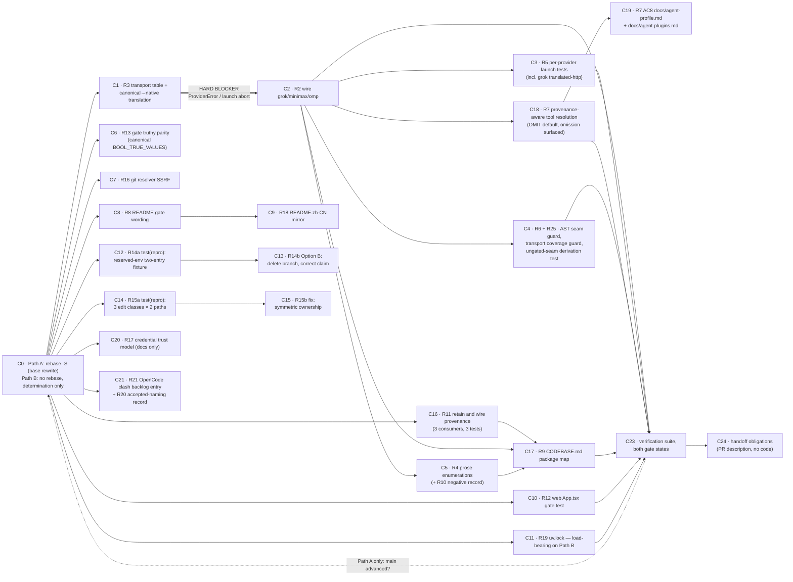

# Implementation Plan: PR #584 review remediation

## Overview

This plan implements the 25 requirements of `requirements.md` through the design's commit plan
(design §2.2.3) verbatim: **one top-level task per commit row C0–C21**, in the design's dependency
order, plus the verification pass (C23) and the PR-description handoff record (C24). Each top-level
task states its Conventional Commit subject exactly as design §2.2.3 gives it.

All seven decisions are **settled** (Rev 2 addendum, PR #43 `b1be41b`; design §5, requirements
Decision Record). This plan implements the settled branch only:

| Decision | Settled branch implemented here | Reversal alternative — **do not implement** |
|---|---|---|
| D1 provenance (R11) | RETAIN AND WIRE three consumers | removal (design §3.9.2, R11 AC8) |
| D2 reserved env (R14) | Option B — delete the dead branch | Option A per-entry isolation (design §3.7.2, R14 AC7) |
| D3 auto-grant (R7) | `OMIT` + `pluginMcp` opt-in + fail-closed + omission surfaced | `GRANT`-plus-warning (design §5.1) |
| D4 credential env (R17) | warn-only, docs-only, no code change | refuse / redact (design §5.4) |
| D5 gate truthy (R13) | canonical `BOOL_TRUE_VALUES` including `"on"` | narrow 3-value set (design §5.3) |
| D6 package rename (R20) | DECLINED — record accepted naming | the rename (design §5.5) |
| D7 seam gating (R25) | seam stays **UNGATED** | guard clause in `with_plugin_mcp` (design §5.7) |

### ⛔ The plan's top risk — C1 before C2 is a HARD BLOCKER

**Task 2 (C1) MUST be complete and committed before any sub-task of Task 3 (C2) begins.**

Reason (design §2.2.4, §11.1, addendum C4): wiring the delivery seam into `grok_cli` before the
transport entry **and** the canonical→native translation exist sends a canonical `streamable-http`
plugin entry into `grok_cli._render_mcp_config`, whose `transport not in {"http","sse"}` branch
(`grok_cli.py:296-300`) raises `ProviderError`. That propagates `_render_mcp_config` →
`_prepare_grok_home` → `_build_grok_command` → `initialize`'s `except Exception` (`:511`) →
`cleanup()` → re-raise: **the terminal does not launch.** The wrong order converts a silent drop
into a launch abort — a strictly worse defect than the one under review.

Corollaries, both binding:
- The transport table entry and `_to_native_transport` land in the **same commit** (C1), so the entry
  can never exist without the translation.
- Rollback is **C1 + C2 as a pair**. Reverting C2 alone restores the silent drop (safe); reverting C1
  alone leaves the entry without the translation — the dangerous state. C2's commit body records this.

### Path B is the default assumption (R1)

Unless the SSH signing key that signed `282839c1` is **confirmed** present in the executing session,
Path B applies: **do not rebase.** See Task 1 and design §2.3.1. On Path B, Task 12 (C11) is promoted
from housekeeping to the only correction of `uv.lock` and is load-bearing (R1 AC8).

---

## Tasks

- [ ] 1. C0 — determine signing-key availability and select the rebase path
  - **Path A: rebase amends the base commit — no new commit. Path B: no commit at all.**
  - Design §2.3.1–§2.3.6. This task is a hard prerequisite of every other task (design §2.2.2).
  - **Default to Path B unless the key is confirmed present.** The dangerous state is not "no key" —
    it is "assumed key" (design §11.4).
  - _Requirements: 1.1, 1.13_

  - [ ] 1.1 Probe for the signing key and record the determination
    - Establish whether the SSH key that signed `282839c1` is available to this session; confirm it,
      do not assume it. `git cat-file commit 282839c1 | grep -q '^gpgsig'` establishes that the base
      *is* signed (ed25519, V4); the question is whether *this* session can re-sign.
    - Record the determination in the PR description **before** the first work-item commit of Tasks
      2–22 is created. This recorded step is what prevents "we assumed the key was there" becoming
      "we pushed an unsigned rewrite".
    - Select Path A (key confirmed) or Path B (anything else: missing, unknown, unverified).
    - _Requirements: 1.1_

  - [ ] 1.2 Path A only — rebase with signing, then verify the signature survived
    - Create the backup ref first: `git branch backup/pre-rebase-282839c1` (design §11.3).
    - Rebase onto the `origin/main` tip with signing enabled:
      `git -c commit.gpgsign=true -c gpg.format=ssh -c user.signingkey="<key>" rebase -S --onto origin/main fb4cc81790e4c6c416ad2288134a708b5cdca982`
    - **Post-condition 1 (binding):** `git cat-file commit <rebased-base> | grep -q '^gpgsig'` must
      match. Do **NOT** rely on the `%G?` format placeholder — it is unreliable without
      `gpg.ssh.allowedSignersFile` (R1 AC3).
    - Post-condition 2: `git log --format='%H %G?' origin/main..HEAD` reports `G` or `U`, never `N`,
      *only where* an allowed-signers file is configured; otherwise fall back to post-condition 1 per
      commit.
    - Post-condition 3: `git log -1 --format='%aN <%aE>' <base>` is unchanged from
      `plauzy <4451274+plauzy@users.noreply.github.com>`. A rewritten committer is expected.
    - Confirm zero commits behind the rebase target, that every change of `282839c1` survives, and
      that the branch is still named `feat/agent-plugins-573-upstream`.
    - Resolve any conflict by preserving **both** sides; the 8-file intersection and its per-file
      resolution rules are design §2.3.3 — `providers/claude_code.py` is the one file needing a
      *semantic* re-check (is the seam wrap still inside the profile-loading helper?). Record each
      resolved file in the rebase note or PR description.
    - `uv.lock`: take `main`'s copy verbatim inside the rebase — `git checkout origin/main -- uv.lock`
      then `uv lock --check` (must exit 0). Record `uv.lock` in the rebase note (design §2.3.5).
    - **If post-condition 1 fails:** discard the rewritten history, push nothing, and fall back to
      Path B (Task 1.3). Do not attempt to repair a signature on a pushed branch.
    - _Requirements: 1.2, 1.3, 1.4, 1.5, 1.6, 1.12_

  - [ ] 1.3 Path B only — do not rebase; land the work items on `282839c1`
    - Perform **no rebase**. Make no change to `282839c1` itself: same SHA, `gpgsig` intact, every
      standing review comment's line anchor still resolves.
    - Land Tasks 2–22 as ordered focused commits directly on top of `282839c1`.
    - Leave signing of the new commits to the author's push. New commits are not a rewrite of
      anything signed.
    - `uv.lock` is **not** corrected here — it is corrected in Task 12 (C11), which is load-bearing on
      this path, with `uv lock --check` binding there (R1 AC8).
    - Record in the PR description: the branch was **not** rebased; it is mergeable against
      Upstream_Main with **zero conflicts** (V3 probe); the base commit's signature is intact.
    - There is deliberately **no** R24 handoff item for the rebase — it is declined work, not deferred
      work, and the PR description says so (design §2.3.4b).
    - _Requirements: 1.7, 1.9, 1.10_

  - [ ] 1.4 Capture the differential verification baseline for the selected path
    - Baseline ref: the rebase target on Path A; `origin/main` at verification time on Path B.
    - `git worktree add /tmp/base-main <baseline-ref>`, run `uv run pytest -q` there, capture the
      node-id set, and diff it against the branch's node-id set (design §2.3.6's exact commands).
    - Re-capture whenever the baseline moves (Path A: per rebase target, R1 AC12; Path B: only if
      `main` advances before the push).
    - Where the baseline cannot be produced locally (the review record notes numpy build failures on
      old GCC), the evidence is branch CI compared against `main` CI at the same SHA — record which
      was used.
    - _Requirements: 1.11_

- [ ] 2. C1 — `feat(agent-plugins): record grok/minimax/omp MCP transports and translate canonical names`
  - Design §3.2. **Blocked by:** Task 1. **Hard blocker for Task 3** — see the callout above.
  - Constraints (R22): Conventional Commit subject exactly as above, one focused commit; **never push
    with `--no-verify`** — if a pre-push hook fails on files this task did not change, fix or scope
    the hook in a **separate** commit (R22 AC2–AC3); the Ship_Gate default stays off (R22 AC1); leave
    `src/cli_agent_orchestrator/plugins/` (the Event_Plugin_Subsystem) untouched (R22 AC6).
  - Docs in this same commit (R22 AC5, design §10.1): `docs/agent-plugins.md`.
  - _Requirements: 3.1, 3.2, 3.3, 3.5, 3.6, 3.7_

  - [ ] 2.1 Add the three explicit `PROVIDER_TRANSPORTS` entries with evidence bullets
    - In `mcp_mapping.py`, add `"grok_cli": _ALL_TRANSPORTS`, `"minimax_code": _ALL_TRANSPORTS`,
      `"omp": _ALL_TRANSPORTS` to `PROVIDER_TRANSPORTS` (`:100`), taking the 10 existing entries
      unchanged.
    - Each set is derived by **reading the serializer**, and the derivation is quoted as a comment on
      the entry: grok `_render_mcp_config` (`grok_cli.py:281`) accepts `type ∈ {"http","sse"}` and
      raises otherwise; minimax `_serialize_server` (`minimax_code.py:255`) defaults `type` to
      `"http"`, maps `"http"`→`"streamable-http"`, accepts `{"streamable-http","sse"}`; omp
      `_write_extension_root` (`omp.py:182`) is a straight pass-through with no transport inspection.
    - Add one docstring bullet per provider to the `#:` block at `mcp_mapping.py:78-98`, in the
      evidence-citing style the existing `codex` and `antigravity_cli` bullets use.
    - Retain `DEFAULT_TRANSPORTS = _STDIO_ONLY` unchanged as the fallback for providers added later.
    - The module docstring's claim that every shipped provider is entered explicitly becomes **true**
      with these three entries — verify the claim's wording now matches reality.
    - _Requirements: 3.1, 3.2, 3.3, 3.5, 3.6, 3.7_

  - [ ] 2.2 Add the canonical→native transport translation in the mapper
    - Add `_NATIVE_TRANSPORT_NAMES: Dict[str, Dict[str, str]] = {"grok_cli": {"streamable-http": "http"}}`
      and `_to_native_transport(provider, transport)` to `mcp_mapping.py` (design §3.2.2 gives both
      verbatim, including the `#:` comment explaining why grok is the only entry).
    - Thread the provider key into `_map_entry` and apply the translation at **exactly one** place —
      the `config` seed, so both the stdio and the URL branch inherit it:
      `config: Dict[str, Any] = {"type": _to_native_transport(provider, transport)}`.
    - **Ordering inside `_map_entry` is load-bearing: allowlist check FIRST, translation SECOND.**
      `PROVIDER_TRANSPORTS` is keyed by canonical names, so checking a translated value would
      silently miss.
    - Do **not** put the translation in `grok_cli._render_mcp_config` (candidate B) or in
      `mcp_delivery.apply_plugin_mcp_servers` (candidate C) — design §3.2.2's table records why each
      is rejected.
    - Leave the unsupported-transport path unchanged: a transport outside the provider's allowlist
      stays a `SKIPPED` `mcp.transport_unsupported` finding, never a failover (design §3.2.3).
    - _Requirements: 3.4_

  - [ ]* 2.3 Write the property test for the transport round trip
    - **Property 7: Transport round trip** — hypothesis-based.
    - **Validates: Requirements 3.3, 3.4**
    - Strategies: `sampled_from(sorted(PROVIDER_TRANSPORTS))` × `sampled_from(sorted(_ALL_TRANSPORTS))`,
      filtered to allowed pairs. `@settings(max_examples=100)` minimum.
    - Two assertions: (a) `native → canonical → native` is the identity; (b) each provider's
      `_NATIVE_TRANSPORT_NAMES` map is **injective** (`len(set(m.values())) == len(m)`), so a future
      second entry cannot collapse two canonical transports onto one native name silently.
    - _Requirements: 3.3, 3.4_

  - [ ]* 2.4 Write the serializer accept/reject example table
    - Per provider, assert each transport in the recorded set does not raise, and that one outside it
      does. This is R3 AC2's "derive the set by reading the serializer" turned into a test.
    - _Requirements: 3.2, 3.3_

  - [ ] 2.5 Update `docs/agent-plugins.md` for the transport work
    - The transport section (`:271`, "A transport the target provider cannot carry is skipped") gains
      the per-provider transport table from design §3.1.4, plus a sentence naming grok's native
      `"http"` versus the canonical `streamable-http` and the translation between them.
    - _Requirements: 3.5, 3.6_

- [ ] 3. C2 — `fix(agent-plugins): deliver plugin MCP servers on grok/minimax/omp launch paths`
  - Design §3.1.2 (exact edit sites, current and wrapped call shapes given verbatim).
  - **⛔ BLOCKED BY TASK 2 (C1) — HARD. Do not begin any sub-task below until C1 is committed.**
    Wiring grok before the transport entry and the translation exist raises `ProviderError` in
    `_render_mcp_config` and **aborts the launch** (design §2.2.4, §11.1).
  - **Wrap, never replace.** Keep `load_agent_profile(...)` as the inner call at every site. A
    combined loader (`load_profile_with_plugins`) would be a different module attribute, so the
    providers' own `monkeypatch.setattr(mod, "load_agent_profile", ...)` patches would land on an
    unused symbol and the tests would read the developer's real profile store
    (`test_mcp_launch_delivery.py:110`). Canonical shape: `kimi_cli.py:284`.
  - **Add no provider-local `try/except` around the seam call** — `with_plugin_mcp` already never
    raises, so it would be dead code, and a bare `except` there would swallow the `ProviderError` the
    surrounding `_load_profile` is supposed to raise for a genuinely broken profile (design §3.1.5).
  - Commit body records that C1 and C2 must be reverted as a **pair** (design §11.1).
  - Constraints (R22): exact Conventional Commit subject above, one focused commit; **never push with
    `--no-verify`** — a hook failing on untouched files is fixed or scoped in a separate commit;
    gate stays default-off; Event_Plugin_Subsystem untouched.
  - Docs in this same commit (R22 AC5, design §10.1): `CODEBASE.md` narrative sentence,
    `docs/grok-cli.md`, `docs/minimax-code.md`, `docs/omp-cli.md`.
  - _Requirements: 2.1, 2.2, 2.3, 2.4, 2.5, 2.6, 2.7_

  - [ ] 3.1 Wire the seam into `providers/grok_cli.py`
    - Import beside the existing `load_agent_profile` import at `:39`:
      `from cli_agent_orchestrator.agent_plugins.mcp_delivery import with_plugin_mcp as _with_plugin_mcp`.
    - In `_load_profile` (`:200-210`), wrap the `load_agent_profile` call at `:204`:
      `return _with_plugin_mcp(load_agent_profile(self._agent_profile), "grok_cli")`.
    - **Leave `_try_load_profile` (`:192`) UNWRAPPED** — `initialize:487` uses it only for the init
      timeout, and wrapping it would run the store read twice per launch for no delivery benefit.
      Record that in the comment on the wrapped site.
    - Consumer chain to confirm: `_build_grok_command:419` → `profile.mcpServers:420` →
      `_prepare_grok_home:393` → `_render_mcp_config:281` → `config.toml` write at `:406`.
    - _Requirements: 2.1, 2.4, 2.5_

  - [ ] 3.2 Wire the seam into `providers/minimax_code.py`
    - Import after `:22`. The load is inline in `_prepare_runtime` (`:341-349`), not in a helper: wrap
      the call at `:345` with
      `profile = _with_plugin_mcp(load_agent_profile(self._agent_profile), "minimax_code")`.
    - **Leave `_try_load_profile` (`:398`) UNWRAPPED** — it feeds status/init only.
    - Consumer chain: `_prepare_runtime:360-361` → `_write_plugin:308` → `_serialize_server:255` →
      `plugins/<name>/servers.mcp.json` write at `:335-337`.
    - _Requirements: 2.2, 2.4, 2.5_

  - [ ] 3.3 Wire the seam into `providers/omp.py`
    - Import after `:24`. In `_load_profile` (`:127-135`), wrap the call at `:131`:
      `return _with_plugin_mcp(load_agent_profile(self._agent_profile), "omp")`.
    - Consumer chain: `_build_omp_command:157` → `:176-177` → `_write_extension_root:182` →
      `<artifact_root>/.mcp.json` write at `:201-204`.
    - _Requirements: 2.3, 2.4, 2.5_

  - [ ]* 3.4 Write the seam fault-injection test for the never-raises contract
    - Patch `apply_plugin_mcp_servers` to raise; assert the returned profile is the **same object**,
      that `mcpServers` is unmutated (not partially merged — the in-place assignment at
      `mcp_delivery.py:377` is the last statement), and that the command build still succeeds on the
      unmerged profile.
    - _Requirements: 2.7_

  - [ ] 3.5 Update `CODEBASE.md` narrative and the three provider docs
    - `CODEBASE.md` "Providers and terminal backends" narrative (`:75-88`) gains one sentence: the
      nine providers that regenerate MCP config at launch pass the profile through
      `agent_plugins/mcp_delivery.with_plugin_mcp`. **Not** the package map — that is Task 18 (C17).
    - `docs/grok-cli.md`, `docs/minimax-code.md`, `docs/omp-cli.md` each gain a line stating that
      installed agent plugins' MCP servers are delivered at launch, matching what the six
      already-wired providers' docs say.
    - _Requirements: 2.1, 2.2, 2.3_

- [ ] 4. C3 — `test(agent-plugins): assert plugin MCP delivery in grok/minimax/omp launch artifacts`
  - Design §9.3, §9.3.1. **Blocked by:** Task 3. Model the three tests on the existing
    `test/agent_plugins/test_mcp_launch_delivery.py`, reusing its `installed_plugin` fixture and
    `_delivered_somewhere` helper.
  - These three artifact tests are **the commit's deliverable**, not optional extras. Follow the
    file's existing `pytest.skip` precedent (`:121-122`) rather than requiring `grok`/`mcode`/`omp`
    on `$PATH`.
  - Constraints (R22): exact subject above, one focused commit; **never push with `--no-verify`**;
    gate stays default-off; Event_Plugin_Subsystem untouched. Test-only commit — no module changes,
    so no docs update is owed here.
  - _Requirements: 5.1, 5.2, 5.3, 5.4, 5.5, 5.6_

  - [ ] 4.1 Assert plugin MCP delivery in grok's `config.toml`, including the translated transport
    - Install a fixture plugin declaring an MCP server, build the `grok_cli` launch configuration, and
      assert the plugin server appears in the generated `config.toml`.
    - **The translated-value assertion (design §9.3.1) — both halves are required:**
      - POSITIVE: a plugin server whose canonical transport is `streamable-http` lands as
        `config["mcp_servers"]["plugin-tools"]["type"] == "http"`.
      - NEGATIVE: `assert "streamable-http" not in raw` — the canonical spelling appears **nowhere**
        in the file.
    - The positive assertion alone passes if the canonical value is also written elsewhere; the
      negative alone passes if the server was dropped entirely, which is the original bug. Together
      they say: the server arrived, and it arrived translated.
    - Under the dangerous intermediate state (C1's translation missing) this test fails with
      `ProviderError` rather than an assertion error — louder and more diagnostic than a `KeyError`.
    - _Requirements: 5.1, 5.5, 5.6, 3.8_

  - [ ] 4.2 Assert plugin MCP delivery in minimax's `servers.mcp.json`
    - Install the fixture plugin, build the `minimax_code` launch configuration, assert the plugin
      server appears in the generated `servers.mcp.json`.
    - _Requirements: 5.2, 5.5_

  - [ ] 4.3 Assert plugin MCP delivery in omp's extension-root MCP file
    - Install the fixture plugin, build the `omp` launch configuration, assert the plugin server
      appears in the generated extension root `.mcp.json`.
    - _Requirements: 5.3, 5.5_

  - [ ]* 4.4 Write the property test for the delivered-set union
    - **Property 1: Delivered-set union** — hypothesis-based, parameterised over the nine wired
      providers.
    - **Validates: Requirements 2.1, 2.2, 2.3, 5.1, 5.2, 5.3**
    - Strategies: `profile_servers` = `dictionaries(server_names, mcp_entries, max_size=4)`;
      `plugin_servers` drawn from an **overlapping** name pool so collisions occur ~30% of the time;
      `transports` = `sampled_from(["stdio","streamable-http","sse"])`. Minimum 100 examples.
    - **Must not be tautological (design §9.4.1):** do **not** build the expectation from
      `PROVIDER_TRANSPORTS`, or the test asserts the code agrees with itself and a wrong table entry
      passes. Derive the expected accept-set from the **serializer's observed** raise/no-raise
      behaviour, and assert the observed set equals `PROVIDER_TRANSPORTS[provider]` in a *separate*
      assertion.
    - _Requirements: 2.1, 2.2, 2.3, 5.1, 5.2, 5.3_

  - [ ]* 4.5 Write the property test for gate-off byte identity, plus the gate-off decomposition
    - **Property 2: Gate-off byte identity** — hypothesis-based over profiles (`profile_servers`
      including empty, one, many, unicode names, and `None`).
    - **Validates: Requirements 2.6, 5.4, 23.2, 25.2, 25.3**
    - Assert `build(profile, store=empty) == build(profile, store=absent)` **as bytes** — not parsed.
      A reordered dict or a changed indent is a real artifact change.
    - Written **gate-independently**: `test/agent_plugins/conftest.py:39` sets
      `CAO_AGENT_PLUGINS_ENABLED=1` for the whole package, and the fixture installs via
      `installer.install()` directly, so a naive "delenv and assert no delivery" test would fail
      because the store still holds the plugin (design §3.1.6).
    - Extend `test/agent_plugins/test_ship_gate.py` with the decomposition R5 AC4 actually needs:
      gate off ⇒ `cao plugin add` exits non-zero and `POST /plugins` 404s ⇒ the store is **empty**.
    - _Requirements: 2.6, 5.4_

- [ ] 5. C4 — `test(agent-plugins): fail when a provider regenerates MCP config without the delivery seam`
  - Design §3.3, §9.3.3. **Blocked by:** Task 3. New file
    `test/agent_plugins/test_seam_drift_guard.py`, which also carries R25's derivation test — both
    are structural invariants of the seam, so they land as one reviewable unit (V22).
  - **AST, not regex.** A grep for `mcpServers` over `providers/*.py` matches 35 lines across 8
    modules today, almost all false positives in four classes (docstrings, native-config sink keys,
    foreign-config reads, codex validation string literals). The repo already made and won this
    argument in `test_delivery_providers.py`'s event-plugin import guard — cite that precedent.
  - Constraints (R22): exact subject above, one focused commit; **never push with `--no-verify`**;
    gate stays default-off; Event_Plugin_Subsystem untouched.
  - Docs in this same commit (R22 AC5, design §10.1): `docs/agent-plugins.md` (sub-task 5.7).
  - _Requirements: 6.1, 6.2, 6.3, 6.4, 6.5, 25.1, 25.2, 25.3, 25.4_

  - [ ] 5.1 Implement the AST-based Seam_Drift_Guard
    - Enumerate every module under `src/cli_agent_orchestrator/providers/` and detect
      `ast.Attribute(attr="mcpServers")` nodes in **`Load` context only** — a `Store` context is the
      seam's own `profile.mcpServers = merged` assignment, not a launch-time read.
    - `_calls_the_seam(tree)` resolves the seam alias from the module's **own import statements**
      rather than trusting the `_with_plugin_mcp` convention, so a provider importing it under a
      third name still passes and one importing it but never calling it still fails.
    - Fail when an enumerated module neither calls the seam nor is allowlisted, naming the **module,
      line, and enclosing function** (walk `FunctionDef` bodies, not just the module) plus the fix
      shape and the `kimi_cli.py:284` reference — design §3.3.2 gives the message verbatim.
    - _Requirements: 6.1, 6.2_

  - [ ] 5.2 Implement the exemption allowlist as a dict of rationales, with its own discipline test
    - `_SEAM_EXEMPT_MODULES: dict[str, str]` mapping module filename → rationale **string**, so the
      rationale is a *value* that can be asserted and printed in a failure message rather than a
      comment that drifts. Five entries with the text from design §3.3.3: `base.py`, `kiro_cli.py`,
      `opencode_cli.py`, `hermes.py`, `mock_cli.py`.
    - `TestTheAllowlistIsItselfDisciplined`: every rationale is non-empty and cites its evidence.
    - `test_no_exemption_is_currently_load_bearing` — none of the five contains an
      `ast.Attribute(attr="mcpServers")` read today, so the allowlist is empty *in effect*. This
      inverts the usual allowlist risk: any future *use* of it becomes a visible, deliberate act, and
      it is the strongest form of R4 AC4's exemption rationale.
    - _Requirements: 6.3, 4.4_

  - [ ] 5.3 Add the function-scoped companion guard for a second unwrapped read
    - `test_no_wired_module_grew_a_second_unwrapped_mcp_read`: for each wired provider, any function
      containing a `.mcpServers` read either contains the seam call itself, or reads it off a
      parameter / an attribute set by a function that does.
    - State the limitation in the docstring rather than hiding it: this is a **shape guard, not a
      dataflow analysis**, and it **fails closed** — an untraceable read is a failure, and the fix is
      to wire it or to pass the already-merged map in as a parameter (what all six wired providers
      already do).
    - _Requirements: 2.5_

  - [ ] 5.4 Implement the Transport_Coverage_Guard
    - **Property 6: Transport-table totality** — classified **EXAMPLE**, one total assertion, not a
      100-iteration loop: the wired set is finite, small, and AST-derived (design §9.2). Record that
      reasoning in the test.
    - **Validates: Requirements 3.1, 3.6, 6.5**
    - Derive the wired provider keys from the **seam call sites' string literals via AST**
      (`_seam_provider_keys_from_ast`, shared with the drift guard) rather than a hand-maintained
      list — that is what makes the guard self-maintaining and covers a newly wired provider the
      moment it is wired.
    - Fail naming the missing provider, with the message from design §3.3.5 explaining that it would
      otherwise resolve through `DEFAULT_TRANSPORTS`.
    - _Requirements: 6.5, 3.1, 3.6_

  - [ ]* 5.5 Write the property test for seam-guard soundness
    - **Property 5: Seam-guard soundness (an iff)** — hypothesis-based over **synthetic module
      source**, plus an assertion that the real tree passes.
    - **Validates: Requirements 6.1, 6.2, 6.3, 6.4**
    - Generator (`strategies.builds`-composed Python source) emits: docstring-only `mcpServers`
      mentions, dict-literal `"mcpServers"` keys, `x.mcpServers` reads, seam calls under 0–3 alias
      names, and combinations. Each draw is `ast.parse`d so a syntactically invalid draw fails loudly
      rather than passing vacuously. Minimum 100 examples.
    - The **iff** is the point and is what needs a generator: a hand-written fixture set would encode
      the author's own idea of the false-positive classes. Test both directions.
    - _Requirements: 6.1, 6.2, 6.3, 6.4_

  - [ ] 5.6 Write the R25 ungated-seam derivation test and its structural companion
    - `test_gate_off_yields_no_delivery_through_the_derivation` asserts each link where it holds:
      (1) gate off ⇒ `cao plugin add` exits non-zero and `POST /plugins` 404s; (2) ⇒
      `InstalledPluginStore().list_installed() == []`; (3) ⇒ for each of the three providers,
      `build_artifact(provider) == build_artifact_with_no_plugins(provider)` — **at the artifact
      level, as byte equality**.
    - Byte equality rather than an absence check: "no plugin server appears" would require defining
      "plugin server" inside the test, which is a second implementation of the thing under test.
    - **The test MUST NOT assert that the Delivery_Seam reads the Ship_Gate.** It does not, by design
      (D7), and R25 AC1 forbids adding a guard clause to `with_plugin_mcp`. A test asserting
      otherwise would pin the negation of the settled decision, and would have to be *deleted* to
      reverse it — exactly backwards.
    - Structural companion beside the AST guards (same tree walk): `with_plugin_mcp`'s module contains
      **no reference** to `agent_plugins_surface_enabled`. Its docstring records that the absence is
      deliberate and cites D7, so a contributor "fixing" the missing gate check finds the reason
      before writing the patch.
    - _Requirements: 25.1, 25.2, 25.3_

  - [ ] 5.7 Update `docs/agent-plugins.md` with the release-gate statement
    - State that the Ship_Gate is a **management-surface release gate, not a data-path switch**, and
      give the gate-off derivation: gate off ⇒ no install path ⇒ empty store ⇒ nothing to merge ⇒ no
      delivery.
    - Record in the commit body — as a note, **not** as work — that if a maintainer later directs the
      seam to consult the gate, that is roughly **fifteen lines** across the seam, the six original
      Wired_Provider call sites, and their existing tests, and that it yields **no security gain** over
      the derivation above (R25 AC5, design §5.7). Nothing in this commit implements it.
    - _Requirements: 25.4, 25.5_

  - [ ] 5.8 Run the mutation verification procedure and record the nine results
    - R6 AC4 is a **procedure**, not an automated test — a test that rewrites source files to prove
      another test fails is fragile and slow (design §9.8).
    - Run design §3.3.6's loop over all nine wired providers: strip the `_with_plugin_mcp(...)`
      wrapper with `sed`, confirm `test_seam_drift_guard.py` **fails**, restore from the `.bak`.
    - End with `git diff --quiet` — the safety net against leaving a reverted wiring in the tree,
      which is the exact failure the review is about.
    - Record the nine results in C4's commit body.
    - _Requirements: 6.4_

- [ ] 6. C5 — `docs(agent-plugins): name all nine wired providers in the delivery-seam prose`
  - Design §3.1.4, §3.13, §9.4.3, §10.4. **Blocked by:** Task 3 — the count is only nine after C2
    lands. Also carries R10's negative record.
  - Constraints (R22): exact subject above, one focused commit; **never push with `--no-verify`**;
    gate stays default-off; Event_Plugin_Subsystem untouched.
  - Docs in this same commit (R22 AC5, design §10.1): `docs/agent-plugins.md`, plus the
    `mcp_delivery.py` docstrings and `test/test_agent_plugins_docs.py`.
  - _Requirements: 4.1, 4.2, 4.3, 4.4, 10.1, 10.2, 10.3, 10.4_

  - [ ] 6.1 Correct the two `mcp_delivery.py` docstrings
    - `apply_plugin_mcp_servers` (`:337`): "the five providers that call `load_agent_profile()` again
      at launch" → the current count, **nine**.
    - `with_plugin_mcp` (`:390-393`): replace "Claude Code, Codex, Kimi, Antigravity and Cursor …
      Copilot never consulted the profile for MCP at all" with all nine named providers
      (`antigravity_cli`, `claude_code`, `codex`, `copilot_cli`, `cursor_cli`, `grok_cli`,
      `kimi_cli`, `minimax_code`, `omp`), **keeping** the historical note about what review #584
      found, because that history is why the seam exists.
    - Both docstrings state the count **and** the names, so the guard in 6.3 has two derived values to
      compare.
    - _Requirements: 4.1, 4.2_

  - [ ] 6.2 Add the per-provider delivery enumeration to `docs/agent-plugins.md`
    - The doc currently says delivery reaches every provider "with no per-provider work"
      (`:194-196`) — true of the mechanism, unhelpful to a reader checking their provider. Add the
      enumeration from design §10.4: the nine wired providers named, plus the four exemptions with
      their two distinct reasons (`kiro_cli`/`opencode_cli` receive MCP on the **install** path;
      `hermes`/`mock_cli` have no MCP path at all), plus a sentence that a CI guard fails if a
      provider ever regenerates MCP configuration without the seam.
    - _Requirements: 4.3, 4.4_

  - [ ]* 6.3 Write the docstring-count guard
    - `test_the_docstring_provider_count_matches_the_wiring` in `test/test_agent_plugins_docs.py`
      compares **two derived values**: `_spelled_number_in(apply_plugin_mcp_servers.__doc__)` against
      `len(_seam_provider_keys_from_ast())` (design §9.4.3).
    - Asserting `"nine" in docstring` would re-create the defect one synonym later. This makes the
      prose self-correcting: a tenth wired provider fails the test until the docstring is updated.
    - _Requirements: 4.1, 4.2_

  - [ ] 6.4 Record R10's negative search result and guard against the claim reappearing
    - V11 confirmed **no in-repository occurrence** describes the vocabulary exemption count, so R10
      AC2 does not fire and R10 AC3 does. Because a commit with no change cannot exist, the record is
      folded into this commit's body — paste design §3.13's evidence block verbatim: the three search
      terms, the ten unrelated matches with paths and line numbers, the three entries of
      `_VOCABULARY_BACKLOG_DOCS` (`test_naming_migration.py:106-110`), and the note that the
      remaining "exactly two permanent exemptions" claim is in the **PR body only** — a human edit
      listed under Task 24.
    - Add `test_no_doc_states_a_vocabulary_exemption_COUNT` to `test/test_agent_plugins_docs.py`
      (**not** to `test_naming_migration.py`, preserving R10 AC4): prose must point at the list rather
      than restate its length.
    - Leave `test/agent_plugins/test_naming_migration.py` behaviour unchanged — the guard is already
      correct.
    - _Requirements: 10.1, 10.2, 10.3, 10.4_


- [ ] 7. C6 — `fix(agent-plugins): align the ship gate's truthy spellings with the canonical set`
  - Design §3.5. **Blocked by:** Task 1. Settled as D5: add `"on"` **by reusing the canonical set**,
    not by extending `gate.py`'s private `_TRUTHY` tuple, so the parity claim cannot drift from the
    canonical definition. Do **not** implement the narrow three-value alternative (design §5.3).
  - Constraints (R22): exact subject above, one focused commit; **never push with `--no-verify`**;
    **this task changes the gate's neighbourhood — the truthy set only widens; `""`, unset, and every
    value outside the set stay falsey, and `"off"` stays in `BOOL_FALSE_VALUES`** (R22 AC1);
    Event_Plugin_Subsystem untouched.
  - Docs in this same commit (R22 AC5, design §10.1): `docs/agent-plugins.md` gate block (`:103-111`).
  - _Requirements: 13.1, 13.2, 13.3, 13.4_

  - [ ] 7.1 Promote `BOOL_TRUE_VALUES` to `constants.py` and consume it from the gate
    - Add `BOOL_TRUE_VALUES = frozenset({"1","true","yes","on"})` and `BOOL_FALSE_VALUES` to
      `constants.py`. No import cycle: `constants.py` imports only `os`, `pathlib`, `urllib.parse`,
      and `models.provider`.
    - `settings_service.py` re-binds `_BOOL_TRUE_VALUES = BOOL_TRUE_VALUES`, **keeping its private
      name** so its two internal uses at `:362`/`:364` are untouched.
    - `gate.py` imports `BOOL_TRUE_VALUES` and reads
      `os.environ.get(ENV_VAR, "").strip().lower() in BOOL_TRUE_VALUES`.
    - Do **not** import `settings_service._BOOL_TRUE_VALUES` from `gate.py` — that reaches into a
      private name across a layer boundary and drags `SETTINGS_FILE`, logging, and JSON into a
      predicate deliberately documented as env-only and read-at-call-time (design §3.5's table).
    - _Requirements: 13.1, 13.2_

  - [ ] 7.2 Restate the parity claim in terms of the shared constant
    - `gate.py:11-13`'s docstring currently claims parity with `CAO_AGUI_ENABLED` and
      `CAO_EAGER_INBOX_DELIVERY`. Rewrite it to name the **shared constant**, so a future divergence
      in *those* gates cannot make this docstring false again.
    - `docs/agent-plugins.md`'s gate block gains the accepted spellings **by naming the constant**
      rather than enumerating them, so a later change to the set cannot leave the claim false.
    - _Requirements: 13.4_

  - [ ]* 7.3 Update `test/agent_plugins/test_ship_gate.py` for the added spelling
    - Two lines (`:48`, `:52`): move `"on"` out of the "anything else stays disabled" parametrize list
      into the truthy list, and add `" On "` to exercise the strip+lower path.
    - R13 AC2 is already covered by `test_absent_env_var_means_disabled`,
      `test_empty_env_var_means_disabled`, and the remaining falsey parametrize
      (`"0","false","no","off","enabled"`) — confirm `"off"` stays falsey.
    - _Requirements: 13.3, 13.2_

  - [ ]* 7.4 Write the property test for gate truthiness
    - **Property 8: Gate truthiness (an iff)** — hypothesis-based over text with a biased generator.
    - **Validates: Requirements 13.1, 13.2**
    - Strategies: `text()` | a generator emitting case/whitespace mutations of each
      `BOOL_TRUE_VALUES` member (`" On "`, `"TRUE"`, `"yes\n"`) | `sampled_from(BOOL_FALSE_VALUES)`.
      Minimum 100 examples. Include hostile inputs `"1 "`, `"On\n"`, `"ON"`, `"true "`.
    - Assert the iff in one expression: `enabled() is (s.strip().lower() in BOOL_TRUE_VALUES)`,
      written **against the constant** so a later set change needs no test edit. Plus one example for
      the unset case, which no string can express.
    - _Requirements: 13.1, 13.2_

- [ ] 8. C7 — `fix(agent-plugins): harden the git plugin source resolver against SSRF`
  - Design §3.6. **Blocked by:** Task 1. Mirror `install_service._download_agent` (`:139-215`) — the
    sibling named by addendum C5. Four of its seven controls transfer; three do not, and each
    omission is commented rather than silently dropped.
  - Constraints (R22): exact subject above, one focused commit; **never push with `--no-verify`**;
    gate stays default-off; Event_Plugin_Subsystem untouched.
  - Docs in this same commit (R22 AC5, design §10.1): `docs/agent-plugins.md` "Plugin sources" note.
  - _Requirements: 16.1, 16.2, 16.3, 16.4, 16.5, 16.6, 16.7_

  - [ ] 8.1 Add `_reject_untrusted_git_url` and place it before any side effect
    - `_GIT_ALLOWED_SCHEMES = frozenset({"https"})`; reject any other scheme. `ssh` is **deliberately
      excluded** and no scheme-override knob ships — two override knobs for one decision invites the
      wrong combination (design §3.6).
    - Reject a host outside the allowlist, **naming the rejected host in the error**. Share the
      *default* host set with the profile downloader (`github.com`, `raw.githubusercontent.com`, plus
      `gitlab.com` since `_clone_at_commit`'s docstring already names GitLab).
    - Reject `parsed.username or parsed.password` (userinfo credentials).
    - Omit query/fragment rejection and the path regex, **with a comment saying why** (not meaningful
      for a clone URL; the profile downloader's regex exists because its path becomes a filename).
      Record the redirect residual in the docstring rather than pretending it is closed — do **not**
      set `-c http.followRedirects=false`, which breaks legitimate `github.com/x/y` → `x/y.git`
      handling.
    - **Placement is load-bearing for Property 11:** call it in `_resolve_git` **before**
      `staged = dest / _STAGE_DIRNAME` and before any `_run_git` call, so a rejected URL causes no
      network connection and no filesystem write.
    - Raise `ResolverError` — the module's existing error type — so `installer.install`'s handling is
      unchanged.
    - Add a comment at `_clone_at_commit` (`:177`) stating it is only reached *after* the check, so a
      future direct caller knows it would bypass validation.
    - _Requirements: 16.1, 16.3, 16.4_

  - [ ] 8.2 Add the `CAO_PLUGIN_ALLOWED_HOSTS` override
    - Comma-separated, same parse shape as `_allowed_download_hosts` / `CAO_PROFILE_ALLOWED_HOSTS`.
    - A **separate** variable, not a reuse of `CAO_PROFILE_ALLOWED_HOSTS`: extending the profile
      allowlist grants "fetch a markdown file from here"; extending the plugin allowlist grants
      "clone and then execute code from here". A shared variable would silently widen the second when
      an operator meant the first.
    - _Requirements: 16.5_

  - [ ]* 8.3 Write the resolver example tests
    - `test/agent_plugins/test_resolver.py`: a blocked host, a blocked scheme, and a
      credential-bearing URL (R16 AC6); the override path (R16 AC5); and an assertion that the two
      default host sets match, which is how R16 AC3's "consistent with the Http_Resolver_Hardening
      allowlist" is verified.
    - Assert `--no-recurse-submodules` and `--no-tags` (`resolver.py:132-145`) remain in the
      constructed argv — stated non-behaviours that a hardening edit is exactly the sort of change to
      drop (R16 AC7).
    - _Requirements: 16.6, 16.7, 16.5, 16.3_

  - [ ]* 8.4 Write the property test for resolver rejection closure
    - **Property 11: Resolver rejection closure** — hypothesis-based over URL components.
    - **Validates: Requirements 16.1, 16.3, 16.4**
    - Strategies: `scheme` = `text(alphabet=ascii_lowercase)` |
      `sampled_from(["file","gopher","git","http","ssh","ftp","https"])`; `host` =
      `sampled_from([...])` including `169.254.169.254`, `localhost`, `[::1]`, `example.com.`,
      punycode, and the allowlisted hosts; `userinfo` = `none() | text()`. Minimum 100 examples.
    - Assert rejection **iff** (scheme ∉ allowlist) ∨ (host ∉ allowlist) ∨ userinfo present, **and**
      the three no-side-effect post-conditions on every rejecting draw with `_run_git` patched to a
      call recorder: `dest` is empty, no subprocess was spawned, no network connection. The "before
      any" clause is what makes this stronger than "raises".
    - _Requirements: 16.1, 16.3, 16.4_

  - [ ] 8.5 Document the git-source trust model in `docs/agent-plugins.md`
    - Git sources are restricted to `https` and an allowlisted host; `CAO_PLUGIN_ALLOWED_HOSTS`
      extends it; `ssh` is **excluded** and the reasoning is stated even though the branch is not
      taken (R16 AC2): an `ssh://` clone authenticates with the operator's agent key, so allowing it
      lets a crafted plugin source use the operator's credentials against an internal host — a
      strictly larger grant than `https` to an allowlisted host.
    - State the redirect residual (design §3.6).
    - _Requirements: 16.2_

- [ ] 9. C8 — `docs: state that every agent-plugins surface is default-off`
  - Design §10.2. **Blocked by:** Task 1.
  - Constraints (R22): exact subject above, one focused commit; **never push with `--no-verify`**;
    gate stays default-off — this commit **documents** the posture and must not change it;
    Event_Plugin_Subsystem untouched.
  - Docs changed here (R22 AC5): `README.md`, plus `test/test_agent_plugins_docs.py`.
  - _Requirements: 8.1, 8.2, 8.3_

  - [ ] 9.1 Replace the `README.md` agent-plugins entry
    - Replace `README.md:149-152` with design §10.2's text verbatim: every management surface — the
      `cao plugin` CLI group, the four `/plugins*` HTTP routes, the TUI rows, and the web Plugins tab
      — is **default-off**; the CLI group and HTTP routes gate on `CAO_AGENT_PLUGINS_ENABLED` (unset
      ⇒ routes 404, group refuses every subcommand); the web tab on the build-time
      `PLUGINS_TAB_ENABLED` constant.
    - The claim **"the HTTP API is available" must be gone** (R8 AC2, verified later by R23 AC8's
      spot-check).
    - The result must agree with `docs/agent-plugins.md:103-111`, which already names both gates.
    - _Requirements: 8.1, 8.2, 8.3_

  - [ ]* 9.2 Add the README docs guard
    - `test/test_agent_plugins_docs.py` gains a `README_DOC` constant and asserts: the removed
      phrase's **absence**, all four surface tokens' presence, and both gate names. This turns R23
      AC8's manual grep into a CI invariant.
    - _Requirements: 8.1, 8.2_

- [ ] 10. C9 — `docs(i18n): add the agent-plugins entry to the Chinese README`
  - Design §10.3. **Blocked by:** Task 9 — R18 AC2 requires mirroring "the corrected English text",
    which must exist first.
  - Constraints (R22): exact subject above, one focused commit; **never push with `--no-verify`**;
    gate stays default-off; Event_Plugin_Subsystem untouched.
  - Docs changed here (R22 AC5): `README.zh-CN.md`, plus `test/test_agent_plugins_docs.py`.
  - _Requirements: 18.1, 18.2_

  - [ ] 10.1 Add the mirrored agent-plugins entry to `README.zh-CN.md`
    - The file currently has **zero** `agent-plugins` occurrences. Locate the parallel "配置与集成" /
      documentation-index list and add the entry, mirroring the corrected English text including the
      statement that every surface is default-off.
    - The three assertable tokens must appear: `CAO_AGENT_PLUGINS_ENABLED`, `PLUGINS_TAB_ENABLED`, and
      the four surface names.
    - _Requirements: 18.1, 18.2_

  - [ ]* 10.2 Add the zh-CN token guard
    - Assert the **tokens**, not the translation — a token check is language-independent and does not
      require the test to hold an opinion about Chinese prose.
    - _Requirements: 18.1, 18.2_

- [ ] 11. C10 — `test(web): enforce the plugins-tab gate at the App level`
  - Design §3.10, §9.7. **Blocked by:** Task 1. New file
    `web/src/test/app-plugins-gate.test.tsx`. Vitest + `@testing-library/react`, already in
    `web/package.json`. Runs inside the existing `npm test` (`vitest run`), so R23 AC1's step 5 covers
    it with no CI change.
  - This is a test commit whose test **is** the deliverable — not optional.
  - Constraints (R22): exact subject above, one focused commit; **never push with `--no-verify`**;
    `PLUGINS_TAB_ENABLED`'s shipped default stays `false` (R22 AC1); Event_Plugin_Subsystem untouched.
  - _Requirements: 12.1, 12.2, 12.3, 12.4_

  - [ ] 11.1 Write the App-level gate test with its three mocked boundaries
    - Mock `../featureFlags` **before** `App` is imported, with a **getter** so each test can set the
      value — `vi.mock` is hoisted and a plain literal would freeze it for the whole file. Mock
      `../api` (`getMemoryStatus` resolving `{enabled: false}`) and `../store`.
    - Assertion 1 (flag false): no `role="tab"` named `/Plugins/`.
    - Assertion 2 (flag false, the "route absent" half): the visible tab count equals
      `TABS.length - 2` (memory disabled + plugins gated) **and** firing `Alt+7` — the position
      `plugins` would occupy, given `visibleTabs[parseInt(e.key) - 1]` at `App.tsx:90` — selects
      nothing new. The app has no router; `tab` is `useState`, so this is what "route absent" means.
    - Assertion 3 (flag true): the tab is present, and clicking it renders `PluginsPanel`, asserted
      via the untrusted-content warning string already exported by `plugins-panel.test.tsx:15`.
    - **Trap:** `TABS` also contains `memory`, gated on a *runtime* `api.getMemoryStatus()` promise —
      a `waitFor` is required before counting tabs, or the count races the effect at
      `App.tsx:78-84`.
    - Exercise `web/src/App.tsx`, not only the `web/src/featureFlags.ts` constant.
    - _Requirements: 12.1, 12.2, 12.3_

  - [ ] 11.2 Keep the shipped default false and retain the existing flag test
    - `PLUGINS_TAB_ENABLED` stays `false`. **Retain** `web/src/test/feature-flags.test.ts` unchanged —
      the two files test different things, and its own docstring already explains why it deliberately
      does not mount `App`.
    - _Requirements: 12.4_

- [ ] 12. C11 — `build(deps): restore the upstream uv.lock`
  - Design §2.3.5, §3.11. **Blocked by:** Task 1.
  - **On Path B this commit is LOAD-BEARING** — no rebase took `main`'s lock, so this is the *only*
    thing that corrects it, and R1 AC8 binds `uv lock --check` here. Do not defer it to the end of the
    batch. On Path A the rebase already took `main`'s lock, so the commit's content is the drift guard.
  - Constraints (R22): exact subject above, one focused commit; **never push with `--no-verify`**;
    gate stays default-off; Event_Plugin_Subsystem untouched.
  - _Requirements: 19.1, 19.2, 19.3, 1.8_

  - [ ] 12.1 Take `main`'s `uv.lock` verbatim and verify it satisfies this branch
    - `git checkout origin/main -- uv.lock` then `uv lock --check` — **must exit 0**. That proves
      `main`'s lock satisfies this branch's `pyproject.toml`, which is expected because
      `pyproject.toml` is **byte-identical** between `fb4cc817` and `282839c1` (V13, addendum C6): the
      branch adds no Python dependency, so R19 AC2's empty-diff criterion binds.
    - If `uv lock --check` **fails**, `pyproject.toml` and the lock genuinely disagree on `main` — an
      upstream problem, not this branch's. Then R19 AC3 applies: regenerate with `uv lock` and keep
      only the hunks the dependency change requires.
    - Record `uv --version` and the Python version in the commit body — V13 shows the observed churn
      (resolution-marker reordering and marker *dropping*, e.g. `zipp`'s
      `marker = "python_full_version < '3.13'"`) is exactly tool-version-dependent.
    - _Requirements: 19.1, 19.2, 19.3, 1.8_

  - [ ]* 12.2 Add the lockfile drift guard
    - **Property 12: Lockfile determinism** — classified **EXAMPLE-based, not property-based**
      (design §9.5): there is exactly one `pyproject.toml` and one starting lock, so the quantified
      set has cardinality one, and the observed non-determinism was `uv`/Python version variance,
      which no in-repo test can quantify over. A Hypothesis test here would be a degenerate property.
    - **Validates: Requirements 19.1, 19.2, 19.3**
    - New `test/test_lockfile_drift.py` asserting via `uv lock --check` — deterministic and
      offline-safe — rather than a byte diff against `main`, which needs a git remote and fails in an
      sdist checkout. The byte-level check stays as R23 AC9's spot-check.
    - _Requirements: 19.1, 19.2_

  - [ ] 12.3 Record the two-dot spot-check form and why, in the commit body
    - **The verified correction (design §2.3.5).** R23 AC9 states the spot-check as
      `git diff main...HEAD -- uv.lock`. **Three dots is correct on Path A and produces a FALSE
      FAILURE on Path B.** Three-dot `A...B` diffs `merge-base(A,B)` against `B`; on Path B the base
      is not moved, so `merge-base(main, HEAD)` stays `fb4cc817`, and the three-dot form reports
      `main`'s **own** 5-line lock deletion from `7fed05b` as though it were the branch's change — a
      5-line diff on a branch whose lock is byte-identical to `main`.
    - Blob evidence: `fb4cc817` → `55a6b13c`; `282839c1` → `e100ca48`; `origin/main` → `79a7587e`.
    - **Use the two-dot form, which is correct on BOTH paths:**
      - `git diff origin/main HEAD -- uv.lock` — must be empty (R19 AC2)
      - `git diff --quiet origin/main HEAD -- uv.lock && echo "lock matches main"`
    - The drift guard and R23 AC9's spot-check both use the two-dot form; R23 AC9's three-dot wording
      is read as satisfied by it. Record in the commit body which form was used and why.
    - _Requirements: 19.2_

- [ ] 13. C12 — `test(agent-plugins): reproduce reserved-env handling across two stdio entries`
  - Design §6.1. **Blocked by:** Task 1. The reproduction is **complete and its outcome is confirmed
    fact** (V10, re-confirmed independently by addendum C1), so the fixture's job is to **pin** the
    outcome, not to discover it: the expectations are **constants**, not option-dependent.
  - Lands first and is **retained regardless** of C13 (R14 AC4).
  - Constraints (R22): exact subject above, one focused commit; **never push with `--no-verify`**;
    gate stays default-off; leave the vendored schema and `map_mcp_config`'s semantics unchanged;
    Event_Plugin_Subsystem untouched.
  - _Requirements: 14.3, 14.4, 14.5_

  - [ ] 13.1 Add the two-entry fixture and pin the three observations
    - `RESERVED_ENV_FIXTURE` in `test/agent_plugins/test_mcp_mapping.py`, exactly as design §6.1.1
      gives it: entry `aaa-reserved` (stdio, `env: {"PLUGIN_ROOT": "/tmp/attacker"}`) and entry
      `zzz-valid` (stdio, schema-valid, no reserved key).
    - **The names are load-bearing:** `sorted(raw_servers)` (`mcp_mapping.py:290`) must put the
      offender **first**, so a per-entry implementation cannot accidentally pass by mapping the valid
      entry before reaching the offender.
    - `test_the_observed_outcome_is_pinned` asserts all three, and must fail when **any** changes:
      `{s.name for s in result.servers} == set()`, `[f.code for f in result.findings] == ["mcp.invalid"]`,
      `len(result.findings) == 1`, and `result.valid is False`.
    - _Requirements: 14.3, 14.4_

  - [ ] 13.2 Add the schema↔code agreement test and the diagnostic-limitation test
    - `test_the_schema_and_the_code_agree_on_the_reserved_set`: read
      `$defs.stdioServer.properties.env.propertyNames.not.enum` from the vendored `mcp.schema.json`
      and assert it equals `_RESERVED_ENV_KEYS`. **This is the most valuable of the three tests** — it
      makes the vendored schema and the code a single fact, and it fails loudly if a future schema pin
      refresh changes the set, drift that `make check-agent-plugins-schemas` cannot see because that
      check only verifies the bytes hash.
    - `test_the_diagnostic_does_not_name_the_reserved_key`: assert Option B's honest limitation
      explicitly — `jsonschema`'s `oneOf` composition yields
      `"… is not valid under any of the given schemas"`, naming neither the reserved key nor the
      reason. Asserting it stops anyone mistaking it for a bug, and forces anyone improving the
      message to update a test that says out loud what today's behaviour is.
    - _Requirements: 14.3, 14.4_

  - [ ]* 13.3 Write the property test for whole-configuration invalidation
    - **Property 9: Reserved env key invalidates the whole configuration** — hypothesis-based.
    - **⚠️ RETRACTED AND NEGATED.** As originally stated in the requirements ("per-entry mapping
      isolation") this property is **false** and is not the vendored schema's contract. V10 measured
      `servers=[]` for exactly that input, and addendum C1 confirmed it independently. It is replaced
      by **its own negation at the configuration level**, which is true and stable. Its `Validates`
      line moved off R14.5/R14.6 (which described per-entry outcomes that are no longer obligations).
      The R14 fixture pins the negated form: `valid=False`, `servers=[]`, `findings=["mcp.invalid"]`.
    - **Validates: Requirements 14.1, 14.2, 14.3, 14.4**
    - Strategies: `k` schema-valid stdio entries and `m` reserved-env entries, `k ≥ 1`, `m ≥ 1`, the
      reserved key from `sampled_from(["PLUGIN_ROOT","PLUGIN_DATA"])`, names drawn so the offender
      sometimes sorts **first** and sometimes last. Minimum 100 examples.
    - Assert `valid is False`, `servers == []`, and `findings == ["mcp.invalid"]` **for every `k` and
      `m`** — stronger than the two-entry fixture, because the outcome must not depend on how many
      valid siblings exist or where the offender sorts.
    - Expectations are **constants** under the settled Option B, not option-dependent.
    - _Requirements: 14.1, 14.2, 14.3, 14.4_

  - [ ] 13.4 Record the reproduction evidence in the commit body
    - The schema construct `env.propertyNames.not.enum` (at `mcp.schema.json` `$defs.stdioServer`) and
      the early return at `mcp_mapping.py:280`; the measured values `valid=False`, `servers=[]`,
      `findings=["mcp.invalid"]`; the verbatim message; and the independent `Draft202012Validator`
      check confirming the schema is the rejecting layer.
    - _Requirements: 14.5_

- [ ] 14. C13 — `fix(agent-plugins): delete the dead reserved-env branch and correct the isolation claim`
  - Design §3.7.1. **Blocked by:** Task 13. **Settled as Option B (D2).** Do **NOT** implement Option
    A / per-entry isolation — design §3.7.2 keeps it as a reversal record only, and R14 AC7 makes it a
    separate change with its own review.
  - **No conformance-corpus assessment is needed.** The pre-decision draft made it this commit's first
    task because Option A would have changed every per-entry schema violation's outcome. Option B
    changes no validation semantics, so there is no corpus exposure (design §6.1.4, §11.6).
  - Constraints (R22): exact subject above, one focused commit; **never push with `--no-verify`**;
    gate stays default-off; **leave the vendored schema unchanged and `map_mcp_config`'s
    whole-document rejection semantics unchanged** (R14 AC6); Event_Plugin_Subsystem untouched.
  - Docs in this same commit (R22 AC5, design §10.1): `docs/agent-plugins.md`, plus the `_map_stdio`
    docstring and `mcp_mapping`'s module docstring.
  - _Requirements: 14.1, 14.2, 14.5, 14.6_

  - [ ] 14.1 Delete the dead reserved-env branch, retaining `_RESERVED_ENV_KEYS`
    - Remove `_map_stdio:452-468`. It cannot execute: `map_mcp_config` returns on `_schema_errors` at
      `:280` before `_map_stdio` is reached for any document containing a reserved env key. This is
      **not a behaviour change** — it removes code that has never run.
    - **Retain `_RESERVED_ENV_KEYS`** even though the branch that used it is gone, because the
      schema↔code agreement test (13.2) reads it.
    - Touch no validation logic beyond deleting the unreachable code.
    - _Requirements: 14.1, 14.6_

  - [ ] 14.2 Correct the three texts that claim per-entry isolation
    - `_map_stdio`'s docstring: a reserved env key is caught by the vendored schema and **invalidates
      the whole `mcp.json`**; this function is never reached for such a document.
    - `mcp_mapping`'s module-docstring bullet (`:28-30`): state the whole-configuration effect, so "an
      entry is invalidated" cannot be read as "only that entry".
    - `docs/agent-plugins.md` `:264-268` **and — the important one — `:246-248`** ("One bad server
      entry likewise invalidates only that entry; its siblings load") gain the reserved-key exception
      explicitly: a reserved env key is a document-level rejection and **no** server in that file
      loads. `:246-248` is the promise a plugin author reads, and leaving it uncorrected is what made
      this a review finding rather than a dead-code nit.
    - _Requirements: 14.2_

  - [ ]* 14.3 Confirm the retained fixture and limitation tests still pass unchanged
    - Task 13's three tests must pass **byte-identically** after the deletion — that is what proves
      the branch was dead. No expectation changes.
    - _Requirements: 14.3, 14.4_

  - [ ] 14.4 Record Option B and its citation in the commit body
    - State the reproduction evidence again (schema construct + early return, R14 AC5), that Option B
      is settled per **addendum D2, PR #43 `b1be41b`**, and that per-entry leniency, if ever wanted,
      is a **separate change with its own review** because it alters validation semantics for every
      whole-document rejection and requires a conformance-corpus assessment (R14 AC7).
    - Note the residual: a diagnostic-quality cost, not a correctness one.
    - _Requirements: 14.5, 14.6, 14.7_

- [ ] 15. C14 — `test(agent-plugins): reproduce projection ownership across materialize and sweep`
  - Design §6.2, §3.8.1. **Blocked by:** Task 1. New file
    `test/agent_plugins/test_projection_ownership.py`. R15 is the one item that remains **genuinely
    unverified**, so the work begins with reproduction.
  - This reproduction **is** the commit's deliverable and is retained under every outcome branch.
  - Constraints (R22): exact subject above, one focused commit; **never push with `--no-verify`**;
    gate stays default-off; Event_Plugin_Subsystem untouched.
  - _Requirements: 15.1, 15.3, 15.4_

  - [ ] 15.1 Build the harness with a signal recorder over 3 edit classes × 2 paths × 2 modes
    - `OwnershipObservation` (design §6.2.1) records **four** things per cell — the requirement asks
      for three; the fourth (`content_after`) is what makes a divergence diagnosable: `signals_read`,
      `classification`, `action` (overwrite / preserve / remove / skip), and the resulting on-disk
      bytes or absence.
    - `signals_read` is captured by **instrumentation, not by reading the code**: wrap
      `Path.is_symlink`, `Path.is_dir`, `Path.is_file`, and `os.path.realpath` with recording proxies
      for the duration of one call, plus a flag for whether `previous` was consulted. That is what
      turns "the two paths read different signal sets" from a claim into an observation.
    - The three edit classes, applied between a first and a second install, in both symlink and copy
      mode (design §6.2.1's table): content modified with ownership metadata intact; ownership
      metadata removed or altered with content intact; the projected file deleted.
    - _Requirements: 15.1_

  - [ ] 15.2 Add the retained divergence regression test
    - Parametrised over `["content-modified","metadata-removed","file-deleted"]` ×
      `["symlink","copy"]`, asserting **both** the classification and the
      retained/replaced/removed outcome of both paths, and failing if they differ. The failure message
      prints each path's `signals_read`.
    - Before the fix this must **fail** for `("metadata-removed", "symlink")` in both of that class's
      two on-disk shapes (symlink pointing outside the store; real dir with `claimed_before=True`) —
      that failure *is* the reproduction.
    - _Requirements: 15.3_

  - [ ] 15.3 Record the observed classification and action per cell in the commit body
    - Design §6.2.2 predicts agreement in four of six cells, so the recording obligation applies to
      those four regardless of whether a fix is needed. Note explicitly that the two
      `content-modified` cells **agree on a wrong answer** per R15 AC5 — agreement on a wrong answer
      is not the R15 AC4 exit, which is why AC5 is treated as a design obligation.
    - _Requirements: 15.4_


- [ ] 16. C15 — `fix(agent-plugins): make materialize and sweep agree on projection ownership`
  - Design §3.8.2, §3.8.3, §4.3, §4.4. **Blocked by:** Task 15.
  - Both behaviour changes are in the **preserving** direction — `_materialize` stops clobbering things
    the sweep already refused to touch — so the change cannot introduce a *new* deletion.
  - Constraints (R22): exact subject above, one focused commit; **never push with `--no-verify`**;
    gate stays default-off; Event_Plugin_Subsystem untouched.
  - Docs in this same commit (R22 AC5, design §10.1): `docs/skills.md`.
  - _Requirements: 15.2, 15.5, 15.6_

  - [ ] 16.1 Add the `Ownership` enum and the single `classify_projection` classifier
    - `class Ownership(str, Enum)` with `OWNED`, `USER_MODIFIED`, `NOT_OWNED`, `UNDETERMINABLE` —
      `str, Enum` so the value serialises into a `Finding.message` and into `--json` output without a
      cast, matching `Severity`'s existing shape.
    - `classify_projection(path, skill_name, *, store, previous, mode, record=None) -> Ownership`,
      reading **all** signals both paths previously split between them: `previous`, `is_symlink`,
      realpath containment, `is_dir`, `is_file`, `mode`, and the stored content digest.
    - A **pure function of explicit inputs** — no filesystem calls beyond the path it is given, no
      store reads beyond `plugins_dir` — which is what makes Property 10 testable without a full
      install.
    - Implement design §3.8.3's classification table exactly, all ten rows.
    - _Requirements: 15.2_

  - [ ] 16.2 Add `PluginRecord.projected_skill_digests` with a safe default
    - `projected_skill_digests: Mapping[str, str] = field(default_factory=dict)`, SHA-256 per projected
      skill at projection time, **for copy mode only** (empty in symlink mode, where the link target
      *is* the plugin's own bytes and a digest would restate `resolved_ref`).
    - `to_dict` emits it; `from_dict` defaults it to `{}` (`models.py:313` already tolerates missing
      keys). `to_json` uses `sort_keys=True` (`models.py:310`), so the new key does not perturb
      existing records' byte order beyond its own insertion — relevant because
      `test_store_transactional.py` may assert record bytes.
    - **This is the new signal R15 AC5 requires:** neither path previously had *any* way to
      distinguish a CAO-placed copy from a copy the user then edited, so both replaced it.
    - **A missing digest MUST classify `UNDETERMINABLE` → preserve, never `OWNED`.** Getting this
      wrong deletes a user's directory on the first `cao plugin list` after an upgrade — data loss in
      the exact path that already produced a review finding (design §11.7).
    - _Requirements: 15.5, 15.6_

  - [ ] 16.3 Route both `_materialize` and `_sweep` through the classifier
    - Replace `_materialize`'s inline predicate (`projection.py:478-484`) and
      `_is_managed_projection` (`:576-611`) with reads of `classify_projection`.
    - `USER_MODIFIED` ⇒ preserve the existing file content **byte-for-byte** in both paths, never
      overwrite or delete, and emit a message identifying the skill and that it was skipped because it
      was modified outside projection.
    - `UNDETERMINABLE` ⇒ classify as **not-owned** in both paths, leave the file **and its stored
      projection record** unchanged, warn identifying the skill, and **do not abort projection of the
      remaining skills**.
    - **The one care point that needs active propagation:** `_write_back` (`projection.py:714-740`)
      rewrites `projected_skill_names` to match reality, so an `UNDETERMINABLE` name must be
      **excluded from the write-back's removal set** — otherwise the record drops the claim, the next
      rebuild sees `claimed_before=False`, and one-run preservation becomes **two-run deletion**.
    - _Requirements: 15.2, 15.5, 15.6_

  - [ ]* 16.4 Write the preservation and upgrade-safety tests
    - `test_a_user_modified_projection_is_preserved_byte_for_byte` — not merely "not deleted"; the
      exact bytes must survive on **both** paths (R15 AC5).
    - `test_an_undeterminable_projection_leaves_both_file_and_record_alone` — including the **record**
      half, which is the part easy to miss (R15 AC6).
    - `test_an_upgrade_from_a_pre_digest_record_never_deletes_a_users_directory` — named for the
      **consequence**, not the mechanism (design §11.7).
    - _Requirements: 15.5, 15.6_

  - [ ]* 16.5 Write the property test for projection idempotence and symmetry
    - **Property 10: Projection idempotence and symmetry** — **split by half** (design §9.2): the
      content-preservation half is **hypothesis-based**; the symmetry half is **example-based over the
      enumerated 12 cells**, because each cell needs a specific on-disk setup a generator cannot
      randomise meaningfully and there are exactly twelve.
    - **Validates: Requirements 15.2, 15.3, 15.5, 15.6**
    - Content strategies: `binary()` | `text()` including empty, unicode, no-trailing-newline, and a
      1 MiB draw — that is where a trailing-newline or unicode bug hides. Minimum 100 examples.
    - `test_projection_is_idempotent`: materialize twice with no intervening change, same disk.
      `_place`'s existing short-circuit (`projection.py:546-547`) already makes the symlink half true;
      the property pins it.
    - _Requirements: 15.2, 15.3, 15.5, 15.6_

  - [ ] 16.6 Update `docs/skills.md`
    - The Agent-Plugin-Provided Skills section gains design §3.8.3's ownership classification table and
      the user-modified preservation guarantee.
    - _Requirements: 15.5, 15.6_

- [ ] 17. C16 — `feat(agent-plugins): surface skill provenance in plugin list, skills list, and the web panel`
  - Design §3.9.1, §9.3.2. **Blocked by:** Task 1. **Settled as RETAIN AND WIRE (D1).** Do **NOT**
    remove `provenance.py` — design §3.9.2 keeps removal as a reversal record only (R11 AC8), and it
    is now the *larger* change of the two because the 14 oracle assertions would have to be replaced
    first.
  - Total scope: ~40 lines across three surfaces plus three tests.
  - Constraints (R22): exact subject above, one focused commit; **never push with `--no-verify`**; all
    three consumers sit behind the **existing** default-off Ship_Gate, so the extent of the shipped
    surface is unchanged (R22 AC1, R11 AC2); Event_Plugin_Subsystem untouched.
  - Docs in this same commit (R22 AC5, design §10.1): `docs/agent-plugins.md` and the `CODEBASE.md`
    narrative.
  - _Requirements: 11.1, 11.2, 11.3, 11.4, 11.5, 11.6_

  - [ ] 17.1 Wire `cao plugin list` to `provenance.projection_map()`
    - `cli/commands/agent_plugin.py:204-212`: add a reverse `skill → owning plugin` column sourced from
      `projection_map()`. This makes a **collision** visible — skill `shared` listed by plugin `zeta`
      but owned by `alpha` — the case the table currently cannot show.
    - Already gated: the whole `plugin` command group is behind `agent_plugin.py:126`.
    - _Requirements: 11.1, 11.2_

  - [ ] 17.2 Wire the `cao skills list` annotation, gate-conditionally
    - Annotate each row with `(from plugin <name>)` where `owning_plugin(name)` is not `None`.
    - **This is the one consumer that needs care:** the skills command is **not** inside the gated
      plugin group, so the annotation itself must be gate-conditional. With the gate off the store is
      empty and the second condition alone would suffice, but relying on that would make R11 AC5 hold
      derivatively rather than explicitly.
    - _Requirements: 11.1, 11.2, 11.5_

  - [ ] 17.3 Expose the projection map in `/plugins` and render it in the web panel
    - Add the `projection_map()` field to the `GET /plugins` payload in `api/main.py`, and render the
      owner beside each projected skill in `web/src/components/PluginsPanel.tsx`.
    - Already double-gated: the route behind `api/main.py:2891`, the tab behind `PLUGINS_TAB_ENABLED`.
    - _Requirements: 11.1, 11.2_

  - [ ]* 17.4 Write the three consumer tests and the gate-off byte-identity test
    - New `test/agent_plugins/test_provenance_consumers.py`, one test per consumer, each written so it
      fails if the consumer is **un-wired**, not merely if the module is deleted:
      - `test_plugin_list_reports_the_owning_plugin_for_a_collision` — two plugins both project
        `shared`; the owner column shows what `owning_plugin` resolves to, which is **not**
        necessarily the last one listed. A single-plugin case would pass even if the column echoed the
        row being printed.
      - `test_skills_list_annotates_a_projected_skill_and_not_a_builtin` — **the negative half is the
        real assertion**: an unconditional annotation would be wrong and would pass a positive-only
        test.
      - `test_plugins_panel_renders_the_owner_beside_a_projected_skill` — extend
        `web/src/test/plugins-panel.test.tsx`.
    - `test_gate_off_leaves_all_three_consumers_byte_identical` — R11 AC5 asserted **explicitly, not
      derived**, with `CAO_AGENT_PLUGINS_ENABLED` deleted.
    - Add **no** module-level tests for `provenance`'s own behaviour — it is already the oracle of 14
      retained assertions, and new ones would duplicate the oracle (design §9.8).
    - _Requirements: 11.3, 11.5_

  - [ ] 17.5 State the prompt-injection mitigation in `docs/agent-plugins.md`
    - State that the Provenance_Module is the **prompt-injection mitigation of record** and name the
      three surfaces through which owning-plugin attribution is visible.
    - `CODEBASE.md`'s narrative gains the corresponding sentence; the package-map row itself is Task 18.
    - _Requirements: 11.6_

  - [ ] 17.6 Verify the 14 oracle assertions and both docstring references are untouched
    - `test/agent_plugins/test_projection.py` (9 sites: `:135, 157, 161, 178, 191, 366, 433, 436` incl.
      the confluence property test at `:366`) and `test_installer_property.py` (5 sites: `:106, 345,
      364, 370, 397`) must **not appear in this commit's changed-file list** — a property a reviewer
      can confirm from the diff alone (R11 AC4).
    - `projection.py`'s two docstring references (`:235`, `:721`) stay **as written** — they name
      `provenance.owning_plugin` as the guarantee, which is accurate under retention. The
      pre-decision plan to repoint them was a consequence of removal and is dropped.
    - Record in the commit body that removal remains available under R11 AC8 **only** as a separate,
      later change, and that it is now the *larger* of the two options: its precondition is replacing
      the 14 oracle assertions with an equivalent collision-rule oracle **first**, plus un-wiring the
      three consumers and deleting their tests. Nothing in this commit implements it (design §3.9.2).
    - _Requirements: 11.4, 11.8_

- [ ] 18. C17 — `docs: add the agent_plugins package to the codebase map`
  - Design §10.5, §9.4.2. **Blocked by:** Tasks 3, 6, and 17 — R9 AC3 requires the `provenance` line to
    **name the three consumers that read it**, and those consumers do not exist until C16 lands.
  - Constraints (R22): exact subject above, one focused commit; **never push with `--no-verify`**; gate
    stays default-off; Event_Plugin_Subsystem untouched. This commit **is** the `CODEBASE.md` work
    item — the one deliberate exception to R22 AC5's same-commit docs rule (design §2.2.1).
  - _Requirements: 9.1, 9.2, 9.3, 9.4, 11.7_

  - [ ] 18.1 Add the package-map rows in the file's established format
    - `| src/cli_agent_orchestrator/agent_plugins/ | Agent Plugins 1.0.0 client pipeline: resolve, validate, install, project skills, and deliver MCP servers |`,
      inserted **after** the existing `src/cli_agent_orchestrator/plugins/` row so the two plugin
      systems sit adjacent and the distinction is visible.
    - `| agent-plugin/ | CAO's own Agent Plugins packages (cao, cao-contributor), generated by make agent-plugin |`
      in the top-level-directory group beside `cao_mcp_apps/`.
    - `test/agent_plugins/` is named in the narrative prose rather than as a new map row, because the
      map already covers all tests with one `| test/ | … |` row. R9 AC4's literal-row alternative is a
      one-line delta either way — design §10.5 records it.
    - _Requirements: 9.1, 9.4_

  - [ ] 18.2 Add the per-module narrative subsection
    - The map is strictly one row per package, so the per-module detail goes in a new subsection of
      `## Plugins, security, and telemetry`, matching the precedent that section already sets for
      `plugins/base.py`, `plugins/events.py`, `plugins/registry.py`, `plugins/builtin/`.
    - Table with a one-line responsibility for each of the eleven modules — design §10.5 gives all
      eleven rows verbatim: `containment`, `gate`, `installer`, `mcp_delivery`, `mcp_mapping`,
      `models`, `projection`, `provenance`, `resolver`, `store`, `validation`.
    - The `provenance` row is present **unconditionally** (D1 retains the module) and **names the three
      consumers that read it** — `cao plugin list`, the `cao skills list` annotation, and the
      `/plugins` payload with its web panel.
    - Cross-link `docs/agent-plugins.md` and the disambiguation banner in `docs/plugins.md`.
    - _Requirements: 9.2, 9.3, 11.7_

  - [ ]* 18.3 Add the filesystem-derived `CODEBASE.md` guard
    - `test_every_agent_plugins_module_appears_in_the_codebase_map` derives the module set from
      `AGENT_PLUGINS_DIR.glob("*.py")` minus `__init__` (design §9.4.2), so a **new module fails the
      test**.
    - **A hand-maintained list here would reproduce the exact defect this remediation is about** —
      `mcp_mapping`'s "Every provider CAO ships is entered explicitly" was a hand-maintained claim and
      it went stale for three providers. Reading the directory also makes R9 AC3 automatic.
    - _Requirements: 9.2, 9.3_

- [ ] 19. C18 — `fix(security): stop plugin MCP servers from widening restricted allowlists`
  - Design §3.4, §4.1, §4.2. **Blocked by:** Task 3 — the `plugin_server_names` derivation reads
    `McpDeliveryResult.accepted`, whose provider-scoped content depends on the transport table and on
    which providers deliver.
  - **Settled as D3: `OMIT` by default + explicit `pluginMcp` opt-in + fail-closed classification, with
    both riders.** Do **NOT** implement `GRANT`-plus-warning (design §5.1); it is a one-constant
    reversal, and the constant is designed so the reversal stays one line.
  - **V9's premise correction:** this is a **one-site** plumbing change plus a **three-site
    signature-compatibility guarantee**, not a four-site refactor. `install_service.py:526` merges and
    `:535` resolves — that is the whole widening vector, and the `allowed_tools` it computes is
    **persisted** into the provider's agent file, so a wrong default is durable. The other three
    callers (`terminal_service.py:471`/`:501`, `cli/commands/launch.py:206`, and
    `mcp_server/server.py:154` — the fourth caller the requirements do not name) each load a raw
    profile and see Profile_Declared_Servers only, today and after C2.
  - Constraints (R22): exact subject above, one focused commit; **never push with `--no-verify`**; gate
    stays default-off; Event_Plugin_Subsystem untouched.
  - Docs: the setting's documentation is C19 (Task 20) by design — this commit's own docs obligation is
    the field docstrings and the commit body's posture record.
  - _Requirements: 7.1, 7.2, 7.3, 7.4, 7.5, 7.6, 7.7, 7.9, 7.10, 7.11, 7.12, 7.13, 7.14, 7.15_

  - [ ] 19.1 Add the `pluginMcp` profile field and its schema entry
    - `models/agent_profile.py`: `pluginMcp: Optional[Union[Literal["*"], List[str]]] = None` with
      design §4.1's docstring (absent ⇒ **none**; `"*"` ⇒ every plugin-delivered server; a list ⇒
      exactly the named ones; no effect on a profile whose effective `allowedTools` contains `"*"`).
    - `schemas/agent-profile*.json`: `pluginMcp` with
      `oneOf: [{const: "*"}, {type: array, items: {type: string}}]`.
    - Also readable as `agents.roles.<role>.pluginMcp` in `settings.json` (untyped JSON — which is
      where R7 AC11's malformed-value path actually fires). Precedence: **profile field, then role
      setting, then absent.**
    - Naming: `pluginMcp` matches the file's existing camelCase provider-configuration fields
      (`mcpServers`, `allowedTools`, `toolsSettings`, `grokNativeWorkflows`) — do not introduce a
      `plugin_mcp` snake_case outlier.
    - _Requirements: 7.4_

  - [ ] 19.2 Extend the `resolve_allowed_tools` signature, keyword-only with `None` defaults
    - Add `mcp_servers`, `plugin_server_names`, `plugin_mcp_opt_in`, and `profile_name` as
      **keyword-only** parameters defaulting to `None` (design §4.2).
    - **Keyword-only, not positional**, so a future caller cannot accidentally pass a merged list into
      `plugin_server_names`' slot by position.
    - `plugin_mcp_opt_in` carries the **RAW** value, not a parsed set, so the function can distinguish
      "absent" (⇒ omit everything, the default) from "present but malformed" (⇒ omit everything **and**
      warn). Parsing at the caller would collapse the two and lose the warning.
    - The three unmerged callers need **no edit** for `plugin_server_names` — their names are
      Profile_Declared, so omitting it is *correct*, not merely tolerated. They gain `mcp_servers=`
      only, which is **evidence, not a promise**. Do **not** pass `plugin_server_names=[]` to them
      "for symmetry" — that would make the guard test in 19.9 vacuous.
    - The five direct call sites in `test/utils/test_tool_mapping.py` and the five
      `@patch("…resolve_allowed_tools")` targets need no edit.
    - _Requirements: 7.1, 7.2_

  - [ ] 19.3 Implement the resolution logic with `OMIT` as the default posture
    - Replace `tool_mapping.py:161-165` with design §3.4.3's block. Key properties:
      - `"*"` in the effective allowlist **short-circuits before any of this** — an unrestricted
        profile gains no `@<server>` entry for *either* provenance, unchanged from today (R7 AC5).
      - Single pass over `mcp_server_names`, append-only: nothing is removed or reordered, so the
        non-MCP entries stay unchanged in **count and order** (R7 AC10).
      - Profile_Declared ⇒ exactly one grant each, unchanged behaviour. A name that is both
        Profile_Declared and Plugin_Delivered is **already** treated as declared by construction,
        because a colliding plugin entry never enters `McpDeliveryResult.accepted`
        (`mcp_delivery.py:238-253`) — assert this rather than reimplementing it.
      - Plugin_Delivered ⇒ granted **only** when the opt-in is `_OPT_IN_ALL` or names the server.
        `_OPT_IN_ALL` is a **sentinel, not `{"*"}`**, so the semantics do not depend on a magic string
        never colliding.
      - On a grant: exactly **one WARNING per granted server per resolution call**, naming the server
        and the profile (R7 AC6).
      - Malformed opt-in ⇒ **fail closed**: omit every plugin grant, emit exactly one WARNING naming
        the profile and the rejected setting, complete without raising (R7 AC11). Treating
        "unparseable" as "allow" is how a typo becomes a privilege grant.
    - Add `_PLUGIN_MCP_DEFAULT_POSTURE = _Posture.OMIT` with design §3.4.7's `#:` comment block, so
      the reversal stays one constant and the still-owed maintainer sign-off is not a redesign.
    - _Requirements: 7.3, 7.4, 7.5, 7.6, 7.10, 7.11_

  - [ ] 19.4 Implement fail-closed detection of undeterminable provenance
    - `_undeterminable_plugin_names(mcp_servers)` detects entries still carrying
      `mcp_mapping.PRE_EXPANDED_KEY` — written onto every mapped plugin entry (`mcp_mapping.py:398`)
      and stripped only in `apply_plugin_mcp_servers` (`mcp_delivery.py:367`), so an entry still
      carrying it came from the plugin mapper and reached tool resolution without going through the
      delivery path that would have said so. **Detected structurally, not by asking the caller to
      promise.**
    - `plugin_names |= _undeterminable_plugin_names(mcp_servers)`.
    - **This is the one place the default is dangerous:** with no `plugin_server_names`, `plugin_names`
      is empty and every name would be treated as Profile_Declared — the *opposite* of R7 AC12. The
      marker union is what closes it.
    - _Requirements: 7.12_

  - [ ] 19.5 Update the one merge-site caller in `install_service.py`
    - At `:534-535`, pass `plugin_server_names=sorted(plugin_mcp.accepted)`,
      `plugin_mcp_opt_in=_plugin_mcp_opt_in(profile)`, and `profile_name=profile.name` (design §3.4.1
      gives the block with its comment).
    - `McpDeliveryResult.accepted` **already carries exactly the set R7 AC2 asks for** — populated only
      for names not already in `existing`, i.e. precisely the Plugin_Delivered_Servers after the
      profile-wins collision rule. No new data shape is needed.
    - `_plugin_mcp_opt_in(profile)` returns the profile-level value in preference to the role-level one
      (design §3.4.5).
    - _Requirements: 7.2, 7.4_

  - [ ] 19.6 Add rider 1 — the sub-WARNING omission log record
    - Emit exactly **one record per omitted server per resolution call at `DEBUG`** — strictly below
      WARNING, so R7 AC6's "no WARNING for omitted servers" stays *literally* true and Property 3's
      warning-count postcondition is unaffected.
    - The record must name **three** things, each answering a distinct operator question (design
      §3.4.5b): the **server** ("which one was dropped?"), the **profile** ("dropped for which agent?"
      — the same server is granted for `developer` and omitted for `reviewer`), and the **setting that
      would grant it** ("what do I do about it?" — without this the record diagnoses but does not
      resolve).
    - Rationale to preserve in the comment: omission is the designed default, so a WARNING per omitted
      server per launch would be noise that trains operators to ignore the line that matters — but "no
      WARNING" must not degrade into "no record".
    - _Requirements: 7.13_

  - [ ] 19.7 Add rider 2 — the CLI omission surfacing via a pure report helper
    - `plugin_mcp_grant_report(records, profiles) -> list[GrantRow]` in **`tool_mapping.py`, not in the
      CLI module**, so the rows can be asserted without a `CliRunner` and so `--json`
      (`agent_plugin.py:197`) can carry them as structured data. The CLI layer only formats.
    - `GrantRow(server, profile, granted: bool | None, reason)` — `None` means not applicable
      (unrestricted profile). R7 AC14 is satisfied by the **data structure**, not by a formatting
      string: `reason` names `pluginMcp` for omissions.
    - **Omitted rows are NOT filtered out.** A report listing only grants would satisfy R7 AC7's letter
      while defeating rider 2 — the operator would see an empty section and conclude nothing was
      delivered rather than that something was withheld. Design §3.4.6 shows the target output.
    - Enumerate profiles via the existing `utils/agent_profiles` discovery; a profile that fails to
      load is reported as `?` rather than aborting — this is diagnostic output on an install/list path
      that must not become a new failure mode.
    - _Requirements: 7.7, 7.14_

  - [ ]* 19.8 Write the property tests for opt-in widening and grant monotonicity
    - **Property 3: Allowlist widening is opt-in** — hypothesis-based, **one test asserting six
      postconditions against the SAME draw**, which is what pins their mutual agreement.
    - **Validates: Requirements 7.3, 7.4, 7.5, 7.6, 7.11, 7.12, 7.13**
    - Strategies: `allowed` = `lists(sampled_from(CAO_TOOLS)) | just(["*"])`; `profile_servers` and
      `plugin_servers` from an overlapping pool; `opt_in` = `none() | just("*") | lists(server_names)`;
      plus a `pre_expanded` boolean per entry. Minimum 100 examples. Written against
      `_PLUGIN_MCP_DEFAULT_POSTURE` rather than an inlined expectation, so a posture flip needs no test
      rewrite.
    - Postconditions: (a) a plugin grant appears iff `"*"` short-circuits or the opt-in names it;
      (b) exactly one WARNING per granted plugin server; (c) non-`@` entries unchanged in count and
      order; (d) marker-bearing entries with no `plugin_server_names` are treated as plugin;
      (e) exactly one record per omitted server **below** WARNING naming server, profile, and
      `pluginMcp`; (f) **zero** records at `>= WARNING` mentioning an omitted server. **(e) and (f)
      are the pair that pins the level bound** — (e) alone passes if the record drifts up to WARNING,
      (f) alone passes if it vanishes.
    - **Property 3′: Malformed opt-in** — a separate hypothesis test over a *disjoint* space
      (`integers() | dictionaries(...) | lists(lists(text())) | booleans() | just("yes")`), because
      Property 3's generator would rarely produce these. Same postcondition family: zero plugin
      grants, exactly one WARNING, no exception. **Validates: Requirements 7.11**
    - **Property 4: Grant monotonicity for declared servers** — hypothesis-based and **differential**:
      resolve once with `plugin_server_names=()` and once with a non-empty set, and assert the
      declared-server grant subset is identical. Also assert the both-provenance case appears in the
      declared subset, never the plugin subset. **Validates: Requirements 7.10, 7.5**
    - _Requirements: 7.3, 7.4, 7.5, 7.6, 7.10, 7.11, 7.12, 7.13_

  - [ ]* 19.9 Write the example suites and the backward-compatibility guard
    - New `test/utils/test_tool_mapping_provenance.py`.
    - R7 AC9's five named cases: a Restricted_Profile with an installed plugin server (**omitted**); a
      `"*"` profile (allowlist unchanged); the opt-in path (granted **and** WARNING emitted); a server
      name declared by **both** the profile and a plugin; and an entry whose provenance cannot be
      determined. All five are also reachable by Property 3's generator — the property is the net, the
      examples are the documentation.
    - Opt-in precedence truth table (R7 AC4): profile only, role only, both (**profile wins**),
      neither.
    - `test_the_launch_time_resolvers_still_see_an_unmerged_profile` — the backward-compatibility
      contract made executable (design §3.4.2). Install a plugin, then assert the three non-install
      callers' resolved allowlist contains **no** `@<plugin-server>` grant for a restricted profile.
      If a merge is ever inserted upstream of `terminal_service`, this test fails and forces that
      caller to start passing provenance — otherwise a plugin install silently widens every restricted
      role again, which is the finding this item is about.
    - `test_a_merged_map_with_no_provenance_grants_nothing` — call the function directly with a
      marker-bearing map and no `plugin_server_names`; assert zero grants.
    - _Requirements: 7.9, 7.4, 7.12_

  - [ ] 19.10 Record the posture's non-final status in the commit body
    - State that an **implemented default is not settled policy**: the cross-role auto-grant posture
      stays on the handoff §4 maintainer sign-off list carried by Task 24, and reversal to
      grant-plus-warning is a **one-constant change** (`_PLUGIN_MCP_DEFAULT_POSTURE`) plus test
      expectation flips. Cite addendum D3, PR #43 `b1be41b`.
    - Both facts are also required in the PR description — see Task 24.2.
    - _Requirements: 7.15_

- [ ] 20. C19 — `docs: document the plugin-MCP opt-in setting`
  - Design §10.6. **Blocked by:** Task 19. Must be reverted **with** C18 if C18 is reverted.
  - Constraints (R22): exact subject above, one focused commit; **never push with `--no-verify`**; gate
    stays default-off; Event_Plugin_Subsystem untouched.
  - Docs changed here (R22 AC5): `docs/agent-profile.md`, `docs/agent-plugins.md`.
  - _Requirements: 7.8_

  - [ ] 20.1 Document `pluginMcp` in `docs/agent-profile.md`
    - Add the bullet from design §10.6 to `### Provider configuration` (`:52`), **immediately after the
      `mcpServers` bullet** (`:54`), because that is the field it modifies. It must state the
      **location, accepted values, default, and the omit-by-default behaviour**, the role-level
      fallback with profile precedence, the no-effect-on-`"*"` rule, and the malformed-value handling.
    - Add a cross-reference from the `## Tool restrictions` section (`:87-95`) — that is where a reader
      looking for "what widens an allowlist" will land.
    - _Requirements: 7.8_

  - [ ] 20.2 Document the posture in `docs/agent-plugins.md`
    - Add design §10.6's paragraph after the collision-rule paragraph (`:227-233`): a plugin's MCP
      servers **do not** widen a restricted agent's tool allowlist; an unrestricted profile is
      unaffected; when an opt-in does grant, CAO logs at WARNING and `cao plugin add` /
      `cao plugin list` report it per profile, so the widening is never silent. Cross-link the
      agent-profile section.
    - _Requirements: 7.8_

  - [ ]* 20.3 Extend the docs guard for both files
    - Assert the presence of the setting name, the default statement, and the omit-by-default wording
      in **both** documents.
    - _Requirements: 7.8_

- [ ] 21. C20 — `docs(agent-plugins): record the credential-shaped env value trust model`
  - Design §10.1, §5.4. **Blocked by:** Task 1. **Settled as D4: warn-only, docs-only, NO CODE
    CHANGE.** Do **NOT** implement refusal or redaction (design §5.4).
  - Constraints (R22): exact subject above, one focused commit; **never push with `--no-verify`**; gate
    stays default-off; Event_Plugin_Subsystem untouched.
  - Docs changed here (R22 AC5): `docs/agent-plugins.md` **only**.
  - _Requirements: 17.1, 17.2, 17.3, 17.4_

  - [ ] 21.1 Add the trust-model paragraph, naming and dating the decision
    - State that a credential-shaped env value is written to provider configuration **in cleartext**,
      that the **warning is the only control**, and that environment-variable indirection — a `${VAR}`
      reference or a value supplied through `cao env` — is the supported path for a real secret.
    - State that the maintainers chose warning-only **over** refusing the entry and **over** redacting
      the value, and **name and date** the decision: Rev 2 addendum **D4, 2026-09-06**, PR #43
      `b1be41b`.
    - Refusal produces false positives on long base64 configuration values; redaction breaks
      authentication silently. Record both as the reasons.
    - _Requirements: 17.2, 17.3_

  - [ ] 21.2 Confirm the mapper is unchanged and add no refusal/redaction test
    - `mcp_mapping.py`'s existing warning-only handling stays **exactly as is** — this commit contains
      no `src/` change at all.
    - Add **no** test asserting refusal or redaction, because neither behaviour is implemented (R17
      AC4). A test for unimplemented behaviour would be a false claim in CI.
    - _Requirements: 17.1, 17.4_

  - [ ]* 21.3 Extend the docs guard for the trust-model paragraph
    - Assert the presence of the cleartext statement, the `${VAR}` / `cao env` indirection guidance,
      and the dated decision citation.
    - _Requirements: 17.2, 17.3_

- [ ] 22. C21 — `docs(agent-plugins): track the OpenCode shared-file profile-name clash and record the accepted package name`
  - Design §3.14, §3.12, §10.7. **Blocked by:** Task 1. Carries **both** R21 (the backlog entry) and
    R20 (the declined rename's record).
  - **V14: no Backlog_Doc exists** in this repository. The repo's established pattern is an inline
    deferral note (`docs/agent-plugins.md:222`), so a `## Known limitations` section in that file is the
    location — it is the canonical doc for the subsystem, is already guarded by
    `test/test_agent_plugins_docs.py`, and is in `_SCOPED_DOCS` (`test_naming_migration.py:95`) so the
    section can use the bare noun without fighting the qualification rule.
  - Constraints (R22): exact subject above, one focused commit; **never push with `--no-verify`**; gate
    stays default-off; Event_Plugin_Subsystem untouched.
  - Docs changed here (R22 AC5): `docs/agent-plugins.md`, `docs/opencode-cli.md`.
  - _Requirements: 21.1, 21.2, 21.3, 20.1, 20.2, 20.3, 20.4, 20.5_

  - [ ] 22.1 Add the `## Known limitations` section with the OpenCode clash entry
    - Add the section at the end of `docs/agent-plugins.md` with design §3.14's entry text: OpenCode
      reads a single `opencode.json` that CAO edits in place, keyed by server name; two installed
      profiles resolving to the same server name write the same key and the second install replaces
      the first **without a report**. State that it is a **pre-existing class**, independent of Agent
      Plugins, and **out of scope for PR #584**, which changes no OpenCode install behaviour.
    - Move the existing inline follow-up note (`:222`) into the section, leaving a pointer, so the two
      deferrals cannot drift into different places.
    - _Requirements: 21.1, 21.2_

  - [ ] 22.2 Cross-link from `docs/opencode-cli.md`
    - That is where a reader hitting the clash looks first.
    - _Requirements: 21.1_

  - [ ] 22.3 Record the accepted singular package name and the declined rename
    - One line in the same Known limitations section, plus the commit body: the Package_Dir stays
      `agent-plugin/`; the **measured cost** of the rename is **60 occurrences across 11 files, 23 file
      moves, plus the `Makefile` targets (`agent-plugin`, `check-agent-plugin`, and their `.PHONY` at
      `Makefile:8-9`) and the two CI `run:` lines (`ci.yml:57,63`)**; and the reason it was declined —
      churn introduced mid-review for a P3 nit, on an already 194-file PR, where the target names are
      a *public interface*. Cite addendum D6.
    - The PR body must carry the same record — see Task 24.
    - _Requirements: 20.1, 20.2, 20.3_

  - [ ] 22.4 Verify the non-actions
    - **Leave unchanged:** the `Makefile` targets `check-agent-plugin` and `agent-plugin`, the CI steps
      in `.github/workflows/ci.yml`, `test/agent_plugins/test_packages.py`, and
      `test/test_agent_plugins_docs.py`'s existing package assertions (R20 AC4).
    - **Make no retro-edit** to the historical design record (`docs/issues/573-agent-plugins/design.md`)
      for the sake of the declined rename — documents written against the singular name stay as
      written (R20 AC5). Treat `docs/issues/` as append-only.
    - **Make no code change to the OpenCode install path** for this item (R21 AC3).
    - _Requirements: 20.4, 20.5, 21.3_

  - [ ]* 22.5 Extend the docs guard for the Known limitations section
    - Assert the section exists, that the OpenCode entry names the pre-existing class and the
      out-of-scope statement, and that the accepted-naming line is present.
    - _Requirements: 21.1, 21.2, 20.3_


- [ ] 23. C23 — verification pass *(no commit)*
  - Design §9.6, §2.3.6. **Blocked by:** every task above. This produces **no commit** — it is the gate
    that must be green before the push, and the push is `git push` **without `--no-verify`** (R22 AC2).
    If a pre-push hook fails on files this remediation did not change, fix or scope the hook in a
    **separate commit** (R22 AC3).
  - Run the full ordered set **twice**: once with `CAO_AGENT_PLUGINS_ENABLED` **unset**, once with it
    set to **`1`**.
  - **Step 3's "no difference" between the two states is deliberate and documented, not accidental**:
    `test/agent_plugins/conftest.py:39` sets the variable for the whole package regardless, and
    `test_ship_gate.py` manages it itself with `delenv`. What must hold in both states is that
    *nothing outside those two mechanisms reads the variable* — which is why 23.10 exists.
  - _Requirements: 23.1, 23.2, 23.3, 23.4, 23.5, 23.6, 23.7, 23.8, 23.9, 23.10_

  - [ ] 23.1 Run the ordered gate set with `CAO_AGENT_PLUGINS_ENABLED` unset
    - In this exact order (R23 AC1):
      1. `make check-agent-plugins-schemas`
      2. `make check-agent-plugin`
      3. `uv run pytest test/agent_plugins/ test/services/ test/utils/ test/api/ -q`
      4. `uv run pytest -q`
      5. the web suite — `cd web && npm test`
    - Ensure the variable is genuinely unset (`env -u CAO_AGENT_PLUGINS_ENABLED …`), not merely empty.
    - _Requirements: 23.1, 23.2_

  - [ ] 23.2 Run the same ordered gate set with `CAO_AGENT_PLUGINS_ENABLED=1`
    - Same five commands, same order, `CAO_AGENT_PLUGINS_ENABLED=1` exported.
    - Steps 1, 2, and 5 are gate-independent by construction (offline hash check; package
      build/validate; `PLUGINS_TAB_ENABLED` is a build-time constant, not an env var).
    - _Requirements: 23.1, 23.3_

  - [ ] 23.3 Compare the full pytest run against the baseline and confirm zero net-new failures
    - Diff the branch's failing node-id set against the baseline captured in Task 1.4 (design §2.3.6's
      commands). **Zero net-new failures** versus a pristine Upstream_Main checkout.
    - Where the baseline could not be produced locally, use branch CI versus `main` CI at the same SHA
      and record which was used.
    - _Requirements: 23.4, 1.11_

  - [ ] 23.4 Spot-check: the nine seam call sites
    - `grep -rn "with_plugin_mcp" src/cli_agent_orchestrator/providers/` must list `grok_cli`,
      `minimax_code`, and `omp` **alongside** the original six (`antigravity_cli` ×2, `claude_code`,
      `codex`, `copilot_cli`, `cursor_cli`, `kimi_cli` ×2).
    - _Requirements: 23.5_

  - [ ] 23.5 Spot-check: the three explicit transport entries
    - `grep -n "grok_cli\|minimax_code\|omp" src/cli_agent_orchestrator/agent_plugins/mcp_mapping.py`
      must show an explicit transport entry for each of the three.
    - _Requirements: 23.6_

  - [ ] 23.6 Spot-check: the two documentation counts
    - `grep -c agent_plugins CODEBASE.md` must return **at least 1**.
    - `grep -c "agent-plugins" README.zh-CN.md` must return **at least 1**.
    - _Requirements: 23.7_

  - [ ] 23.7 Spot-check: the removed README claim
    - `grep -rn "HTTP API is available" README.md` must return **no match**.
    - _Requirements: 23.8_

  - [ ] 23.8 Spot-check: the lockfile, using the TWO-DOT form
    - `git diff --quiet origin/main HEAD -- uv.lock` — must exit 0 (empty diff), or show a
      dependency-only diff.
    - **Use two dots, not three.** R23 AC9's three-dot wording is correct on Path A and produces a
      **false failure on Path B**, where `merge-base(main, HEAD)` stays `fb4cc817` and the three-dot
      form reports `main`'s own 5-line lock deletion as though it were the branch's change. The
      two-dot form compares the two tips' content directly and is correct on **both** paths, which is
      what R19 AC2 actually asks for (design §2.3.5, verified against the real blobs).
    - _Requirements: 23.9, 19.2_

  - [ ] 23.9 Drift-guard self-test: temporarily revert one seam wiring and confirm the guard fails
    - Pick one wired provider, remove its `_with_plugin_mcp(...)` wrapper, run
      `uv run pytest test/agent_plugins/test_seam_drift_guard.py -q`, and confirm it **FAILS** naming
      that module and line. Restore the file.
    - End with `git diff --quiet` — the tree must be clean afterwards. Leaving a reverted wiring in the
      tree is the exact failure this whole review is about.
    - This is the R23 AC10 / R6 AC4 confirmation; Task 5.8 ran it across all nine and recorded the
      results in C4's body — this sub-task re-confirms it at the gate, on the final tree.
    - _Requirements: 23.10, 6.4_

  - [ ] 23.10 Assert the test suite has not become gate-dependent
    - Run design §9.6's check; the output **must be empty**:
      ```
      grep -rn "CAO_AGENT_PLUGINS_ENABLED" test/ | grep -v "test/agent_plugins/conftest.py" \
                                                 | grep -v "test/agent_plugins/test_ship_gate.py" \
                                                 | grep -v "test/test_agent_plugins_docs.py"
      ```
    - Any other test reading the variable makes the suite gate-dependent and invalidates 23.1/23.2's
      comparison.
    - Also confirm no file under `src/` **sets** `CAO_AGENT_PLUGINS_ENABLED` to anything (design §11.5).
    - _Requirements: 23.2, 23.3_

- [ ] 24. C24 — handoff obligations *(PR description only — NOT IMPLEMENTABLE)*
  - **This task produces NO code, NO test, and NO commit.** Every item below is an action only a person
    can take. Design §5.6, requirements R24.
  - **Hard constraints on this task:**
    - **No commit message may claim to resolve review `pullrequestreview-5074181308`** (R24 AC3).
    - **Rework none of the 13 prior findings from @haofeif and @fanhongy** — the new review verified
      each as substantively addressed (R24 AC5).
    - Each recorded obligation must **name the person who must act** (R24 AC2).
  - _Requirements: 24.1, 24.2, 24.3, 24.4, 24.5, 7.15, 20.3, 1.1, 1.10_

  - [ ] 24.1 Record the re-review obligation
    - Re-requesting review from **@haofeif** and **@fanhongy** is out of scope for implementation and
      is recorded as a handoff obligation naming them.
    - _Requirements: 24.1, 24.2, 24.5_

  - [ ] 24.2 Record the two sign-off obligations
    - **M1 and AC6 maintainer sign-off** — a maintainer obligation the plan author cannot make.
    - **The cross-role auto-grant posture sign-off (R7 AC15)** — record that the implemented `OMIT`
      default **is not settled policy**, that the posture stays on the handoff §4 maintainer sign-off
      list, and that reversal to grant-plus-warning is a **one-constant change**
      (`_PLUGIN_MCP_DEFAULT_POSTURE`) so a maintainer weighing the sign-off knows the reversal price.
    - _Requirements: 24.1, 24.2, 7.15_

  - [ ] 24.3 List the five PR-body narrative corrections for the author
    - The **"22 cases"** count.
    - The **"its diff is empty"** claim about `docs/plugins.md`.
    - The stale **`==2.4.1`** pin.
    - The **"exactly two permanent exemptions"** claim — V11 confirmed it appears **nowhere in the
      repository**; it lives in the PR body only, which is why it is a human edit here rather than a
      code change in Task 6.
    - The refreshed count of Wired_Providers (**nine** after C2).
    - _Requirements: 24.4, 24.2, 10.3_

  - [ ] 24.4 Record the pre-push hook hygiene obligation
    - Pre-push hook hygiene on the author's account is out of scope for implementation. Note the
      standing rule it protects: **the push is never made with `--no-verify`**, and a hook misfiring on
      untouched files is fixed or scoped in a separate commit (R22 AC2–AC3).
    - _Requirements: 24.1, 24.2_

  - [ ] 24.5 Record the R1 path determination and the R20 accepted-naming note in the PR description
    - The signing-key determination and which path was taken (R1 AC1).
    - **Path A:** the rebase target, the resolved files, and the `^gpgsig` result.
      **Path B:** that the branch was **not** rebased, that it is mergeable against Upstream_Main with
      **zero conflicts**, and that the base commit's signature is **intact** (R1 AC10). There is
      deliberately **no** rebase handoff item — it is declined work, not deferred work.
    - The singular `agent-plugin/` name is accepted, with the measured cost (60 occurrences, 11 files,
      23 moves, `Makefile` + CI targets) and the reason the rename was declined (R20 AC3).
    - _Requirements: 1.1, 1.10, 20.3, 24.2_

## Notes

- **Optional sub-tasks (`- [ ]*`).** Sub-tasks whose checkbox carries a trailing `*` are supplementary
  property tests and unit tests that can be skipped for a faster MVP. Tests that **are** a commit's
  deliverable are deliberately **not** marked: Task 4's three artifact tests (C3), Task 5's guards and
  the R25 derivation test (C4), Task 11's web gate test (C10), and Tasks 13.1/13.2 and 15.1/15.2 (the
  C12/C14 reproductions, which R14 AC4 and R15 AC3 require be retained under every outcome branch).
- **Requirement traceability.** Every task carries a `_Requirements:_` line. R22 is not a task — its
  six criteria are woven into every committing task's constraints block. R23 is Task 23. R24 is
  Task 24. R20's deliverable is a record inside Task 22, and R25's is folded into Task 5, exactly as
  design §2.2.3 specifies.
- **Property tests, by approach** (design §9.2). Library: **Hypothesis** (already a dependency —
  `test_installer_property.py`, `test_delivery_property.py`, `test_validation_property.py`,
  `test_schema_pin_property.py`), minimum `max_examples=100`, each test tagged with its design
  property. Vitest + `@testing-library/react` for the web test.

  | Property | Approach | Task |
  |---|---|---|
  | 1 Delivered-set union | hypothesis (parameterised over nine providers) | 4.4* |
  | 2 Gate-off byte identity | hypothesis over profiles, byte-level | 4.5* |
  | 3 Allowlist widening is opt-in | hypothesis, six postconditions on one draw | 19.8* |
  | 3′ Malformed opt-in | hypothesis over a disjoint space | 19.8* |
  | 4 Grant monotonicity | hypothesis, differential | 19.8* |
  | 5 Seam-guard soundness | hypothesis over **synthetic module source** | 5.5* |
  | 6 Transport-table totality | **EXAMPLE** — finite AST-derived set, one total assertion | 5.4 |
  | 7 Transport round trip | hypothesis, plus an injectivity assertion | 2.3* |
  | 8 Gate truthiness | hypothesis over text with a biased generator | 7.4* |
  | 9 Reserved env key invalidates the whole config | hypothesis — **RETRACTED AND NEGATED** | 13.3* |
  | 10 Projection idempotence and symmetry | **split**: hypothesis (content) + 12 enumerated cells | 16.5* |
  | 11 Resolver rejection closure | hypothesis over URL components + no-side-effect checks | 8.4* |
  | 12 Lockfile determinism | **EXAMPLE** — quantified set has cardinality one | 12.2* |

  **Property 9 is retracted and negated.** As stated in the requirements ("per-entry mapping
  isolation") it is false and is not the vendored schema's contract. It is replaced by its own negation
  at the configuration level, and the R14 fixture pins that outcome: **`valid=False`, `servers=[]`,
  `findings=["mcp.invalid"]`**.
- **Three tests must avoid being tautological** (design §9.4): Property 1's expectation is built from
  the **serializer's observed behaviour**, never from `PROVIDER_TRANSPORTS`; the `CODEBASE.md` guard
  reads the **filesystem**, never a hand-maintained list; the docstring-count guard compares **two
  derived values**, never a literal spelling.
- **What is deliberately not tested** (design §9.8): that a human read each serializer; the
  reverted-wiring guard failure as an automated test (it is a scripted procedure, Tasks 5.8 and 23.9);
  rebase mechanics; real provider binaries (follow `test_mcp_launch_delivery.py:121-122`'s skip
  precedent); the `provenance` module's own behaviour; **and that the Delivery_Seam reads the
  Ship_Gate — forbidden by R25 AC3.**
- **Rollback pairs.** C1+C2 must be reverted **together** (reverting C1 alone leaves the dangerous
  state). C19 must be reverted with C18. C13 and C15 are revertable in isolation, with C12's and C14's
  reproductions retained either way.

## Commit dependency graph (design §2.2.2)



### Parallelisable batches (design §2.2.5)

Given C0 — which on **Path B is a determination, not a commit**, so the batches can start immediately —
these four batches have no inter-batch ordering. Only C17 and C23 join them back together.

- **Batch A (seam):** C1 → C2 → {C3, C4, C5}. The C1→C2 edge is the hard blocker; the three
  successors are mutually independent. *(Tasks 2 → 3 → {4, 5, 6})*
- **Batch B (independent fixes):** C7, C8→C9, C10, C11, C21 — no shared files with Batch A. **On Path
  B, C11 is promoted from housekeeping to a required correction and must not be deferred to the end of
  the batch.** *(Tasks 8, 9→10, 11, 12, 22)*
- **Batch C (reproduction-first):** C12→C13, C14→C15. *(Tasks 13→14, 15→16)*
- **Batch D (the remaining settled work):** C6, C16, C18→C19, C20. No batch waits on an answer — all
  seven decisions are settled. *(Tasks 7, 17, 19→20, 21)*

The **re-rebase back-edge is Path A only.** On Path B there is no rebase to repeat: if `main` advances,
the branch simply stays mergeable, and the only re-run obligation is Task 1.4's baseline plus Task 23.

## Task Dependency Graph

```json
{
  "waves": [
    { "id": 0, "tasks": ["1.1"] },
    { "id": 1, "tasks": ["1.2", "1.3"] },
    { "id": 2, "tasks": ["1.4"] },
    { "id": 3, "tasks": ["2.1", "7.1", "8.1", "9.1", "11.1", "12.1", "13.1", "15.1", "21.1"] },
    { "id": 4, "tasks": ["2.2", "7.2", "8.2", "9.2", "11.2", "12.2", "13.2", "15.2", "21.2"] },
    { "id": 5, "tasks": ["2.3", "7.3", "8.3", "10.1", "12.3", "15.3", "21.3"] },
    { "id": 6, "tasks": ["2.4", "7.4", "8.4", "10.2", "16.1", "22.1"] },
    { "id": 7, "tasks": ["2.5", "13.3", "16.2", "22.2"] },
    { "id": 8, "tasks": ["3.1", "3.2", "3.3", "8.5", "13.4", "16.3"] },
    { "id": 9, "tasks": ["3.4", "14.1", "16.4", "22.3"] },
    { "id": 10, "tasks": ["3.5", "14.2", "16.5"] },
    { "id": 11, "tasks": ["4.1", "5.1", "6.1", "14.3", "16.6", "22.4"] },
    { "id": 12, "tasks": ["4.2", "5.2", "6.2", "14.4", "17.1", "22.5"] },
    { "id": 13, "tasks": ["4.3", "5.3", "6.3", "17.2"] },
    { "id": 14, "tasks": ["4.4", "5.4", "6.4", "17.3"] },
    { "id": 15, "tasks": ["4.5", "5.5", "17.4", "19.1"] },
    { "id": 16, "tasks": ["5.6", "17.5", "19.2"] },
    { "id": 17, "tasks": ["5.7", "17.6", "19.3"] },
    { "id": 18, "tasks": ["5.8", "18.1", "19.4"] },
    { "id": 19, "tasks": ["18.2", "19.5"] },
    { "id": 20, "tasks": ["18.3", "19.6"] },
    { "id": 21, "tasks": ["19.7"] },
    { "id": 22, "tasks": ["19.8"] },
    { "id": 23, "tasks": ["19.9"] },
    { "id": 24, "tasks": ["19.10", "20.1"] },
    { "id": 25, "tasks": ["20.2"] },
    { "id": 26, "tasks": ["20.3"] },
    { "id": 27, "tasks": ["23.1"] },
    { "id": 28, "tasks": ["23.2"] },
    { "id": 29, "tasks": ["23.3"] },
    { "id": 30, "tasks": ["23.4", "23.5", "23.6", "23.7", "23.8", "23.10"] },
    { "id": 31, "tasks": ["23.9"] },
    { "id": 32, "tasks": ["24.1", "24.2", "24.3", "24.4", "24.5"] }
  ]
}
```

Wave notes: waves 0–2 are C0 (1.2 and 1.3 are mutually exclusive paths — execute the one Task 1.1
selected). Waves 3–26 interleave the four batches while keeping every same-file writer in a distinct
wave — `mcp_mapping.py` (2.1, 2.2, 14.1, 14.2), `docs/agent-plugins.md` (2.5, 5.7, 6.2, 7.2, 8.5,
14.2, 17.5, 20.2, 21.1, 22.1, 22.3), `test/test_agent_plugins_docs.py` (6.3, 6.4, 9.2, 10.2, 18.3,
20.3, 21.3, 22.5), `CODEBASE.md` (3.5, 18.1, 18.2), and `tool_mapping.py` (19.2–19.7) are the
contended files. Wave 8 is where C2's three provider wirings land — it sits **after** wave 7, so C1 is
complete first, which is the hard blocker. Wave 31 isolates the drift-guard self-test because it
temporarily mutates a source file.
