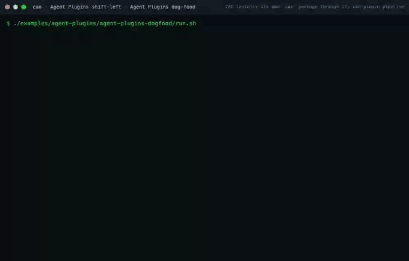

# Agent Plugins

> **Not the same thing as [Event Plugins](plugins.md).** CAO has two unrelated
> plugin systems. **Agent plugins** are portable packages of skills and MCP
> servers that conform to the open
> [Agent Plugins 1.0.0](https://agent-plugins.org/specification) specification
> and work across many agent clients. **Event plugins** are Python packages that
> run inside `cao-server` and react to CAO lifecycle events. Different formats,
> different audiences, different code. This page is about the first kind.

> [!WARNING]
> **Installing an agent plugin runs untrusted code and content from that
> source.** A plugin's skills become instructions injected into your agents'
> system prompts, and its MCP servers become subprocesses on your machine.
> CAO implements **no trust model, no signing, and no provenance verification**
> for agent plugins — the specification defers all three to a future revision,
> and CAO inherits that deferral rather than inventing its own. Install plugins
> only from sources you would trust with a shell on your machine.

## What an agent plugin is

A directory with a `plugin.json` manifest at its root:

```text
my-plugin/
├── plugin.json          # required manifest
├── skills/              # optional; each immediate child is one Agent Skill
│   └── my-skill/
│       └── SKILL.md
└── mcp.json             # optional; MCP servers (see "MCP servers" below)
```

Because the format is an open specification rather than a CAO invention, the
same directory installs into Kiro, VS Code, Cursor, Copilot, and Codex — and
CAO ships itself in that format too (see [CAO's own packages](#caos-own-packages)).

## Prerequisites

Installing third-party agent plugins into CAO needs nothing beyond CAO itself.
The two prerequisites below apply to the **`cao` operator package** — the one a
*foreign* client installs to drive CAO — and are also stated in that package's
manifest `description`:

| Prerequisite | Why |
|---|---|
| **`uv` on `PATH`** | The packaged MCP server is launched via `uvx`. The specification allows only a single `command` token, so the package cannot bundle a launcher. |
| **A CAO API server at `http://127.0.0.1:9889`** (`cao-server`) | Every operator tool is an HTTP call to that server. |

**The posture is localhost-only.** `SERVER_HOST` defaults to `127.0.0.1`, the
package never reaches a remote endpoint, and nothing in it opens a listening
socket. If you override `CAO_API_HOST` or `CAO_API_PORT` to a non-loopback
address, you have knowingly left that posture — CAO has not silently changed it.

CAO will **not** start a server for you. If `cao-server` is not running, an
operator tool call returns a structured error naming the failed operation and
its cause. Self-starting a long-lived daemon on a fixed local port would take
the decision of when CAO is listening away from you, so it is rejected rather
than merely unimplemented.

## Managing plugins

> [!NOTE]
> The command verb below is **provisional**. It is recorded as maintainer
> decision **M1** and is not settled: `docs/plugins.md` publicly promises
> `cao plugin list / info / enable / disable` as a future surface for *event*
> plugins, so taking the noun for agent plugins retracts a documented roadmap
> item. This page documents the recommended option; the decision must be
> recorded before the surface ships.

```bash
# Install from a local directory
cao plugin add ./path/to/my-plugin

# Install from a GitHub repository, optionally at a ref and/or subdirectory
cao plugin add https://github.com/owner/repo
cao plugin add https://github.com/owner/repo --ref v1.2.0 --subdir packages/my-plugin

# Check a candidate without installing it
cao plugin validate ./path/to/my-plugin
cao plugin validate ./path/to/my-plugin --json

# See what is installed, and which skill came from where
cao plugin list
cao plugin list --json

# Remove one (its persistent data is kept unless you ask otherwise)
cao plugin remove my-plugin
cao plugin remove my-plugin --purge-data
```

`--json` on `list` and `validate` emits a machine-readable report for CI and
scripting. `cao plugin add` and `cao plugin validate` exit non-zero when a
plugin is not loadable.

The same operations are available over the HTTP API — `GET/POST /plugins`,
`POST /plugins/validate`, `DELETE /plugins/{name}` — and in the web UI's
**Plugins** tab.

> [!NOTE]
> The web **Plugins** tab is **built but not shipped**, for the same reason as the
> verb above: Requirement 16.5 forbids these surfaces reaching end users before
> **M1** is recorded, and a visible tab is such a surface. It is gated off by
> `PLUGINS_TAB_ENABLED` in `web/src/featureFlags.ts`, the `cao plugin` command
> group is `hidden=True`, and the four TUI rows are `Policy::Hidden`. All three
> flip once M1 lands. The HTTP API is reachable now, scope-gated: reads need
> `cao:read` or better, and install, validate and remove need `cao:write` or
> `cao:admin`.

### Removing a plugin while a session is live

Two providers — Kiro CLI and OpenCode — read `SKILL.md` from disk *during* a
session rather than snapshotting it at launch. Removing a plugin can therefore
pull a skill out from under an agent that is mid-task and about to load it.

`cao plugin remove` checks running sessions and, if any profile references a
skill this plugin provides, reports which sessions and skills are affected and
asks for confirmation. It **warns**; it does not refuse — you may legitimately
want the plugin gone, and blocking removal while any long session runs would
make the store impossible to clean. `--yes` skips the prompt for scripted use.
The web UI applies the same gate before issuing its `DELETE`.

## Where things live

```text
~/.aws/cli-agent-orchestrator/
├── agent-plugins/<name>/         # the plugin's own bytes; CAO never modifies them
├── agent-plugin-data/<name>/     # persistent plugin data; survives updates
└── skills/                       # the global skill store (projection target)
```

Both directories are created `0o700` (owner-only). `agent-plugin-data/` lives
*outside* `agent-plugins/` deliberately: an update replaces a plugin's package
bytes wholesale, and the specification requires persistent data survive that.
`cao plugin remove` keeps it; `--purge-data` deletes it.

## How plugin skills reach your agents

A plugin's skills are **projected** into the global skill store as managed
symlinks:

```text
~/.aws/cli-agent-orchestrator/skills/<skill-name>
    -> ~/.aws/cli-agent-orchestrator/agent-plugins/<plugin>/skills/<skill-name>
```

That single mechanism reaches every provider through the pathway it already
uses — the runtime catalog, Copilot's baked `.agent.md`, Kiro's `skill://` globs,
and OpenCode's config symlink. See
[Agent-plugin-provided skills](skills.md#agent-plugin-provided-skills) for the details and
the collision rules.

On a system where symlink creation is unavailable (Windows without Developer
Mode or elevation), CAO falls back to copying and reports that it did. You can
make the choice explicit with `"skills": {"projection_mode": "copy"}` in
`settings.json`.

## Validation and what gets reported

Every install and every `validate` produces a report of **findings**, each
citing the specification clause it enforces:

| Severity | Meaning |
|---|---|
| `fatal` | The plugin is rejected. Nothing is installed. |
| `skipped` | One skill, component type, or server entry was dropped. The rest still load. |
| `warning` | Reported; nothing was dropped. |
| `info` | Informational. |

Failure is deliberately granular. One broken skill inside an otherwise valid
plugin is skipped with a report while its siblings install normally; a missing
`skills/` directory is not an error at all; and a fatal manifest problem rejects
the plugin *before any component loads*, leaving your installed set byte-identical
to what it was.

Validation never reaches the network. CAO validates against schema bytes
committed to its own repository, because the specification forbids retrieving a
schema while loading a plugin — which also means a compromised schema host
cannot change what CAO considers valid.

## MCP servers

A plugin may declare MCP servers in an `mcp.json` beside its `plugin.json`. CAO
validates it against the pinned `mcp.schema.json`, maps each server into its
internal MCP configuration, and merges the result into the `mcpServers` of every
agent profile it installs — the same dict from which each provider's native MCP
form is already derived. So a declared server reaches Kiro's agent JSON and
OpenCode's `opencode.json` with no per-provider work.

When the merge happens matters, and it is worth knowing as an operator:

- **`cao install <agent>`** picks up whatever plugins are installed at that
  moment.
- **`cao plugin add` / `cao plugin remove`** re-materialize the provider configs
  of agents you have already installed, so a plugin's servers appear on the
  agents you own without reinstalling each one, and are withdrawn when the plugin
  is removed. This is not cosmetic: `mcpServers` is written into each provider's
  config file and never re-read, so a removed plugin's servers must be *actively*
  taken out of those files — otherwise a provider would keep trying to launch a
  binary that removal just deleted from disk.

What "withdrawn" means depends on how a provider stores its config, and the
difference is deliberate rather than an inconsistency:

- **Kiro and Copilot** rewrite the agent's own file (`<name>.json`,
  `<name>.agent.md`) wholesale on every refresh, so a removed plugin's server is
  simply **absent** afterwards.
- **OpenCode** shares one `opencode.json` that CAO edits *in place*, and CAO must
  never delete a key it might not own. A removed plugin's server is therefore
  **disabled** (`"enabled": false`), not deleted: OpenCode will not spawn it, and
  re-installing the plugin re-enables it. The trade is that the disabled entry —
  with its now-dangling command — stays visible in `opencode mcp list` until you
  remove it by hand. Pruning it outright needs provenance CAO does not yet record
  and is tracked as a follow-up.

Server names collide the way skill names do, and are resolved by the same kind of
rule rather than by timing. **A server your profile already declares always
wins** — including CAO's own `cao-mcp-server` — and a plugin's same-named entry is
dropped with a report rather than merged, renamed, or prefixed. Between two
plugins claiming one name, the lexicographically smallest plugin name wins.
Renaming would be worse than dropping: the plugin's own documentation, and any
skill it ships that names the server, would describe something that no longer
answers. On OpenCode, that shared `opencode.json` may also hold servers **you**
wrote by hand; CAO applies the same rule there, dropping a plugin server with a
report rather than overwriting an entry it cannot prove it placed.

> **A plugin's MCP servers are commands the plugin chose, run on your machine
> with your user's permissions.** CAO expands only the two placeholders below,
> keeps every server's working directory and `./`-rooted command inside the
> plugin's own directory, and warns about credential-shaped values — but it does
> not sandbox the process, and it cannot: an MCP server is meant to do real work.
> The consent gate is the untrusted-content warning printed at install time, which
> is why installing is an explicit act and why `cao plugin validate` exists to let
> you read `mcp.json` before you install it. CAO's own localhost-only posture is
> unchanged by this: nothing here opens a port or accepts a remote connection.

**An unusable `mcp.json` disables MCP for that plugin and nothing else** — its
skills still install and deliver. One bad server entry likewise invalidates only
that entry; its siblings load.

Two placeholders are expanded, and only these two:

| Placeholder | Expands to |
|---|---|
| `${PLUGIN_ROOT}` | the plugin's own directory |
| `${PLUGIN_DATA}` | the plugin's persistent data directory |

They are expanded **only** in `args` elements, `env` *values*, and `cwd` — never
in `env` keys, `command`, `url`, or header names and values. Expansion is
single-pass: text introduced by a replacement is not re-scanned, and any other
`${...}` is left exactly as written. CAO does not perform any further
substitution on a mapped entry, because the specification forbids it.

Some entries are rejected, always with a report and never silently:

- **`command` must be one token.** It is never shell-split. A `./`-rooted
  command must resolve inside the plugin root.
- **`env` must not declare `PLUGIN_ROOT` or `PLUGIN_DATA`.** CAO supplies both
  itself, after applying the plugin's own `env`; an entry that tries to override
  them is invalidated.
- **`cwd` must stay contained**, checked after expansion against whichever root
  it is anchored to. Omitted, it defaults to the plugin root.
- **A transport the target provider cannot carry is skipped**, not failed over
  to a different one.
- **Credential-shaped `env` and `headers` values are warned about**, never
  blocked. The specification forbids credentials there; use `cao env` and CAO's
  secret gate for real secrets.

## CAO's own packages

CAO ships itself as two agent plugins, so any Agent-Plugins-compatible client
can drive a CAO session without CAO-specific integration code:

| Package | Install this if you are… | Skills | Also ships |
|---|---|---|---|
| [`cao`](../agent-plugin/cao) | **an operator** driving CAO from another client | `cao-session-management`, `cao-agent-routing`, `cao-supervisor-protocols`, `cao-worker-protocols` | the `cao-ops` MCP server |
| [`cao-contributor`](../agent-plugin/cao-contributor) | **a contributor** extending CAO itself | `cao-provider`, `cao-plugin` | — |

The skill names are the folder names you will see under
`~/.aws/cli-agent-orchestrator/skills/` after installing, which is what makes a
collision report readable when one of them clashes with a skill you already have.
Both packages are generated from CAO's own `skills/` directory by
`scripts/build_agent_plugin.py`, and `make check-agent-plugin` fails if the
generated packages drift from it — so this table, the packages, and the shipped
skills cannot disagree for long.

Each package also carries a small **Claude Code compatibility overlay**:
`.claude-plugin/plugin.json` (identity only, mirrored from `plugin.json`) and,
for `cao`, a `.mcp.json` byte-identical to `mcp.json`. Claude Code (verified
against 2.1.226) discovers `skills/` from the standard layout unchanged but
reads identity and MCP servers only from those two files; every other client
ignores dot-prefixed entries, and the validator discovers fixed locations only,
so the overlay changes nothing for Agent-Plugins-conformant clients. It is
generated and drift-guarded like every other package file.

The operator package's `mcp.json` declares one server, `cao-ops`, launched as
`uvx --from cli-agent-orchestrator==<version> cao-ops-mcp-server` — the
**outside-a-session** tool surface. The in-session `cao-mcp-server` is
deliberately not packaged: it derives its identity from a `CAO_TERMINAL_ID` that
a foreign client does not have, so its orchestration tools would fail on first
call. The version is pinned exactly, and the build refuses to write a pin that
is not already published on PyPI. `cao-contributor` ships no `mcp.json` at all:
authoring skills work through the host agent's own tools and need no CAO
runtime, so the `uv` and `cao-server` prerequisites do not apply to it.

```bash
# From a clone
cao plugin add ./agent-plugin/cao

# From GitHub, without cloning
cao plugin add https://github.com/awslabs/cli-agent-orchestrator --subdir agent-plugin/cao
```

Install `cao` if you want to *use* a fleet; install `cao-contributor` if you
want to *change CAO*. Keeping them separate means each package's skills all
serve one story, rather than every foreign agent carrying repo-development
instructions it will never act on.

Both packages are generated from CAO's canonical `skills/` tree by
`scripts/build_agent_plugin.py` and committed, with `make check-agent-plugin`
failing CI on any drift.

> [!NOTE]
> The name `cao-contributor` and the packaged name of the event-plugin authoring
> skill are provisional, pending maintainer decision **M4**.

## Verified by dog-fooding

The pipeline that installs those packages is exercised against itself by a
**gated** recorder: CAO installs its own [`cao`](../agent-plugin/cao) agent
plugin through its own `cao plugin` / `cao install` commands and asserts the
result at every step. The GIF below is the captured run — but the prose is not
the evidence, the **gate** is: the recorder only produces a GIF when the
asserting script exits `0` and prints its `PASS` marker, so a regressed pipeline
cannot make a green recording. The CI job
`Agent Plugins dog-food (shift-left recording)` runs it on every change.



What each step asserts, and why it is the load-bearing one:

1. **`cao plugin validate`** — the manifest is loadable, its four shipped skills
   are named, and `mcp_present` with the `cao-ops` server.
2. **`cao plugin add`** — each skill is projected into the skill store as a
   symlink whose target resolves into the plugin store (asserted on the link
   target, not on `ls` output).
3. **`cao install … --provider kiro_cli`** — the delivery fix, end to end: the
   agent JSON carries the `skill://` globs **and** `cao-ops` with
   `PLUGIN_ROOT`/`PLUGIN_DATA` expanded to real paths in `env`, **no**
   `x-cao-pre-expanded` marker leaked, and `@cao-ops` granted.
4. **`cao install … --provider opencode_cli`** — `opencode.json` gets a real
   boolean `"enabled": true`; and installing over a user's own same-named entry
   **preserves it and emits a finding** rather than clobbering it.
5. **`cao plugin remove cao`** — cross-provider removal: **absent** from the
   rewritten Kiro/Copilot config; **disabled** (`"enabled": false`) on OpenCode's
   shared config. The offline run asserts that written shape; a live-gated step
   additionally observes, via `opencode mcp list` and a sentinel wrapper, that a
   disabled entry is reported `disabled` and **no subprocess is spawned** for it
   (verified against OpenCode 1.18.15).

The runnable example, the offline-vs-live assertion matrix, and the recorder are
in [`examples/agent-plugins/agent-plugins-dogfood/`](../examples/agent-plugins/agent-plugins-dogfood/README.md).

## Security posture, stated plainly

- **No trust model.** Installing a plugin is equivalent to running untrusted
  code and content from its source. There is no signing and no provenance check.
- **Prompt injection is the main exposure.** Plugin skill content flows into
  agents' system prompts. This is not new — `extra_skill_dirs` already admits
  third-party skill content — but installing a plugin is one command rather than
  a deliberate settings edit. `cao plugin list` shows which plugin contributed
  each skill, so provenance is always recoverable.
- **Paths are contained.** Every path a plugin references is resolved with
  realpath and confined to that plugin's own root. A symlink whose target
  resolves inside the root is allowed; one that escapes is rejected, whatever
  the literal path looks like.
- **No secrets in package data.** The specification forbids credentials in MCP
  `env` and `headers`. CAO warns when a value looks credential-shaped and does
  not treat it as a supported mechanism. Use `cao env` and CAO's secret gate
  instead.
- **No schema fetch at load time.** Pinned bytes only.

## See also

- [Skills](skills.md) — the skill system agent plugins deliver into
- [Event Plugins](plugins.md) — CAO's *other*, unrelated plugin system
- [Agent Plugins 1.0.0 specification](https://agent-plugins.org/specification)
