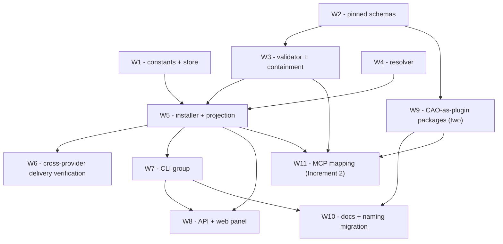

# Implementation Plan: cao-agent-plugins

> This task list was derived from `design.md` and `requirements.md`.
> **Issue of record:** [awslabs/cli-agent-orchestrator#573](https://github.com/awslabs/cli-agent-orchestrator/issues/573).
> **Open maintainer decisions:** This plan does not resolve **M1–M4** (see "Naming/decision gates" below); those remain open for maintainers.

## Overview

This plan is a direct, mechanical derivation of design.md's "Buildable Units and Dependency Edges" section (W1–W11). Each top-level task below corresponds to exactly one W-unit; no task blends two units and no unit is split across top-level tasks. Sub-tasks exist only to break down a unit's own acceptance signal into concrete coding/testing steps.

**Increment Boundary (design.md "Increment Boundary").** W1–W10 are Increment 1 (skills-only, conformant and shippable on their own per Agent Plugins §11.2). **W11 is Increment 2 only.** Every Increment 1 task below carries this hard constraint as an explicit acceptance check (Requirements 11.3–11.4): no Increment 1 task may reference `${PLUGIN_ROOT}`/`${PLUGIN_DATA}` expansion, `mcp.schema.json` validation, or launch a plugin subprocess — and no Increment 1 task's test suite may contain a test that launches one.

**Naming/decision gates (M1–M4).** Do not resolve M1–M4. Reference them exactly as design.md and requirements.md (Requirement 21) do:
- Fleet/library work — W1–W6, and W9's *building* of package content — does **not** wait on any naming decision. Build and test it now.
- Only the **ship-to-end-users** moment for the CLI/API/web surfaces (W7, W8) and for docs (W10) is gated. Per requirements.md Requirement 16.5 and design.md's AC6 coverage row: W7 and W8 must not ship to end users until **M1** is resolved by maintainers; W10 additionally needs **M2, M3, M4** resolved before it is published, since it documents the CLI verb, the extension-namespace stance, the event-plugin retitle, and the skill rename. These gates block *release to end users*, not construction, review, or testing of the code.

## Dependency Graph (design.md's mermaid graph, restated)



Textual edge list (identical to the above, for quick scanning): `W2→W3`, `W1→W5`, `W3→W5`, `W4→W5`, `W5→W6`, `W5→W7`, `W5→W8`, `W7→W8`, `W2→W9`, `W7→W10`, `W9→W10`, `W3→W11`, `W5→W11`, `W9→W11`.

Task-to-unit map: **Task 1 = W1, Task 2 = W2, Task 3 = W3, Task 4 = W4, Task 5 = W5, Task 7 = W6, Task 8 = W7, Task 9 = W8, Task 10 = W9, Task 11 = W10, Task 13 = W11.** Tasks 6, 12, and 14 are checkpoints (not W-units).

Per design.md: "W2, W4, and W9's schema-independent scaffolding can start immediately and in parallel. W6 is the integration gate for Increment 1. **W11 must not begin before W5 is merged**, or the Increment boundary erodes." That last constraint is called out again as an explicit blocking note on Task 13, not merely implied by the `W5 --> W11` edge.

## Tasks

- [ ] 1. Implement store and path primitives (W1) — Increment 1
  - Primary files: `constants.py`, `agent_plugins/store.py`, `agent_plugins/models.py`
  - Blocking: none (can start immediately, in parallel with W2/W4)
  - Acceptance check (Increment 1 constraint): this task must not introduce any `${PLUGIN_ROOT}`/`${PLUGIN_DATA}` reference, any `mcp.schema.json` validation path, or any plugin-subprocess launch (Req 11.3, 11.4).

  - [ ] 1.1 Add `AGENT_PLUGINS_DIR` and `AGENT_PLUGIN_DATA_DIR` constants in `constants.py`, following the existing `CAO_HOME_DIR` derivation and `0o700` convention
    - `AGENT_PLUGIN_DATA_DIR` must live outside `AGENT_PLUGINS_DIR` so a plugin update cannot destroy persistent state
    - _Requirements: 22.6_

  - [ ] 1.2 Implement `agent_plugins/models.py` data classes: `PluginManifest`, `Severity`, `Finding`, `DiscoveredSkill`, `PluginValidationReport`, `PluginRecord`, `PluginSource`
    - `extensions` is intentionally not modelled in Increment 1
    - `PluginValidationReport.loadable` must be structurally derivable (not independently settable) to support Requirement 5.4 once the validator (Task 3) populates it
    - _Requirements: 5.4_

  - [ ] 1.3 Implement `InstalledPluginStore` in `agent_plugins/store.py`: `list_installed`, `get`, `plugin_root`, `plugin_data_dir`, `publish` (stage-then-rename, mirroring `seed_default_skills()`'s `TemporaryDirectory(prefix=".<name>.")` + `Path.rename` pattern and its `errno.EEXIST/ENOTEMPTY` handling), `unpublish(purge_data: bool = False)`
    - `.state/<name>.json` install records are dot-prefixed siblings, never mistaken for a plugin
    - `unpublish` defaults `purge_data=False` (non-destructive remove)
    - _Requirements: 9.3, 10.2, 10.3, 10.4, 22.6_

  - [ ]* 1.4 Write unit tests for the store
    - Assert install-record round-trip, `0o700` permissions on `AGENT_PLUGINS_DIR`/`AGENT_PLUGIN_DATA_DIR`, and that `PLUGIN_DATA` survives a simulated publish-over-existing-name update
    - _Requirements: 9.3, 10.2, 10.3, 10.4, 22.6_

- [ ] 2. Vendor pinned Agent Plugins schemas and wire the drift guard (W2) — Increment 1
  - Primary files: `schemas/agent_plugins/1.0.0/*`, `scripts/vendor_agent_plugins_schemas.py`, `Makefile`
  - Blocking: none (can start immediately, in parallel with W1/W4)
  - Acceptance check (Increment 1 constraint): `mcp.schema.json` is committed in this task but must remain **unused** — no code path may validate against it until W11 (Req 11.3).

  - [ ] 2.1 Vendor `schemas/agent_plugins/1.0.0/plugin.schema.json` (byte-identical to the canonical published schema) and `mcp.schema.json` (committed, unused in Increment 1), plus `PIN.json` recording source URL, ref, and sha256 of each file
    - _Requirements: 4.1, 4.2_

  - [ ] 2.2 Implement `scripts/vendor_agent_plugins_schemas.py` with a refresh mode and a `--check` drift mode, mirroring `scripts/vendor_ext_apps_skills.py`'s `PINNED_REF`/`PINNED_SHA` pattern
    - `--check` must exit non-zero on any hash mismatch against `PIN.json`
    - _Requirements: 4.3_

  - [ ] 2.3 Add `Makefile` targets `refresh-agent-plugins-schemas` / `check-agent-plugins-schemas`, and add `check-agent-plugins-schemas` as a step in the existing `.github/workflows/ci.yml` `Unit Tests` job (which already runs on every PR)
    - _Requirements: 23.1_

  - [ ]* 2.4 Write property test for schema pin integrity and offline validation
    - **Property 11: Schema pin integrity and offline validation**
    - **Validates: Requirements 4.4, 4.5**
    - Assert vendored schema bytes hash to `PIN.json`'s recorded values, and that with all socket operations blocked, validation of a valid plugin still succeeds

- [ ] 3. Implement the validator and containment ladder (W3) — Increment 1
  - Primary files: `agent_plugins/validation.py`, `agent_plugins/containment.py`
  - Blocking: depends on **W2 (Task 2) being fully complete** (`W2 --> W3`)
  - Acceptance check (Increment 1 constraint): the validator may set `mcp_present: true` and emit an "MCP not supported in this CAO version" finding (Req 11.2), but must not otherwise reference `${PLUGIN_ROOT}`/`${PLUGIN_DATA}`, validate against `mcp.schema.json`, or launch a subprocess (Req 11.3, 11.4).

  - [ ] 3.1 Implement `containment.py::resolve_within_root` (realpath-canonicalize-then-guard, as a sibling to `utils/path_validation.py::safe_join_under_base` rather than a modification of it) implementing the §4.1 narrowest-applicable-failure-boundary ladder
    - _Requirements: 7.1, 7.2, 7.3, 7.4_

  - [ ] 3.2 Implement `validation.py::validate_plugin(root) -> PluginValidationReport`: never raises; selects rules from `$schema` (unrecognized → `FATAL`, no network I/O ever); enforces the closed manifest with exactly the two non-fatal exceptions (unknown top-level field, non-object `extensions`); enforces §5.5 name constraints; discovers `skills/` and `mcp.json` at fixed locations only (missing location is not an error; wrong-kind location invalidates only that component type); discovers skills as immediate, non-recursive children of `skills/` containing a regular `SKILL.md`, validating each independently; records `mcp_present` per Task 3's acceptance check above
    - _Requirements: 5.1, 5.2, 5.3, 6.1, 6.2, 6.3, 6.4, 11.1, 11.2, 12.1, 12.2, 12.3, 12.4_

  - [ ]* 3.3 Write property test for validation totality
    - **Property 1: Validation totality**
    - **Validates: Requirements 5.1, 5.2, 5.3, 5.4**
    - Generators: arbitrary bytes as `plugin.json`, arbitrary nesting, symlink loops, unreadable modes, zero-byte files, non-UTF-8 content — `validate_plugin` must never raise and `loadable` must equal "no FATAL findings"

  - [ ]* 3.4 Write property test for fatality classification
    - **Property 2: Fatality classification**
    - **Validates: Requirements 6.1, 6.2, 6.3, 6.4**
    - An unknown top-level field or a non-object `extensions` yields `loadable=true` with a finding; every other schema violation yields `loadable=false` and zero discovered components

  - [ ]* 3.5 Write property test for containment
    - **Property 3: Containment**
    - **Validates: Requirements 7.1, 7.2, 7.3, 7.4**
    - Generators must include `../` escapes, absolute paths, and symlinks pointing both inside and outside the root

  - [ ]* 3.6 Write property test for sibling independence
    - **Property 7: Sibling independence**
    - **Validates: Requirements 12.1, 12.2**
    - For N skill directories with k invalid: exactly N−k discovered, exactly k `SKIPPED` findings, independent of directory iteration order

  - [ ]* 3.7 Build the conformance corpus fixture tree (one directory per row of design.md's failure-isolation table) asserting exact finding codes and `spec_ref` values, and include the upstream `agent-plugins-example` package as a known-good positive fixture
    - _Requirements: 23.3, 23.4_

- [ ] 4. Implement the resolver (W4) — Increment 1
  - Primary files: `agent_plugins/resolver.py`
  - Blocking: none (can start immediately, in parallel with W1/W2)

  - [ ] 4.1 Implement `resolve(source: PluginSource, dest: Path)` for the `path` source kind: copies the directory's contents into staging (never references in place)
    - _Requirements: 8.1, 8.5_

  - [ ] 4.2 Implement the `git` source kind: `git clone --depth 1 [--branch <ref>]`, `--subdir` addressing of a subdirectory as the candidate plugin root, and recording the resolved commit SHA in the install record
    - The Resolver SHALL NOT initialize or fetch git submodules for the `git` source kind — this is a stated non-behavior (the no-submodule-init acceptance item), not an artifact of `--depth 1`'s current default
    - _Requirements: 8.2, 8.3, 8.5_

  - [ ] 4.3 Implement error handling for unreachable sources (invalid local path, failed git operation): report the failure with the underlying cause, leave the installed set unchanged
    - _Requirements: 8.4_

  - [ ]* 4.4 Write unit tests for the resolver: local-copy isolation from the original directory, git clone + `--subdir` + `ref` capture, submodule non-initialization, unreachable-source error reporting
    - _Requirements: 8.1, 8.2, 8.3, 8.4, 8.5_

- [ ] 5. Implement the installer and skill projection (W5) — Increment 1
  - Primary files: `agent_plugins/installer.py`, `agent_plugins/projection.py`, `agent_plugins/provenance.py`
  - Blocking: depends on **W1 (Task 1), W3 (Task 3), and W4 (Task 4) all being fully complete** (`W1 --> W5`, `W3 --> W5`, `W4 --> W5`)
  - Acceptance check (Increment 1 constraint): the install/projection sequence must not expand `${PLUGIN_ROOT}`/`${PLUGIN_DATA}`, must not validate `mcp.schema.json`, and must not launch a plugin subprocess (Req 11.3, 11.4). `mcp_present` may be recorded and reported per Task 3; no MCP behavior is implemented here.

  - [ ] 5.1 Implement `install(source, *, force=False, dry_run=False) -> InstallOutcome` sequencing resolve → validate-the-staged-copy → name-collision check (refuse unless `force`) → atomic publish → projection rebuild (5.3) → `utils/skill_injection.refresh_all_cao_managed_agents()` → write install record; `dry_run` performs resolve+validate only and is what `cao plugin validate` (Task 8) uses
    - _Requirements: 9.1, 9.2, 9.3, 9.5_

  - [ ] 5.2 Implement `uninstall(name, *, purge_data=False) -> UninstallOutcome`: restores the pre-install Store state exactly, deleting `Plugin_Data` only when `purge_data` is set
    - _Requirements: 10.1, 10.2, 10.3, 10.4_

  - [ ] 5.3 Implement `projection.py` rebuild: materialize each valid, non-colliding plugin skill as a managed symlink `SKILLS_DIR/<skill-name> -> AGENT_PLUGINS_DIR/<plugin-name>/skills/<skill-name>`; add the copy-mode fallback (`skills.projection_mode: "symlink" | "copy"` in `settings.json`) for environments where symlink creation is unsupported; implement the dangling-link sweep so it runs on rebuild and on `cao plugin list`, never raises (mirrors `list_skills()`'s `is_dir()`/`SKILL.md is_file()` tolerance of a broken link), and logs-and-continues when a link cannot be removed
    - _Requirements: 13.1, 13.3, 13.4, 15.4, 15.5_

  - [ ] 5.4 Implement projection collision resolution in `projection.py`: pre-existing built-in/user-added skill always wins over any plugin (skip + `SKIPPED` finding); among competing **plugins**, the lexicographically-smallest manifest `name` wins deterministically (persisted-state total order, never `installed_at` or scan order); when a rebuild reassigns an already-projected skill's winner, emit an additional `WARNING`-severity `projection.winner_changed` finding naming both the previous and new winner, alongside the `SKIPPED` finding on the loser
    - _Requirements: 14.1, 14.2, 14.3, 14.4, 14.5_

  - [ ] 5.5 Implement `provenance.py::owning_plugin(skill_name) -> str | None`, a read-only lookup over install records, used by `cao plugin list` (Task 8), the web panel (Task 9), and `cao skills list` annotation
    - _Requirements: 13.1_

  - [ ] 5.6 Implement removal-safety warn-and-confirm in `installer.py`: on `uninstall`/CLI `remove`, intersect running terminals' referenced skill names with the plugin's `projected_skill_names`; on a non-empty intersection, report affected sessions/skills and require confirmation (bypassable) before proceeding; this warns, it never refuses
    - _Requirements: 15.1, 15.2, 15.3_

  - [ ]* 5.7 Write property test for isolation
    - **Property 4: Isolation**
    - **Validates: Requirements 9.2, 9.3, 9.4**
    - For any invalid plugin and any pre-existing installed set: `install()` changes nothing in `AGENT_PLUGINS_DIR`/`SKILLS_DIR`

  - [ ]* 5.8 Write property test for idempotence
    - **Property 5: Idempotence**
    - **Validates: Requirements 10.1, 10.2, 10.3, 10.4**
    - `add(X)` then `add(X, force=True)` == a single `add(X)`; `add(X)` then `remove(X)` restores pre-`add` state except `Plugin_Data`, which persists unless `--purge-data`

  - [ ]* 5.9 Write property test for skills-only conformance
    - **Property 6: Skills-only conformance**
    - **Validates: Requirements 11.1, 11.5**
    - For any plugin with a valid manifest, ≥1 valid skill, and no `mcp.json`: `loadable=true`, every skill projected, `mcp_present=false`, zero `FATAL` findings

  - [ ]* 5.10 Write property test for projection non-shadowing and deterministic collision winner
    - **Property 8: Projection non-shadowing and deterministic collision winner**
    - **Validates: Requirements 14.1, 14.2, 14.3, 14.4, 14.5**
    - Includes the non-shadowing case, the lexicographic-winner case, the stability-under-repeated-rebuild case, the stability-under-install-order-permutation case (adversarial name generators: names differing only in the final character, names whose creation order reverses their sort order), and the transition-warning case where installing a new lexicographically-earlier claimant after an earlier winner was already projected must emit `projection.winner_changed` in addition to the loser's `SKIPPED` finding

  - [ ]* 5.11 Write a launch-safety test for the dangling-link sweep
    - Break a projected link concurrently with `terminal_service.create_terminal` and assert terminal creation still succeeds (never raises)
    - _Requirements: 15.4, 15.5_

- [ ] 6. Checkpoint — Increment 1 core pipeline
  - Ensure all tests pass, ask the user if questions arise.

- [ ] 7. Verify cross-provider skill delivery (W6) — Increment 1
  - Primary files: `test/agent_plugins/test_delivery_*.py`
  - Blocking: depends on **W5 (Task 5) being fully complete** (`W5 --> W6`)
  - This unit's entire deliverable is verification — design.md names it explicitly as "the integration gate for Increment 1." Its sub-tasks are **not** optional/skippable test scaffolding; they are the unit's required output and must be implemented.

  - [ ] 7.1 Provider integration test: install a fixture plugin and assert its skill appears in the runtime-catalog text for Claude Code, Codex, Kimi, and Antigravity
    - _Requirements: 13.2_

  - [ ] 7.2 Provider integration test: assert the skill appears in the baked Copilot `.agent.md` body after the install-time `refresh_all_cao_managed_agents()` call
    - _Requirements: 13.2_

  - [ ] 7.3 Provider integration test: assert the skill is reachable through Kiro CLI's `skill://{SKILLS_DIR}/**/SKILL.md` glob traversal of the projected symlink
    - _Requirements: 13.2_

  - [ ] 7.4 Provider integration test: assert the skill is reachable through OpenCode's `OPENCODE_CONFIG_DIR/skills` symlink traversal
    - _Requirements: 13.2_

  - [ ] 7.5 Write property test for cross-provider delivery equivalence
    - **Property 10: Cross-provider delivery equivalence**
    - **Validates: Requirements 13.2**
    - For every one of the seven providers, assert the reachable skill-name set equals `builtin ∪ extra_dirs ∪ projected(valid plugin skills)`, checked against each provider's real delivery artifact

- [ ] 8. Implement the `cao plugin` CLI group (W7) — Increment 1
  - Primary files: `cli/commands/agent_plugin.py`, `cli/main.py`
  - Blocking: depends on **W5 (Task 5) being fully complete** (`W5 --> W7`)
  - **Blocked on decision (M1):** the exact verb (`cao plugin` per design.md's recommendation, or `cao agent-plugin`, or another form) is not settled by this document or by requirements.md — see requirements.md Requirement 16.4–16.5. **Build and test this CLI group now** under whichever verb is used as a working placeholder; do **not** ship it to end users until maintainers resolve M1. This gate blocks release, not construction.

  - [ ] 8.1 Implement `add <source> [--ref REF] [--subdir PATH] [--force] [--dry-run]`, `list [--json]`, `validate <path> [--json]` in `cli/commands/agent_plugin.py`, matching `cli/commands/skills.py`'s `click.group()` shape and `raise click.ClickException(str(exc))` convention; `--json` emits a machine-readable report, its absence emits `cao skills list`-style two-column human output
    - _Requirements: 16.1, 16.2, 16.3_

  - [ ] 8.2 Implement `remove <name> [--purge-data] [--yes]`, wiring the warn-and-confirm behavior from Task 5.6 (report affected sessions/skills, require confirmation, `--yes` bypasses)
    - _Requirements: 15.1, 15.2, 15.3, 16.6_

  - [ ] 8.3 Register the command group in `cli/main.py`
    - _Requirements: 16.1_

  - [ ]* 8.4 Write unit tests for the CLI: parity with `cao skills`'s command shape, `--json` machine-readability on `list`/`validate`, and the removal confirmation flow (including `--yes` bypass)
    - _Requirements: 16.1, 16.2, 16.3, 16.6_

- [ ] 9. Implement the HTTP API and web panel (W8) — Increment 1
  - Primary files: `api/main.py`, `web/src/api.ts`, `web/src/components/PluginsPanel.tsx`, `web/src/App.tsx`
  - Blocking: depends on **W5 (Task 5) and W7 (Task 8) both being fully complete** (`W5 --> W8`, `W7 --> W8`)
  - **Blocked on decision (M1):** same gate as Task 8 — build and test this surface now; do not ship it to end users until M1 is resolved.

  - [ ] 9.1 Add `GET /plugins`, `POST /plugins`, `POST /plugins/validate`, `DELETE /plugins/{name}` inline in `api/main.py`, next to the existing `/skills/{name}` and `/settings/skill-dirs` handlers
    - `GET /plugins` and the `DELETE` response report affected sessions/skill names when a live session's profile references a projected skill (per Task 5.6)
    - _Requirements: 17.1, 17.5_

  - [ ] 9.2 Add the corresponding client functions to `web/src/api.ts`
    - _Requirements: 17.1_

  - [ ] 9.3 Implement `web/src/components/PluginsPanel.tsx`: render the installed set, each plugin's findings (including non-fatal ones), and the skills each plugin contributes; add an install-from-GitHub-URL affordance; implement the remove flow so it renders the affected-sessions/skills information from the `DELETE`/preceding `GET` response as an explicit confirmation step and **waits for operator confirmation before issuing `DELETE /plugins/{name}`** — this is a second, independent enforcement point for the warn-and-confirm behavior, not a passive renderer of the API's report
    - _Requirements: 17.2, 17.3, 15.1, 15.3_

  - [ ] 9.4 Add the Plugins tab in `web/src/App.tsx`, appended **after all existing tabs** so existing tab positions and Alt+N shortcuts are unaffected
    - _Requirements: 17.4_

  - [ ]* 9.5 Write tests for the API endpoints and the panel's confirm-before-DELETE behavior
    - _Requirements: 17.1, 17.2, 17.3, 17.4, 17.5_

- [ ] 10. Build the two CAO-as-plugin packages (W9) — Increment 1 (skills-only content; `mcp.json` is added in Task 13/W11)
  - Primary files: `agent-plugin/cao/**`, `agent-plugin/cao-contributor/**`, `scripts/build_agent_plugin.py`, `Makefile`, `.github/workflows/ci.yml`
  - Blocking: depends on **W2 (Task 2) being fully complete** (`W2 --> W9`); may proceed in parallel with W3/W4/W5/W6/W7
  - **M4 note:** the Contributor_Package's name (`cao-contributor`) and the packaged name of the event-plugin authoring skill are **provisional pending M4**. Build using the current `cao-plugin` skill name and the `cao-contributor` package name now; do not restructure — a rename, if M4 lands, is a one-line allowlist edit plus a rebuild.
  - **Conditional-item note:** `cao-contributing` depends on PR [#448](https://github.com/awslabs/cli-agent-orchestrator/pull/448), which is **open and still a draft**. This task must build the Contributor_Package's allowlist as **data** (not structure) so that adding `cao-contributing` when #448 lands is a one-line allowlist edit and a rebuild — it must **not** be added or claimed as present now.

  - [ ] 10.1 Implement `scripts/build_agent_plugin.py`: per-package configuration (name, manifest fields, skill allowlist) for both packages; sync each package's `plugin.json` `version` from CAO's package metadata so the two values cannot diverge without a build failure
    - _Requirements: 1.5, 2.1, 3.1, 3.2_

  - [ ] 10.2 Build `agent-plugin/cao/` (Operator_Package): `plugin.json` with `$schema` pinned to 1.0.0, `name: "cao"`, and a `description` stating the `uv`-on-`PATH` prerequisite, the local CAO API server prerequisite, and the localhost-only posture; copy in the allowlisted skills `cao-session-management`, `cao-agent-routing` (plus `cao-supervisor-protocols`/`cao-worker-protocols` under the current maintainer-tunable default of inclusion); explicitly exclude `cao-provider`, the event-plugin authoring skill, and `skills/vendor/ext-apps/*`
    - _Requirements: 1.1, 1.2, 1.3, 1.4, 1.5_

  - [ ] 10.3 Build `agent-plugin/cao-contributor/` (Contributor_Package): `plugin.json` with `$schema` pinned to 1.0.0, `name: "cao-contributor"`; copy in `cao-provider` and the event-plugin authoring skill (current name); no `mcp.json`; no operator-facing skills; no `cao-contributing` entry yet
    - _Requirements: 2.1, 2.2, 2.3, 2.4, 2.5, 2.6, 2.8_

  - [ ] 10.4 Implement `--check` drift mode in `scripts/build_agent_plugin.py` evaluating **both** packages independently, exiting non-zero if either package's generated tree diverges from its allowlist/source or fails Validator loading with a `FATAL` finding — a failure in one package must not suppress reporting a failure in the other
    - _Requirements: 3.3, 3.4, 3.5_

  - [ ] 10.5 Add `Makefile` targets `agent-plugin` / `check-agent-plugin` and wire `check-agent-plugin` as a step in the existing `.github/workflows/ci.yml` `Unit Tests` job
    - _Requirements: 23.2_

  - [ ]* 10.6 Write unit tests: `cao plugin validate` (or the underlying `validate_plugin` call) reports `loadable=true` with zero fatals for **both** packages; each package's allowlist is enforced independently; the absence of `cao-contributing` in the Contributor_Package is **not** treated as a validation failure
    - _Requirements: 1.6, 2.6, 2.7, 3.3, 3.4, 23.2_

- [ ] 11. Write docs and apply the naming migration (W10) — Increment 1
  - Primary files: `docs/agent-plugins.md`, `docs/plugins.md`, `docs/skills.md`, `scripts/sync_skills.py`
  - Blocking: depends on **W7 (Task 8) and W9 (Task 10) both being fully complete** (`W7 --> W10`, `W9 --> W10`)
  - **Blocked on decision (M1, M2, M3, M4):** per requirements.md Requirement 16.5 and design.md's AC6 coverage row, this task's content must not be **published to end users** until all four naming decisions are resolved and recorded by maintainers — the CLI verb this task documents (M1), the extension-namespace stance it must not exceed (M2), the exact retitle/banner treatment of `docs/plugins.md` (M3), and the skill-rename/retirement step (M4). Draft the content now; gate publication on M1–M4, not construction.

  - [ ] 11.1 Write `docs/agent-plugins.md`: untrusted-content warning stated in the first screenful, the `uv` prerequisite, the `cao-server`-on-`http://127.0.0.1:9889` prerequisite, the localhost-only posture, and the two-package split (which package an operator wants vs. a contributor)
    - _Requirements: 1.5, 22.1, 22.7_

  - [ ] 11.2 Retitle `docs/plugins.md`'s H1 to "Event Plugins" and add a disambiguation banner distinguishing it from agent plugins; keep its existing path unchanged (inbound links, `scripts/validate_markdown_links.py`)
    - _Requirements: 21.4_

  - [ ] 11.3 Add a section to `docs/skills.md` on plugin-provided skills, pointing at the projection behavior from Task 5.3
    - _Requirements: 13.1_

  - [ ] 11.4 Apply the repo-wide vocabulary rule to all three docs above: "event plugin" and "agent plugin" are always qualified; bare "plugin" is only acceptable inside a document whose title already scopes it
    - _Requirements: 21.4_

  - [ ] 11.5 Prepare (but do not activate until M4 is resolved) the retirement step for renaming the `cao-plugin` skill to `cao-event-plugin`: update the `SHIPPED_SKILLS` allowlist in `scripts/sync_skills.py` and add a one-shot retirement step to `seed_default_skills()` in `cli/commands/init.py` so an upgraded installation does not keep both the old and new skill directories simultaneously
    - _Requirements: 21.5_

  - [ ]* 11.6 Run `scripts/validate_markdown_links.py` and confirm it is green against the updated docs
    - _Requirements: 23.1 (doc hygiene, same CI job pattern)_

- [ ] 12. Checkpoint — Increment 1 complete
  - Ensure all tests pass, ask the user if questions arise.

- [ ] 13. Implement MCP configuration mapping (W11) — **Increment 2 only**
  - Primary files: `agent_plugins/mcp_mapping.py`, `agent-plugin/cao/mcp.json`
  - Blocking: depends on **W3 (Task 3), W5 (Task 5), and W9 (Task 10) all being fully complete** (`W3 --> W11`, `W5 --> W11`, `W9 --> W11`)
  - **Explicit blocking note (in addition to the graph edges above):** design.md states outside the dependency graph itself that "W11 must not begin before W5 is merged, or the Increment boundary erodes." Do not start any sub-task of this unit until Task 5's implementation has actually landed (merged), not merely queued.
  - This is the **only** unit in this plan permitted to reference `${PLUGIN_ROOT}`/`${PLUGIN_DATA}` expansion, validate against `mcp.schema.json`, or launch a plugin subprocess.

  - [ ] 13.1 Implement `mcp_mapping.py::map_mcp_config(root, data_dir, cfg) -> MappedMcpResult`: `command` treated as a single token, never shell-split or placeholder-expanded; single-pass, non-recursive `${PLUGIN_ROOT}`/`${PLUGIN_DATA}` expansion restricted to `args` elements, `env` values, and `cwd` only (never `env` keys, `command`, `url`, or header names/values), with unrecognized `${...}` left literal; mark mapped entries pre-expanded so CAO's profile-level `\$\{(\w+)\}` interpolation in `services/install_service.py` skips them; reject any server entry whose `env` declares a `PLUGIN_ROOT`/`PLUGIN_DATA` key; apply per-entry containment (Task 3.1) to `command`/`cwd`, invalidating only that entry on failure; skip (with a report) any entry whose transport is unsupported by the target provider; emit a `WARNING`-severity finding (never blocking) for credential-shaped values in `env`/`headers`
    - _Requirements: 18.1, 18.2, 18.3, 18.4, 18.5, 18.6, 18.7, 18.8_

  - [ ] 13.2 Add `agent-plugin/cao/mcp.json`: server key `cao-ops` invoking the `cao-ops-mcp-server` console script (never `cao-mcp-server`, which requires an in-session `CAO_TERMINAL_ID` this package cannot provide); `command` is the single token `uvx`; `args` pins an exact, already-published `cli-agent-orchestrator` version; no `env`, no `headers`; `$schema` equal to the same package's `plugin.json` `$schema`
    - _Requirements: 19.1, 19.2, 19.3, 19.6, 19.7_

  - [ ] 13.3 Wire version-pin generation and publish-verification into `scripts/build_agent_plugin.py`: the pin is written by the same pass that syncs `plugin.json`'s `version`, and the build fails if the pinned version is not yet published
    - _Requirements: 19.4, 19.5_

  - [ ]* 13.4 Write property test for expansion soundness
    - **Property 9: Expansion soundness**
    - **Validates: Requirements 18.1, 18.2, 18.3**
    - For arbitrary strings containing `${PLUGIN_ROOT}`, `${PLUGIN_DATA}`, and arbitrary other `${...}`: only the two recognized placeholders are replaced, replacement is single-pass (seed `PLUGIN_DATA` with a literal `${PLUGIN_ROOT}` to verify no rescan), unrecognized placeholders stay literal, `env` keys and `command` are never altered

  - [ ]* 13.5 Write unit tests for the mapper's non-property behaviors: `env` `PLUGIN_ROOT`/`PLUGIN_DATA` key collision rejection, per-entry containment isolation (sibling entries unaffected), transport-mismatch skip-with-report, and the non-blocking credential-shape warning
    - _Requirements: 18.5, 18.6, 18.7, 18.8_

  - [ ]* 13.6 Write tests confirming the `Ops_MCP_Server` availability contract: a tool call while the CAO API server is unreachable returns a structured tool-level error string naming the operation and cause, never hangs, never returns a silent empty result, and the server never attempts to self-start a CAO API server
    - _Requirements: 20.1, 20.2, 20.3, 20.4_

- [ ] 14. Checkpoint — Increment 2 complete
  - Ensure all tests pass, ask the user if questions arise.

## Notes

- Tasks marked with `*` are optional and can be skipped for a faster MVP, **except** Task 7's sub-tasks (7.1–7.5), which — although test-shaped — are the required deliverable of W6, design.md's explicit "integration gate for Increment 1," and must be implemented.
- Every task references specific requirement IDs from `requirements.md`; the closing Traceability Matrix in `requirements.md` is the authoritative cross-reference from each property (P1–P11) and each #573 acceptance criterion (AC1–AC7) to its requirement(s).
- Increment 1 (Tasks 1–11) is conformant and shippable per Agent Plugins §11.2, but per design.md it does **not** close #573 on its own: AC1's `mcp.json` half and AC2's tools-callable half require Increment 2 (Task 13/W11).
- Do not resolve M1–M4 while executing this plan. Where a task is blocked on a decision, that block applies to shipping to end users, not to building, reviewing, or testing the code.
- AC3 (contributor plugin) cannot be fully closed by this repository alone: `cao-contributing` depends on PR #448 landing. Task 10 makes that arrival a one-line allowlist edit, not a claim that the skill is already present.

## Task Dependency Graph

```json
{
  "waves": [
    { "id": 0, "tasks": ["1.1", "1.2", "2.1", "2.2", "4.1"] },
    { "id": 1, "tasks": ["1.3", "2.3", "4.2"] },
    { "id": 2, "tasks": ["1.4", "2.4", "4.3"] },
    { "id": 3, "tasks": ["3.1", "4.4", "10.1"] },
    { "id": 4, "tasks": ["3.2", "10.2", "10.3"] },
    { "id": 5, "tasks": ["3.3", "3.4", "3.5", "3.6", "10.4"] },
    { "id": 6, "tasks": ["3.7", "10.5"] },
    { "id": 7, "tasks": ["10.6", "5.1", "5.3", "5.5"] },
    { "id": 8, "tasks": ["5.2", "5.4"] },
    { "id": 9, "tasks": ["5.6", "5.10"] },
    { "id": 10, "tasks": ["5.7", "5.8", "5.9", "5.11"] },
    { "id": 11, "tasks": ["7.1", "7.2", "7.3", "7.4", "8.1", "13.1", "13.2"] },
    { "id": 12, "tasks": ["7.5", "8.2", "8.3", "13.3"] },
    { "id": 13, "tasks": ["8.4", "13.4", "13.5", "13.6"] },
    { "id": 14, "tasks": ["9.1", "11.1", "11.2", "11.3", "11.5"] },
    { "id": 15, "tasks": ["9.2", "11.4"] },
    { "id": 16, "tasks": ["9.3", "11.6"] },
    { "id": 17, "tasks": ["9.4"] },
    { "id": 18, "tasks": ["9.5"] }
  ]
}
```
