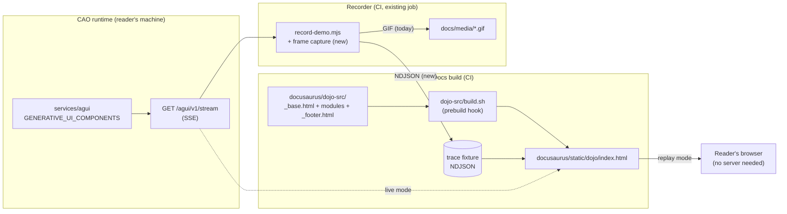

# Design: a CAO Dojo on the docs site

**Requirements:** `./requirements.md`
**Status:** Specified, not implemented.

---

## Overview

Assemble a static, zero-dependency interactive page at `/dojo/index.html` on the CAO
docs site that renders the AG-UI stream in two modes: **replay** from a committed trace
fixture (default, no setup) and **live** from the reader's own `cao-server`.

The renderer is the existing `examples/ag-ui/ag-ui-eventsource-viewer/index.html`,
refactored into `dojo-src/` parts so the same file is not maintained twice. The build is
`course-src/build.sh` applied to a second target.

## Corrections to the sketch in the plan

Three things in the original proposal were wrong or underspecified, found while
grounding this against the code:

### The recorder cannot supply the fixture as-is

`record-demo.mjs` drives Playwright and pipes **screenshots** to ffmpeg, producing a
GIF. It never persists SSE payloads. The plan implied the fixture was a by-product of
an existing job; it is not. Frame capture is new work — small (an `EventSource`
listener writing NDJSON) but it must be built, and FR-4 exists to stop it being
hand-waved into a hand-written file.

### "Embed the viewer" is the wrong verb

The viewer is 499 lines of self-contained HTML with a hardcoded endpoint. Embedding it
in an iframe would duplicate it and let the copies drift. The right move is to make
`dojo-src/` the single source and have the standalone example be *generated from the
same parts*, so there is one renderer.

### The allow-list must not be re-declared

An earlier sketch had the Dojo listing the six components to build its UI. That creates
a second source of truth that will drift from `GENERATIVE_UI_COMPONENTS`. The page must
render whatever component name arrives, dispatching on a generic renderer, so the
server stays authoritative (FR-6).

## Position in the system



The Dojo is a **consumer** of the stream contract and nothing else. It imports no CAO
Python, adds no route, and cannot alter what the surface emits.

## File layout

```
docusaurus/
  .gitignore                 # add /static/dojo/ — see note below
  dojo-src/
    build.sh                 # mirrors course-src/build.sh
    _base.html               # doctype, <head>, mode switcher shell
    modules/
      10-transport.html      # EventSource (live) | fixture player (replay)
      20-state.html          # STATE_SNAPSHOT + RFC-6902 STATE_DELTA application
      30-render.html         # generic component dispatch, no name list
      40-controls.html       # mode toggle, endpoint field, replay scrubber
    _footer.html
    fixtures/
      fleet-run.ndjson       # captured, never hand-written (FR-4)
  static/dojo/index.html     # BUILD OUTPUT — gitignored, not committed
  docs/features/dojo.md      # reference docs (FR-8)
  blog/YYYY-MM-DD-*/index.md # narrative (separate PR, FR-9)

examples/ag-ui/ag-ui-eventsource-viewer/
  index.html                 # generated from the same dojo-src parts
  tools/record-demo.mjs      # + persist SSE frames
```

**Modules are `.html`, not `.js`.** `course-src/build.sh` concatenates
`"$SRC/$name"/modules/*.html` in filename order, so each module is an HTML fragment
carrying its own `<script>` block. Following that exactly keeps one build idiom in the
repo; introducing a `.js` variant would mean `build.sh` and its sibling diverge.

**Build output is gitignored, and the pattern is already established.**
`docusaurus/.gitignore:13-15` lists `/static/course/`, `/static/course-advanced/`, and
`/static/course-assets/`. Adding `/static/dojo/` in the same block is required — without
it, every contributor who runs `npm start` gets a dirty working tree.

## Interfaces

### The transport seam

Both modes satisfy one internal contract, which is what keeps replay honest — the
renderer cannot tell which mode it is in, so a fixture exercises the same code path as
a live stream:

```js
// 10-transport.js
// onFrame(frame) is called with parsed AG-UI events in arrival order.
// Returns { stop() }.
function openLive(endpoint, onFrame, onError) { /* EventSource */ }
function openReplay(fixtureUrl, onFrame, opts) { /* fetch + paced replay */ }
```

### The fixture format

NDJSON, one AG-UI event per line, in arrival order, with a header record carrying
provenance:

```json
{"_meta":{"captured_at":"…","cao_version":"…","run_ids":["…"],"truncated":false}}
{"type":"STATE_SNAPSHOT","snapshot":{…}}
{"type":"STATE_DELTA","delta":[{"op":"replace","path":"/terminals/0/status","value":"processing"}]}
{"type":"GENERATIVE_UI","component":"approval_card","props":{…}}
```

NDJSON rather than a JSON array so capture is append-only and a truncated recording is
still a valid prefix.

## Algorithms

### Generic component dispatch (FR-6)

```
on GENERATIVE_UI frame:
    component  = frame.component          # trusted: server already validated it
    renderer   = RENDERERS[component] or GENERIC_RENDERER
    renderer(frame.props)
```

`RENDERERS` holds presentation refinements keyed by component name, and
`GENERIC_RENDERER` renders any props object as labelled fields. A component the page
has never seen still renders; a component the server stops sending simply stops
appearing. No list to drift.

### Replay pacing

Frames carry no wall-clock deltas, so replay uses a fixed inter-frame interval with a
scrubber, rather than inventing timings. Fabricated timings would be a claim about
performance the recording does not support.

### Live-mode failure (FR-2)

```
openLive():
    es = new EventSource(endpoint)
    es.onerror → if no frame has ever arrived:
                     render "No CAO server reachable at <endpoint>" + start instructions
                 else:
                     render "Disconnected after N frames" + retry
```

Distinguishing "never connected" from "connection dropped" matters: the first is a
setup problem with a documented fix, the second is not.

## Verification strategy

| Requirement | How it is verified |
|---|---|
| FR-1 build pattern | `npm run build` produces `static/dojo/index.html`; asserted present and non-empty |
| FR-3 replay, zero setup | CI opens the built file over `file://` with no server and asserts components render |
| FR-4 fixture provenance | Fixture carries `_meta.captured_at` / `cao_version`; a test rejects a fixture without it |
| FR-5 CI gate | Playwright drives `static/dojo/index.html`, asserts each component in the fixture renders |
| FR-6 no second source of truth | A test greps the built page for hardcoded component names and fails if any appear |
| FR-7 metadata-only | A test asserts no `_BODY_FIELDS` key occurs anywhere in the fixture |
| FR-10 blog gates | `npm run build` failing on an unregistered author *is* the test |

FR-6's test is deliberately a grep. It is crude, and it is the only check that actually
prevents the drift, because a well-intentioned future edit adding a nicer
`approval_card` layout is exactly how a second source of truth appears.

## Alternatives considered

**Iframe the existing example.** Rejected: two copies of the renderer, guaranteed
drift, and the endpoint stays hardcoded.

**Host a live demo fleet.** Rejected on the static constraint, and it would put a
public unauthenticated `cao-server` on the internet — `cao-server` is an
unauthenticated command-execution surface, so this is a non-starter regardless of cost.

**A React/MDX component in the docs.** Rejected: the docs site has exactly one
`.tsx` file (`src/pages/index.tsx`), and `course-src` establishes standalone HTML as
the house pattern for interactive content. Following the existing pattern costs less
and matches what reviewers expect.

**Ship replay only.** Tempting, and it is what PR 1 does. Rejected as the end state:
live mode against the reader's own fleet is the differentiator. Watching your *own*
agents is a stronger claim than watching a hosted demo, and it is the thing the AG-UI
Dojo structurally cannot offer.

## Risks

| Risk | Mitigation |
|---|---|
| Fixture leaks agent output | FR-7 test; capture from a synthetic demo run, not real work |
| Fixture goes stale as the stream evolves | CI regenerates it on the existing recorder job; drift fails the render assertion |
| Reviewer sees this as docs bloat | Ship replay-only first (PR 1) so the value is visible before live mode adds surface |
| Endpoint field enables SSRF-ish misuse | Client-side `EventSource` only, subject to CORS; no server-side fetch is introduced |
| Duplicating the viewer during refactor | Generate both outputs from `dojo-src/` in the same PR, never leave two hand-maintained copies |
