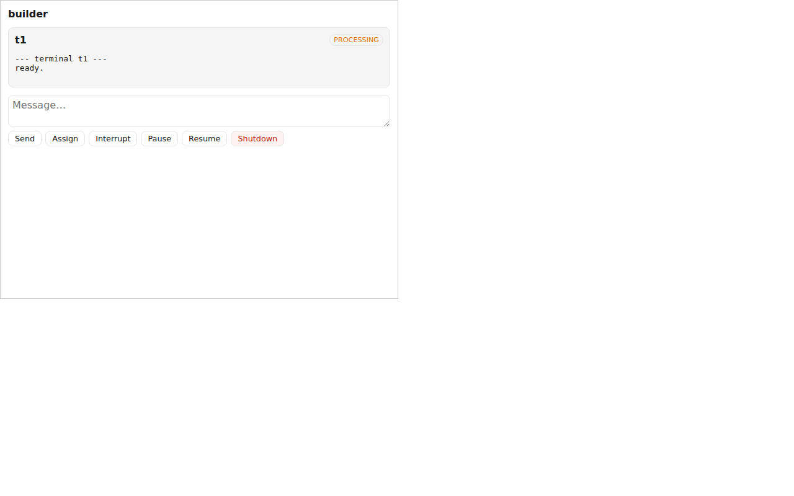
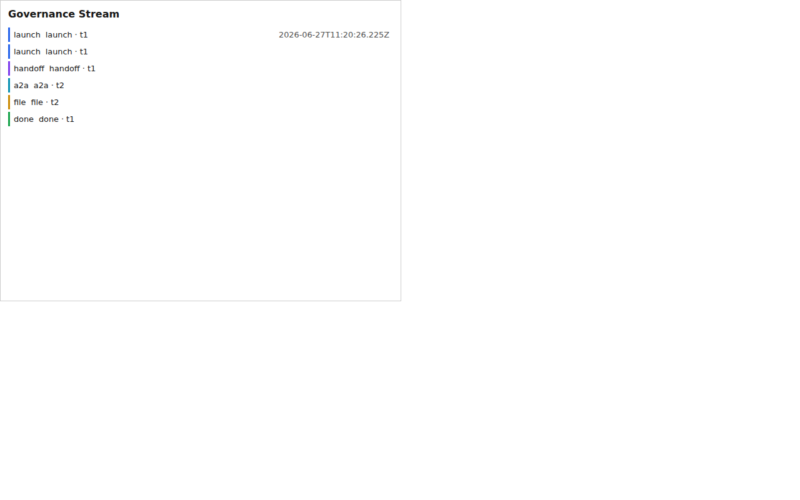

# MCP Apps — host-rendered fleet UI

CAO can expose a **sandboxed, host-rendered UI** (the [SEP-1865 "MCP Apps"](https://modelcontextprotocol.io/seps/1865-mcp-apps-interactive-user-interfaces-for-mcp)
extension) so an operator can **observe and steer a CAO fleet from inside any
MCP App-capable host** — Claude Desktop, Cursor, VS Code Insiders, Goose. It
ships three single-file HTML views plus a lightweight topology widget, driven by
a small set of MCP tools and backed by an in-process event ring buffer.

The whole surface is **default-off and behavior-preserving**: with
`CAO_MCP_APPS_ENABLED` unset, nothing is registered and CAO behaves byte-for-byte
as it does today (localhost-only on `127.0.0.1:9889`).

## Demo

| Dashboard | Agent detail | Live event stream |
|---|---|---|
|  |  |  |

Full motion walk-through: [`media/mcp-apps-demo.webm`](media/mcp-apps-demo.webm)
(dashboard → agent detail → live event stream updating from pushed events).

These are captured by [`cao_mcp_apps/scripts/record-demo.mjs`](../cao_mcp_apps/scripts/record-demo.mjs):
it boots the e2e host harness (`e2e/server.mjs`) — which serves the **real built
view bundles** inside an MCP-host iframe with live host data over the same
postMessage/SSE contract a host uses — drives an operator flow, and records it.
Regenerate with `cd cao_mcp_apps && npm run build:all && node scripts/record-demo.mjs`
(the recorder also emits an optimized `mcp-apps-demo.gif` when a gif-capable
ffmpeg/gifski is on the machine). A true in-host render (Claude Desktop / Cursor /
Goose) can't be captured headlessly, so this harness is a faithful stand-in.

## Enabling

```bash
export CAO_MCP_APPS_ENABLED=true   # default: false
uv run cao-server                  # FastAPI + /events on :9889
uv run cao-mcp-server              # registers the MCP App tools/resources
```

The surface is packaged as the built-in **`mcp_apps` plugin** (discovered via the
`cao.plugins` entry-point group). On MCP server startup the plugin's
`on_mcp_server` hook registers the tools, the `ui://cao/*` resources, the topology
widget, and the capability advertisement — all best-effort, so an older FastMCP
build or a missing frontend build degrades gracefully (logged, never fatal).

## Surfaces

| Surface | URI | What it shows |
|---|---|---|
| Dashboard | `ui://cao/dashboard` | Sessions, terminals, provider status, fleet overview; the mutation entry point. |
| Agent detail | `ui://cao/agent` | One terminal: status, recent output tail, inbox depth, sub-agents. |
| Event stream | `ui://cao/event-stream` | Compact, app-only governance ticker of normalized fleet events. |
| Topology widget | `cao://widget/topology` | Vanilla-JS live event view; also served at `/widgets/topology/` as a build-free fallback for hosts/older clients that don't render the full React views. |

## MCP tools (`mcp_server/app_tools.py`)

- `render_dashboard` / `render_agent_view` — return a snapshot the host renders in
  the matching `ui://cao/*` view.
- `cao_fetch_history` — replays normalized events from the ring buffer (app-only;
  used for iframe re-hydration after a re-mount).
- `subscribe_events` — returns the live SSE endpoint descriptor.
- `submit_command` — the **single mutation choke point**: classifies the command
  kind, applies a scope pre-check, and routes to a real Backplane HTTP endpoint.

Each rendering tool carries a `_meta.ui` annotation (`resourceUri`,
`preferredFrameSize`, `prefersBorder`, structured `csp`, `requiredScopes`) per the
SEP-1865 2026-01-26 shape, with MIME `text/html;profile=mcp-app`.

## Architecture & data flow

```
lifecycle events ─▶ event_log_publisher (observer plugin)
                      │  normalize to 6 primitives
                      ▼
                 event_log_service (500-event / 24h ring buffer)
                      │
        ┌─────────────┴─────────────┐
        ▼                           ▼
   sse_bus (/events, drop-on-slow)   cao_fetch_history (/events/history)
        │                           │
        ▼                           ▼
   iframe live stream          iframe backfill on re-mount
        ▲
   render_dashboard / render_agent_view  ── snapshot + RFC-6902 JSON Patch deltas
        │
   submit_command ─▶ scope pre-check ─▶ Backplane mutation endpoint (HTTP-only)
```

- **Semantic vocabulary** (`services/event_primitives.py`): lifecycle events
  normalize to `{launch, handoff, a2a_delegation, file_mod, completion, error}`
  (plus `other`).
- **Snapshot + diff** (`services/ui_state_service.py`): pure projection + RFC-6902
  JSON Patch so the iframe applies incremental updates.
- **SSE fan-out** (`services/sse_bus.py`): a bounded per-subscriber queue;
  drop-on-slow so one stalled iframe never back-pressures the orchestrator.
  Cross-thread publishes are marshalled onto each subscriber's loop with
  `call_soon_threadsafe` (an `asyncio.Queue` is not thread-safe).

## Capability negotiation (SEP-2133)

When enabled, the server advertises the `io.modelcontextprotocol/ui` extension on
the `initialize` handshake so SEP-1865 hosts discover the surface
(`ext_apps/sep2133.py`). The 2026-01-26 spec places this under
`capabilities.extensions`; the installed MCP SDK exposes only `experimental`, so
CAO advertises there and `client_supports_mcp_apps` accepts **either** location
(forward-compatible). `negotiate_capabilities` offers the pull-model equivalent.

## Security

- **HTTP-only boundary.** Every `mcp_server` module reaches state only through the
  FastAPI REST/SSE surface (no direct `clients.tmux` / `clients.database`
  imports); an AST guard test (`test/test_http_only_boundary.py`) enforces it.
- **Sandbox.** Views are JIT-free (no `eval` / `new Function`) so they run under a
  strict host CSP with `allowUnsafeEval:false`; a CI scan fails the build on
  violations.
- **Authorization (default-off).** A generic OAuth 2.1 / RFC 9728 layer
  (`security/auth.py`) maps tokens to the `{cao:read, cao:write, cao:admin}`
  taxonomy. With `AUTH0_DOMAIN` / `CAO_AUTH_JWKS_URI` unset, every path returns
  the full scope set and nothing is enforced. When enabled, mutating endpoints
  require `cao:write`/`cao:admin` and `delete_session` requires `cao:admin`
  (enforced via the `require_any_scope` dependency).

## Configuration

| Variable | Default | Purpose |
|---|---|---|
| `CAO_MCP_APPS_ENABLED` | `false` | Master switch for the entire surface. |
| `CAO_MCP_APPS_STATIC_DIR` | — | Override the built `apps_static/` location. |
| `AUTH0_DOMAIN` / `CAO_AUTH_JWKS_URI` | — | Enable the auth layer (IdP). |
| `CAO_AUTH_AUDIENCE`, `CAO_AUTH_ISSUER` | — | Token audience / issuer for validation + PRM. |

## Building the frontend

The three views are single-file HTML built from `cao_mcp_apps/`:

```bash
cd cao_mcp_apps && npm ci && npm run build:all   # emits src/.../ext_apps/apps_static/*.html
```

The built bundles (and the committed `ext_apps/static/` topology widget) ship in
the wheel via the `[tool.hatch.build].artifacts` force-include. If the bundles are
absent (dev tree without a build), resource registration degrades gracefully and
the topology widget still works (it needs no build step).

## See also

- `examples/mcp-apps/` — a worked enable-and-drive example.
- `skills/cao-mcp-apps/SKILL.md` — operator playbook.
- SEP-1865 (MCP Apps) and [SEP-2133 (Extensions)](https://modelcontextprotocol.io/seps/2133-extensions).
