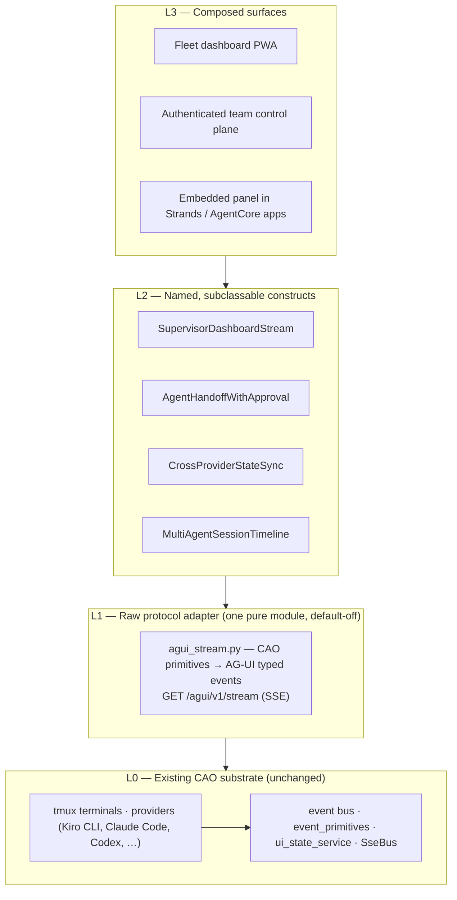
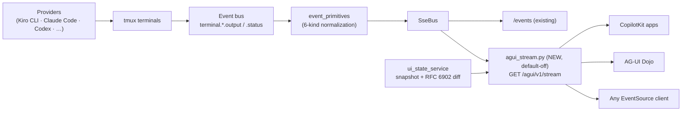

# Draft GitHub issue for awslabs/cli-agent-orchestrator

> Ready to paste. Suggested labels: `enhancement`, `rfc`, `discussion`.
> Everything below the line is the issue body; the first heading is the suggested title.
> Mermaid diagrams render natively in GitHub issues.
> Note: the "working code" links point at the `plauzy/cli-agent-orchestrator` fork. If the fork is private at posting time, either make it public first or replace those links with inlined snippets.

---

# Proposal: AG-UI protocol support as a composable construct layer — one face over many CLI agents

## Overview

Add [AG-UI](https://docs.ag-ui.com/introduction) (the Agent–User Interaction Protocol) as a **strictly additive, default-off** streaming surface for CAO — and structure it as a **building-block construct programming model** in the spirit of AWS CDK's L1/L2/L3 construct levels, rather than a one-off point integration. L1 is a thin, pure adapter mapping CAO's existing normalized event vocabulary onto AG-UI typed events over SSE; L2 is a small library of named, subclassable constructs encoding CAO's orchestration semantics (fleet dashboards, approval-gated handoffs, cross-provider sync, session timelines); L3 is reference surfaces composed entirely from L2 blocks.

Outcome: any stock AG-UI client — CopilotKit, the [AG-UI Dojo](https://docs.ag-ui.com/quickstart/applications), a custom dashboard — renders a live CAO fleet with **zero custom adapter code**, and downstream builders assemble agent-operations UIs from typed CAO building blocks instead of scraping terminals.

## User Stories

- As an **operator running a multi-agent session**, I want to watch my whole fleet (sessions, terminals, handoffs, file modifications, errors) stream live into any AG-UI-compatible dashboard, so that I can supervise agents without tailing tmux panes or polling REST endpoints.
- As a **frontend/platform developer**, I want CAO to speak a standard agent↔user protocol, so that I can build an operations UI with CopilotKit or plain `EventSource` in an afternoon instead of reverse-engineering CAO's internals.
- As a **team lead**, I want an approval-gated handoff construct (`AgentHandoffWithApproval`), so that agents pause on permission-requiring actions and a human can approve/deny/edit from a browser — using AG-UI's standard interrupt lifecycle rather than a bespoke mechanism.
- As a **provider author**, I want new providers to appear in every UI construct automatically by implementing the existing base provider interface, so that adding a CLI agent never requires writing UI adapter code.
- As a **security-conscious operator**, I want the surface to be default-off, loopback-bound, and metadata-only (message bodies never on the wire), so that enabling observability doesn't leak conversation content.

## Acceptance Criteria

- **AC1 (default-off):** With no new flags set, `cao-server` behavior is byte-identical — no new endpoints respond, no new listeners bind. A regression test asserts this.
- **AC2 (L1 stream):** With `CAO_AGUI_ENABLED` set, `GET /agui/v1/stream` streams AG-UI typed SSE events for all six CAO event kinds (`launch`, `completion`, `handoff`, `a2a_delegation`, `file_mod`, `error`) per the mapping table below, emitting `STATE_SNAPSHOT` on connect and RFC 6902 `STATE_DELTA` patches thereafter, and supports `?since=` replay with client-side dedup by event id.
- **AC3 (zero-adapter client):** A stock AG-UI client (Dojo or CopilotKit) renders a live CAO run — launch → handoff → file mods → completion — with no CAO-specific client code. The demo drives the live server, not a recorded replay.
- **AC4 (privacy boundary):** Message bodies never appear on the wire; a test asserts non-leakage even when the underlying CAO event payload contains bodies.
- **AC5 (L2 constructs):** The four named constructs ship with docs and a runnable example each; `AgentHandoffWithApproval` approves/denies a real provider permission prompt from a browser via AG-UI interrupts; `CrossProviderStateSync` is validated across ≥3 providers.
- **AC6 (composability proof):** A reference dashboard is built exclusively from L2 constructs — no bespoke SSE wiring in the app layer.

## Proposed solution

**New modules:**

- `services/agui_stream.py` — the entire L1 adapter: pure, table-driven mapping from CAO primitives to AG-UI events, version-pinned to the AG-UI spec. A working proof-of-concept exists in a fork ([`agui_stream.py`, 377 lines](https://github.com/plauzy/cli-agent-orchestrator/blob/feat/agentic-protocols-generative-ui/src/cli_agent_orchestrator/services/agui_stream.py), with [31 mapping/redaction/refusal tests](https://github.com/plauzy/cli-agent-orchestrator/blob/feat/agentic-protocols-generative-ui/test/services/test_agui_stream_mapping.py); see [plauzy#9](https://github.com/plauzy/cli-agent-orchestrator/pull/9)) and can be contributed as the starting point.
- `constructs/` (Phase 2) — the L2 library: `SupervisorDashboardStream`, `AgentHandoffWithApproval`, `CrossProviderStateSync`, `MultiAgentSessionTimeline`, each a subclassable class over the L1 stream.
- `mcp_server` tool `emit_ui(component, props)` (Phase 1) — lets agents author declarative UI intents against a frozen, server-validated component allow-list.

**Modified modules (all small, additive):**

- `api/main.py` — one new endpoint, `GET /agui/v1/stream` (SSE), behind a new `CAO_AGUI_ENABLED` flag; reads the existing in-process SSE bus.
- Reused as-is (no schema or backbone changes): [`services/event_primitives.py`](https://github.com/awslabs/cli-agent-orchestrator/blob/main/src/cli_agent_orchestrator/services/event_primitives.py) (the six-kind normalized vocabulary), [`services/ui_state_service.py`](https://github.com/awslabs/cli-agent-orchestrator/blob/main/src/cli_agent_orchestrator/services/ui_state_service.py) (snapshot + RFC 6902 `diff_snapshot`), [`services/sse_bus.py`](https://github.com/awslabs/cli-agent-orchestrator/blob/main/src/cli_agent_orchestrator/services/sse_bus.py), and the [event-driven pipeline](https://github.com/awslabs/cli-agent-orchestrator/blob/main/docs/event-driven-architecture.md).

**The L1 event mapping:**

| CAO primitive | AG-UI event |
|---|---|
| session/terminal launch | `RUN_STARTED` / `STEP_STARTED` |
| completion | `RUN_FINISHED` / `STEP_FINISHED` |
| handoff | `STEP_STARTED` + `TOOL_CALL_START`/`TOOL_CALL_END` |
| agent-to-agent delegation | `TOOL_CALL_START` / `TOOL_CALL_RESULT` |
| file modification | `STATE_DELTA` (RFC 6902 JSON Patch) against a fleet `STATE_SNAPSHOT` |
| error | `RUN_ERROR` |
| anything else | `RAW` with a `cao_type` discriminator |

**Event flow (nothing new left of the adapter):**

**Phasing** (each phase gated on a demo):

1. **Phase 0 — Spike:** read-only L1 adapter behind the flag. Gate: AC3 with the six lifecycle events.
2. **Phase 1 — Complete L1:** real `STATE_DELTA` payloads with debouncing, full `TOOL_CALL_*` lifecycle, `emit_ui` producer, `?since=` replay, docs. Gate: AC1–AC4.
3. **Phase 2 — L2 constructs:** the four constructs, including bidirectional human-in-the-loop via AG-UI's interrupt-aware run lifecycle mapped to provider permission prompts (namespaced reasons, e.g. `claude-code:permission_request`). Gate: AC5.
4. **Phase 3 — L3 reference surface:** dashboard composed purely from L2 constructs; optional authenticated team mode; AG-UI ecosystem listing. Gate: AC6.

## Additional context

**Is your feature request related to a problem? Please describe.**

CAO orchestrates long-running, nondeterministic, streaming CLI agents — exactly the workload AG-UI exists to standardize ([introduction](https://docs.ag-ui.com/introduction)) — yet every user-facing surface today (the bundled web dashboard, MCP Apps experiments, scripts polling `/terminals/{id}/output`) hand-rolls its own wiring. I'm always frustrated when I want to watch or steer a CAO fleet from anywhere other than the bundled UI: there is no standard way for an external application to consume "what is my agent fleet doing right now," so every new surface means bespoke SSE plumbing, and every new provider risks provider-specific UI code. Meanwhile the AG-UI ecosystem has the mirror-image gap: first-party integrations exist for LangGraph, CrewAI, Mastra, Pydantic AI, Google ADK, Microsoft Agent Framework — and **AWS Strands Agents and Amazon Bedrock AgentCore** — but *no one* bridges real terminal CLI coding agents, no conventions exist for multi-agent fleet UIs or file-diff/workspace semantics, and nobody has mapped CLI permission prompts onto AG-UI's interrupt lifecycle. CAO sits on the empty axis between multi-CLI orchestrators (real processes, no protocol) and AG-UI frameworks (protocol, no real processes), and is uniquely placed to fill all of these at once — completing the agentic protocol triad it already participates in ([agentic protocols](https://docs.ag-ui.com/agentic-protocols)): MCP for agent↔tools (shipped), A2A-style handoffs for agent↔agent (shipped), AG-UI for agent↔user (this proposal).

**Describe alternatives you've considered**

- **A point integration ("CAO emits AG-UI events") without the construct layering.** Works for one dashboard, but every existing AG-UI integration binds one framework to one frontend; CAO fronts N heterogeneous providers, so per-surface adapter cost grows multiplicatively. Making the binding itself composable (one provider subclass → every construct → every surface) is the fix.
- **MCP Apps / in-host iframes only.** Complementary, not competing: MCP Apps covers operators *inside* an MCP host; it architecturally cannot serve browser-only operators, multi-instance fleets, or standard web clients. AG-UI is the open-web layer.
- **A bespoke CAO REST/WebSocket API.** Maximum control, zero ecosystem: every client becomes CAO-specific. Adopting the standard makes every AG-UI client a CAO client for free.
- **Wait for MCP to grow user-interaction semantics.** The MCP spec is evolving fast (stateless core, extensions, tasks) and may eventually overlap. The hedge is built into this design: the entire protocol dependency is one pure, version-pinned module (L1); L2/L3 depend on CAO's construct API, not raw wire events, so a protocol pivot is a one-module swap.
- **Adopting a different UI protocol (A2UI / Open-JSON-UI / MCP-UI).** Those are *generative UI payload* specs, not interaction protocols; AG-UI explicitly interoperates with all of them, so this proposal stays payload-spec-neutral.

**Additional context**

- Working proof-of-concept of the L1 adapter (pure single-file mapping, tested privacy boundary, RFC 6902 state channel): [`agui_stream.py`](https://github.com/plauzy/cli-agent-orchestrator/blob/feat/agentic-protocols-generative-ui/src/cli_agent_orchestrator/services/agui_stream.py) + [mapping tests](https://github.com/plauzy/cli-agent-orchestrator/blob/feat/agentic-protocols-generative-ui/test/services/test_agui_stream_mapping.py), from [plauzy#9](https://github.com/plauzy/cli-agent-orchestrator/pull/9).
- AG-UI protocol: [repo](https://github.com/ag-ui-protocol/ag-ui) · [introduction](https://docs.ag-ui.com/introduction) · [agentic protocols](https://docs.ag-ui.com/agentic-protocols) · quickstarts for [servers](https://docs.ag-ui.com/quickstart/server), [middleware](https://docs.ag-ui.com/quickstart/middleware), [clients](https://docs.ag-ui.com/quickstart/clients), [applications](https://docs.ag-ui.com/quickstart/applications) · [updates](https://docs.ag-ui.com/development/updates). The [middleware quickstart](https://docs.ag-ui.com/quickstart/middleware) explicitly blesses bridging "virtually any backend" — this proposal is that pattern applied to CLI agent processes.
- What AG-UI clients look like in practice: [CopilotKit examples](https://www.copilotkit.ai/examples) (research canvases, travel planners, form-filling copilots — all rendered from the same event stream this proposal emits).
- CAO's existing event backbone this layers onto (unchanged): [docs/event-driven-architecture.md](https://github.com/awslabs/cli-agent-orchestrator/blob/main/docs/event-driven-architecture.md).
- Governance note: AG-UI is Apache-2.0 but CopilotKit-stewarded (not foundation-governed like MCP/A2A). The version-pinned single-module L1 design bounds that risk; open question for maintainers whether that hedge is sufficient, and whether v1 scope should be read-only (Phases 0–1) or include bidirectional interrupts (Phase 2).
