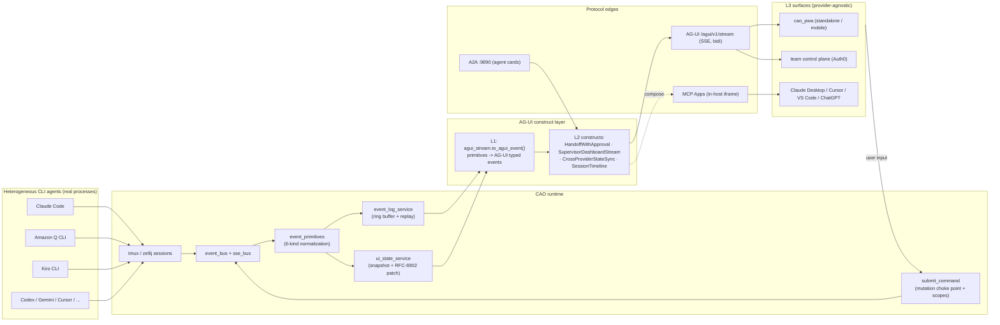
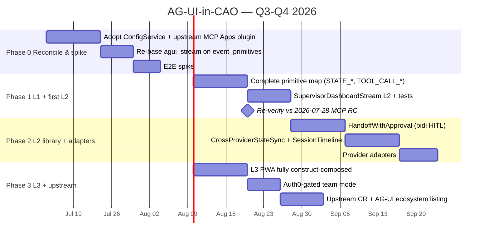

# CAO — Fork Diff, Agentic-UI-Protocol Assessment, and AG-UI Vision & Roadmap

| Field | Value |
|---|---|
| **Created** | July 4, 2026 |
| **Version** | v1 |
| **Status** | Draft |
| **Author** | Patrick Lauer (with principal-engineer analysis pass) |
| **Fork under analysis** | `plauzy/cao` @ `e84854f9207877c6b5622efbc5fbf5bccb38b607` |
| **Upstream baseline** | `plauzy/cli-agent-orchestrator` @ `4dc8bf71489c7568ff58234804c72adda8086098` ("Unify CAO configuration into a single source of truth (#357) (#381)") — the awslabs-tracking line |
| **True OSS upstream** | `github.com/awslabs/cli-agent-orchestrator` |
| **Roadmap horizon** | 2 quarters (Q3–Q4 2026) |

> **Evidence tags** used throughout: **[Strong]** = verified against source in-session; **[Promising]** = well-supported, one inference step away; **[Emerging]** = moving target, verified but likely to change; **[Theoretical]** = thesis / "we believe", not yet demonstrated.

> **How the diff was produced (methodology honesty).** The two repos are present as independent depth-1 shallow clones with no shared local git history, and the gateway rejected `--unshallow` (auth-gated). A commit-graph diff (`git diff upstream/main...e84854f`) was therefore **not** possible in-session. Instead the divergence was reconstructed from **full-tree MD5 manifests** of both working trees (606 files upstream, 756 files fork), cross-referenced against the fork's own maintained divergence tracker (`docs/awslabs-delta.md`), the shipped RFCs, and targeted source reads. This yields an accurate *content* delta (added / removed / changed files + semantic reads of the important ones) but **not** a commit-by-commit lineage. Where lineage matters (rebase-vs-merge), that limitation is called out explicitly.

---

## Table of Contents

1. [Deliverable 1 — Fork-vs-Upstream Diff Analysis](#deliverable-1--fork-vs-upstream-diff-analysis)
2. [Deliverable 2 — Agentic UI Protocol Landscape (Current State)](#deliverable-2--agentic-ui-protocol-landscape-current-state)
3. [Deliverable 3 — AG-UI in CAO: Vision + Roadmap ("Protocols as CDK Constructs")](#deliverable-3--ag-ui-in-cao-vision--roadmap-protocols-as-cdk-constructs)
4. [Deliverable 4 — Positioning Manifesto](#deliverable-4--positioning-manifesto)
5. [Decision Log](#decision-log)
6. [Open Questions](#open-questions)
7. [Version History](#version-history)

---

## Deliverable 1 — Fork-vs-Upstream Diff Analysis

### 1.1 Headline finding: this is a *bidirectional* divergence, not "fork behind upstream"

The task framing anticipated a fork trailing an upstream that had just merged MCP support. The reality is more interesting and more consequential for the AG-UI roadmap: **[Strong]** the two trees have diverged in *both* directions from a common ancestor around awslabs PR #233 (May 9, 2026, the baseline cited in the fork's own MCP-apps RFC).

- **Fork (`plauzy/cao` @ e84854f, version `2.5.0` alpha line):** raced ahead on **protocols, observability, orchestration topology, persistence, policy, and agent-facing UI** — including a *complete* AG-UI adapter and standalone PWA that upstream has no equivalent of.
- **Upstream (`4dc8bf7`, version `2.2.0` + unreleased, awslabs-tracking):** raced ahead on a **workflow/scheduling engine**, a **unified configuration service**, **agent memory hardening**, **new providers (Antigravity, Cursor, Hermes)**, and a **second, independent MCP Apps implementation** (landed as awslabs PR #332).

The raw shape of the divergence:

| Bucket | Count | Character |
|---|---|---|
| Files **only in fork** | 274 | New subsystems: `a2a/`, `acp/`, `agent_card/`, `cache/`, `observability/`, `orchestration/`, `persistence/`, `refinery/`, `telemetry/`, `services/agui_stream.py`, `cao_pwa/`, `zellij/`, providers `gemini_cli`/`q_cli`/`mock_cli`, plus 4 RFCs |
| Files **only in upstream** | 124 | Workflow engine, `config_service.py`, MCP-Apps-as-plugin (`plugins/builtin/mcp_apps.py`, `mcp_server/app_tools.py`), `event_primitives.py`, `secret_gate.py`, `step_output_store.py`, `wiki_healer.py`, `security/decorators.py`, `design-tokens/`, `skills/vendor/ext-apps/*` |
| Files **changed in both** | 196 | Shared core that both sides edited independently — the true conflict surface: `api/main.py`, `mcp_server/server.py`, `constants.py`, `services/{event_bus,sse_bus,event_log_service,ui_state_service}.py`, `security/auth.py`, most providers, most of `cao_mcp_apps/src/` |

**[Strong]** The single most important structural fact for reconciliation: **both repos implemented MCP Apps, independently, and differently.** That is the hard part of the merge, and — because AG-UI in CAO rides on the same event/UI plumbing — it is also where the AG-UI mount points live.

### 1.2 What the fork authored (grouped by concern, with architectural intent)

Source of truth for authorship: the fork's own `docs/awslabs-delta.md` commit ledger plus in-session source reads.

**A. Protocol surface — the strategic core.**
- `a2a/` (`rpc.py`, `stream.py`, `store.py`, `types.py`) — an **A2A v1.0 JSON-RPC endpoint on `:9890`** with an SSE stream + REST polling, pluggable executor bridges for `task.send`. Intent: make each CAO worker addressable as an A2A agent.
- `agent_card/` (`builder.py`, `listener.py`, `router.py`, `signing.py`) — publishes a **signed A2A Agent Card** on a dedicated `:9890` listener, plus OAuth Protected-Resource-Metadata routing. Intent: A2A-native discovery + identity.
- `acp/` (`server.py`, `handlers.py`, `types.py`) — an **Agent Client Protocol** server ("for Cursor/Zed/Claude Code"). Intent: let editors drive CAO workers over Zed's ACP. *(Naming caution — see §D2; this is Zed's editor↔agent ACP, not IBM's agent↔agent ACP that merged into A2A.)*
- `services/agui_stream.py` + `GET /agui/v1/stream` — the **AG-UI adapter** (analysed in depth below). Intent: agent↔UI streaming for the standalone PWA.

**B. Agent-facing UI — the AG-UI/PWA surface upstream lacks entirely.**
- `cao_pwa/` — a Vite + React **standalone PWA** (multi-instance IndexedDB picker, EventSource→reducer pipeline, ~48.55 KB gz). Consumes `/agui/v1/stream`. Deployed separately; not bundled in the wheel.
- `web/ai_manifest.py` — an AI-manifest fetcher/parser.
- An **inline** MCP Apps surface wired directly in `mcp_server/server.py` (`register_apps` at import, `render_dashboard` et al. defined inline, gated on the `CAO_MCP_APPS_ENABLED` env var).

**C. Observability & telemetry — "Deacon" ASI + OTel.**
- `observability/` (`asi_evaluator.py`, `experiments.py`, `mitigations.py`, `phantom_state.py`, `span_consumer.py`) — a "Deacon" **Agentic-System-Integrity evaluator** wired as an OTel span processor and as the topology router's oracle, with a kill-switch operator API.
- `telemetry/` (`otel.py`, `semconv.py`, `spans.py`, `context.py`) — **OTel GenAI scaffolding**, W3C `traceparent` threaded through `CaoEvent` + `InboxMessage`, `execute_tool` spans from MCP tools.
- `plugins/builtin/otel_sidecar.py`, `plugins/builtin/sse_event_publisher.py`.

**D. Orchestration topology — beyond supervisor/worker.**
- `orchestration/` (`dag.py`, `dispatch.py`, `swarm.py`, `polecat.py`, `hybrid_cluster.py`, `topology_router.py`) — **TaskDAG + AdaptOrch topology router** with ASI/budget feedback, a **Polecat swarm** dispatch, and a hybrid hierarchical-cluster topology. High-level `dispatch_task` entrypoint that `_handoff_impl` / `_assign_impl` route through, kill-switch-gated.
- `clients/git_worktree.py` — git-worktree manager for Polecat sandbox spawn/teardown.

**E. Persistence & policy.**
- `persistence/` (`wal_writer.py`, `replay.py`, `materialized_index.py`, `schema.sql`) — a **WAL writer** (shadow mode) with materialized-index + WAL replay on boot.
- `refinery/` (`cedar_policy.py`, `policy.py`, `rule_of_two.py`, `queue.py`, `preflight.py`) — a **single-threaded write queue** with a Cedar-based policy engine and a "Rule-of-Two" gate.
- `cache/` (`three_layer.py`, `orchestrator.py`, `metrics.py`) — an **L1 (LRU+TTL) / L2 (keep-alive) / L3 (SQLite)** three-layer cache with a `/cache/stats` endpoint.

**F. Extra providers + frontends.** `providers/gemini_cli.py`, `providers/q_cli.py`, `providers/mock_cli.py` (the mock is high-value for credential-free CI), and a `zellij/` Rust WASM plugin + bridge (an alternative to tmux).

**G. Governance docs.** `docs/awslabs-delta.md` (the divergence ledger), `docs/TENETS.md`, and four RFCs: the MCP-apps implementation plan (v2), the AG-UI L2 dashboard RFC, the Auth0-for-MCP RFC, and the Auth0-websocket RFC.

### 1.3 What upstream added since divergence (centered on the MCP-Apps merge)

**A. MCP Apps, the awslabs way (the "MCP support merge", PR #332).** **[Strong]** Upstream's implementation is architecturally *different* from the fork's:
- Packaged as a **built-in plugin** (`plugins/builtin/mcp_apps.py`) discovered via the `cao.plugins` entry-point group, registering on the `on_mcp_server` hook — not wired inline in `server.py` as the fork does.
- `mcp_server/app_tools.py` implements five tools (`render_dashboard`, `render_agent_view`, `cao_fetch_history`, `subscribe_events`, `submit_command`) behind a strict **HTTP-only boundary** (an AST guard test, `test/test_http_only_boundary.py`, forbids `mcp_server/` from importing `clients.tmux`/`clients.database`).
- `submit_command` is a **single mutation choke point** with a command-kind taxonomy (standard/lifecycle/destructive) and scope pre-check — a hardened version of what the fork's RFC described.
- Gated on `ConfigService.get("apps.enabled")` (the unified config), not a bare env read.
- Ships `event_primitives.py` normalizing lifecycle events to six kinds (`launch, handoff, a2a_delegation, file_mod, completion, error`), plus a richer `ui_state_service.py` with RFC-6902 JSON-Patch deltas, plus `design-tokens/` and a `skills/vendor/ext-apps/` skill family for *building* MCP apps.

**B. Workflow / scheduling engine.** `services/{workflow_service,workflow_spec_service,agent_step,step_output_store}.py`, `models/{workflow,workflow_runtime}.py`, CLI `cao workflow` + `cao schedule` (the `cao flow` → `cao schedule` rename, #378).

**C. Unified configuration.** `services/config_service.py` — the `ConfigService` single-reader unifying `settings.json` + `config.json` under one precedence chain (`CLI flag > CAO_* env > file > default`, issue #357). This is the HEAD commit and it touches the shared core the fork also edits.

**D. Security & services hardening.** `security/decorators.py`, `services/secret_gate.py`, `services/wiki_healer.py`, complete `require_any_scope` coverage across mutating routes (H4), issuer+audience JWT validation.

**E. Providers & memory.** Antigravity CLI (`agy`, successor to Gemini CLI after the free Google login path was retired, #323), Hermes (via `hermesProfile`), Cursor CLI; agent memory Phase 2.5 hardening (#245/#254/#262).

### 1.4 The reconciliation surface

| Zone | Overlap / conflict | Assessment |
|---|---|---|
| **MCP Apps** | **Hard conflict.** Two independent implementations touching the same files (`mcp_server/server.py`, `cao_mcp_apps/src/*`, `ext_apps/*`). Fork = inline + env-gated; upstream = plugin + `ConfigService`-gated + HTTP-only-boundary-enforced. | **[Strong]** Adopt upstream's shape; port the fork's extras onto it. Upstream's is the more defensible design (plugin isolation, AST boundary guard, scope coverage). |
| **Configuration** | **Medium conflict.** Fork reads env directly (`CAO_MCP_APPS_ENABLED`, `CAO_PWA_ORIGIN`, `AUTH0_*`); upstream funnels everything through `ConfigService`. Both edit `constants.py`, `settings_service.py`, `backends/factory.py`. | **[Strong]** Adopt `ConfigService`; register the fork's env vars (`apps.enabled` already exists in upstream's schema; add `pwa.origin`, `agui.*`) into `ENV_REGISTRY`. |
| **Event plumbing** | **Medium.** Both edited `event_bus.py`, `sse_bus.py`, `event_log_service.py`, `event_log_publisher.py`. Upstream adds `event_primitives.py` (6-kind normalization); fork adds `sse_event_publisher.py` + `traceparent` threading. | **[Promising]** Converge on upstream's 6-primitive vocabulary as the event source; re-base the fork's AG-UI adapter + `traceparent` on top. |
| **Auth** | **Low–medium.** Both edited `security/auth.py` to add `cao:read/write/admin`. Upstream added `security/decorators.py` + full route coverage; fork added the PRM endpoint on `:9890`. | **[Promising]** Largely additive; unify on upstream's `require_any_scope` + decorators, keep the fork's `:9890` PRM listener. |
| **Fork-only subsystems** | **No conflict.** `a2a/`, `acp/`, `agent_card/`, `cache/`, `observability/`, `orchestration/`, `persistence/`, `refinery/`, `telemetry/`, `cao_pwa/`, `zellij/`, `agui_stream.py` don't exist upstream. | **[Strong]** Clean adds. These are the fork's differentiated value and carry no merge cost — only integration cost against upstream's new seams. |
| **Upstream-only subsystems** | **No conflict** *(new files)*. Workflow engine, `config_service.py`, `secret_gate.py`, `wiki_healer.py`, vendor skills. | **[Strong]** Clean adds when the fork pulls them, *except* where they touch shared core (config). |
| **Providers** | **Divergent.** Fork keeps Gemini CLI + Amazon Q CLI + mock_cli; upstream retired Gemini (→ Antigravity), dropped Q from the README, added Cursor. | **[Promising]** Union the provider set — no reason to lose Q/Gemini or mock_cli (the mock is a CI asset the delta ledger already flags for upstreaming). |

### 1.5 Rebase vs. merge — recommendation

**[Promising]** **Rebase the fork onto upstream, subsystem by subsystem, via a curated cherry-pick train — do not attempt a single big merge, and do not rebase blindly.** Reasoning:

1. **Lineage is not locally reconstructable** (shallow clones, no shared history). A blind `git rebase` would be operating without the commit graph. The fork *already has the right tool for this*: `docs/awslabs-delta.md` is a per-commit ledger with `pending` / `not-applicable` status. That ledger — not a raw rebase — is the correct driver.
2. **The MCP Apps collision must be resolved by adoption, not merge.** A three-way merge of two independent MCP Apps implementations produces noise. Decision: **delete the fork's inline MCP Apps wiring, adopt upstream's plugin + `app_tools.py` + `ConfigService` shape, then re-attach the fork's `_meta.ui.requiredScopes` + PWA-facing bits as a thin layer.** This is a rewrite of one seam, not a merge.
3. **Clean-add subsystems rebase trivially** because they don't touch upstream files — land them first (protocols, observability, orchestration, persistence, cache) to de-risk.
4. **Config unification is the ordering constraint.** Adopt `ConfigService` *before* re-landing the fork's env-gated features, so every fork feature registers into `ENV_REGISTRY` rather than re-introducing scattered `os.getenv` reads.

**Sequenced plan:** (a) adopt upstream `ConfigService` + `security/decorators.py`; (b) cherry-pick fork-only subsystems (no-conflict) and register their config; (c) rewrite MCP Apps onto upstream's plugin shape; (d) re-base the AG-UI adapter + PWA on upstream's `event_primitives` + `ui_state_service`; (e) union providers; (f) run the delta ledger to `pending`→submitted for the CI/mock/provider-fix commits already flagged for upstream CR.

**This rebase decision is the blocking dependency for Deliverable 3, Phase 0.** It is *resolved* here (rebase-via-ledger, adopt-upstream-MCP-Apps) rather than left open.

### 1.6 The diff matrix (with AG-UI relevance)

| Area | Fork state (`e84854f`) | Upstream state (`4dc8bf7`) | Conflict risk | AG-UI relevance |
|---|---|---|---|---|
| **AG-UI adapter** | `services/agui_stream.py` + `GET /agui/v1/stream` (6→AG-UI mapping, RAW fallback) | **Absent** | None (fork-only) | **Direct** — this *is* the AG-UI L1 layer; the whole roadmap builds on it |
| **PWA (agent↔UI)** | `cao_pwa/` standalone React PWA over EventSource | **Absent** | None (fork-only) | **Direct** — the reference AG-UI *client* / L3 surface |
| **MCP Apps** | Inline in `server.py`, env-gated | Plugin + `app_tools.py`, `ConfigService`-gated, HTTP-only guard | **High** | **High** — AG-UI payloads can ride inside MCP Apps; shared `ui_state_service` |
| **Event primitives** | Raw CAO event kinds + `traceparent` | 6-kind normalization (`event_primitives.py`) | Medium | **High** — the canonical event vocabulary the AG-UI adapter should map from |
| **UI state / deltas** | Minimal (PWA reducer client-side) | `ui_state_service.py` snapshot + RFC-6902 patch | Medium | **High** — RFC-6902 patch ≈ AG-UI `STATE_SNAPSHOT`/`STATE_DELTA` (fork deferred these) |
| **`submit_command`** | Deferred (read-only PWA in v1) | Hardened choke point, scope-classified | Medium | **High** — the mount point for AG-UI *bidirectional* input events |
| **A2A + Agent Card** | `a2a/` + `agent_card/` on `:9890`, signed | **Absent** | None (fork-only) | Adjacent — A2A delegation events feed the AG-UI stream (`a2a_delegation` primitive) |
| **Auth / scopes** | `cao:read` gate on `/agui`, `:9890` PRM | `require_any_scope` full coverage + decorators | Low–medium | Medium — gates the AG-UI stream in multi-tenant mode |
| **Config** | Direct env reads | `ConfigService` unified | Medium | Indirect — AG-UI feature flags should register here |
| **Observability** | Deacon ASI + OTel + `traceparent` | **Absent** | None (fork-only) | Adjacent — ASI mitigations surface as AG-UI `RAW`/custom events |
| **Orchestration** | DAG/swarm/Polecat/topology router | **Absent** | None (fork-only) | Adjacent — topology transitions become AG-UI lifecycle/step events |
| **Workflow engine** | **Absent** | `workflow_service` + `cao schedule` | None (upstream-only) | Adjacent — workflow steps map cleanly to AG-UI `STEP_*` events |
| **Providers** | +Gemini, +Q, +mock | +Antigravity, +Cursor, −Gemini, −Q(README) | Low | None directly |


---

## Deliverable 2 — Agentic UI Protocol Landscape (Current State)

*Verified in-session July 2026 via web research; every landscape claim carries an evidence tag. Where a claim updates or contradicts the fork's May-2026 RFCs, it is flagged in §2.4.*

### 2.1 AG-UI deep read

**[Strong]** AG-UI (Agent–User Interaction Protocol) is an open, lightweight, **event-based** protocol standardizing real-time communication between AI agents and user-facing applications, transported over **Server-Sent Events** with a bidirectional channel for user input. It was created and is stewarded by **CopilotKit**, licensed **Apache-2.0**. Content was rephrased for compliance with licensing restrictions.

**Event catalog — the fork's "16 events" is now stale. [Emerging]** The current event count depends on which SDK doc you read, and it has *grown*:
- The CopilotKit developer blog frames it as **17 core event types** ("special cases included"). ([copilotkit.ai](https://copilotkit.ai/blog/master-the-17-ag-ui-event-types-for-building-agents-the-right-way))
- The multi-language SDK docs (e.g. the Kotlin SDK) now describe **25 event types** covering the full lifecycle — message content, tool calls, thinking/reasoning, and state changes. ([docs.showcase.copilotkit.ai](https://docs.showcase.copilotkit.ai/ag-ui/sdk/kotlin/core/events))

The families are stable even as the count grows: **lifecycle** (`RUN_STARTED`/`RUN_FINISHED`/`RUN_ERROR`, `STEP_STARTED`/`STEP_FINISHED`), **text message** (`TEXT_MESSAGE_START`/`CONTENT`/`END`), **tool call** (`TOOL_CALL_START`/`ARGS`/`END`/`RESULT`), **state** (`STATE_SNAPSHOT`/`STATE_DELTA` via JSON-Patch, `MESSAGES_SNAPSHOT`), **thinking/reasoning**, and a **`RAW`/custom** escape hatch. **[Strong]** — the fork's adapter already uses exactly this structure (`RUN_STARTED`, `STEP_*`, `TEXT_MESSAGE_CONTENT`, `RAW`), so the growth is additive, not breaking.

**Transport & mechanics. [Strong]** SSE for agent→UI streaming; the protocol is explicitly **bi-directional** (user input flows back). State sync uses `STATE_SNAPSHOT` + incremental `STATE_DELTA` (RFC-6902 JSON-Patch) — the exact delta encoding upstream CAO's `ui_state_service` already emits. Human-in-the-loop is a first-class concern (the protocol was designed around interrupt/resume/approval flows). ([docs.copilotkit.ai](https://docs.copilotkit.ai/langgraph-python/ag-ui))

**Framework integrations & adoption. [Strong]** First-party or documented integrations span **LangGraph, CrewAI, Mastra, Pydantic AI, and Microsoft Agent Framework**; third-party coverage describes AG-UI as "adopted by Microsoft, Google, AWS, LangChain, and CrewAI." ([ag-ui.com/integrations](https://docs.ag-ui.com/integrations), [aliz.ai](https://web-hub.aliz.ai/blog/ag-ui-protocol)) A CopilotKit Series A (May 2026) underwrites continued stewardship **[Promising]** (per the fork's RFC; not re-verified in-session).

**Governance/maturity. [Emerging]** AG-UI remains **CopilotKit-stewarded and Apache-2.0** rather than sitting under a neutral foundation (unlike MCP → Linux Foundation AAIF, and A2A → Linux Foundation). This is the one governance asymmetry worth tracking: AG-UI is the least "neutral-governed" of the triad, which is a mild adoption risk for an `awslabs/` project betting on it. Content was rephrased for compliance with licensing restrictions.

### 2.2 The protocol triad boundary map

**[Strong]** The field has converged on a clean three-edge model, and CAO already sits on **all three edges** — which is the whole thesis of Deliverable 4.

| Edge | Protocol | What it carries | Where CAO sits today |
|---|---|---|---|
| **agent ↔ tools/context** | **MCP** (LF/AAIF) | tool calls, resources, prompts, sampling | **Native.** `cao-mcp-server` (per-agent) + `cao-ops-mcp-server` (control plane); MCP Apps on both sides |
| **agent ↔ agent** | **A2A v1.0** (LF) | task handoff, signed Agent Cards, capability discovery | **Fork-only.** `a2a/` JSON-RPC on `:9890` + signed `agent_card/`; upstream has none |
| **agent ↔ user/frontend** | **AG-UI** (CopilotKit) | streaming events, state deltas, HITL | **Fork-only.** `services/agui_stream.py` + `/agui/v1/stream` + `cao_pwa/`; upstream has none |

**[Strong]** A2A status: released by Google (Apr 2025), governed by the **Linux Foundation** since June 2025, reached **stable v1.0 (March 2026), GA April 2026**, with **150+ organizations** and enterprise production use. v1.0 stabilized the **signed Agent Card** (`/.well-known/agent-card.json` with a JWS signature), an eight-state task model, and OAuth 2.1 + JWT auth. **IBM's ACP merged into A2A** (Aug 2025); AGNTCY archived its competing protocol. ([linuxfoundation.org](https://www.linuxfoundation.org/press/a2a-protocol-surpasses-150-organizations-lands-in-major-cloud-platforms-and-sees-enterprise-production-use-in-first-year), [a2aproject/A2A](https://github.com/a2aproject/A2A))

> **[Strong] Naming caution — two different "ACP"s.** The fork's `acp/` module is **Zed's Agent Client Protocol** (editor↔agent, "for Cursor/Zed/Claude Code"), which is *not* IBM's Agent Communication Protocol (agent↔agent, now merged into A2A). Any external doc should disambiguate, because the collision is a live source of confusion in the ecosystem.

### 2.3 MCP Apps vs AG-UI — drawing the boundary, and taking a position

**[Strong]** MCP Apps (SEP-1865) grew out of the community `mcp-ui` project (Ido Salomon / Liad Yosef), was co-authored by **Anthropic and OpenAI**, merged in **November 2025**, and reached **Stable** status with the dated spec **2026-01-26**. It standardizes UI *resources* (`text/html;profile=mcp-app`) rendered as **sandboxed iframes inside an MCP host**, linked to tools via `_meta.ui`, with bidirectional `postMessage` JSON-RPC. ([modelcontextprotocol.io SEP-1865](https://modelcontextprotocol.io/seps/1865-mcp-apps-interactive-user-interfaces-for-mcp), [anant.us](https://anant.us/blog/mcp-ui-the-open-standard-for-interactive-agent-interfaces-and-how-to-ship-it-in-any-language/))

**[Emerging] The landscape-shifting update the fork's RFCs predate:** the **2026-07-28 MCP Specification Release Candidate** (locked May 21, targeting stable **July 28, 2026**) folds MCP Apps into a **stateless protocol core** alongside a formal **Extensions framework**, **Tasks**, authorization hardening, and a deprecation policy. ([blog.modelcontextprotocol.io](https://blog.modelcontextprotocol.io/posts/2026-07-28-release-candidate/), [aliz.ai](https://web-hub.aliz.ai/blog/mcp-specification-release-candidate)) MCP Apps is no longer a bolt-on extension — it is becoming part of the spec core, and MCP is going **stateless**. This *strengthens* CAO's L1 (MCP Apps is more permanent than the fork assumed) but means the capability-negotiation code (`ext_apps/sep2133.py`) needs a re-verify against the RC before Q4.

**Position: MCP Apps and AG-UI are complementary layers, not substitutes — and CAO needs both.** Content was rephrased for compliance with licensing restrictions.

- **MCP Apps answers "render a UI *inside an MCP host*"** (Claude Desktop, ChatGPT, Cursor, VS Code, Goose). It is host-mediated, iframe-sandboxed, and bounded by the host's CSP. It is the right surface for the *in-host operator* persona.
- **AG-UI answers "stream agent state to *any* frontend, over the open web, bidirectionally"** — a standalone dashboard, a mobile PWA, a team control plane at its own origin. It is the right surface for the *outside-a-host operator* and *multi-instance fleet* personas.
- **They compose:** an AG-UI stream can drive a frontend that is *itself* delivered as an MCP App; and MCP Apps' `STATE_DELTA`/JSON-Patch model is deliberately aligned with AG-UI's. The fork's own architecture already encodes this: **MCP Apps = L1 (in-host), AG-UI = L2 (standalone/streaming)**, coexisting.

**The honest risk:** if the 2026-07-28 stateless core + MCP Apps in-core mature enough to cover streaming + standalone rendering, some of AG-UI's L2 territory narrows. **[Theoretical]** We believe AG-UI retains a durable niche — open-web, host-independent, framework-agnostic bidirectional streaming — that MCP Apps' host-mediated iframe model structurally cannot serve. CAO should hedge by keeping the AG-UI adapter a *thin, single-file mapping* (which it already is) so a pivot costs one file, not a subsystem.

### 2.4 Claim-status review — updating the fork's existing RFC claims

The fork's `cao-mcp-apps-implementation-plan-2026-05-10-v2.md` and `cao-agui-l2-dashboard-2026-05-11-v1.md` made dated claims. Status as of July 2026:

| # | Prior claim (fork RFC, May 2026) | Status | Reason |
|---|---|---|---|
| 1 | AG-UI has "16 typed events" | **Revised** | **[Emerging]** Now 17 core / up to 25 in some SDKs; families unchanged, adapter still valid |
| 2 | AG-UI is "Apache-2.0, CopilotKit-stewarded" | **Confirmed** | **[Strong]** Still CopilotKit-stewarded, Apache-2.0, *not* foundation-governed |
| 3 | MCP Apps spec stable at `2026-01-26` (SEP-1865) | **Confirmed + extended** | **[Strong]** Still stable; **[Emerging]** now being folded into the 2026-07-28 core RC |
| 4 | "MCP Apps is L1, AG-UI is L2" construct mapping | **Confirmed** | **[Strong]** Holds; sharpened in Deliverable 3 |
| 5 | "SSE being phased out as a remote MCP transport → Streamable HTTP" | **Confirmed + extended** | **[Emerging]** 2026-07-28 RC goes further: fully **stateless** core. *But* AG-UI itself still rides SSE — this is an MCP-transport claim, not an AG-UI one; do not conflate |
| 6 | Auth0 "Auth for MCP" GA (May 2026), OAuth 2.1 + DCR + OBO + RFC 8707 | **Confirmed** | **[Promising]** Consistent with A2A's OAuth 2.1 + JWT direction; not re-verified against Auth0 in-session |
| 7 | "First developer-CLI multi-agent orchestrator to ship MCP Apps" | **Revised (scope tightened)** | **[Promising]** Still defensible, but see Deliverable 4 competitive scan; the axis must be stated precisely |
| 8 | A2A governance under Linux Foundation, complementary to MCP | **Confirmed + upgraded** | **[Strong]** Now v1.0 GA, 150+ orgs, IBM ACP merged in — stronger than the RFC assumed |
| 9 | "Governance consolidated under LF umbrella; low political risk for awslabs" | **Confirmed** | **[Strong]** MCP (AAIF) + A2A (LF) both under Linux Foundation; AG-UI is the lone CopilotKit-stewarded outlier |
| 10 | A2UI declarative components "v0.9, not yet v1.0" | **Emerging / unverified** | Not re-verified in-session; treat as a watch-list item, not load-bearing |


---

## Deliverable 3 — AG-UI in CAO: Vision + Roadmap ("Protocols as CDK Constructs")

### 3.1 The thesis, stated without hedging

**CAO should not "integrate AG-UI." CAO should expose AG-UI as a construct library** — a typed, composable, subclassable layer that turns the protocol's raw event primitives into reusable orchestration surfaces, exactly the way AWS CDK turns raw CloudFormation resources into L1/L2/L3 constructs. The payoff is the same payoff CDK delivered: **composition over configuration, reuse across providers, and extension by subclassing instead of forking.**

This is not a metaphor bolted onto a feature. The fork *already* carries the construct vocabulary (L0–L3) in its shipped RFCs, and *already* ships the raw pieces (`agui_stream.py`, the PWA, the event log). What is missing is the **middle** — the L2 construct layer that makes the pieces composable rather than hand-wired. That is what this roadmap builds.

### 3.2 The three-level model, made concrete enough to implement

| Level | CDK analogue | Definition | Concrete CAO artifacts | Protocol surface |
|---|---|---|---|---|
| **L1 — Raw event primitives** | CFN resource | AG-UI's typed events, exposed **1:1**, opinion-free | `services/agui_stream.py` mapping the (upstream) 6-primitive event vocabulary → AG-UI `RUN_STARTED`/`RUN_FINISHED`/`STEP_STARTED`/`STEP_FINISHED`/`TEXT_MESSAGE_*`/`STATE_SNAPSHOT`/`STATE_DELTA`/`TOOL_CALL_*`/`RAW`. `GET /agui/v1/stream` is the L1 transport. | AG-UI (read) |
| **L2 — Opinionated compositions** | higher-level CDK construct | Named, reusable *interaction patterns* built from L1 events | `AgentHandoffWithApproval` (STEP_STARTED + HITL interrupt + STEP_FINISHED), `SupervisorDashboardStream` (fleet STATE_SNAPSHOT + rolling STATE_DELTA), `CrossProviderStateSync` (N heterogeneous workers → one thread), `MultiAgentSessionTimeline` (A2A delegation + tool-call events as one ordered log) | AG-UI (read + write) |
| **L3 — Full orchestration surfaces** | CDK Stack / Pattern | A complete mission-control frontend assembled *entirely* from L2s, **provider-agnostic by construction** | `cao_pwa/` evolved into a composed L3 surface; a team control plane; an embedded CAO panel inside Strands/AgentCore | AG-UI + MCP Apps + A2A + Auth0 |

**The L1 events, named precisely (implementation can start from this table).** Mapping upstream's `event_primitives.py` six kinds onto AG-UI:

| CAO primitive (upstream `event_primitives`) | AG-UI event(s) | Notes |
|---|---|---|
| `launch` | `RUN_STARTED` (session) / `STEP_STARTED` (terminal) | thread_id = session; step_id = terminal_id |
| `completion` | `RUN_FINISHED` / `STEP_FINISHED` | status carried in data |
| `handoff` | `STEP_STARTED` + `TOOL_CALL_*` | sync handoff = a step with an approval gate |
| `a2a_delegation` | `TOOL_CALL_START`/`RESULT` + custom `RAW` | cross-agent task delegation over A2A |
| `file_mod` | `STATE_DELTA` (RFC-6902 patch) | fleet state diff |
| `error` | `RUN_ERROR` / `RAW` | ASI/Deacon mitigations surface here |
| (message metadata) | `TEXT_MESSAGE_CONTENT` (empty delta) | **privacy boundary preserved** — bodies never on the wire (as `agui_stream.py` already enforces) |

### 3.3 Why constructs beat AG-UI's existing integration pattern *for CAO specifically*

**[Theoretical → argued]** Every existing AG-UI integration — LangGraph, CrewAI, Mastra, Pydantic AI, Microsoft Agent Framework — binds **one framework to one frontend**. The integration is a point-to-point adapter: this agent, that UI. That is the correct design for a single-framework, in-process, API-based agent runtime.

CAO's case is categorically different, and the difference is *why the construct layer earns its keep*:

1. **N heterogeneous providers, not one framework.** CAO orchestrates Claude Code, Q CLI, Kiro, Codex, Gemini/Antigravity, Copilot, OpenCode, Cursor, Kimi, Hermes — each a *real CLI process*, not an API binding. A point-to-point AG-UI adapter per provider is N adapters. A **construct layer makes the AG-UI binding itself composable across all N** — one `CrossProviderStateSync` construct, not one adapter per provider. This is the CDK argument exactly: you don't write CloudFormation per resource, you compose constructs that emit it.
2. **Extension by subclassing, not forking.** A new provider (or a new interaction pattern like "swarm consensus view") is a *subclass* of an L2 construct, inheriting the privacy boundary, the scope gating, and the event mapping for free. Today, adding a surface means editing `agui_stream.py` and the PWA reducer by hand.
3. **Typed composition catches errors at build, not at demo.** The construct API can assert, at type-check time, that a `SupervisorDashboardStream` only emits events its frontend declares it consumes — the same "constructs are typed, CloudFormation is stringly-typed" win.
4. **Reuse across the triad.** Because CAO sits on all three protocol edges, an L2 construct can compose an A2A delegation event, an MCP tool-call event, and an AG-UI state delta into *one* operator-visible timeline. No single-framework integration can, because no single framework spans the triad.

**The one-sentence version:** other AG-UI integrations make *one* agent speak to *one* UI; CAO's construct layer makes the *act of binding* composable across *many heterogeneous* agents — which is only worth doing because CAO is the only runtime with many heterogeneous agents to bind.

### 3.4 Architecture



### 3.5 Phased roadmap (2-quarter horizon, Q3–Q4 2026)

> **Blocking dependency (from Deliverable 1.5):** the rebase-onto-upstream is *resolved* (rebase-via-`awslabs-delta.md` ledger; adopt upstream's MCP Apps plugin + `ConfigService` + `event_primitives`). Phase 0 executes it; every later phase assumes the fork's AG-UI adapter now sits on upstream's normalized event vocabulary.

| Phase | Scope | Milestones | Est. | Dependencies | Success criteria |
|---|---|---|---|---|---|
| **Phase 0 — Reconcile & spike** | Land the rebase; prove an AG-UI event bridge from tmux session streams end-to-end on the *upstream* event base | (a) adopt `ConfigService` + upstream MCP Apps plugin; (b) re-base `agui_stream.py` on `event_primitives`; (c) smoke: tmux event → `/agui/v1/stream` → CopilotKit client renders | 3 wks | Deliverable 1.5 rebase plan | A stock AG-UI client (CopilotKit) renders a live CAO run with **zero custom adapter code**; no `web/` or MCP Apps regression |
| **Phase 1 — L1 primitives + one reference L2** | Full 1:1 primitive mapping (add `STATE_SNAPSHOT`/`STATE_DELTA`/`TOOL_CALL_*`, the events the fork's v1 deferred) + ship `SupervisorDashboardStream` as the first L2 construct | (a) complete event map incl. RFC-6902 deltas off `ui_state_service`; (b) `SupervisorDashboardStream` construct + tests; (c) privacy-boundary assertions retained | 3 wks | Phase 0 | Every upstream primitive has an AG-UI mapping with a test; one L2 construct consumed by `cao_pwa` |
| **Phase 2 — L2 library + provider adapters** | Build out the L2 construct set + a provider-adapter contract so each CLI plugs in by subclassing | (a) `AgentHandoffWithApproval` (HITL/bidirectional via `submit_command`); (b) `CrossProviderStateSync`; (c) `MultiAgentSessionTimeline` (A2A + tool-call + AG-UI); (d) adapter contract validated on Claude Code / Q CLI / Kiro | 5 wks | Phase 1; `submit_command` (upstream) for the write path | Adding a new provider to an L2 surface = one subclass, no adapter edits; bidirectional approval works from the PWA |
| **Phase 3 — L3 reference surface + upstream contribution** | Compose `cao_pwa` into a full L3 mission-control assembled from L2s; open AG-UI ecosystem listing + upstream CR | (a) L3 PWA fully construct-composed, provider-agnostic; (b) Auth0-gated team mode; (c) submit AG-UI adapter + constructs to `awslabs` via the delta ledger; (d) request AG-UI integrations listing | 4 wks | Phase 2; Auth0 (fork-shipped) | An operator runs a mixed-provider fleet from one L3 surface with no provider-specific UI code; AG-UI adapter accepted upstream or listed as an AG-UI integration |

**Total:** ~15 weeks (fits two quarters with buffer). Phases 0–1 need one engineer; Phases 2–3 benefit from two. **Re-verify against the 2026-07-28 MCP spec RC at the Phase 0 boundary** (stateless core may touch `ext_apps/sep2133.py` capability negotiation).

### 3.6 Roadmap Gantt




---

## Deliverable 4 — Positioning Manifesto

*Audience: upstream (awslabs) maintainers + potential contributors + enterprise evaluators. Every claim carries an evidence tag; anything [Theoretical] is framed as a belief, not a fact.*

### 4.1 The competitive scan (do the respect, then find the empty axis)

**[Strong]** Two neighborhoods exist, and CAO sits in the seam between them that neither occupies.

**Neighborhood A — multi-CLI orchestrators (heterogeneous agents, no protocol layer).**

| Project | Heterogeneous CLI agents? | Protocol layer (MCP/A2A/AG-UI)? | UI model | Verdict on the axis |
|---|---|---|---|---|
| **Claude Squad** | Partial (Claude/Codex) | No | tmux + git worktrees, terminal | Best-in-class terminal manager; no protocol/UI composability ([nimbalyst.com](https://nimbalyst.com/blog/best-session-managers-for-claude-code-and-codex/)) |
| **NTM / cmux / AMUX / ccmanager / dmux** | Yes (Claude/Codex/Gemini) | No | tmux tiling / CLI | Session farms; no agent↔UI protocol ([vibecoding.app](https://vibecoding.app/blog/ntm-review)) |
| **Reo-KU/multi-agent-orchestrator** | Yes (claude/codex/gemini) | No | mindmap + ttyd web terminal | Closest on heterogeneity + web UI; ships its *own* UI, no open protocol ([github](https://github.com/Reo-KU/multi-agent-orchestrator)) |
| **oh-my-codex / Vibe Kanban / Conductor / Crystal / Opcode** | Mostly single-vendor | No | kanban / GUI / checkpoints | Workflow/GUI layers; no protocol surface |
| **Claude Code Agent View** (native, research preview May 2026) | **No** (Claude only) | No | native CLI dashboard | Single-provider by construction ([buildfastwithai.com](https://www.buildfastwithai.com/blogs/claude-code-agent-view-guide)) |

**Neighborhood B — agent frameworks that *do* speak AG-UI (protocol layer, but in-process API agents).**

| Project | Heterogeneous **CLI** agents? | AG-UI? | Verdict on the axis |
|---|---|---|---|
| **LangGraph** | No (in-process, API-based) | Yes | Graph runtime; agents are code, not CLIs ([digitalapplied.com](https://digitalapplied.com/blog/agentic-orchestration-frameworks-langgraph-vs-crewai)) |
| **CrewAI** | No | Yes | Role-based, in-process |
| **Mastra** | No | Yes | TS-first, in-process |
| **OpenAI Agents SDK** | No (provider-locked) | Partial | OpenAI-centric |
| **Microsoft Agent Framework** (AutoGen retired into it) | No | Yes | In-process orchestration |

**[Strong]** The finding: **Neighborhood A has the heterogeneous-CLI axis but no protocol/composability layer. Neighborhood B has the protocol layer but orchestrates in-process API agents, not real CLI processes.** No project occupies both axes at once. That intersection is the empty slot.

### 4.2 The category axis where CAO is alone

> **CAO is the only runtime that orchestrates *heterogeneous CLI coding agents as real processes* AND exposes them across the full agentic protocol triad — MCP (tools), A2A (agent↔agent), AG-UI (agent↔user) — behind a composable, subclassable construct layer.**

**[Strong]** on each conjunct, individually verified:
- Heterogeneous CLI agents as real processes: 10+ providers, each a full CLI with native auth/tools/sub-agents preserved (CAO README, verified in-tree).
- Full triad: MCP (native, both servers), A2A v1.0 (`a2a/` + signed `agent_card/` on `:9890`), AG-UI (`agui_stream.py` + `/agui/v1/stream` + `cao_pwa/`) — all present in the fork, verified in-session.
- Composable construct layer: the L0–L3 model is *already the fork's design vocabulary* (shipped RFCs), and Deliverable 3 makes it load-bearing.

**[Promising]** on the "alone" claim, *scoped to this axis*: the competitive scan found no project on both axes. The claim is **not** "nobody does multi-agent" (false in one search) and **not** "nobody ships MCP Apps" (Microsoft 365 Copilot, Claude Cowork, Goose do). It is the precise conjunction above. That precision is what makes it survive a hostile reader.

### 4.3 Why AG-UI-via-constructs is the move that makes the category *visible*

**[Theoretical]** MCP gave CAO **tools**. A2A patterns give it **coordination**. AG-UI constructs give it a **face** — and it is the face that makes the category legible to everyone who isn't reading the source. A runtime that spans the triad but has no unified UI is invisible; the same runtime with one operator surface over N heterogeneous providers is obviously a new category. The construct layer is what lets that one face be assembled without a per-provider UI fork — which is the only reason "one face over many providers" is achievable at all.

### 4.4 Elevator version (3 sentences)

> CAO orchestrates the CLI coding agents developers already run — Claude Code, Q CLI, Kiro, Codex, and more — as real processes in isolated sessions, and it is the only runtime that speaks the full agentic protocol triad: MCP for tools, A2A for agent-to-agent handoff, and AG-UI for the user-facing stream. Every other option makes you choose — terminal multiplexers give you many CLIs but no protocol layer, and agent frameworks give you a protocol layer but only in-process API agents. CAO's AG-UI construct layer turns that triad into one composable, provider-agnostic control surface, so a single dashboard drives a mixed fleet without a line of per-provider UI code.

### 4.5 README-ready section

```markdown
## Why CAO is in a category of one

Running AI coding agents in 2026 means running *several* — 55% of developers use
multiple CLIs concurrently (Pragmatic Engineer, Feb 2026). Two kinds of tools try
to help, and each is missing half the picture:

- **Terminal orchestrators** (Claude Squad, NTM, cmux, ...) run many heterogeneous
  CLIs, but expose no open protocol and no composable UI — you get panes, not a
  control plane.
- **Agent frameworks** (LangGraph, CrewAI, Mastra, ...) speak the modern agentic
  protocols, but orchestrate in-process, API-based agents — not the real CLI tools
  you already use, with their native auth and features intact.

**CAO is the only runtime on both axes.** It runs heterogeneous CLI agents as real
processes *and* exposes them across the full protocol triad — **MCP** (tools),
**A2A** (agent-to-agent), and **AG-UI** (agent-to-user) — behind a composable
construct layer. The result: one operator surface over a mixed fleet, provider-
agnostic by construction. MCP gave CAO tools. A2A gave it coordination. AG-UI gives
it a face.
```

### 4.6 Three candidate one-liners

1. **"The only agent runtime that speaks all three protocols — tools, agents, and users — over the CLIs you already run."**
2. **"Terminal orchestrators give you panes. Frameworks give you APIs. CAO gives you a protocol-native control plane over real CLI agents."**
3. **"Protocols as constructs: MCP for tools, A2A for coordination, AG-UI for the face — one composable surface over many heterogeneous agents."**

---

## Decision Log

| Decision | Rationale |
|---|---|
| **Reconstruct the diff from full-tree MD5 manifests, not `git diff`** | Shallow clones + auth-gated unshallow made a commit-graph diff impossible; content manifests + the fork's own delta ledger give an accurate file-level delta |
| **Treat the divergence as bidirectional, not "fork behind upstream"** | Verified: fork has 274 unique files (protocols/observability/orchestration/AG-UI); upstream has 124 (workflow/config/MCP-Apps) — the task's premise was incomplete |
| **Rebase-via-ledger, not a single big merge** | `docs/awslabs-delta.md` already tracks commit-level CR-readiness; a blind rebase would run without the (unavailable) commit graph |
| **Adopt upstream's MCP Apps (plugin + `app_tools` + `ConfigService`), delete the fork's inline wiring** | Upstream's is the more defensible design (plugin isolation, HTTP-only AST guard, full scope coverage); merging two implementations produces noise |
| **Adopt `ConfigService` *before* re-landing fork features** | Ordering constraint: prevents re-introducing scattered `os.getenv` reads; every fork flag registers into `ENV_REGISTRY` |
| **Model AG-UI as a construct library, not a point integration** | CAO's N-heterogeneous-provider case is the exact scenario where composable constructs beat per-framework adapters (the CDK-vs-CloudFormation argument) |
| **Keep the AG-UI adapter a thin single-file mapping** | Hedge against the 2026-07-28 MCP stateless-core RC narrowing AG-UI's L2 territory — a pivot should cost one file |
| **Scope the "alone in its category" claim to a precise conjunction** | Blanket claims ("nobody does multi-agent") die in one search; the two-axis intersection survives a hostile reader |

## Open Questions

1. **Commit-graph verification.** The lineage (exact merge-base, per-commit conflict set) needs a full-history clone to confirm the rebase order. **Blocking for execution, not for planning.**
2. **2026-07-28 MCP RC impact.** Does the stateless core + MCP-Apps-in-core change `ext_apps/sep2133.py` capability negotiation? Re-verify at Phase 0.
3. **AG-UI governance risk.** AG-UI is CopilotKit-stewarded, not foundation-governed — the lone outlier in the triad. Acceptable for an `awslabs/` bet? (Deliverable 2.1.)
4. **MCP Apps vs AG-UI territory.** If MCP Apps' in-core streaming matures, how much of the standalone-PWA (L2) rationale survives? (Deliverable 2.3, flagged [Theoretical].)
5. **Provider set reconciliation.** Union (keep Gemini/Q + add Antigravity/Cursor) vs. follow upstream's retirement of Gemini/Q? Affects which providers the L2 adapters target.
6. **A2UI.** Watch-list only; not re-verified. Does it belong in the L3 construct story?
7. **Strategic-asset flag (→ Frontier).** The L2/L3 construct library is a candidate CAO→enterprise-framework asset; if Phase 1 validates the thesis, log against asset maturity (Framework → Prototype).

## Version History

| Version | Date | Author | Changes |
|---|---|---|---|
| v1 | 2026-07-04 | Patrick Lauer (+ principal-engineer analysis pass) | Initial creation. Fork `e84854f` vs upstream `4dc8bf7` diff (manifest-based, bidirectional finding); AG-UI/MCP-Apps/A2A landscape verified July 2026 (AG-UI event count revised to 17/25; 2026-07-28 MCP RC noted); L1/L2/L3 AG-UI construct model + 4-phase Q3-Q4 roadmap with Mermaid arch + Gantt; positioning manifesto with two-axis competitive scan. |
