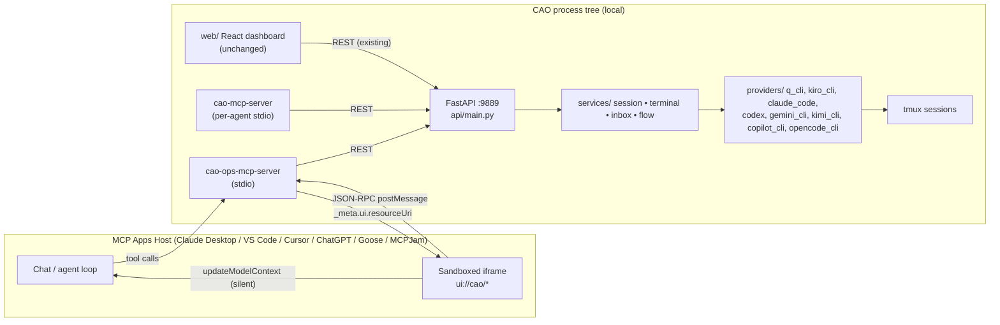
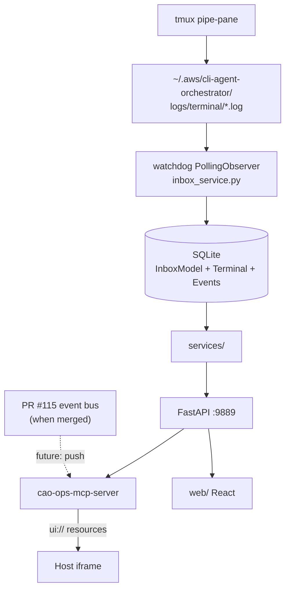

# cao-mcp-apps-implementation-plan-2026-05-10-v2.md

| Field | Value |
|---|---|
| **Created** | May 10, 2026 |
| **Version** | v2 |
| **Status** | Draft — RFC for awslabs/cli-agent-orchestrator |
| **Author** | Patrick Lauer |
| **Filename** | `cao-mcp-apps-implementation-plan-2026-05-10-v2.md` |
| **Target repo** | https://github.com/awslabs/cli-agent-orchestrator |
| **Target branch** | `main` (commit baseline as of PR #233, May 9, 2026) |

---

## Table of contents

1. [Executive summary](#1-executive-summary)
2. [Why MCP Apps beats a local-only dashboard](#2-why-mcp-apps-beats-a-local-only-dashboard)
3. [State of the agentic UI stack in May 2026](#3-state-of-the-agentic-ui-stack-in-may-2026)
4. [Competitive landscape update](#4-competitive-landscape-update)
5. [A construct model for CAO UX architecture](#5-a-construct-model-for-cao-ux-architecture)
6. [Architecture overview](#6-architecture-overview)
7. [MCP Apps integration design](#7-mcp-apps-integration-design)
8. [UI components specification](#8-ui-components-specification)
9. [Data flow and communication protocol](#9-data-flow-and-communication-protocol)
10. [Server-side changes](#10-server-side-changes)
11. [Security model](#11-security-model)
12. [State management strategy](#12-state-management-strategy)
13. [Cross-host compatibility](#13-cross-host-compatibility)
14. [Build and bundle strategy](#14-build-and-bundle-strategy)
15. [Testing strategy: shift-left as a structural constraint](#15-testing-strategy-shift-left-as-a-structural-constraint)
16. [Migration path from the current local-only dashboard](#16-migration-path-from-the-current-local-only-dashboard)
17. [Implementation roadmap](#17-implementation-roadmap)
18. [Future: standalone dashboard path (L2)](#18-future-standalone-dashboard-path-l2)
19. [Risk analysis](#19-risk-analysis)
20. [Appendices](#20-appendices)

---

## 1. Executive summary

This RFC proposes that CAO add **first-class MCP Apps support** as a new control surface alongside the existing FastAPI server on `:9889` and the React dashboard at `web/`. The tl;dr is three sentences. CAO already speaks MCP — both `cao-mcp-server` (in-agent orchestration primitives) and `cao-ops-mcp-server` (external orchestrator entry point) are thin wrappers over the FastAPI HTTP API. MCP Apps (the official **`io.modelcontextprotocol/ui`** extension, spec dated `2026-01-26`, finalized as SEP‑1865 and shipped in **`@modelcontextprotocol/ext-apps@1.7.1`** on npm — verify against npm at PR time) lets CAO ship the dashboard *as resources of the MCP server itself*, rendered as sandboxed iframes inside any MCP Apps host — Claude Desktop, Claude.ai, ChatGPT, VS Code, Cursor 2.6+, Goose, MCPJam, Postman, Microsoft 365 Copilot. Concretely, we extend `src/cli_agent_orchestrator/mcp_server/server.py` to register a small set of `ui://` resources (`ui://cao/dashboard`, `ui://cao/agent`, `ui://cao/event-stream`) attached to a small set of new app-scoped tools (`render_dashboard`, `render_agent_view`, `subscribe_events`, `submit_command`, `cao_fetch_history`), wire them through `_meta.ui` annotations declared per SEP‑1865, and reuse the existing FastAPI surface for state.

**Why now.** Two structural shifts since the prior design pass make this the right moment. First, MCP itself has crossed the threshold of mainstream infrastructure — the protocol has surpassed 97 million monthly SDK downloads and is the assumed integration substrate for every major host (claim sourced from MCP ecosystem reports; treat as directional, not load-bearing). Second, multi-agent orchestration is no longer a niche concern. Per Anthropic's *2026 Agentic Coding Trends Report* and the broader *State of Agentic Orchestration* literature, organizations now manage on the order of dozens of endpoints per business process and the dominant developer activity has shifted from writing code to orchestrating agents that write code. CAO's value proposition lands directly on that shift. The cognitive load of running a four-agent swarm — architecture, security, performance, testing specialists — through tmux pane introspection is the friction MCP Apps was specifically designed to remove.

**What this gets us.** Zero-install UX for any user already running an MCP Apps host. An AI-native context loop where the agent driving Claude Desktop or Cursor can *see* the orchestration state and act on it without screen-scraping a separate browser tab — and, with the **`app.updateModelContext()`** API formalized in SDK v1.7.1, can also *learn from* user-driven UI actions (a drag-and-drop reassignment, a pause, a fleet shutdown) without forcing a full inference cycle. Cross-host reach across the seven hosts that materially matter today. A code-reuse path: the same React components that power `web/` today bundle into a single Vite single-file artifact for the MCP App. And alignment with where MCP itself is heading — the `2026-01-26` apps spec is now the convergence point that MCP-UI, OpenAI's Apps SDK, and Anthropic's Claude.ai all standardized around, sitting under the new Linux Foundation Agentic AI Foundation umbrella.

**Two new contextual updates that change the design space versus 90 days ago.** Auth0 launched **Auth for MCP** to general availability in May 2026, providing OAuth 2.1 + OpenID Connect with Dynamic Client Registration, On-Behalf-Of token exchange, and RFC 8707 resource indicators specifically tuned to the MCP ecosystem. This converts the unauthenticated-loopback risk on `:9889` from "out of scope, sibling RFC needed" (v1 framing) to "newly tractable, sibling RFC viable" (v2 framing) — see §11. Separately, headless execution mode has shipped across the major CLI agents (Kiro CLI headless mode, Claude Code v2.1.136 background execution), which means the Agent Status Panel must distinguish interactive agents waiting for user confirmation from autonomous agents executing in CI/CD-style loops. That changes the UI in §8.

**What this does not propose.** It does not delete `web/`. It does not break `cao-server`. It does not introduce a new transport. It does not add a new dependency tree on the Python side beyond what `fastmcp 3.2.0` (PR #139) already provides. Bundle pressure is bounded by the iframe contract: roughly 200–400 KB gzipped for the dashboard view in Vite single-file mode, which is in line with what shipping MCP Apps from Asana, Hex, Figma, and tldraw look like in the wild.

**Decision class.** Adopting MCP Apps as the L1 surface is a **two-way door**. The implementation is additive: nothing in the proposal blocks a future pivot to AG-UI streaming, A2UI declarative components, or a fully standalone PWA (see §18). Removing the local-only dashboard is explicitly out of scope; coexistence is the right posture for at least the next two release cycles. Adopting Auth0 for MCP is also a two-way door, scoped to a sibling RFC.

---

## 2. Why MCP Apps beats a local-only dashboard

The dashboard introduced in **PR #108** (CAO 2.0, by @abdullahoff) and bundled into the wheel in **PR #169** (@patrick-muller) is good engineering. It boots from `cao-server`, serves a Vite-built React app at `http://localhost:9889`, and gives a useful operator view. The recent enhancement work — `DashboardHome` (PR #200), the Profiles tab (PR #222), the missing-providers fix (PR #158), and the browser-terminal scroll/paste fix (PR #162) — is the right kind of iteration. **None of that is wasted by adopting MCP Apps; all of it can ride the same React tree.** What the local-only dashboard cannot do, by construction, is solve the cross-context problem that defines a multi-agent orchestrator's UX: the user is *already* inside an AI host (Claude Desktop, Cursor, VS Code, ChatGPT) when they need to know what their fleet is doing. A second tab on `localhost:9889` is a context switch the host's own agent cannot see and cannot reason about.

The comparison below is intentionally specific and evidence-based. Each row maps to a real workflow on the current `main` branch.

| Dimension | Local-only dashboard (`web/` on `:9889`) | MCP Apps surface (proposed) |
|---|---|---|
| **Install path** | `uv tool install cli-agent-orchestrator` then `cao-server` then open browser; if remote, SSH tunnel (`docs/web-ui.md`). | The user adds the existing `cao-mcp-server` to their MCP host config (one entry already documented in the README). The dashboard appears inline the first time a tool calls `render_dashboard`. **Zero additional install.** Claude Code v2.1.136's `--plugin-url` flag goes one step further: a single command pulls the entire CAO stack as a packaged plugin archive. |
| **AI-native context loop** | The dashboard runs in an isolated browser tab. The driving agent (Claude in Cursor, etc.) cannot see what the user sees and cannot act on dashboard state without going back through `cao-ops-mcp-server`'s textual tool outputs. | The host serializes a structured context snapshot back into the LLM context on every interaction. With **`app.updateModelContext()`** (formalized in SDK v1.7.1), the iframe can also *push* lightweight user-action summaries into chat context without triggering a new inference cycle — so when the user asks "why is that agent slow?" two messages later, the model already knows the user reassigned the task. |
| **Cross-host reach** | Localhost only. Remote access requires SSH tunneling per `docs/web-ui.md`. No mobile story. No team story. | Renders in **Claude Desktop, Claude.ai web, ChatGPT, VS Code (stable + Insiders), Cursor 2.6+, Goose, Postman, MCPJam, Microsoft 365 Copilot Chat**. Same artifact, no per-host fork. Mobile via Claude Dispatch and ChatGPT mobile is automatic. |
| **Code reuse path** | React components live in `web/src/`, are bundled by Vite 6.4.2 (PR #160), and serve from FastAPI static. | The same React components compile into a single-file Vite bundle (`vite-plugin-singlefile`, the MCP Apps de-facto standard) and are registered as a `ui://cao/...` MCP resource. **The `web/` tree and the MCP App share a component library; only the entry point and host-side transport change.** |
| **Alignment with ecosystem direction** | Diverges from where MCP is going. The MCP roadmap puts Streamable HTTP + extensions at the center; the dashboard sidesteps both. | Adopts the *first official MCP extension* (`io.modelcontextprotocol/ui`, GA Jan 26, 2026 per SEP‑1865 finalization), within the SEP‑2133 extensions framework. Lines up with AAIF governance and the Anthropic+OpenAI+MCP-UI convergence. |
| **State semantics** | REST polling on `/sessions`, `/terminals/{id}/output?mode=last`, `/terminals/{id}/inbox/messages`. The `PollingObserver` watchdog drives inbox updates server-side, but the browser-side polls. | Server pushes `notifications/resources/updated` on the existing MCP channel; iframe receives `tool-input` notifications via JSON-RPC over `postMessage`. No new transport, no polling. Lines up with PR **#115** (event-driven architecture) when it lands. |
| **Auth / multi-tenancy** | Localhost-only, no auth assumption. Anyone on the loopback can hit `:9889`. | Inherits the host's auth boundary today (Claude account, Microsoft tenant, ChatGPT workspace). With Auth0 for MCP (GA May 2026, sibling-RFC scope per §11), CAO can additionally enforce per-tool RBAC inside the MCP App itself — hiding destructive controls (`shutdown_session`, `assign`) from non-admin scopes. Solves the "team lead wants read-only view" problem the dashboard cannot. |
| **Bundle / latency cost** | First-load ≈ Vite-built React shell (≥200 KB compressed today, will grow as Profiles tab + filtering land). Works fine on localhost. | First-load is one HTTP fetch of the cached `ui://cao/dashboard` resource (single-file bundle). Hosts cache aggressively. Per-call deltas come as `notifications/tool-input` over the existing MCP socket — no separate WebSocket gateway. |
| **Failure mode** | If `cao-server` is down, the dashboard is a blank tab. If FastAPI crashes, the user has no UX. | If `cao-server` is down, the host degrades gracefully to plain text tool output. The MCP App is *additive* on top of CAO's existing tools, not a replacement substrate. |
| **Decision reversibility** | Two-way door (operationally) but adds a long-running surface that must be maintained against three browsers and multiple OSes. | Two-way door at the protocol level. Roll back by deregistering five tools. The surface area we are responsible for is the iframe contract, not a browser app. |

The technical core of the case is the **AI-native context loop** row, and `updateModelContext()` is what closes it. Every other comparator follows from it. CAO is an orchestrator for *coding agents*. The user is, by definition, sitting in front of an LLM-driven host. A control plane the LLM cannot see is a control plane the LLM cannot help operate. Once you accept that premise, the question shifts from "should we ship MCP Apps?" to "what is the smallest, safest first cut?"

The answer to that, per §17, is five tools and three resources, additive to the surface that already exists.

---

## 3. State of the agentic UI stack in May 2026

A coherent, four-layer picture has crystallized in the four months since the MCP Apps spec went GA. It looks different from the speculative layering anyone would have drawn in mid‑2025, and CAO benefits from designing against the actual stack rather than the projected one.

| Layer | What it carries | Dominant protocol(s) | Governance |
|---|---|---|---|
| **L4 — Generative UI payload** | The HTML or declarative-component description the user sees | **MCP Apps** (`text/html;profile=mcp-app`) and **A2UI** (declarative JSON catalog) | LF Agentic AI Foundation (MCP); Google + community (A2UI) |
| **L3 — Agent ↔ user runtime** | Streaming events, state deltas, lifecycle, UI surface attach/detach | **AG-UI** (HTTP+SSE, ~16 typed events) | Apache‑2.0, CopilotKit-stewarded; Series A May 5, 2026 |
| **L2 — Agent ↔ tool / context** | Tool invocations, resources, prompts, sampling, structured output | **MCP** (Streamable HTTP, OAuth 2.1 + PKCE) | LF Agentic AI Foundation |
| **L1 — Agent ↔ agent transport** | Cross-agent task handoff, signed agent cards, capability discovery | **A2A v1.0** (March 2026), with **AGNTCY** SLIM/OASF/Identity as substrate | LF AI & Data |

Five things are worth pulling out for CAO's design.

**MCP Apps is the convergence layer, not a competitor to AG-UI.** OpenAI's Apps SDK and the older MCP-UI work both rolled into the official SEP‑1865 spec. The spec is small (one resource MIME type, one set of `_meta.ui.*` annotations, JSON-RPC over `postMessage` as the iframe transport). A2UI v0.9 (April 17, 2026) is complementary, not redundant — it carries declarative component descriptions and *can ride inside an MCP App* if and when CAO decides to support a richer renderer. AG-UI is the streaming runtime above MCP, and explicitly designed to carry MCP Apps and A2UI payloads through to the frontend. **The right move for CAO today is to ship the L4 (MCP Apps) surface; AG-UI integration is the L3 question we explicitly defer (§18).**

**SDK v1.7.1 tightened the security defaults.** The SDK release that took the spec from "official" to "production-hardened" introduced `allowUnsafeEval: false` as the default (verify the exact version pin against npm at PR time). For CAO this is binding, not optional: any dependency that calls `eval`, `new Function`, or relies on JIT-compiled regex/WASM must be removed from the iframe bundle. The build pipeline in §14 enforces this with a deny-list step in CI. The same release shipped `app.updateModelContext()`, which is what makes the AI-native context loop in §2 a stable, named API rather than an implementation detail.

**Headless CLI execution is now table-stakes for the agent runtime, not an edge case.** Kiro CLI introduced headless mode in early 2026; Claude Code v2.1.136 (Week 19, May 4–8, 2026) extended background execution. This means an "agent" in CAO's fleet is no longer guaranteed to be an interactive tmux pane waiting for user input — it can be a long-running autonomous loop without a human in the loop. The Agent Status Panel (§8) must distinguish these two execution modes visually and offer different control affordances (interactive: `send_message`; headless: `interrupt`/`pause`/`resume`).

**SSE is being phased out as a remote transport.** Keboola dropped SSE on April 1, 2026; Atlassian's Rovo MCP server SSE endpoint sunsets June 30, 2026; Cumulocity flipped May 8, 2026. The MCP 2026 roadmap states Streamable HTTP is the only remote transport with a future. CAO's MCP servers are stdio-launched per agent and stdio + Streamable HTTP for `cao-ops-mcp-server`, which already aligns with the surviving direction; the proposal does not depend on SSE.

**Governance has consolidated.** MCP, A2A, and AGNTCY are now under the same Linux Foundation umbrella (AAIF for MCP, LF AI & Data for A2A). AWS, Cisco, Google, Microsoft, Salesforce, SAP, and ServiceNow are founding entity members of the A2A project. For an `awslabs/` project, this lowers the political risk of betting on MCP Apps to roughly zero — AWS is on the inside of the governance body that owns the spec.

What this means concretely is that the "should we wait for things to settle?" objection that would have been valid in November 2025 is no longer valid. Things have settled. The 2026‑01‑26 spec is what hosts ship against today. Cursor 2.6 (March 3, 2026), Microsoft 365 Copilot Chat (March 9, 2026), Goose, and the basic-host reference implementation all converged. SEP‑2133 (the extensions framework) was merged before late January 2026 and the extension identifier scheme (`io.modelcontextprotocol/ui`) is already cited in production retrospectives — see Elementor's May 2026 "Shipping MCP Apps in Production" post.

---

## 4. Competitive landscape update

The window for CAO to ship a developer-facing multi-agent orchestrator that *is* an MCP Apps host is open and visibly closing. Here is what the field looked like as of the May 9, 2026 PR snapshot.

| Project | Provider coverage | UX surface | Hosts MCP Apps? | Activity |
|---|---|---|---|---|
| **CAO** (this RFC's target) | 8 providers: q_cli, kiro_cli, claude_code, codex, gemini_cli, kimi_cli, copilot_cli, opencode_cli (PR #193) | tmux + FastAPI + React local dashboard | **No (proposed by this RFC)** | Active; latest PR #233 May 9, 2026 |
| **OpenClaw Mission Control** (4 forks: builderz-labs, abhi1693, robsannaa, manish-raana) | OpenClaw + (builderz fork) Claude SDK / CrewAI / LangGraph / AutoGen adapters | React + Convex/Express; integrated terminal | No | Fragmented; no dominant fork |
| **Cline Kanban** | Cline harness + Claude Code + Codex | VS Code extension + browser kanban (research preview Apr 2026) | No | Apache‑2.0; very active |
| **AgentMux** (4 separate projects with the same name) | Claude Code, Codex, Gemini CLI | Mix of tmux + web + native Rust GUI | No | Fragmented |
| **Agent Conductor** (gaurav-yadav) | Claude Code, Codex via BaseProvider | CLI + REST; no GUI | No | Solo project |
| **Vibe Kanban / Conductor / Claude Squad / Crystal / ccmanager / dmux** | Claude Code + Codex worktree managers | tmux/terminal-first | No | Active niche |
| **CrewAI AMP / Studio** | CrewAI agents | Cloud-first Studio; on-prem option | No (consumes MCP servers; not an MCP Apps host) | Mature |
| **OpenAI AgentKit + ChatKit + Symphony** | OpenAI + 100+ via Agents SDK | Web canvas + ChatKit embed + (Symphony) issue-tracker-as-UI | Partial — ChatGPT *is* a host, but ChatKit itself does not yet render arbitrary MCP Apps | Very active; Symphony released Apr 27, 2026 |
| **Cursor 3 Agents Window** | Multi-model | IDE | No (consumes MCP, ships own UI) | 3.3 May 6, 2026 |
| **Windsurf Wave 13/14** | Multi-model | IDE | No | Active |
| **Microsoft 365 Copilot Studio** | Copilot + Fabric + M365 SDK + A2A | Enterprise web + embedded | **Yes** (March 9, 2026) | GA April 2026 |
| **Claude Cowork (Anthropic)** | Claude only | Desktop app + Dispatch | **Yes** (renders MCP Apps; Moody's app May 5, 2026) | GA April 2026 |
| **Nimbalyst** | Claude Code, Codex, OpenCode, Copilot (alpha) | Desktop + iOS visual editors | **Yes** (listed as MCP Apps host, April 2026) | Open-sourced April 29, 2026 |
| **Goose (Block / AAIF)** | Any LLM | TUI + desktop GUI | **Yes** (reference host) | Foundational |

Two observations are decision-relevant.

First, in the **developer-facing CLI-orchestrator category specifically**, no competitor has shipped MCP Apps as a host. Every project in that category — Mission Control, Cline Kanban, AgentMux variants, Agent Conductor, Vibe Kanban, Claude Squad, Crystal, ccmanager — *consumes* MCP servers but does not render MCP Apps inside its own dashboard. This is the slot CAO can occupy.

Second, the broader category has hosts in production: Microsoft 365 Copilot Studio (multi-agent + MCP Apps, March 2026), Claude Cowork (MCP Apps host with Moody's app shipping May 5, 2026), Nimbalyst (April 29, 2026 open-source release explicitly listing MCP Apps host support). The "first multi-agent orchestrator to ship MCP Apps" framing has to be precise: **first developer-CLI-focused multi-agent orchestrator** is the defensible claim. Enterprise platforms and single-user desktop agents already host. That precision matters because Tuan, Haofei, and the maintainers will rightly want to avoid overstating the position; the contribution is real without needing inflation.

---

## 5. A construct model for CAO UX architecture

The AWS CDK-style construct vocabulary maps cleanly onto CAO's existing layering and gives the maintainers a clean way to reason about composition. Versus v1, this version makes the **protocol** that lives at each construct level explicit, which clarifies the deferral boundary between this RFC and future work.

| Layer | CDK analogy | Definition for CAO | Concrete surface | Protocols at this layer |
|---|---|---|---|---|
| **L0 — Substrate** | Service primitive | Raw transports and process boundaries | tmux sessions, FastAPI HTTP on `:9889`, fastmcp 3.2.0 stdio servers, SQLite + watchdog `PollingObserver`, plugin entry points (PR #172) | HTTP, JSON-RPC over stdio, SQLite, tmux IPC |
| **L1 — Raw construct** | CFN resource | One MCP feature, faithfully exposed; opinion-free | Today: `cao-mcp-server` (handoff/assign/send_message/load_skill), `cao-ops-mcp-server` (list_profiles…). **Adds in this RFC: `ui://cao/*` MCP App resources + new app-scoped tools** | **MCP + MCP Apps (`io.modelcontextprotocol/ui`)** |
| **L2 — Opinionated construct** | Higher-level CDK construct | A coherent product surface composed from L1 primitives | Today: the `web/` React dashboard. **Future: a standalone PWA at L2 (§18) consuming `ui://cao/*` resources from any reachable CAO instance, likely over AG-UI transport** | **MCP + AG-UI** (HTTP+SSE event stream) |
| **L3 — Composed system** | CDK Stack / Pattern | Cross-cutting orchestrations of L2 surfaces | A team-shared CAO control plane with auth (Auth0 for MCP, RBAC, multi-tenant); embedded CAO within Strands or AgentCore workflows; potentially native rendering via A2UI declarative components | **MCP + AG-UI + A2UI + A2A + Auth0/OAuth 2.1** |

The key change versus what one might have written in February: **MCP Apps is L1, not L2.** It is a raw, faithful exposition of a single MCP extension feature. The dashboard's *opinionated layout* — the tab structure, the filtering and grouping in PR #200, the agent profile views in PR #222 — is what makes it L2. A future standalone dashboard, decoupled from `cao-server` and able to talk to multiple CAO instances over AG-UI streams, is also L2 (different opinion, same construct level). A2UI integrations, when they happen, slot in at L4 of the protocol stack but compose at L3 of the construct model — they make a multi-tenant team control plane possible without iframe sandboxing.

This re-anchoring matters because it disciplines the proposal. We are *not* proposing to rebuild the dashboard. We are *not* proposing to adopt AG-UI or A2UI in this RFC. We are proposing to add an L1 surface that the existing L2 dashboard, future L2 PWAs, and future L3 enterprise compositions can all later ride on top of. The protocol mapping makes the deferral boundary unambiguous: anything at L2 or L3 in the construct model is a separate RFC.

---

## 6. Architecture overview

### 6.1 System context



The new surface is a thin wedge in `cao-ops-mcp-server`. Nothing else moves. The `web/` dashboard keeps its existing relationship to FastAPI; `cao-mcp-server` keeps its existing per-agent role; `cao-ops-mcp-server` gains five tools and three resources.

### 6.2 Sequence: dashboard render with model-context update

```mermaid
sequenceDiagram
    participant U as User
    participant H as MCP Host
    participant O as cao-ops-mcp-server
    participant A as FastAPI :9889
    participant I as Sandboxed iframe

    U->>H: "Show me CAO sessions"
    H->>O: tools/call render_dashboard
    O->>A: GET /sessions, /agents/providers, /terminals
    A-->>O: JSON state
    O-->>H: tool result with _meta.ui.resourceUri = ui://cao/dashboard
    H->>O: resources/read ui://cao/dashboard
    O-->>H: text/html;profile=mcp-app (single-file bundle)
    H->>I: render iframe with sandbox + CSP
    I->>H: postMessage handshake (ext-apps connect)
    I->>O: tools/call cao_fetch_history
    O->>A: GET /events?limit=500
    A-->>O: rolling event buffer
    O-->>I: history snapshot (via host)
    H->>I: notifications/tool-input (initial state snapshot)
    Note over I,O: Subsequent updates pushed via<br/>notifications/resources/updated +<br/>notifications/tool-input deltas
    U->>I: drag-and-drop reassign task
    I->>H: app.updateModelContext (silent, no inference)
    I->>O: tools/call submit_command (kind=assign)
    O->>A: POST /sessions/{id}/assign
    A-->>O: ok
    O-->>I: state delta
    Note over H,U: Two messages later, user asks<br/>"why is that agent slow?"<br/>The model already knows about the reassignment.
```

### 6.3 Data flow



The dotted edge from PR #115 is the cleanest place to land event-driven updates once that work merges. Until then, `cao-ops-mcp-server` re-reads relevant FastAPI endpoints on a short interval (default 1 s, configurable) and emits `notifications/resources/updated` + `notifications/tool-input` only when state has changed. The new `Events` table on the SQLite side is the rolling 500-event buffer that feeds `cao_fetch_history` for iframe re-hydration when a host tears down and re-mounts the iframe.

---

## 7. MCP Apps integration design

### 7.1 Tool and resource surface

We add three resources and five tools to `cao-ops-mcp-server`. The `cao-mcp-server` (per-agent) is intentionally untouched in this RFC — handoff/assign/send_message are agent primitives, not control-plane primitives, and entangling them with UI is the wrong factoring.

| Kind | URI / name | Visibility | Purpose |
|---|---|---|---|
| Resource | `ui://cao/dashboard` | normal | Single-file Vite bundle for the operator dashboard (sessions, providers, terminals, flows). |
| Resource | `ui://cao/agent` | normal | Per-agent detail view (terminal output, inbox, status, sub-agent tree). |
| Resource | `ui://cao/event-stream` | normal | Compact live event ticker (no full dashboard chrome). |
| Tool | `render_dashboard` | normal | Returns the dashboard view. `_meta.ui.resourceUri = ui://cao/dashboard`. |
| Tool | `render_agent_view` | normal | Args: `terminal_id`. Returns the agent detail view. |
| Tool | `subscribe_events` | `["app"]` (app-only) | Used by the iframe to start a subscription; not surfaced to the model. |
| Tool | `cao_fetch_history` | `["app"]` (app-only) | Hydrates the event stream from the rolling 500-event buffer on iframe init or re-mount. |
| Tool | `submit_command` | normal | The single host-mediated mutation entry point. Args: `{ kind: "shutdown_session" \| "send_message" \| "assign" \| "create_session" \| "interrupt" \| "pause" \| "resume", payload: {...} }`. |

The single-`submit_command` factoring is deliberate. It keeps the *set* of tools the LLM sees small (good for tool-search hosts and for tool-list latency under newer Claude Code releases that lazy-load tools), while letting the iframe issue any operation by `postMessage` → host → MCP. It also gives us one obvious place to enforce per-operation approval policy (§11) and per-operation RBAC scopes when Auth0 for MCP lands. The newly added `interrupt`, `pause`, and `resume` kinds support headless-execution control affordances per §3.

### 7.2 `_meta.ui` annotations

Per the `2026-01-26` spec and the SDK 1.7.x shape, each rendering tool declares:

```jsonc
{
  "name": "render_dashboard",
  "description": "Render the CAO operator dashboard.",
  "_meta": {
    "io.modelcontextprotocol/ui": {
      "resourceUri": "ui://cao/dashboard",
      "preferredFrameSize": { "width": 1280, "height": 800 },
      "prefersBorder": true,
      "domain": "cao-dashboard",
      "csp": {
        "connectDomains": ["http://localhost:9889"],
        "resourceDomains": [],
        "frameDomains": [],
        "baseUriDomains": []
      },
      "permissions": [],
      "visibility": ["model", "app"]
    }
  }
}
```

Annotations worth flagging:
- `connectDomains` is set to `http://localhost:9889` because the iframe will issue `fetch` to the local FastAPI server through the host's connection broker on hosts that allow it (Cursor, VS Code Insiders). On hosts with stricter sandboxes (ChatGPT, Claude.ai), the iframe reaches the server only via host-mediated tool calls. We rely on the host's CSP composition; this is the field Claude.ai's bug #40 currently ignores (see §13).
- `domain: "cao-dashboard"` is the stable subdomain hash key the host uses for sandbox isolation.
- `permissions: []` is intentional: no clipboard, no camera, no geolocation. If we later add a "copy terminal output" affordance we will need `clipboardWrite`.
- `visibility: ["app"]` on `subscribe_events` and `cao_fetch_history` keeps them out of the model's tool list; the iframe still calls them via `app.callServerTool`.

### 7.3 Lifecycle and the AI-native context loop

We follow the documented best-practice ordering (registering handlers *before* `app.connect()`, replaying tool result on `oninitialized`):

```ts
// Inside ui://cao/dashboard
import { App } from "@modelcontextprotocol/ext-apps";

const app = new App();
app.ontoolresult = handleToolResult;        // BEFORE connect
app.onhostcontextchanged = handleThemeEtc;
app.oninitialized = async (initial) => {
  // Replay so refresh/resume re-renders without re-running the tool
  if (initial?.toolResult) handleToolResult(initial.toolResult);
  // Re-hydrate the event stream from the rolling buffer
  const history = await app.callServerTool("cao_fetch_history", { limit: 500 });
  hydrateEventStream(history);
};
await app.connect();
```

This avoids the "missing initial result" race documented in the Elementor production retrospective and the basic-host examples.

The **`app.updateModelContext()` API** — formalized in SDK v1.7.1 — is the lever that makes the AI-native context loop in §2 a stable contract rather than an emergent behavior. The pattern is: when the user does something in the UI that *should* be visible to the model on its next turn, but that *should not* trigger a new inference cycle, we push a brief, structured note into chat context.

A concrete CAO example. The user drags task `task-7` off the architecture agent and drops it on the performance agent in the Task Control Panel. The iframe handles this in two steps:

```ts
async function handleTaskReassignment(taskId: string, fromAgent: string, toAgent: string) {
  // 1. Mutate the backend through the host-mediated tool.
  await app.callServerTool("submit_command", {
    kind: "assign",
    payload: { task_id: taskId, from_agent: fromAgent, to_agent: toAgent },
  });

  // 2. Silently inform the LLM context of the UI interaction.
  //    No inference cycle. The user's next chat turn includes this implicitly.
  await app.updateModelContext({
    content: [{
      type: "text",
      text: `User reassigned ${taskId} from '${fromAgent}' to '${toAgent}' via the CAO dashboard at ${new Date().toISOString()}.`,
    }],
  });
}
```

When the user types "why is the architecture agent so slow now?" two messages later, the model already has the reassignment context. It can reason about the *consequence* of the user's UI action without the user having to narrate the action in chat. This is the loop closure that a localhost dashboard cannot provide and that elevates MCP Apps from "pretty rendering layer" to "conversation participant." We use `updateModelContext` sparingly — once per material user action, not per click — to avoid spamming the chat budget.

---

## 8. UI components specification

The MCP App is a single React tree, bundled to one HTML file via `vite-plugin-singlefile`. The view it renders is determined by the active tool (`render_dashboard` vs `render_agent_view` vs `event-stream`) and by the initial tool result it receives.

| Component | Source | Purpose | Notes |
|---|---|---|---|
| `<HeaderBar>` | `web/src/components/HeaderBar.tsx` (refactored to be host-agnostic) | CAO version, host-detected theme, connection state, count of active sessions, **cognitive-load metric** (active sub-agents + aggregate token consumption rate) | Reads `app.hostContext` for theme; no localStorage. The cognitive-load metric is a single-glance indicator that the operator is approaching saturation or rate limits — particularly relevant in 4+ agent swarms. |
| `<AgentStatus>` | new | Hierarchical grid of terminals: provider, profile, idle/processing/error/headless, last activity, parent-agent indent for sub-agents | One row per terminal from `GET /sessions/{id}/terminals`. **Sub-agents** (delegated by a parent agent — e.g., architecture spawns a security sub-agent) render indented under the parent. **Execution-mode badge** distinguishes `interactive` (awaiting input) from `headless` (autonomous loop). Color via `light-dark()` CSS function (Claude tokens; falls back on other hosts). |
| `<TaskControl>` | new | Buttons: Create session, Send message, Assign, Shutdown, **Interrupt** (SIGINT), **Pause** (headless agents), **Resume** | Each emits `app.callServerTool("submit_command", { kind, payload })`. The interrupt affordance is the MCP App equivalent of `Ctrl-C` and lets operators rein in a runaway autonomous agent without leaving the chat host. |
| `<EventStream>` | new | Live ticker of last 500 events; categorized: launch, handoff, A2A delegation, file-mod, completion, error | Subscribes via `subscribe_events`; receives `notifications/tool-input` deltas. Hydrated from `cao_fetch_history` on iframe init (handles host re-mount cleanly). Acts as a governance log — every cross-agent handoff and destructive operation is timestamped and persisted. |
| `<AgentDetail>` | adapted from `web/`'s terminal view | Per-agent: terminal output (xterm.js), inbox, profile metadata, sub-agent tree | Used by `render_agent_view`; no direct REST calls — all state arrives via `notifications/tool-input`. |
| `<ProfilesPanel>` | adapted from PR #222 | Read-only profile catalog | Re-uses the React component being added in #222; deferred to phase 2. |

Three structural rules:

- **No direct `fetch` to `:9889` from the MCP App view on strict-CSP hosts.** All state mutations go through `submit_command`; all reads come from initial tool result + `notifications/tool-input` deltas. This is required for ChatGPT and Claude.ai compatibility (their sandboxes do not allow arbitrary loopback) and is the right factoring for any host with a strict CSP. On hosts that allow it (Cursor, VS Code Insiders), the iframe *may* reach `:9889` directly through declared `connectDomains`, but the React tree is structured to work in either mode.
- **No localStorage / sessionStorage / cookies.** Per the production-learnings consensus (Elementor blog, dev.to writeups), storage APIs throw `SecurityError` in some hosts. State is in-memory; persistence is server-side via the existing SQLite layer plus the rolling 500-event buffer that `cao_fetch_history` exposes.
- **Container queries, not media queries, for responsive layout.** The iframe viewport is unpredictable across hosts: ~350 px wide in a VS Code sidebar, ~1280 px in a Claude Desktop panel, anywhere in between in Cursor or Goose. CSS container queries on the dashboard root let each panel reflow against its actual container width rather than the host viewport, which on many hosts is reported incorrectly through `@media`.

---

## 9. Data flow and communication protocol

The wire protocol is the union of three surfaces, all of which already exist in some form:

1. **MCP transport (stdio for `cao-mcp-server` per agent; stdio + Streamable HTTP for `cao-ops-mcp-server`).** No change.
2. **JSON-RPC over `postMessage` between host and iframe.** Provided by the SDK; we do not implement transport ourselves.
3. **Internal: FastAPI on `:9889`.** We add one new read endpoint (`GET /events?limit=N`) to back `cao_fetch_history`. No other surface changes.

Concrete message flows:

| Event | Direction | Mechanism |
|---|---|---|
| Initial state | host → iframe | `notifications/tool-input` immediately after `app.connect()`; payload = JSON snapshot of sessions/terminals/providers. |
| Event-stream re-hydration | iframe → host → server | `app.callServerTool("cao_fetch_history", { limit: 500 })` on `oninitialized` and after host re-mounts the iframe. |
| State delta (terminal status flip) | server → host → iframe | `cao-ops-mcp-server` detects change (tick or PR #115 event), emits `notifications/resources/updated` for `ui://cao/dashboard`, plus `notifications/tool-input` carrying the delta keyed by `terminal_id`. |
| User-initiated mutation | iframe → host → server | `app.callServerTool("submit_command", {...})`. Host applies its policy (consent / approval) and forwards. |
| Theme / host context change | host → iframe | `onhostcontextchanged` (light/dark, displayMode, dimensions). |
| Silent context update (AI-native loop) | iframe → host (in chat) | `app.updateModelContext({ content: [{ type: "text", text: "User shut down session abc-123 (worker: code_supervisor)." }] })`. Used per §7.3. |

The `updateModelContext` channel is the AI-native context loop in §2 made concrete. Without it, an MCP App is a pretty rendering layer; with it, the user's clicks become first-class context the agent reasons about on its next turn. We use it sparingly — once per material user action — to avoid spamming the chat.

---

## 10. Server-side changes

The proposal is intentionally tightly scoped on the Python side. The change set against the May 9, 2026 `main`:

| File | Change | Notes |
|---|---|---|
| `src/cli_agent_orchestrator/mcp_server/server.py` | Register `render_dashboard`, `render_agent_view`, `subscribe_events`, `cao_fetch_history`, `submit_command`. Use fastmcp 3.2.0's `@mcp.tool` and `@mcp.resource`. | The fastmcp `_meta` shape supports the `io.modelcontextprotocol/ui` extension verbatim. |
| `src/cli_agent_orchestrator/mcp_server/ui_resources.py` | New. Loads the prebuilt single-file HTML from a packaged `cao_mcp_apps_assets/` directory and serves it via `RESOURCE_MIME_TYPE = "text/html;profile=mcp-app"`. | Mirrors the pattern that PR #169 set up for `web/` static assets — assets ship inside the wheel. |
| `src/cli_agent_orchestrator/services/ui_state_service.py` | New. Computes the JSON snapshot for the initial tool result and maintains per-subscriber delta state. Reads via existing services (no new DB tables). | Deltas are diffs against the last sent snapshot per subscription. |
| `src/cli_agent_orchestrator/services/event_log_service.py` | New. Rolling 500-event buffer in SQLite (or in-memory ring buffer, configurable). Backs `cao_fetch_history`. | Tracks: launch, handoff, A2A delegation, file-mod, completion, error. Time-bounded (drop events > 24 h old by default). |
| `src/cli_agent_orchestrator/api/main.py` | One new read endpoint: `GET /events?limit=N&since=<iso8601>`. | Avoids the temptation to back-fill REST surfaces just for the MCP App. |
| `pyproject.toml` | No new runtime deps. fastmcp 3.2.0 and FastAPI are sufficient. | A new build-time dep on Node toolchain only if we choose to build the MCP App bundle from `web/` source rather than committing the artifact (see §14). |
| `cao_mcp_apps/` (new directory at repo root) | Vite + React project that compiles to a single HTML file and is copied into `src/cli_agent_orchestrator/mcp_server/assets/dashboard.html` at wheel build time. | Sister directory to `web/`; explicit separation of L1 surface from L2 surface. |

A note on the Python MCP framework. fastmcp 3.2.0 (after PR #139's bump) supports custom `_meta` blocks on tools and resources, which is what SEP‑1865 needs. As of the time of writing, no specific `ext_apps` helper exists in fastmcp; we wire the metadata directly. If the upstream `jlowin/fastmcp` adds typed helpers later, migration is mechanical.

A note on PR **#115** (event-driven architecture, by @tuanknguyen). This proposal is *not* dependent on #115 landing first. The polling ticker described in §6.3 is sufficient for v1. When #115 lands, `services/ui_state_service.py` rewires from "tick + diff" to "subscribe to event bus" with no contract change visible to the iframe. That is one of the reasons the surface area is small — the hard work of replacing the inbox watchdog with a real event bus is already in flight; we should not duplicate it.

---

## 11. Security model

The threat model for an MCP App embedded in a host is well-understood at this point — see Postman's, OpenAI's, and Elementor's writeups, and the iframe-sandbox dev.to reverse-engineering posts. The relevant guarantees we can lean on, and the gaps we need to fill, are below.

| Concern | Host-provided | CAO-provided |
|---|---|---|
| Iframe sandboxing | Yes — every supported host applies a default sandbox (no `allow-same-origin`, no `allow-top-navigation`). | We do not request additional permissions. `permissions: []`. |
| CSP | Yes — composed from host policy + our `_meta.ui.csp` declaration. | We declare the minimum: `connectDomains: ["http://localhost:9889"]` only when needed (Cursor/VS Code). For ChatGPT, no `connectDomains` — all data flows via host-mediated tool calls. |
| **JIT / eval blocking** | Yes — SDK v1.7.1 sets `allowUnsafeEval: false` by default. | The build (§14) enforces a deny-list: no `eval`, no `new Function`, no JIT-compiled regex helpers, no WASM with JIT. Audited at CI time. |
| Tool-call approval | Yes — host can require user consent per call. | `submit_command` is the single mutation choke point; we recommend the host enforce approval on `kind in {shutdown_session, send_message, assign, create_session, interrupt}`. |
| Auth to FastAPI | None today — `:9889` is unauthenticated and assumed local. | Unchanged in **this** RFC. The iframe never reaches `:9889` directly in the recommended posture (ChatGPT/Claude.ai); it only reaches it on hosts that declare it via `connectDomains` (Cursor, VS Code Insiders), which still requires the same trust we already extend to anyone running `cao-server`. **Auth0 for MCP is the path forward — see §11.1.** |
| Cross-host CSP variance | Bug surface — Claude.ai issue #40 ignores declared CSP fields. | Defensive coding: assume restrictive CSP everywhere; never depend on `frameDomains`. |
| Code injection via terminal output | Important. The `<AgentDetail>` view renders arbitrary terminal output. | Output is rendered through xterm.js (the same library `web/` uses), which sanitizes by construction. No `dangerouslySetInnerHTML`, no `eval`, no `new Function`. The `allowUnsafeEval: false` default would block anything we missed anyway. |
| Secret exfiltration | Important. Terminal logs may contain secrets. | The MCP App is local-process; the host sandbox prevents `localStorage` and arbitrary network egress beyond declared `connectDomains`. The single-file Vite bundle is built without third-party CDNs. |

### 11.1 Auth0 for MCP — a newly tractable path

Auth0 launched **Auth for MCP** to general availability in May 2026. The relevant capability set for CAO:

- **OAuth 2.1 + OpenID Connect** with Dynamic Client Registration (DCR) — MCP hosts (VS Code, Claude Desktop, etc.) can register themselves as clients without manual pre-configuration on the CAO side.
- **Protected Resource Metadata (PRM)** at `/.well-known/oauth-protected-resource` — the MCP-spec-mandated discovery endpoint that lets clients learn what scopes the server requires.
- **On-Behalf-Of (OBO) tokens** scoped to specific server resources via RFC 8707 indicators — prevents a token issued for CAO from being usable against another MCP server.
- **Scope-based RBAC** — a token bearing only `cao:read` can call `render_dashboard` and `cao_fetch_history` but cannot call `submit_command`. The MCP App's `<TaskControl>` panel reads scopes from the initial tool result and visually disables (greys out, with tooltip) any control the user lacks scope for.

**This RFC does not propose to implement Auth0 for MCP.** It does propose to leave the door open and document the path:

1. The proposed surface uses `submit_command` as the single mutation choke point. This is the natural place to enforce per-scope authorization later — one decorator, one RBAC check, no surface refactor needed.
2. `_meta.ui` annotations include a `requiredScopes` field on `submit_command` (empty in this RFC; populated when auth lands).
3. The dashboard React tree is structured to read scopes from the host context and disable UI affordances declaratively.

The Auth0 integration itself is a sibling RFC: `cao-auth0-mcp-integration-2026-NN-NN-v1.md`. It lives under the L3 construct in the model in §5 and unblocks team-shared and enterprise deployment scenarios. Splitting the work into two RFCs respects the maintainers' review bandwidth and lets the MCP Apps PR ship without auth-spec gating.

The decision class on the auth boundary is a **two-way door** at every level. Leaving `:9889` unauthenticated is how the project ships today; adopting Auth0 for MCP is additive and reversible. The MCP Apps surface is forward-compatible with both postures.

---

## 12. State management strategy

The state shape inside the MCP App is intentionally minimal and three-tiered:

| Tier | What | Where it lives |
|---|---|---|
| Server canonical | sessions, terminals, providers, profiles, inbox messages, flows, events | SQLite + watchdog (current). One source of truth. |
| Per-subscription cache | what the host has been told so far for a given iframe instance | `services/ui_state_service.py` (new). Keyed by host-supplied subscription id. |
| Iframe local | rendered React tree state, hover state, in-flight mutations | In-memory React state. **No persistence.** Re-hydrated on `oninitialized` via `cao_fetch_history`. |

The Elementor production lesson — that users refresh mid-flow and the iframe must replay state correctly — is handled by `oninitialized` replaying the most recent tool result snapshot *and* fetching the rolling event buffer. We do not persist client-side; we re-fetch on initialize. This pattern handles the host-tears-down-iframe case (mobile, tab switch, conversation context change) cleanly.

For deltas, we use a small JSON Patch (RFC 6902) shape inside `notifications/tool-input` payloads. This keeps the iframe's reducer trivial and matches what AG-UI's `STATE_DELTA` event uses upstream — convenient if a later RFC layers AG-UI on top.

---

## 13. Cross-host compatibility

Compatibility is the concrete operational constraint of this proposal. Below is the host matrix CAO should test against in v1, mapped to what the host actually ships as of May 2026.

| Host | MCP Apps support | Tested in v1? | Notes |
|---|---|---|---|
| **Claude Desktop** | Shipped Jan 26, 2026 | Yes (primary target) | Requires "domain signing" (subdomain hash tied to server URL). Bug: ignores declared `frameDomains`/`connectDomains`/`resourceDomains` (anthropics/claude-ai-mcp #40). Defensive: avoid nested iframes. |
| **Claude.ai web** | Shipped Jan 26, 2026 | Yes | Same as desktop. Pro/Max/Team/Enterprise tiers. |
| **Claude Code v2.1.136** (May 4–8, 2026) | Plugin packaging via `--plugin-url` | Yes | The `--plugin-url` flag lets users install the entire CAO MCP server + UI bundle from a single zip URL. We should publish a release artifact `cao-orchestrator-2.x.zip` to GitHub Releases for one-shot install. |
| **ChatGPT** | Shipped Jan 26, 2026 | Yes | Sandbox at `*.web-sandbox.oaiusercontent.com`. No `useFiles`, no `useCheckout`, limited tool calling from UI. We do not depend on those. |
| **VS Code 1.119/1.120** (stable + Insiders) | Shipped Jan 26, 2026; ongoing improvements | Yes | Three workflow-relevant updates: (1) `.mcp.json` workspace deduplication — CAO must register under a stable namespace (`cao-orchestrator`) so workspace overrides cleanly supersede globals; (2) `github.copilot.chat.skillTool.enabled` allows sub-agent context isolation — CAO tool definitions should set `context: "fork"` on heavy outputs so dense orchestration logs do not crowd the user's primary chat context; (3) MCP Apps are inline-only, no fullscreen — container queries (§8) are mandatory for the 350 px sidebar case. |
| **Cursor 2.6+** | Shipped March 3, 2026 | Yes | Demo integrations: Amplitude, Figma, tldraw. Behavior closest to VS Code. |
| **Goose (Block)** | Shipped Jan 26, 2026 | Yes (reference host) | Use Block's tutorial as the smoke-test path. |
| **MCPJam Inspector** | Shipped (testing host) | Yes — primary CI host (§15) | Widget emulator + device-size emulation; CLI mode for GitHub Actions. |
| **Postman** | Shipped | Best-effort | Pre-dates SEP‑1865; uses sandbox proxy iframe pattern. |
| **Microsoft 365 Copilot Chat** | Shipped March 9, 2026 | Best-effort | Enterprise tenant; not part of standard CI loop. Auth0 for MCP integration would unlock this for ChatGPT Enterprise / M365 Copilot Enterprise scenarios. |
| **JetBrains AI Assistant** | Stated intent; not shipped as of May 2026 | No | Watch list only. |
| **Windsurf** | Not shipped | No | Watch list. |
| **Zed** | Not shipped | No | Watch list. |

The compatibility matrix is asymmetric in a useful way: hosts that *do* ship as of May 2026 cover the vast majority of CAO's current user base (developers running Claude Code, Cursor, VS Code, Goose). Holdouts (JetBrains, Windsurf, Zed) are tracked as future work, not blockers.

A specific note on **per-host quirks** that informed §7's design:
- ChatGPT-specific extensions (`window.openai.openExternal()`, `redirect_domains` under `openai/widgetCSP`) are *not* used. The MCP App must work portably or fall back gracefully.
- Display modes vary: VS Code lacks fullscreen and PiP; we always render at `preferredFrameSize` and degrade by stacking sections vertically below 720 px width using container queries.
- Theme variables vary: Claude provides `light-dark()` CSS values plus `--font-sans: "Anthropic Sans"`; not all hosts pass full token sets. CSS uses `light-dark()` with explicit fallback colors.
- `prefersBorder` is set explicitly per spec recommendation.
- VS Code's `context: "fork"` tool annotation is set on `cao_fetch_history` and on `render_agent_view` results so that large terminal-output blobs land in a sub-agent context rather than the main chat.

---

## 14. Build and bundle strategy

The bundle approach mirrors what Asana, Hex, Figma, and tldraw ship: **Vite + `vite-plugin-singlefile`** producing one HTML file with inlined CSS and JS, no external script-src or style-src dependencies. This is the de-facto MCP Apps standard precisely because it sidesteps host-specific CSP restrictions, and it is now load-bearing for the **`allowUnsafeEval: false`** default in SDK v1.7.1.

| Decision | Choice | Rationale |
|---|---|---|
| Bundler | Vite 6.4.2 (matches `web/` per PR #160) | Same toolchain, same Dependabot lane, no new build-time tax. |
| Output mode | Single-file (`vite-plugin-singlefile`) | One HTTP fetch per resource read; works under strict CSP. |
| Framework | React 18 (matching `web/`) | Component reuse from `web/`. |
| State | React state + JSON Patch reducer | No Redux, no Zustand; bundle pressure matters more than ergonomics here. |
| **JIT-free dependency tree** | CI deny-list scan for `eval`, `new Function`, `wasm-jit` patterns | Required by `allowUnsafeEval: false`. Specific exclusions: avoid runtime template engines (Handlebars, EJS) and any libraries that JIT-compile regexes. Pre-build script: `grep -r "new Function\|eval(" node_modules/<dep> && exit 1`. |
| Charting / heavy deps | None in v1 | Avoids `eval`-using libraries (some D3-adjacent libs trip the sandbox). |
| Terminal rendering | xterm.js (deferred to phase 2 per §17) | Already used in `web/`; per PR #162. xterm.js does not use `eval`. |
| Layout | CSS container queries | Per §13; required for 350 px–1280 px viewport range. |
| Target gzip size | `ui://cao/dashboard` ≤ 250 KB; `ui://cao/agent` ≤ 200 KB; `ui://cao/event-stream` ≤ 100 KB | Conservative against the spec's effective ceiling and aligned with shipping production MCP Apps. Aspirational stretch target of 120 KB total acknowledged but not enforced — premature compression at this stage trades developer velocity for marginal user benefit. |
| Where the artifact lives | `src/cli_agent_orchestrator/mcp_server/assets/*.html` (built into the wheel) | Mirrors the PR #169 pattern. End users do not need Node; only contributors rebuilding from source do. |
| CI build | GitHub Actions matrix step in the existing CI workflow | Builds `cao_mcp_apps/` then asserts artifact size budget *and* runs the JIT-free deny-list scan. Fails the build if either trips. |

The size budget is a structural constraint, not a soft target. We assert it in CI, the way the project already asserts test pass and lint clean. A blown budget is a bug. The deny-list scan is enforced the same way.

---

## 15. Testing strategy: shift-left as a structural constraint

Quality has to be load-bearing on this surface because we are shipping into many hosts we do not control. The test pyramid:

**Unit and component tests (Vitest 3.2.4 — already in `web/` per PR #129).** Every reducer, every component branch. Thresholds: ≥85% line coverage on `cao_mcp_apps/src/`. Run via `vitest run --coverage` in CI. Targets sub-10-second suite execution to preserve the inner loop.

**Contract tests against the SDK (Vitest + the ext-apps test harness).** Verify lifecycle ordering (handlers registered before `app.connect()`), `oninitialized` replay, JSON-RPC framing on `postMessage`, `_meta.ui` annotation shape, **`updateModelContext` payload structure**. Lock the SDK at `@modelcontextprotocol/ext-apps@1.7.x` with renovate/dependabot rules to surface breaking changes early.

**End-to-end tests against MCPJam Inspector (the testing host).** MCPJam ships a CLI mode designed for GitHub Actions; it boots the host, loads our MCP server, exercises tool calls, asserts on rendered DOM and on JSON-RPC traffic. This becomes the primary cross-host fidelity check. Targets: render dashboard, render agent view, submit a no-op `submit_command`, verify state delta arrives, verify `cao_fetch_history` re-hydrates correctly after iframe re-mount, verify `updateModelContext` round-trips.

**End-to-end tests against `basic-host` (`examples/basic-host/` inside `modelcontextprotocol/ext-apps`).** A second host, run from a pinned commit. Catches host-implementation drift.

**Playwright smoke tests against `web/` regression.** The existing dashboard's behavior must not change. Hooks into the `web/`'s existing test scaffolding (which already uses Vite/Vitest); we add a thin Playwright suite (no Storybook).

**Python: pytest 9.0.3 (per PR #173).** Every new endpoint or service function (`services/ui_state_service.py`, `services/event_log_service.py`) gets unit tests. The existing `test/api/` and `test/e2e/` directories are the right home.

**JIT-free bundle scan.** A CI job that recursively greps the bundled `dashboard.html` for `eval(`, `new Function(`, and known-bad patterns. Fails the build on match. This is the structural enforcement of the `allowUnsafeEval: false` default.

**Pre-commit: husky + lint-staged.** ESLint + Prettier on the TS side; ruff/black/isort on the Python side. Block commits that do not meet the bundle-size budget on the artifact.

**Branch protection: CI green required for merge.** Tests, lint, type-check, build, bundle-size assert, JIT-free scan. No exceptions.

**Total CI suite target: ≤ 60 seconds.** Matches the inner-loop discipline the maintainers already apply on `web/`.

The discipline here is "shift-left as structural constraint" — not "shift-left as exhortation." Failures fail the build at the earliest layer that can detect them. Cross-host fidelity is a particular concern given the Claude.ai CSP bug; defensive contract tests catch regressions before users do.

---

## 16. Migration path from the current local-only dashboard

The dashboard introduced in PR #108 and matured through PRs #158, #162, #169, #200, #222 stays. This is not negotiable framing — it is a load-bearing claim about the proposal. The MCP Apps surface is **additive**.

Three reasons coexistence is the right choice for at least two release cycles:

1. **Different consumers.** Operators ssh-tunneling into a remote box (per `docs/web-ui.md`) need the standalone web app. AI-host users (the modal CAO user) benefit from the MCP App. Both populations exist; serving both is cheap because the React component library is shared.
2. **Different state assumptions.** The dashboard has full network access to `:9889` and can do whatever REST it wants. The MCP App lives in a sandbox and goes through `submit_command`. Forcing the dashboard to adopt the sandbox model would be a regression on operator UX.
3. **Risk diversification.** If a host vendor breaks SEP‑1865 compatibility (Claude.ai #40 is the cautionary tale), the dashboard remains a working escape hatch.

Concrete coexistence plan:

| Phase | What ships | What changes for `web/` |
|---|---|---|
| 0 (today) | Dashboard at `http://localhost:9889`. | Nothing. |
| 1 (this RFC, ~6 weeks) | MCP App side-by-side. New tools + resources in `cao-ops-mcp-server`. | Nothing changes for users. Internally, `web/src/components/` is refactored to extract shared primitives into `cao_mcp_apps/src/shared/`. |
| 2 (~3 months) | Component library (`cao_mcp_apps/src/shared/`) becomes the canonical home; both surfaces consume it. | `web/` switches its imports to the shared library. Behavior unchanged. |
| 3 (open-ended) | Re-evaluate whether the standalone dashboard belongs in `web/`, moves to a separate repo as the L2 PWA in §18, or evolves into an AG-UI-transport-based shell. | This is a separate RFC, not part of this one. |

We do **not** propose deleting `web/`. We do **not** propose freezing it. The Profiles tab (PR #222), the DashboardHome enhancements (PR #200) — all that work continues. The MCP App rides on the same component library that those PRs are improving.

---

## 17. Implementation roadmap

Phases are sized to land cleanly inside the project's release cadence (CAO 2.1 patterns suggest ~3–6 week phases).

| Phase | Scope | Deliverables | Exit criteria |
|---|---|---|---|
| **Phase 0 — RFC sign-off** | This document plus discussion | Maintainer sign-off (Tuan, Haofei). Decision on whether component library extraction is in-scope for phase 1. SDK version pin confirmed against npm at PR open time. | RFC merged into `docs/rfc/` (new directory) or referenced from a tracked issue. |
| **Phase 1 — Skeleton (3 weeks)** | `cao_mcp_apps/` Vite project; minimal `render_dashboard` returning a static "hello CAO" view; `_meta.ui` annotations; wheel-bundling pipeline; JIT-free CI scan; container-query scaffold. | Working MCP App in Claude Desktop, MCPJam, basic-host. CI gating on bundle-size budget and JIT-free scan. | Smoke E2E green in 3 hosts. No regression on `web/`. |
| **Phase 2 — Real state (3 weeks)** | `services/ui_state_service.py`, `services/event_log_service.py`; initial state via tool result; delta via `notifications/tool-input`; `cao_fetch_history` for re-hydration; `<HeaderBar>` (with cognitive-load metric), `<AgentStatus>` (with sub-agent hierarchy + execution-mode badging). | Operator can see live session/terminal state across hosts, with sub-agent tree and headless-vs-interactive distinction. | E2E asserts on state propagation; coverage ≥85%. |
| **Phase 3 — Mutations + AI-native loop (3 weeks)** | `submit_command` with the seven kinds (incl. interrupt/pause/resume). `<TaskControl>`. **`updateModelContext` integration** with the silent-context-update pattern. | Operator can shut down sessions, send messages, assign work, create sessions, interrupt/pause/resume headless agents from the MCP App. The model context tracks UI actions correctly. Host approval flow tested. | E2E asserts on each mutation and on `updateModelContext` round-trip; security review (§11). |
| **Phase 4 — Per-agent view + event stream (3 weeks)** | `render_agent_view`, `<AgentDetail>` with xterm.js. `subscribe_events`, `<EventStream>`. Hierarchical sub-agent tree in detail view. | Per-agent inspect-and-act; live event ticker; governance log functional. | Cross-host matrix green for the 7 in-CI hosts. |
| **Phase 5 — Polish + docs (2 weeks)** | Theme alignment, accessibility pass (axe-core in Vitest), README updates, `docs/mcp-apps.md`, contribution guide for adding new views. Publish `cao-orchestrator-2.x.zip` to GitHub Releases for Claude Code `--plugin-url`. | Public release ready. | Public RFC closes; CAO 2.2 release tag. |

Total: roughly 14 weeks from RFC sign-off to v1 release. Phases 1–5 can run with one full-time engineer; Phases 2–4 benefit from a second.

A specific tie-in: **PR #115 (event-driven architecture)** and **issue #147 (plugin/provider extension API)**. Phase 2 should be plumbed in a way that consumes #115's event bus directly when it lands — concretely, `ui_state_service.py` should be written behind a small interface that has two implementations (polling + event-bus) and switch via configuration. That keeps both work streams independent.

**Auth0 for MCP integration is explicitly excluded from this roadmap** and tracked as the sibling RFC `cao-auth0-mcp-integration-2026-NN-NN-v1.md`. The MCP Apps surface is forward-compatible with that work; no rework of phases 1–5 is required when auth lands.

---

## 18. Future: standalone dashboard path (L2)

This RFC is L1. The L2 path — a standalone, possibly remote, possibly multi-instance dashboard PWA — is foreseeable but explicitly out of scope here. For completeness, the design space looks like this:

A standalone CAO dashboard would consume `ui://cao/*` resources from one or more reachable CAO instances, sit on its own origin, handle multi-instance auth, and likely speak AG-UI to bridge agent-side streams into the UI. It would *not* replace the MCP App; it would be a peer surface for users who want operator UX outside an AI host.

Specific design questions deferred:
- AG-UI integration for live event streams beyond what `notifications/tool-input` carries.
- A2UI declarative views inside CAO views (the v0.9 Apr 2026 release makes this newly tractable, but the spec has not hit v1.0).
- Auth model on `:9889`. Auth0 for MCP per §11.1, sibling RFC.
- Multi-instance topology: one dashboard, many CAO daemons (team setting).

The L2 path becomes much easier *because* L1 lands first: every component built for the MCP App is reusable, the JSON Patch delta protocol is reusable, and the shared component library is in place.

---

## 19. Risk analysis

| Risk | Likelihood | Impact | Mitigation |
|---|---|---|---|
| Claude.ai CSP bug (issue #40) breaks our app on the highest-traffic host | Medium | High | Defensive design: never depend on `frameDomains`; assume host CSP is more restrictive than declared. Cross-host CI catches regressions. |
| ext-apps SDK breaking change between 1.7.x and 2.0 | Low–Medium | Medium | Pin to 1.7.x in `cao_mcp_apps/package.json`; renovate alerts on major bumps; dedicated upgrade RFC when 2.0 lands. |
| **`updateModelContext` semantics change** | Low | Medium | Pin SDK; lock contract with a contract test; fall back gracefully (no-op silent push if API absent). |
| MCP Apps spec evolves (draft track) and v1 surface diverges | Medium | Medium | Spec is "stable" at `2026-01-26`; draft track does not break the stable track. Track via `modelcontextprotocol/ext-apps` releases. |
| New maintainer / contributor friction over coexistence with `web/` | Medium | Medium | This RFC is explicit about additive, non-replacement positioning. Component library extraction shows long-term reuse benefits. |
| Bundle bloat erodes load time | Medium | Low | CI bundle-size budget; React+Vite single-file is well-trodden ground. |
| **`allowUnsafeEval: false` blocks an upcoming dependency we want** | Low–Medium | Medium | JIT-free scan in CI catches before merge. Vetting list pre-approved (React 18, xterm.js, lodash, date-fns are all clean; D3 plugins, Handlebars, EJS are not). |
| Auth boundary on `:9889` becomes a cross-host security issue | Low–Medium | Medium | Auth0 for MCP is now GA; sibling-RFC scope. The MCP App posture (no direct loopback fetch on ChatGPT/Claude.ai) is forward-compatible. |
| AWS Labs strategy shifts toward AgentCore/Strands and de-prioritizes CAO | Medium | Medium | CAO has shipped continuously through Q1–Q2 2026 (PRs #115, #169, #170, #172, #179, #193, #200, #222, #233). Activity does not match a deprioritized project. The MCP Apps direction aligns with AAIF/AWS posture. |
| PR #115 (event-driven arch) lands during phase 2 and forces rework | Medium | Low | Phase 2 explicitly designs `ui_state_service.py` behind a switchable interface. |
| Another orchestrator ships MCP Apps first | Medium | Low | Positioning is "first dev-CLI multi-agent orchestrator"; even if a peer ships first, the technical case in §2 stands on its own. |
| iframe sandbox restricts a feature we need (e.g., copy-to-clipboard) | Medium | Low | Use `permissions: ["clipboardWrite"]` only when needed, with a graceful fallback (textarea select). |
| **Headless-mode telemetry drift across providers** | Medium | Low | Each provider adapter publishes a normalized `execution_mode` field; tests assert all providers populate it. New providers (PR #193 added 8) follow the same contract. |

The two risks worth real attention remain **the Claude.ai CSP bug** and **bundle bloat**. Both are tractable with the test discipline in §15. The newly-elevated risk is the JIT-free dependency constraint — manageable, but worth making structural rather than cultural.

---

## 20. Appendices

### A. API surface (MCP)

Tools added to `cao-ops-mcp-server`:

| Tool | Args | Returns | `_meta.ui.visibility` |
|---|---|---|---|
| `render_dashboard` | `{}` | tool result with `_meta.ui.resourceUri = ui://cao/dashboard` and initial state JSON | `["model", "app"]` |
| `render_agent_view` | `{ terminal_id: string }` | tool result with `_meta.ui.resourceUri = ui://cao/agent` | `["model", "app"]` |
| `subscribe_events` | `{ kinds?: string[] }` | subscription id | `["app"]` |
| `cao_fetch_history` | `{ limit?: number; since?: string }` | rolling event buffer | `["app"]` |
| `submit_command` | `{ kind: "shutdown_session" \| "send_message" \| "assign" \| "create_session" \| "interrupt" \| "pause" \| "resume", payload: object }` | result of underlying FastAPI call | `["model", "app"]` |

Resources added to `cao-ops-mcp-server`:

| URI | MIME | Notes |
|---|---|---|
| `ui://cao/dashboard` | `text/html;profile=mcp-app` | Single-file Vite bundle. Cacheable. |
| `ui://cao/agent` | `text/html;profile=mcp-app` | Same component tree, different entry. |
| `ui://cao/event-stream` | `text/html;profile=mcp-app` | Compact ticker view. |

API endpoints added to FastAPI:

| Method | Path | Purpose |
|---|---|---|
| GET | `/events?limit=N&since=<iso8601>` | Backs `cao_fetch_history`. Returns rolling 500-event buffer. |

No changes to `cao-mcp-server` (the per-agent server). No other FastAPI endpoint changes.

### B. Spec references

| Document | Location |
|---|---|
| MCP Apps spec (stable, 2026-01-26) | `github.com/modelcontextprotocol/ext-apps/blob/main/specification/2026-01-26/apps.mdx` |
| SEP‑1865 (MCP Apps) | `github.com/modelcontextprotocol/modelcontextprotocol/pull/1865` |
| SEP‑2133 (Extensions framework) | `github.com/modelcontextprotocol/modelcontextprotocol/pull/2133` |
| ext-apps SDK | `npmjs.com/package/@modelcontextprotocol/ext-apps` (1.7.x — verify exact version at PR time) |
| basic-host | `github.com/modelcontextprotocol/ext-apps/tree/main/examples/basic-host` |
| MCPJam Inspector | `github.com/MCPJam/inspector` |
| MCP launch blog (Jan 26, 2026) | `blog.modelcontextprotocol.io/posts/2026-01-26-mcp-apps/` |
| Extensions explainer (Mar 11, 2026) | `blog.modelcontextprotocol.io/posts/2026-03-11-understanding-mcp-extensions/` |
| Auth0 for MCP GA announcement (May 2026) | `auth0.com/blog/auth0-auth-for-mcp-servers-generally-available/` |
| Cursor 2.6 changelog (Mar 3, 2026) | `cursor.com/changelog/2-6` |
| Microsoft 365 Copilot MCP Apps (Mar 9, 2026) | `devblogs.microsoft.com/microsoft365dev/mcp-apps-now-available-in-copilot-chat/` |
| VS Code 1.119 release notes | `code.visualstudio.com/updates/v1_119` |
| VS Code 1.120 release notes | `code.visualstudio.com/updates/v1_120` |
| Claude Code v2.1.136 What's New (Week 19) | `code.claude.com/docs/en/whats-new/2026-w19` |
| Anthropic 2026 Agentic Coding Trends Report | `resources.anthropic.com/2026-agentic-coding-trends-report` |
| Elementor production retrospective (May 2026) | `medium.com/elementor-engineers/shipping-mcp-apps-in-production-45dab11b358c` |

### B.1 Sibling RFCs (status as of 2.5.0a3)

| Sibling | Anchor | File | Status |
|---|---|---|---|
| Auth0 for MCP | §11.1 | `docs/rfc/cao-auth0-mcp-integration-2026-05-11-v1.md` | Shipped 2.5.0a3 |
| L2 standalone dashboard PWA + AG-UI bridge | §18 | `docs/rfc/cao-agui-l2-dashboard-2026-05-11-v1.md` | Shipped 2.5.0a3 |
| WebSocket terminal stream auth | §11 (via Auth0 §9 deferred row) | `docs/rfc/cao-auth0-websocket-2026-05-11-v1.md` | This PR (2.5.0a4) |

### C. Glossary

**App-only tool.** A tool with `_meta.ui.visibility = ["app"]`; invocable by the iframe via `app.callServerTool` but hidden from the model's tool list. Used here for `subscribe_events` and `cao_fetch_history`.

**`allowUnsafeEval: false`.** SDK v1.7.1 default that blocks `eval` and `new Function` in MCP App iframes. Forces a "JIT-free" dependency tree.

**`cao-mcp-server`.** The per-agent stdio MCP server CAO injects into each worker (`handoff`, `assign`, `send_message`, `load_skill`).

**`cao-ops-mcp-server`.** The control-plane MCP server external orchestrators talk to (`list_profiles`, `launch_session`, `shutdown_session`, etc.). The new MCP Apps surface attaches here.

**Cognitive-load metric.** Operator-facing indicator in `<HeaderBar>` aggregating active sub-agent count and recent token-consumption rate. A single-glance saturation signal for swarms running 4+ agents.

**Construct level (L0/L1/L2/L3).** Borrowed from AWS CDK: L0 is raw substrate, L1 is faithful primitive exposition, L2 is opinionated composition, L3 is cross-cutting pattern.

**Domain signing.** Claude's mechanism for tying a sandbox subdomain to the MCP server URL via hash; required for Claude.ai/Desktop.

**Dynamic Client Registration (DCR).** OAuth 2.1 flow where MCP hosts self-register as clients with the auth server (Auth0 for MCP) without manual pre-configuration.

**Headless mode.** Agent execution without a human-in-the-loop tmux session; Kiro CLI and Claude Code v2.1.136 both ship this. Distinguished from interactive mode in `<AgentStatus>` via execution-mode badging.

**`io.modelcontextprotocol/ui`.** The official extension identifier for MCP Apps under the SEP‑2133 extensions framework.

**JSON Patch (RFC 6902).** The delta encoding used in `notifications/tool-input` payloads.

**MCP App.** A UI surface declared via `_meta.ui.resourceUri` on a tool, served as `text/html;profile=mcp-app`, rendered in a sandboxed iframe by an MCP host.

**On-Behalf-Of (OBO) tokens.** OAuth pattern (RFC 8693) where the host obtains a token scoped to a specific downstream resource server; used in Auth0 for MCP to prevent cross-server token misuse.

**One-way / two-way door.** Bezos taxonomy for irreversible vs reversible decisions. This RFC is two-way at every level the maintainers care about.

**Protected Resource Metadata (PRM).** Discovery document at `/.well-known/oauth-protected-resource` mandated by recent MCP spec updates; lets clients learn what scopes the server requires.

**RFC 8707 Resource Indicators.** OAuth extension that scopes tokens to specific server URIs; prevents a token issued for CAO from being usable against another MCP server.

**Sandbox proxy iframe pattern.** Postman/OpenAI-pioneered approach where the host serves a static proxy on an allow-listed domain that `document.write`s an inner iframe with relaxed CSP. Codified in MCP Apps.

**Streamable HTTP.** The single-endpoint MCP transport that has replaced SSE-only transport. CAO's `cao-ops-mcp-server` supports it.

**Sub-agent.** An agent delegated by another agent (parent → child). Visualized as an indented row under the parent in `<AgentStatus>`. Common pattern: an "architecture" agent spawning a temporary "security-review" sub-agent.

**`updateModelContext()`.** SDK v1.7.1 API that lets the iframe push lightweight context updates into the chat without forcing a new inference cycle. The mechanism behind the AI-native context loop.

**`ui_state_service.py`.** New CAO service introduced in §10; computes and diffs the JSON snapshot the iframe consumes.

**`vite-plugin-singlefile`.** Vite plugin that inlines all CSS/JS into one HTML artifact; the de-facto standard for MCP App bundling.

---

## Version history

| Version | Date | Author | Changes |
|---|---|---|---|
| v1 | 2026-05-10 | Patrick Lauer | Initial draft. RFC for awslabs/cli-agent-orchestrator. Targets `main` at PR #233 (May 9, 2026). Adopts `@modelcontextprotocol/ext-apps@1.6.0` and the MCP Apps `2026-01-26` stable spec. Proposes 14-week phased delivery; coexistence with `web/`. |
| v2 | 2026-05-10 | Patrick Lauer | Updates from concurrent ecosystem research. SDK pin moves to 1.7.x with `allowUnsafeEval: false` default — added JIT-free build constraint (§14) and CI deny-list scan (§15). `app.updateModelContext()` formalized as a first-class capability with concrete drag-and-drop reassignment example (§7.3). New §11.1 "Auth0 for MCP — a newly tractable path" documenting DCR/OBO/RFC 8707 path forward as a sibling RFC. Added headless-CLI execution awareness (§3, §8) — `<AgentStatus>` now distinguishes interactive vs headless agents and includes hierarchical sub-agent visualization. Added cognitive-load metric to `<HeaderBar>` and interrupt/pause/resume kinds to `submit_command`. Added `cao_fetch_history` tool + `services/event_log_service.py` for iframe re-mount re-hydration via a rolling 500-event buffer. Cross-host matrix expanded with VS Code 1.119/1.120 specifics (workspace dedup, `context: "fork"`, container queries) and Claude Code v2.1.136 `--plugin-url` packaging. Construct model in §5 made protocol-explicit (L1=MCP Apps, L2=AG-UI, L3=A2UI+Auth0). |
| v2.1 | 2026-05-11 | Patrick Lauer | Committed verbatim into `docs/rfc/`. Added §B.1 sibling-RFC cross-link table (status as of 2.5.0a3). No content changes from v2; the §17 phases shipped as PRs #16–#19 (L1), #20 (L3 Auth0 sibling), #21 (L2 PWA sibling), #22 (release closer). |
