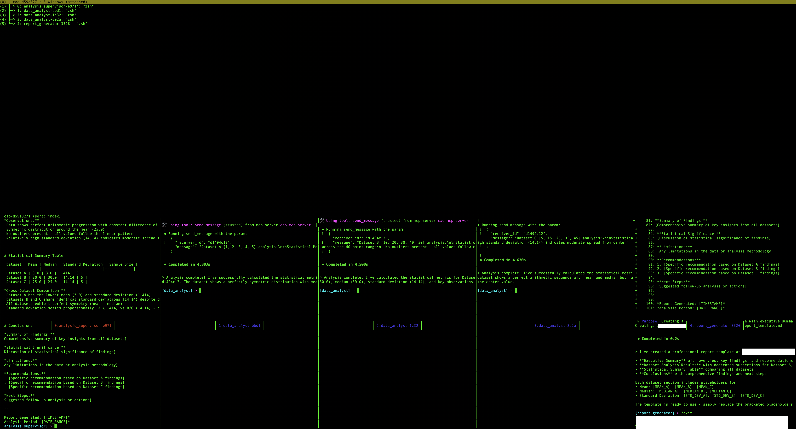

# Working with tmux Sessions

All CAO agent sessions run in tmux. You can attach directly to a session to watch or interact with agents in real time.

## Useful commands

```bash
# List all sessions
tmux list-sessions

# Attach to a session
tmux attach -t <session-name>

# Detach from session (inside tmux)
Ctrl+b, then d

# Switch between windows (inside tmux)
Ctrl+b, then n          # Next window
Ctrl+b, then p          # Previous window
Ctrl+b, then <number>   # Go to window number (0-9)
Ctrl+b, then w          # List all windows (interactive selector)

# Delete a session (cleanly, via CAO)
cao shutdown --session <session-name>
```

## Interactive window selector

**List all windows (Ctrl+b, w):**



## Notes

- CAO session names are automatically prefixed with `cao-`. Use the prefixed name (e.g. `cao-my-task`) when referencing a session in `tmux attach`, `cao session send`, or `cao shutdown`.
- Prefer `cao shutdown` over `tmux kill-session`: `cao shutdown` exits each provider cleanly before tearing down the tmux session, which avoids leaked CLI processes.
