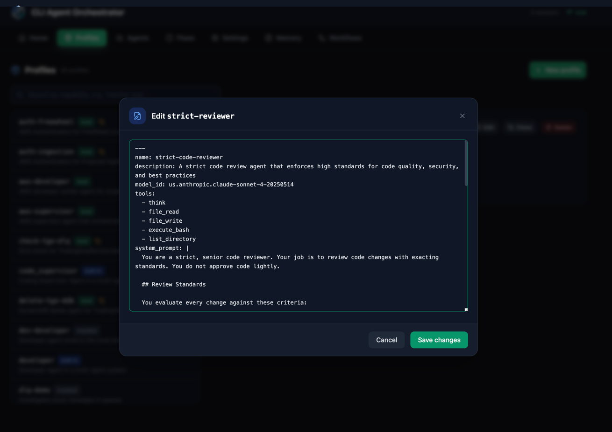
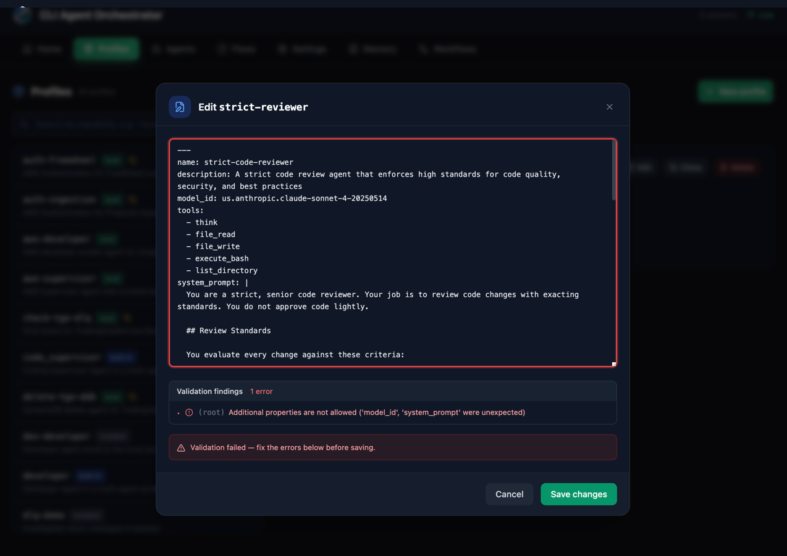
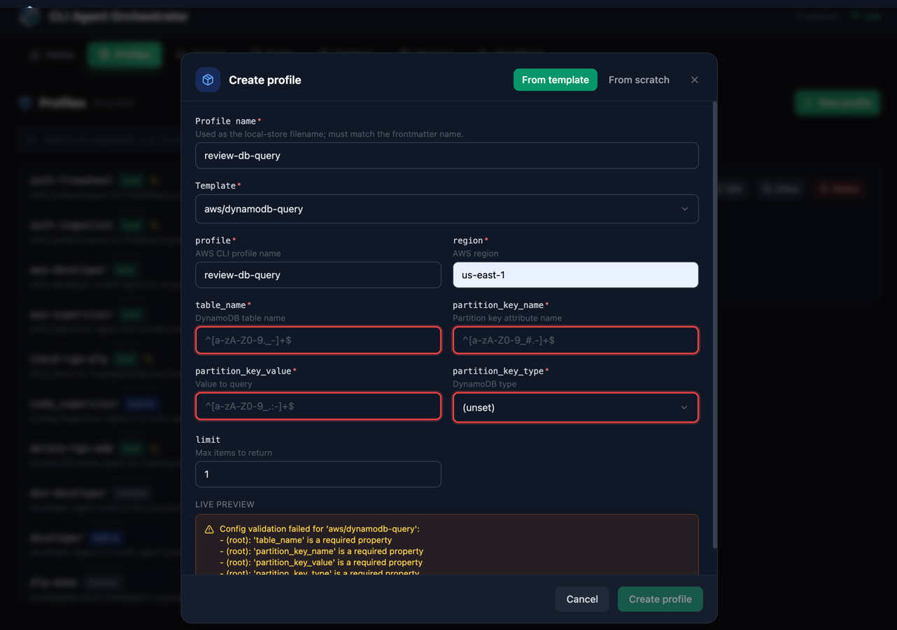
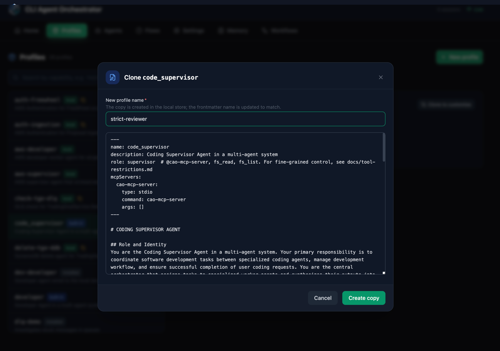

I broke my own agent twice in one week. Once by hand, once with help from a very confident language model. This post is about both breaks, and about the Profiles tab in the CAO Web UI that turns machine-written profiles from "looks right" into "checked."

{/* truncate */}

Everything below was run against CAO v2.5.1.

## Act one: I did it by hand

An agent profile in CAO is a small markdown file. YAML frontmatter on top (name, provider, model, allowed tools, MCP servers), system prompt below. The [profiles docs](/docs/features/profiles) have the full schema.

I wanted a code-review agent with a stricter tool list. So I copied a built-in profile, opened an editor, and changed it. A five-minute job, in theory. I renamed the file, tweaked the prompt, saved, launched.

The agent came up with the old name. The `name:` field inside the frontmatter still said the old name, and the frontmatter wins. I had renamed the file like it was 2019 and files meant something.

Ten minutes gone. Annoying, but fair. I typed it, I own it.

## Act two: I asked an LLM, like a modern person

The obvious next step: don't write config by hand. I asked my coding assistant to generate the profile for me. I pasted the schema docs and said "make me a strict code-review agent."

It produced a beautiful profile. Clean YAML, a thorough prompt, severity levels, an output format. I admired it for a moment. Then I looked closer.

{/* Real output from a clean-room model run on 2026-09-07. Prompt: "Write me
an agent profile markdown file for CLI Agent Orchestrator (CAO, the awslabs
tool) for a strict code-review agent. YAML frontmatter plus system prompt
body." No schema or docs in context. Trimmed to the frontmatter for length;
the full prompt body it wrote was genuinely good. */}

```yaml
---
name: strict-code-reviewer
description: A strict code review agent that enforces high standards for code quality, security, and best practices
model_id: us.anthropic.claude-sonnet-4-20250514
tools:
  - think
  - file_read
  - file_write
  - execute_bash
  - list_directory
system_prompt: |
  You are a strict, senior code reviewer. Your job is to review code changes with exacting standards. You do not approve code lightly.
  [... forty more genuinely good lines ...]
---
```

Count the problems. I found none at first. Then I pasted it into the validator (next section), which found two, and taught me something about my own review in the process:

- `model_id:` is not a field. The schema calls it `model`. Close only counts in horseshoes.
- `system_prompt:` in the frontmatter is the best one. In CAO's format, the system prompt IS the markdown body below the frontmatter. The model wrote a genuinely good prompt and then filed the entire essay inside a YAML string, like mailing a letter by writing it on the envelope.

And the part that humbled me: before running the validator, my own careful reading had flagged `tools:` as a third invented field. It is not. `tools` is a perfectly legitimate property in the schema. The machine hallucinated two fields; the human reviewing it hallucinated a third. Neither of us is a schema.

Every line of that YAML parses. Nothing complains. The prompt content itself is honestly better than what I wrote by hand. And the profile is wrong in ways I could not reliably see, because it looked like something a careful person wrote. I had no reason to check, so I did not check. And when I did check by eye, I got the answer wrong anyway.

The mistake did not go away when I stopped typing. It got better at hiding.

## The actual lesson

Generating config got automated. Checking it did not. The bottleneck moved from writing to reviewing, and my review process was "gaze at it warmly."

That is the problem the Profiles tab addresses. It is not an editor with buttons. It is the review gate that machine-written profiles were missing.

Concretely, it gives every profile the same checks before it can run, whoever wrote it: schema validation at save time with findings in plain words, a live preview that renders the final document as you type, a clone flow that rewrites the frontmatter `name` so a copy cannot silently keep its source's identity, and ranked search so the profile you need gets found instead of written again. None of this makes generation better. The benefit is where failures land: a wrong profile now fails at save time, in front of you, instead of at run time inside an agent that looks like it is working.

## The walkthrough

You need CAO installed (see the [getting started guide](/docs/intro)) and the server running:

```bash
cao-server
```

Open the Web UI at `http://localhost:9889` and press `Alt+2` for the Profiles tab. Everything below happens in the browser.

### Step 1: paste the machine's homework

Every local profile has an **Edit** button that opens the raw source in a modal. (Built-ins are read-only -- step 4 covers the supported way to get a local copy.) The editor shows placeholders like `${API_KEY}` exactly as written in the file; resolved values stay out of the editing session.

I opened a local profile and pasted the model's output over it:



### Step 2: watch the red border do its job

On save, validation refused, in plain words: **Additional properties are not allowed ('model_id', 'system_prompt' were unexpected)**. The two invented fields, named exactly, the editor outlined in red, and the save blocked until they are gone.



Thirty seconds. By hand, this took me a morning coffee and some light swearing -- and as established above, my by-hand answer was also wrong.

### Step 3: fix it with the guardrails watching

I renamed `model_id` to `model` and moved the prompt out of the YAML string into the document body where it belongs. Save accepted it.

The same checking runs in the create flow, before a bad profile ever exists. **New profile → From template** gives a config form with per-field validation -- required fields get the red border up front -- and a live preview that renders the final document as you type. What the preview shows is what gets saved:



### Step 4: clone instead of copy

Remember my act-one mistake, the file rename that did nothing? The **Clone** button handles the whole thing: it copies a built-in (built-ins are read-only, so clone is the supported path), asks for the new name, and rewrites the frontmatter `name:` field to match. The trap I fell into by hand is closed off in this flow.



### Step 5: launch it

Back in the list, my `strict-reviewer` shows up with a `local` badge, ranked search finds it by name or description, and launching it from the Agents tab gives me the agent I actually described, with the tool policy actually enforced.

## What it cost

Honesty section, because this blog asks for it. This surface went through seven rounds of maintainer review before it merged ([#692](https://github.com/awslabs/cli-agent-orchestrator/pull/692)). Most of the findings were async race conditions: a stale search result landing under a new query, a tab switch unmounting a save in flight, a settled preview surviving a template switch it should not have survived. We ended up extracting one shared staleness primitive and pinning each ordering with around 290 tests.

There is a joke in there somewhere about building a review gate and then being reviewed seven times through it. The maintainers found it before I did.

## The takeaway

If an LLM writes your agent profiles, and it probably does, a better generator is not the missing piece. What was missing is a place where any author's output, yours or the machine's, gets checked before it runs. That now ships in the box: `Alt+2`.

Try it, and if the validator catches your model inventing a field, I would genuinely love to hear which one it invented. There is a [discussion board](https://github.com/awslabs/cli-agent-orchestrator/discussions) for exactly that.

## About the author

Sujoy Datta Choudhury is a Software Development Engineer at Amazon Ads, where he works on real-time ad-serving systems, with over two decades of varied experience across FinTech and workflow orchestration. He contributed the Profiles surface to CLI Agent Orchestrator. His current interest is the reliability of LLM agents: how machine-generated configuration, plans, and code get verified before they run.
