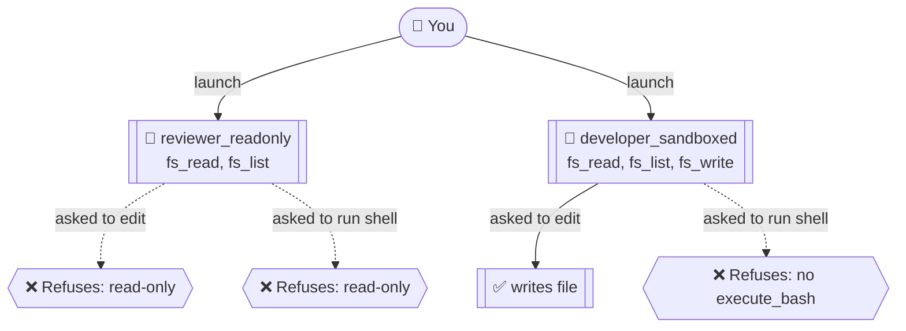

# Tool Restrictions Example

This example shows how to scope what an agent can do via the **`role`** + **`allowedTools`** fields in agent profile frontmatter. CAO translates these into each provider's native enforcement mechanism — see [`docs/tool-restrictions.md`](../../docs/tool-restrictions.md) for the full vocabulary, role defaults, and per-provider enforcement table (5 of 8 providers enforce hard, the rest are best-effort prompt-level).

## What this demonstrates

- A **read-only reviewer** that has `fs_read` and `fs_list` but no `fs_write` and no `execute_bash`.
- A **sandboxed developer** that can edit files but cannot run shell commands — built by starting from `role: developer` and explicitly omitting `execute_bash` from `allowedTools`.
- That an explicit `allowedTools` list **overrides the role default** when both are present.



## Profiles

- [`reviewer_readonly.md`](reviewer_readonly.md) — `role: reviewer` + explicit allowlist of `fs_read`, `fs_list`, `@cao-mcp-server`.
- [`developer_sandboxed.md`](developer_sandboxed.md) — `role: developer` overridden to drop `execute_bash` while keeping file edits.

The relevant frontmatter:

```yaml
allowedTools:
  - "@builtin"
  - "fs_read"
  - "fs_list"
  - "@cao-mcp-server"
```

## Setup

```bash
# 1. Start the CAO server (in one terminal)
cao-server

# 2. Install the profiles
cao install examples/tool-restrictions/reviewer_readonly.md
cao install examples/tool-restrictions/developer_sandboxed.md
```

## Run — read-only reviewer refuses to edit

```bash
cao launch --agents reviewer_readonly --headless --yolo \
  --session-name tr-reviewer \
  "Edit README.md to add a hello-world section."
```

**Expected:** the agent refuses, explains it has read-only tools, and recommends the change as a reviewer comment instead.

## Run — sandboxed developer refuses to run a shell command

```bash
cao launch --agents developer_sandboxed --headless --yolo \
  --session-name tr-developer \
  "Run 'pytest' and report the result."
```

**Expected:** the agent refuses, explains `execute_bash` isn't in its tool set, and asks for someone less restricted to run the command.

## Cleanup

```bash
cao shutdown --session cao-tr-reviewer
cao shutdown --session cao-tr-developer
```

## Verification (e2e)

The cross-provider hard-enforcement surface (Kiro JSON allow-list, Claude `--disallowedTools`, Gemini policy-engine TOML deny rules, Codex/Kimi prompt-injection) is already covered by [`test/e2e/test_allowed_tools.py`](../../test/e2e/test_allowed_tools.py). Run it with:

```bash
uv run pytest -m e2e test/e2e/test_allowed_tools.py -v -o "addopts="
```

## See also

- [`docs/tool-restrictions.md`](../../docs/tool-restrictions.md) — full reference for `role`, `allowedTools`, and per-provider enforcement.
- [README → Tool Restrictions](../../README.md#tool-restrictions) — top-level overview and `--yolo` / `--auto-approve` flags.
