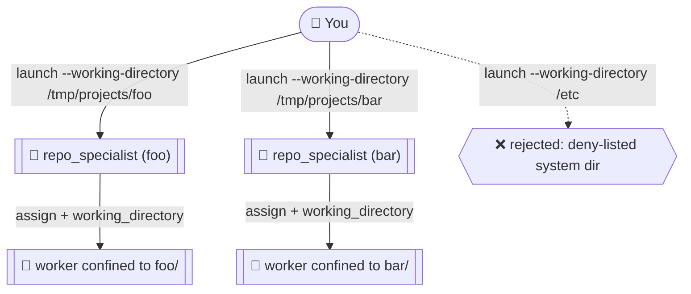

# Working Directory Example

This example shows how to scope agent terminals (and the workers they spawn) to a specific filesystem path. The feature is **off by default** — set `CAO_ENABLE_WORKING_DIRECTORY=true` to enable it. See [`docs/working-directory.md`](../../docs/working-directory.md) for the full security policy and per-API parameter reference.

## What this demonstrates

- Two supervisors, each pinned to a different real project directory, working in parallel.
- Path canonicalization: `~/`, relative paths, and symlinks are resolved via `realpath` before validation.
- The deny-list: launching against a system path (e.g. `/etc`) is rejected.



## Profile

- [`repo_specialist.md`](repo_specialist.md) — supervisor that propagates its own working directory to every worker it spawns.

## Setup

```bash
# 1. Start the CAO server with working-directory support enabled
CAO_ENABLE_WORKING_DIRECTORY=true cao-server

# 2. Install the profile
cao install examples/working-directory/repo_specialist.md

# 3. Make two real project directories to work against
mkdir -p /tmp/projects/foo /tmp/projects/bar
echo "FOO project" > /tmp/projects/foo/README.md
echo "BAR project" > /tmp/projects/bar/README.md
```

## Run — two supervisors, two repos, in parallel

```bash
# Supervisor A: pinned to /tmp/projects/foo
cao launch --agents repo_specialist --headless --async --yolo \
  --session-name wd-foo --working-directory /tmp/projects/foo \
  "Summarize the contents of README.md in this repo."

# Supervisor B: pinned to /tmp/projects/bar
cao launch --agents repo_specialist --headless --async --yolo \
  --session-name wd-bar --working-directory /tmp/projects/bar \
  "Summarize the contents of README.md in this repo."

# Watch both progress
cao session list
cao session status cao-wd-foo --workers
cao session status cao-wd-bar --workers
```

**Expected:** Each supervisor only sees its own repo's `README.md`. Workers spawned via `assign`/`handoff` inherit the path.

## Run — verify the deny-list

```bash
cao launch --agents repo_specialist --headless --yolo \
  --session-name wd-denied --working-directory /etc \
  "Hello."
```

**Expected:** the API rejects the launch with a 400 because `/etc` is on the deny-list. Other denied paths: `/`, `/var`, `/tmp` itself, `/proc`, `/sys`, `/root`, `/boot`, `/bin`, `/sbin`, `/usr/bin`, `/usr/sbin`, `/lib`, `/lib64`, `/dev`. (Subdirectories of `/tmp` like `/tmp/projects/foo` are fine — only the bare `/tmp` is blocked.)

## Cleanup

```bash
cao shutdown --session cao-wd-foo
cao shutdown --session cao-wd-bar
rm -rf /tmp/projects
```

## See also

- [`docs/working-directory.md`](../../docs/working-directory.md) — env-var gate, deny-list, API parameter, per-MCP-tool exposure.
- [README → Working Directory Support](../../README.md#working-directory-support) — top-level overview.
